# Cartographie intégrale — Projet M5Stack Tab5 V2 (HMI ESPHome/LVGL)

> **[AI-CONTEXT] PRÉSENTATION ET RÔLE DE CE FICHIER**
> Ce fichier est la cartographie officielle du projet Tab5. Il a été créé **spécifiquement pour guider les agents IA** (Claude, Gemini, etc.) dans leur compréhension de l'architecture du firmware.
> Au lieu de lire et d'analyser à l'aveugle les dizaines de fichiers YAML et C++, **l'IA doit lire cette cartographie en premier**. Elle y trouvera l'arbre des dépendances (7-YAML), la répartition des rôles entre le YAML et le C++, ainsi que l'historique des bugs résolus et de la dette technique. Cela évite les hallucinations et le temps perdu en rétro-ingénierie.

`Généré le 2026-07-06` · `maj: 2026-07-12` · Sources vérifiées directement dans le code (`00ProjetTab/`), croisées avec `Tab5/README.md` (réécrit le 05/07/2026 contre le firmware réel), `contexte_ia/04_Projets/etat_tab5.md` et `contexte_ia/02_Hardware/rules_esphome.md`. Aucun fait ci-dessous n'est tiré d'une supposition — chaque ligne cite le fichier source lu.

Repo Git distinct : `Axellum/M5-Tab5-ESPHome-LVGL` (dossier local `00ProjetTab/`), branche `main`.

---

## 1. Vue d'ensemble en une phrase

Un tableau de bord domotique 60 FPS + satellite vocal local tournant **entièrement en firmware C++/LVGL** sur un M5Stack Tab5 V2 (ESP32-P4), architecture **YAML modulaire par domaine** (7 packages + `ui_components/`), **push-only** depuis Home Assistant (zéro polling), avec toute la logique non-triviale centralisée dans deux fichiers C++ (`tab5_custom.h/.cpp`).

---

## 2. Diagramme Mermaid — arbre des dépendances

```mermaid
graph TD
    ENTRY["tab5-ha-hmi.yaml<br/>(point d'entrée, 146 lignes)<br/>substitutions + on_boot + api:/ota: + packages:"]

    subgraph PKG["Packages ESPHome (Tab5/*.yaml)"]
        HW["tab5-hardware.yaml<br/>306 lignes<br/>display/touch/i2c/audio/esp32_hosted"]
        SENS["tab5-sensors.yaml<br/>670 lignes (LE PLUS GROS)<br/>wifi:/switch:/sensor:/text_sensor:/select:/time:"]
        API["tab5-api-logic.yaml<br/>466 lignes<br/>api: services: (contrat HA)"]
        STY["tab5-styles.yaml<br/>304 lignes<br/>color:/font:/lvgl: style_definitions"]
        GLOB["tab5-globals.yaml<br/>129 lignes<br/>globals: + rotateur carte centrale (8s)"]
        SCR["tab5-scripts.yaml<br/>29 lignes<br/>script: (debounce, séquences)"]
        LVGL["tab5-lvgl.yaml<br/>407 lignes<br/>page_main + gestes swipe"]
    end

    subgraph UI["ui_components/*.yaml (16 fichiers, inclus par tab5-lvgl.yaml)"]
        MOIST["moisture_sensors.yaml (51L)"]
        CLIMCARD["climate_card.yaml (95L)"]
        CLIMPOP["climate_popup.yaml (234L)<br/>NON factorisé, grille 3×3"]
        CLIMBTN["climate_hvac_mode_btn.yaml (17L)<br/>climate_preset_toggle_btn.yaml (17L)<br/>templates paramétrés !include+vars"]
        FDAILY["forecast_daily.yaml (276L)"]
        FDTAB["forecast_day_title_tab.yaml (10L)<br/>forecast_day_temp_tab.yaml (26L)<br/>templates paramétrés"]
        FHOUR["forecast_hourly.yaml (19L)<br/>forecast_hour_card.yaml (70L)"]
        SWCARD["switches_card.yaml (189L)"]
        SWTAB["switch_card_title_tab.yaml (8L)<br/>switch_card_state_tab.yaml (8L)"]
        CONSOLE["console_sys.yaml (221L)<br/>diagnostics + reboot double-tap"]
        LIGHTPOP["light_popup.yaml (141L)"]
        LIGHTBTN["light_color_preset_btn.yaml (26L)"]
    end

    subgraph CPP["C++ (esphome: includes:)"]
        HFILE["tab5_custom.h (128L)<br/>déclarations, structs, UIColor::, MeteoIcon::"]
        CFILE["tab5_custom.cpp (520L)<br/>toute la logique LVGL non-triviale"]
    end

    subgraph HWCOMP["Composants matériels (natifs + custom)"]
        MIPIDSI["display: mipi_dsi<br/>M5STACK-TAB5-V2, 1280×720, 16bit RGB565"]
        ST7123TOUCH["my_components/st7123/touchscreen/<br/>st7123_touchscreen.cpp/.h<br/>(composant custom I2C, ACTIF)"]
        ST7123BTN["my_components/st7123/binary_sensor/<br/>st7123_button.cpp/.h<br/>(composant custom, JAMAIS INSTANCIÉ)"]
        PI4IOE["pi4ioe5v6408 ×2 (pi4ioe1/pi4ioe2)<br/>GPIO expander I2C — reset écran/tactile, alim WiFi/ampli"]
        ES8388["audio_dac: es8388 (sortie haut-parleur)"]
        ES7210["audio_adc: es7210 (entrée micro)"]
        HOSTED["esp32_hosted (co-proc esp32c6, WiFi via SPI)"]
        MWW["micro_wake_word (okay_nabu, TFLite local)"]
        VA["voice_assistant (pipeline HA)"]
    end

    subgraph HASIDE["Côté Home Assistant (HomeAssistant_Config/, gitignoré=config réelle)"]
        AUTO["automations_tab5.yaml (468L, gitignoré)<br/>push météo/clim/planning/alertes/plantes"]
        SCRHA["scripts_tab5.yaml (100L, gitignoré)"]
        TPLHA["template_sensors_meteo_tab5.yaml (49L, gitignoré)"]
    end

    ENTRY -->|packages:| HW
    ENTRY -->|packages:| SENS
    ENTRY -->|packages:| API
    ENTRY -->|packages:| STY
    ENTRY -->|packages:| GLOB
    ENTRY -->|packages:| SCR
    ENTRY -->|packages:| LVGL
    ENTRY -->|includes:| HFILE
    ENTRY -->|includes:| CFILE

    HW -->|external_components:<br/>path local| ST7123TOUCH
    HW -.->|composant déclaré<br/>mais platform jamais utilisée| ST7123BTN
    HW --> MIPIDSI
    HW --> PI4IOE
    HW --> ES8388
    HW --> ES7210
    HW --> HOSTED
    HW --> MWW
    HW --> VA
    ST7123TOUCH -->|reset_pin via| PI4IOE
    MIPIDSI -->|reset_pin via| PI4IOE

    LVGL --> MOIST
    LVGL --> CLIMCARD
    LVGL --> FDAILY
    LVGL --> FHOUR
    LVGL --> SWCARD
    LVGL --> CONSOLE
    LVGL --> CLIMPOP
    LVGL --> LIGHTPOP

    CLIMPOP -->|!include+vars| CLIMBTN
    FDAILY -->|!include+vars| FDTAB
    FHOUR -->|!include+vars| FHOUR
    SWCARD -->|!include+vars| SWTAB
    LIGHTPOP -->|!include+vars| LIGHTBTN

    LVGL -->|lambdas appellent| CFILE
    API -->|lambdas appellent| CFILE
    SENS -->|lambdas appellent| CFILE
    UI -->|lambdas appellent| CFILE
    GLOB -->|lambda transition_widgets| CFILE

    AUTO -->|homeassistant.service<br/>tab5_maj_*| API
    API -->|expose api: services:| AUTO
```

---

## 3. Inventaire strict des fichiers

### 3.1 Point d'entrée

| Fichier | Rôle exact | Gère | Dépend de |
|---|---|---|---|
| `tab5-ha-hmi.yaml` (146L) | Point d'entrée ESPHome. `substitutions: !include Tab5/user_entities.yaml` (gitignoré, modèle `user_entities.example.yaml`), séquence `on_boot:` en 2 priorités (700 puis 600), `packages:` qui importe les 7 fichiers `Tab5/*.yaml`, `esphome: includes:` pour le C++. | Boot, orchestration des packages | `Tab5/user_entities.yaml`, `Tab5/tab5_custom.h/.cpp`, tous les `Tab5/*.yaml` |

Point notable vérifié dans le code : le délai bloquant `on_boot:priority:700: lambda: delay(1000);` est la **cause racine confirmée** (06/07/2026, 5 tests OTA avec Axel présent) du bug historique « écran noir après reboot logiciel » — le `reset_pin` de l'écran passe par le GPIO expander I2C `PI4IOE5V6408`, qui a besoin de temps pour se stabiliser après boot avant que le reset ait un effet fiable. Documenté en détail dans `tab5-hardware.yaml:33-69`.

### 3.2 Packages ESPHome (`Tab5/*.yaml`)

| Fichier | Lignes | Rôle exact | Gère | Dépend de |
|---|---|---|---|---|
| `tab5-hardware.yaml` | 306 | Bas niveau : bus display/touch, init I2C DAC ES8388, I2S haut-parleur/micro, expander GPIO PI4IOE5V6408, `esp32_hosted` (co-proc WiFi ESP32-C6 via SPI), `micro_wake_word`/`voice_assistant`, `ota:` | Hardware, audio, wake-word, OTA | `external_components: my_components/st7123` |
| `tab5-sensors.yaml` | 670 (**le plus gros fichier du projet**) | `wifi:`, tous les `sensor:`/`text_sensor:`/`binary_sensor:`/`switch:`/`select:` exposés à l'API : diagnostics système (RAM/PSRAM/uptime/WiFi), humidité 5 plantes (triées dynamiquement), miroirs d'état lumière/PC/volet, wiring volume | Réseau WiFi, capteurs physiques et miroirs d'entités HA | `tab5_custom.h` (fonctions `get_temperature_color`, `get_humidity_color`, `sort_and_update_moisture_slots`, `update_light_card_ui`) |
| `tab5-api-logic.yaml` | 466 | Le contrat réel avec HA : bloc `api: services:`. Chaque service `tab5_maj_*` reçoit un payload d'une automation HA et appelle une fonction `tab5_custom.cpp` via lambda | Contrat API HA↔Tab5 (clim, volet, planning, alertes météo France, prévisions bulk, pluie 1h) | `tab5_custom.h/.cpp`, IDs LVGL définis dans `tab5-lvgl.yaml`/`ui_components/*.yaml` |
| `tab5-styles.yaml` | 304 | Thème "Dark Mode Slate" (glassmorphism) : tokens `color:`, déclarations `font:` (Roboto + MDI + police météo custom), `lvgl: style_definitions:` | Palette visuelle, typographie, styles réutilisables | Polices `Tab5/materialdesignicons-webfont.ttf`, `Tab5/IconeMeteo.ttf` |
| `tab5-globals.yaml` | 129 | Tout l'état partagé entre fichiers (`globals:`) + l'`interval: 8s` qui fait tourner la carte centrale (planning/pluie/alertes) | État global partagé, rotateur carte centrale | `tab5_custom.cpp` (`transition_widgets()`) |
| `tab5-scripts.yaml` | 29 | Scripts ESPHome réutilisables : affichage temporaire planning, debounce slider volume (150ms) | Séquences temporisées | `globals:` (`system_volume`, `is_showing_temp_planning`) |
| `tab5-lvgl.yaml` | 407 | Layout complet : page unique 1280×720 (`page_main`), gestion des gestes swipe (haut=console, bas=fermer, gauche/droite=pagination prévisions 0-4), boutons statut/mode vocal/horloge, carte centrale, pagination | Layout racine, navigation gestuelle | Tous les `ui_components/*.yaml`, `tab5_custom.cpp` (`refresh_daily_forecast`, `refresh_hourly_forecast`) |

### 3.3 C++ core

| Fichier | Lignes | Rôle exact | Fonctions clés |
|---|---|---|---|
| `tab5_custom.h` | 128 | Déclarations, structs (`DayForecastData`, `HourForecastData`, `WeatherHourSlot`, `WeatherDaySlot`, `MoistureSlotUI`), namespace `MeteoIcon::` (codes UTF-8 police météo), namespace `UIColor::` (palette sémantique — **miroir exact des tokens `color:` YAML, à garder synchro manuellement**) | — |
| `tab5_custom.cpp` | 520 | Toute la logique LVGL non-triviale, gardée contre les `lv_obj_t*` nuls (LVGL pas encore initialisé) | `update_meteo_icon()` (icônes météo double-couche), `get_humidity_color()`/`get_temperature_color()` (gradients colorimétriques continus), `parse_and_update_heures_bulk()`/`parse_and_update_jours_bulk()` (parsing `strtok_r` in-place, garde OOM à 2048 octets), `refresh_daily_forecast()`/`refresh_hourly_forecast()`, `update_light_card_ui()` (factorisée #T164, ex-triplée), `sort_and_update_moisture_slots()` (tri bubble 5→4 slots), `transition_widgets()` (animation glissement+fondu 450ms) |

**Règle d'architecture vérifiée et respectée dans le code** (`Tab5/README.md:44`) : les `sensor:`/`text_sensor:` YAML ne manipulent jamais `lv_obj_*` directement — ils appellent toujours une fonction `tab5_custom.cpp`. Confirmé par lecture de `tab5-sensors.yaml` (tous les `on_value:` appellent une fonction C++ nommée, sauf les cas triviaux de couleur d'icône à 2-3 lignes qui restent inline).

### 3.4 Composants UI (`ui_components/*.yaml`, 16 fichiers inclus par `tab5-lvgl.yaml`)

| Fichier | Lignes | Rôle | Statut factorisation |
|---|---|---|---|
| `climate_card.yaml` | 95 | Carte clim compacte (dashboard principal) | — |
| `climate_popup.yaml` | 234 | Popup fullscreen clim, grille 3×3 (9 boutons mode/preset) | **Partiellement factorisé** (#T164, 06/07) : 6/9 boutons via `climate_hvac_mode_btn.yaml`/`climate_preset_toggle_btn.yaml`. Les 3 restants (`off`, `swing`, `quiet`) + les 2 boutons +/- température volontairement non factorisés (service HA différent par bouton, décision explicite documentée dans `etat_tab5.md`) |
| `climate_hvac_mode_btn.yaml` | 17 | Template paramétré (`!include`+`vars`) pour bouton mode HVAC | Template réutilisé 4× |
| `climate_preset_toggle_btn.yaml` | 17 | Template paramétré pour bouton preset (eco/boost) | Template réutilisé 2× |
| `forecast_daily.yaml` | 276 | 5 cartes prévisions journalières (fenêtre glissante sur 15 jours) | Onglets titre/température factorisés via `forecast_day_title_tab.yaml`/`forecast_day_temp_tab.yaml` ; le "corps sombre + action" par carte reste dupliqué 5× (actions HA différentes par carte, cf. §4) |
| `forecast_day_title_tab.yaml` | 10 | Template onglet titre jour | Réutilisé 5× |
| `forecast_day_temp_tab.yaml` | 26 | Template onglet température jour | Réutilisé 5× |
| `forecast_hourly.yaml` | 19 | Conteneur 5 cartes prévisions horaires | `!include`+`vars`, 365→19 lignes après factorisation (historique PR #7) |
| `forecast_hour_card.yaml` | 70 | Template carte horaire individuelle | Réutilisé 5× |
| `switches_card.yaml` | 189 | Cartes switches (PC, volet, lumières) | Onglets titre/état factorisés via `switch_card_title_tab.yaml`/`switch_card_state_tab.yaml` ; actions par carte laissées en clair (logique différente par carte) |
| `switch_card_title_tab.yaml` | 8 | Template onglet titre switch | Réutilisé 3× |
| `switch_card_state_tab.yaml` | 8 | Template onglet état switch | Réutilisé 3× |
| `console_sys.yaml` | 221 | Overlay diagnostic (SRAM/PSRAM/fragmentation/IP/SSID/loop time), reboot par double-tap | — |
| `light_popup.yaml` | 141 | Popup contrôle lumière (couleur, luminosité) | Presets couleur factorisés via `light_color_preset_btn.yaml` (8 instances) |
| `light_color_preset_btn.yaml` | 26 | Template preset couleur lumière | Réutilisé 8× |
| `moisture_sensors.yaml` | 51 | 4 slots UI humidité plantes (tri dynamique sur 5 capteurs BLE) | — |

### 3.5 Composant matériel custom (`my_components/st7123/`)

| Fichier | Lignes | Rôle | Statut |
|---|---|---|---|
| `st7123/__init__.py` | 6 | Déclaration du namespace ESPHome + dépendance `i2c` | Actif |
| `st7123/touchscreen/st7123_touchscreen.cpp/.h` | 100 + 59 | Pilote tactile custom pour le contrôleur I2C ST7123 (jusqu'à 10 points de touche simultanés, registres `REG_GET_TOUCH_INFO`/`REG_GET_TOUCH`) | **Utilisé** — instancié dans `tab5-hardware.yaml:121` (`touchscreen: platform: st7123`) |
| `st7123/binary_sensor/st7123_button.cpp/.h` | 27 + 28 | Pilote pour un bouton physique lié au même contrôleur | **CODE MORT confirmé par grep** — aucun `binary_sensor: platform: st7123` nulle part dans le YAML actif (`tab5-hardware.yaml`, `tab5-sensors.yaml`). Seule la version obsolète `Tab5_backup_20260525/tab5-hardware.yaml` le référence |

### 3.6 Côté Home Assistant (`HomeAssistant_Config/`)

Tous ces fichiers sont **gitignorés** (`.gitignore:20-23`) — ce sont les vrais fichiers de prod d'Axel, non versionnés dans le repo public. Seuls les `*_examples.yaml*` (placeholders génériques) sont trackés.

| Fichier | Lignes | Rôle |
|---|---|---|
| `automations_tab5.yaml` | 468 (gitignoré) | Automation push principale : météo 7j, pluie horaire, températures/humidité, clim, planning Google Calendar, alertes Météo-France, humidité plantes. Pacing `delay: 1s` entre blocs, `150ms` dans les boucles |
| `scripts_tab5.yaml` | 100 (gitignoré) | Scripts déclenchés **par** le Tab5 (bouton physique → action HA) |
| `template_sensors_meteo_tab5.yaml` | 49 (gitignoré) | Pré-traitement Météo-France côté HA (phrase météo courte) avant envoi au device |

### 3.7 CI/CD et documentation

| Fichier | Rôle |
|---|---|
| `.github/workflows/esphome-tab5.yml` | CI GitHub Actions : génère un `secrets.yaml` factice, compile via `esphome/build-action@v7.3.0`, upload le firmware en artifact |
| `README.md` (racine) | Doc utilisateur bilingue EN/FR, à jour, décrit les 6 écrans et les choix d'architecture |
| `Tab5/README.md` | **Réécrit le 05/07/2026**, description fichier-par-fichier + table des services API + table des globals + 6 règles de code — vérifié ligne à ligne contre le firmware réel le jour de l'écriture |
| `docs/*.md` (9 fichiers) | `architecture.md`, `hardware.md`, `ui_design.md`, `voice_assistant.md`, `installation.md`, `screens.md`, `related_projects.md`, `LVGL_PREMIUM_TEMPLATES.md`, plus 3 rapports d'audit LLM (`analyse_esphome_auto.md`, `analyse_globale_tab5_v2.md`, `audit_rapport_final.md`, `Audit Exhaustif...md`) |

---

## 4. Points de friction / dette technique

`maj: 2026-07-12` · Classés par impact décroissant. Points résolus depuis la rédaction initiale (06/07) sont barrés ou déplacés en §4.6.

### 4.1 Dette de repository

- ~~**`Tab5_backup_20260525/` trackée en Git**~~ — **RÉSOLU** (PR [#15](https://github.com/Axellum/M5-Tab5-ESPHome-LVGL/pull/15), 06/07/2026).
- ~~**`__pycache__/*.pyc` trackés**~~ — **RÉSOLU** (PR [#30](https://github.com/Axellum/M5-Tab5-ESPHome-LVGL/pull/30), 07/12/2026) : retirés du dépôt + ajoutés au `.gitignore`.
- **`archives/` (gitignoré, ~4 Mo local)** — hors Git ; peut polluer le contexte si un outil IA scanne sans respecter `.gitignore`.
- **Entités HA personnelles** — **RÉSOLU** (PR #30) : déplacées vers `Tab5/user_entities.yaml` (gitignoré) ; le dépôt public ne contient que `user_entities.example.yaml`.

### 4.2 Code mort / API incomplète

- ~~**`my_components/st7123/binary_sensor/` jamais instancié**~~ — **RÉSOLU** (PR #15).
- ~~**`tab5_maj_info_texte` (lambda vide)**~~ — **RÉSOLU** (07/12/2026) : service retiré (jamais appelé côté HA, aucun widget LVGL cible).
- **Doublon `cal_jour_nom[15]`/`cal_heures[15]`** dans `tab5_custom.cpp` — legacy `// Rétrocompatibilité`, encore utilisé par `refresh_daily_forecast()` pour le toggle calendrier. Nettoyage possible si confirmé redondant avec `cal_jours_data[]`.
- **Blocs commentés** dans `tab5-api-logic.yaml` (`tab5_maj_clim`) — vestiges `icon_clim_*` de l'ancienne carte compacte ; à supprimer après grep confirmant l'absence des IDs dans `climate_card.yaml`/`tab5-lvgl.yaml`.

### 4.3 Règles du projet — état actuel

- ~~**Hex en dur dans `tab5_maj_clim`**~~ — **RÉSOLU** (PR #15) : tokens `UIColor::CLIM_*`. Reste : quelques hex dans `tab5_custom.cpp` (icônes météo, barres pluie) hors namespace `UIColor::` — P3.
- **`pressed: bg_opa: 30%` répété sur les boutons verre** — contrainte ESPHome (`pressed:` non supporté dans `style_definitions:`), documenté dans `etat_tab5.md`.
- ~~**`tab5-images.yaml` fantôme**~~ — **RÉSOLU** (PR #15, fichier supprimé). Architecture effective = 6 packages + point d'entrée (plus de fichier `images`).

### 4.4 Fichiers volumineux

- **`tab5-sensors.yaml` (~567 lignes)** — repassé sous le seuil ~600 après factorisations ; candidat de scission diagnostics/domotique si #T164 reprend.
- **`tab5_custom.cpp` (~681 lignes)** — plusieurs responsabilités ; surveiller si découpage en unités de compilation devient nécessaire.
- **`climate_popup.yaml` (~234 lignes)** — non factorisé au-delà de 6/9 boutons (ADR-0007, choix assumé).

### 4.5 Volontairement non corrigé (ne pas « auditer » à nouveau)

- `atoi`/`atof` sans validation (~13 sites) — P3, sans symptôme (décision Axel 06/07).
- Délai bloquant `delay(1000)` à `on_boot:priority:700` — correctif confirmé écran noir, pas de la dette.
- Pagination prévisions sans wrap 0↔4 — comportement voulu (déjà reverté après faux positif audit LLM).

### 4.6 Résolu récemment (historique)

| Date | Item | PR |
|------|------|-----|
| 06/07 | Backup `Tab5_backup_20260525/`, binary_sensor st7123, hex clim → `UIColor::` | #15 |
| 06/07 | Cause racine écran noir (délai GPIO expander) | #13 |
| 07/12 | Split `user_entities.yaml`, retrait `tab5_maj_info_texte`, docs/images | #30+ |

---

## 5. Ce que la cartographie ne couvre pas

- Le contenu réel de `HomeAssistant_Config/automations_tab5.yaml` (gitignoré, config privée d'Axel) — seule sa description dans `HomeAssistant_Config/README.md` a pu être vérifiée, pas le payload exact envoyé aujourd'hui.
- Les rapports d'audit LLM existants dans `docs/` (`analyse_esphome_auto.md`, `audit_rapport_final.md`, etc.) n'ont pas été relus en détail ici — `etat_tab5.md` indique qu'ils ont déjà été synthétisés en tâches (#T161-#T169) le 05/07/2026, dont plusieurs traitées depuis. Les recopier ici aurait dupliqué un travail déjà fait.
