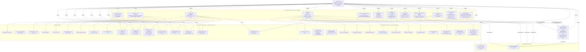

# Cartographie intégrale — Projet M5Stack Tab5 V2 (HMI ESPHome/LVGL)

> **[AI-CONTEXT] PRÉSENTATION ET RÔLE DE CE FICHIER**
> Ce fichier est la cartographie officielle du projet Tab5. Il a été créé **spécifiquement pour guider les agents IA** (Claude, Gemini, etc.) dans leur compréhension de l'architecture du firmware.
> Au lieu de lire et d'analyser à l'aveugle les dizaines de fichiers YAML et C++, **l'IA doit lire cette cartographie en premier**. Elle y trouvera l'arbre des dépendances (12 packages YAML + 9 modules C++ hors HMI), la répartition des rôles entre le YAML et le C++, ainsi que l'historique des bugs résolus et de la dette technique. Cela évite les hallucinations et le temps perdu en rétro-ingénierie.

`Généré le 2026-07-06` · `maj: 2026-08-01` · Sources vérifiées directement dans le code (`00ProjetTab/`), croisées avec `Tab5/README.md` (réécrit le 05/07/2026 contre le firmware réel), `contexte_ia/04_Projets/etat_tab5.md` et `contexte_ia/02_Hardware/rules_esphome.md`. Aucun fait ci-dessous n'est tiré d'une supposition — chaque ligne cite le fichier source lu.

Repo Git distinct : `Axellum/M5-Tab5-ESPHome-LVGL` (dossier local `00ProjetTab/`), branche `main`.

---

## 1. Vue d'ensemble en une phrase

Un tableau de bord domotique 60 FPS + satellite vocal local + **8 consoles de jeu arcade** (prototypes expérimentaux) tournant **entièrement en firmware C++/LVGL** sur un M5Stack Tab5 V2 (ESP32-P4), architecture **YAML modulaire par domaine** (12 packages + `ui_components/`), **push-only** depuis Home Assistant (zéro polling), avec la logique HMI centralisée dans `tab5_custom.h/.cpp` et chaque jeu dans son propre namespace C++ isolé.

---

## 2. Diagramme Mermaid — arbre des dépendances

```mermaid
graph TD
    ENTRY["tab5-ha-hmi.yaml<br/>(point d'entrée, 169 lignes)<br/>substitutions (user_entities) + on_boot + packages: + includes:"]

    subgraph PKG["Packages ESPHome (Tab5/*.yaml) — 12 packages"]
        TOK["tab5-ui-tokens.yaml<br/>tokens dimensionnels (modal_card_w/h, modal_body_y)"]
        HW["tab5-hardware.yaml<br/>448 lignes<br/>display/touch/i2c/audio/esp32_hosted/wake words (okay_nabu + Stop)/ota:"]
        SENSD["tab5-sensors-diagnostics.yaml<br/>287 lignes<br/>wifi:/alim GPIO/status_ha/uptime/RAM/loop time/select:/time:/interval:"]
        SENSO["tab5-sensors-domotique.yaml<br/>409 lignes<br/>plantes/lumières (+brightness live)/PC/températures/batterie/audio"]
        API["tab5-api-logic.yaml<br/>484 lignes<br/>api: services: (contrat HA, 14 services)"]
        STY["tab5-styles.yaml<br/>339 lignes<br/>color:/font:/lvgl: style_definitions + chess_pieces_80"]
        GLOB["tab5-globals.yaml<br/>168 lignes<br/>globals: + rotateur carte centrale (8s, planning/pluie/alertes/info + 4 bandeaux HA)"]
        SCR["tab5-scripts.yaml<br/>1058 lignes<br/>script: debounces + vocal + rotateur/dismiss + volet + popups + jeux open/close"]
        LVGL["tab5-lvgl.yaml<br/>709 lignes<br/>page_main + swipe prévisions + btns console/TV + !include jeux + sélecteur arcade"]
        IMU["tab5-imu.yaml<br/>136 lignes<br/>BMI270 motion: + poll adaptatif 10/30Hz + tap-to-wake"]
        HACTL["tab5-ha-controls.yaml<br/>175 lignes<br/>number volume + text_sensor écran courant + select aller-à + button recharger calendrier + interval rattrapage volume"]
        ALARM["tab5-alarm.yaml<br/>réveil : rtttl + 20 entités HA (switch/datetime/number/select/text)<br/>+ machine d'état sonnerie + tick 1s (réveil & annonce RDV)"]
    end

    ALARMC["alarm_clock.h/.cpp<br/>moteur réveil PUR : prochaine sonnerie (8 jours),
règles calendrier ouverture/fermeture, snooze, liste RDV, rendu LVGL<br/>lit cal_jours_data[] de tab5_custom.h — aucun id() ESPHome, aucun réseau"]

    subgraph UI["ui_components/*.yaml (30+ fichiers, inclus par tab5-lvgl.yaml)"]
        MOIST["moisture_sensors.yaml (64L)"]
        POTSPOP["pots_popup.yaml + pot_detail_card.yaml<br/>détails plantes : humidité/statut + EC/lux/temp/batterie"]
        CALPOP["calendar_popup.yaml + cal_day_cell.yaml<br/>calendrier mensuel + détail jour"]
        CLIMCARD["climate_card.yaml (104L)"]
        CLIMPOP["climate_popup.yaml (327L)"]
        FDAILY["forecast_daily.yaml (261L)"]
        FHOUR["forecast_hourly.yaml + forecast_hour_card.yaml"]
        SWCARD["switches_card.yaml (204L)"]
        CONSOLE["console_sys.yaml (415L)"]
        LIGHTPOP["light_popup.yaml (403L)"]
        TVPOP["tv_remote_popup.yaml (394L)"]
        ASSISTPOP["assistant_popup.yaml<br/>transcription STT + réponse Markdown + image"]
        MODAL["modal_header.yaml + modal_scrim.yaml<br/>chrome partagé v4 (ADR-0009)"]
        GAMES["8× *_game.yaml + game_selector.yaml<br/>9 pages LVGL dédiées (skip: true)<br/>exception ADR-0009"]
    end

    subgraph CPP["C++ HMI (esphome: includes:)"]
        HFILE["tab5_custom.h (422L)<br/>CentralPanelCtx, Weather*Slot, UIColor::, MeteoIcon::"]
        CFILE["tab5_custom.cpp (2086L)<br/>logique LVGL HMI non-triviale"]
    end

    subgraph GAMESCPP["C++ Jeux (esphome: includes: — prototypes expérimentaux)"]
        MARBLE["marble_game.h/.cpp (1928L)<br/>namespace Marble — roguelite bille"]
        ARKA["arkanoid_game.h/.cpp (1448L)<br/>namespace Arkanoid — casse-briques"]
        PIN["pinball_game.h/.cpp (2328L)<br/>namespace Pinball — flipper PORTRAIT<br/>(bascule lvgl rotation 0 ↔ 270)"]
        LODE["lode_game.h/.cpp (1917L)<br/>namespace Lode — Lode Runner"]
        GO["go_engine/ai/game .h/.cpp<br/>namespace Go — jeu de Go"]
        TRIV["trivia_game.h/.cpp + trivia_questions.h<br/>namespace Trivia — quiz"]
        DRA["draughts_ai/game .h/.cpp<br/>namespace Draughts — dames 10×10"]
        CHESS["chess_ai/game .h/.cpp<br/>namespace Chess — échecs FIDE"]
    end

    subgraph HWCOMP["Composants matériels"]
        MIPIDSI["display: mipi_dsi 1280×720"]
        ST7123TOUCH["st7123 touchscreen (natif ESPHome 2026.7)"]
        PI4IOE["pi4ioe5v6408 ×2 (GPIO expander I2C)"]
        ES8388["audio_dac: es8388"]
        ES7210["audio_adc: es7210"]
        HOSTED["esp32_hosted (esp32c6, SDIO, PSRAM)"]
        BMI270["BMI270 IMU (motion: natif)"]
        MWW["micro_wake_word (okay_nabu + Stop)"]
        VA["voice_assistant (pipeline HA)"]
    end

    ENTRY -->|packages:| TOK
    ENTRY -->|packages:| HW
    ENTRY -->|packages:| SENSD
    ENTRY -->|packages:| SENSO
    ENTRY -->|packages:| API
    ENTRY -->|packages:| STY
    ENTRY -->|packages:| GLOB
    ENTRY -->|packages:| SCR
    ENTRY -->|packages:| LVGL
    ENTRY -->|packages:| IMU
    ENTRY -->|packages:| HACTL
    ENTRY -->|packages:| ALARM
    ENTRY -->|includes:| HFILE
    ENTRY -->|includes:| CFILE
    ENTRY -->|includes:| MARBLE
    ENTRY -->|includes:| ARKA
    ENTRY -->|includes:| PIN
    ENTRY -->|includes:| LODE
    ENTRY -->|includes:| GO
    ENTRY -->|includes:| TRIV
    ENTRY -->|includes:| DRA
    ENTRY -->|includes:| CHESS
    ENTRY -->|includes:| ALARMC

    ALARM --> ALARMC
    ALARMC -->|lit cal_jours_data| CFILE
    API -->|tab5_maj_previsions_jours_bulk : alarm_invalidate| ALARMC
    API -->|tab5_maj_rdv_prochains : rdv_store| ALARMC
    HW --> MIPIDSI
    HW --> PI4IOE
    HW --> ES8388
    HW --> ES7210
    HW --> HOSTED
    HW --> MWW
    HW --> VA
    IMU --> BMI270
    IMU -->|on_imu| MARBLE
    IMU -->|on_imu| ARKA
    IMU -->|on_imu| PIN
    IMU -->|on_imu| LODE
    IMU -->|on_imu| GO
    IMU -->|on_imu| TRIV
    IMU -->|on_imu| CHESS
    IMU -->|on_imu| DRA

    LVGL --> MOIST
    LVGL --> CLIMCARD
    LVGL --> FDAILY
    LVGL --> FHOUR
    LVGL --> SWCARD
    LVGL --> CONSOLE
    LVGL --> CLIMPOP
    LVGL --> LIGHTPOP
    LVGL --> ASSISTPOP
    LVGL --> GAMES

    LVGL -->|lambdas appellent| CFILE
    API -->|lambdas appellent| CFILE
    SENSD -->|lambdas appellent| CFILE
    SENSO -->|lambdas appellent| CFILE
```

---

## 3. Inventaire strict des fichiers

### 3.1 Point d'entrée

| Fichier | Rôle exact | Gère | Dépend de |
|---|---|---|---|
| `tab5-ha-hmi.yaml` (130L) | Point d'entrée ESPHome. `substitutions: !include Tab5/user_entities.yaml` (gitignoré, modèle `user_entities.example.yaml`), séquence `on_boot:` en 2 priorités (700 puis 600) + init `g_central_ctx`/`g_day_slots`/`g_hour_slots`, `packages:` qui importe les 8 fichiers `Tab5/*.yaml`, `esphome: includes:` pour le C++. | Boot, orchestration des packages | `Tab5/user_entities.yaml`, `Tab5/tab5_custom.h/.cpp`, tous les `Tab5/*.yaml` |

Point notable vérifié dans le code : le délai bloquant `on_boot:priority:700: lambda: delay(1000);` est la **cause racine confirmée** (06/07/2026, 5 tests OTA avec Axel présent) du bug historique « écran noir après reboot logiciel » — le `reset_pin` de l'écran passe par le GPIO expander I2C `PI4IOE5V6408`, qui a besoin de temps pour se stabiliser après boot avant que le reset ait un effet fiable. Documenté en détail dans `tab5-hardware.yaml:33-69`.

### 3.2 Packages ESPHome (`Tab5/*.yaml`)

| Fichier | Lignes | Rôle exact | Gère | Dépend de |
|---|---|---|---|---|
| `tab5-hardware.yaml` | 376 | Bas niveau : display MIPI-DSI + tactile ST7123, DAC ES8388 (plateforme `audio_dac:`) / ADC micro ES7210 (`audio_adc:`), I2S haut-parleur/micro, expander GPIO PI4IOE5V6408, `esp32_hosted` (co-proc WiFi ESP32-C6 via SDIO 20 MHz), `micro_wake_word` (2 modèles : `okay_nabu` + `Stop` armé/désarmé selon `volet_en_mouvement`)/`voice_assistant`, `ota:` | Hardware, audio, wake-words, OTA | `external_components: my_components/st7123` |
| `tab5-sensors-diagnostics.yaml` | 287 | `wifi:`, switchs d'alim GPIO (WiFi/USB/5V ext/antenne), statut API HA, IP/SSID, uptime, RSSI, température coeur, RAM libre/loop time (`debug`), select antenne, horloge SNTP, `interval:` icône WiFi 5s + console 2s | Réseau WiFi, alimentation, diagnostics système | `tab5_custom.h` (`update_console_*`, `update_clock_date_ui`, `is_console_layer_visible`) |
| `tab5-sensors-domotique.yaml` | 409 | Miroirs d'entités HA : humidité 5 plantes (triées dynamiquement + 5 cartes fixes du popup détails), 20 capteurs détails pots (`pot*_ec/lux/temp/bat` — EC, éclairement, température, batterie), lumières chambre/salon/LED (+ 3 capteurs `attribute: brightness` pour la synchro live de l'arc du popup lumière), présence PC, batterie téléphone, températures/humidité salon/chambre/serre, audio (ampli, jack, wake word) | Capteurs domotique et miroirs d'entités HA | `tab5_custom.h` (`get_temperature_color`, `get_humidity_color`, `get_battery_color`, `sort_and_update_moisture_slots`, `update_pots_popup_moisture_ui`, `update_pot_metric_ui`, `update_light_card_ui`, `update_temp_ui`, `sync_light_popup_brightness`) |
| `tab5-api-logic.yaml` | 484 | Le contrat réel avec HA : bloc `api: services:` (14 services). Chaque service `tab5_maj_*` reçoit un payload d'une automation HA et appelle une fonction `tab5_custom.cpp` via lambda (pattern : sync `g_central_ctx` ← globals, appel C++, write-back) | Contrat API HA↔Tab5 (clim, volet, planning, alertes météo France, probabilités UV/gel/neige, prévisions bulk, pluie 1h, panneau info, réponse vocale, alertes HA bulk, calendrier mois/jour) | `tab5_custom.h/.cpp`, IDs LVGL définis dans `tab5-lvgl.yaml`/`ui_components/*.yaml` |
| `tab5-styles.yaml` | 339 | Thème "Dark Mode Slate" (glassmorphism) : tokens `color:`, déclarations `font:` (Roboto + MDI + police météo custom), `lvgl: style_definitions:` | Palette visuelle, typographie, styles réutilisables | Polices `Tab5/materialdesignicons-webfont.ttf`, `Tab5/IconeMeteo.ttf` |
| `tab5-globals.yaml` | 168 | Tout l'état partagé entre fichiers (`globals:`) + l'`interval: 8s` qui fait tourner la carte centrale (planning/pluie/alertes/info + jusqu'à 4 bandeaux HA, actif seulement sur la fenêtre prévisions par défaut) | État global partagé, rotateur carte centrale | `tab5_custom.cpp` (`transition_widgets()`, `g_central_ctx`) |
| `tab5-scripts.yaml` | 1058 | Scripts ESPHome par familles : debounces (volume 150 ms, luminosité 200 ms, clim 250 ms), vocal (arm/disarm `Stop`, interrupt + ré-écoute, toggle assist, réponse vocale temporaire), rotateur central + dismiss (info, alertes HA paramétré slot 0-3), volet (fin de mouvement, feedback stop), popup lumière (`tab5_light_popup_show`), popup calendrier, popup assistant vocal (`tab5_assist_open/close/on_request/sync_settings/set_mode/set_text_size`). L'affichage temporaire du planning est en C++ (`show_temporary_planning()`) | Séquences temporisées, vocal, rotateur, popups | `globals:`, `tab5_custom.cpp`, `g_central_ctx` |
| `tab5-lvgl.yaml` | 709 | Layout complet : page unique 1280×720 (`page_main`), swipe gauche/droite = pagination prévisions 0-4 (zone `y ≥ 333` uniquement), console via `btn_control_console` + popup TV via `btn_control_tv`, popup détails plantes via appui long, popup calendrier via appui long horloge, boutons statut/mode vocal (centralisés via `tab5_set_assist_mode`), carte centrale | Layout racine, navigation gestuelle | Tous les `ui_components/*.yaml`, `tab5_custom.cpp` (`handle_swipe_gesture`, `g_day_slots`, `g_hour_slots`, `g_central_ctx`) |
| `tab5-alarm.yaml` | 940 | Réveil matin + annonce des rendez-vous. `rtttl:` (mélodie de sonnerie sur `tab5_speaker`, hors media_player), ~20 entités exposées à HA (`switch`/`datetime type:time`/`number`/`select`/`text`/`text_sensor`/`binary_sensor`/`button`), machine d'état de sonnerie (démarrage, boucle mélodie + 2,5 s de silence, arrêt, répétition, durée max, nettoyage), et un `interval: 1s` qui ne fait qu'UNE comparaison d'entiers (le calcul est mis en cache dans `alarm_clock.cpp`). Point d'entrée unique `script.tab5_alarm_refresh` : entités → `g_alarm_cfg`, jamais l'inverse | Réveil, sonnerie, annonce RDV, entités de réglage HA | `alarm_clock.h/.cpp`, `cal_jours_data[]` (`tab5_custom.h`), IDs LVGL de `ui_components/alarm_popup.yaml` et `alarm_ring_overlay.yaml`, `sntp_time`, `speaker_player`, `micro_wake_word` |

### 3.3 C++ core

| Fichier | Lignes | Rôle exact | Fonctions clés |
|---|---|---|---|
| `tab5_custom.h` | 698 | Déclarations, structs (`CentralPanelCtx` [8 wrappers + le label chapeau du titre de page + 7 flags + current_panel], `DayForecastData`, `HourForecastData`, `WeatherHourSlot`, `WeatherDaySlot`, `MoistureSlotUI`, `PotDetailUI`, `HaAlertSlotUI`, `CalCellUI`, `CalDetailLineUI`), enum `PotMetric`, bits `CAL_BIT_*`, namespace `MeteoIcon::` (codes UTF-8 police météo), namespace `UIColor::` (palette sémantique — **miroir exact des tokens `color:` YAML, à garder synchro manuellement**) | — |
| `tab5_custom.cpp` | 2762 | Toute la logique LVGL non-triviale, gardée contre les `lv_obj_t*` nuls (LVGL pas encore initialisé). Globals : `g_central_ctx`, `g_day_slots[5]`, `g_hour_slots[5]` (initialisés au boot) | `update_meteo_icon()` (icônes météo double-couche), `get_humidity_color()`/`get_temperature_color()`/`get_battery_color()` (gradients/échelles colorimétriques), `parse_and_update_heures_bulk()`/`parse_and_update_jours_bulk()` (parsing `strtok_r` in-place, garde OOM à 2048 octets), `refresh_daily_forecast()`/`refresh_hourly_forecast()`, `handle_swipe_gesture()` (pagination, zone `y ≥ 333`), `show_temporary_planning()` (affichage 6 s + restauration du panneau actif), `update_info_text_ui()` (panneau info, recolor conditionnel), `update_central_forecast_page_ui()` (overlay titre de page hors accueil), `highlight_button_border()` (surbrillance bordure bouton mode), `normalize_text_utf8()` (accents Latin-1→UTF-8 des textes HA), `update_light_card_ui()` (factorisée #T164, ex-triplée), `sort_and_update_moisture_slots()` (tri bubble 5→4 slots), `update_pots_popup_moisture_ui()`/`update_pot_metric_ui()` (popup détails plantes), `transition_widgets()` (animation glissement+fondu 450ms), `cal_render_month()`/`cal_store_month_data()`/`cal_render_day_detail()` (popup calendrier) |
| `alarm_clock.h/.cpp` | ~640 | Moteur du réveil, **pur** : aucun `id()` ESPHome, aucun appel réseau, donc entièrement pilotable depuis un test ou une relecture. Cache de la prochaine sonnerie (recalcul seulement si un réglage/le calendrier a bougé, ou une fois par minute — filet contre bascule d'heure et resynchro SNTP). Toute l'arithmétique de dates passe par `local_day_from_offset()` de `tab5_custom.h` (normalisation `mktime()`, immunisée aux bascules heure d'été/hiver) | `alarm_next_ring()` (balaie 8 jours, applique le mode), `ring_minute_for_day()` (les 3 modes + le repos mini dérivé de la FERMETURE de la veille), `alarm_due()` (vrai une seule fois, fenêtre de grâce de 120 s, plancher anti-re-sonnerie sauvegardé en NVS), `alarm_snooze()`/`alarm_dismiss()`, `alarm_next_label()`/`alarm_next_detail()` (annoncent la répétition en cours en priorité), `rdv_store()`/`rdv_due()`/`rdv_next_label()` (appariement par epoch : une re-poussée HA ne ré-annonce pas), `alarm_ring_gain()` (crescendo), `alarm_render_settings()`/`alarm_ring_show/refresh/hide()`/`alarm_render_status_icon()` |

**Règle d'architecture vérifiée et respectée dans le code** (`Tab5/README.md:44`) : les `sensor:`/`text_sensor:` YAML ne manipulent jamais `lv_obj_*` directement — ils appellent toujours une fonction `tab5_custom.cpp`. Confirmé par lecture de `tab5-sensors-diagnostics.yaml`/`tab5-sensors-domotique.yaml` (tous les `on_value:` appellent une fonction C++ nommée, sauf les cas triviaux de couleur d'icône à 2-3 lignes qui restent inline).

### 3.4 Composants UI (`ui_components/*.yaml` — 33 fichiers, dont 21 inclus directement par `tab5-lvgl.yaml`)

Le tableau ci-dessous couvre les composants **domotique**. Les 9 autres fichiers sont traités à part : `game_selector.yaml` + les 8 `*_game.yaml` (§3.4bis), et les deux briques de chrome partagé `modal_scrim.yaml` / `modal_header.yaml` (ADR-0009) incluses avec `vars` par chaque popup.

| Fichier | Lignes | Rôle | Statut factorisation |
|---|---|---|---|
| `climate_card.yaml` | 99 | Carte clim compacte (dashboard principal) | — |
| `climate_popup.yaml` | 327 | Popup clim plein écran (1250×690), 3 cartes de verre : MODE (5 modes empilés), TEMPÉRATURE (arc + cible optimiste + ± débouncés), OPTIONS (Éco/Boost, Silence, Oscillation, Brise `windnice`) | **Partiellement factorisé** (#T164, ADR-0007) : 6/10 boutons via `climate_hvac_mode_btn.yaml`/`climate_preset_toggle_btn.yaml`. Les 4 restants (`off`, `swing`, `windnice`, `quiet`) + les 2 boutons ± volontairement non factorisés (service HA différent par bouton) |
| `climate_hvac_mode_btn.yaml` | 21 | Template paramétré (`!include`+`vars`) pour bouton mode HVAC (342×88) | Template réutilisé 4× |
| `climate_preset_toggle_btn.yaml` | 21 | Template paramétré pour bouton preset eco/boost (164×88) | Template réutilisé 2× |
| `forecast_daily.yaml` | 261 | 5 cartes prévisions journalières (fenêtre glissante sur 15 jours) | Onglets titre/température factorisés via `forecast_day_title_tab.yaml`/`forecast_day_temp_tab.yaml` ; le "corps sombre + action" par carte reste dupliqué 5× (actions HA différentes par carte, cf. §4) |
| `forecast_day_title_tab.yaml` | 14 | Template onglet titre jour | Réutilisé 5× |
| `forecast_day_temp_tab.yaml` | 35 | Template onglet température jour | Réutilisé 5× |
| `forecast_hourly.yaml` | 26 | Conteneur 5 cartes prévisions horaires | `!include`+`vars`, 365→~25 lignes après factorisation (historique PR #7) |
| `forecast_hour_card.yaml` | 73 | Template carte horaire individuelle | Réutilisé 5× |
| `switches_card.yaml` | 204 | Cartes switches (PC, volet, lumières) | Onglets titre/état factorisés via `switch_card_title_tab.yaml`/`switch_card_state_tab.yaml` ; actions par carte laissées en clair (logique différente par carte) |
| `switch_card_title_tab.yaml` | 10 | Template onglet titre switch | Réutilisé 3× |
| `switch_card_state_tab.yaml` | 11 | Template onglet état switch | Réutilisé 3× |
| `console_sys.yaml` | 415 | Console Système en 4 cartes de verre : MÉMOIRE (SRAM/PSRAM/bloc max/flash), RÉSEAU (SSID/IP/RSSI/état HA), SYSTÈME (uptime/temp CPU/loop time + volume), GESTION (MAJ écran, reload automations, restart HA, reboot — les 2 derniers derrière un overlay de confirmation) — ouvert via `btn_control_console`, pas par swipe | — |
| `light_popup.yaml` | 403 | Popup contrôle lumière plein écran (1250×690) : sélecteur 3 lumières + On/Off + Tout éteindre, arc luminosité avec % live + raccourcis, 3 blancs + 12 pastilles couleur | Pastilles factorisées via `light_color_preset_btn.yaml` (12 instances) ; ouverture/sélection via `script.tab5_light_popup_show` |
| `light_color_preset_btn.yaml` | 25 | Template pastille couleur ronde 78 px | Réutilisé 12× |
| `tv_remote_popup.yaml` | 394 | Popup télécommande TV Samsung plein écran (1230×670) : power, pad, volume, chaînes, rangée lecture — `remote.send_command`/`remote.toggle` sur `${entity_tv_remote}` ; ouvert par `btn_control_tv` ou long-press carte PC | — |
| `moisture_sensors.yaml` | 64 | 4 slots UI humidité plantes (tri dynamique sur 5 capteurs BLE) | — |
| `pots_popup.yaml` | 74 | Popup détails plantes plein écran (1250×690) : 5 cartes **fixes** (carte N = capteur `moisture_N`) — nom, icône colorée par humidité, % humidité, statut arrosage + EC/éclairement/température/batterie ; ouvert par appui long sur les pots (`btn_pots_detail_zone`) | Cartes factorisées via `pot_detail_card.yaml` (5 instances) |
| `pot_detail_card.yaml` | 81 | Template carte pot individuelle (226×566, ids paramétrés `${pot_idx}`) | Réutilisé 5× |
| `calendar_popup.yaml` | 275 | Popup calendrier mensuel plein écran (1250×690) : grille 7×6 lundi-en-tête, navigation ◀/▶ + « Aujourd'hui », légende, sous-popup détail jour 780×540 ; grille calculée en local (SNTP), enrichie à la demande par `script.tab5_calendrier_mois`/`_jour` (package HA `tab5_calendar.yaml`) ; ouvert par appui long sur l'horloge (`btn_clock_calendar_zone`) | Cellules factorisées via `cal_day_cell.yaml` (42 instances) |
| `cal_day_cell.yaml` | 44 | Template cellule jour (168×84, ids paramétrés `${idx}`) : numéro, heures de travail, pastilles RDV/anniversaire, fond vacances scolaires, bordure « aujourd'hui » | Réutilisé 42× |

**Chrome modal partagé (ADR-0009)** — non listés ci-dessus car inclus avec `vars` par chaque popup, pas par `tab5-lvgl.yaml` :

| Fichier | Rôle |
|---|---|
| `modal_scrim.yaml` | Voile d'assombrissement (var `scrim_opa`, `close_lambda`) — un seul voile pour tous les popups |
| `modal_header.yaml` | Barre de titre 52 px : icône + titre + croix de fermeture (vars `icon`, `title`, `close_btn_id`, `close_lambda`) |

### 3.4bis Composants Arcade (9 fichiers → 9 pages LVGL)

Depuis `cbfe8d1` (PR #78), chaque jeu n'est plus un overlay empilé sur `page_main` mais **sa propre page LVGL** déclarée sous `pages:` avec `skip: true` (le swipe ne peut pas y naviguer). `game_selector.yaml` occupe `page_arcade`, les 8 `*_game.yaml` occupent `page_marble` … `page_draughts`.

| Fichier | Rôle | Contenu YAML |
|---|---|---|
| `game_selector.yaml` | Sélecteur Arcade — grille régulière 4×2, cartes 298×252, colonnes `x = 20/334/648/962`, rangées `y = 132/402`. Point d'entrée unique : `btn_serre_games` (tap sur la température serre) → `tab5_arcade_open` | Grille complète en YAML |
| `marble_game.yaml`, `arkanoid_game.yaml`, `pinball_game.yaml`, `go_game.yaml`, `trivia_game.yaml`, `chess_game.yaml`, `draughts_game.yaml` | Consoles — **4 conteneurs vides** chacune | Aucun widget de gameplay |
| `lode_game.yaml` | « Coureur d'Or » — **5** conteneurs vides (un calque `pad` en plus pour le D-pad tactile) | Aucun widget de gameplay |

Tout le contenu visuel est construit en C++ par `<Namespace>::open()`. Exception d'orientation : `pinball_game` bascule LVGL en portrait 720×1280 puis restaure `rotation: 270` à la fermeture — voir le bloc `[AI-CONTEXT]` « ORIENTATION » de `pinball_game.cpp`.

### 3.5 Composant matériel custom (`my_components/st7123/`) — **supprimé**

Le pilote tactile ST7123 était un composant ESPHome maison (`external_components`) tant qu'ESPHome ne le supportait pas. **Depuis ESPHome 2026.7.0, `st7123` est une plateforme officielle** : `tab5-hardware.yaml` déclare simplement `touchscreen: - platform: st7123`, sans `external_components:` ni code local.

`Tab5/my_components/` n'est donc plus versionné, et le commentaire en tête de `tab5-hardware.yaml` signale que toute copie locale résiduelle peut être supprimée. Historique : l'ancien sous-composant `st7123/binary_sensor/` (bouton physique, jamais instancié) avait déjà été retiré par la PR #15 (06/07/2026).

### 3.6 Côté Home Assistant (`HomeAssistant_Config/`)

Les trois fichiers ci-dessous sont **gitignorés** — ce sont les vrais fichiers de prod d'Axel, non versionnés dans le repo public. Ce qui est réellement livré : `automations_examples.yaml.example`, `scripts_examples.yaml`, `template_sensors_examples.yaml` (placeholders génériques), les 4 `packages/*.yaml` et `snippets/`.

> Corrigé le 30/07/2026 : `.gitignore` listait aussi `automations_examples.yaml.example` — alors que ce fichier est suivi et destiné aux utilisateurs. La règle a été retirée et commentée pour éviter la récidive.

| Fichier | Lignes | Rôle |
|---|---|---|
| `automations_tab5.yaml` | 468 (gitignoré) | Automation push principale : météo 7j, pluie horaire, températures/humidité, clim, planning Google Calendar, alertes Météo-France, humidité plantes. Pacing `delay: 1s` entre blocs, `150ms` dans les boucles |
| `scripts_tab5.yaml` | 100 (gitignoré) | Scripts déclenchés **par** le Tab5 (bouton physique → action HA) |
| `template_sensors_meteo_tab5.yaml` | 49 (gitignoré) | Pré-traitement Météo-France côté HA (phrase météo courte) avant envoi au device |

### 3.7 CI/CD et documentation

| Fichier | Rôle |
|---|---|
| `.github/workflows/esphome-tab5.yml` | CI GitHub Actions : génère un `secrets.yaml` factice, compile via `esphome/build-action@v8.0.0`, upload le firmware en artifact |
| `README.md` (racine) | Doc utilisateur bilingue EN/FR : zones fonctionnelles de la page unique, choix d'architecture, quick start, carte de la documentation |
| `Tab5/README.md` | **Réécrit le 05/07/2026, re-vérifié le 14/07/2026, complété le 19/07/2026**, description fichier-par-fichier + table des services API (15) + table des globals + 6 règles de code |
| `docs/*.md` (13 fichiers) | `architecture.md`, `hardware.md`, `ui_design.md`, `voice_assistant.md`, `installation.md`, `screens.md`, `demo_mode.md`, `troubleshooting.md`, `debugging.md`, `related_projects.md`, `hackster.md`, `hackster_paste_en.md`, `LVGL_PREMIUM_TEMPLATES.md` + `docs/decisions/` (9 ADR) + `docs/images/`. `docs/` ne contient que de la doc de référence : les anciens rapports d'audit LLM (synthétisés en #T161-#T169, cf. `audit_tab5/` côté workspace privé), les patchs de travail et les sauvegardes d'essais en ont été retirés |

---

## 4. Points de friction / dette technique

`maj: 2026-07-12` · Classés par impact décroissant. Points résolus depuis la rédaction initiale (06/07) sont barrés ou déplacés en §4.6.

### 4.1 Dette de repository

- ~~**`Tab5_backup_20260525/` trackée en Git**~~ — **RÉSOLU** (PR [#15](https://github.com/Axellum/M5-Tab5-ESPHome-LVGL/pull/15), 06/07/2026).
- ~~**`__pycache__/*.pyc` trackés**~~ — **RÉSOLU** (PR [#30](https://github.com/Axellum/M5-Tab5-ESPHome-LVGL/pull/30), 12/07/2026) : retirés du dépôt + ajoutés au `.gitignore`.
- **`archives/` (gitignoré, ~4 Mo local)** — hors Git ; peut polluer le contexte si un outil IA scanne sans respecter `.gitignore`.
- **Entités HA personnelles** — **RÉSOLU** (PR #30) : déplacées vers `Tab5/user_entities.yaml` (gitignoré) ; le dépôt public ne contient que `user_entities.example.yaml`.

### 4.2 Code mort / API incomplète

- ~~**`my_components/st7123/binary_sensor/` jamais instancié**~~ — **RÉSOLU** (PR #15).
- ~~**`tab5_maj_info_texte` (lambda vide)**~~ — **RÉSOLU** (14/07/2026) : service **implémenté** (le constat « jamais appelé côté HA » du 12/07 était erroné : appelé par `automations_tab5.yaml` §7, et le retrait avait été réintroduit en stub par le fix reboot #32). Affiche le récap calendrier 3 jours ou une alerte météo dans le panneau `info_wrapper` (4ᵉ panneau du rotateur de la carte centrale).
- **Doublon `cal_jour_nom[15]`/`cal_heures[15]`** dans `tab5_custom.cpp` — legacy `// Rétrocompatibilité`, encore utilisé par `refresh_daily_forecast()` pour le toggle calendrier. Nettoyage possible si confirmé redondant avec `cal_jours_data[]`.
- **Blocs commentés** dans `tab5-api-logic.yaml` (`tab5_maj_clim`) — vestiges `icon_clim_*` de l'ancienne carte compacte ; à supprimer après grep confirmant l'absence des IDs dans `climate_card.yaml`/`tab5-lvgl.yaml`.

### 4.3 Règles du projet — état actuel

- ~~**Hex en dur dans `tab5_custom.cpp` / `tab5-api-logic.yaml`**~~ — **RÉSOLU** (12/07/2026) : tokens `UIColor::METEO_*`, `RAIN_*`, `ALERT_DATE_*` ajoutés. Reste : hex dans YAML UI (`light_popup` presets, `tab5-styles`) — choix délibéré (couleurs preset lumière = valeurs HA `color_name`).
- **`pressed: bg_opa: 30%` répété sur les boutons verre** — contrainte ESPHome (`pressed:` non supporté dans `style_definitions:`), documenté dans `etat_tab5.md`.
- ~~**`tab5-images.yaml` fantôme**~~ — **RÉSOLU** (PR #15, fichier supprimé). Architecture effective = 8 packages + point d'entrée (plus de fichier `images` ; `sensors` scindé en 2 le 14/07/2026).

### 4.4 Fichiers volumineux

- ~~**`tab5-sensors.yaml`**~~ — **SCINDÉ** (14/07/2026) en `tab5-sensors-diagnostics.yaml` (278L) + `tab5-sensors-domotique.yaml` (270L), blocs copiés à l'identique, config fusionnée sémantiquement inchangée.
- **`tab5_custom.cpp` (1593 lignes au 17/07)** — plusieurs responsabilités ; surveiller si découpage en unités de compilation devient nécessaire.
- **`climate_popup.yaml` (327 lignes)** — non factorisé au-delà de 6/10 boutons (ADR-0007, choix assumé).

### 4.5 Volontairement non corrigé (ne pas « auditer » à nouveau)

- `atoi`/`atof` sans validation (~13 sites) — P3, sans symptôme (décision Axel 06/07).
- Délai bloquant `delay(1000)` à `on_boot:priority:700` — correctif confirmé écran noir, pas de la dette.
- Pagination prévisions sans wrap 0↔4 — comportement voulu (déjà reverté après faux positif audit LLM).

### 4.6 Résolu récemment (historique)

| Date | Item | PR |
|------|------|-----|
| 06/07 | Backup `Tab5_backup_20260525/`, binary_sensor st7123, hex clim → `UIColor::` | #15 |
| 06/07 | Cause racine écran noir (délai GPIO expander) | #13 |
| 12/07 | Split `user_entities.yaml`, retrait `tab5_maj_info_texte` (réimplémenté le 14/07), docs/images | #30+ |
| 14/07 | Panneau info (`tab5_maj_info_texte`), refonte swipe (console via bouton), accents UTF-8 | #36 |
| 14/07 | Scission `tab5-sensors.yaml` → diagnostics + domotique | #37 |
| 15/07 | Mode démo autonome sans HA (`tools/demo/demo_pusher.py`) | #40 |
| 15/07 | Wake word local `Stop` (volet) + suivi mouvement volet | #41 |
| 15/07 | Interruption Discussion au tap micro (`tab5_vocal_interrupt_and_listen`) | #42 |
| 16/07 | Bandeau `roboto_45_b`, clim Daikin réelle, télécommande TV, alertes HA (`tab5_maj_alertes_ha_bulk`, `tab5_maj_reponse_vocale`) | #43 |
| 16/07 | Console Système v2 (4 cartes + GESTION, overlays de confirmation, retrait `reboot_armed`) | #44 |
| 16/07 | Tuiles Domo unifiées + layout horloge/clim ; recalage télécommande TV | #45, #46 |
| 16/07 | Popup lumière v2 (sélecteur, % live, 12 pastilles) ; popup clim v2 (modes empilés, cible optimiste, Brise) | #47, #49 |
| 18/07 | Popup détails plantes (appui long sur les pots : humidité/statut + EC/lux/temp/batterie, 20 capteurs `pot*_*`) | #52 |

---

## 5. Ce que la cartographie ne couvre pas

- Le contenu réel de `HomeAssistant_Config/automations_tab5.yaml` (gitignoré, config privée d'Axel) — seule sa description dans `HomeAssistant_Config/README.md` a pu être vérifiée, pas le payload exact envoyé aujourd'hui.
- Les anciens rapports d'audit LLM (retirés de `docs/` depuis) n'ont pas été relus en détail ici — `etat_tab5.md` indique qu'ils ont déjà été synthétisés en tâches (#T161-#T169) le 05/07/2026, dont plusieurs traitées depuis. Les recopier ici aurait dupliqué un travail déjà fait.
