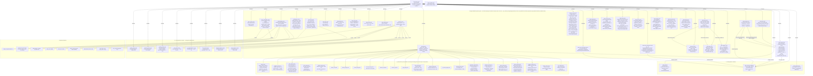

# Cartographie intégrale — Projet M5Stack Tab5 V2 (HMI ESPHome/LVGL)

> **[AI-CONTEXT] PRÉSENTATION ET RÔLE DE CE FICHIER**
> Ce fichier est la cartographie officielle du projet Tab5. Il a été créé **spécifiquement pour guider les agents IA** (Claude, Gemini, etc.) dans leur compréhension de l'architecture du firmware.
> Au lieu de lire et d'analyser à l'aveugle les dizaines de fichiers YAML et C++, **l'IA doit lire cette cartographie en premier**. Elle y trouvera l'arbre des dépendances (packages YAML, unités C++ de l'HMI et des jeux), la répartition des rôles entre le YAML et le C++, ainsi que l'historique des bugs résolus et de la dette technique. Cela évite les hallucinations et le temps perdu en rétro-ingénierie.

`Généré le 2026-07-06` · `maj: 2026-10-08` (comptes de lignes recalculés par `python tools/cartographie_counts.py --write`, vérifiés par pytest à 20 % près ; seule copie — celle de `contexte_ia/02_Hardware/` n'est plus qu'un renvoi ici) · Sources vérifiées directement dans le code (`00ProjetTab/`), croisées avec `Tab5/README.md` (réécrit le 05/07/2026 contre le firmware réel), `contexte_ia/04_Projets/etat_tab5.md` et `contexte_ia/02_Hardware/rules_esphome.md`. Aucun fait ci-dessous n'est tiré d'une supposition — chaque ligne cite le fichier source lu.

Repo Git distinct : `Axellum/M5-Tab5-ESPHome-LVGL` (dossier local `00ProjetTab/`), branche `main`.

---

## 1. Vue d'ensemble en une phrase

Un tableau de bord domotique natif (LVGL, redessin des seules zones qui changent) + satellite vocal local + **8 consoles de jeu arcade** (prototypes expérimentaux) tournant **entièrement en firmware C++/LVGL** sur un M5Stack Tab5 V2 (ESP32-P4), architecture **YAML modulaire par domaine** (28 packages + `ui_components/`), **push-only** depuis Home Assistant (zéro polling), avec la logique HMI centralisée dans `tab5_custom.h/.cpp` et chaque jeu dans son propre namespace C++ isolé.

---

## 2. Diagramme Mermaid — arbre des dépendances

```mermaid
graph TD
    ENTRY["tab5-ha-hmi.yaml<br/>(point d'entrée)<br/>substitutions (user_entities) + on_boot + packages: + includes:"]

    subgraph PKG["Packages ESPHome (Tab5/*.yaml) — tout le bloc packages: de tab5-ha-hmi.yaml, dans son ordre ; + pot_sensors.yaml (package paramétré, inclus ×5) et publication-commune.yaml (inclus par publication-stable et publication-beta)"]
        TOK["tab5-ui-tokens.yaml<br/>tokens dimensionnels (modal_card_w/h, modal_body_y)"]
        HW["tab5-hardware.yaml<br/>display/touch/i2c/audio (bus I2S, ES7210, ES8388, media_player)/esp32_hosted/ota: signée — zéro lv_* (garde-fou)"]
        ECRAN["ecran-*.yaml (tab5_ecran : st7123 par défaut, st7121, ili9881c)<br/>ce qui change d'une révision à l'autre : !extend tab5_display (modèle mipi_dsi) + !extend touch (st7123 ou gt911)"]
        PUB["publication-*.yaml (tab5_publication : locale par défaut, stable, beta)<br/>locale = vide ; stable et beta incluent publication-commune.yaml : ota http_request + update Firmware (manifeste de la page de flashage)"]
        SENSD["tab5-sensors-diagnostics.yaml<br/>wifi: sans identifiants/improv_serial/alim GPIO/batterie (charge, état, INA226)/status_ha/uptime/RAM/loop time/select:/time: (fuseau de HA)/interval:"]
        SENSO["tab5-sensors-domotique.yaml (+ pot_sensors.yaml ×5)<br/>plantes/lumières (+brightness live)/PC/températures/batterie/audio"]
        API["tab5-api-logic.yaml<br/>api: (clé fournie par HA) + provisioning: + services: (contrat HA, 23 services, zéro lv_* — garde-fou)"]
        STY["tab5-styles.yaml<br/>color:/font:/lvgl: style_definitions + chess_pieces_80"]
        GLOB["tab5-globals.yaml<br/>globals: + rotateur carte centrale (8s, planning/pluie/alertes/info + 4 bandeaux HA)"]
        SCR["tab5-scripts.yaml<br/>script: init ModalRegistry + volume + debounces + rotateur/dismiss + volet + popup lumière + retour accueil"]
        LVGL["tab5-lvgl.yaml<br/>page_main + swipe prévisions + 3 boutons du haut (tap / appui long) + !include jeux + sélecteur arcade"]
        ARC["tab5-arcade.yaml<br/>jeux : close_all + 8 × open + page arcade"]
        CALY["tab5-calendar.yaml<br/>popup calendrier : open/render/prev/next/today/day_tap"]
        ASSIST["tab5-assist.yaml<br/>micro_wake_word (okay_nabu + Stop, WakeWord::decide en C++) + voice_assistant + image réponse + scripts vocaux et popup Assistant — pile sans lv_* (garde-fou)"]
        IMU["tab5-imu.yaml<br/>BMI270 motion: + poll adaptatif 10/30Hz + tap-to-wake"]
        HACTL["tab5-ha-controls.yaml<br/>number volume + text_sensor écran courant + select aller-à + script tab5_ecran_ouvrir (ouverture d'un écran, partagée par le select et les appuis longs des boutons du haut) + button recharger calendrier + switch batterie montée + switch appareils sur la météo + switch rallumer l'écran à Okay Nabu + select extinction auto de l'écran + interval rattrapage volume + interval extinction auto (range ecran_veille_permise, lue par le mode économie)"]
        ALARM["tab5-alarm.yaml<br/>réveil : rtttl + 20 entités HA (switch/datetime/number/select/text)<br/>+ machine d'état sonnerie + tick 1s (réveil & annonce RDV)"]
        TUILES["tab5-tuiles.yaml<br/>pièces et tuiles (ADR-0023) : script tab5_tuiles_ui, widgets de g_tuiles_ui dessinés par tab5_tuiles.cpp"]
        RANGEE["tab5-rangee.yaml<br/>rangée sous l'horloge (ADR-0031) : script tab5_rangee_ui, widgets de g_rangee_ui dessinés par tab5_rangee.cpp"]
        REGLABLES["tab5-reglables.yaml<br/>tuile − / + (ADR-0033) : script tab5_reglables_ui, widgets de g_reglables_ui dessinés par tab5_reglables.cpp + tab5_debounce_reglable"]
        ENERGIE["tab5-energie.yaml<br/>popup Énergie (ADR-0028) : tab5_energie_ouvrir (widgets de g_energie_ui dessinés par tab5_energie.cpp) + tab5_energie_demande (événement esphome.tab5_energie)"]
        HISTO["tab5-historique.yaml<br/>popup Température (ADR-0032) : tab5_historique_ouvrir (widgets de g_historique_ui dessinés par tab5_historique.cpp) + tab5_historique_demande (événement esphome.tab5_historique)"]
        ALERTES["tab5-alertes.yaml<br/>popup Alertes (lot 4 du plan des alertes) : tab5_alertes_ouvrir (widgets de g_alertes_ui peints par tab5_alertes.cpp) + tab5_alertes_demande (événement esphome.tab5_alertes_historique) + tab5_alertes_tout_lu + tab5_ha_alert_slots_init (table unique des 4 bandeaux HA)"]
        MAISON["tab5-maison.yaml<br/>popup Maison (ADR-0037) : tab5_maison_ouvrir (widgets de g_maison_ui disposés et peints par tab5_maison.cpp, gestes des lignes = ceux des tuiles)"]
        ZONES["tab5-zones.yaml<br/>zones optionnelles (ADR-0018) : tab5_zones_apply + tab5_zones_demande (événement esphome.tab5_zones) + capteur Zones masquées"]
        REGLAGES["tab5-reglages.yaml<br/>popup Réglages : tab5_reglages_ouvrir (widgets de g_reglages_ui peints par tab5_reglages.cpp) + tab5_reglages_sync_ui (lancé par chaque entité réglée) + tab5_reglages_choisir"]
        ECONOMIE["tab5-economie.yaml<br/>mode économie : select Économie d'énergie + état Sur batterie, script tab5_economie_appliquer (1 s) : plafond du rétroéclairage, animations coupées, 30 images/s hors jeux"]
        THEMES["tab5-themes.yaml<br/>thèmes (ADR-0029) : selects Thème + Clair ou sombre, switch Nuit (thème auto), repeinture sans redémarrage (tab5_theme.cpp) ; chargé en dernier"]
    end

    ALARMC["alarm_clock.h/.cpp<br/>moteur réveil PUR : prochaine sonnerie (8 jours),
règles calendrier ouverture/fermeture, snooze, liste RDV<br/>lit cal_jours_data[] de tab5_core.h — ni ESPHome, ni LVGL, ni réseau<br/>testé sur PC : tools/test_alarm_clock.cpp"]
    ALARMR["alarm_render.h/.cpp<br/>rendu LVGL du réveil (popup, sonnerie, pastille)"]

    subgraph UI["ui_components/*.yaml (70 fichiers, 35 inclus par tab5-lvgl.yaml, les autres par ces composants)"]
        RANGEEUI["rangee.yaml + rangee_element.yaml ×8 + moisture_sensors.yaml<br/>rangée sous l'horloge (ADR-0031) : ligne des plantes + 2 panneaux de 4 éléments"]
        REGLABLESUI["reglables_liste.yaml + reglables_ligne.yaml ×10<br/>liste de la tuile − / + (ADR-0033) : un appareil par ligne"]
        ROUEUI["roue_actions.yaml + roue_bouton.yaml ×6 + roue_choix.yaml ×6 + roue_legende.yaml ×8<br/>roue d'actions rapides à deux anneaux (ADR-0036) : appui long d'une lampe, d'un volet, d'une clim"]
        POTSPOP["pots_popup.yaml + pot_detail_card.yaml<br/>détails plantes : humidité/statut + EC/lux/temp/batterie"]
        CALPOP["calendar_popup.yaml<br/>calendrier mensuel + détail jour<br/>(42 cellules construites en C++)"]
        CLIMCARD["climate_card.yaml"]
        CLIMPOP["climate_popup.yaml"]
        FDAILY["forecast_daily.yaml"]
        FHOUR["forecast_hourly.yaml + forecast_hour_card.yaml"]
        SWCARD["switches_card.yaml"]
        CONSOLE["console_sys.yaml"]
        LIGHTPOP["light_popup.yaml"]
        VOLETPOP["volet_popup.yaml + volet_btn.yaml ×3<br/>popup du volet : volet dessiné à glisser, position, Ouvrir / Stop / Fermer"]
        APPPOP["appareil_popup.yaml<br/>popup d'un appareil : état, grand bouton marche / arrêt"]
        TVPOP["tv_remote_popup.yaml"]
        ASSISTPOP["assistant_popup.yaml<br/>transcription STT + réponse Markdown + image"]
        HISTOPOP["historique_popup.yaml + historique_carte.yaml ×4 + vue_btn.yaml ×3<br/>popup Température : historique en courbe + prévision (ADR-0032)"]
        ENERGIEPOP["energie_popup.yaml + energie_carte.yaml ×4 + vue_btn.yaml ×3<br/>popup Énergie : instantané + historique en barres (ADR-0028)"]
        ALERTESPOP["alertes_popup.yaml<br/>popup Alertes : historique des 20 dernières alertes (lignes créées en C++) + « Tout marquer comme lu »"]
        MAISONPOP["maison_popup.yaml + maison_entete.yaml ×5 + maison_ligne.yaml ×25<br/>popup Maison (ADR-0037) : une colonne par pièce, une ligne par appareil, « Éteindre les lumières »"]
        REGLAGESPOP["reglages_popup.yaml + reglages_choix_btn.yaml ×22 + reglages_rangee.yaml ×8<br/>popup Réglages : écran + apparence, confirmation de la langue"]
        MODAL["modal_header.yaml + modal_scrim.yaml<br/>chrome partagé v4 (ADR-0009)"]
        GAMES["8× *_game.yaml + game_selector.yaml<br/>9 pages LVGL dédiées (skip: true)<br/>exception ADR-0009"]
    end

    subgraph CPP["C++ HMI (esphome: includes:)"]
        HFILE["tab5_custom.h<br/>CentralPanelCtx, Weather*Slot, MeteoIcon::<br/>inclut tab5_tokens.h (Palette, UIColor/UIAnim/UIIdle)"]
        CFILE["tab5_custom.cpp (globals) + une unité tab5_*.cpp par responsabilité (§3.3)<br/>logique LVGL HMI non-triviale"]
        REG["tab5_registry.h/.cpp<br/>GameRegistry::kGames (8 consoles) + ModalRegistry (ADR-0013)"]
    end

    subgraph GAMESCPP["C++ Jeux (esphome: includes: — prototypes expérimentaux)"]
        MARBLE["marble_game.h/.cpp<br/>namespace Marble — roguelite bille"]
        ARKA["arkanoid_game.h/.cpp<br/>namespace Arkanoid — casse-briques"]
        PIN["pinball_game.h/.cpp<br/>namespace Pinball — flipper PORTRAIT<br/>(bascule lvgl rotation 0 ↔ 270)"]
        LODE["lode_game.h/.cpp<br/>namespace Lode — Lode Runner"]
        GO["go_engine/ai/game .h/.cpp<br/>namespace Go — jeu de Go"]
        TRIV["trivia_game.h/.cpp + trivia_questions.h<br/>namespace Trivia — quiz"]
        DRA["draughts_ai/game .h/.cpp<br/>namespace Draughts — dames 10×10"]
        CHESS["chess_ai/game .h/.cpp<br/>namespace Chess — échecs FIDE"]
    end

    subgraph HWCOMP["Composants matériels"]
        MIPIDSI["display: mipi_dsi 1280×720"]
        ST7123TOUCH["touchscreen st7123 (natif ESPHome 2026.7), gt911 sur ILI9881C"]
        PI4IOE["pi4ioe5v6408 ×2 (GPIO expander I2C)"]
        ES8388["audio_dac: es8388"]
        ES7210["audio_adc: es7210"]
        HOSTED["esp32_hosted (esp32c6, SDIO, PSRAM)"]
        BMI270["BMI270 IMU (motion: natif)"]
        MWW["micro_wake_word (okay_nabu + Stop)"]
        VA["voice_assistant (pipeline HA)"]
    end

    ENTRY -->|packages:| TOK
    ENTRY -->|packages:| HW
    ENTRY -->|packages:| ECRAN
    ENTRY -->|packages:| PUB
    ENTRY -->|packages:| SENSD
    ENTRY -->|packages:| SENSO
    ENTRY -->|packages:| API
    ENTRY -->|packages:| STY
    ENTRY -->|packages:| GLOB
    ENTRY -->|packages:| SCR
    ENTRY -->|packages:| LVGL
    ENTRY -->|packages:| ARC
    ENTRY -->|packages:| CALY
    ENTRY -->|packages:| ASSIST
    ENTRY -->|packages:| IMU
    ENTRY -->|packages:| HACTL
    ENTRY -->|packages:| ALARM
    ENTRY -->|packages:| TUILES
    ENTRY -->|packages:| RANGEE
    ENTRY -->|packages:| REGLABLES
    ENTRY -->|packages:| ENERGIE
    ENTRY -->|packages:| HISTO
    ENTRY -->|packages:| ALERTES
    ENTRY -->|packages:| MAISON
    ENTRY -->|packages:| ZONES
    ENTRY -->|packages:| REGLAGES
    ENTRY -->|packages:| ECONOMIE
    ENTRY -->|packages:| THEMES
    ENTRY -->|includes:| HFILE
    ENTRY -->|includes:| CFILE
    ENTRY -->|includes:| REG
    ENTRY -->|includes:| MARBLE
    ENTRY -->|includes:| ARKA
    ENTRY -->|includes:| PIN
    ENTRY -->|includes:| LODE
    ENTRY -->|includes:| GO
    ENTRY -->|includes:| TRIV
    ENTRY -->|includes:| DRA
    ENTRY -->|includes:| CHESS
    ENTRY -->|includes:| ALARMC

    ALARM --> ALARMC
    ALARMC -->|lit cal_jours_data| CFILE
    API -->|tab5_maj_previsions_jours_bulk : alarm_invalidate| ALARMC
    API -->|tab5_maj_rdv_prochains : rdv_store| ALARMC
    HW --> MIPIDSI
    HW --> PI4IOE
    HW --> ES8388
    HW --> ES7210
    HW --> HOSTED
    ECRAN -->|!extend| MIPIDSI
    ECRAN -->|!extend| ST7123TOUCH
    ASSIST --> MWW
    ASSIST --> VA
    ZONES -->|exécute tab5_tuiles_ui| TUILES
    ZONES -->|exécute tab5_rangee_ui| RANGEE
    ZONES -->|exécute tab5_reglables_ui| REGLABLES
    IMU --> BMI270
    IMU -->|on_imu| MARBLE
    IMU -->|on_imu| ARKA
    IMU -->|on_imu| PIN
    IMU -->|on_imu| LODE
    IMU -->|on_imu| GO
    IMU -->|on_imu| TRIV
    IMU -->|on_imu| CHESS
    IMU -->|on_imu| DRA

    LVGL --> RANGEEUI
    LVGL --> REGLABLESUI
    LVGL --> ROUEUI
    LVGL --> CLIMCARD
    LVGL --> FDAILY
    LVGL --> FHOUR
    LVGL --> SWCARD
    LVGL --> CONSOLE
    LVGL --> CLIMPOP
    LVGL --> LIGHTPOP
    LVGL --> VOLETPOP
    LVGL --> APPPOP
    LVGL --> ASSISTPOP
    LVGL --> ENERGIEPOP
    LVGL --> ALERTESPOP
    LVGL --> MAISONPOP
    LVGL --> REGLAGESPOP
    LVGL --> HISTOPOP
    LVGL --> GAMES

    LVGL -->|lambdas appellent| CFILE
    API -->|lambdas appellent| CFILE
    SENSD -->|lambdas appellent| CFILE
    SENSO -->|lambdas appellent| CFILE
```

---

## 3. Inventaire strict des fichiers

### 3.1 Point d'entrée

| Fichier | Rôle exact | Gère | Dépend de |
|---|---|---|---|
| `tab5-ha-hmi.yaml` (403L) | Point d'entrée ESPHome. `substitutions: !include Tab5/user_entities.yaml` (gitignoré, modèle `user_entities.example.yaml`), séquence `on_boot:` en 2 priorités (700 puis 600) + init `g_central_ctx`/`g_day_slots`/`g_hour_slots`, `packages:` qui importe les packages `Tab5/*.yaml`, dont `tab5_ecran: !include Tab5/ecran-${ tab5_ecran | default('st7123') | lower }.yaml` (révision du Tab5, 26/09/2026), `esphome: includes:` pour le C++. | Boot, orchestration des packages | `Tab5/user_entities.yaml`, `Tab5/tab5_custom.h/.cpp`, tous les `Tab5/*.yaml` |
| `tab5-rendu-host.yaml` (213L) | **Rendu hors tablette** (lot 7, ADR-0021) : les mêmes packages d'interface et les mêmes sources C++, compilés pour la plateforme `host` d'ESPHome (Linux/macOS), affichage `snapshot` en mémoire (BMP). Ne se flashe nulle part. Reprend la partie interface de l'`on_boot` (copie exacte, vérifiée par `tests/test_rendu_host.py`). Nom de l'appareil en substitution (`rendu_nom`, `rendu_nom_affiche`, défaut `tab5-rendu`) : le job d'installation le compile sous celui de la tablette (`esphome -s rendu_nom tab5-ha-hmi …`) | Captures en CI des scènes du mode démo puis de chaque fenêtre, sous-fenêtre et écran de jeu, dans les 7 langues (`.github/workflows/rendu-host.yml`, `tools/rendu/`, plan des écrans dans `tools/rendu/ecrans.py`) ; tablette virtuelle du job « installation dans un HA neuf » (`.github/workflows/installation-ha.yml`) | `Tab5/rendu/bouchons.yaml` (matériel remplacé : écran, audio muet, diagnostics ; actions `rendu_capture`, `rendu_panneau`, et le doigt virtuel `rendu_toucher` / `rendu_glisser` de `Tab5/rendu/rendu_doigt.h`), `Tab5/rendu/composants/` (composants de même nom qu'ESPHome, sans effet : `voice_assistant`, `micro_wake_word`, `speaker`, `microphone`, `rtttl`, `online_image`, `http_request`, et `rendu_muet`), `Tab5/rendu/hote/` + `Tab5/rendu/freertos/` (en-têtes ESP-IDF remplacés) |

Point notable vérifié dans le code : le délai bloquant `on_boot:priority:700: lambda: delay(1000);` est la **cause racine confirmée** (06/07/2026, 5 tests OTA avec Axel présent) du bug historique « écran noir après reboot logiciel » — le `reset_pin` de l'écran passe par le GPIO expander I2C `PI4IOE5V6408`, qui a besoin de temps pour se stabiliser après boot avant que le reset ait un effet fiable. Documenté en détail dans `tab5-hardware.yaml:33-69`.

### 3.2 Packages ESPHome (`Tab5/*.yaml`)

| Fichier | Lignes | Rôle exact | Gère | Dépend de |
|---|---|---|---|---|
| `tab5-hardware.yaml` | 429 | Bas niveau : display MIPI-DSI + tactile, partie commune aux 3 révisions du Tab5 (broches, dimensions, calibration, réveil au toucher ; id `tab5_display` et `touch` étendus par `ecran-*.yaml`), DAC ES8388 (plateforme `audio_dac:`) / ADC micro ES7210 (`audio_adc:`), I2S haut-parleur/micro, expander GPIO PI4IOE5V6408, `esp32_hosted` (co-proc WiFi ESP32-C6 via SDIO 20 MHz), `media_player`, rétroéclairage (`backlight` écrit dans la sortie template `backlight_plafonne`, qui plafonne le PWM pour le mode économie, `tab5-economie.yaml`), `ota:` sans chiffrement ni mot de passe et `signed_ota_verification` (firmwares signés par `tab5_signature.pem`, lot 6b, ADR-0020) (la pile vocale est dans `tab5-assist.yaml` depuis le lot 8c) | Hardware, audio, OTA | composants natifs ESPHome ≥ 2026.8.1 (plus d'`external_components` depuis 2026.7.0) |
| `ecran-st7123.yaml` | 22 | Révision ST7123 (défaut, la tablette d'Axel) : `!extend tab5_display` → `mipi_dsi` modèle `M5STACK-TAB5-ST7123` ; `!extend touch` → `st7123`, `update_interval: 100ms` | Hardware | `tab5-hardware.yaml` (id étendus) |
| `ecran-st7121.yaml` | 25 | Révision ST7121 (depuis le 28/04/2026) : modèle `M5STACK-TAB5-ST7121`, tactile `st7123` (pas de pilote ST7121 dans ESPHome ; couple signalé fonctionnel par un tiers, esphome#17471). Compilé par la CI (`build-revisions`) ; tourne chez un utilisateur depuis octobre 2026 (discussion #278) | Hardware | idem |
| `ecran-ili9881c.yaml` | 21 | Tab5 d'origine (avant le 14/10/2025) : modèle `M5STACK-TAB5`, tactile `gt911` (`update_interval: never`), repris de devices.esphome.io. Compilé par la CI, jamais testé sur appareil | Hardware | idem |
| `publication-locale.yaml` | 8 | Publication d'un firmware compilé sur son PC (lot 6c, ADR-0022) : **vide** (`{}`), choisi par défaut (`tab5_publication` absent) | pas d'entité de mise à jour (le manifeste publié est signé par la clé du projet) | `tab5-ha-hmi.yaml` |
| `publication-stable.yaml` / `publication-beta.yaml` | 7 / 8 | Firmware publié (CI `publication.yml`, `-s tab5_publication stable|beta`) : incluent `publication-commune.yaml` avec `vars: {canal}` | canal de mise à jour (une bêta passe à la stable suivante) | `publication-commune.yaml` |
| `publication-commune.yaml` | 31 | `ota: - platform: http_request` + `update: http_request` « Firmware » sur `https://axellum.github.io/M5-Tab5-ESPHome-LVGL/<canal>/<révision>/manifest.json` (toutes les 6 h) ; signature vérifiée par le backend OTA commun, certificat non vérifié (`verify_ssl: false`) | mise à jour depuis HA | `http_request` (`tab5-assist.yaml`), `ota:` en liste (`tab5-hardware.yaml`) |
| `tab5-sensors-diagnostics.yaml` | 611 | `wifi:` sans identifiants (Improv par USB via `improv_serial`, AP de secours ouvert, lot 6b), switchs d'alim GPIO (WiFi/USB/5V ext/antenne/charge batterie et charge rapide), batterie d'origine (état de charge, tension et niveau par l'INA226 0x41, #278 ; niveau et charge peignent l'icône du bandeau via `batterie_niveau_ui()` / `batterie_charge_ui()` ; le courant « Tab5 Courant batterie » décide « Sur batterie » pour le mode économie, `economie_courant()`), statut API HA, IP/SSID, uptime, RSSI, température coeur, RAM libre/loop time (`debug`), durée max des images LVGL (`on_draw_start/end`) et pile libre min de la boucle, select antenne, horloges (`homeassistant` pour le fuseau de HA, gardé en NVS ; SNTP ; RX8130), `interval:` icône WiFi 5s + console 2s + état de charge 10s | Réseau WiFi, alimentation, diagnostics système | `tab5_custom.h` (`update_console_*`, `update_clock_date_ui`, `is_console_layer_visible`) |
| `tab5-sensors-domotique.yaml` | 243 | Emplacements de la maison (lot 6a, ADR-0019) : capteurs `template` internes, **sans entity_id**, alimentés par l'action `tab5_maj_emplacements` que pousse le blueprint « Tab5 — emplacements » — humidité 5 plantes (triées dynamiquement + 5 cartes fixes du popup détails), 20 capteurs détails pots (`pot*_ec/lux/temp/bat`, venus de `pot_sensors.yaml`, package paramétré inclus 5× par un `packages:` imbriqué), lumières 1 à 3 (état + luminosité pour l'arc du popup), PC, TV, batterie téléphone, température/humidité de la pièce, serre ; chaque `on_value` commence par `zone_vue()` (lot 5) ; audio (ampli, jack, wake word) | Capteurs domotique (emplacements) | `tab5_custom.h` (`get_temperature_color`, `get_humidity_color`, `get_battery_color`, `sort_and_update_moisture_slots`, `update_pots_popup_moisture_ui`, `update_pot_metric_ui`, `update_light_card_ui`, `update_temp_ui`, `sync_light_popup_brightness`) |
| `pot_sensors.yaml` | 40 | Package **paramétré** (`vars: {n}`) : les 4 capteurs `template` d'un pot (`pot${n}_ec/lux/temp/bat`, clés `pot_${n}_ec`… de `tab5_maj_emplacements`, lot 6a), chaque `on_value` appelant `update_pot_metric_ui()`. Inclus 5× par `tab5-sensors-domotique.yaml` (ESPHome concatène les `sensor:` des packages ; un `- !include` dans une liste n'aplatit pas). Un 6ᵉ pot : voir son en-tête | Détails des 5 pots (popup appui long) | `tab5_custom.h` (`update_pot_metric_ui`), `tab5-api-logic.yaml` |
| `tab5-api-logic.yaml` | 681 | Le contrat réel avec HA : `api: encryption: {}` (clé fournie par HA, lot 6b, ADR-0020) et `provisioning:` (fenêtre d'appairage de 30 min), bloc `api: services:` (23 services, dont `tab5_maj_zones` (lot 5) et `tab5_maj_emplacements` (lot 6a) : `tab5_maj_pluie_1h_bulk` remplace `tab5_maj_pluie_1h` depuis le 08/09/2026). Chaque service `tab5_maj_*` reçoit un payload d'une automation HA et appelle une fonction C++ (`tab5_services.cpp`, déclarée dans `tab5_custom.h`) via lambda (lit et écrit `g_central_ctx` directement, plus de recopie depuis le lot 7) | Contrat API HA↔Tab5 (clim, volet, planning, alertes météo France, probabilités UV/gel/neige, prévisions bulk, pluie 1h, panneau info, réponse vocale, alertes HA bulk, calendrier mois/jour) | `tab5_custom.h/.cpp`, IDs LVGL définis dans `tab5-lvgl.yaml`/`ui_components/*.yaml` |
| `tab5-styles.yaml` | 1091 | Thème "Dark Mode Slate" (glassmorphism) : couleurs des jeux (`color:`), déclarations `font:` (Roboto + MDI + police météo custom ; la partie `# >>> tuiles` de mdi_font_70/45/32 est **générée** par `tools/gen_tuiles_icones.py`), `lvgl: style_definitions:` (lisent la palette `UIColor`, dont 33 styles de rôle, ADR-0029) | Palette visuelle, typographie, styles réutilisables | Polices `Tab5/materialdesignicons-webfont.ttf`, `Tab5/IconeMeteo.ttf` |
| `tab5-globals.yaml` | 229 | Tout l'état partagé entre fichiers (`globals:`). Carte centrale : contenu, panneau courant et page des prévisions **sans global**, seule source `g_central_ctx` (lot 7, 26/09/2026 ; `forecast_page` le 28/09/2026) ; le planning du tap se lit sur son timer (`temp_planning_active()`) ; reste `is_showing_vocal_response` (8 s du script de réponse vocale). Le rotateur 8 s est le script `tab5_central_rotator_auto` (`tab5-scripts.yaml`) | État global partagé | `g_central_ctx` |
| `tab5-scripts.yaml` | 522 | Scripts transverses : init du registre des modales (`tab5_modal_registry_init`), ouverture de la console système (`tab5_console_ouvrir`, seule ouverture, lancée par `tab5_ecran_ouvrir`), volume (`tab5_volume_apply`, point d'entrée unique), debounces (volume 150 ms, luminosité 200 ms, clim 250 ms : `tab5_debounce_clim_temp` pour la clim du blueprint, `tab5_debounce_clim_tuile` pour celle d'une tuile, ADR-0027), widgets, icônes, globals et débounces de la clim dans `g_clim_ui` (`tab5_clim_ui`, ADR-0026/0027 ; la recoloration est dans `clim_recolorer()`, `tab5_cards.cpp`), rotateur central (7,8 s, `rangee_tour()` de la rangée sous l'horloge, 0,2 s, la carte centrale : ADR-0031) + dismiss (info, alertes HA paramétré slot 0-3) (widgets du bandeau : `g_ha_alert_slots`, `tab5-alertes.yaml`), volet (fin de mouvement, feedback stop, tap de la carte `tab5_volet_tap`), popup lumière (`tab5_light_popup_show`), touches de la télécommande TV (`tab5_tv_key(touche)`, lot 7), `interval:` 1 s de retour à l'accueil. L'affichage temporaire du planning est en C++ (`show_temporary_planning()`) | Séquences temporisées, rotateur, retour accueil | `globals:`, `tab5_custom.h` (unités `tab5_*.cpp`), `g_central_ctx` |
| `tab5-arcade.yaml` | 203 | Scripts des jeux (lot 8c) : `tab5_games_close_all` (liste lue dans `GameRegistry::kGames`), `tab5_<jeu>_open` ×8 (injection des pointeurs LVGL et des polices), `tab5_arcade_open` | Arcade | `tab5_registry.*`, `*_game.h` |
| `tab5-calendar.yaml` | 202 | Scripts du popup calendrier (lot 8c) : `tab5_calendar_open`, `tab5_cal_render`, `tab5_cal_prev/next/today`, `tab5_cal_prefetch_boot` (démarrage et reconnexion) → `tab5_cal_prefetch(force)` (ne redemande pas un mois reçu il y a moins de 30 s ; `force` = bouton « Recharger le calendrier »), `tab5_cal_day_tap` ; seul envoi d'une demande de mois = `tab5_cal_request(annee, mois)`, « mois ± 1 » = `cal_shift_month()` (lot 7) | Calendrier | `tab5_calendar.cpp`, `calendar_popup.yaml` |
| `tab5-assist.yaml` | 471 | Assistant vocal complet (lot 8c) : `micro_wake_word` (2 modèles : `okay_nabu` + `Stop` armé/désarmé selon `volet_en_mouvement`), `voice_assistant` (callbacks → `assist_set_pipeline_state()`), image de la réponse (`http_request` + `online_image`), scripts vocaux (`Stop`, interruption, `tab5_wake_word_dispatch`, réponse dans la carte centrale) et du popup Assistant. La pile (avant `script:`) reste sans `lv_*` (règle 2 de `check_tab5_code_rules.py`) | Voix, assistant | `tab5_assist.cpp` (`WakeWord::decide()`), `assistant_popup.yaml` |
| `tab5-lvgl.yaml` | 713 | Layout complet : page unique 1280×720 (`page_main`), swipe gauche/droite = pagination prévisions 0-4 (zone `y ≥ 333` uniquement), 3 boutons du haut, chacun avec un appui long (06/10/2026) : `btn_control_ha` (mode HA), `btn_control_console` (Réglages), `btn_control_tv` (Arcade) ; l'appui long ouvre l'écran choisi dans le blueprint (07/10/2026, `bouton_haut_ecran()` puis `tab5_ecran_ouvrir` ; « auto » : popup Énergie si la production solaire est reçue, console, télécommande TV si la zone TV est présente), mini icônes `icon_mini_ha` / `icon_mini_sys` / `icon_mini_tv` (`boutons_haut_apply_ui()`), rangée sous l'horloge (`ui_components/rangee.yaml`, zone `btn_rangee` : appui = ligne suivante, appui long sur les plantes = popup détails plantes, pastilles `rangee_pastilles`), popup calendrier via appui long horloge, boutons statut/mode vocal (centralisés via `tab5_set_assist_mode`), carte centrale | Layout racine, navigation gestuelle | Tous les `ui_components/*.yaml`, `tab5_central.cpp` (`handle_swipe_gesture`), `g_day_slots`, `g_hour_slots`, `g_central_ctx`) |
| `tab5-alarm.yaml` | 1042 | Réveil matin + annonce des rendez-vous. `rtttl:` (mélodie de sonnerie sur `tab5_speaker`, hors media_player), ~20 entités exposées à HA (`switch`/`datetime type:time`/`number`/`select`/`text`/`text_sensor`/`binary_sensor`/`button`), machine d'état de sonnerie (démarrage, boucle mélodie + 2,5 s de silence, arrêt, répétition, durée max, nettoyage), et un `interval: 1s` qui ne fait qu'UNE comparaison d'entiers (le calcul est mis en cache dans `alarm_clock.cpp`). Point d'entrée unique `script.tab5_alarm_refresh` : entités → `g_alarm_cfg`, jamais l'inverse | Réveil, sonnerie, annonce RDV, entités de réglage HA | `alarm_clock.h/.cpp`, `cal_jours_data[]` (`tab5_custom.h`), IDs LVGL de `ui_components/alarm_popup.yaml` et `alarm_ring_overlay.yaml`, `sntp_time`, `speaker_player`, `micro_wake_word` |
| `tab5-zones.yaml` | 103 | Zones optionnelles (lot 5, 27/09/2026, ADR-0018 ; depuis le lot 6a, zone absente = emplacement vide dans le blueprint) : script `tab5_zones_apply` (lance `tab5_tuiles_ui`, `tab5_clim_ui` et `tab5_rangee_ui`, pose les widgets dans `g_zones_ui`, dont les trois mini icônes des boutons du haut, appelle `zones_apply_ui()`, publie « Zones masquées », repasse en mode Domotique sans pipeline de discussion), script `tab5_zones_demande` (événement `esphome.tab5_zones`, clés des emplacements), capteur de diagnostic « Zones masquées ». Chargé après `tab5_lvgl` | Zones de l'écran absentes de la maison | `tab5_zones.cpp`, action `tab5_maj_zones` (`tab5-api-logic.yaml`), blueprint `HomeAssistant_Config/blueprints/automation/tab5/tab5_emplacements.yaml` |
| `tab5-reglages.yaml` | 150 | Popup Réglages (06/10/2026, demande d'Axel) : script `tab5_reglages_ouvrir` (pose les widgets de `g_reglages_ui` à la première ouverture, `reglages_preparer()`, peint puis ouvre), `tab5_reglages_sync_ui` (lit luminosité, extinction auto, Okay Nabu, tape, thème, mode, nuit, langue, puis `reglages_peindre()` ; lancé par le `on_value` / `on_state` de chaque entité réglée), `tab5_reglages_choisir` (écrit l'entité ; la langue passe par une confirmation, `tab5_reglages_langue_confirmer`). Ouvert par un tap sur l'engrenage ou « Aller à l'écran → Réglages ». Chargé après `tab5_lvgl`, avant `tab5_themes` | Réglages de l'écran sans HA | `tab5_reglages.cpp`, `reglages_popup.yaml`, entités de `tab5-ha-controls.yaml`, `tab5-imu.yaml`, `tab5-themes.yaml` |
| `tab5-economie.yaml` | 93 | Mode économie d'énergie (06/10/2026, demande d'Axel) : select « Tab5 Économie d'énergie » (Jamais / Sur batterie, défaut / Toujours), binary_sensor « Tab5 Sur batterie » (publié par le courant de l'INA226, `tab5-sensors-diagnostics.yaml`), script `tab5_economie_appliquer` (interval 1 s, toucher, allumage, courant, niveau, charge) : `economie_decider()` puis plafond du rétroéclairage à la sortie (`backlight_plafonne`, `tab5-hardware.yaml`), `animations_reduites()`, période de LVGL. Lit `ecran_veille_permise` (la liste de l'extinction auto). Chargé aussi par le rendu hors tablette | `tab5_economie.h` (`economie_*`), `tab5_custom.h` (`animations_reduites()`, `ui_idle_ms()`) |
| `tab5-tuiles.yaml` | 219 | Pièces et tuiles (ADR-0023, 28/09/2026) : script `tab5_tuiles_ui`, qui pose dans `g_tuiles_ui` les widgets que dessine `tab5_tuiles.cpp` (épaules et boutons des tuiles météo de toutes les pages, cartes du mode HA, sélecteur du popup lumière, calques, pastilles, titre de la carte centrale, bouton « HA ») et ses deux commandes (lambdas sans capture : événement `esphome.tab5_action`, tap du volet 3.x). Lancé en premier par `tab5_zones_apply`, avant la première image : l'`on_boot` n'est pas touché. Chargé après `tab5_lvgl` | Pièces de l'écran | `tab5_tuiles.cpp`, `tab5-zones.yaml` |
| `tab5-rangee.yaml` | 62 | Rangée sous l'horloge (ADR-0031, 06/10/2026) : script `tab5_rangee_ui`, qui pose dans `g_rangee_ui` les widgets que dessine `tab5_rangee.cpp` (zone, ligne des plantes, 2 panneaux × 4 éléments icône + valeur, pastilles, police de la date pour la grande taille, polices MDI 70/45/32 et Roboto 32 gras / 22). Lancé par `tab5_zones_apply`, avant la première image. Chargé après `tab5_lvgl` | Rangée sous l'horloge | `tab5_rangee.cpp`, `tab5_tuiles.cpp` (modèle, clés `hLI` / `hp` / `hd`), `tab5-zones.yaml` |
| `tab5-reglables.yaml` | 85 | Tuile − / + au choix (ADR-0033, 06/10/2026) : script `tab5_reglables_ui`, qui pose dans `g_reglables_ui` les widgets que dessine `tab5_reglables.cpp` (zone − / + de la carte clim, consigne `clim_target`, rangée icône + valeur d'un autre appareil, liste plein écran et ses 10 lignes) et les rappels (`tab5_volume_apply`, `tab5_action`, `tab5_debounce_reglable`) ; script `tab5_debounce_reglable` (250 ms, comme la clim). Lancé par `tab5_zones_apply`, avant la première image. Chargé après `tab5_lvgl` | Tuile − / + | `tab5_reglables.cpp`, `climate_card.yaml`, `reglables_liste.yaml`, `tab5-zones.yaml` |
| `tab5-themes.yaml` | 496 | Thèmes (ADR-0029, lot 2, 04/10/2026) : select « Thème » (options générées depuis `Tab5/themes/*.yaml` par `tools/gen_themes.py`), select « Clair ou sombre » (Sombre, Clair, Auto), switch « Nuit (thème auto) » tenu par HA ; script `tab5_theme_choisir` (`theme_selectionner()`) et script `tab5_theme_repeindre` (marque d'abord les boutons verre, `boutons_verre_marquer()` ; styles partagés, formes et polices du thème, bloc généré ; puis, `App.is_setup_complete()` atteint, `theme_rejouer_ui()` et les icônes posées par les capteurs). Lot 3 : polices des thèmes déclarées en tête (bloc `# >>> polices`, généré). Chargé EN DERNIER (le menu est restauré pendant le setup, après la création des widgets) | Thème de l'écran | `tab5_theme.cpp`, `tab5_themes_data.h` (`THEMES[]`), automatisation HA « Tab5 — thème jour/nuit » (`tab5_push.yaml`) |
| `tab5-energie.yaml` | 76 | Popup Énergie (ADR-0028, 04/10/2026, discussion #278) : script `tab5_energie_ouvrir`, qui pose dans `g_energie_ui` les widgets que dessine `tab5_energie.cpp` (4 cartes, graphique, 3 boutons de vue) et sa commande (lambda sans capture), puis ouvre le popup ; script `tab5_energie_demande` (événement `esphome.tab5_energie`, donnée `vue`). Chargé après `tab5_lvgl` | Installation solaire | `tab5_energie.cpp`, actions `tab5_maj_energie` / `tab5_maj_energie_historique`, blueprint `tab5_emplacements.yaml`, package HA `tab5_energie.yaml` |
| `tab5-historique.yaml` | 72 | Popup Température (ADR-0032, 06/10/2026) : script `tab5_historique_ouvrir` (`cle` = `salon` \| `serre`, appui long sur une température de `climate_card.yaml`), qui pose dans `g_historique_ui` les widgets que dessine `tab5_historique.cpp` (4 cartes, titre, 3 boutons de vue, zone du tracé), et `tab5_historique_demande` : événement `esphome.tab5_historique` (cle, vue) à l'ouverture et à chaque bouton de vue |
| `tab5-alertes.yaml` | 88 | Popup Alertes (lot 4 du plan des alertes de la carte centrale, 06/10/2026) : script `tab5_alertes_ouvrir`, qui pose dans `g_alertes_ui` les widgets que peint `tab5_alertes.cpp` (liste, message d'attente, « Tout marquer comme lu ») et sa demande (lambda sans capture), puis ouvre le popup ; script `tab5_alertes_demande` (événement `esphome.tab5_alertes_historique`) ; script `tab5_alertes_tout_lu` (toutes les alertes de la carte centrale lues, événement `esphome.tab5_alerte_lue` avec `alert_id: "*"`) ; script `tab5_ha_alert_slots_init`, seule table des 4 bandeaux d'alerte HA de la carte centrale (`g_ha_alert_slots`, idempotent : le service `tab5_maj_alertes_ha_bulk`, le tap `tab5_dismiss_ha_alert`, « Tout marquer comme lu » l'appellent avant de lire ; les cadres restent aussi dans l'`on_boot`, `g_central_ctx.ha_wrap`). Chargé après `tab5_lvgl` | — | `tab5_alertes.cpp`, action `tab5_maj_alertes_historique`, package HA `tab5_push.yaml` (script `tab5_push_alertes_historique`), `custom_templates/tab5_alertes.jinja` |
| `tab5-maison.yaml` | 58 | Popup Maison (ADR-0037, 07/10/2026) : script `tab5_maison_ouvrir`, qui pose une fois dans `g_maison_ui` les widgets de `maison_popup.yaml` (message « Aucun appareil », bouton « Éteindre les lumières », 5 en-têtes, 25 lignes, le popup en dernier), puis appelle `maison_ouvrir()`. Ouvert par « Aller à l'écran → Maison » et, en mode HA, par un tap sur le titre de la carte centrale. Chargé après `tab5_lvgl` | — | `tab5_maison.cpp`, `tab5_tuiles.cpp` (gestes et dessin des tuiles), `maison_popup.yaml` |

### 3.3 C++ core

Avant d'écrire un utilitaire : la « boîte à outils » d'[`AGENTS.md`](AGENTS.md) (section « Toolbox ») liste ceux qui existent (fichier de chacun) ; conventions du nouveau code dans [`Tab5/README.md`](Tab5/README.md).

| Fichier | Lignes | Rôle exact | Fonctions clés |
|---|---|---|---|
| `tab5_custom.h` | 1542 | Déclarations, structs (`CentralPanelCtx` [8 wrappers + le label chapeau du titre de page + 7 flags + current_panel + forecast_page + réponse vocale + mode HA], `DayForecastData`, `HourForecastData`, `WeatherHourSlot`, `WeatherDaySlot`, `MoistureSlotUI`, `PotDetailUI`, `HaAlertSlotUI`, `CalCellUI`, `CalDetailLineUI`), enum `PotMetric`, bits `CAL_BIT_*`, namespace `MeteoIcon::` (codes UTF-8 police météo). Inclut `tab5_tokens.h` | — |
| `tab5_tokens.h` | 273 | Jetons **sans dépendance** (`<cstdint>` seul) : `struct Palette` (66 rôles de couleur, **seule source des couleurs de l'interface**), `struct Theme` (un thème = une palette sombre + une claire ; le catalogue `THEMES[]` est dans `tab5_themes_data.h` depuis le 08/10/2026), `PALETTE_SOMBRE` (sombre du premier thème, **générée** par `tools/gen_themes.py` depuis `Tab5/themes/ardoise.yaml`) et `UIColor`, la palette active (variable lue par le C++, les lambdas et les styles de rôle de `tab5-styles.yaml`, ADR-0029), `UIBandeau` / `UIHorloge` (palettes du bandeau central et de l'horloge : `UIColor`, ou la sombre du thème en mode clair d'un thème à `zones_sombres:`), `UIAnim::` (durées/amplitudes), `UIIdle::` (retour à l'accueil). Inclus par `tab5_custom.h` et par les deux seuls jeux qui lisent des couleurs (Arcanoïde, Fil d'Or, via `PALETTE_SOMBRE` : ils restent sombres) ; les six autres jeux n'incluent plus rien du HMI (25/09/2026, lot 8a) | — |
| `tab5_custom.cpp` | 43 | Globals partagés (`g_central_ctx`, `g_day_slots[5]`, `g_hour_slots[5]`, `g_ha_alert_slots[4]`, `cal_jours_data`/`cal_heures_data`) et carte des unités. Depuis le 08/09/2026 (lot (e)) la logique vit dans les unités ci-dessous (neuf ce jour-là, une par responsabilité, 26 `tab5_*.cpp` au 08/10/2026 en comptant celui-ci), mêmes fonctions et même ordre que l'ancien fichier de 3 169 lignes ; toutes gardent contre les `lv_obj_t*` nuls | — |
| `tab5_internal.h` | 362 | Les 13 helpers partagés entre unités, **hors contrat YAML**, plus `ui_text()` / `ui_text_color()` (écritures LVGL conditionnelles : rien n'est réécrit ni invalidé si la valeur n'a pas changé, audit du 26/09/2026, lot 3) : texte (`normalize_text_utf8()`, `vigilance_alert_banner_utf8()`, `has_lvgl_recolor_markup()`, `set_label_text_utf8()`) et, depuis le lot 8d (25/09/2026), les 9 fonctions que `tab5_custom.h` déclarait sans qu'aucun YAML ne les appelle (`transition_widgets()`, `close_popup_if_open()`, `animate_swipe_horizontal()`/`_alert_enter()`/`_icon_roll_in()`, `get_temperature_color()`, `tab5_dismiss_local_has/_prune()`, `update_rain_phrase_ui()`). Les helpers d'une seule unité y sont `static` | — |
| `game_common.h` | 373 | Header-only partagé par les **8 consoles** (ADR-0014) : `clampf()`, `xorshift32_next()` (l'état reste dans chaque jeu), `mk_rect()`/`mk_label()`, `show()`/`set_bg()`/`set_border()`/`set_text_if()`/`set_text_color_if()` (sur-ensemble des variantes : gardes nulles, opacité par défaut), `NvsSlot<T>` (clé + magic, `load()`/`save()`/`ready()`) et, depuis le lot 8f (25/09/2026), les mécanismes que 2 à 4 consoles recopiaient : `timer_period_sync()` (tick adaptatif), `topn_insert<>()` (classement), `tilt_calibrate()`/`tilt_smooth()` (inclinaison), `accel_delta_norm()`/`shake_fire()` (secousse) — seuils, périodes et gardes restent dans chaque jeu. Depuis le lot 4 de l'audit des ressources (26/09/2026) : `game_mem_new<T>(MemPref)` / `game_mem_free()` (état d'un jeu pris à l'ouverture, rendu à la fermeture) et `ui_destroy()` (objets LVGL du jeu détruits, conteneurs YAML gardés) — jeu fermé, rien ne reste réservé. Depuis le lot 7 (26/09/2026) : `SlotMenu<N>` + `SlotGeom` (entrées de menu cadre/titre/description : `build()`, `row()`, `hide_from()`, membre du `Mem` de chaque jeu), `set_pressed_bg()`, `show_front()` (calque affiché + premier plan), `hud_num()` (compteur HUD réécrit seulement s'il change). Ne dépend pas du HMI ; un jeu peut redéfinir un helper dans son namespace (`Go::set_bg`) | — |
| `tab5_text.cpp` | 203 | UTF-8 / mojibake, store local des alertes rejetées, `set_label_text_utf8()` (les dates et libellés de jours/mois sont passés dans `tab5_core.cpp`), `i18n_apply_boot()` : traduction des textes posés par le YAML en fin de setup (lot 4a, 27/09/2026) | voir `tab5_custom.h` |
| `tab5_themes_data.h` | 2829 | **Généré** en entier par `tools/gen_themes.py` depuis `Tab5/themes/*.yaml` : `THEMES[]` (nom, zones sombres, palette sombre et claire de chaque thème ; le premier reprend `PALETTE_SOMBRE`), `THEME_COUNT` et son `static_assert`. Inclus par `tab5_theme.cpp` et `tab5_reglages.cpp` seulement (audit du 07/10/2026, DO-3 : dans `tab5_tokens.h`, une retouche de thème recompilait toutes les unités, jeux compris). Ne pas modifier à la main (`tests/test_themes.py`, `gen_themes.py --check`) | `tab5_tokens.h` |
| `tab5_i18n.h/.cpp` | 126 | Langue de l'écran (lot 4a, 27/09/2026), **pur** : `tr()` / `tr_ctx()` / `tr_fill()` (le texte français est la clé, recherche dichotomique), `tr_noop()` (marque un texte rangé dans une table, lot 4b), `i18n_set_language()`. Compilé aussi sur PC par `tools/test_alarm_clock.cpp` | `tab5_i18n_data.h` |
| `tab5_i18n_data.h` | 8347 | **Généré** par `tools/gen_i18n.py` depuis `Tab5/lang/fr.yaml` (langue source, métadonnées) et les autres `Tab5/lang/*.yaml` (en, de, nl, es, it, tr) : clés triées, une table par langue, trous d'une langue partielle remplis par l'anglais. Ne pas modifier à la main (`tests/test_i18n.py` vérifie qu'il est à jour) | — |
| `tab5_tuiles_icones.h` | 132 | **Généré** par `tools/gen_tuiles_icones.py` depuis `Tab5/tuiles_icones.yaml` (source unique, pas un package ESPHome) : palette des icônes des tuiles de pièce (ADR-0023), code de palette → glyphe MDI éteint / allumé, défaut par type de tuile. Le même outil écrit les glyphes de la palette dans mdi_font_70/45/32 (entre `# >>> tuiles` et `# <<< tuiles`) et les tables `icones_mdi` / `icones_defaut` du blueprint `tab5_emplacements.yaml`. Ne pas modifier à la main (`tests/test_tuiles_icones.py`, `--check`) | `tuile_icone(code, actif, type)`, `tuiles_icones::defaut_du_type()` |
| `tab5_core.h/.cpp` | 435 | Logique **pure** partagée HMI + réveil (25/09/2026, lot 8b) : `DayForecastData`/`HourForecastData`, `cal_jours_data[]`/`cal_jours_anchor_day` (déclarés ; définis dans `tab5_custom.cpp`), `local_day_from_offset()`/`local_day_number_today()` (seule arithmétique de dates du projet, immunisée aux bascules d'heure), `fr_day_long_utf8()`/`fr_month_long_utf8()`, titres de jour, `cal_is_early_shift()`, `trim_ws()` / `split_fields()` (rognage et découpe « | » en place, lot 7). L'heure passe par `tab5_time_source` (défaut `time`) pour que les tests hôte simulent « maintenant ». Inclus par `tab5_custom.h` | `local_day_from_offset()`, `local_day_number_today()` |
| `tab5_forecast.cpp` | 392 | `update_meteo_icon()`, couleurs température/humidité, `parse_and_update_heures_bulk()`/`_jours_bulk()`, `refresh_daily_forecast()`/`refresh_hourly_forecast()` | voir `tab5_custom.h` |
| `tab5_central.cpp` | 1168 | carte centrale (rotateur, `parse_and_update_ha_alerts_bulk()`, `update_info_text_ui()`, titre de page), `handle_swipe_gesture()`/`reset_forecast_to_main_page()`, `show_temporary_planning()`, `show_vocal_response_ui()` | voir `tab5_custom.h` |
| `tab5_services.cpp` | 532 | logique des services HA : `parse_and_update_vigilance()`, `update_rain_bar_ui()`, `update_rain_predict_icon_ui()`, `update_planning_text_ui()` (`update_clim_from_ha_ui()` partie dans `tab5_cards.cpp` le 29/09/2026, devenue `clim_blueprint_recu()`) ; fuseau de HA gardé en NVS (`fuseau_restaurer()`, `fuseau_recu_de_ha()`, `fuseau_memoriser()`, lot 6b) | voir `tab5_custom.h` |
| `tab5_assist.cpp` | 315 | `format_assist_markdown()`, `assist_set_pipeline_state()`, `assist_image_state_ui()`, `WakeWord::decide()` | voir `tab5_custom.h` |
| `tab5_cards.cpp` | 1086 | Clim : `update_clim_target_ui()` (carte de l'accueil), `clim_blueprint_recu()` (retour de `tab5_maj_clim`), réglages de l'appareil (clé `climr`, ADR-0026 : `clim_reglages_recu()` range bornes, pas, unité, capacités et nom, sans NVS, puis règle l'arc, le format de la cible, l'unité, le titre, masque les boutons absents et ré-empile la carte OPTIONS) ; clims des tuiles (ADR-0027 : clés `crRT` / `ceRT` routées par `emplacements_appliquer()` vers `clim_tuile_recu()`, table de 25 cases en PSRAM allouée à la première clé) et **clim affichée par le popup** (`clim_afficher_tuile()` / `clim_afficher_blueprint()`, gestes `clim_popup_*()`, emplacement `clim_affichee_cle()`, consigne d'une tuile gardée pour son débounce) ; coloration `clim_recolorer()` (carte = clim du blueprint, popup = clim affichée) ; `clim_consigne_suivante()`, `clim_consigne_texte()`, `clim_*_actif()` ; `sort_and_update_moisture_slots()`, `update_pots_popup_moisture_ui()`/`update_pot_metric_ui()`, `update_temp_ui()` | voir `tab5_custom.h` (`ClimUI g_clim_ui`) |
| `tab5_console.cpp` | 272 | ligne status, `ui_sync_volume_widgets()`, `update_console_diagnostics_ui()`, `update_console_cpu_ui()` (charge de chaque cœur, temps de la tâche inactive de FreeRTOS, 06/10/2026) | voir `tab5_custom.h` |
| `tab5_anim.cpp` | 592 | `transition_widgets()`, `animate_popup_open(card)` (affichage + premier plan) / `animate_popup_close(card)`, `start_anim()` (lot 7), `animate_swipe_horizontal()`, `animate_alert_enter()`, `ui_idle_ms()`/`close_popup_if_open()`, `animate_icon_roll_in()`, `update_clock_date_ui()` (rouleau d'horloge, géométrie dans `tab5-lvgl.yaml`), `animations_reduites()` (mode économie : transitions, glissements et rouleaux posés à leur état final), `setup_button_press_animation()`/`highlight_button_border()` | voir `tab5_custom.h` |
| `tab5_calendar.cpp` | 572 | `cal_grid_build()` (les 42 cellules de la grille, créées à la première ouverture — lot 8 ; styles partagés et colonnes `kCalCol*` tenues par `tests/test_geometrie_partagee.py` depuis le 01/10/2026), `cal_store_month_data()`, `cal_render_month()`, `cal_render_day_detail()` (cache mensuel `static`) | voir `tab5_custom.h` |
| `tab5_journal.cpp` | 478 | Journal des démarrages et des coupures (26/09/2026) : `logger: on_message` → `journal_log_message()` garde les erreurs (dont `esp-idf` : pilote ESP-Hosted du C6) et, HA déconnecté, les avertissements, en `.noinit` (32 lignes, survit aux resets logiciels et aux plantages, rapport `esp32.crash` d'ESPHome compris) ; `journal_tick()` (interval 30 s) copie en NVS quand le Wi-Fi manque 90 s ; envoi seulement pour un reset anormal, un Wi-Fi absent 90 s, un démarrage sans HA, une erreur après la connexion ou HA joint après 90 s (lignes du démarrage = contexte ; chien de garde sans rapport de plantage = bouton d'alimentation, pas une anomalie, 06/10/2026) ; script `tab5_journal_envoi` (connexion de HA) → événement `esphome.tab5_journal` → garde (e) de `packages/tab5_health.yaml` | voir `tab5_custom.h` |
| `tab5_zones.cpp` | 669 | Zones optionnelles (lot 5, ADR-0018) : enum `Zone` (13 suivies par la tablette + clim, volet, planning, discussion décidées par HA ; une nouvelle zone s'ajoute à la fin, bits en NVS), clés `kCles` du contrat avec HA, liste des absentes en NVS, `zone_vue()` (une donnée fait revenir la zone), `zones_reponse_ha()`, `zones_apply_ui()` (bandeau d'état resserré par `bandeau_apply_ui()`, table `BandeauIcone` de `tab5_custom.h` dont la batterie de la tablette, visible si l'interrupteur « Tab5 Batterie montée » est allumé (`batterie_*_ui()`, glyphe par `batterie_glyphe()`, couleur `get_battery_color()`), et la production solaire (clé `solaire`, en % de la crête, glyphe par `solaire_glyphe()`, couleur `solaire_couleur()`, masquée sans valeur) ; appuis longs des boutons du haut au choix (07/10/2026 : clé `appuis` reçue par `appuis_recu()`, codes `kCodesEcran`, choix en NVS, « auto » = `kEcranAuto` ; `bouton_haut_ecran()`, `ecran_disponible()`, `ecran_sans_zone()` lue aussi par le select « Aller à l'écran ») et leurs mini icônes (`g_zones_ui.mini[]`, glyphe par `mini_glyphe()`, `boutons_haut_apply_ui()`, boutons fixes depuis le 06/10/2026), tuiles et cartes « HA » déléguées aux pièces (`tuiles_appliquer_ui()`), clim, salon, serre → manette, ligne des plantes de la rangée sous l'horloge (`rangee_appliquer_ui()`) et popup recentré, planning hors rotateur, boutons Domo / Discu sans pipeline de discussion) ; `emplacements_appliquer()` route les clés `tRT` vers les pièces et `hLI` vers la rangée sous l'horloge (`tuiles_etat_recu()`), `climr` vers `clim_reglages_recu()`, `solaire` vers `solaire_recu()` et `appuis` vers `appuis_recu()` | `zone_absente()`, `zone_vue()`, `zones_reponse_ha()`, `zones_apply_ui()`, `zones_texte_masquees()`, `zones_lumieres_presentes()`, `batterie_montee_ui()`, `batterie_niveau_ui()`, `batterie_charge_ui()` |
| `tab5_tuiles.cpp` | 2724 | Pièces et tuiles génériques (ADR-0023, 28/09/2026) : modèle 5 pièces × 5 tuiles (type, icône de la palette, options `d c o k r t m e`, complément, nom ≤ 24 octets filtré aux glyphes des polices ; état, valeur, couleur), `tuiles_definir()` (action `tab5_maj_tuiles`, NVS « TUI1 » écrite si changée), `tuiles_etat_recu()` (clés `tRT` routées par `emplacements_appliquer()`), épaules et boutons des tuiles météo de toutes les pages (tous masqués, bascule du volet par le titre comprise, quand l'interrupteur « Tab5 Appareils sur la météo » est éteint : `tuiles_appareils_meteo()`, 05/10/2026), mode HA (`tuiles_mode_ha()`, cartes centrées, swipe par pièce, titre « Pièce n/N »), `tuile_appui()` (une tuile cli ouvre le popup clim : celle du blueprint avec `m`, sinon la sienne dès que ses réglages `crRT` sont reçus, ADR-0027 ; commandes par type et options, confirmation, « OK »), popup lumière sur les lumières de la pièce, popup du volet (appui long d'une tuile `vol` sans `k` : volet dessiné qu'on fait glisser — lames créées par `lames_construire()`, événements du cadre dans `volet_cadre_rappel()` —, position envoyée au relâcher, Ouvrir / Stop / Fermer, suivi en direct), popup d'un appareil (06/10/2026 : appui long d'une tuile `int`, `act` ou `med` sans `t` ; son grand bouton refait le toucher de la tuile par `tuile_appui_piece()`, même commande et même confirmation), **mode héritage** (pièce 0 = emplacements 3.x, `tuiles_heritage_*()`) ; modèle de la **rangée sous l'horloge** (ADR-0031 : clés `hLI` / `hp` / `hd` de `tab5_maj_tuiles`, états `hLI`, NVS à part « RAN1 », `rangee_element()` : icône, valeur courte et couleur selon la mesure) | `tuiles_definir()`, `tuile_appui()`, `tuiles_mode_ha()`, `popup_lumiere_choisir()`, `popup_volet_commande()`, `popup_appareil_appui()`, `tuiles_appareils_meteo()`, `tuiles_heritage_*()` |
| `tab5_rangee.cpp` | 313 | Rangée sous l'horloge (ADR-0031, 06/10/2026) : ordre des lignes (lignes remplies du blueprint, plantes insérées à leur place si la tablette a des pots, 3 au plus), dessin d'une ligne (taille choisie pour tenir dans 401 px : police de la date + icônes 45, puis 32 gras, 22, icône au-dessus de la valeur, sinon « … » ; icônes seules en 70), deux panneaux alternés par `transition_widgets()`, pastilles ; rotation donnée par le rotateur central (`rangee_tour()`, N tours de 8 s), `rangee_toucher()` (ligne suivante), `rangee_recaler()` (rendu hors tablette), `rangee_rejouer_theme()` | `rangee_tour()`, `rangee_toucher()`, `rangee_plantes_affichees()`, `rangee_recaler()` (`tab5_custom.h`) ; `rangee_appliquer_ui()` (`tab5_internal.h`) |
| `tab5_reglables.cpp` | 652 | Tuile − / + au choix (ADR-0033, 06/10/2026) : les − / + de la carte clim règlent l'appareil choisi dans une liste déroulée au toucher de la température du salon — la clim du blueprint (chemin d'avant inchangé), jusqu'à 8 appareils du blueprint (clés `rN` de `tab5_maj_tuiles` : type `son lum cli eau hum ven vol nbr`, icône de la palette, option `t`, lien vers une tuile, min, max, pas, unité, nom ; états `rN` de `tab5_maj_emplacements`), le volume de la tablette (`tab5_volume_apply`). Modèle en NVS « REG1 », choix en NVS « RGC1 » reconnu par type + nom ; − / + optimistes, un seul `esphome.tab5_action` (`rN` / `regler`, ou `consigne` pour une clim) par geste ; la valeur ouvre le popup de la tuile liée (`tuile_ouvrir_popup()`) ou la télécommande | `reglables_pas()`, `reglables_choisir()`, `reglables_liste_basculer()`, `reglables_valeur_appui()`, `reglables_clim_choisie()` (`tab5_custom.h`) ; `reglables_definir()`, `reglables_etat_recu()`, `reglables_appliquer_ui()` (`tab5_internal.h`) |
| `tab5_roue.cpp` | 580 | Roue d'actions rapides à deux anneaux (ADR-0036, 07/10/2026, discussion #278) : un moyeu sur l'ancre (pastille d'une carte du mode HA, bouton d'une tuile météo, pastille d'une ligne du popup Maison : icône, ligne d'état, jauge en arc, nom), un premier anneau de boutons ronds de 72 px à 180 px (30° entre deux : « Maison », commandes, familles marquées d'un point, « Détails »), un second à 290 px (20° entre deux) déplié au-dessus de la famille touchée, bandes de verre sous chacun, voile des popups à 60 % ; l'éventail pivote de 5° en 5° s'il sort de l'écran (calcul entier, table `kSin5`, refait par `roue_centres()` et `roue_choix_centres()` dans `tools/rendu/ecrans.py`) ; état courant en verre teinté, liseré et halo, pastilles de couleur. Ne connaît pas les appareils : `tuile_roue_ouvrir()` (`tab5_tuiles.cpp`) compose les boutons et les choix d'une tuile `lum`, `vol` ou `cli` et envoie leurs commandes | `roue_actions_choisir()`, `roue_choix_toucher()`, `roue_replier_ou_fermer()`, `roue_actions_fermer()`, `roue_actions_ouverte()`, `roue_brancher()` (`tab5_custom.h`) ; `roue_ouvrir()`, `roue_rejouer_theme()`, `tuile_roue_ouvrir()` (`tab5_internal.h`) |
| `tab5_theme.cpp` | 2490 | Thèmes (ADR-0029, lots 2 et 3) : `theme_selectionner()` (palette du thème et du mode dans `UIColor`, `UIBandeau`, `UIHorloge`, vrai si elle change), `theme_formes()` et `theme_polices()` (formes des styles partagés, polices de l'heure, de la date et des titres, depuis les tables générées entre les marques `// >>> formes`), `theme_ui_pret()` (`App.is_setup_complete()`), `theme_rejouer_ui()` (appelle la fonction de rejeu de chaque unité : `central_rejouer_theme()`, `tuiles_rejouer_theme()`, `cartes_rejouer_theme()`…, qui repeignent les couleurs posées à l'exécution avec la palette active) | `theme_selectionner()`, `theme_rejouer_ui()` |
| `tab5_energie.cpp` | 551 | Popup Énergie (ADR-0028, 04/10/2026) : modèle (instantané solaire, maison, réseau, batterie ; 3 séries d'historique : 24 heures, 30 jours, 12 mois), `energie_instantane()` / `energie_historique()` (actions `tab5_maj_energie` / `_historique`), dessin des cartes et des barres (palette `UIColor.`, glyphes de `glyphe_carte()` dans mdi_font_45), `energie_formater()` (W/kW/MW, kWh/MWh, aussi pour la tuile `cap` à l'option `e`), `energie_ouvrir()` / `energie_choisir_vue()` (demande à HA par `g_energie_ui.demander`) | `energie_instantane()`, `energie_historique()`, `energie_ouvrir()`, `energie_formater()` |
| `tab5_alertes.cpp` | 269 | Popup Alertes (lot 4, 06/10/2026) : modèle (20 lignes : apparue, lue, terminée, gravité, texte), `alertes_historique_recu()` (action `tab5_maj_alertes_historique`, textes codés décodés par `ha_alerte_texte()` de `tab5_central.cpp`), lignes créées une fois (pastille, libellé, heures), peinture (palette `UIColor.`, heures par `tr()`), `alertes_ouvrir()` (demande à HA par `g_alertes_ui.demander`), `alertes_tout_lu_local()`, `alertes_rejouer_theme()` | `alertes_historique_recu()`, `alertes_ouvrir()`, `alertes_tout_lu_local()` |
| `tab5_maison.cpp` | 188 | Popup Maison (ADR-0037, 07/10/2026) : `disposer()` (une colonne par pièce qui a des appareils, R = 0 → 4, largeur (1250 − 24 − 12 (n − 1)) / n, en-tête au nom de la pièce ou « Pièce n », lignes de 104 px sans trou, bouton « Éteindre les lumières » masqué sans lumière), `peindre_ligne()` (même vue que la carte du mode HA par `tuile_peindre_ligne()`, « ⋯ » réservé aux tuiles à appui long par `tuile_gestes()`). N'envoie rien : les gestes passent par `tuile_appui_maison()` → roue de la tuile (`tuile_roue_ouvrir()`, ancrée sur la pastille de la ligne) ou `tuile_appui_piece()`, « Éteindre les lumières » par `tuiles_piece_eteindre()`. Repeint seulement s'il est affiché (`maison_tuile_changee()`, `maison_definitions_changees()`) | `maison_ouvrir()`, `maison_titre_appui_valide()`, `maison_ligne_appui()`, `maison_eteindre_lumieres()` (`tab5_custom.h`) ; `maison_tuile_changee()`, `maison_definitions_changees()` (`tab5_internal.h`) |
| `tab5_reglages.cpp` | 139 | Popup Réglages (06/10/2026) : peinture seule, la vérité est dans les entités. `reglages_preparer()` (nom natif des langues, pastilles en trop masquées), `reglages_peindre()` (curseur, option active de chaque rangée en accent par `highlight_button_border()`, nom du thème depuis `THEMES[]`, `tab5_themes_data.h`), confirmation de la langue (`reglages_langue_demander()` / `_confirmer()` / `reglages_confirmation_fermer()`, la langue choisie est le seul état gardé) | `reglages_peindre()`, `reglages_langue_demander()` |
| `tab5_historique.cpp` | 849 | Popup Température (ADR-0032, 06/10/2026) : trois vues gardées en PSRAM (24 h par heure, 7 jours par trois heures, 30 jours par jour : moyenne, minimum, maximum) et la prévision de la seconde température, `historique_recu()` (action `tab5_maj_historique`), `historique_ouvrir()` / `historique_choisir_vue()` ; tracé en `lv_line` (courbe des moyennes, prévision en or) et barres `lv_obj` (minimum-maximum), graduations, axe des temps, légende (pas de `lv_chart` : `LV_USE_CHART 0`) |
| `tab5_economie.h/.cpp` | 231 | Mode économie d'énergie (06/10/2026). `.h` **pur** (testé sur PC par `tools/test_alarm_clock.cpp`) : `ChoixEconomie` (ordre des options du select), seuils (50 / 20 mA, 35 / 40 %, plafond 50 %, plancher 10 %, 30 s, 33 ms), `economie_courant_lu()` / `economie_niveau_lu()` / `economie_en_charge()` (hystérésis, niveau gardé), `economie_decider()`. `.cpp` : l'état de la tablette et les appels du YAML, sans ESPHome ni LVGL | `economie_courant()`, `economie_charge()`, `economie_niveau()`, `economie_sortie_retro()`, `economie_plafond_sortie()`, `economie_periode()` |
| `tab5_registry.h/.cpp` | 263 | Registre unique des **consoles** (`GameRegistry::kGames` : libellé, `is_open`, `close`, `on_imu`, `imu_fast`) et des **fenêtres modales** (`ModalRegistry`, genres `POPUP`/`SUBWINDOW`/`LAYER`, rempli une fois par le script `tab5_modal_registry_init` de `tab5-scripts.yaml`). Remplace 4 copies de la liste des jeux et 3 tables de popups (`kPopups` ×2, `kScreens`, `kTargetOf`) — ADR-0013. Garde-fou `tools/check_tab5_registry.py` | `GameRegistry::any_open()` / `open_name()` / `close_all()` / `any_imu_fast_open()` / `dispatch_imu()` ; `ModalRegistry::add()` / `visible_name()` / `any_popup_visible()` / `find()` / `close_all()` |
| `alarm_clock.h/.cpp` | 758 | Moteur du réveil, **pur** : aucun `id()` ESPHome, aucun appel réseau, donc entièrement pilotable depuis un test ou une relecture. Cache de la prochaine sonnerie (recalcul seulement si un réglage/le calendrier a bougé, ou une fois par minute — filet contre bascule d'heure et resynchro SNTP). Toute l'arithmétique de dates passe par `local_day_from_offset()` de `tab5_core.h` (normalisation `mktime()`, immunisée aux bascules heure d'été/hiver). **Ni ESPHome ni LVGL** : testé sur PC par `tools/test_alarm_clock.cpp` (g++ en CI, 13 scénarios) ; le rendu est dans `alarm_render.*` | `alarm_next_ring()` (balaie 8 jours, applique le mode), `ring_minute_for_day()` (les 3 modes + le repos mini dérivé de la FERMETURE de la veille), `alarm_due()` (vrai une seule fois, fenêtre de grâce de 120 s, plancher anti-re-sonnerie sauvegardé en NVS), `alarm_snooze()`/`alarm_dismiss()`, `alarm_next_label()`/`alarm_next_detail()` (annoncent la répétition en cours en priorité), `rdv_store()`/`rdv_due()`/`rdv_next_label()` (appariement par epoch : une re-poussée HA ne ré-annonce pas), `alarm_ring_gain()` (crescendo), `alarm_hhmm()`, `alarm_reset_state()` (tests) |
| `alarm_render.h/.cpp` | 291 | Rendu LVGL du réveil, sorti d'`alarm_clock.cpp` (lot 8b) : ne lit le moteur que par son API publique | `alarm_render_settings()`, `alarm_ring_show/refresh/hide()`, `alarm_render_status_icon()` |

**Règle d'architecture vérifiée et respectée dans le code** (`Tab5/README.md:44`) : les `sensor:`/`text_sensor:` YAML ne manipulent jamais `lv_obj_*` directement — ils appellent toujours une fonction de la couche C++ (`tab5_*.cpp`, déclarée dans `tab5_custom.h`). Confirmé par lecture de `tab5-sensors-diagnostics.yaml`/`tab5-sensors-domotique.yaml` (tous les `on_value:` appellent une fonction C++ nommée, sauf les cas triviaux de couleur d'icône à 2-3 lignes qui restent inline).

### 3.4 Composants UI (`ui_components/*.yaml` — 70 fichiers, dont 35 inclus directement par `tab5-lvgl.yaml`)

Le tableau ci-dessous couvre les composants **domotique**. Les 11 autres fichiers sont traités à part : `game_selector.yaml` + les 8 `*_game.yaml` (§3.4bis), et les deux briques de chrome partagé `modal_scrim.yaml` / `modal_header.yaml` (ADR-0009) incluses avec `vars` par chaque popup.

| Fichier | Lignes | Rôle | Statut factorisation |
|---|---|---|---|
| `climate_card.yaml` | 250 | Carte clim compacte (dashboard principal) ; ses − / + règlent l'appareil choisi (tuile − / +, ADR-0033 : `btn_reglables_liste` sur le salon déroule la liste, `reglable_rangee` montre un autre appareil que la clim) | — |
| `climate_popup.yaml` | 288 | Popup clim plein écran (1250×690), 3 cartes de verre : MODE (5 modes empilés), TEMPÉRATURE (arc + cible optimiste + ± débouncés), OPTIONS (Éco/Boost, Silence, Oscillation, Brise `windnice`). Adapté à l'appareil par la clé `climr` (ADR-0026, `tab5_cards.cpp`) : bornes de l'arc, pas des ±, unité, titre, boutons absents masqués, sections OPTIONS ré-empilées. Montre la clim du blueprint ou celle d'une tuile cli (ADR-0027) : ses gestes appellent `clim_popup_*()`, ses commandes partent à `clim_affichee_cle()` (« clim » ou « tRT ») ; croix et voile ramènent à la clim du blueprint | **Partiellement factorisé** (#T164, ADR-0007) : 6/10 boutons via `climate_hvac_mode_btn.yaml`/`climate_preset_toggle_btn.yaml`. Les 4 restants (`off`, `swing`, `windnice`, `quiet`) + les 2 boutons ± volontairement non factorisés (commande différente par bouton) |
| `climate_hvac_mode_btn.yaml` | 20 | Template paramétré (`!include`+`vars`) pour bouton mode HVAC (342×88) | Template réutilisé 4× |
| `climate_preset_toggle_btn.yaml` | 20 | Template paramétré pour bouton preset eco/boost (164×88) | Template réutilisé 2× |
| `forecast_daily.yaml` | 234 | 5 cartes prévisions journalières (fenêtre glissante sur 15 jours) ; dans leurs épaules et leur bouton invisible, les appareils de la pièce de la page (ADR-0023) | Onglets titre/température factorisés via `forecast_day_title_tab.yaml`/`forecast_day_temp_tab.yaml` ; le "corps sombre + action" reste écrit 5× : même action (`tuile_appui(T)`) mais ids des épaules et boutons fixés par l'`on_boot` (`g_day_slots`), et motif `icon_card_*` de la règle 7 |
| `forecast_day_title_tab.yaml` | 13 | Template onglet titre jour | Réutilisé 5× |
| `forecast_day_temp_tab.yaml` | 30 | Template onglet température jour | Réutilisé 5× |
| `forecast_hourly.yaml` | 29 | Conteneur 5 cartes prévisions horaires | `!include`+`vars`, 365→~25 lignes après factorisation (historique PR #7) |
| `forecast_hour_card.yaml` | 93 | Template carte horaire individuelle, avec les épaules (`icon_card_hN_g/_d`) et le bouton (`btn_hN_action`) de l'appareil de la tuile T = 4 − idx (ADR-0023) | Réutilisé 5× |
| `switches_card.yaml` | 226 | Mode HA : les 5 cartes de la pièce de la page courante (ADR-0023), dessinées par `tab5_tuiles.cpp` ; depuis le 06/10/2026, façon carte « tile » de HA (icône dans une pastille ronde `sw_pastille_N` de la couleur de l'état, nom, état dessous) | Nom et état factorisés via `switch_card_title_tab.yaml`/`switch_card_state_tab.yaml` ; corps écrit 5× (ids `icon_swN` littéraux : motif `icon_sw?` de la règle 7), même action `tuile_appui(T)` sur la pastille |
| `switch_card_title_tab.yaml` | 17 | Template nom d'une carte du mode HA (sans onglet depuis le 06/10/2026, dans un cadre cliquable : sens d'un volet) | Réutilisé 5× (nom de la tuile, `lbl_swN_title`) |
| `switch_card_state_tab.yaml` | 13 | Template ligne d'état d'une carte du mode HA (sous le nom, sans onglet depuis le 06/10/2026) | Réutilisé 5× (ligne d'état de la tuile) |
| `console_sys.yaml` | 392 | Console Système en 4 cartes de verre : MÉMOIRE (SRAM/PSRAM/bloc max/flash), RÉSEAU (SSID/IP/RSSI/état HA), SYSTÈME (uptime/temp CPU/charge CPU/loop time/batterie + volume, 06/10/2026), GESTION en 2 × 2 (MAJ écran, reload automations, restart HA, reboot — les 2 derniers derrière un overlay de confirmation) — ouvert par appui long sur `btn_control_console` (le tap ouvre Réglages, où sont passés le thème et son mode le 06/10/2026), pas par swipe | — |
| `light_popup.yaml` | 198 | Popup contrôle lumière plein écran (1250×690) : sélecteur des lumières de la pièce (5 au plus, ADR-0023) + On/Off + Tout éteindre, arc luminosité avec % live + raccourcis, 3 blancs + 12 pastilles couleur | Pastilles factorisées via `light_color_preset_btn.yaml` (12 instances), sélecteur via `light_sel_btn.yaml` (3), blancs via `light_white_btn.yaml` (3), raccourcis via `light_level_btn.yaml` (4) — lot 7 ; ouverture/sélection via `script.tab5_light_popup_show` |
| `light_color_preset_btn.yaml` | 20 | Template pastille couleur ronde 78 px | Réutilisé 12× |
| `light_sel_btn.yaml` | 26 | Template ligne du sélecteur de lumière (ids `btn_light_sel_${idx}` / `icon_light_sel_${idx}`, lus par `tab5_light_popup_show`) (lot 7) | Réutilisé 5× |
| `light_white_btn.yaml` | 22 | Template « blanc » nommé (106×92, ampoule teintée + mot, `color_name`) (lot 7) | Réutilisé 3× |
| `light_level_btn.yaml` | 24 | Template raccourci de luminosité (`brightness_pct` + arc et % optimistes) (lot 7) | Réutilisé 4× |
| `volet_popup.yaml` | 174 | Popup du volet (05/10/2026, discussion #278), ouvert par l'appui long d'une tuile `vol` sans l'option `k` : chrome partagé, carte POSITION (volet dessiné — cadre, vitre, tablier à lames qui descend selon la position, qu'on fait glisser du doigt si la position est connue, envoyée au relâcher ; position en grand, état en mots) et carte COMMANDES (Ouvrir / Stop / Fermer, icône dans une pastille ronde, 06/10/2026) ; repeint par `tab5_tuiles.cpp` | Boutons via `volet_btn.yaml` (3) ; inscrit « Volet » au registre ; lames et événements du cadre créés et branchés en C++ (`tuiles_brancher_popup_volet`) |
| `appareil_popup.yaml` | 170 | Popup d'un appareil (06/10/2026, discussion #278), la fenêtre « plus d'infos » d'un tableau de bord HA, ouvert par l'appui long d'une tuile `int`, `act` ou `med` sans l'option `t` : chrome partagé, carte ÉTAT (icône de la tuile dans une pastille ronde de la couleur de son état, état en mots, pièce, options `o` / `k`) et carte COMMANDE (grand interrupteur vertical, ce que fera l'appui) ; repeint par `tab5_tuiles.cpp` | Inscrit « Appareil » au registre ; le bouton appelle `popup_appareil_appui()` = le toucher de la tuile (même commande, même confirmation) |
| `volet_btn.yaml` | 42 | Template bouton de commande du volet (icône `mdi_font_45` dans une pastille ronde + mot), appelle `popup_volet_commande(commande)` | Réutilisé 3× |
| `tv_remote_popup.yaml` | 293 | Popup télécommande TV Samsung plein écran (1250×690, tokens ADR-0009) : power, pad, volume, chaînes, rangée lecture — `remote.send_command`/`remote.toggle` sur `${entity_tv_remote}` ; ouvert par appui long sur `btn_control_tv` (zone TV présente) ou long-press carte PC | Touches via `script.tab5_tv_key` ; flèches `tv_pad_btn.yaml` (4), transport `tv_transport_btn.yaml` (3), applications `tv_app_btn.yaml` (4) — lot 7 |
| `tv_pad_btn.yaml` | 27 | Template flèche du pavé TV (`axis` = nom de clé substitué x/y) (lot 7) | Réutilisé 4× |
| `tv_transport_btn.yaml` | 23 | Template touche de la rangée transport (icône colorée + mot) (lot 7) | Réutilisé 4× (Pause comprise depuis le 01/10/2026) |
| `tv_app_btn.yaml` | 21 | Template raccourci d'application (`script.tab5_tv_app` côté HA) (lot 7) | Réutilisé 5× (CANAL+ compris depuis le 01/10/2026) |
| `rangee.yaml` | 94 | Rangée sous l'horloge (ADR-0031) : zone 401×70 sous l'horloge, ligne des plantes (`rangee_plantes`, inclut `moisture_sensors.yaml`) et deux panneaux `rangee_a` / `rangee_b` de 4 éléments chacun, dessinés par `tab5_rangee.cpp` | Éléments via `rangee_element.yaml` (8 instances) |
| `rangee_element.yaml` | 28 | Template élément de la rangée : icône MDI + valeur (style `style_police_date`), en ligne ou empilés (var `el`) | Réutilisé 8× par `rangee.yaml` |
| `moisture_sensors.yaml` | 79 | 4 slots UI humidité plantes (tri dynamique sur 5 capteurs BLE), la ligne des plantes de la rangée sous l'horloge | Inclus par `rangee.yaml` |
| `pots_popup.yaml` | 45 | Popup détails plantes plein écran (1250×690) : 5 cartes **fixes** (carte N = capteur `moisture_N`) — nom, icône colorée par humidité, % humidité, statut arrosage + EC/éclairement/température/batterie ; ouvert par appui long sur la ligne des plantes de la rangée sous l'horloge (`btn_rangee`, ADR-0031) | Cartes factorisées via `pot_detail_card.yaml` (5 instances) |
| `pot_detail_card.yaml` | 83 | Template carte pot individuelle (226×566, ids paramétrés `${pot_idx}`) | Réutilisé 5× |
| `reglables_liste.yaml` | 58 | Liste de la tuile − / + (ADR-0033) : capteur plein écran transparent (`reglables_liste`, SUBWINDOW du registre, un toucher hors du panneau la ferme) portant un panneau verre de 520 px aligné sur la carte clim, une ligne par appareil (clim, appareils du blueprint, tablette) | Lignes via `reglables_ligne.yaml` (10 instances) |
| `reglables_ligne.yaml` | 23 | Template ligne de la liste : icône MDI (palette des tuiles, `mdi_font_45`), nom, valeur ; liseré d'accent sur l'appareil choisi (var `n`, appui → `reglables_choisir(n)`) | Réutilisé 10× par `reglables_liste.yaml` |
| `roue_actions.yaml` | 142 | Roue d'actions rapides (ADR-0036) : conteneur plein écran (`roue_actions`, SUBWINDOW du registre, un geste ne fait rien) ; voile partagé `modal_scrim.yaml` à 60 % (un toucher hors des boutons replie le second anneau, puis ferme), deux bandes de verre (arcs `roue_bande_0/1`), six choix, leurs mots, six boutons, les mots des liens, jauge (`roue_jauge`), moyeu (`roue_moyeu`, son toucher replie ou ferme), nom ; inclus après les cartes, avant les popups | `modal_scrim.yaml`, `roue_choix.yaml` (6), `roue_legende.yaml` (8), `roue_bouton.yaml` (6) |
| `roue_bouton.yaml` | 30 | Template bouton du premier anneau : rond de 72 px, verre partagé des boutons des popups (`style_clim_btn`), icône `mdi_font_36`, point d'une famille (var `n`, appui → `roue_actions_choisir(n)`) | Réutilisé 6× par `roue_actions.yaml` |
| `roue_choix.yaml` | 26 | Template bouton du second anneau : rond de 72 px, même verre, icône `mdi_font_36` ou texte en Roboto gras 22 (« 50 % », « 21.5° »), ou pastille de couleur posée en C++ (var `n`, appui → `roue_choix_toucher(n)`) | Réutilisé 6× par `roue_actions.yaml` |
| `roue_legende.yaml` | 16 | Template mot de la roue (150 px, centré, Roboto gras 22) : sous un lien, au-delà d'un choix (var `id`) | Réutilisé 8× par `roue_actions.yaml` |
| `calendar_popup.yaml` | 189 | Popup calendrier mensuel plein écran (1250×690) : grille 7×6 lundi-en-tête, navigation ◀/▶ + « Aujourd'hui », légende, sous-popup détail jour 780×540 ; grille calculée en local (SNTP), enrichie à la demande par `script.tab5_calendrier_mois`/`_jour` (package HA `tab5_calendar.yaml`, demandés par les événements `esphome.tab5_calendrier_mois`/`_jour`, ADR-0025) ; ouvert par appui long sur l'horloge (`btn_clock_calendar_zone`) | Cellules construites en C++ par `cal_grid_build()` juste avant `cal_legend` (lot 8, 26/09/2026 : les 42 `!include` de l'ancien `cal_day_cell.yaml` coûtaient ≈ 45 Ko de `setup()`) |
| `arcade_card.yaml` | 39 | Template carte de la page Arcade (298×252) : `game`, `x`, `y`, `bg`, `icon`, `title`, `subtitle` (lot 8e) | Réutilisé 8× par `game_selector.yaml` |
| `ha_alert_panel.yaml` | 65 | Template bandeau d'alerte/info HA de la carte centrale (panneaux 4-7), ids `${n}` (lot 8e) | Réutilisé 4× par `tab5-lvgl.yaml` |
| `clock_roller.yaml` | 44 | Template rouleau d'un chiffre de l'horloge (cadre 75×104 + 2 labels `roboto_130_b`) : `d` (h10/h1/m10/m1), `x`, `chiffre` ; géométrie tenue par `tests/test_horloge.py` (01/10/2026) | Réutilisé 4× par `tab5-lvgl.yaml` |
| `rain_bar.yaml` | 26 | Template barre de la pluie de l'heure à venir (`rb_${n}` + barre intérieure `rb_${n}_in`, remplies par `update_rain_bar_ui()`) : `n`, `w` (25 ou 55 px) (01/10/2026) | Réutilisé 9× par `tab5-lvgl.yaml` |
| `alarm_day_chip.yaml` | 29 | Template pastille de jour du réveil (72×52) : `n`, `x`, `letter` (lot 8e) | Réutilisé 7× par `alarm_popup.yaml` |
| `alarm_step_script_btn.yaml` | 34 | Template bouton à pas du réveil : `call` = mapping remis tel quel à `script.execute` (`{ id: tab5_alarm_shift, cible: 0, delta: 60 }`, `{ id: tab5_alarm_cycle_melody, delta: 1 }`) (lot 8e, `call` depuis le lot 7) | Réutilisé 10× par `alarm_popup.yaml`, 2× par `reglages_popup.yaml` (flèches du thème) |
| `alarm_step_number_btn.yaml` | 26 | Template bouton −/+ d'une entité `number` du réveil (`number.${op}`, `cycle: false`) (lot 8e) | Réutilisé 10× par `alarm_popup.yaml` |
| `assistant_popup.yaml` | 337 | Popup assistant vocal plein écran : colonne réglages (cerveau Domotique/Discussion, Ok Nabu, muet, volume, taille A-/A+ en roboto_32_b / roboto_45_b) + transcription STT + réponse Markdown (plus de monospace depuis le 26/09/2026) + image `online_image` à la demande (`tab5_assist_reponse`) | — |
| `alarm_popup.yaml` | 430 | Fenêtre de réglage du réveil (colonne gauche = quand ça sonne, droite = ce qui se passe), positions absolues, **0 hex, aucune logique** : chaque geste appelle un script de `tab5-alarm.yaml`, tout le repaint passe par `alarm_render_settings()` | Modèle de référence (règles 1 et 2 respectées à 100 %) |
| `alarm_ring_overlay.yaml` | 96 | Calque plein cadre de sonnerie (heure, titre, sous-titre, bouton Répéter — le voile partagé EST le bouton Arrêter), déclaré en **dernier** dans `tab5-lvgl.yaml` (ordre de dessin LVGL) | — |
| `energie_popup.yaml` | 77 | Popup Énergie (ADR-0028) : chrome partagé, 4 cartes `energie_carte.yaml`, graphique (titre, 3 boutons `vue_btn.yaml`, zone des barres dessinée par `tab5_energie.cpp`), message d'attente | Inclus par `tab5-lvgl.yaml` |
| `energie_carte.yaml` | 26 | Template carte de l'instantané (288×210, var `n`) : nom, icône, valeur, deux lignes | Réutilisé 4× |
| `alertes_popup.yaml` | 70 | Popup Alertes (lot 4 du plan des alertes) : chrome partagé, bouton « Tout marquer comme lu » dans la barre de titre, carte de verre qui défile (lignes créées par `tab5_alertes.cpp`), message d'attente | Inclus par `tab5-lvgl.yaml` ; inscrit « Alertes » au registre |
| `maison_popup.yaml` | 93 | Popup Maison (ADR-0037) : chrome partagé (icône maison, titre « Maison »), bouton « Éteindre les lumières » dans la barre de titre, message « Aucun appareil », 5 en-têtes et 25 lignes placés par `tab5_maison.cpp` | Inclus par `tab5-lvgl.yaml` ; inscrit « Maison » au registre |
| `maison_entete.yaml` | 11 | Template en-tête de colonne du popup Maison (var `r`) : nom de la pièce, `roboto_22` | Réutilisé 5× par `maison_popup.yaml` |
| `maison_ligne.yaml` | 56 | Template ligne du popup Maison (vars `r`, `t`) : carte de verre de 104 px, pastille Ø 56 et icône de la palette (`mdi_font_32`), nom, état, bouton « ⋯ » (appui long de la tuile) ; toucher et appui long → `maison_ligne_appui()`. L'ordre des enfants est lu par `tab5_maison.cpp` | Réutilisé 25× par `maison_popup.yaml` |
| `reglages_popup.yaml` | 202 | Popup Réglages (06/10/2026) : chrome partagé, carte ÉCRAN (curseur de luminosité qui écrit `backlight`, extinction auto, rallumer à « Okay Nabu », rallumer d'une tape) et carte APPARENCE (thème entre deux flèches, clair ou sombre, nuit du mode Auto, 7 langues), calque de confirmation de la langue | Inclus par `tab5-lvgl.yaml` |
| `reglages_choix_btn.yaml` | 30 | Template bouton à choix (vars `id`, `x`, `y`, `w`, `reglage`, `valeur`, `label_text`) : `script.tab5_reglages_choisir` ; surbrillance posée par `reglages_peindre()` | Réutilisé 22× |
| `reglages_rangee.yaml` | 21 | Template titre de rangée (vars `y`, `icon`, `label_text`) : icône `mdi_font_32` + libellé sur 40 px, non cliquable | Réutilisé 8× |
| `historique_popup.yaml` | 72 | Popup Température (ADR-0032) : chrome partagé, 4 cartes `historique_carte.yaml` (maintenant, minimum, maximum, prévu), carte du graphique (titre, 3 boutons `vue_btn.yaml`, zone du tracé dessinée par `tab5_historique.cpp`) | Inclus par `tab5-lvgl.yaml` |
| `historique_carte.yaml` | 23 | Template carte du popup Température (288×150, var `n`) : nom, valeur, détail | Réutilisé 4× |
| `vue_btn.yaml` | 22 | Template bouton de vue des popups Énergie et Température (vars `prefixe`, `n`, `x_pos`, `label_text`), appelle `${prefixe}_choisir_vue(n)` (renommé depuis `energie_vue_btn.yaml` le 06/10/2026) | Réutilisé 3× par popup |

**Chrome modal partagé (ADR-0009)** — non listés ci-dessus car inclus avec `vars` par chaque popup, pas par `tab5-lvgl.yaml` :

| Fichier | Rôle |
|---|---|
| `modal_scrim.yaml` | Voile d'assombrissement (var `scrim_opa`, `close_lambda`) — un seul voile pour tous les popups |
| `modal_header.yaml` | Barre de titre 52 px : icône + titre + croix de fermeture (vars `icon`, `title`, `close_btn_id`, `close_lambda`) |

### 3.4bis Composants Arcade (9 fichiers → 9 pages LVGL)

Depuis `cbfe8d1` (PR #78), chaque jeu n'est plus un overlay empilé sur `page_main` mais **sa propre page LVGL** déclarée sous `pages:` avec `skip: true` (le swipe ne peut pas y naviguer). `game_selector.yaml` occupe `page_arcade`, les 8 `*_game.yaml` occupent `page_marble` … `page_draughts`.

| Fichier | Rôle | Contenu YAML |
|---|---|---|
| `game_selector.yaml` | Sélecteur Arcade — grille régulière 4×2, cartes 298×252, colonnes `x = 20/334/648/962`, rangées `y = 132/402`. Point d'entrée unique : `btn_serre_games` (tap sur la température serre) → `tab5_arcade_open` | Grille complète en YAML |
| `marble_game.yaml`, `arkanoid_game.yaml`, `pinball_game.yaml`, `go_game.yaml`, `trivia_game.yaml`, `chess_game.yaml`, `draughts_game.yaml` | Consoles — **4 conteneurs vides** chacune | Aucun widget de gameplay |
| `lode_game.yaml` | « Coureur d'Or » — **5** conteneurs vides (un calque `pad` en plus pour le D-pad tactile) | Aucun widget de gameplay |

Tout le contenu visuel est construit en C++ par `<Namespace>::open()`. Exception d'orientation : `pinball_game` bascule LVGL en portrait 720×1280 puis restaure `rotation: 270` à la fermeture — voir le bloc `[AI-CONTEXT]` « ORIENTATION » de `pinball_game.cpp`.

### 3.5 Composant matériel custom (`my_components/st7123/`) — **supprimé**

Le pilote tactile ST7123 était un composant ESPHome maison (`external_components`) tant qu'ESPHome ne le supportait pas. **Depuis ESPHome 2026.7.0, `st7123` est une plateforme officielle** : `tab5-hardware.yaml` déclare simplement `touchscreen: - platform: st7123`, sans `external_components:` ni code local.

`Tab5/my_components/` n'est donc plus versionné, et le commentaire en tête de `tab5-hardware.yaml` signale que toute copie locale résiduelle peut être supprimée. Historique : l'ancien sous-composant `st7123/binary_sensor/` (bouton physique, jamais instancié) avait déjà été retiré par la PR #15 (06/07/2026).

### 3.6 Côté Home Assistant (`HomeAssistant_Config/`)

**Une seule source depuis le 26/09/2026** (lot 3 de l'audit « ouverture ») : le HA d'Axel fait tourner les packages suivis — tels quels depuis le 28/09/2026 ([ADR-0024](docs/decisions/0024-packages-without-placeholders.md)) : plus de placeholder, chaque valeur de la maison se choisit dans HA (listes « Tab5 · … »), la tablette est trouvée par le modèle de son appareil ; `tools/render_ha_config.py` n'est plus qu'une copie, et son `--check` le garde-fou de fuite. Les releases joignent l'archive `tab5_home_assistant.zip` (`tools/publication/archive_ha.py`). Les trois fichiers d'exemples à fusionner à la main et les copies privées gitignorées dont ils étaient tirés (`automations_tab5.yaml`, `scripts_tab5.yaml`, `template_sensors_meteo_tab5.yaml`) ont disparu : ils dérivaient (package volet jamais déployé, `script.allumer_pc_tv` appelé par le firmware mais absent des fichiers publics). Ces automatisations et scripts sont en lecture seule dans l'interface HA.

| Fichier | Lignes | Rôle |
|---|---|---|
| `tab5_push.yaml` | 858 | Package principal : poussées vers le Tab5 — complète (prévisions jours/heures, pluie, planning de l'agenda de travail ; météo actuelle, probabilités et volet seulement à la (re)connexion et au démarrage de HA), légère (vigilance, bandeau info, alertes HA ; code et barres de pluie depuis la 3.8, la complète ne se déclenche plus sur la pluie), météo au changement, écran selon la présence ; scripts de poussée `tab5_push_alertes` / `_pluie` / `_meteo` / `_volet` (la clim et les appareils de la maison sont poussés par le blueprint `tab5_emplacements.yaml` depuis le lot 6a, #193, qui a aussi retiré `tab5_push_clim` et les scripts appelés par le Tab5 `allumer_leds` / `allumer_pc_tv`) ; codes du bandeau et des alertes HA (`@ha|…`, `@maj:`, `@indispo:`, lot 4c) ; pluie et vigilance lues sur les capteurs normalisés de `tab5_meteo_sources.yaml` ; plus de garde-fou `is_primary_active` (retiré en 3.8). Envois à la suite, sans pause (01/10/2026) |
| `tab5_reglages.yaml` | 424 | Réglages choisis dans HA (ADR-0024, 28/09/2026) : listes « Tab5 · agenda de travail / des rendez-vous / des anniversaires / des jours fériés », « Tab5 · téléphone », « Tab5 · capteur de présence » (template selects à déclencheurs + `input_text.tab5_choix_*` qui gardent le choix, défaut deviné seulement sans ambiguïté) ; `sensor.tab5_tablette` (à déclencheurs : la tablette trouvée par le modèle `tab5-ha-hmi`, ses entités en attributs) ; miroirs pour les déclencheurs `binary_sensor.tab5_presence`, `binary_sensor.tab5_connectee`, `sensor.tab5_telephone_suivi`, `sensor.tab5_demarrage`, `sensor.tab5_rendez_vous_annoncer_avant`, `sensor.tab5_agendas` |
| `tab5_meteo_sources.yaml` | 580 | Adaptateurs météo (lot 4c-2, 27/09/2026) : `input_select` « Tab5 · source de la pluie dans l'heure » (Météo-France / OpenWeatherMap / Buienradar / DWD / Met.no / Open-Meteo / Aucune) et « Tab5 · source des vigilances » (Météo-France / MeteoAlarm / DWD / CAP Alerts / Aucune ; DWD et CAP Alerts par la macro de `custom_templates/tab5_vigilance.jinja`, 29/09/2026) ; capteurs normalisés `sensor.tab5_pluie_dans_l_heure` (code `@niveau,début` + attribut `barres`, à déclencheurs, action `openweathermap.get_minute_forecast` ou `rest_command.tab5_pluie` pour Buienradar / DWD / Met.no / Open-Meteo sans clé, série commune) et `sensor.tab5_vigilance` (niveau global + attribut `phenomenes`, 11 cases dont brouillard et feux de forêt) ; source des prévisions (lot 4c-3) : template select « Tab5 · source des prévisions » (entités `weather.*`), `input_text.tab5_meteo_previsions`, `sensor.tab5_meteo` (condition + température, humidité, UV, gel, neige, `type_jours`, `heures_ok`) ; `sensor.tab5_sources_meteo` (à déclencheurs, ADR-0024 : entités Météo-France, OpenWeatherMap, MeteoAlarm, DWD et CAP Alerts trouvées sans placeholder) et `sensor.tab5_releve_pluie_meteo_france` (miroir qui déclenche la pluie) |
| `tab5_evenements.yaml` | 293 | Demandes de la tablette (ADR-0025, 28/09/2026) : une automatisation `tab5_evenements` (`mode: parallel`) traduit les événements `esphome.tab5_*` du firmware en une liste blanche d'actions — `script.turn_on` des scripts calendrier / réveil / alertes, annonce sur le satellite de la tablette, arrêt de son lecteur, choix de son pipeline, « MAJ Écran » (`automation.trigger` de `tab5_ha_hmi_updater`), `automation.reload`, `homeassistant.restart` sur la seule confirmation ; pour un appareil de modèle `tab5-ha-hmi`, entités trouvées par `device_entities`. Remplace l'option « actions HA » ; `tests/test_actions_ha.py`. Sa garde d'origine (modèle de l'appareil émetteur) est aussi celle du blueprint, de `tab5_push`, `tab5_reveil` et `tab5_health` : `tests/test_garde_origine.py` (30/09/2026) |
| `tab5_energie.yaml` | 366 | Popup Énergie (ADR-0028, 04/10/2026) : `script.tab5_energie` (mode `restart`), lancé par le blueprint à l'événement `esphome.tab5_energie` avec les capteurs de sa section « Énergie » : pousse l'instantané (`tab5_maj_energie`) et l'historique de la vue (`tab5_maj_energie_historique`, statistiques du recorder par `recorder.get_statistics`, redemandées au plus toutes les 5 min) tant que l'écran courant de la tablette vaut « Énergie » (15 min au plus) |
| `tab5_historique.yaml` | 227 | Popup Température (ADR-0032, 06/10/2026) : `script.tab5_historique` (mode `parallel`), lancé par le blueprint à l'événement `esphome.tab5_historique` avec le capteur de l'emplacement et la case « la seconde température est dehors » : lit les statistiques du recorder (`recorder.get_statistics`, mean / min / max, période hour ou day) et, pour la seconde température, la prévision (`weather.get_forecasts` sur l'entité de `sensor.tab5_meteo`), puis pousse UNE fois `tab5_maj_historique` |
| `volet_serre_tracking.yaml` | 289 | **Optionnel** (`HomeAssistant_Config/optionnel/`, pas installé par défaut : le volet choisi dans sa liste passe par son script, « Aucun » = aucun effet) — volet choisi dans « Tab5 · volet à course simulée ». Volet sans retour de position : helpers `volet_serre_mouvement` / `volet_serre_etat`, script `tab5_volet_action` (appelé par le Tab5), synchro écran `tab5_volet_updater`, suivi des commandes `cover.*` venues d'ailleurs `volet_serre_track_direct_cover` |
| `tab5_assist_reponse_exemple.yaml` | 32 | Snippet (non chargé par HA) : exemple d'automatisation moteur → popup Assistant, sorti des exemples le 26/09/2026 pour ne pas devenir actif dans un package |

Les autres packages (`tab5_alerts`, `tab5_calendar`, `tab5_health`, `tab5_micro_absence`, `tab5_reveil`, `tab5_tv`) sont décrits dans `HomeAssistant_Config/README.md`.

**Intégration « Tab5 » pour HACS** ([ADR-0035](docs/decisions/0035-hacs-integration-ha-files.md), 07/10/2026) : `custom_components/tab5/` + `hacs.json` à la racine (dépôt personnalisé de HACS, `zip_release`). L'asset `tab5_hacs.zip` de chaque release (`tools/publication/archive_hacs.py`) porte le code à sa racine et, dans `fichiers/`, les mêmes octets que `tab5_home_assistant.zip` (`archive_ha.entrees`, source unique). Au démarrage, une fois par version, l'intégration sauvegarde (`config/tab5_sauvegardes/`, 5 gardées), pose les fichiers, vérifie la configuration (retour en arrière si elle casse), charge les domaines manquants, recharge tout le YAML, constate le capteur « Tab5 · version des fichiers HA », prévient, puis lance le firmware de la même version (option, tablette trouvée par le modèle `tab5-ha-hmi`). Fichiers : `__init__.py` (ce qui parle à HA), `installation.py` (plan, sauvegarde, écriture, restauration : pur, testé sans HA), `messages.py` (notifications FR/EN), `config_flow.py` (une option, « Réinstaller »), `repairs.py` (bouton « Redémarrer »), `const.py`, `translations/`. Tests : `tests/test_integration_tab5.py`, CI `integration-hacs.yml`. Le HA d'Axel ne l'installe pas (déploiement Samba depuis le dépôt).

### 3.7 CI/CD et documentation

| Fichier | Rôle |
|---|---|
| `.github/workflows/publication.yml` | Publication (lot 6c, ADR-0022), à la publication d'une release ou à la main pour un tag : compile les 3 révisions avec ESPHome **figé** (`ESPHOME_PUBLICATION`), signées par la clé du projet (secret `TAB5_CLE_SIGNATURE` de l'environnement protégé `publication` : `main` et tags `v*`, accord d'Axel ; empreinte SBv2 publique vérifiée avant, signature vérifiée après, clé effacée) ; joint `tab5-ha-hmi-<révision>.factory.bin` / `.ota.bin` / `manifest-<révision>.json` à la release (`tools/publication/preparer.py`) ; puis appelle `site.yml` pour reconstruire GitHub Pages ; garde l'ELF de chaque révision 90 jours (artefact `elf-<révision>`, décodage d'un plantage) ; `elf_seulement` recompile une version publiée pour son ELF sans rien publier, code vérifié identique (`tools/publication/meme_code.py`). esptool (espsecure) installé depuis `tools/publication/requirements-esptool*.txt` (versions exactes, empreintes, `--require-hashes`, 30/09/2026), outils pris dans le commit du workflow (`outils-workflow/`). Capture d'un plantage sur l'USB : `tools/capture_serie.py` |
| `.github/workflows/site.yml` | Site GitHub Pages (ADR-0022 révisée le 28/09/2026, ADR-0030), sans rien compiler : appelé par `publication.yml` après les fichiers d'une release, à chaque push sur `main` qui touche `web/`, `docs/`, `README.md`, `pages.py` ou `tools/site/`, ou à la main. Construit la documentation `en/` et `fr/` depuis `README.md` (page d'accueil) et `docs/` (`tools/site/construire.py` : MkDocs + Material figés avec empreintes dans `tools/site/requirements.txt`, menu unique `tools/site/menu.yml`, fichiers bilingues coupés à « ## Version Française », liens réécrits, mode strict ; `tests/test_site_doc.py` la reconstruit à chaque PR). Reconstruit le site depuis les fichiers des releases (`tools/publication/pages.py` : `stable/` = dernière 3.x non pre-release, `beta/` = la plus récente, `versions.json`), la racine `web/index.html` (renvoi vers `en/` ou `fr/` selon la langue du navigateur, les deux liens sans JavaScript ; la vitrine jusqu'au 05/10/2026), la page de flashage `web/install/index.html` (ESP Web Tools 10.4.0 figé, choix révision et canal) et `images/` : l'image de partage sous un nom parlant (`IMAGES`) ; les autres images sont celles de la documentation, servies par le site parce que le robots.txt de github.com interdit `/*/raw/` ; écrit `sitemap.xml` (pages et images) |
| `.github/workflows/rendu-host.yml` | Rendu hors tablette (lot 7, ADR-0021) : compile `tab5-rendu-host.yaml` (ESPHome plancher, `TZ=Europe/Paris`), le lance sous `faketime` (16/06/2026 07:45, horloge monotone intacte), une tâche par langue (français, anglais, allemand, néerlandais, espagnol, italien, turc) : capture les scènes du mode démo puis les ~80 écrans de `tools/rendu/ecrans.py` (fenêtres, sous-fenêtres, sélecteur Arcade, menus et parties des 8 jeux), ouverts au doigt virtuel comme sur la dalle (`tools/rendu/capturer.py`, qui signale un appui tombé à côté). Compare (`tools/rendu/comparer.py`, informatif, images de différence dans l'artefact `rendu-captures`) aux captures du dernier run réussi sur `main` et, pour les scènes, à la galerie `docs/images/rendu/`. Sur les PR et les pushes de `main` qui touchent l'écran, et à la demande (langues et écrans au choix) ; un nouveau commit annule le run en cours d'une PR ; non requis, le merge ne l'attend pas. Galerie : `tools/rendu/maj_references.py --run <id>` (scènes FR/EN seulement) |
| `.github/workflows/integration-hacs.yml` | Intégration « Tab5 » pour HACS (ADR-0035, 07/10/2026), non requis : `hassfest` (image ghcr.io de HA), validation HACS de la branche (image de `hacs/action`, « brands » ignoré), et `tools/installation_ha/verifier_integration.py` dans un HA neuf en conteneur (même `HA_IMAGE` que le test ci-dessous) : première installation sans redémarrage, mise à jour comme HACS (dossier remplacé, redémarrage) avec un package modifié à la main et un package retiré, retour en arrière sur une configuration cassée, ligne `packages:` absente puis remise ; journal de HA sans erreur de l'intégration. Le firmware enchaîné n'y est pas exercé (pas de tablette) |
| `.github/workflows/installation-ha.yml` | Installation dans un Home Assistant neuf (28/09/2026), sans matériel, ~4 min : HA figé (`HA_IMAGE`) en conteneur, la tablette virtuelle (`tab5-rendu-host.yaml` compilé sous le nom `tab5-ha-hmi`, ESPHome plancher). `tools/installation_ha/preparer_config.py` écrit le `config/` d'une installation neuve (`configuration.yaml` par défaut + la ligne des packages, les fichiers de l'archive `tab5_home_assistant.zip` tels quels — plus de placeholder ni de ligne dans `secrets.yaml` depuis l'ADR-0024 —, données de test : intégration `demo` + `donnees_test.yaml`) puis `check_config`, et une seconde fois avec les packages optionnels ; `tools/installation_ha/verifier_installation.py` suit l'ordre « Sans compiler » de `docs/installation.md` : onboarding, Calendrier local, sources choisies dans les listes « Tab5 · … » (`select.select_option`) et capteurs Météo-France trouvés, ajout de la tablette (flux ESPHome, hôte + port), option « actions HA » laissée décochée (ADR-0025), automatisation du blueprint, redémarrage de la tablette, puis demandes de la tablette par événements (calendrier, « MAJ Écran », redémarrage forgé ignoré) et tableau de bord de la tablette (`custom_templates/tab5_dashboard.jinja` rendu par `/api/template`, entités présentes, enregistré puis relu) ; il vérifie : clé API donnée et gardée par HA (lue dans `.storage` par `docker exec`, jamais affichée), clé nulle et clair refusés, `esphome.tab5_connected` après la clé, tablette trouvée par son modèle (`sensor.tab5_tablette`), traces du blueprint et de la poussée complète sans erreur, « Zones masquées », capture demandée par HA (`rendu_capture`), tout cela encore après un redémarrage de la tablette, aucune erreur Tab5 dans le journal de HA après la connexion ; en dernier, `tools/installation_ha/captures_ha.py` (option `--interface`) photographie l'interface de HA pour le guide d'installation, en anglais et en français (Chromium par Playwright, langue du profil vérifiée par `<html lang>`), dans l'artefact. Sur les PR et `main` qui touchent HA, l'API ou la tablette virtuelle, et à la main ; non requis. Tests hors conteneur : `tests/test_installation_ha.py` |
| `.github/workflows/sanitizers.yml` | Sanitizers (lot B de l'audit du 30/09/2026), ~20 min, non requis : témoin positif (`tools/sanitizers/temoin.cpp`, même compilateur et mêmes drapeaux), puis la tablette virtuelle (`tab5-rendu-host.yaml`, ESPHome plancher) compilée avec ASan + UBSan (`tools/sanitizers/variante.py` branche `pio_drapeaux.py` en script PlatformIO ; présence des fonctions des sanitizers vérifiée par `nm`), fuzzing de tous les services du contrat (`fuzz_services.py`, une graine par service déclaré, tenue par `tests/test_sanitizers.py`, 800 appels chacun, graine fixe), cas de conversions hors bornes fenêtre ouverte (`cibles_ub.py` : consigne et bornes de clim, luminosité, humidité), tous les écrans de `tools/rendu/ecrans.py`. Chaque étape échoue au premier rapport lu dans le journal de la tablette (`rapports.py` : UBSan écrit sur la sortie d'erreur, pas dans `log_path`). Sur les PR et `main` qui touchent le firmware, la tablette virtuelle, le rendu ou la démo, et à la main. Tests hors CI : `tests/test_sanitizers.py` |
| `.github/workflows/esphome-tab5.yml` | CI GitHub Actions (PR + push sur `main`) : job `build-revisions` (matrice `st7121`/`ili9881c` : `tab5_ecran:` ajouté au `user_entities.yaml` factice, cache de `build` restauré sans sauvegarde, non requis, lancé seulement si l'écran/le matériel/l'entrée/le workflow changent) ; job `python` (pre-commit, pytest, moteur Go C++ par g++, dry-run démo, installation de l'esptool figé de la publication) et job `build` (clé de signature jetable par `openssl genrsa`, plus de `secrets.yaml` depuis le lot 6b ; `esphome/build-action@v8.1.0` sur `latest`, ccache conservé entre runs, sauté si seuls des `.md` changent) et job `build-min` (même compilation avec la version lue dans `min_version:` de `tab5-ha-hmi.yaml`, cache ccache à part, sans artefact) ; artefact `tab5-firmware` sur `main` (signé par la clé jetable : flash USB seulement). `python`, `build` et `build-min` sont requis. Jeton en lecture (`permissions:` du workflow, `pull-requests: read` pour `dorny/paths-filter`) ; comme dans tous les workflows, chaque action est figée par SHA (`tests/test_ci_securite.py`) |
| `README.md` (racine) | Doc utilisateur bilingue EN/FR, et page d'accueil du site (`en/`, `fr/`, ADR-0030, 05/10/2026 ; badges et renvoi vers le site en `hors-site`). Accroche, photo et liens (installer, guide, notice, démo), « Why this one », ce que fait l'écran (un lien par page de la notice), pluie dans l'heure et vigilances, « Before you start » (limites honnêtes), démarrage rapide en sept étapes, compatibilité matérielle, galerie, documentation, communauté, note personnelle courte (l'entière dans `docs/story.md`), note sur l'IA. Les choix de conception sont dans `docs/architecture.md` |
| `CONTRIBUTING.md`, `CODE_OF_CONDUCT.md`, `SECURITY.md` | Fichiers communautaires bilingues (profil communautaire GitHub). Le code de conduite est adapté du Contributor Covenant 2.1 ; les signalements (conduite, failles) passent en privé, jamais d'adresse e-mail écrite dans le dépôt |
| `.github/ISSUE_TEMPLATE/` | Formulaires d'issue bilingues : `bug_report.yml` (puce écran du Tab5 demandée en premier, version d'ESPHome et du firmware), `feature_request.yml`, `config.yml` (pas d'issue libre ; questions, retours matériels et montages → Discussions ; failles → politique de sécurité) · `.github/PULL_REQUEST_TEMPLATE.md` : checklist des PR |
| `Tab5/README.md` | Description fichier par fichier + table des services API (23) + table des globals + 9 règles de code ; les jeux sont dans `docs/arcade.md` depuis le 25/09/2026 |
| `docs/*.md` (17 fichiers) | `README.md` (sommaire de la documentation, page `documentation/` du site), `architecture.md`, `hardware.md`, `ui_design.md`, `voice_assistant.md`, `installation.md` (renvoi : ses anciens titres pointent vers `docs/installation/`, hors du site), `screens.md`, `demo_mode.md`, `troubleshooting.md`, `debugging.md`, `related_projects.md`, `story.md` (la note personnelle entière), `arcade.md` (les 8 consoles), `translations.md`, `tiles_icons.md`, `performance.md` (mesures datées et méthode), `INVENTAIRE_CONFIGS_TESTS.md` + `docs/installation/` (le guide d'installation, 13 pages : `README.md` et les sept étapes, puis réglages, maison, météo, mises à jour, compilation) + `docs/notice/` (la notice d'utilisation, 18 pages : chaque tap et appui long, zone par zone, images tirées du rendu par `tools/site/images_notice.py` ; tenue par `tests/test_notice.py`) + `docs/decisions/` (ADR) + `docs/press/` (kit de publication Hackster, mis à jour pour la 3.0, et brouillon du forum HA `forum_ha_en.md`, à publier par Axel après la 3.0) (37 ADR) + `docs/images/`. `hardware.md` s'ouvre sur le tableau des révisions du Tab5 (ST7123 prise en charge, ST7121 essayée par un utilisateur, ILI9881C pas encore). `docs/` ne contient que de la doc de référence : les anciens rapports d'audit LLM (synthétisés en #T161-#T169, cf. `audit_tab5/` côté workspace privé), les patchs de travail et les sauvegardes d'essais en ont été retirés |

---

## 4. Points de friction / dette technique

`maj: 2026-09-06`, §4.4 revu le 2026-10-08 · Classés par impact décroissant. Audit complet le 06/09/2026 : P0 traités dans la PR #100, P1/P2 (dépôt, refactos firmware, CI) listés dans `contexte_ia/audits_systeme/audit_tab5_2026-09-06.md` (workspace privé, hors dépôt). Points résolus depuis la rédaction initiale (06/07) sont barrés ou déplacés en §4.6.

### 4.1 Dette de repository

- ~~**`Tab5_backup_20260525/` trackée en Git**~~ — **RÉSOLU** (PR [#15](https://github.com/Axellum/M5-Tab5-ESPHome-LVGL/pull/15), 06/07/2026).
- ~~**`__pycache__/*.pyc` trackés**~~ — **RÉSOLU** (PR [#30](https://github.com/Axellum/M5-Tab5-ESPHome-LVGL/pull/30), 12/07/2026) : retirés du dépôt + ajoutés au `.gitignore`.
- **`archives/` (gitignoré, ~22 Mo local)** — hors Git ; polluait `pytest` nu jusqu'au `pyproject.toml` de #100 (`norecursedirs`).
- ~~**`sources/` tracké (23 fichiers Nextion, 1,4 Mo, référencé nulle part)**~~ — **RÉSOLU** (06/09/2026) : supprimé, avec 5 images orphelines de `docs/images/` et le générateur d'animations aux chemins personnels.
- **Entités HA personnelles** — **RÉSOLU** (PR #30) : déplacées vers `Tab5/user_entities.yaml` (gitignoré) ; le dépôt public ne contient que `user_entities.example.yaml`.

### 4.2 Code mort / API incomplète

- ~~**`my_components/st7123/binary_sensor/` jamais instancié**~~ — **RÉSOLU** (PR #15).
- ~~**`tab5_maj_info_texte` (lambda vide)**~~ — **RÉSOLU** (14/07/2026) : service **implémenté** (le constat « jamais appelé côté HA » du 12/07 était erroné : appelé par l'ancien `automations_tab5.yaml` §7 (aujourd'hui `tab5_push_alertes`, packages/tab5_push.yaml), et le retrait avait été réintroduit en stub par le fix reboot #32). Affiche le récap calendrier 3 jours ou une alerte météo dans le panneau `info_wrapper` (4ᵉ panneau du rotateur de la carte centrale).
- ~~**`cal_heures[15]`** (`tab5_custom.h:14`, rempli par `parse_and_update_jours_bulk()`) doublonne `cal_jours_data[].heures_ouverture`~~ — **RÉSOLU** (08/09/2026, PR hygiène C++ du reste de l'audit) : tableau retiré, `get_day_planning_display_text()` et `build_planning_lines_from_jours()` lisent `cal_jours_data[].heures_ouverture`.
- ~~**Blocs commentés** dans `tab5-api-logic.yaml` (`tab5_maj_clim`) — vestiges `icon_clim_*`~~ — **RÉSOLU** (constaté le 08/09/2026 : plus aucun `icon_clim` dans le fichier).
- ~~**Globals orphelins** `active_page`, `plan_cycle_counter`, `temp_planning_text` et **`anim_scale_cb()`** jamais appelée~~ — **RÉSOLU** (08/09/2026, lot (a)) : retirés ; `tools/check_tab5_code_rules.py` refuse désormais tout global que personne ne référence.
- ~~**Callbacks `voice_assistant:` recopiés 5× et `on_wake_word_detected` à 5 niveaux d'if/else**~~ — **RÉSOLU** (08/09/2026, lot (c)) : `assist_set_pipeline_state(AssistState)` / `assist_set_mic_state()`, `WakeWord::decide(Inputs)` (table à 6 sorties) + script `tab5_wake_word_dispatch`, `assist_image_state_ui(AssistImage)`, `assist_wake_word_indicator_ui()` ; `tab5-hardware.yaml` sans aucun `lv_*`, garde-fou en CI.
- ~~**Logique LVGL dans `tab5-api-logic.yaml`** malgré son en-tête et ADR-0006 (volet ~50 lignes, vigilance ~80, pluie 1 h, probabilités, clim)~~ — **RÉSOLU** (08/09/2026, lot (a)) : `update_volet_ui()`, `parse_and_update_vigilance()`, `update_rain_bar_ui()`, `update_rain_predict_icon_ui()`, `update_clim_target_ui()`, `assist_image_hint_ui()` dans `tab5_custom.cpp` ; le contrat ne contient plus que des `id()` + appels, garde-fou en CI.
- ~~**20 capteurs `pot*_ec/lux/temp/bat` recopiés à 4 lignes près** (règle 5 non appliquée aux sensors)~~ — **RÉSOLU** (08/09/2026, lot (d)) : `pot_sensors.yaml`, package paramétré inclus 5×.
- ~~**Entités HA en dur** (`assist_satellite.m5stack_…` ×3, `media_player.m5stack_…` ×2 dans `tab5-scripts.yaml` / `tab5-alarm.yaml`)~~ — **RÉSOLU** (08/09/2026, lot (d)) : `entity_tab5_satellite` / `entity_tab5_media_player` (défauts dans `tab5-scripts.yaml`, surcharge par `user_entities.yaml`) ; l'appel `media_stop` sur une entité inexistante est retiré ; `tools/check_tab5_code_rules.py` refuse toute valeur `entity_id:` littérale. Puis supprimées le 28/09/2026 (ADR-0025) : le firmware n'appelle plus d'action, HA retrouve ces entités par l'appareil (`packages/tab5_evenements.yaml`).
- ~~**`temp_chambre` / `hum_chambre`** importés « conservés » sans aucun lecteur~~ — **RÉSOLU** (08/09/2026, lot (d)) : retirés (2 souscriptions HA de moins), clés retirées du modèle et du mode démo.
- ~~**Jeux — deux conventions de palette** (`Marble::Pal::*/ARK_*/PIN_*` dans `tab5_custom.h` vs `namespace Pal` local)~~ — **RÉSOLU** (08/09/2026, lot (f), ADR-0014) : palette locale `<Jeu>::Pal` pour les 8 consoles, `tab5_custom.h` ne connaît plus aucun jeu.
- ~~**Jeux — helpers dupliqués** (`xorshift` ×5, `clampf` ×3, `mk_label`/`mk_rect` ×8, cycle NVS + magic ×8)~~ — **RÉSOLU** (08/09/2026, lot (f)) : `game_common.h` (+ `NvsSlot<T>`), 754 lignes retirées des jeux ; `lv_timer_create/delete` volontairement laissés en place (2 lignes par jeu).
- ~~**Dames sans miroir Python** (Go et échecs en avaient un)~~ — **RÉSOLU** (08/09/2026, lot (f)) : `tools/test_draughts_engine.py`, perft de référence 10×10 et 8×8 + tests de règles, joué par `pytest`.

### 4.3 Règles du projet — état actuel

- ~~**Hex en dur dans `tab5_custom.cpp` / `tab5-api-logic.yaml`**~~ — **RÉSOLU** (12/07/2026) : tokens `UIColor::METEO_*`, `RAIN_*`, `ALERT_DATE_*` ajoutés. Reste : hex dans YAML UI (`light_popup` presets, `tab5-styles`) — choix délibéré (couleurs preset lumière = valeurs HA `color_name`).
- ~~**`pressed: bg_opa: 30%` répété sur les boutons verre**~~ — **RÉSOLU** (01/10/2026, audit des conteneurs) : `apply_pressed_scale_to_tree()` (`tab5_anim.cpp`) pose déjà l'appui (échelle 94 % + opacité 30 %, 52 % sur verre opaque) sur tout objet cliquable de rayon 18 ; les 68 `pressed:` YAML qui le répétaient (40 blocs source) sont retirés. Restent les 72 qui disent autre chose : rayon ≠ 18 (± de la clim et du réveil, pastilles de jours, flèches TV) ou opacité/bordure propre (pastilles couleur, cartes d'arcade).
- ~~**`tab5-images.yaml` fantôme**~~ — **RÉSOLU** (PR #15, fichier supprimé). Architecture effective = 8 packages + point d'entrée (plus de fichier `images` ; `sensors` scindé en 2 le 14/07/2026).

### 4.4 Fichiers volumineux

- ~~**`tab5-sensors.yaml`**~~ — **SCINDÉ** (14/07/2026) en `tab5-sensors-diagnostics.yaml` (278L) + `tab5-sensors-domotique.yaml` (270L), blocs copiés à l'identique, config fusionnée sémantiquement inchangée.
- ~~**`tab5_custom.cpp` (3169 lignes au 08/09/2026)** — 7 responsabilités ; découpage en unités de compilation recommandé par l'audit du 06/09~~ — **RÉSOLU** (08/09/2026, lot (e)) : neuf unités `tab5_*.cpp` (3335 lignes, de 164 à 741), `tab5_custom.h` inchangé comme unique en-tête public, `tab5_internal.h` pour les six helpers partagés ; preuve de neutralité = diff des `esphome config` limité à la liste `includes:`.
- **`climate_popup.yaml` (288 lignes au 08/10/2026)** — non factorisé au-delà de 6/10 boutons (ADR-0007, choix assumé).
- **`tab5_tuiles.cpp` (2 724 lignes au 08/10/2026)** — le plus gros fichier écrit à la main : modèle des pièces et des tuiles, popups volet / appareil / lumière, roue d'une tuile, appui long par type. Découpage proposé par l'audit du 07/10/2026 (`tab5_tuiles_roue.cpp`, `tab5_tuiles_popups.cpp`, en-tête privé), pas fait : `test_tuiles_firmware`, `test_roue`, `test_clim` et les `includes:` des deux YAML d'entrée le lisent par son nom.
- **`tab5_theme.cpp` (2 435 lignes au 08/10/2026)** — en majorité les tables des formes et des polices **générées** par `tools/gen_themes.py` entre `// >>> formes` et `// <<< formes` : ne pas les retoucher à la main.
- ~~**`tab5_tokens.h` (3 125 lignes au 08/10/2026)** — en majorité `THEMES[]` **généré**, inclus par `tab5_custom.h` donc par presque toutes les unités : une retouche de thème recompilait tout~~ — **RÉSOLU** (08/10/2026, audit du 07/10, DO-3) : le catalogue est dans `tab5_themes_data.h` (généré, inclus par `tab5_theme.cpp` et `tab5_reglages.cpp` seulement) ; `tab5_tokens.h` ne garde que `PALETTE_SOMBRE` et passe à 275 lignes.
- **`tab5_custom.h` (1 542 lignes au 08/10/2026)** — seul en-tête du contrat avec les YAML ; les blocs récents pourraient sortir en `tab5_<fonction>.h`, comme `tab5_economie.h` (audit du 07/10/2026, pas fait).

### 4.5 Volontairement non corrigé (ne pas « auditer » à nouveau)

- `atoi`/`atof` sans validation (~13 sites) — P3, sans symptôme (décision Axel 06/07).
- Délai bloquant `delay(1000)` à `on_boot:priority:700` — correctif confirmé écran noir, pas de la dette.
- Pagination prévisions sans wrap 0↔4 — comportement voulu (déjà reverté après faux positif audit LLM).

### 4.6 Résolu récemment (historique)

| Date | Item | PR |
|------|------|-----|
| 06/07 | Backup `Tab5_backup_20260525/`, binary_sensor st7123, hex clim → `UIColor::` | #15 |
| 06/07 | Cause racine écran noir (délai GPIO expander) | #13 |
| 12/07 | Split `user_entities.yaml`, retrait `tab5_maj_info_texte` (réimplémenté le 14/07), docs/images | #30+ |
| 14/07 | Panneau info (`tab5_maj_info_texte`), refonte swipe (console via bouton), accents UTF-8 | #36 |
| 14/07 | Scission `tab5-sensors.yaml` → diagnostics + domotique | #37 |
| 15/07 | Mode démo autonome sans HA (`tools/demo/demo_pusher.py`) | #40 |
| 15/07 | Wake word local `Stop` (volet) + suivi mouvement volet | #41 |
| 15/07 | Interruption Discussion au tap micro (`tab5_vocal_interrupt_and_listen`) | #42 |
| 16/07 | Bandeau `roboto_45_b`, clim Daikin réelle, télécommande TV, alertes HA (`tab5_maj_alertes_ha_bulk`, `tab5_maj_reponse_vocale`) | #43 |
| 16/07 | Console Système v2 (4 cartes + GESTION, overlays de confirmation, retrait `reboot_armed`) | #44 |
| 16/07 | Tuiles Domo unifiées + layout horloge/clim ; recalage télécommande TV | #45, #46 |
| 16/07 | Popup lumière v2 (sélecteur, % live, 12 pastilles) ; popup clim v2 (modes empilés, cible optimiste, Brise) | #47, #49 |
| 18/07 | Popup détails plantes (appui long sur les pots : humidité/statut + EC/lux/temp/batterie, 20 capteurs `pot*_*`) | #52 |

---

## 5. Ce que la cartographie ne couvre pas

- ~~Le contenu réel de `HomeAssistant_Config/automations_tab5.yaml`~~ — levé le 26/09/2026 : la production tourne sur `packages/tab5_push.yaml` rendu, comparé ce jour-là à ce qui tournait (logique identique hors deux changements voulus).
- Les anciens rapports d'audit LLM (retirés de `docs/` depuis) n'ont pas été relus en détail ici — `etat_tab5.md` indique qu'ils ont déjà été synthétisés en tâches (#T161-#T169) le 05/07/2026, dont plusieurs traitées depuis. Les recopier ici aurait dupliqué un travail déjà fait.
