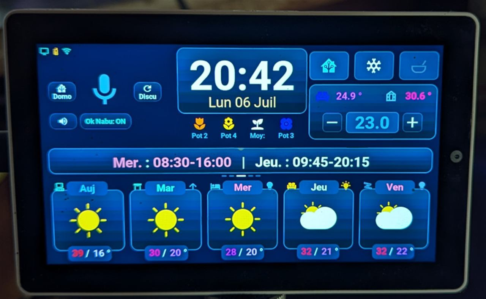
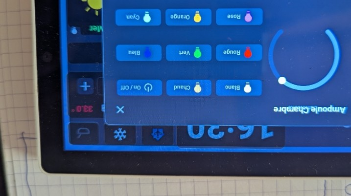
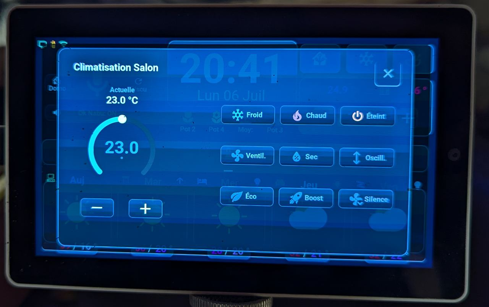
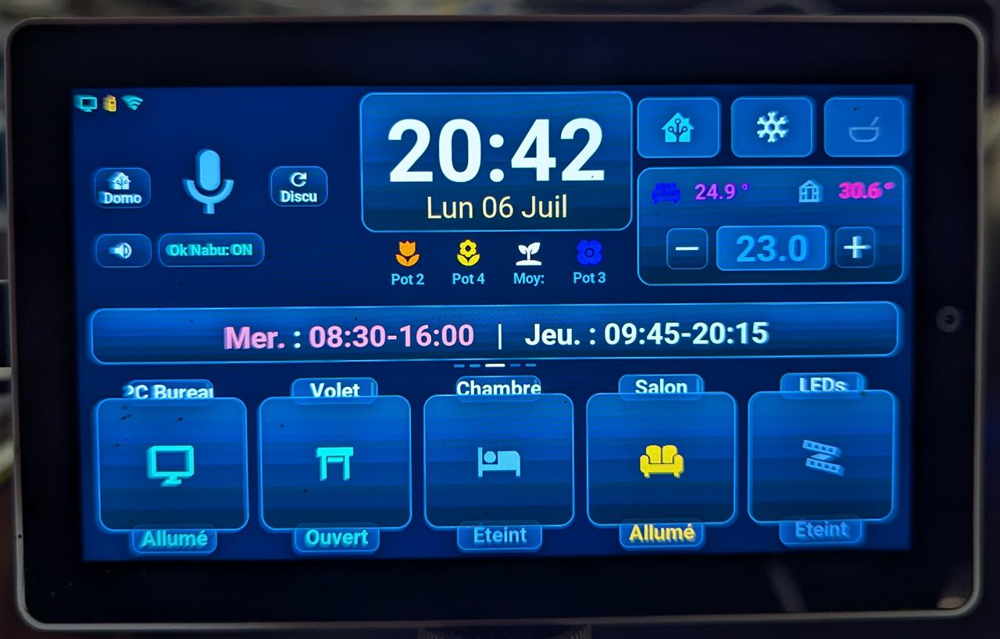
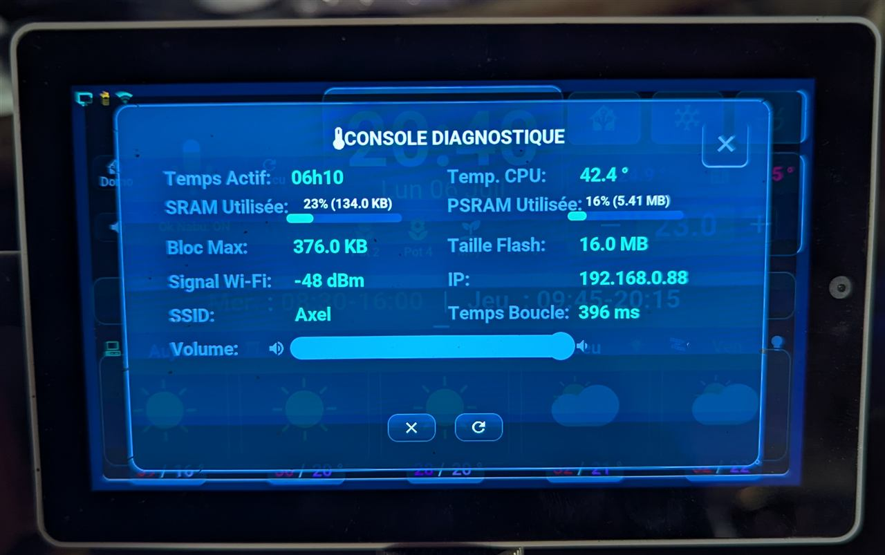

# M5Stack Tab5 — ESPHome HMI with LVGL

<div align="center">

[](https://esphome.io)
[](https://lvgl.io)
[](https://www.home-assistant.io)
[](LICENSE)
[](docs/related_projects.md)

</div>

> *A personal project exploring what's possible when AI writes all the code. Built with Claude, Gemini (Antigravity), Deepseek, Minimax, and z.ai — not a single line typed by hand.*

---

## English · [Français](#version-française)

---

## What this is

A Home Assistant smart-home dashboard running natively on a **M5Stack Tab5 V2** (ESP32-P4), built with ESPHome and LVGL 8.4.

The interface is compiled in C++ and embedded in the device firmware. It does not run a web browser, does not poll for data, and does not depend on a live network connection to stay functional. When Home Assistant has something new to show, it pushes the update directly to the screen.

**Screens:**
| Main Dashboard | Light Control | Climate Control |
|:-:|:-:|:-:|
|  |  |  |

*Main and Climate are real photos of the running device (2026-07-06). Light Control still shows the earlier design reference — no fresh photo of that popup yet.*

More real photos: the same bottom card region toggled to weather view, and the diagnostics console (swipe down from the top, see [`docs/debugging.md`](docs/debugging.md)).

| Domo view (switches↔weather toggle) | Diagnostics console |
|:-:|:-:|
|  |  |

---

## What it does

Six screens, all driven by Home Assistant push events:

- **Home** — time, indoor temp/humidity, short weather summary line, active weather alert indicator, microphone icon with pipeline state
- **Weather** — **5-slide swipeable forecast**: slides 1–2 show hourly weather for the next 15 time slots (time, temperature color-coded, rainfall in mm, condition icon); slides 3–5 show the **15-day daily forecast** (5 days/slide) with color-coded day names, dual-layer condition icons, and max/min temperatures; departmental weather alert banner (yellow/orange/red) shown only when an alert is active
- **Climate** — arc thermostat to set target temperature, mode selector (heat / cool / fan / auto / off), current room temperature; controls are dimmed (not hidden) when the AC is off
- **Plants** — soil moisture gauge for up to 5 BLE plant sensors, color-coded by level (red = dry, green = optimal, blue = too wet), area temperature
- **Planning** — next 4 Google Calendar events with title, time, and event color tag
- **Console** — scrollable debug log for incoming payloads, API events, and pipeline state transitions

**Voice assistant** — runs `okay_nabu` wake-word detection locally on the ESP32-P4. The microphone icon changes color to show the pipeline state in real time: grey (idle) → green (listening) → orange (processing) → blue (speaking) → red (error). Wake-word detection can be toggled on/off from the UI; tapping the mic icon triggers push-to-talk. Two modes selectable from the UI: standard Home Assistant agent or a free-form LLM conversation pipeline.

**Roller shutters** — script buttons on the home screen send open/close/position commands to Home Assistant cover entities.

→ Full screen-by-screen description: [`docs/screens.md`](docs/screens.md)

---

## Key design decisions

- **Push-only, zero polling.** The device never requests state from Home Assistant. Automations on the HA side detect changes and push data to the screen via native ESPHome service calls. CPU stays near zero when nothing changes.
- **Modular YAML.** The ESPHome configuration is split across seven files by concern (hardware, sensors, API logic, styles, UI, globals, scripts). Each file stays under ~600 lines and is independently readable.
- **Native LVGL, no web stack.** Rendering runs at 60 FPS directly in the ESP32-P4's PSRAM. Vector fonts (Material Design Icons) replace image files entirely.
- **Data packing.** Complex payloads (7-day forecast, hourly rain, calendar events) are serialized as semicolon-delimited strings on the HA side and parsed in C++ on the device — one network call, zero subsequent requests.
- **Offline resilience.** All C++ lambdas check `api.connected()` and `has_state()` before touching the UI. If HA restarts, the last known state stays on screen.

---

## Voice assistant

The device runs a local wake-word model (`okay_nabu` via micro_wake_word / TensorFlow Lite) directly on the ESP32-P4. Audio is captured at 16 kHz / 16-bit over I2S and streamed to Home Assistant only after wake-word detection — nothing goes over the network before that.

Sound output goes through the ES8388 DAC chip (I2C + I2S). Boot sequencing is careful about startup order to avoid the hardware pop that happens if the amplifier enable line fires before the I2S clock is stable.

→ Full details: [`docs/voice_assistant.md`](docs/voice_assistant.md)

---

## Documentation

| Page | Contents |
|------|----------|
| [`AGENTS.md`](AGENTS.md) | Entry point for AI coding agents — read order, build/verify commands, boundaries |
| [`CARTOGRAPHIE_TAB5.md`](CARTOGRAPHIE_TAB5.md) | Full dependency graph and file-by-file inventory, with known technical debt |
| [`docs/screens.md`](docs/screens.md) | Screen-by-screen feature description |
| [`docs/architecture.md`](docs/architecture.md) | Modular YAML structure, push paradigm, data packing, boot guards |
| [`docs/hardware.md`](docs/hardware.md) | ESP32-P4 specs, GPIO mapping, ES8388 DAC, PSRAM, power |
| [`docs/ui_design.md`](docs/ui_design.md) | LVGL rendering, vector fonts, dynamic color, CPU optimizations |
| [`docs/voice_assistant.md`](docs/voice_assistant.md) | Wake word pipeline, audio chain, visual feedback states |
| [`docs/installation.md`](docs/installation.md) | Prerequisites, substitutions block, secrets, flash & OTA |
| [`docs/troubleshooting.md`](docs/troubleshooting.md) | Symptom → root cause → fix log for incidents already diagnosed |
| [`docs/debugging.md`](docs/debugging.md) | How to observe/diagnose the device (logs, console overlay, marker technique) |
| [`docs/decisions/`](docs/decisions/README.md) | Architecture decision records — the "why" behind non-obvious choices |
| [`CHANGELOG.md`](CHANGELOG.md) | Version history |
| [`HomeAssistant_Config/README.md`](HomeAssistant_Config/README.md) | HA automations, scripts, template sensors |
| [`Tab5/README.md`](Tab5/README.md) | ESPHome file-by-file description |
| [`docs/related_projects.md`](docs/related_projects.md) | Linked projects, AI experiment context |

---

## Quick start

```bash
# Clone the repo
git clone https://github.com/Axellum/M5-Tab5-ESPHome-LVGL.git

# Edit the substitutions block at the top of tab5-ha-hmi.yaml
# to match your own HA entities, then compile via the ESPHome dashboard
# or CLI: esphome run tab5-ha-hmi.yaml
```

Full step-by-step: [`docs/installation.md`](docs/installation.md)

---

## Repository layout

```
.
├── tab5-ha-hmi.yaml          # Entry point — substitutions + package imports
├── Tab5/                     # ESPHome YAML packages + C++ source
│   ├── tab5-hardware.yaml    # Display, touch, I2C, SPI, DAC
│   ├── tab5-sensors.yaml     # Physical sensors (temp, brightness, plant moisture)
│   ├── tab5-api-logic.yaml   # HA service handlers + C++ lambdas
│   ├── tab5-styles.yaml      # Global LVGL style definitions
│   ├── tab5-lvgl.yaml        # UI layout — screens, widgets, icons
│   ├── tab5-globals.yaml     # Shared global variables
│   ├── tab5-scripts.yaml     # ESPHome script blocks
│   ├── tab5_custom.h         # C++ declarations
│   └── tab5_custom.cpp       # C++ implementations (parsers, helpers)
├── HomeAssistant_Config/     # Automations, scripts, template sensors for HA
└── docs/                     # Extended documentation
```

---

## Note on AI

This project is part of a personal exploration of what AI tools can produce when given full authorship of a technical project. The code, the architecture decisions, and most of this documentation were generated by AI (Claude, Gemini/Antigravity, Deepseek, Minimax, z.ai). The goal was never to produce a polished product — it was to learn, to see where AI helps and where it gets stuck, and to share what came out of it.

If something in the code is weird, it might be an AI quirk. If something works surprisingly well, same answer.

→ More context: [`docs/related_projects.md`](docs/related_projects.md)

---

---

## Version Française

---

## C'est quoi

Un tableau de bord domotique Home Assistant qui tourne nativement sur un **M5Stack Tab5 V2** (ESP32-P4), construit avec ESPHome et LVGL 8.4.

L'interface est compilée en C++ et embarquée dans le firmware de l'appareil. Elle ne fait pas tourner de navigateur web, ne poll pas les données, et ne dépend pas d'une connexion réseau active pour rester fonctionnelle. Quand Home Assistant a quelque chose de nouveau à afficher, il pousse directement la mise à jour vers l'écran.

---

## Choix de conception

- **Push uniquement, zéro polling.** L'appareil ne demande jamais son état à Home Assistant. Les automations côté HA détectent les changements et poussent les données vers l'écran via des appels de service ESPHome natifs. Le CPU reste proche de zéro quand rien ne change.
- **YAML modulaire.** La configuration ESPHome est découpée en sept fichiers par domaine (hardware, capteurs, logique API, styles, UI, globales, scripts). Chaque fichier reste sous ~600 lignes et est lisible indépendamment.
- **LVGL natif, pas de stack web.** Le rendu tourne à 60 FPS directement dans la PSRAM de l'ESP32-P4. Les polices vectorielles (Material Design Icons) remplacent complètement les fichiers image.
- **Compression de données.** Les payloads complexes (prévisions 7 jours, pluie horaire, événements calendrier) sont sérialisés en chaînes séparées par des points-virgules côté HA et parsés en C++ sur l'appareil — un seul appel réseau, zéro requête suivante.
- **Résilience hors-ligne.** Toutes les lambdas C++ vérifient `api.connected()` et `has_state()` avant de toucher l'UI. Si HA redémarre, le dernier état connu reste affiché.

---

## Ce que ça fait

Six écrans, tous alimentés par des événements push Home Assistant :

- **Accueil** — heure, temp/humidité intérieure, ligne résumé météo, indicateur d'alerte active, icône microphone avec état du pipeline
- **Météo** — **prévisions par swipe en 5 slides** : slides 1–2 affichent la météo horaire pour les 15 prochaines tranches (heure, température avec code couleur, pluie en mm, icône condition) ; slides 3–5 affichent les **prévisions journalières 15 jours** (5 jours/slide) avec noms de jours en code couleur, icônes double couche, temp max/min ; bandeau d'alerte météo départementale (jaune/orange/rouge) affiché uniquement quand une alerte est active
- **Clim** — arc thermostat pour la température cible, sélecteur de mode (chaud / froid / ventilation / auto / arrêt), température ambiante actuelle ; les contrôles sont estompés (non cachés) quand le clim est éteint
- **Plantes** — jauge d'humidité du sol pour jusqu'à 5 capteurs BLE, code couleur par niveau (rouge = sec, vert = optimal, bleu = trop humide), température de zone
- **Planning** — 4 prochains événements Google Calendar avec titre, heure et tag couleur de l'événement
- **Console** — log de débogage défilant pour les payloads entrants, événements API et transitions d'état du pipeline

**Assistant vocal** — fait tourner la détection wake-word `okay_nabu` localement sur l'ESP32-P4. L'icône microphone change de couleur pour montrer l'état du pipeline en temps réel : gris (repos) → vert (écoute) → orange (traitement) → bleu (synthèse) → rouge (erreur). La détection wake-word peut être activée/désactivée depuis l'UI ; taper sur l'icône micro déclenche le push-to-talk. Deux modes sélectionnables depuis l'UI : agent Home Assistant standard ou pipeline de conversation LLM libre.

**Volets roulants** — des boutons de script sur l'écran d'accueil envoient des commandes ouvrir/fermer/position aux entités cover de Home Assistant.

→ Description écran par écran : [`docs/screens.md`](docs/screens.md)

---

## Assistant vocal

L'appareil fait tourner un modèle de wake-word local (`okay_nabu` via micro_wake_word / TensorFlow Lite) directement sur l'ESP32-P4. L'audio est capturé en 16 kHz / 16-bit sur I2S et streamé vers Home Assistant uniquement après la détection du wake-word — rien ne passe sur le réseau avant ça.

La sortie sonore passe par le chip DAC ES8388 (I2C + I2S). Le séquencement au démarrage est soigneux pour éviter le pop hardware qui se produit si la ligne d'activation amplificateur passe avant que l'horloge I2S soit stable.

→ Détail complet : [`docs/voice_assistant.md`](docs/voice_assistant.md)

---

## Documentation

| Page | Contenu |
|------|---------|
| [`AGENTS.md`](AGENTS.md) | Point d'entrée pour les agents IA — ordre de lecture, commandes build/vérif, frontières (en anglais) |
| [`CARTOGRAPHIE_TAB5.md`](CARTOGRAPHIE_TAB5.md) | Graphe de dépendances complet et inventaire fichier par fichier, dette technique connue |
| [`docs/screens.md`](docs/screens.md) | Description fonctionnelle écran par écran |
| [`docs/architecture.md`](docs/architecture.md) | Structure YAML modulaire, paradigme push, data packing, boot guards |
| [`docs/hardware.md`](docs/hardware.md) | Specs ESP32-P4, mapping GPIO, DAC ES8388, PSRAM, alimentation |
| [`docs/ui_design.md`](docs/ui_design.md) | Rendu LVGL, polices vectorielles, couleur dynamique, optimisations CPU |
| [`docs/voice_assistant.md`](docs/voice_assistant.md) | Pipeline wake-word, chaîne audio, états de retour visuel |
| [`docs/installation.md`](docs/installation.md) | Prérequis, bloc substitutions, secrets, flash & OTA |
| [`docs/troubleshooting.md`](docs/troubleshooting.md) | Journal symptôme → cause racine → correctif des incidents déjà diagnostiqués |
| [`docs/debugging.md`](docs/debugging.md) | Comment observer/diagnostiquer l'appareil (logs, overlay console, technique des marqueurs) |
| [`docs/decisions/`](docs/decisions/README.md) | Décisions d'architecture (ADR) — le "pourquoi" des choix non-évidents (en anglais) |
| [`CHANGELOG.md`](CHANGELOG.md) | Historique des versions |
| [`HomeAssistant_Config/README.md`](HomeAssistant_Config/README.md) | Automations HA, scripts, template sensors |
| [`Tab5/README.md`](Tab5/README.md) | Description fichier par fichier ESPHome |
| [`docs/related_projects.md`](docs/related_projects.md) | Projets liés, contexte expérimentation IA |

---

## Note sur l'IA

Ce projet fait partie d'une exploration personnelle de ce que les outils IA peuvent produire quand on leur laisse la pleine paternité d'un projet technique. Le code, les décisions d'architecture et la plupart de cette documentation ont été générés par des IA (Claude, Gemini/Antigravity, Deepseek, Minimax, z.ai). Le but n'a jamais été de produire un produit fini — c'était d'apprendre, de voir où l'IA aide et où elle coince, et de partager ce qui en est sorti.

Si quelque chose dans le code est bizarre, c'est peut-être un quirk d'IA. Si quelque chose marche étonnamment bien, même réponse.

→ Plus de contexte : [`docs/related_projects.md`](docs/related_projects.md)
