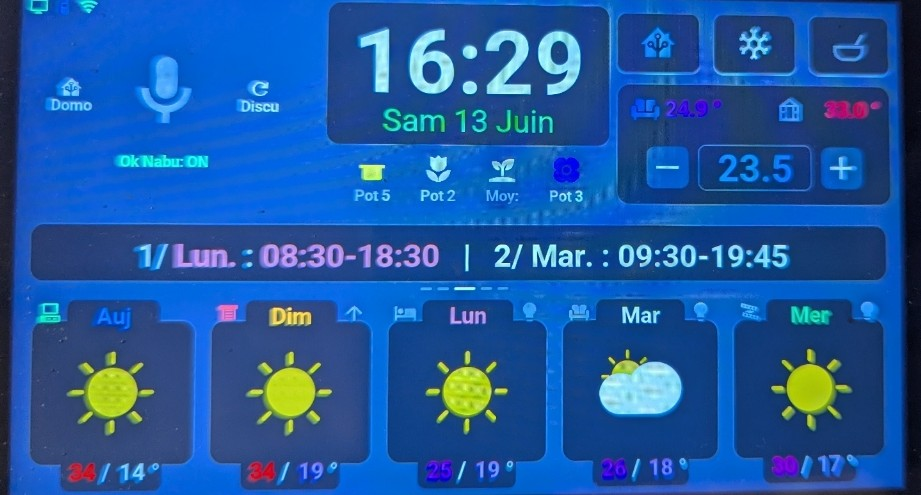
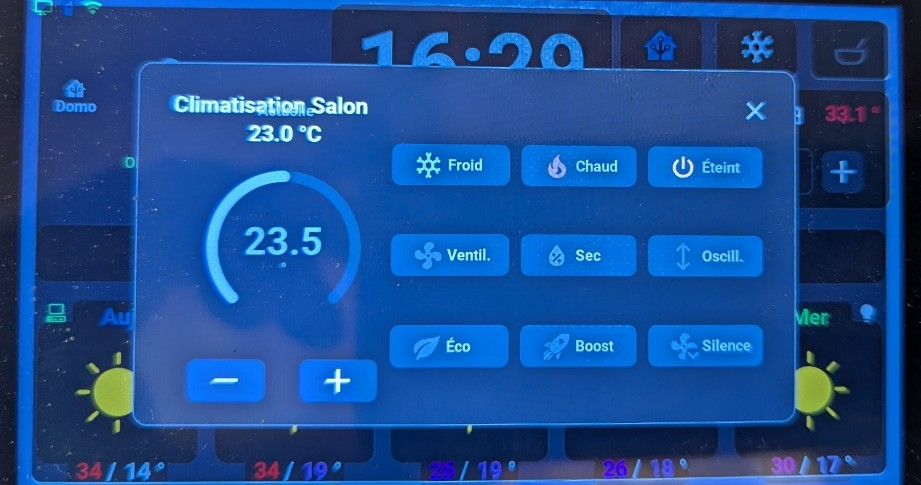

# M5Stack Tab5 - "Sans les mains" (AI-Powered High-Performance HMI & ESPHome/LVGL Dashboard)

  
  
  
  
  

 

---

## 📸 Aperçu du Nouveau Design Premium / UI Preview

Voici l'interface graphique HMI fluide et réactive conçue par l'IA et l'utilisateur, fonctionnant nativement sur l'écran tactile **M5Stack Tab5 V2** :

| Écran d'Accueil / Main Dashboard | Contrôle des Lumières / Light Control | Contrôle Climatisation / Climate Control |
| :---: | :---: | :---: |
|  |  |  |

---

## 🇫🇷 Version Française

### 📖 L'histoire de ce projet
Ce dépôt est le résultat d'une expérience technologique personnelle : **un amateur en programmation peut-il concevoir une interface domotique complète, réactive à 60 FPS sur un écran tactile dédié, en utilisant uniquement l'Intelligence Artificielle ?**

La réponse est **oui**. Ayant atteint les limites techniques d'un écran Nextion série, j'ai migré vers le **M5Stack Tab5 V2** (ESP32-P4) en laissant l'IA (Antigravity / Gemini / Claude) générer l'intégralité du code C++ custom, de l'interface LVGL 8.4 et des automatisations Home Assistant. Je n'ai pas tapé une seule ligne de code moi-même !

Je partage ce projet avec la communauté domotique pour qu'il puisse servir d'inspiration, de boîte à outils ou d'exemples d'optimisations matérielles pour ESP32-P4 et LVGL sous ESPHome.

---

### 🏗️ Logique de Synchronisation : L'Architecture Push (Événementielle)
Pour libérer le processeur ESP32 et la mémoire de l'écran, le Tab5 **ne demande jamais son état** à Home Assistant. L'écran IoT reste entièrement passif :
* **Déclencheurs sur Home Assistant :** La logique est centralisée sur Home Assistant. Des automatisations surveillent les entités physiques et poussent les données vers le Tab5 via des appels de services API ESPHome à la moindre modification.
* **Traffic Pacing (Régulation du trafic) :** Pour éviter d'écraser le buffer réseau et le cache graphique LVGL de l'ESP32-P4, Home Assistant applique un délai de **1 seconde** entre l'envoi de chaque bloc de données, et de **150 millisecondes** au sein des boucles de transmission de prévisions.

---

### 💡 Optimisations Matérielles & LVGL : Ce qui rend ce projet unique

* 🚀 **Fluidité Graphique Absolue (60 FPS) :** L'allocation de mémoire du frame buffer de LVGL est poussée à 100% (~1.8 Mo) directement dans la PSRAM de l'ESP32-P4. La commutation de page se fait instantanément en arrière-plan puis est transmise au bus MIPI-DSI 16 bits en mode DMA (Direct Memory Access), supprimant tout lag visuel ("rideau de balayage").
* 💾 **Optimisation CPU et RAM Extrême :**
  * **Abolition de la transparence Alpha** sur les PNG (l'endianness de la puce provoque des crashs du firmware si les fichiers incluent de l'alpha). Les images météo subissent un pré-calcul (*pre-baking*) sur fond opaque uni (couleur de fond `#23262E`) et inversion des canaux Rouge/Bleu avant compilation.
  * **Rendu vectoriel ultra-léger :** Utilisation intensive de la police vectorielle *Material Design Icons (MDI)* avec antialiasing matériel désactivé (`bpp: 1`) pour un rendu net et un calcul CPU quasi instantané par l'ESP32-P4 dépourvu d'accélération 2D native.
  * **Radius et coins arrondis proscrits** sur les objets transparents ou à fond invisible pour économiser les lourds calculs de fondu du processeur.
  * **Pas de scrollbar** non désirée (`scrollbar_mode: "OFF"`) et paddings internes à zéro (`pad_all: 0`) pour un placement au pixel-perfect.

---

### 📚 Structure du Projet & Configuration
* [⚙️ Matériel & Câblage Tab5](docs/hardware.md) — Spécifications, branchements GPIO et bus I2C (APIs audio DAC ES8388, puce tactile ST7123, expanders).
* [🏗️ Code ESPHome & Lambdas C++](docs/architecture.md) — Organisation des fichiers `.yaml` (packages), inclusion de `tab5_custom.cpp` / `.h`.
* [🎨 UI Design & LVGL](docs/ui_design.md) — Structuration des cartes d'interface, polices et mise en page à 6 tuiles.
* `HomeAssistant_Config/` — Contient les automatisations YAML et scripts nécessaires côté serveur pour pousser les informations météo, de climatisation et de planning à l'écran.

---

## 🇺🇸 English Version

### 📖 Project Background
This repository is the result of a personal experiment: **can a programming novice create a fully functional, 60 FPS native smart home dashboard using only Artificial Intelligence?**

The answer is **yes**. After hitting the technical limits of an old serial Nextion screen, I migrated to the **M5Stack Tab5 V2** (ESP32-P4) and let an AI (Antigravity / Gemini / Claude) handle all the C++ coding, the LVGL 8.4 interface, and the Home Assistant automations. I didn't write a single line of code myself!

I am sharing this with the community as a toolbox, inspiration source, or for hardware optimization examples on ESP32-P4 and LVGL under ESPHome.

---

### 🏗️ Synchronization Logic: The Event-Driven Push Architecture
To save memory and CPU on the micro-controller, the Tab5 **never requests status updates** from Home Assistant. The screen remains entirely passive:
* **Home Assistant Automations:** The logic is centralized on Home Assistant. Automations monitor physical devices and push state changes (weather, AC, shutters) to the Tab5 via ESPHome API service calls.
* **Traffic Pacing:** To avoid network buffer overflows, Home Assistant spaces service calls **1 second** apart, and uses a **150ms delay** inside loops.

---

### 💡 Hardware & LVGL Optimizations: What Makes it Unique

* 🚀 **Butter-Smooth 60 FPS Graphics:** LVGL frame buffer is allocated 100% (~1.8 MB) in the ESP32-P4 PSRAM. Transitions are rendered in the background and pushed to the MIPI-DSI 16-bit bus using DMA, eliminating screen tearing.
* 💾 **Extreme CPU/RAM Optimizations:**
  * **No Alpha Transparency** on PNGs (due to ESP32-P4 little-endian rendering overhead causing firmware crashes). Weather images are pre-baked on solid backgrounds (color `#23262E`) with red/blue channels swapped.
  * **Lightweight Iconography:** Intensive use of *Material Design Icons (MDI)* vector fonts with hardware antialiasing disabled (`bpp: 1`) for near-zero rendering time.
  * **No rounded corners (radius: 0)** on transparent objects to avoid alpha blending CPU overhead.
  * **Scrollbars disabled** (`scrollbar_mode: "OFF"`) and paddings set to zero (`pad_all: 0`) for pixel-perfect placement.
