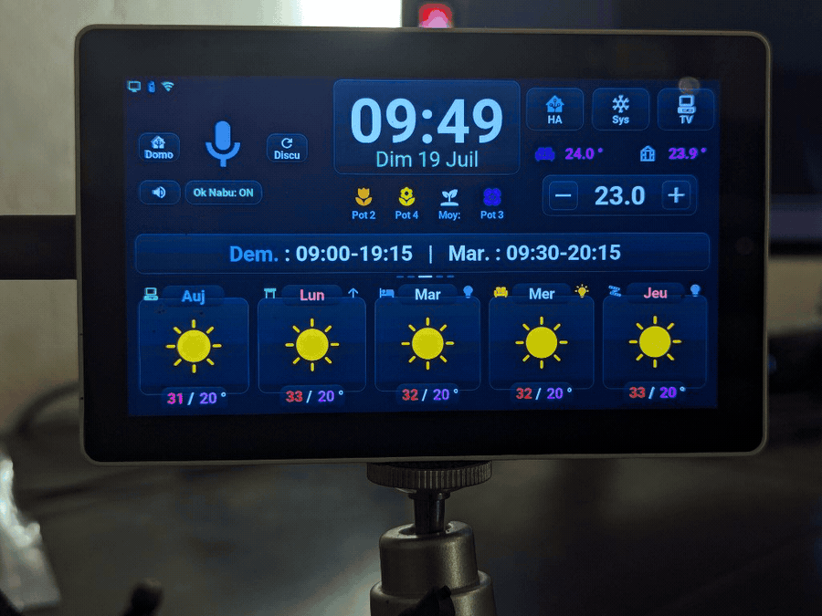
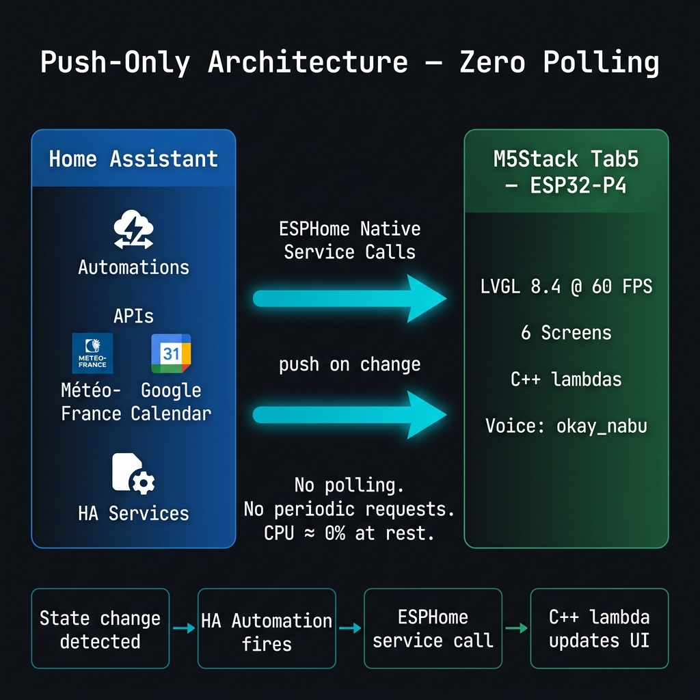
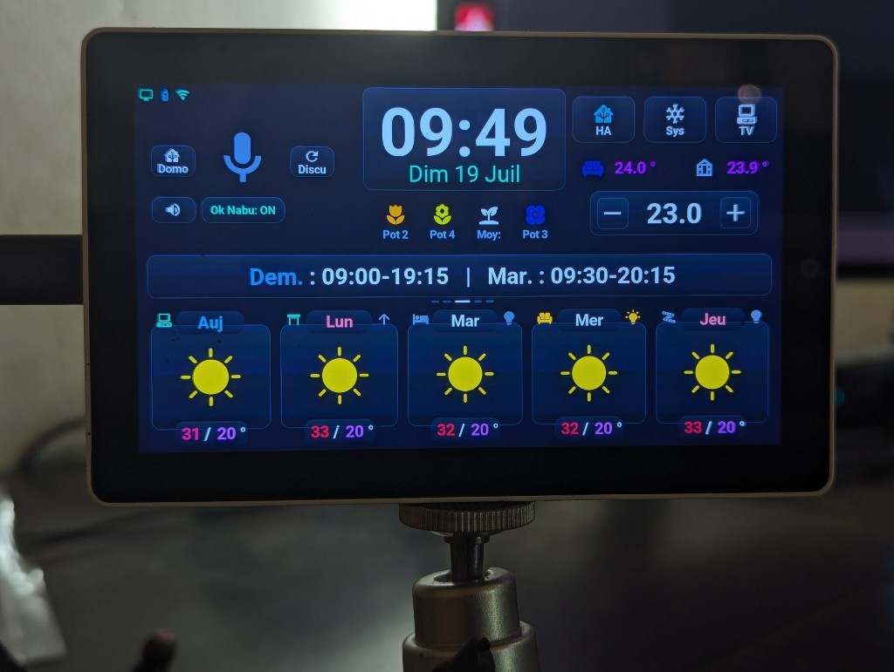
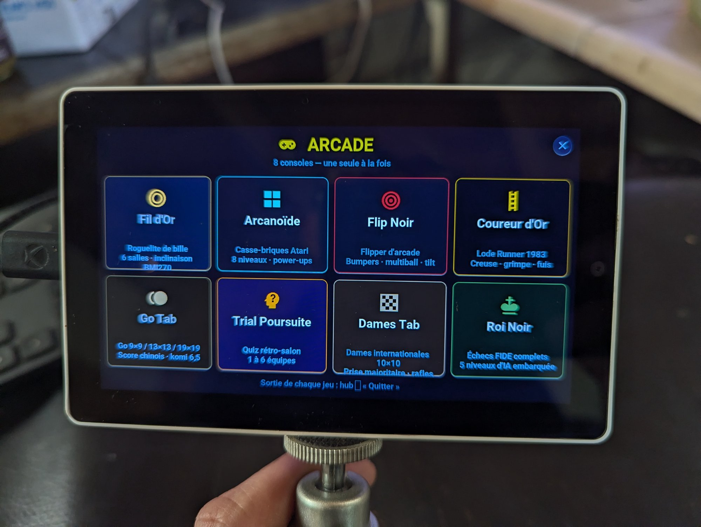
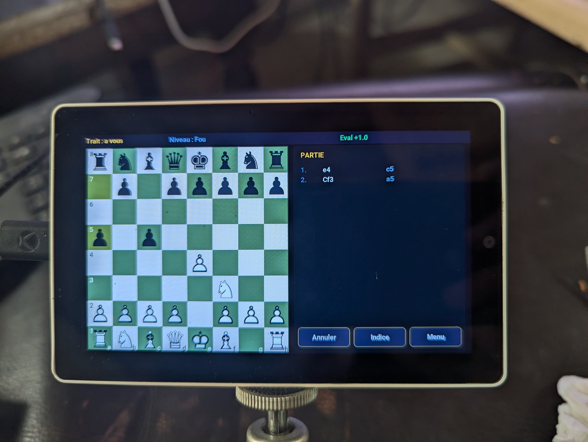
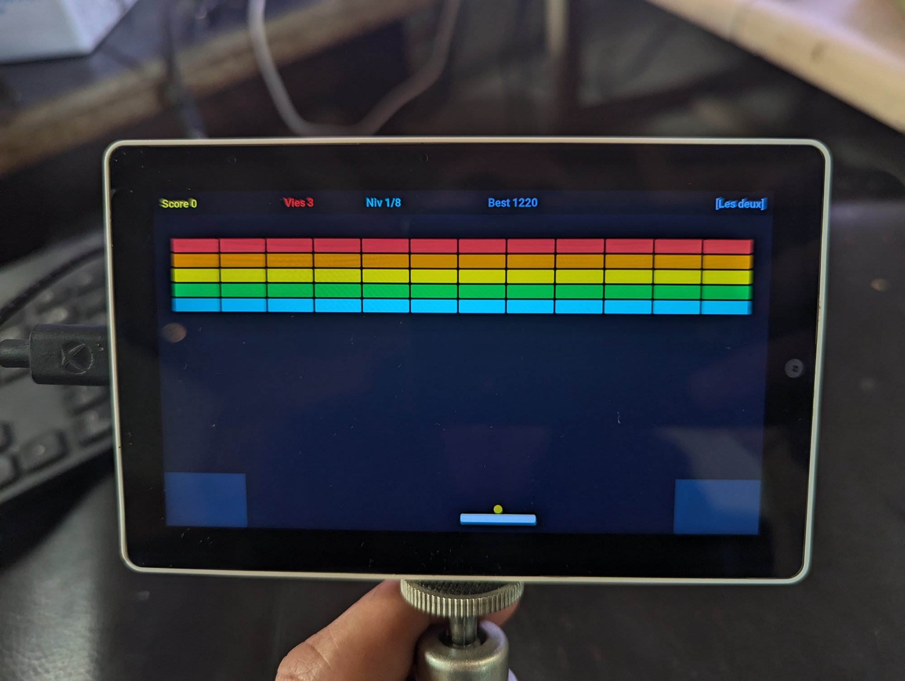
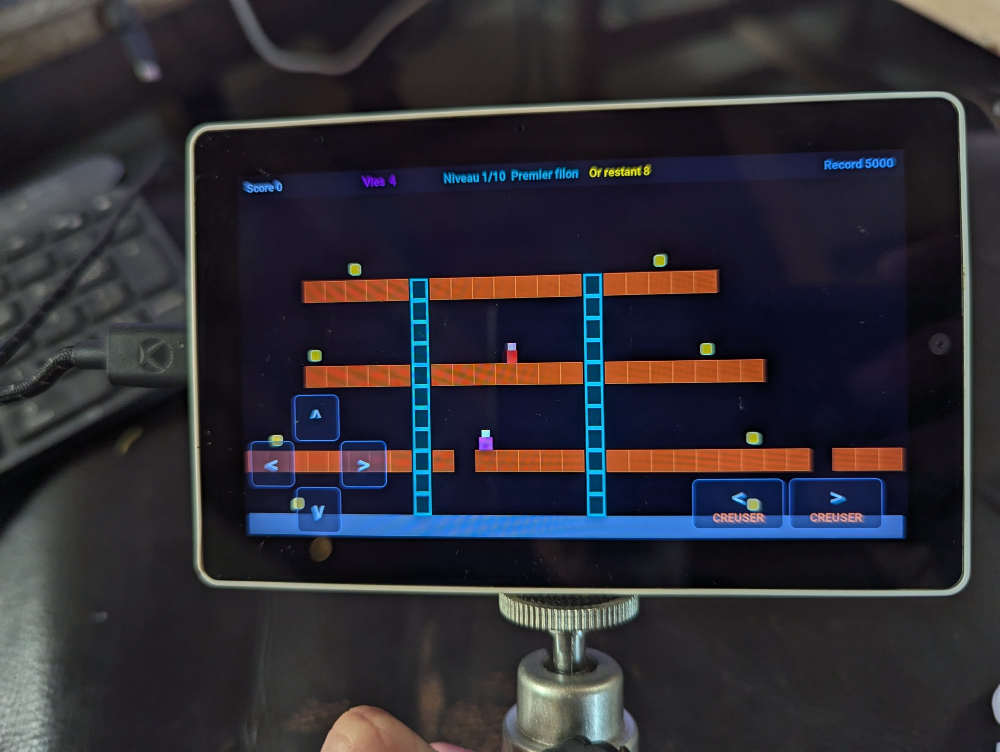
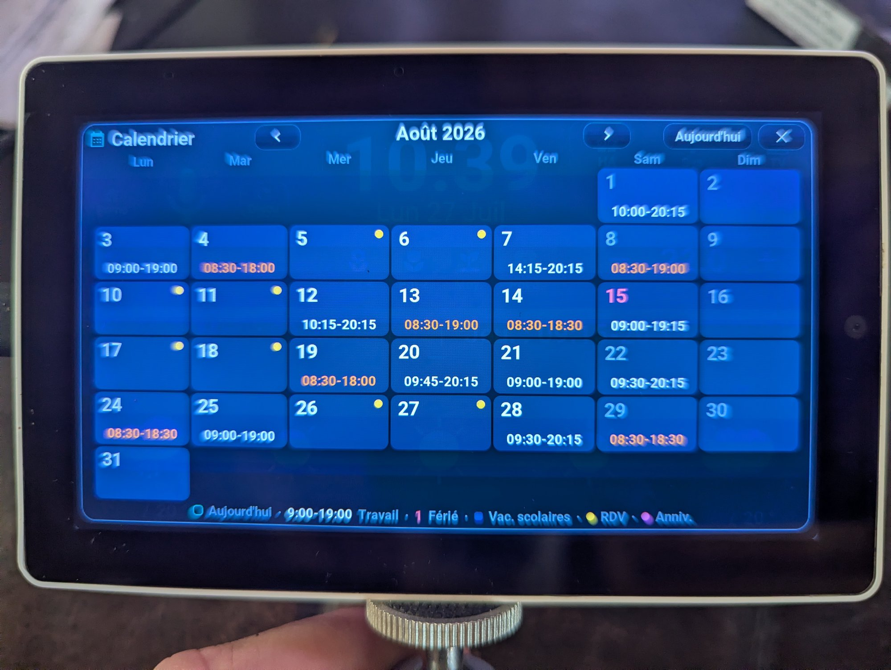
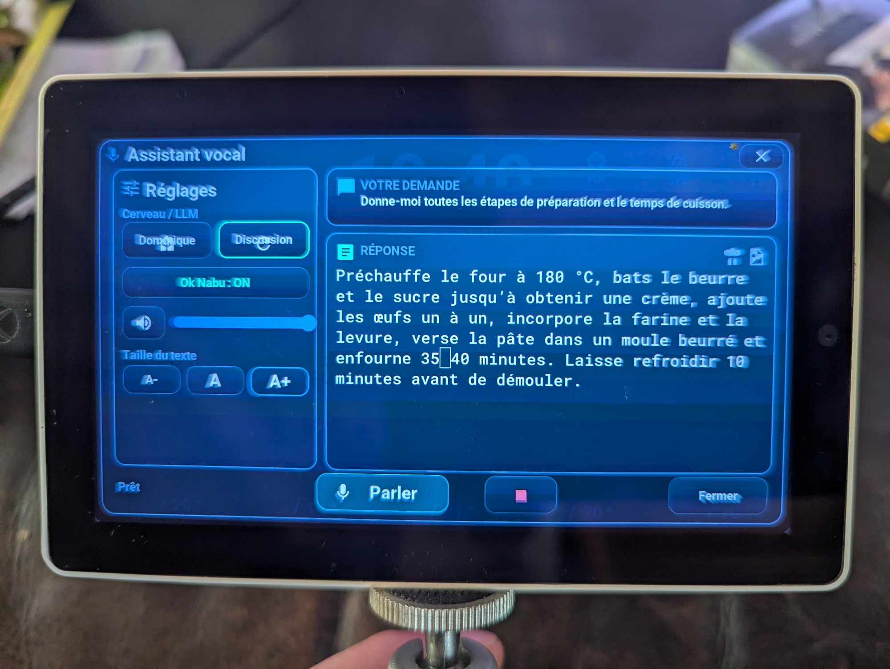

# M5Stack Tab5 — ESPHome HMI with LVGL

<div align="center">

[](https://esphome.io)
[](https://github.com/Axellum/M5-Tab5-ESPHome-LVGL/actions/workflows/esphome-tab5.yml)
[](https://lvgl.io)
[](https://www.home-assistant.io)
[](LICENSE)
[](docs/related_projects.md)

</div>

> *A personal project exploring what's possible when AI writes all the code. Built with Antigravity, DeepSeek, MiniMax, Z.ai, Claude, and Cursor — not a single line typed by hand. I am more the architect than the author.*

---

## English · [Français](#version-française)

---

## A short personal note

Having heard a lot about AI — especially for coding — a few months ago I wanted to see for myself what it could actually do. I needed a project, and my old Nextion screen (mostly weather, still on ESPHome and Météo-France) was starting to feel dated. So I decided to replace it — this time with a much more ambitious home-automation setup, on a far more capable display, driven by AI from end to end.

One thing led to another: I added a voice assistant to the screen, then a local “engine” to handle voice home-automation on-device / on-LAN, and semi-local or cloud paths for open conversation. That engine is still a work in progress (of course 🙂) — I put a lot (too much) into it to experiment and better understand how LLMs work: RAG, scoring, multi-LLM routing, MCP, and more. I share it mostly for information: I use it day-to-day with this screen, but not yet for coding, nor for everything I tried to pack in — some of which works more or less well.

I started with Antigravity, then leaned on various models (DeepSeek, MiniMax, Z.ai). Next I tried Claude, which also did a lot of the work, then Cursor more recently. In short: this is my everyday screen project — I am more its architect than its creator — born from my first steps into the world of AI.

**So, why a screen, though?**

After five years with the Nextion, I wanted to give my mostly-weather screen a facelift, keeping at least the same core goals:

- Be a clock.
- Warn me at a glance if rain is coming within the hour — do I leave 15 minutes early so I don't show up soaked at the office? Do I grab an umbrella?
- Show the forecast for the next few days, so I have a conversation topic for the rare occasions I decide to be social.
- Do all that on reasonable power, always on (well, whenever I'm actually in front of it), with total freedom over layout, design and logic — not just the stock Home Assistant dashboard — with all the upsides that come with it... and the downsides.

Then home-automation ambitions crept in:

- A direct readout of the soil moisture in my plant pots / veggie patch.
- Turn the TV and PC on without lifting my butt off the chair.
- Control the three living-room spotlights and the bedroom light.

Then, little by little...

- Control my AC.
- Operate the roller shutter — again, without getting up.
- Add "Ok Nabu" wake-word support, so I don't even have to lean over to grab the screen anymore 🙂
- Polish the voice assistant: a conversation mode, a choice of LLM (local or not), and home commands that are as fast as possible and actually understand me.
- Display my work schedule so I can read my shift hours at a glance.
- Get a network remote for my TV — it can always come in handy. (Funny story: Claude Fable 5 completely blew me away on that one — it built the whole thing in two prompts flat. Naturally, I then let it loose redoing *every single popup* in the project… at the cost of roughly 50% of my 5-hour usage cap per popup, on the Pro plan. Worth it.)

All of that with these design goals in mind. My very first sessions with Gemini, rewriting the old Nextion code, were honestly humbling — it rethought how the data got sent and cut the codebase to a third of its size. So this time I wanted lightness and much better optimization than anything I'd hand-rolled myself:

- No images anywhere — as light and optimized for the tablet as it gets.
- Data pushes on the Home Assistant side as gentle as possible (my HA runs on a Freebox box, so I have to stay lean).
- A fast boot with no display lag — something that just *feels* smooth.

I also aimed for a modern-feeling interface (I'm in my fifties — don't expect miracles): no separate pages, just popups, everything reachable via a button, a long-press, or a swipe. Heavy color-coding gives at-a-glance readability from a few meters away, even though the screen is really meant to be read from under a meter for the fine print. And I tried to pack the maximum info/controls onto something that stays reasonably clean — yes, I know, "clean" is the part I'm worst at. End goal: a screen that looks decent to the eye, even though deep down I'm way more about function than form.

Companion backend (optional, work-in-progress): **[vromvrom-engine](https://github.com/Axellum/vromvrom-engine)** — multi-agent orchestrator used for voice routing and conversation.

---

## See it in action

**Demo video** (voice, touch UI, TV remote, climate — provisional cut, July 2026):

[](https://www.youtube.com/watch?v=ygNhgtMffu4)

**Animated overview** — home, domotics, plants, climate, lights, TV, console:



| Push-only architecture | Main dashboard (live) |
|:-:|:-:|
|  |  |

---

## What this is

A Home Assistant smart-home dashboard running natively on a **M5Stack Tab5 V2** (ESP32-P4), built with ESPHome and LVGL 8.4.

The interface is compiled in C++ and embedded in the device firmware. It does not run a web browser, does not poll for data, and does not depend on a live network connection to stay functional. When Home Assistant has something new to show, it pushes the update directly to the screen.

---

## What it does

A single 1280×720 page organized in functional areas, all driven by Home Assistant push events (see [ADR-0002](docs/decisions/0002-single-page-swipe-navigation.md) — there is no multi-screen tab bar):

- **Home area** — time, indoor temp/humidity, quick-action buttons, microphone icon with pipeline state; the date recolors with the active weather-alert level
- **Weather** — **5-window swipeable forecast** in the bottom region: windows 1–2 show hourly weather for the next 15 time slots (time, temperature color-coded, rainfall in mm, condition icon); windows 3–5 show the **15-day daily forecast** (5 days/window) with color-coded day names, dual-layer condition icons, and max/min temperatures
- **Central rotating card** — cycles every 8 s between planning, short-term rain graph, Météo-France vigilance icons, an info panel (3-day calendar recap or weather-alert banner), and up to **4 Home Assistant alert / info banners** pushed live from HA
- **Tap to dismiss** — tapping an info banner or an HA alert removes it immediately from the rotator (local dismiss list so a re-push of the same id stays hidden until HA sends a new one)
- **TV remote** — fullscreen Samsung IR remote popup (power, pad, volume, channels, playback, mute…) opened from the UI; commands go through Home Assistant `remote.*` services
- **Climate** — compact card + near-fullscreen popup in 3 glass cards: stacked mode buttons (cool / heat / dry / fan / off), a 320 px arc thermostat with optimistic target and debounced updates, presets (eco / boost / quiet) and airflow control (swing / Daikin "Brise" `windnice`); controls are dimmed (not hidden) when the AC is off
- **Lights** — near-fullscreen popup in 3 glass cards: 3-light selector (switch lights without closing the popup), live-% brightness arc (debounced) with 10/35/65/100 % shortcuts, 3 named whites + 12 round color swatches
- **Plants** — soil moisture card for up to 5 BLE plant sensors, dynamically sorted, color-coded by level (red = dry, green = optimal, blue = too wet); a long press opens a 5-card detail popup (moisture + watering status, fertility, light, temperature, sensor battery)
- **Console** — diagnostics + HA management overlay (RAM/PSRAM, Wi-Fi, uptime, volume, re-push screen, reload automations, restart HA / reboot tablet behind confirm), opened via its dedicated button
- **Arcade** — 8 fullscreen game consoles (experimental prototypes — first-pass AI-generated code to test what's possible on an ESP32-P4): **Fil d'Or** (marble roguelite, tilt-controlled), **Arcanoïde** (Breakout clone), **Neon Apron** (pinball, portrait), **Coureur d'Or** (Lode Runner), **Go Tab** (Go 9×9/13×13/19×19), **Trial Poursuite** (trivia quiz), **Dames Tab** (draughts 10×10), **Roi Noir** (FIDE chess with embedded AI). All 100% local, zero HA/network dependency, NVS persistence. Opened via a 4×2 selector grid triggered by tapping the greenhouse temperature
- **Popup Assistant** — near-fullscreen modal showing the STT transcription ("Your request") and the LLM reply rendered as Markdown (tables, bold, code, images downloaded on demand); left panel = settings (brain selector Domotique/Discussion, Ok Nabu toggle, volume, text size A-/A/A+)
- **Popup Calendar** — monthly 7×6 grid computed locally from SNTP; work hours inside cells, color-coded markers (public holidays, school holidays, appointments, birthdays); tap a day for a detail sub-popup; HA enriches on demand
- **Popup Plant Details** — 5 fixed glass cards (one per BLE sensor) showing soil moisture %, watering status, fertility (EC µS/cm), light (lx), temperature, battery — opened by long-press on the dashboard moisture slots

**Voice assistant** — runs `okay_nabu` wake-word detection locally on the ESP32-P4. The microphone icon changes color to show the pipeline state in real time: grey (idle) → green (listening) → orange (processing) → blue (speaking) → red (error). Wake-word detection can be toggled on/off from the UI; tapping the mic icon triggers push-to-talk. A second on-device wake word — **"Stop"** — is armed only while the roller shutter is moving and halts it instantly, with no wake phrase and no pipeline round-trip; tapping the mic while the assistant is speaking interrupts the reply and re-opens listening. Two modes selectable from the UI: standard Home Assistant agent, or a **Discussion** pipeline backed by [vromvrom-engine](https://github.com/Axellum/vromvrom-engine) (local STT/TTS via Wyoming, engine routing for deterministic HA commands vs LLM chat).

**Roller shutters** — script buttons on the home screen send open/close/position commands to Home Assistant cover entities.

→ Full screen-by-screen description: [`docs/screens.md`](docs/screens.md)

---

## Arcade — 8 game consoles (experimental)

> **Status: early prototypes.** These are first-pass, AI-generated games built to test what LVGL + C++ can do on an ESP32-P4 at 60 FPS. They are functional but not polished — think "proof of concept" rather than "finished product." The goal was to see how far AI code generation can go on embedded hardware, not to ship retail-quality games.

All 8 consoles share the same architecture: each one is its **own fullscreen LVGL page** (`page_marble`, `page_chess`… declared `skip: true` so swipe navigation can't reach them), not an overlay stacked on the dashboard — the only documented exception to the modal chrome rule (ADR-0009). YAML reduced to empty containers, all content built in C++, `lv_timer` created on open / destroyed on close, NVS persistence, **zero Home Assistant or network dependency**.

| # | Console | Type | Controls |
|---|---------|------|----------|
| 1 | **Fil d'Or** | Marble roguelite (6 rooms, Dark Souls-style progression) | Tilt (BMI270) |
| 2 | **Arcanoïde** | Breakout / Arkanoid (8 levels, power-ups) | Tilt + touch |
| 3 | **Neon Apron** | Pinball — **portrait**, switches the screen to 720×1280 | Touch zones + IMU nudge |
| 4 | **Coureur d'Or** | Lode Runner (10 levels, dig & climb) | Touch D-pad |
| 5 | **Go Tab** | Go 9×9 / 13×13 / 19×19 (Chinese scoring, komi 6.5) | Touch |
| 6 | **Trial Poursuite** | Trivia quiz (1–6 teams, retro living-room style) | Touch |
| 7 | **Dames Tab** | Draughts 10×10 (international rules, embedded AI) | Touch |
| 8 | **Roi Noir** | FIDE chess (full rules, 5 AI levels, perft-validated) | Touch |



| Roi Noir (chess) | Arcanoïde (breakout) |
|:-:|:-:|
|  |  |

| Coureur d'Or (Lode Runner) | Calendar popup |
|:-:|:-:|
|  |  |

| Assistant popup (Discussion mode) |
|:-:|
|  |

→ Full technical details per game: [`Tab5/README.md`](Tab5/README.md#arcade--les-8-consoles)

---

## Key design decisions

- **Push-only, zero polling.** The device never requests state from Home Assistant. Automations on the HA side detect changes and push data to the screen via native ESPHome service calls. CPU stays near zero when nothing changes.
- **Modular YAML.** The ESPHome configuration is split across ten files by concern (tokens, hardware, diagnostics sensors, home-automation sensors, API logic, styles, UI, globals, scripts, IMU), each independently readable. Most stay in the 150–500 line range; the two that carry the bulk of the behaviour (`tab5-scripts.yaml`, `tab5-lvgl.yaml`) are larger, and the UI is further split into 33 reusable `ui_components/*.yaml`.
- **Native LVGL, no web stack.** Rendering runs at 60 FPS directly in the ESP32-P4's PSRAM. Vector fonts (Material Design Icons) replace image files entirely.
- **Data packing.** Complex payloads (15-day forecast, hourly forecast, weather alerts) are serialized as delimited strings on the HA side and parsed in C++ on the device — one network call, zero subsequent requests.
- **Offline resilience.** All C++ lambdas check `api.connected()` and `has_state()` before touching the UI. If HA restarts, the last known state stays on screen.

---

## Voice assistant & engine

The Tab5 is an **Assist Satellite**: it does not “understand” French itself. It captures audio, shows pipeline state, and plays the reply.

| Step | Where | What happens |
|------|--------|----------------|
| 1. Wake word | Tab5 (on-device) | `okay_nabu` via micro_wake_word / TensorFlow Lite — idle listening stays local |
| 2. STT | Home Assistant (Wyoming Whisper, local) | Speech → text |
| 3. Intent / reply | HA conversation agent → optional **[vromvrom-engine](https://github.com/Axellum/vromvrom-engine)** | Domotics: fast local / deterministic match → HA action. Discussion: light LLM path (local and/or cloud). Specialists (web, calendar…) when classified by the engine host |
| 4. TTS | Home Assistant (Wyoming Piper, local) | Text → speech |
| 5. Playback | Tab5 (ES8388 DAC + amp) | Reply on the built-in speaker |

Audio is captured at 16 kHz / 16-bit over I2S and streamed to Home Assistant only after wake-word detection — nothing goes over the network before that. Boot sequencing avoids the hardware pop if the amp enable line fires before the I2S clock is stable.

The engine is optional for the screen UI (push dashboard works without it). It is what makes the **voice + conversation** path interesting: local for short HA commands, semi-local / cloud only when a real chat answer is needed.

→ Full details: [`docs/voice_assistant.md`](docs/voice_assistant.md) · Engine repo: [vromvrom-engine](https://github.com/Axellum/vromvrom-engine) · Context: [`docs/related_projects.md`](docs/related_projects.md)

---

## Documentation

| Page | Contents |
|------|----------|
| [`AGENTS.md`](AGENTS.md) | Entry point for AI coding agents — read order, build/verify commands, boundaries |
| [`CARTOGRAPHIE_TAB5.md`](CARTOGRAPHIE_TAB5.md) | Full dependency graph and file-by-file inventory, with known technical debt |
| [`docs/screens.md`](docs/screens.md) | Screen-by-screen feature description |
| [`docs/architecture.md`](docs/architecture.md) | Modular YAML structure, push paradigm, data packing, boot guards |
| [`docs/hardware.md`](docs/hardware.md) | ESP32-P4 specs, GPIO mapping, ES8388 DAC, PSRAM, power |
| [`docs/ui_design.md`](docs/ui_design.md) | LVGL rendering, vector fonts, dynamic color, CPU optimizations |
| [`docs/voice_assistant.md`](docs/voice_assistant.md) | Wake word pipeline, audio chain, visual feedback states |
| [`docs/installation.md`](docs/installation.md) | Prerequisites, `user_entities.yaml`, secrets, flash & OTA |
| [`docs/demo_mode.md`](docs/demo_mode.md) | Try it in minutes, no Home Assistant required |
| [`docs/troubleshooting.md`](docs/troubleshooting.md) | Symptom → root cause → fix log for incidents already diagnosed |
| [`docs/debugging.md`](docs/debugging.md) | How to observe/diagnose the device (logs, console overlay, marker technique) |
| [`docs/decisions/`](docs/decisions/README.md) | Architecture decision records — the "why" behind non-obvious choices |
| [`CONTRIBUTING.md`](CONTRIBUTING.md) | PR workflow, compile gate, files never to commit |
| [`CHANGELOG.md`](CHANGELOG.md) | Version history |
| [`HomeAssistant_Config/README.md`](HomeAssistant_Config/README.md) | HA automations, scripts, template sensors |
| [`Tab5/README.md`](Tab5/README.md) | ESPHome file-by-file description |
| [`docs/related_projects.md`](docs/related_projects.md) | Linked projects, AI experiment context |
| [`docs/hackster.md`](docs/hackster.md) | Hackster.io / M5Stack contest story, BOM, build steps |

---

## Quick start

```bash
# Clone the repo
git clone https://github.com/Axellum/M5-Tab5-ESPHome-LVGL.git

# Copy local config files (gitignored), then edit with your values
cp Tab5/user_entities.example.yaml Tab5/user_entities.yaml
# Create secrets.yaml — see docs/installation.md

# Compile via ESPHome dashboard or CLI:
# esphome run tab5-ha-hmi.yaml
```

Full step-by-step: [`docs/installation.md`](docs/installation.md)

Just want to see it running before setting up Home Assistant? → [`docs/demo_mode.md`](docs/demo_mode.md) pushes synthetic data to a flashed device with a small standalone script — no HA install, nothing left to clean up.

---

## Repository layout

```
.
├── tab5-ha-hmi.yaml          # Entry point — includes user_entities + packages
├── Tab5/
│   ├── user_entities.example.yaml  # Public template (copy → user_entities.yaml)
│   ├── tab5-ui-tokens.yaml   # Shared dimensional tokens (modal sizes)
│   ├── tab5-hardware.yaml    # Display (MIPI-DSI), touch, I2C, audio, OTA
│   ├── tab5-sensors-diagnostics.yaml  # System entities (Wi-Fi, power, uptime, RAM)
│   ├── tab5-sensors-domotique.yaml    # HA entities (plants, lights, temps, audio)
│   ├── tab5-api-logic.yaml   # HA service handlers + C++ lambdas
│   ├── tab5-styles.yaml      # Global LVGL style definitions
│   ├── tab5-lvgl.yaml        # UI layout — screens, widgets, icons, game includes
│   ├── tab5-globals.yaml     # Shared global variables
│   ├── tab5-scripts.yaml     # ESPHome script blocks
│   ├── tab5-imu.yaml         # BMI270 IMU — adaptive polling + tap-to-wake
│   ├── ui_components/        # 30+ reusable LVGL components (popups, cards, games)
│   ├── tab5_custom.h         # C++ declarations (HMI logic)
│   ├── tab5_custom.cpp       # C++ implementations (parsers, helpers)
│   ├── marble_game.h/.cpp    # Game: Fil d'Or (marble roguelite)
│   ├── arkanoid_game.h/.cpp  # Game: Arcanoïde (breakout)
│   ├── pinball_game.h/.cpp   # Game: Neon Apron (pinball, portrait)
│   ├── lode_game.h/.cpp      # Game: Coureur d'Or (Lode Runner)
│   ├── go_engine/ai/game.*   # Game: Go Tab (Go)
│   ├── trivia_game.h/.cpp    # Game: Trial Poursuite (quiz)
│   ├── draughts_ai/game.*    # Game: Dames Tab (draughts)
│   └── chess_ai/game.*       # Game: Roi Noir (chess)
├── HomeAssistant_Config/     # HA examples: automations, scripts, template sensors, packages
├── tools/
│   ├── demo/                 # Standalone demo pusher (no HA required)
│   ├── test_go_engine.py     # Host tests: Go rules (capture, ko, scoring)
│   ├── test_chess_perft.py   # Host tests: chess move generator vs the perft suite
│   └── make_chess_font.py    # Builds ChessPieces.ttf
└── docs/                     # Extended documentation
```

Everything runs on a plain PC, no device needed:

```bash
python tools/test_go_engine.py && python tools/test_chess_perft.py && python tools/demo/demo_pusher.py --dry-run
```

---

## Note on AI

This project is part of a personal exploration of what AI tools can produce when given full authorship of a technical project. The code, the architecture decisions, and most of this documentation were generated by AI (Antigravity/Gemini, DeepSeek, MiniMax, Z.ai, Claude, Cursor). My role was to set the goal, test, reject, and steer — more architect than line-by-line author. The goal was never to ship a polished product — it was to learn, to see where AI helps and where it gets stuck, and to share what came out of it.

If something in the code is weird, it might be an AI quirk. If something works surprisingly well, same answer.

→ More context: [`docs/related_projects.md`](docs/related_projects.md)

---

---

## Version Française

---

## Note personnelle

Ayant beaucoup entendu parler de l’IA, et notamment en codage, il y a quelques mois de ça j’ai voulu voir par moi-même ce que cela donnait. Il me fallait un projet, et comme mon vieux écran Nextion (plutôt météo, toujours avec ESPHome et Météo-France) commençait à dater, j’ai opté pour le renouveler — mais cette fois avec un aspect domotique bien plus poussé, sur un écran bien plus qualitatif et puissant, le tout piloté par l’IA.

De fil en aiguille, j’ai complété l’écran avec un assistant vocal, puis par un « moteur » pour gérer en local la partie domotique vocale, et en semi-local ou cloud la partie conversations. Le moteur est un projet en cours (lui aussi 🙂) où j’ai posé beaucoup (trop) de choses pour expérimenter et mieux comprendre comment marchent les LLMs : RAG, notations, gestion multi-LLM, MCP, et j’en passe. Je le partage donc surtout dans un but informatif : je l’utilise de façon fonctionnelle pour l’écran, mais pas encore pour le codage ni pour tout ce que j’ai voulu y implémenter — qui fonctionne plus ou moins bien.

Dans mon périple, j’ai commencé avec Antigravity, puis je l’ai aidé par différents modèles (DeepSeek, MiniMax, Z.ai). Ensuite, j’ai testé Claude, qui a fait lui aussi beaucoup de travail, puis Cursor récemment. Bref, je vous partage le projet de mon écran, fait pour mon usage quotidien, dont je suis plus l’architecte que le créateur — issu de mes débuts d’aventure dans le monde de l’IA.

**Bref, pourquoi un écran ?**

Après 5 ans avec le Nextion, je souhaitais donner un coup de jeune à mon écran plutôt axé météo, en gardant a minima les mêmes objectifs :

- faire office d’horloge ;
- voir au premier coup d’œil si des averses sont prévues dans l’heure : je pars 15 min en avance pour ne pas arriver trempé au boulot ? Je prévois le parapluie ?
- avoir la prévision météo sur quelques jours, histoire d’avoir un sujet de conversation si je décide de me sociabiliser ;
- le tout pour une consommation raisonnable et toujours allumé (enfin, quand je suis devant), avec une liberté totale sur les positionnements, designs et logiques — pas juste l’affichage HA standard — avec les avantages... et les inconvénients que ça implique.

Avec un esprit domotique plus poussé : un retour direct de l’humidité de mes pots / de mon potager, allumer la TV et l’ordi sans bouger mes fesses de ma chaise, et gérer les trois spots du salon et la lumière de la chambre.

Puis, petit à petit :

- gérer ma clim ;
- avoir la main sur mon volet roulant, toujours sans me lever ;
- intégrer « Ok Nabu », plus besoin de me pencher pour attraper l’écran :) ;
- peaufiner l’intégration de l’assistant vocal : mode conversation, choix du LLM (local ou pas), domotique la plus rapide possible et qui me comprend ;
- afficher mon planning avec une lisibilité rapide de mes heures d’embauche ;
- avoir une télécommande réseau pour ma TV, ça peut toujours dépanner (pour la petite histoire, Claude Fable 5 m’a bluffé sur ce coup : il m’a fait ça en 2 prompts, du coup je l’ai laissé reprendre tous les popups, au prix de 50 % de ma limite des 5h par popup, sur le forfait Pro...).

Le tout avec, en termes de conception, les objectifs suivants. Vu que mes premières sessions avec Gemini sur le code du Nextion m’ont littéralement humilié — il a révolutionné l’envoi des données et divisé le code par trois — je voulais cette fois de la légèreté et de bien meilleures optimisations que ce que j’avais fait à la main :

- pas d’images, le plus léger et optimisé possible pour la tablette ;
- une gestion des envois de données côté HA robuste et la plus douce possible (mon Home Assistant tourne sur une Freebox, je reste léger) ;
- un démarrage rapide, pas de lenteur d’affichage, quelque chose de fluide, quoi.

J’ai aussi essayé d’avoir une interface moderne (j’ai la cinquantaine, ne m’en demandez pas trop) : pas de pages, mais des popups, tout accessible directement depuis l’écran d’accueil par bouton, toucher long ou swipe. Beaucoup de code couleur pour une lisibilité même à quelques mètres, tout en ayant un écran pensé pour être lu à moins d’un mètre si on veut voir toutes les données correctement. Et j’ai essayé de caser un maximum d’infos et de commandes sur une interface relativement épurée — oui, je sais, le plus dur pour moi. Objectif final : un écran à peu près correct visuellement, même si je reste plus axé pratique dans l’absolu.

Backend compagnon (optionnel, en cours) : **[vromvrom-engine](https://github.com/Axellum/vromvrom-engine)** — orchestrateur multi-agents utilisé pour le routage vocal et la conversation.

---

## C'est quoi

Un tableau de bord domotique Home Assistant qui tourne nativement sur un **M5Stack Tab5 V2** (ESP32-P4), construit avec ESPHome et LVGL 8.4.

L'interface est compilée en C++ et embarquée dans le firmware de l'appareil. Elle ne fait pas tourner de navigateur web, ne poll pas les données, et ne dépend pas d'une connexion réseau active pour rester fonctionnelle. Quand Home Assistant a quelque chose de nouveau à afficher, il pousse directement la mise à jour vers l'écran.

**Vidéo de démo** (voix, tactile, télécommande TV, clim — version provisoire, juillet 2026) :

[](https://www.youtube.com/watch?v=ygNhgtMffu4)

**Aperçu animé** — accueil, domotique, plantes, clim, lumières, TV, console :


| Architecture push-only | Tableau de bord (réel) |
|:-:|:-:|
|  |  |

---

## Choix de conception

- **Push uniquement, zéro polling.** L'appareil ne demande jamais son état à Home Assistant. Les automations côté HA détectent les changements et poussent les données vers l'écran via des appels de service ESPHome natifs. Le CPU reste proche de zéro quand rien ne change.
- **YAML modulaire.** La configuration ESPHome est découpée en dix fichiers par domaine (tokens, hardware, capteurs diagnostics, capteurs domotique, logique API, styles, UI, globales, scripts, IMU), chacun lisible indépendamment. La plupart tiennent entre 150 et 500 lignes ; les deux qui portent l'essentiel du comportement (`tab5-scripts.yaml`, `tab5-lvgl.yaml`) sont plus gros, et l'UI est encore découpée en 33 `ui_components/*.yaml` réutilisables.
- **LVGL natif, pas de stack web.** Le rendu tourne à 60 FPS directement dans la PSRAM de l'ESP32-P4. Les polices vectorielles (Material Design Icons) remplacent complètement les fichiers image.
- **Compression de données.** Les payloads complexes (prévisions 15 jours, prévisions horaires, alertes météo) sont sérialisés en chaînes délimitées côté HA et parsés en C++ sur l'appareil — un seul appel réseau, zéro requête suivante.
- **Résilience hors-ligne.** Toutes les lambdas C++ vérifient `api.connected()` et `has_state()` avant de toucher l'UI. Si HA redémarre, le dernier état connu reste affiché.

---

## Ce que ça fait

Une page unique 1280×720 organisée en zones fonctionnelles, toutes alimentées par des événements push Home Assistant (voir [ADR-0002](docs/decisions/0002-single-page-swipe-navigation.md) — il n'y a pas de barre d'onglets multi-écrans) :

- **Zone d'accueil** — heure, temp/humidité intérieure, boutons d'action rapide, icône microphone avec état du pipeline ; la date se recolore selon le niveau d'alerte météo actif
- **Météo** — **prévisions par swipe en 5 fenêtres** dans la zone du bas : fenêtres 1–2 = météo horaire pour les 15 prochaines tranches (heure, température avec code couleur, pluie en mm, icône condition) ; fenêtres 3–5 = **prévisions journalières 15 jours** (5 jours/fenêtre) avec noms de jours en code couleur, icônes double couche, temp max/min
- **Carte centrale rotative** — alterne toutes les 8 s entre planning, graphe de pluie court terme, icônes de vigilance Météo-France, un panneau info (récap calendrier 3 jours ou bannière d’alerte météo), et jusqu’à **4 bandeaux d’infos / alertes Home Assistant** poussés en live
- **Tap pour masquer** — un tap sur un bandeau info ou une alerte HA la retire tout de suite du rotateur (liste de dismiss locale : le même id ne réapparaît pas tant que HA n’envoie pas une nouvelle alerte)
- **Télécommande TV** — popup plein écran Samsung (power, pad, volume, chaînes, lecture, muet…) ouverte depuis l’UI ; commandes via les services Home Assistant `remote.*`
- **Clim** — carte compacte + popup quasi plein écran en 3 cartes de verre : modes empilés (froid / chaud / sec / ventilation / arrêt), arc thermostat 320 px avec cible optimiste et envois débouncés, presets (éco / boost / silence) et flux d'air (oscillation / « Brise » Daikin `windnice`) ; les contrôles sont estompés (non cachés) quand la clim est éteinte
- **Lumières** — popup quasi plein écran en 3 cartes de verre : sélecteur 3 lumières (changer de lumière sans fermer le popup), arc de luminosité avec % en direct (débouncé) et raccourcis 10/35/65/100 %, 3 blancs nommés + 12 pastilles couleur rondes
- **Plantes** — carte d'humidité du sol pour jusqu'à 5 capteurs BLE, triés dynamiquement, code couleur par niveau (rouge = sec, vert = optimal, bleu = trop humide) ; un appui long ouvre un popup détail à 5 cartes (humidité + statut d'arrosage, fertilité, lumière, température, batterie du capteur)
- **Console** — overlay diagnostics + gestion HA (RAM/PSRAM, Wi-Fi, uptime, volume, re-pousse écran, reload automations, restart HA / reboot tablette derrière confirmation), ouvert via son bouton dédié
- **Arcade** — 8 consoles de jeu plein écran (prototypes expérimentaux — premier jet généré par IA pour tester ce qu'un ESP32-P4 peut faire) : **Fil d'Or** (roguelite de bille, pilotage inclinaison), **Arcanoïde** (casse-briques), **Neon Apron** (flipper, portrait), **Coureur d'Or** (Lode Runner), **Go Tab** (Go 9×9/13×13/19×19), **Trial Poursuite** (quiz), **Dames Tab** (dames 10×10), **Roi Noir** (échecs FIDE avec IA embarquée). Tous 100 % locaux, zéro dépendance HA/réseau, persistance NVS. Ouverts via une grille sélecteur 4×2 déclenchée par tap sur la température serre
- **Popup Assistant** — modal quasi plein écran affichant la transcription STT (« Votre demande ») et la réponse LLM rendue en Markdown (tableaux, gras, code, images téléchargées à la demande) ; panneau gauche = réglages (sélecteur cerveau Domotique/Discussion, Ok Nabu ON/OFF, volume, taille texte A-/A/A+)
- **Popup Calendrier** — grille mensuelle 7×6 calculée localement depuis SNTP ; heures de travail dans les cases, marqueurs colorés (fériés, vacances scolaires, RDV, anniversaires) ; tap sur un jour = sous-popup détail ; HA enrichit à la demande
- **Popup Détails Plantes** — 5 cartes de verre fixes (une par capteur BLE) : humidité sol %, statut arrosage, fertilité (EC µS/cm), lumière (lx), température, batterie — ouvert par appui long sur les slots humidité du dashboard

**Assistant vocal** — détection wake-word `okay_nabu` en local sur l’ESP32-P4. L’icône micro change de couleur : gris (repos) → vert (écoute) → orange (traitement) → bleu (synthèse) → rouge (erreur). Wake-word on/off depuis l’UI ; tap micro = push-to-talk. Un second wake word local — **« Stop »** — n’est armé que pendant que le volet bouge et l’arrête instantanément, sans phrase d’activation ni aller-retour pipeline ; un tap sur le micro pendant que l’assistant parle interrompt la réponse et relance l’écoute. Deux modes : agent Home Assistant standard, ou pipeline **Discussion** branché sur [vromvrom-engine](https://github.com/Axellum/vromvrom-engine) (STT/TTS locaux Wyoming, routage moteur pour commandes HA déterministes vs chat LLM).

**Volets roulants** — des boutons de script sur l'écran d'accueil envoient des commandes ouvrir/fermer/position aux entités cover de Home Assistant.

→ Description écran par écran : [`docs/screens.md`](docs/screens.md)

---

## Arcade — 8 consoles de jeu (expérimental)

> **Statut : prototypes précoces.** Ce sont des jeux générés par IA en premier jet, construits pour tester ce que LVGL + C++ peut faire sur un ESP32-P4 à 60 FPS. Ils sont fonctionnels mais non finalisés — pensez « preuve de concept » plutôt que « produit fini ». L'objectif était de voir jusqu'où la génération de code par IA peut aller sur du hardware embarqué, pas de livrer des jeux qualité retail.

Les 8 consoles partagent la même architecture : chacune est sa **propre page LVGL plein écran** (`page_marble`, `page_chess`… déclarées `skip: true` pour que le swipe ne puisse pas y naviguer), et non un overlay empilé sur le dashboard — seule exception documentée à la règle du chrome modal (ADR-0009). YAML réduit à des conteneurs vides, tout le contenu construit en C++, `lv_timer` créé à l'ouverture / détruit à la fermeture, persistance NVS, **zéro dépendance Home Assistant ou réseau**.

| # | Console | Type | Contrôles |
|---|---------|------|----------|
| 1 | **Fil d'Or** | Roguelite de bille (6 salles, progression façon Dark Souls) | Inclinaison (BMI270) |
| 2 | **Arcanoïde** | Casse-briques / Arkanoid (8 niveaux, power-ups) | Inclinaison + tactile |
| 3 | **Neon Apron** | Flipper — **portrait**, bascule l’écran en 720×1280 | Zones tactiles + nudge IMU |
| 4 | **Coureur d'Or** | Lode Runner (10 niveaux, creuser & grimper) | D-pad tactile |
| 5 | **Go Tab** | Go 9×9 / 13×13 / 19×19 (score chinois, komi 6,5) | Tactile |
| 6 | **Trial Poursuite** | Quiz rétro-salon (1 à 6 équipes) | Tactile |
| 7 | **Dames Tab** | Dames 10×10 (règles internationales, IA embarquée) | Tactile |
| 8 | **Roi Noir** | Échecs FIDE (règles complètes, 5 niveaux d'IA, validé perft) | Tactile |

→ Détails techniques par jeu : [`Tab5/README.md`](Tab5/README.md#arcade--les-8-consoles)

---

## Assistant vocal & moteur

Le Tab5 est un **Assist Satellite** : il ne « comprend » pas le français lui-même. Il capte l’audio, affiche l’état du pipeline, et joue la réponse.

| Étape | Où | Quoi |
|-------|-----|------|
| 1. Wake word | Tab5 (embarqué) | `okay_nabu` via micro_wake_word / TensorFlow Lite — l’écoute passive reste locale |
| 2. STT | Home Assistant (Wyoming Whisper, local) | Parole → texte |
| 3. Intention / réponse | Agent conversation HA → optionnel **[vromvrom-engine](https://github.com/Axellum/vromvrom-engine)** | Domotique : match local / déterministe → action HA. Discussion : chemin LLM léger (local et/ou cloud). Spécialistes (web, calendrier…) selon le classifieur du moteur |
| 4. TTS | Home Assistant (Wyoming Piper, local) | Texte → parole |
| 5. Lecture | Tab5 (DAC ES8388 + ampli) | Réponse sur le haut-parleur intégré |

L’audio est capturé en 16 kHz / 16-bit sur I2S et streamé vers HA uniquement après le wake-word. Le séquencement au boot évite le pop hardware si l’ampli s’active avant que l’horloge I2S soit stable.

Le moteur est optionnel pour le tableau de bord push (l’écran marche sans lui). C’est lui qui rend le chemin **voix + conversation** intéressant : local pour les commandes HA courtes, semi-local / cloud seulement quand il faut vraiment discuter.

→ Détail : [`docs/voice_assistant.md`](docs/voice_assistant.md) · Moteur : [vromvrom-engine](https://github.com/Axellum/vromvrom-engine) · Contexte : [`docs/related_projects.md`](docs/related_projects.md)

---

## Documentation

| Page | Contenu |
|------|---------|
| [`AGENTS.md`](AGENTS.md) | Point d'entrée pour les agents IA — ordre de lecture, commandes build/vérif, frontières (en anglais) |
| [`CARTOGRAPHIE_TAB5.md`](CARTOGRAPHIE_TAB5.md) | Graphe de dépendances complet et inventaire fichier par fichier, dette technique connue |
| [`docs/screens.md`](docs/screens.md) | Description fonctionnelle écran par écran |
| [`docs/architecture.md`](docs/architecture.md) | Structure YAML modulaire, paradigme push, data packing, boot guards |
| [`docs/hardware.md`](docs/hardware.md) | Specs ESP32-P4, mapping GPIO, DAC ES8388, PSRAM, alimentation |
| [`docs/ui_design.md`](docs/ui_design.md) | Rendu LVGL, polices vectorielles, couleur dynamique, optimisations CPU |
| [`docs/voice_assistant.md`](docs/voice_assistant.md) | Pipeline wake-word, chaîne audio, états de retour visuel |
| [`docs/installation.md`](docs/installation.md) | Prérequis, `user_entities.yaml`, secrets, flash & OTA |
| [`docs/demo_mode.md`](docs/demo_mode.md) | Tester en quelques minutes, sans Home Assistant |
| [`docs/troubleshooting.md`](docs/troubleshooting.md) | Journal symptôme → cause racine → correctif des incidents déjà diagnostiqués |
| [`docs/debugging.md`](docs/debugging.md) | Comment observer/diagnostiquer l'appareil (logs, overlay console, technique des marqueurs) |
| [`docs/decisions/`](docs/decisions/README.md) | Décisions d'architecture (ADR) — le "pourquoi" des choix non-évidents (en anglais) |
| [`CONTRIBUTING.md`](CONTRIBUTING.md) | Workflow PR, gate compile, fichiers à ne jamais committer |
| [`CHANGELOG.md`](CHANGELOG.md) | Historique des versions |
| [`HomeAssistant_Config/README.md`](HomeAssistant_Config/README.md) | Automations HA, scripts, template sensors |
| [`Tab5/README.md`](Tab5/README.md) | Description fichier par fichier ESPHome |
| [`docs/related_projects.md`](docs/related_projects.md) | Projets liés, contexte expérimentation IA |
| [`docs/hackster.md`](docs/hackster.md) | Story Hackster.io / concours M5Stack, BOM, étapes de build |

---

## Note sur l'IA

Ce projet fait partie d'une exploration personnelle de ce que les outils IA peuvent produire quand on leur laisse la pleine paternité d'un projet technique. Le code, les décisions d'architecture et la plupart de cette documentation ont été générés par des IA (Antigravity/Gemini, DeepSeek, MiniMax, Z.ai, Claude, Cursor). Mon rôle : définir le but, tester, refuser, orienter — plus architecte qu’auteur ligne à ligne. Le but n’a jamais été un produit fini — c’était d’apprendre, de voir où l’IA aide et où elle coince, et de partager ce qui en est sorti.

Si quelque chose dans le code est bizarre, c'est peut-être un quirk d'IA. Si quelque chose marche étonnamment bien, même réponse.

→ Plus de contexte : [`docs/related_projects.md`](docs/related_projects.md)
