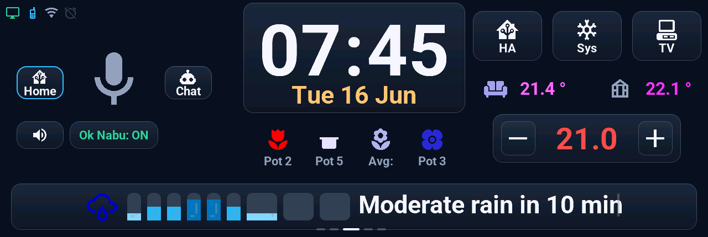
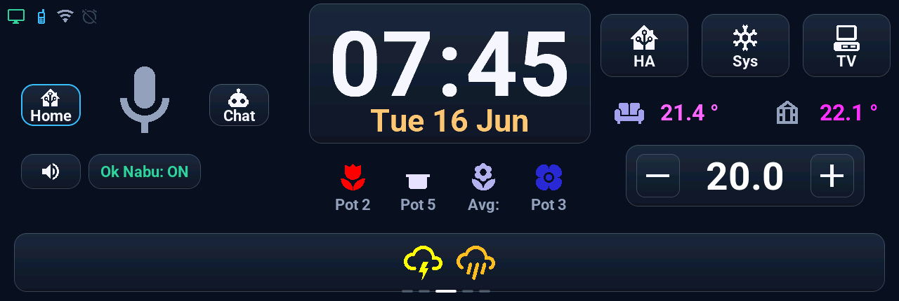
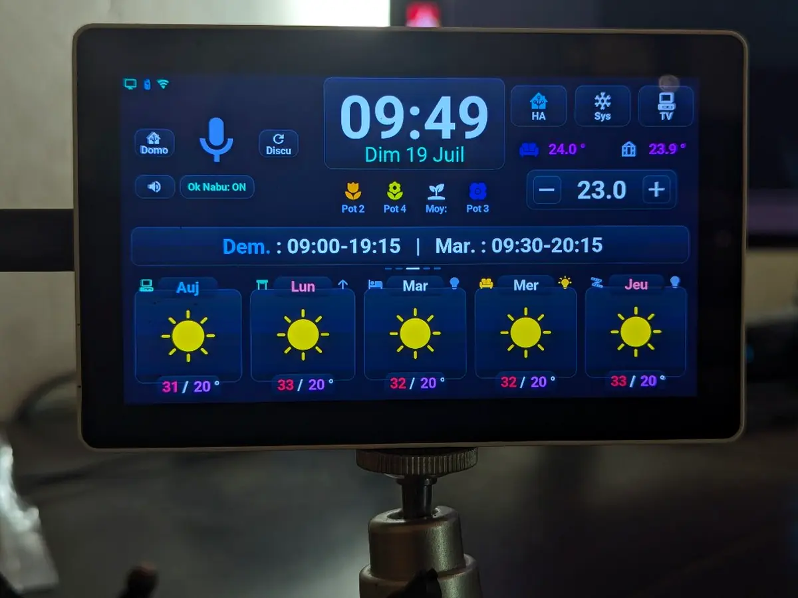
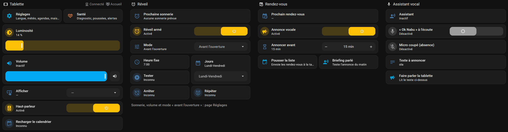
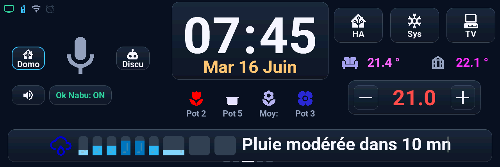
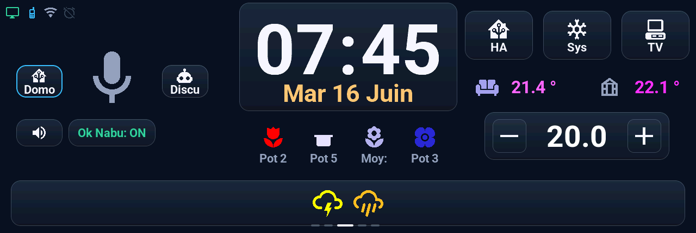

# M5Stack Tab5 — Home Assistant wall screen with ESPHome and LVGL

<!-- hors-site -->

> **This page is also the home page of the website**, with a menu, a search and every page in English or French: **[axellum.github.io/M5-Tab5-ESPHome-LVGL](https://axellum.github.io/M5-Tab5-ESPHome-LVGL/)**.
<!-- /hors-site -->

---

## English · [Français](#version-française)

---

**A Home Assistant wall screen that runs natively on the M5Stack Tab5 (ESP32-P4).** No browser, no polling: Home Assistant pushes what changed, and the screen redraws only that, in C++ with LVGL. Local "Okay Nabu" wake word, 15-day forecast, climate, lights, plants, solar energy, TV remote, alarm clock — and 8 offline games, in seven languages. Twenty-one themes, light or dark, chosen from Home Assistant. It is my everyday screen, shared in case it is useful to someone.

**[Install from the browser](https://axellum.github.io/M5-Tab5-ESPHome-LVGL/install/)** · **[Installation guide](docs/installation/README.md)** · **[User manual](docs/notice/README.md)** · **[Try it without Home Assistant](docs/demo_mode.md)** · **[Discussions](https://github.com/Axellum/M5-Tab5-ESPHome-LVGL/discussions)**

> *A personal project exploring what's possible when AI writes all the code. Built with Antigravity, DeepSeek, MiniMax, Z.ai, Claude, and Cursor — not a single line typed by hand. I am more the architect than the author.*

## Why this one

- **Push-only, zero polling.** Home Assistant sends only what changed; the tablet never asks for anything ([ADR-0001](docs/decisions/0001-push-only-zero-polling.md)).
- **Voice starts on the device.** "Okay Nabu" and a "Stop" word for the roller shutter are detected on the tablet; audio leaves it only after the wake word.
- **Seven languages, down to the details.** French, English, German, Dutch, Spanish, Italian and Turkish, switched from Home Assistant: menus, games, dates, the texts Home Assistant sends and the spoken alarm briefing. Translated by an AI; the author only checked the French ([translations](docs/translations.md)).
- **Twenty-one themes, light or dark.** Colours, shapes and the fonts of the clock change at once, without a restart, from Home Assistant or the tablet's console; « Auto » turns light at sunrise and dark at sunset ([themes](docs/installation/settings.md#theme-light-or-dark)).
- **Keeps working when Home Assistant doesn't.** Clock, alarm clock, games and the diagnostics console stay usable on their own.
- **Documented and tested like a product.** 37 [architecture decision records](docs/decisions/README.md), host tests for the C++ game and alarm engines, and a CI that compiles the firmware against both the minimum and the latest ESPHome.
- **Runs on the ST7123 and ST7121 revisions, and builds for the original ILI9881C**, while most published Tab5 examples only cover the original one.

## What it does

A single 1280×720 page: windows open with a tap, a long press or a swipe — each of them is in the [user manual](docs/notice/README.md).

- **Weather** — rain in the next hour, hourly and 15-day forecast, weather warnings ([below](#rain-in-the-next-hour-weather-warnings)).
- **Central card** — every 8 s: work hours, rain graph, warnings, a 3-day calendar recap and up to 4 banners pushed by Home Assistant, the alerts you subscribed to; a tap dismisses a banner, a long press shows the 20 latest alerts ([home screen](docs/notice/home.md), [alerts](docs/notice/alerts.md)).
- **Rooms** — the bottom row: up to 5 rooms of 5 devices (lights, switches, shutters, media players, scenes, sensors), with their names and icons taken from Home Assistant ([bottom row and rooms](docs/notice/tiles.md)).
- **Climate** — modes, a thermostat arc, presets and airflow; the controls are dimmed, not hidden, when the unit is off ([climate](docs/notice/climate.md)).
- **Lights** — the room's lights (up to 5): brightness arc with shortcuts, 3 whites and 12 colours ([lights](docs/notice/lights.md)).
- **Shutters** — open, close or a position; while it moves, "Stop" said aloud halts it at once ([shutters](docs/notice/shutters.md)).
- **Plants** — up to 5 BLE sensors, coloured by soil moisture; a long press shows fertility, light, temperature and battery ([plants](docs/notice/plants.md)).
- **TV remote** — a full-screen Samsung remote: power, pad, volume, channels, playback, mute, through Home Assistant ([TV remote](docs/notice/tv.md)).
- **Voice** — "Okay Nabu" detected on the tablet, or a tap on the microphone; two assistants chosen from the screen, home control or a conversation ([voice](docs/notice/voice.md)).
- **Calendar and alarm clock** — a monthly calendar computed on the tablet, with work hours, holidays and appointments; an alarm clock with a spoken briefing ([calendar](docs/notice/calendar.md), [alarm clock](docs/notice/alarm.md)).
- **Solar energy** (optional) — solar, home, grid and home battery right now, and the production per hour, day and month ([energy](docs/notice/energy.md)).
- **Temperature history** — a long press on a temperature: its curve over 24 hours, 7 or 30 days, with the weather forecast for the second one ([temperature](docs/notice/temperature.md)).
- **Diagnostics console** — memory, Wi-Fi, uptime, volume, theme; reload automations, restart Home Assistant or the tablet behind a confirmation ([system console](docs/notice/console.md)).
- **8 offline games** — experimental: chess, draughts, Go, breakout, pinball, Lode Runner, a marble roguelite and a quiz ([Arcade](docs/notice/arcade.md)).

## Rain in the next hour, weather warnings

What the screen was first made for: seeing at a glance whether rain is coming before leaving. Both panels join the rotation of the central card only when there is something to show. Renders of the firmware with demo data: moderate rain in 10 minutes, an orange warning.

- **9 bars, the whole next hour**: one every 5 minutes for half an hour, then one every 10 minutes. The taller and darker the bar, the heavier the rain. The sentence is written by the tablet, in its language, and counts the minutes down by itself.
- Source, chosen in Home Assistant: Météo-France in France; the Buienradar, DWD or Met.no radars; OpenWeatherMap; Open-Meteo everywhere, with no key, used by itself when there is no Météo-France; or none, and the panel goes away ([weather providers](docs/installation/weather.md)).

- **One icon per warning in force**, up to 4, each in the colour of its own level. The date under the clock takes the colour of the day's overall level.
- Source: Météo-France for your department; elsewhere MeteoAlarm, the DWD or CAP Alerts. Apart from Météo-France, the warnings were only tried with simulated data.

## Before you start

- A Tab5: the **ST7123** display chip is the one used every day; the ST7121 runs on another user's unit, the original ILI9881C is built but untested — see [hardware compatibility](#hardware-compatibility).
- Home Assistant 2026.8 or later. A ready-made, signed firmware installs from the browser; to build your own, ESPHome **≥ 2026.9.0**.
- The screen speaks French, English, German, Dutch, Spanish, Italian or Turkish, switched from Home Assistant — all written by an AI like the rest of the project; the author checked the French, the others are not reviewed yet. Only the quiz questions stay in French ([translations](docs/translations.md)).
- The layout started from the author's home. You pick your devices in Home Assistant with the mouse (a blueprint), and what you don't have disappears from the screen. The tiles at the bottom are rooms; the other zones have a single place each: the climate card, the TV, the phone, two temperatures, up to 5 plants ([adapt to your home](docs/installation/adapt-to-your-home.md)).
- The rain graph and the warnings are made for France first (Météo-France); elsewhere the rain comes from Open-Meteo by itself, and other services are picked in Home Assistant ([weather providers](docs/installation/weather.md)).

## Quick start

Without compiling, since 3.0: a Tab5, a USB-C cable that carries data, Chrome or Edge on a computer, and Home Assistant. The [installation guide](docs/installation/README.md) takes you through seven steps:

1. [Home Assistant files](docs/installation/home-assistant-files.md): unzip the archive attached to each release into the `config` folder of Home Assistant, add one line to `configuration.yaml`, restart. Or, from 3.7.0, let [HACS](docs/installation/home-assistant-files.md#with-hacs) install them and update them in one click.
2. [Install the firmware](docs/installation/flash.md) from the [install page](https://axellum.github.io/M5-Tab5-ESPHome-LVGL/install/): your display revision, the Stable channel, *Connect and install*.
3. [Wi-Fi](docs/installation/wifi.md): from the same window, over USB, or with a phone on the open "Tab5 Fallback AP" network.
4. [Add it to Home Assistant](docs/installation/add-to-home-assistant.md): the ESPHome device is discovered, *Configure*; Home Assistant gives it its key.
5. [Your sources](docs/installation/sources.md): weather and calendars, picked in the « Tab5 · » lists with the mouse.
6. [Your devices](docs/installation/devices.md): the automation made from the blueprint, with the mouse; changing a device needs no flash.
7. [A dashboard](docs/installation/dashboard.md) (optional): one line in the template tool of Home Assistant writes a dashboard for the tablet, with its settings and its health.

Updates then show up in Home Assistant; over the air, the tablet only accepts a firmware signed with the project key. Every setting — theme, light or dark, language, alarm clock, screen to show: [tablet settings](docs/installation/settings.md). To change the firmware yourself: [build your own](docs/installation/build.md).

Just want to see it running first? The [demo mode](docs/demo_mode.md) pushes demo data to a flashed tablet with a small script: no Home Assistant, nothing left to clean up.

## Hardware compatibility

| Display chip (sticker on the back) | Units made | Status |
|---|---|---|
| **ST7123** | 14 Oct 2025 → 28 Apr 2026 | ✅ Supported — the author's device, in daily use (default) |
| **ST7121** | from 28 Apr 2026 | ✅ Runs on another user's unit since October 2026: display, touch and wake word ([Discussion #278](https://github.com/Axellum/M5-Tab5-ESPHome-LVGL/discussions/278)); the author has none — add `tab5_ecran: st7121` to `Tab5/user_entities.yaml` |
| **ILI9881C** + GT911 touch | 9 May 2025 → 14 Oct 2025 | 🧪 Compiles, untested — add `tab5_ecran: ili9881c` to `Tab5/user_entities.yaml` |

"Compiles, untested": the CI builds this variant on every display change, and the install page offers it, but this firmware has not been run on that chip yet. The ST7121 is built the same way, and has run on a user's unit since October 2026. How to identify your unit, and the ST7121 reports: [hardware revisions](docs/hardware.md#hardware-revisions). Tried one? → [Discussions](https://github.com/Axellum/M5-Tab5-ESPHome-LVGL/discussions/categories/hardware-compatibility).

## See it in action

**[▶ Demo video on YouTube](https://www.youtube.com/watch?v=ygNhgtMffu4)** (voice, touch, TV remote, climate — provisional cut, July 2026), and an animated tour of the screens:

**Twenty-one themes**, each light or dark: colours, shapes (radius, borders, shadows) and the fonts of the clock, the date and the titles. Six of them, drawn by the firmware itself on a PC, with demo data:

**Solar energy** (optional): solar, home, grid and home battery right now, and the production of the last 30 days, from the sensors picked in the blueprint ([solar energy](docs/installation/adapt-to-your-home.md#solar-energy-optional)). Render with demo data; not tried with a real solar installation yet.

**The tablet in Home Assistant** — the dashboard written for your entities by [step 7](docs/installation/dashboard.md):

**On the tablet** — photos of the author's tablet (July 2026, French interface):

| Device buttons, one tap each | Plant sensors |
|:-:|:-:|
|  |  |

| Climate | Lights |
|:-:|:-:|
|  |  |

| TV remote | Diagnostics console |
|:-:|:-:|
|  |  |

| Monthly calendar | Voice assistant |
|:-:|:-:|
|  |  |

| Arcade: the game menu | Roi Noir: chess with an engine on the tablet |
|:-:|:-:|
|  |  |

| Coureur d'Or: Lode Runner style | Arcanoïde: a breakout played by tilting |
|:-:|:-:|
|  |  |

The games are experimental, first-pass code written by AI to see what LVGL and C++ can do on an ESP32-P4: they work, they are not polished ([the eight consoles](docs/arcade.md), in French).

## Documentation

Every page is in English and French: [install](docs/installation/README.md), [use](docs/notice/README.md), [set up](docs/installation/settings.md), [fix](docs/troubleshooting.md), [understand how it is built](docs/architecture.md) — the full list is on the [documentation page](docs/README.md).

In this repository: [`AGENTS.md`](AGENTS.md) for AI coding agents, [`CARTOGRAPHIE_TAB5.md`](CARTOGRAPHIE_TAB5.md) (every file and dependency), [`Tab5/README.md`](Tab5/README.md) (the ESPHome files and the Home Assistant services), [`HomeAssistant_Config/README.md`](HomeAssistant_Config/README.md) (the packages), [`CONTRIBUTING.md`](CONTRIBUTING.md) and the [`CHANGELOG.md`](CHANGELOG.md).

## Community

- **Questions, ideas, your own build** → [Discussions](https://github.com/Axellum/M5-Tab5-ESPHome-LVGL/discussions) (Q&A, Ideas, Show and tell, Hardware compatibility).
- **Something broken?** → [open an issue](https://github.com/Axellum/M5-Tab5-ESPHome-LVGL/issues/new/choose); the form asks for your display chip and your ESPHome version.
- **Security issue** → report it privately, see [`SECURITY.md`](SECURITY.md).
- **Contributing** → [`CONTRIBUTING.md`](CONTRIBUTING.md) and the [code of conduct](CODE_OF_CONDUCT.md).

**Thanks** to [@husyildiz](https://github.com/husyildiz), whose ideas, tests and reports in [discussion #278](https://github.com/Axellum/M5-Tab5-ESPHome-LVGL/discussions/278) brought the step-by-step install page, the Turkish screen, the weather outside France, the original battery, the Energy popup for solar panels and the weather picked in the blueprint.

English or French, both are welcome.

## A short personal note

Having heard a lot about AI for coding, I wanted to see for myself what it could do. My old Nextion screen (mostly weather, already on ESPHome and Météo-France) was starting to feel dated, so I replaced it: a lot more home automation, on a far more capable display, with AI writing the code from end to end. Why a screen, what it had to do, and how it grew: [the story](docs/story.md).

## Note on AI

This project is part of a personal exploration of what AI tools can produce when given full authorship of a technical project. The code, the architecture decisions, and most of this documentation were generated by AI (Antigravity/Gemini, DeepSeek, MiniMax, Z.ai, Claude, Cursor). My role was to set the goal, test, reject, and steer — more architect than line-by-line author. The goal was never to ship a polished product — it was to learn, to see where AI helps and where it gets stuck, and to share what came out of it.

If something in the code is weird, it might be an AI quirk. If something works surprisingly well, same answer.

→ More context: [`docs/related_projects.md`](docs/related_projects.md)

---

## Version Française

---

<!-- hors-site -->
> **Cette page est aussi l'accueil du site**, avec un menu, une recherche et chaque page en français ou en anglais : **[axellum.github.io/M5-Tab5-ESPHome-LVGL/fr/](https://axellum.github.io/M5-Tab5-ESPHome-LVGL/fr/)**.
<!-- /hors-site -->

**Un écran mural Home Assistant qui tourne nativement sur le M5Stack Tab5 (ESP32-P4).** Pas de navigateur, pas de polling : Home Assistant pousse ce qui a changé, et l'écran ne redessine que ça, en C++ avec LVGL. Mot d'activation « Okay Nabu » en local, prévisions à 15 jours, clim, lumières, plantes, énergie solaire, télécommande TV, réveil — et 8 jeux hors ligne, en sept langues. Vingt et un thèmes, clairs ou sombres, au choix depuis Home Assistant. C'est mon écran de tous les jours, partagé au cas où il serve à quelqu'un.

**[Installer depuis le navigateur](https://axellum.github.io/M5-Tab5-ESPHome-LVGL/install/)** · **[Guide d'installation](docs/installation/README.md#version-française)** · **[Notice d'utilisation](docs/notice/README.md#version-française)** · **[Essayer sans Home Assistant](docs/demo_mode.md#version-française)** · **[Discussions](https://github.com/Axellum/M5-Tab5-ESPHome-LVGL/discussions)**

> *Un projet personnel pour voir ce que donne l'IA quand elle écrit tout le code. Construit avec Antigravity, DeepSeek, MiniMax, Z.ai, Claude et Cursor — pas une ligne tapée à la main. J'en suis plus l'architecte que l'auteur.*

## Pourquoi celui-ci

- **Push uniquement, zéro polling.** Home Assistant n'envoie que ce qui a changé ; la tablette ne demande jamais rien ([ADR-0001](docs/decisions/0001-push-only-zero-polling.md)).
- **La voix démarre sur l'appareil.** « Okay Nabu » et un mot « Stop » pour le volet roulant sont détectés sur la tablette ; l'audio n'en sort qu'après le mot d'activation.
- **Sept langues, jusque dans les détails.** Français, anglais, allemand, néerlandais, espagnol, italien et turc, au choix depuis Home Assistant : menus, jeux, dates, textes envoyés par Home Assistant et briefing parlé du réveil. Traduites par une IA ; l'auteur n'a relu que le français ([traductions](docs/translations.md#version-française)).
- **Vingt et un thèmes, clairs ou sombres.** Couleurs, formes et polices de l'horloge changent aussitôt, sans redémarrer, depuis Home Assistant ou la console de la tablette ; « Auto » passe en clair au lever du soleil et en sombre à son coucher ([thèmes](docs/installation/settings.md#thème-clair-ou-sombre)).
- **Continue de marcher quand Home Assistant ne marche plus.** Horloge, réveil, jeux et console de diagnostic restent utilisables seuls.
- **Documenté et testé comme un produit.** 37 [décisions d'architecture](docs/decisions/README.md) (ADR), des tests hôte pour les moteurs C++ des jeux et du réveil, et une CI qui compile le firmware avec la version minimale et la dernière version d'ESPHome.
- **Tourne sur les révisions ST7123 et ST7121, et compile pour l'ILI9881C d'origine**, alors que la plupart des exemples Tab5 publiés ne couvrent que celle d'origine.

## Ce que ça fait

Une seule page de 1280×720 : les fenêtres s'ouvrent d'un appui, d'un appui long ou d'un glissement — chacune est dans la [notice d'utilisation](docs/notice/README.md#version-française).

- **Météo** — pluie dans l'heure, prévisions horaires et à 15 jours, vigilances ([plus bas](#pluie-dans-lheure-vigilances)).
- **Carte centrale** — toutes les 8 s : horaires, graphe de pluie, vigilances, récap du calendrier sur 3 jours et jusqu'à 4 bandeaux poussés par Home Assistant, les alertes auxquelles vous êtes abonné ; un appui masque un bandeau, un appui long montre les 20 dernières alertes ([écran d'accueil](docs/notice/home.md#version-française), [alertes](docs/notice/alerts.md#version-française)).
- **Pièces** — la rangée du bas : jusqu'à 5 pièces de 5 appareils (lumières, interrupteurs, volets, lecteurs multimédia, scènes, capteurs), avec leurs noms et icônes pris dans Home Assistant ([rangée du bas et pièces](docs/notice/tiles.md#version-française)).
- **Clim** — modes, arc de thermostat, préréglages et flux d'air ; les commandes sont grisées, pas masquées, quand la clim est éteinte ([clim](docs/notice/climate.md#version-française)).
- **Lumières** — les lumières de la pièce (5 au plus) : arc de luminosité avec raccourcis, 3 blancs et 12 couleurs ([lumières](docs/notice/lights.md#version-française)).
- **Volets** — ouvrir, fermer ou une position ; pendant qu'il bouge, « Stop » dit à voix haute l'arrête tout de suite ([volets](docs/notice/shutters.md#version-française)).
- **Plantes** — jusqu'à 5 capteurs BLE, colorés selon l'humidité du sol ; un appui long montre fertilité, lumière, température et batterie ([plantes](docs/notice/plants.md#version-française)).
- **Télécommande TV** — une télécommande Samsung plein écran : marche, croix, volume, chaînes, lecture, muet, par Home Assistant ([télécommande TV](docs/notice/tv.md#version-française)).
- **Voix** — « Okay Nabu » détecté sur la tablette, ou un appui sur le micro ; deux assistants au choix depuis l'écran, la domotique ou la discussion ([voix](docs/notice/voice.md#version-française)).
- **Calendrier et réveil** — un calendrier du mois calculé sur la tablette, avec horaires, fériés, vacances et rendez-vous ; un réveil avec un briefing parlé ([calendrier](docs/notice/calendar.md#version-française), [réveil](docs/notice/alarm.md#version-française)).
- **Énergie solaire** (facultatif) — solaire, maison, réseau et batterie de la maison en direct, et la production par heure, jour et mois ([énergie](docs/notice/energy.md#version-française)).
- **Historique des températures** — un appui long sur une température : sa courbe sur 24 heures, 7 ou 30 jours, avec la prévision de la météo pour la seconde ([température](docs/notice/temperature.md#version-française)).
- **Console de diagnostic** — mémoire, Wi-Fi, temps de marche, volume, thème ; recharger les automatisations, redémarrer Home Assistant ou la tablette, après confirmation ([console système](docs/notice/console.md#version-française)).
- **8 jeux hors ligne** — expérimentaux : échecs, dames, go, casse-briques, flipper, Lode Runner, un roguelite de bille et un quiz ([Arcade](docs/notice/arcade.md#version-française)).

## Pluie dans l'heure, vigilances

Ce pour quoi l'écran a d'abord été fait : voir d'un coup d'œil s'il va pleuvoir avant de partir. Les deux panneaux n'entrent dans la rotation de la carte centrale que s'il y a quelque chose à montrer. Rendus du firmware avec des données de démonstration : pluie modérée dans 10 minutes, vigilance orange.

- **9 barres, toute l'heure qui vient** : une toutes les 5 minutes pendant une demi-heure, puis une toutes les 10 minutes. Plus la barre est haute et foncée, plus la pluie est forte. La phrase est écrite par la tablette, dans sa langue, et décompte les minutes toute seule.
- Source, choisie dans Home Assistant : Météo-France en France ; les radars Buienradar, DWD ou Met.no ; OpenWeatherMap ; Open-Meteo partout, sans clé, pris tout seul quand il n'y a pas Météo-France ; ou aucune, et le panneau disparaît ([fournisseurs météo](docs/installation/weather.md#version-française)).

- **Une icône par vigilance en cours**, 4 au plus, chacune de la couleur de son niveau. La date sous l'horloge prend la couleur du niveau global de la journée.
- Source : Météo-France pour votre département ; ailleurs MeteoAlarm, le DWD ou CAP Alerts. Hors Météo-France, les vigilances n'ont été essayées qu'avec des données simulées.

## Avant de commencer

- Une Tab5 : la puce écran **ST7123** est celle utilisée tous les jours ; la ST7121 tourne chez un autre utilisateur, l'ILI9881C d'origine est compilée mais pas essayée — voir la [compatibilité matérielle](#compatibilité-matérielle).
- Home Assistant 2026.8 ou plus récent. Un firmware prêt à l'emploi et signé s'installe depuis le navigateur ; pour compiler le vôtre, ESPHome **≥ 2026.9.0**.
- L'écran parle français, anglais, allemand, néerlandais, espagnol, italien ou turc, au choix depuis Home Assistant — toutes écrites par une IA comme le reste du projet ; l'auteur a relu le français, les autres ne sont pas encore relues. Seules les questions du quiz restent en français ([traductions](docs/translations.md#version-française)).
- La disposition est partie de la maison de l'auteur. Vous choisissez vos appareils dans Home Assistant, à la souris (un blueprint), et ce que vous n'avez pas disparaît de l'écran. Les tuiles du bas sont des pièces ; les autres zones ont une seule place chacune : la carte clim, la TV, le téléphone, deux températures, jusqu'à 5 plantes ([adapter à sa maison](docs/installation/adapt-to-your-home.md#version-française)).
- Le graphe de pluie et les vigilances sont d'abord faits pour la France (Météo-France) ; ailleurs, la pluie vient toute seule d'Open-Meteo, et d'autres services se choisissent dans Home Assistant ([fournisseurs météo](docs/installation/weather.md#version-française)).

## Démarrage rapide

Sans compiler, depuis la 3.0 : une Tab5, un câble USB-C qui transmet les données, Chrome ou Edge sur un ordinateur, et Home Assistant. Le [guide d'installation](docs/installation/README.md#version-française) tient en sept étapes :

1. [Fichiers Home Assistant](docs/installation/home-assistant-files.md#version-française) : décompressez l'archive jointe à chaque release dans le dossier `config` de Home Assistant, ajoutez une ligne à `configuration.yaml`, redémarrez. Ou, depuis la 3.7.0, laissez [HACS](docs/installation/home-assistant-files.md#avec-hacs) les installer et les mettre à jour en un clic.
2. [Installer le firmware](docs/installation/flash.md#version-française) depuis la [page d'installation](https://axellum.github.io/M5-Tab5-ESPHome-LVGL/install/) : votre révision d'écran, le canal Stable, *Connecter et installer*.
3. [Wi-Fi](docs/installation/wifi.md#version-française) : depuis la même fenêtre, par l'USB, ou avec un téléphone sur le réseau ouvert « Tab5 Fallback AP ».
4. [L'ajouter à Home Assistant](docs/installation/add-to-home-assistant.md#version-française) : l'appareil ESPHome est découvert, *Configurer* ; Home Assistant lui donne sa clé.
5. [Vos sources](docs/installation/sources.md#version-française) : météo et agendas, choisis dans les listes « Tab5 · » à la souris.
6. [Vos appareils](docs/installation/devices.md#version-française) : l'automatisation créée depuis le blueprint, à la souris ; changer d'appareil ne demande pas de flash.
7. [Un tableau de bord](docs/installation/dashboard.md#version-française) (facultatif) : une ligne dans l'outil Modèle de Home Assistant écrit un tableau de bord pour la tablette, avec ses réglages et sa santé.

Les mises à jour arrivent ensuite dans Home Assistant ; par le réseau, la tablette n'accepte qu'un firmware signé par la clé du projet. Chaque réglage — thème, clair ou sombre, langue, réveil, écran à afficher : [réglages de la tablette](docs/installation/settings.md#version-française). Pour modifier le firmware vous-même : [compiler le vôtre](docs/installation/build.md#version-française).

Envie de le voir tourner d'abord ? Le [mode démo](docs/demo_mode.md#version-française) pousse des données de démonstration vers une tablette flashée avec un petit script : sans Home Assistant, rien à nettoyer ensuite.

## Compatibilité matérielle

| Puce écran (autocollant au dos) | Appareils fabriqués | Statut |
|---|---|---|
| **ST7123** | du 14/10/2025 au 28/04/2026 | ✅ Prise en charge — la tablette de l'auteur, utilisée tous les jours (défaut) |
| **ST7121** | depuis le 28/04/2026 | ✅ Tourne chez un autre utilisateur depuis octobre 2026 : écran, tactile et mot d'activation ([discussion #278](https://github.com/Axellum/M5-Tab5-ESPHome-LVGL/discussions/278)) ; l'auteur n'en a pas — ajouter `tab5_ecran: st7121` dans `Tab5/user_entities.yaml` |
| **ILI9881C** + tactile GT911 | du 09/05/2025 au 14/10/2025 | 🧪 Compile, non testée — ajouter `tab5_ecran: ili9881c` dans `Tab5/user_entities.yaml` |

« Compile, non testée » : la CI compile cette variante à chaque changement de l'écran, et la page d'installation la propose, mais ce firmware n'a encore jamais tourné sur cette puce. La ST7121 est compilée de la même façon, et tourne chez un utilisateur depuis octobre 2026. Comment identifier votre appareil, et les retours sur la ST7121 : [révisions matérielles](docs/hardware.md#révisions-matérielles). Vous en avez essayé une ? → [Discussions](https://github.com/Axellum/M5-Tab5-ESPHome-LVGL/discussions/categories/hardware-compatibility).

## En images

**[▶ Vidéo de démo sur YouTube](https://www.youtube.com/watch?v=ygNhgtMffu4)** (voix, tactile, télécommande TV, clim — version provisoire, juillet 2026), et un tour animé des écrans :

**Vingt et un thèmes**, chacun clair ou sombre : couleurs, formes (rayons, bordures, ombres) et polices de l'heure, de la date et des titres. Six d'entre eux, dessinés par le firmware lui-même sur un PC, avec des données de démonstration :

**Énergie solaire** (facultatif) : solaire, maison, réseau et batterie de la maison en direct, et la production des 30 derniers jours, d'après les capteurs choisis dans le blueprint ([énergie solaire](docs/installation/adapt-to-your-home.md#énergie-solaire-facultatif)). Rendu avec des données de démonstration ; pas encore essayé avec une vraie installation solaire.

**La tablette dans Home Assistant** — le tableau de bord écrit pour vos entités par l'[étape 7](docs/installation/dashboard.md#version-française) :

**Sur la tablette** — photos de la tablette de l'auteur (juillet 2026) :

| Les boutons des appareils, un appui chacun | Capteurs de plantes |
|:-:|:-:|
|  |  |

| Clim | Lumières |
|:-:|:-:|
|  |  |

| Télécommande TV | Console de diagnostic |
|:-:|:-:|
|  |  |

| Calendrier du mois | Assistant vocal |
|:-:|:-:|
|  |  |

| Arcade : le menu des jeux | Roi Noir : des échecs avec un moteur sur la tablette |
|:-:|:-:|
|  |  |

| Coureur d'Or : façon Lode Runner | Arcanoïde : un casse-briques joué en inclinant la tablette |
|:-:|:-:|
|  |  |

Les jeux sont expérimentaux, un premier jet écrit par l'IA pour voir ce que LVGL et le C++ peuvent faire sur un ESP32-P4 : ils marchent, sans être finis ([les huit consoles](docs/arcade.md)).

## Documentation

Chaque page est en français et en anglais : [installer](docs/installation/README.md#version-française), [se servir de la tablette](docs/notice/README.md#version-française), [la régler](docs/installation/settings.md#version-française), [réparer](docs/troubleshooting.md#version-française), [comprendre comment elle est faite](docs/architecture.md#version-française) — la liste complète est sur la [page de la documentation](docs/README.md#version-française).

Dans ce dépôt : [`AGENTS.md`](AGENTS.md) pour les agents de code IA (en anglais), [`CARTOGRAPHIE_TAB5.md`](CARTOGRAPHIE_TAB5.md) (chaque fichier et ses dépendances), [`Tab5/README.md`](Tab5/README.md) (les fichiers ESPHome et les services Home Assistant), [`HomeAssistant_Config/README.md`](HomeAssistant_Config/README.md) (les packages), [`CONTRIBUTING.md`](CONTRIBUTING.md#version-française) et le [`CHANGELOG.md`](CHANGELOG.md).

## Communauté

- **Questions, idées, votre installation** → [Discussions](https://github.com/Axellum/M5-Tab5-ESPHome-LVGL/discussions) (Q&A, Ideas, Show and tell, Hardware compatibility).
- **Quelque chose ne marche pas ?** → [ouvrez une issue](https://github.com/Axellum/M5-Tab5-ESPHome-LVGL/issues/new/choose) ; le formulaire demande votre puce écran et votre version d'ESPHome.
- **Faille de sécurité** → à signaler en privé, voir [`SECURITY.md`](SECURITY.md#version-française).
- **Contribuer** → [`CONTRIBUTING.md`](CONTRIBUTING.md#version-française) et le [code de conduite](CODE_OF_CONDUCT.md#version-française).

**Merci** à [@husyildiz](https://github.com/husyildiz), dont les idées, les essais et les retours dans la [discussion #278](https://github.com/Axellum/M5-Tab5-ESPHome-LVGL/discussions/278) ont amené la page d'installation pas à pas, l'écran en turc, la météo hors de France, la batterie d'origine, le popup Énergie pour les panneaux solaires et la météo choisie dans le blueprint.

Anglais ou français, les deux sont bienvenus.

## Note personnelle

Ayant beaucoup entendu parler de l'IA pour le codage, j'ai voulu voir par moi-même ce qu'elle donnait. Mon vieil écran Nextion (plutôt météo, déjà avec ESPHome et Météo-France) commençait à dater : je l'ai renouvelé, avec bien plus de domotique, sur un écran bien plus puissant, et avec l'IA qui écrit le code de bout en bout. Pourquoi un écran, ce qu'il devait faire, et comment il a grandi : [l'histoire](docs/story.md#version-française).

## Note sur l'IA

Ce projet fait partie d'une exploration personnelle de ce que les outils IA peuvent produire quand on leur laisse la pleine paternité d'un projet technique. Le code, les décisions d'architecture et la plupart de cette documentation ont été générés par des IA (Antigravity/Gemini, DeepSeek, MiniMax, Z.ai, Claude, Cursor). Mon rôle : définir le but, tester, refuser, orienter — plus architecte qu’auteur ligne à ligne. Le but n’a jamais été un produit fini — c’était d’apprendre, de voir où l’IA aide et où elle coince, et de partager ce qui en est sorti.

Si quelque chose dans le code est bizarre, c'est peut-être un quirk d'IA. Si quelque chose marche étonnamment bien, même réponse.

→ Plus de contexte : [`docs/related_projects.md`](docs/related_projects.md)
