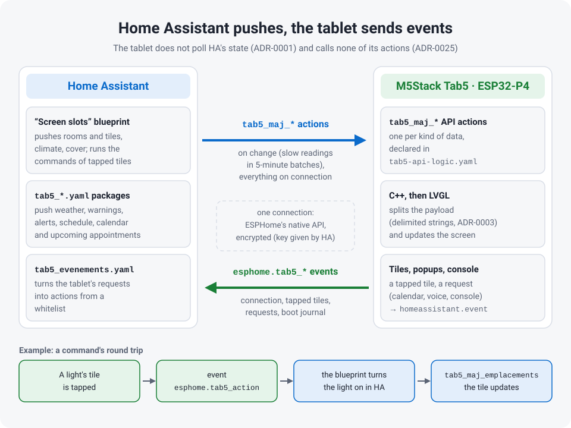
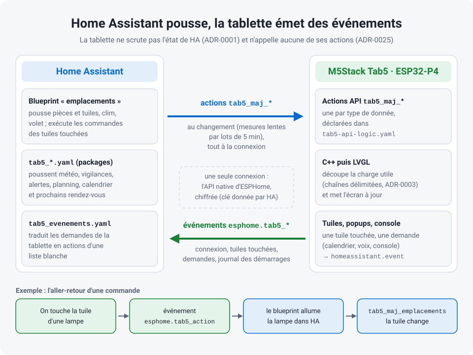

# Architecture & Code Structure

## English · [Français](#version-française)

---

## Overview

The ESPHome configuration is split into YAML packages imported by a single entry-point file (listed in section 1). This avoids a monolithic file that becomes impossible to navigate once you're past 1000 lines. Each package has a clearly defined responsibility and can be edited, tested, or replaced in isolation.

### Data flow: HA pushes, the tablet sends events

The Tab5 never polls Home Assistant's state ([ADR-0001](decisions/0001-push-only-zero-polling.md)). The "screen slots" blueprint and the `tab5_*` packages detect changes and call the firmware's ESPHome actions (`tab5_maj_*`, declared in `Tab5/tab5-api-logic.yaml`); the firmware parses the payload and updates LVGL in one pass. In the other direction the tablet calls no Home Assistant action: a tapped tile, a request (calendar month, announcement, console button) or its (re)connection becomes an `esphome.tab5_*` event, which the blueprint or `packages/tab5_evenements.yaml` turns into an action from a fixed whitelist ([ADR-0025](decisions/0025-events-only.md)).



---

## Key design decisions

- **Push-only, zero polling.** The device never requests state from Home Assistant. Automations on the HA side detect changes and push data to the screen via native ESPHome service calls. In the other direction the tablet sends events, never Home Assistant actions ([ADR-0025](decisions/0025-events-only.md)). CPU stays near zero when nothing changes.
- **Modular YAML.** The ESPHome configuration is split across twenty-five files by concern (tokens, hardware, screen revision, publication channel, diagnostics sensors, home-automation sensors, API logic, styles, globals, scripts, UI, arcade, calendar, voice assistant, IMU, HA controls, alarm clock, rooms and tiles, row under the clock, energy popup, zones, settings popup, temperature popup, energy saving, themes), each independently readable. Most stay under 500 lines; only the largest (`tab5-alarm.yaml`, `tab5-styles.yaml`, `tab5-lvgl.yaml`, `tab5-api-logic.yaml`, `tab5-sensors-diagnostics.yaml`, `tab5-themes.yaml`) go beyond, and the UI is further split into 60 reusable `ui_components/*.yaml`.
- **Native LVGL, no web stack.** LVGL refreshes up to 60 times a second from a framebuffer in the ESP32-P4's PSRAM and redraws only what changed. Measured on the tablet (firmware 3.2.0, 2026-09-28): a changed value or the clock's minute redraws in under 10 ms, the rotating panel in the middle in 15-21 ms per frame, the whole screen in 133 ms, and a popup opens in 126-197 ms. Vector fonts (Material Design Icons) replace image files entirely.
- **Data packing.** Complex payloads (15-day forecast, hourly forecast, weather alerts) are serialized as delimited strings on the HA side and parsed in C++ on the device — one network call, zero subsequent requests.
- **Offline resilience.** All C++ lambdas check `api.connected()` and `has_state()` before touching the UI. If HA restarts, the last known state stays on screen — and the device stays usable on its own (clock, arcade, diagnostics console). It only reboots itself after a full hour without any API client (`api: reboot_timeout: 60min`), a deliberate anti-"zombie" safety net rather than a reaction to a short HA outage.

---

## 1. Entry point: `tab5-ha-hmi.yaml`

The root file does three things:

1. **Loads entity substitutions** — `substitutions: !include Tab5/user_entities.yaml` (gitignored local file). Copy `Tab5/user_entities.example.yaml` to `user_entities.yaml` and edit your HA entity IDs. Since 3.0 there is no secret to compile in: Wi-Fi comes from Improv or the fallback AP, the API key from Home Assistant, and builds are signed with `tab5_signature.pem` ([ADR-0020](decisions/0020-no-secret-firmware-signed-ota.md)).

2. **Defines the boot sequence** — the `on_boot` block handles the startup order carefully: backlight on → media player volume set → amplifier enable (in that order, to avoid the ES8388 pop) → wait for Home Assistant itself (`api.connected` with `state_subscription_only`; no extra wait since 2026-10-01, Home Assistant subscribes to states and actions in one packet) → fire a `tab5_connected` event on the HA event bus → start wake-word detection if enabled.

3. **Imports all packages** via `!include`.

```yaml
packages:
  tab5_ui_tokens:  !include Tab5/tab5-ui-tokens.yaml
  tab5_hardware:   !include Tab5/tab5-hardware.yaml
  tab5_ecran:      !include Tab5/ecran-${ tab5_ecran | default('st7123') | lower }.yaml  # screen revision
  tab5_publication: !include Tab5/publication-${ tab5_publication | default('locale') }.yaml  # release channel (ADR-0022)
  tab5_sensors_diagnostics: !include Tab5/tab5-sensors-diagnostics.yaml
  tab5_sensors_domotique: !include Tab5/tab5-sensors-domotique.yaml
  tab5_api_logic:  !include Tab5/tab5-api-logic.yaml
  tab5_styles:     !include Tab5/tab5-styles.yaml
  tab5_globals:    !include Tab5/tab5-globals.yaml
  tab5_scripts:    !include Tab5/tab5-scripts.yaml
  tab5_lvgl:       !include Tab5/tab5-lvgl.yaml
  tab5_arcade:     !include Tab5/tab5-arcade.yaml         # one package per feature (lot 8c),
  tab5_calendar:   !include Tab5/tab5-calendar.yaml       # after tab5_lvgl: their scripts
  tab5_assist:     !include Tab5/tab5-assist.yaml         # reference LVGL widget ids
  tab5_imu:        !include Tab5/tab5-imu.yaml
  tab5_ha_controls: !include Tab5/tab5-ha-controls.yaml   # after tab5_lvgl: references LVGL widget ids
  tab5_alarm:      !include Tab5/tab5-alarm.yaml          # after tab5_lvgl too
  tab5_tuiles:     !include Tab5/tab5-tuiles.yaml         # rooms and tiles (ADR-0023), after tab5_lvgl
  tab5_rangee:     !include Tab5/tab5-rangee.yaml         # row under the clock (ADR-0031), after tab5_lvgl
  tab5_energie:    !include Tab5/tab5-energie.yaml        # Energy popup (ADR-0028), after tab5_lvgl
  tab5_historique: !include Tab5/tab5-historique.yaml     # Temperature popup (ADR-0032), after tab5_lvgl
  tab5_zones:      !include Tab5/tab5-zones.yaml          # optional zones (ADR-0018), after tab5_lvgl
  tab5_reglages:   !include Tab5/tab5-reglages.yaml       # Settings popup, after tab5_lvgl
  tab5_economie:   !include Tab5/tab5-economie.yaml       # energy saving: backlight cap, animations, LVGL rate
  tab5_themes:     !include Tab5/tab5-themes.yaml         # themes (ADR-0029), LAST: repaints the packages above
```

---

## 2. Package roles

### `tab5-ui-tokens.yaml`
Shared dimensional tokens, loaded first so every other package can reference them: modal card size (`modal_card_w`/`modal_card_h`), the 52 px title bar offset (`modal_body_y`), bottom margin (`modal_bottom_y`), calendar grid origin (`cal_grid_y`). Changing a popup's geometry means changing a token here, not 8 hardcoded numbers across `ui_components/`.

---

### `tab5-hardware.yaml`
Low-level hardware configuration:
- Display and touch settings shared by the three Tab5 revisions (MIPI-DSI, pins, calibration); the display model and the touch platform come from `Tab5/ecran-<revision>.yaml` (default: `M5STACK-TAB5-ST7123` and the official `st7123` I2C platform, since ESPHome 2026.7.0; the old `external_components` shim is gone) — see [`docs/hardware.md`](hardware.md#hardware-revisions)
- I2C bus, PI4IOE5V6408 GPIO expanders (display/touch reset lines)
- ES8388 DAC (`audio_dac:` platform) and ES7210 microphone ADC (`audio_adc:`)
- `esp32_hosted` — ESP32-C6 Wi-Fi co-processor over SDIO
- Backlight PWM (LEDC), I2S bus for microphone and speaker, media player, `ota:` — the voice pipeline (`micro_wake_word`/`voice_assistant`) moved to `tab5-assist.yaml` on 2026-09-25

→ Details: [`docs/hardware.md`](hardware.md)

---

### `ecran-*.yaml`
Screen and touch of one Tab5 revision, picked at compile time by `tab5_ecran:` in `Tab5/user_entities.yaml`: `st7123` (the default, the author's tablet), `st7121` or `ili9881c` (compiled by CI, never tested on a tablet). Each file only holds what changes from one revision to the next — the `mipi_dsi` model and the touch platform (`st7123`, or `gt911` on the original ILI9881C) — and extends the `tab5_display` and `touch` entries of `tab5-hardware.yaml` with `!extend`. See [`docs/hardware.md`](hardware.md#hardware-revisions).

---

### `publication-*.yaml`
Release channel ([ADR-0022](decisions/0022-published-firmware-pages-channels.md)), picked by `tab5_publication` (default `locale`; the release CI, `.github/workflows/publication.yml`, sets it to `stable` or `beta` as a substitution). `publication-locale.yaml` is empty: a firmware compiled on your own PC gets no update entity, because the published binaries are signed with the project key, which a tablet flashed with another key refuses. `publication-stable.yaml` and `publication-beta.yaml` include `publication-commune.yaml` with the channel as a variable: an `ota: http_request` platform and a « Firmware » `update:` entity that reads the manifest of the flashing page (`<channel>/<screen revision>/manifest.json`). A beta moves on to the stable release that follows it.

---

### `tab5-sensors-diagnostics.yaml`
System and network entities:
- `wifi:` block, antenna select, GPIO power switches (Wi-Fi/USB/external 5V)
- Internal ESP32-P4 temperature
- Uptime, Wi-Fi signal strength, IP/SSID, HA API status
- Free RAM / loop time (`debug`), SNTP clock, console refresh intervals

### `tab5-sensors-domotique.yaml`
Home-automation entities pushed by Home Assistant:
- Plant moisture sensors (up to 5 BLE plant monitors)
- Room & greenhouse temperature/humidity sensors
- Light/PC state mirrors, phone battery
- Audio: speaker amp switch, headphone jack, wake-word toggle
- Plant details (EC / light / temperature / battery): `pot_sensors.yaml`, one parameterized package included five times (nested `packages:` + `vars: {n}`)

These files only declare entities. No UI logic lives here.

---

### `tab5-api-logic.yaml`
The most important package. Two things live here:

**ESPHome API service handlers** — these are the endpoints Home Assistant calls to push data to the screen. Each handler receives a payload, validates it, then calls a C++ function of the C++ layer (`tab5_services.cpp`, declared in `tab5_custom.h`) to parse and apply it.

```yaml
api:
  services:
    - service: tab5_maj_previsions_jours_bulk
      description: "Daily forecast: all 15 days in a single call."
      variables:
        payload:
          type: string
          description: "Fifteen days as idx|label|condition|tmin|tmax|… joined by ;"
          example: "0|Auj 17|sunny|12.1|24.3|0|0|0|;"
      then:
        - lambda: |-
            parse_and_update_jours_bulk(payload);
```

Every handler carries that `description`/`example` metadata (ESPHome 2026.9.0 and later). Home Assistant renders it in *Developer tools → Actions*, which is where the format of a hand-serialised payload becomes readable without opening this file. A handler missing it fails `pytest` (rule 5 of `tools/check_tab5_code_rules.py`).

**C++ lambdas** — for logic that doesn't fit cleanly in YAML (state machine transitions, string parsing, conditional LVGL updates).

The rule enforced throughout: before any `lv_*` call, check `boot_complete` and `api.connected()`. This prevents NaN values from crashing the UI during HA restarts.

---

### `tab5-styles.yaml`
Global LVGL style definitions, declared once and referenced by ID everywhere in `tab5-lvgl.yaml`.

The rationale: LVGL allocates a style object per widget if you define styles inline. With 80+ widgets on screen, that's 80+ style allocations in PSRAM. Declaring styles globally and attaching them by reference uses a handful of allocations for the whole screen.

Styles defined here cover: base panel, card backgrounds, text variants (title, value, dim, small), button states (normal, pressed, active), progress bar fill, and icon color variants.

---

### `tab5-globals.yaml`
Shared global variables accessible from any package:
- `boot_complete` (bool) — gate for all UI updates
- `conversation_mode` (bool) — toggles between Home Assistant pipeline and chat pipeline
- Current state snapshots (last known temperature values, climate mode, etc.)

Variables here are typed and initialized. Uninitialized globals on ESP32 are undefined behavior.

---

### `tab5-lvgl.yaml`
The UI layout. Declares the pages, panels, labels, buttons, arcs, and icons, plus swipe gesture handling. It `!include`s 31 `ui_components/*.yaml` files directly (climate card/popup, light popup, shutter popup, device popup, TV remote popup, system console, settings popup, temperature popup, assistant/calendar/plant popups, alarm popup and ring overlay, forecast cards, the row under the clock (moisture gauges and sensor lines), switches card, the HA alert banner of the central card — one file included four times with `vars` —, the arcade selector and the 8 games); those in turn include the parametrized sub-templates (`pot_detail_card.yaml`, `modal_header.yaml`…), for 60 component files in total.

**The dashboard is a single LVGL page, not a multi-page tab-bar layout** ([ADR-0002](decisions/0002-single-page-swipe-navigation.md)) — every home-automation feature lives on one 1280×720 `page_main`, reachable by tap, long-press or swipe. The only other pages are the 9 gaming ones (`page_arcade` + one per console), all declared `skip: true` so swipe navigation can never land on them; they are not part of the dashboard flow.

`page_main` (1280×720):
```
page_main (1280×720, the whole dashboard)
├── home content always visible   (clock, indoor temp/humidity, quick actions,
│                                   climate card, moisture card)
├── central rotating card          (planning / rain / alerts / info — auto-cycles
│                                   every 8s, tab5-globals.yaml `interval:`; paused
│                                   while off the default forecast window)
├── bottom card region — one of two, toggled by `btn_control_ha` (house icon, top right):
│   ├── HA mode cards   (`layer_switches` — the 5 devices of the current room, ADR-0023)
│   └── forecast card   (`layer_forecast_daily` / `layer_forecast_hourly` — weather, 5 tabs)
├── climate_popup   (near-fullscreen modal, opened by tapping the climate card)
├── light_popup     (near-fullscreen modal, opened by tapping a light switch card)
├── tv_remote_popup (Samsung remote, opened by a long press on the gamepad button
│                    or on the PC card — `remote.*` services via HA)
├── assistant_popup (STT transcription + Markdown LLM reply, long-press on the mic)
├── calendar_popup  (monthly 7×6 grid, long-press on the clock)
├── pots_popup      (5 plant-detail cards, long-press on the moisture slots)
├── console_sys     (system console: diagnostics + volume + HA management with
│                    confirm overlays, long press on `btn_control_console`, top right)
└── reglages_popup  (settings: screen and appearance, tap on `btn_control_console`)

separate pages, outside the dashboard flow (all `skip: true` — see §6):
├── page_arcade   (4×2 selector, opened by the gamepad button or the greenhouse temperature)
└── page_marble / page_arkanoid / page_pinball / page_lode / page_go /
    page_trivia / page_chess / page_draughts      (one per console)
```

Navigation is by touch (opening/closing the climate/light popups and the console button, and toggling the bottom card region between the weather mode and the HA mode) and by swipe gesture, handled in C++ (`handle_swipe_gesture()` in `tab5_central.cpp`):
- swipe left/right on the lower band of the screen (`y ≥ 333`) → cycle through the 5 forecast pages (2 hourly windows + 3 daily windows, with the deliberate wrap documented in `forecast_page_suivante()`) in weather mode; in HA mode, the same gesture goes to the next / previous **room** that has a device, in the same page order, and never shows the weather layers again under the cards
- since the 14/07/2026 rework there is **no** up/down swipe anymore — the console opens by a long press on the gear button only

Since 3.2 ([ADR-0023](decisions/0023-rooms-generic-tiles.md)) each forecast page is also a room of up to five devices described by Home Assistant (`tab5_tuiles.cpp`). The HA mode flag is `g_central_ctx.ha_mode` (the former `show_switches` global is gone); `tuiles_mode_ha()` crossfades the weather layer and `layer_switches` (hidden via `LV_OBJ_FLAG_HIDDEN`, never removed), paints the five cards of the current room, puts the room title in the central card and highlights the « HA » button (`tab5-lvgl.yaml`, `btn_control_ha`). See the `[AI-CONTEXT]` headers of `Tab5/tab5_tuiles.cpp` and `ui_components/switches_card.yaml` for the source-level notes.

All style references point to IDs defined in `tab5-styles.yaml`. No inline style properties.

→ Full file-by-file inventory and dependency graph: [`../CARTOGRAPHIE_TAB5.md`](../CARTOGRAPHIE_TAB5.md)

---

### `tab5-scripts.yaml`
*Since 2026-09-25 (audit lot 8c), the game, calendar and voice/assistant scripts live in their own packages: `tab5-arcade.yaml`, `tab5-calendar.yaml`, `tab5-assist.yaml`.* Short ESPHome script blocks for reusable multi-step actions called from lambdas or HA. Keeps `tab5-api-logic.yaml` from becoming cluttered with repeated patterns. Grouped by family: modal registry init, debounces (volume 150 ms, brightness 200 ms, climate 250 ms — one HA call per gesture instead of one per tick), volume (single entry point `tab5_volume_apply`), climate widgets (`tab5_clim_ui`; the recolouring is in C++, `clim_recolorer()`), central rotator + dismiss, shutter, light popup, TV remote keys, and a 1 s `interval:` that returns to the home screen.

---

### `tab5-arcade.yaml`
Game scripts: `tab5_games_close_all` (closes every open game through `GameRegistry::close_all()`; the console list lives in `GameRegistry::kGames`, [ADR-0013](decisions/0013-single-registry-consoles-modals.md), never here), one `tab5_<game>_open` per console (it hands the game its LVGL pointers and fonts, which only a lambda can reach through `id()`), and `tab5_arcade_open` for the selector page. Loaded after `tab5-lvgl.yaml`: its scripts reference game pages and widgets. See §6 and [`docs/arcade.md`](arcade.md).

---

### `tab5-calendar.yaml`
Scripts of the calendar popup (`calendar_popup.yaml`): opening (long-press on the clock), month render, previous / next / today, boot prefetch and the tap on a day. The grid is computed on the tablet (`tab5_calendar.cpp`); Home Assistant only fills it on request: the tablet fires `esphome.tab5_calendrier_mois` (or `_jour` for a day), `packages/tab5_evenements.yaml` runs the HA script, which answers with the `tab5_maj_calendrier_mois` / `_jour` actions. A month request always goes through `tab5_cal_request`. Loaded after `tab5-lvgl.yaml`.

---

### `tab5-assist.yaml`
The whole voice assistant: `micro_wake_word` (`okay_nabu`, plus `Stop`), `voice_assistant` and its callbacks (visual states through `assist_set_pipeline_state()`), the reply image (`http_request` + `online_image`), the voice scripts (arming the « Stop » word, interruption, `tab5_wake_word_dispatch` — the decision itself is `WakeWord::decide()` in `tab5_assist.cpp` —, reply in the central card) and those of the Assistant popup. The audio hardware (shared I2S bus, ES7210, ES8388, media player) stays in `tab5-hardware.yaml`. Loaded after `tab5-lvgl.yaml`. See [`docs/voice_assistant.md`](voice_assistant.md).

---

### `tab5-imu.yaml`
BMI270 accelerometer: the three axes are `internal: true` (at 10–30 Hz they would flood the HA recorder for nothing). Two consumers — tap-to-wake on the dashboard, and tilt input for the games. An `interval:` re-tunes the polling rate at runtime via `set_update_interval()`: 100 ms (10 Hz) at rest, 33 ms (30 Hz) while a tilt-controlled console is open. See §6.

---

### `tab5-ha-controls.yaml`
Entities exposed to Home Assistant to observe and drive the screen from a dashboard without standing in front of it: a `number` for the volume (single entry point `script.tab5_volume_apply`, shared with both on-screen sliders), a `text_sensor` naming the current screen (game page, visible popup, or central-panel index), a `select` "go to screen" that replays the exact same open paths as the on-screen buttons (refused while the alarm rings), a `button` to reload the calendar, and a 5 s catch-up of volume changes made on the `media_player` side. Loaded **after** `tab5-lvgl.yaml`: its lambdas reference LVGL widget ids.

---

### `tab5-alarm.yaml`
Alarm clock + appointment reminders: `rtttl:` melody on `tab5_speaker` (outside the media player), ~20 config entities exposed to HA (switches, `datetime type: time`, numbers, selects, text), the ring state machine (one melody pass, then a 3 s listening window for the on-device "Stop" wake word; snooze, max duration, crescendo) and a 1 s `interval:` that only compares two integers — all the date maths live in the pure engine `alarm_clock.cpp` (no `id()`, no network). The alarm rings without Home Assistant; HA only adds the spoken briefing, the appointment list and an optional ringtone URL. Single entry point `script.tab5_alarm_refresh` (entities → `g_alarm_cfg`, never the reverse). The mic/speaker relay it has to perform is [ADR-0010](decisions/0010-shared-i2s-bus-mic-speaker.md).

---

### `tab5-tuiles.yaml`
Rooms and tiles ([ADR-0023](decisions/0023-rooms-generic-tiles.md)): the `tab5_tuiles_ui` script hands `g_tuiles_ui` the widgets that `tab5_tuiles.cpp` draws (weather-tile shoulders and buttons of every page, HA-mode cards, light-popup selector, layers, page dots, central-card title, « HA » button) and its two commands (the `esphome.tab5_action` event, the shutter tap). The model, the NVS and the drawing live in `tab5_tuiles.cpp`; definitions arrive through the `tab5_maj_tuiles` action. No `lv_*` here. Run first by `tab5_zones_apply`, before the first frame; loaded after `tab5-lvgl.yaml`.

### `tab5-rangee.yaml`
Row under the clock ([ADR-0031](decisions/0031-row-under-the-clock.md)): the `tab5_rangee_ui` script hands `g_rangee_ui` the widgets that `tab5_rangee.cpp` draws (`ui_components/rangee.yaml`: the plants line, two panels of four elements for the sensor lines, the position dots). Up to three sensor lines of four elements, plus the plants line, rotate with the central card: `tab5_central_rotator_auto` calls `rangee_tour()` 0.2 s before the central card moves, and a line stays N turns of 8 s (« Time per line » in the blueprint). Definitions (`hLI`, `hp`, `hd` keys) arrive through `tab5_maj_tuiles`, states (`hLI`) through `tab5_maj_emplacements`; the model and its NVS live in `tab5_tuiles.cpp`. Display only: a tap shows the next line, a long press on the plants line opens My Plants. No `lv_*` here. Run by `tab5_zones_apply`, before the first frame; loaded after `tab5-lvgl.yaml`.

### `tab5-energie.yaml`
Energy popup ([ADR-0028](decisions/0028-solar-energy-popup.md)): the `tab5_energie_ouvrir` script hands `g_energie_ui` the widgets of `ui_components/energie_popup.yaml` on the first opening, then calls `energie_ouvrir()` (`tab5_energie.cpp`); `tab5_energie_demande` sends the `esphome.tab5_energie` event (`vue` = `heures`, `jours` or `mois`) when the popup opens and on each view button. Home Assistant answers with the `tab5_maj_energie` (live values) and `tab5_maj_energie_historique` (bars) actions. Opened by a `cap` tile with the `e` option or by « Aller à l'écran → Énergie ». No `lv_*` here; loaded after `tab5-lvgl.yaml`.

---

### `tab5-historique.yaml`
Temperature popup ([ADR-0032](decisions/0032-temperature-history-popup.md)): the `tab5_historique_ouvrir` script (`cle` = `salon` or `serre`) hands `g_historique_ui` the widgets of `ui_components/historique_popup.yaml` on the first opening, then calls `historique_ouvrir()` (`tab5_historique.cpp`); `tab5_historique_demande` sends the `esphome.tab5_historique` event (`cle`, `vue` = `jour`, `semaine` or `mois`) when the popup opens and on each view button. Home Assistant answers with the `tab5_maj_historique` action (the curve, and the forecast for the second temperature). Opened by a long press on one of the two home-screen temperatures (`climate_card.yaml`). No `lv_*` here; loaded after `tab5-lvgl.yaml`.

---

### `tab5-zones.yaml`
Optional zones ([ADR-0018](decisions/0018-optional-zones-confirmed-by-ha.md)): a zone whose slot is not chosen in the « Tab5 — emplacements » blueprint, or whose entity does not exist, disappears from the screen with its buttons. `tab5_zones_demande` asks Home Assistant once per connection (`esphome.tab5_zones` event), the blueprint answers with the `tab5_maj_zones` action, and `tab5_zones_apply` hands the widgets to `zones_apply_ui()` (`tab5_zones.cpp`, where the decision lives) and publishes the « Zones masquées » diagnostic sensor. It is run at the end of setup, after each HA answer, and when data brings a zone back. Loaded after `tab5-lvgl.yaml`.

### `tab5-reglages.yaml`
Settings popup (2026-10-06): the screen settings one may want to change without Home Assistant — brightness, auto screen off, waking on « Okay Nabu » and with a tap, theme, light or dark, the night switch of Auto mode, language. Opened by a tap on the gear button (`btn_control_console`, whose long press keeps the system console) or by « Aller à l'écran → Réglages ». `tab5_reglages_ouvrir` hands `g_reglages_ui` the widgets of `ui_components/reglages_popup.yaml` on the first opening; `tab5_reglages_sync_ui` reads the entities and calls `reglages_peindre()` (`tab5_reglages.cpp`), and every entity set there runs it from its own `on_value` / `on_state`, so the popup shows what Home Assistant sees, whoever made the change; `tab5_reglages_choisir` writes an entity, and the language first asks for a confirmation (`tab5_reglages_langue_confirmer`), since it restarts the tablet. Nothing is stored here: the settings remain the entities (`restore_value` / `restore_mode`). No `lv_*` here; loaded after `tab5-lvgl.yaml` and before `tab5-themes.yaml`.

### `tab5-economie.yaml`
Energy saving (2026-10-06): the « Tab5 Économie d'énergie » select (Jamais, Sur batterie — the default —, Toujours) and the « Tab5 Sur batterie » diagnostic state. Its `tab5_economie_appliquer` script runs every second and right away on a touch, when the screen comes on, and on the battery's current, level and charge; it feeds `economie_decider()` (`tab5_economie.h`, pure, tested on a PC) and applies the decision: the backlight cap (the light writes through the `backlight_plafonne` template output of `tab5-hardware.yaml`, so Home Assistant keeps the chosen brightness), `animations_reduites()` (`tab5_anim.cpp`) and the LVGL refresh period (33 ms outside games). « On battery » is decided from the INA226 current in `tab5-sensors-diagnostics.yaml`; what keeps the screen as it is (alarm, voice, game, update) is the list of the screen auto-off, stored in `ecran_veille_permise`. Loaded by the off-device render too, where nothing turns it on.

### `tab5-themes.yaml`
Themes ([ADR-0029](decisions/0029-themes-palette.md)): the « Thème » select (one option per file of `Tab5/themes/`), the « Clair ou sombre » select (Sombre, Clair, Auto) and the « Nuit (thème auto) » switch that Home Assistant turns on at sunset (`tab5_push.yaml`, automation « Tab5 — thème jour/nuit »). `tab5_theme_choisir` picks the palette (`theme_selectionner()`, `tab5_theme.cpp`); `tab5_theme_repeindre` repaints without a reboot: the shared styles first (block generated by `tools/gen_themes.py`), then, once setup is complete, every colour set at runtime (`theme_rejouer_ui()`, one replay function per C++ unit, plus the sensor icons). A theme may also change the shapes of nine shared styles, keep the banner and the clock dark in light mode, and set the fonts of the time, the date and the titles (lot 3). The games keep the dark palette ([ADR-0014](decisions/0014-game-common-helpers-local-palettes.md)). Loaded LAST: its repaint reads the widgets, sensors and scripts of every package above.

---

## 3. C++ layer: `tab5_custom.h` + the `tab5_*.cpp` units

Since 2026-09-08 the former single `tab5_custom.cpp` (3 169 lines) is split into nine units, one per responsibility — `tab5_text.cpp`, `tab5_forecast.cpp`, `tab5_central.cpp`, `tab5_services.cpp`, `tab5_assist.cpp`, `tab5_cards.cpp`, `tab5_console.cpp`, `tab5_anim.cpp`, `tab5_calendar.cpp` — with `tab5_custom.h` unchanged as the single public header and `tab5_internal.h` for the few helpers shared between units. `tab5_custom.cpp` only keeps the shared globals.

The `.h` file declares all functions used from YAML lambdas. The `.cpp` file implements them.

Main responsibilities:
- **String tokenizer** — splits semicolon-delimited payload strings in place (`strtok_r`). Used for the bulk weather pushes (`parse_and_update_heures_bulk()` / `parse_and_update_jours_bulk()`).
- **LVGL helpers** — null-guarded update functions (`update_*_ui()`, `refresh_*_forecast()`) so a push arriving before LVGL is initialized can't crash the UI.
- **Color logic** — maps temperatures and plant moisture levels to continuous color gradients (`get_temperature_color()` / `get_humidity_color()`).
- **Gestures & central card** — `handle_swipe_gesture()` (forecast pagination), `transition_widgets()` (panel animations), `show_temporary_planning()` (6 s override then restore), `update_info_text_ui()` (info panel), `normalize_text_utf8()` (accent fixing for dynamic HA strings).

(The microphone icon, its colour and the status label follow the pipeline through `assist_set_pipeline_state()` (`tab5_assist.cpp`), called by the five `voice_assistant:` callbacks of `tab5-assist.yaml`.)

---

## 4. The Push paradigm

The device never initiates a network request. All data flow goes in one direction:

```
Home Assistant                       Tab5 (ESP32-P4)
──────────────                       ───────────────
State change detected
  → automation triggered
    → service call: esphome.tab5_maj_previsions_jours_bulk(payload)
      → API handler receives payload ──────────────────────→
                                       parse_and_update_jours_bulk() runs
                                       LVGL labels updated
```

**No pauses on the HA side (2026-10-01):** the push automation sends its service blocks one after the other; the sequence keeps them in order. The 1-second pauses it used to insert dated from a time when a push made about twenty calls in loops, and only delayed the screen by 6 s after each reboot. Bulk payloads stay split in blocks: the device rejects one larger than 2048 bytes.

---

## 5. Data packing

For the 15-day daily forecast, 15 × 4+ data points (day, condition, max temp, min temp…) would be dozens of separate service calls. Instead, HA builds one string:

```
"0;Soleil;27;14;1;Nuageux;24;12;2;Pluie;19;11;..."
```

The C++ tokenizer splits on `;` in a single pass — O(n) on string length, not O(n) on call count. The LVGL update then happens once, atomically, without intermediate redraws.

Same pattern applies to the hourly forecast (`tab5_maj_previsions_heures_bulk`) and the Météo-France vigilance payload (`tab5_maj_alerte_meteo_france`, 11 to 13 `|`-delimited fields: fog and forest fire at the end are optional).

---

## 6. Game layer (Arcade — experimental)

The 8 game consoles are **isolated sub-modules** that share no state with the HMI dashboard. They follow a strict architecture:

- **One dedicated fullscreen LVGL page per game** 1280×720 (`page_marble`, `page_chess`… declared `skip: true` so swipe navigation cannot reach them) — not an overlay stacked on `page_main`. The only documented exception to the modal chrome rule (ADR-0009)
- **YAML = empty containers** — each `*_game.yaml` declares only 2–4 `lv_obj` containers; all visual content is built in C++
- **`lv_timer` lifecycle** — created on open, destroyed on close → zero CPU cost when no game is running
- **Pre-allocated LVGL pool** — all sprites/labels created once at first open, then recycled via `show/hide` + `set_pos` → zero heap allocation in the game loop
- **NVS persistence** — each game has its own save struct via `esphome::global_preferences` (magic-validated)
- **Zero HA/network dependency** — games work fully offline
- **Adaptive IMU polling** — `tab5-imu.yaml` switches from 100 ms (10 Hz) at rest to 33 ms (30 Hz) when a tilt-controlled game is open

Navigation goes through `lvgl.page.show:` (YAML) or `lv_scr_load()` (C++); the selector page `page_arcade` is the single entry point, opened by tapping the greenhouse temperature. The C++ files are included via `esphome: includes:` in the entry point (not as packages). Each game lives in its own namespace (`Marble`, `Arkanoid`, `Pinball`, `Lode`, `Go`, `Trivia`, `Draughts`, `Chess`) with a uniform API: `open()`, `close()`, `is_open()`, `on_imu(ax, ay, az)`. Those entry points are listed **once**, in `Tab5/tab5_registry.cpp` (`GameRegistry::kGames`, with an `imu_fast` flag per console): the global close, the adaptive IMU poll, the IMU dispatch and the HA "current screen" sensor all read that table instead of naming the games (ADR-0013). The same file hosts `ModalRegistry`, the single list of modal windows, filled once by the `tab5_modal_registry_init` script.

> **Status: early prototypes.** These are first-pass AI-generated games to test embedded code generation capabilities — functional but not visually polished.

---

---

## Version Française

---

## Vue d'ensemble

La configuration ESPHome est découpée en packages YAML importés par un fichier d'entrée unique (la liste : bloc `packages:` de `tab5-ha-hmi.yaml`). Cela évite un fichier monolithique qui devient impossible à naviguer au-delà de 1000 lignes. Chaque package a une responsabilité clairement définie et peut être édité, testé, ou remplacé de façon isolée.

### Flux de données : HA pousse, la tablette émet des événements

Le Tab5 n'interroge jamais l'état de Home Assistant ([ADR-0001](decisions/0001-push-only-zero-polling.md)). Le blueprint « emplacements » et les packages `tab5_*` détectent les changements et appellent les actions ESPHome du firmware (`tab5_maj_*`, déclarées dans `Tab5/tab5-api-logic.yaml`) ; le firmware parse le payload et met à jour LVGL en une passe. Dans l'autre sens, la tablette n'appelle aucune action de Home Assistant : une tuile touchée, une demande (mois du calendrier, annonce, bouton de la console) ou sa (re)connexion devient un événement `esphome.tab5_*`, que le blueprint ou `packages/tab5_evenements.yaml` traduit en une action d'une liste blanche fixe ([ADR-0025](decisions/0025-events-only.md)).



---

## Choix de conception

- **Push uniquement, zéro polling.** L'appareil ne demande jamais son état à Home Assistant. Les automations côté HA détectent les changements et poussent les données vers l'écran via des appels de service ESPHome natifs. Dans l'autre sens, la tablette émet des événements, jamais des actions Home Assistant ([ADR-0025](decisions/0025-events-only.md)). Le CPU reste proche de zéro quand rien ne change.
- **YAML modulaire.** La configuration ESPHome est découpée en vingt-cinq fichiers par domaine (tokens, hardware, révision d'écran, canal de publication, capteurs diagnostics, capteurs domotique, logique API, styles, globales, scripts, UI, arcade, calendrier, assistant vocal, IMU, entités HA, réveil, pièces et tuiles, rangée sous l'horloge, popup Énergie, zones, popup Réglages, popup Température, économie d'énergie, thèmes), chacun lisible indépendamment. La plupart tiennent sous 500 lignes ; seuls les plus gros (`tab5-alarm.yaml`, `tab5-styles.yaml`, `tab5-lvgl.yaml`, `tab5-api-logic.yaml`, `tab5-sensors-diagnostics.yaml`, `tab5-themes.yaml`) dépassent, et l'UI est encore découpée en 60 `ui_components/*.yaml` réutilisables.
- **LVGL natif, pas de stack web.** LVGL rafraîchit jusqu'à 60 fois par seconde, depuis un framebuffer en PSRAM, et ne redessine que ce qui a changé. Mesuré sur la tablette (firmware 3.2.0, 28/09/2026) : une valeur ou la minute de l'horloge se redessine en moins de 10 ms, le panneau tournant du centre en 15 à 21 ms par image, l'écran entier en 133 ms, et un popup s'ouvre en 126 à 197 ms. Les polices vectorielles (Material Design Icons) remplacent complètement les fichiers image.
- **Compression de données.** Les payloads complexes (prévisions 15 jours, prévisions horaires, alertes météo) sont sérialisés en chaînes délimitées côté HA et parsés en C++ sur l'appareil — un seul appel réseau, zéro requête suivante.
- **Résilience hors-ligne.** Toutes les lambdas C++ vérifient `api.connected()` et `has_state()` avant de toucher l'UI. Si HA redémarre, le dernier état connu reste affiché — et l'appareil reste utilisable seul (horloge, arcade, console diag). Il ne se redémarre de lui-même qu'après une heure entière sans aucun client API (`api: reboot_timeout: 60min`), un filet anti-« zombie » assumé, pas une réaction à une coupure HA passagère.

---

## 1. Point d'entrée : `tab5-ha-hmi.yaml`

Le fichier racine fait trois choses :

1. **Charge les substitutions d'entités** — `substitutions: !include Tab5/user_entities.yaml` (fichier local gitignoré). Copier `Tab5/user_entities.example.yaml` vers `user_entities.yaml` et éditer vos entity IDs HA. Depuis la 3.0, aucun secret n'est compilé : le Wi-Fi vient d'Improv ou de l'AP de secours, la clé API de Home Assistant, et les compilations sont signées par `tab5_signature.pem` ([ADR-0020](decisions/0020-no-secret-firmware-signed-ota.md)).

2. **Définit la séquence de boot** — le bloc `on_boot` gère l'ordre de démarrage soigneusement : rétroéclairage → volume media player → activation ampli (dans cet ordre, pour éviter le pop ES8388) → attente de Home Assistant lui-même (`api.connected` avec `state_subscription_only` ; plus d'attente en plus depuis le 01/10/2026, Home Assistant s'abonne aux états et aux actions dans un seul paquet) → envoi d'un événement `tab5_connected` sur le bus HA → démarrage de la détection wake-word si activée.

3. **Importe tous les packages** via `!include`.

---

## 2. Rôles des packages

### `tab5-ui-tokens.yaml`
Tokens dimensionnels partagés, chargés en premier pour que tous les autres packages puissent y faire référence : taille de la carte modale (`modal_card_w`/`modal_card_h`), décalage de la barre de titre de 52 px (`modal_body_y`), marge basse (`modal_bottom_y`), origine de la grille calendrier (`cal_grid_y`). Changer la géométrie d'un popup = changer un token ici, pas 8 nombres en dur dispersés dans `ui_components/`.

---

### `tab5-hardware.yaml`
Configuration matérielle bas niveau :
- Réglages écran et tactile communs aux trois révisions du Tab5 (MIPI-DSI, broches, calibration) ; le modèle d'écran et la plateforme tactile viennent de `Tab5/ecran-<révision>.yaml` (par défaut : `M5STACK-TAB5-ST7123` et la plateforme I2C officielle `st7123`, depuis ESPHome 2026.7.0 ; l'ancien shim `external_components` a disparu) — voir [`docs/hardware.md`](hardware.md#révisions-matérielles)
- Bus I2C, expanders GPIO PI4IOE5V6408 (lignes de reset écran/tactile)
- DAC ES8388 (plateforme `audio_dac:`) et ADC micro ES7210 (`audio_adc:`)
- `esp32_hosted` — co-processeur Wi-Fi ESP32-C6 via SDIO
- PWM rétroéclairage (LEDC), bus I2S micro/haut-parleur, media player, `ota:` — la pile vocale (`micro_wake_word`/`voice_assistant`) est dans `tab5-assist.yaml` depuis le 25/09/2026

→ Détails : [`docs/hardware.md`](hardware.md)

---

### `ecran-*.yaml`
Écran et tactile d'une révision du Tab5, choisie à la compilation par `tab5_ecran:` dans `Tab5/user_entities.yaml` : `st7123` (par défaut, la tablette de l'auteur), `st7121` ou `ili9881c` (compilées par la CI, jamais testées sur une tablette). Chaque fichier ne contient que ce qui change d'une révision à l'autre — le modèle `mipi_dsi` et la plateforme tactile (`st7123`, ou `gt911` sur l'ILI9881C d'origine) — et étend les entrées `tab5_display` et `touch` de `tab5-hardware.yaml` par `!extend`. Voir [`docs/hardware.md`](hardware.md#révisions-matérielles).

---

### `publication-*.yaml`
Canal de publication ([ADR-0022](decisions/0022-published-firmware-pages-channels.md)), choisi par `tab5_publication` (par défaut `locale` ; la CI de publication, `.github/workflows/publication.yml`, lui donne `stable` ou `beta` en substitution). `publication-locale.yaml` est vide : un firmware compilé sur son PC n'a pas d'entité de mise à jour, car les binaires publiés sont signés par la clé du projet, qu'une tablette flashée avec une autre clé refuse. `publication-stable.yaml` et `publication-beta.yaml` incluent `publication-commune.yaml` avec le canal en variable : une plateforme `ota: http_request` et une entité `update:` « Firmware » qui lit le manifeste de la page de flashage (`<canal>/<révision d'écran>/manifest.json`). Une bêta passe à la stable qui la suit.

---

### `tab5-sensors-diagnostics.yaml`
Entités système et réseau :
- Bloc `wifi:`, select antenne, switchs d'alimentation GPIO (Wi-Fi/USB/5V externe)
- Température interne ESP32-P4
- Uptime, signal Wi-Fi, IP/SSID, statut API HA
- RAM libre / loop time (`debug`), horloge SNTP, intervals de la console

### `tab5-sensors-domotique.yaml`
Entités domotique poussées par Home Assistant :
- Capteurs humidité plantes (jusqu'à 5 moniteurs BLE)
- Température & humidité des pièces et de la serre
- Miroirs d'état lumières/PC, batterie téléphone
- Audio : ampli, détection jack, switch wake word
- Détails des pots (EC / éclairement / température / batterie) : `pot_sensors.yaml`, un package paramétré inclus cinq fois (`packages:` imbriqué + `vars: {n}`)

Ces fichiers ne déclarent que des entités. Aucune logique UI ici.

---

### `tab5-api-logic.yaml`
Le package le plus important. Deux choses y vivent :

**Gestionnaires de services API ESPHome** — ce sont les endpoints que Home Assistant appelle pour pousser des données vers l'écran. Chaque gestionnaire reçoit un payload, le valide, puis appelle une fonction C++ de la couche C++ (`tab5_services.cpp`, déclarée dans `tab5_custom.h`) pour le parser et l'appliquer.

Chaque gestionnaire porte ses métadonnées `description` / `example` (ESPHome 2026.9.0 et suivantes) : Home Assistant les affiche dans *Outils de développement → Actions*, seul endroit où le format d'un payload sérialisé à la main se lit sans ouvrir le fichier. Un gestionnaire sans métadonnées fait échouer `pytest` (règle 5 de `tools/check_tab5_code_rules.py`).

**Lambdas C++** — pour la logique qui ne rentre pas proprement en YAML (transitions de machine d'états, parsing de chaînes, mises à jour LVGL conditionnelles).

La règle appliquée partout : avant tout appel `lv_*`, vérifier `boot_complete` et `api.connected()`. Cela empêche les valeurs NaN de crasher l'UI pendant les redémarrages HA.

---

### `tab5-styles.yaml`
Définitions globales de styles LVGL, déclarées une fois et référencées par ID partout dans `tab5-lvgl.yaml`.

Le rationnel : LVGL alloue un objet style par widget si on définit les styles inline. Avec 80+ widgets à l'écran, ça fait 80+ allocations en PSRAM. Déclarer les styles globalement et les attacher par référence n'utilise qu'une poignée d'allocations pour tout l'écran.

---

### `tab5-globals.yaml`
Variables globales partagées accessibles depuis tous les packages :
- `boot_complete` (bool) — verrou pour toutes les mises à jour UI
- `conversation_mode` (bool) — bascule entre le pipeline Home Assistant et le pipeline chat
- Snapshots d'état courant (dernières valeurs de température connues, mode clim, etc.)

Les variables ici sont typées et initialisées. Les globales non initialisées sur ESP32 sont un comportement indéfini.

---

### `tab5-lvgl.yaml`
La mise en page UI. Déclare les pages, panneaux, labels, boutons, arcs et icônes, ainsi que la gestion des gestes swipe. Il `!include` directement 31 fichiers `ui_components/*.yaml` (carte/popup clim, popup lumière, popup du volet, popup d'un appareil, popup télécommande TV, console système, popup Réglages, popup Température, popups assistant/calendrier/plantes, fenêtre du réveil et calque de sonnerie, cartes prévisions, rangée sous l'horloge (jauges humidité et lignes de capteurs), carte switches, le bandeau d'alerte HA de la carte centrale — un fichier inclus quatre fois avec `vars` —, le sélecteur arcade et les 8 jeux) ; ceux-ci incluent à leur tour les sous-templates paramétrés (`pot_detail_card.yaml`, `modal_header.yaml`…), soit 60 fichiers de composants au total.

**Le dashboard tient sur une seule page LVGL, pas une navigation multi-pages par onglets** ([ADR-0002](decisions/0002-single-page-swipe-navigation.md)) — toute la domotique vit sur un `page_main` unique en 1280×720, accessible au tap, à l'appui long ou au swipe. Les seules autres pages sont les 9 pages gaming (`page_arcade` + une par console), toutes en `skip: true` pour que le swipe ne puisse jamais y atterrir ; elles ne font pas partie du parcours dashboard.

`page_main` (1280×720) :
```
page_main (1280×720, tout le dashboard)
├── contenu accueil toujours visible   (horloge, temp/humidité intérieure,
│                                        actions rapides, carte clim, carte
│                                        humidité)
├── carte centrale rotative            (planning / pluie / alertes / info —
│                                        cycle auto toutes les 8s, `interval:`
│                                        de tab5-globals.yaml ; en pause hors
│                                        de la fenêtre prévisions par défaut)
├── zone carte du bas — l'une des deux, basculée par `btn_control_ha` (icône maison, en haut à droite) :
│   ├── cartes du mode HA (`layer_switches` — les 5 appareils de la pièce courante, ADR-0023)
│   └── carte prévisions (`layer_forecast_daily` / `layer_forecast_hourly` — météo, 5 onglets)
├── climate_popup   (modale quasi plein écran, ouverte au tap sur la carte clim)
├── light_popup     (modale quasi plein écran, ouverte au tap sur une carte switch lumière)
├── tv_remote_popup (télécommande Samsung, ouverte par un appui long sur le bouton
│                    manette ou sur la carte PC — services `remote.*` via HA)
├── assistant_popup (transcription STT + réponse LLM en Markdown, appui long micro)
├── calendar_popup  (grille mensuelle 7×6, appui long sur l'horloge)
├── pots_popup      (5 cartes détail plantes, appui long sur les slots humidité)
├── console_sys     (Console Système : diagnostics + volume + gestion HA avec
│                    overlays de confirmation, appui long sur `btn_control_console`)
└── reglages_popup  (réglages : écran et apparence, tap sur `btn_control_console`)

pages séparées, hors parcours dashboard (toutes en `skip: true` — voir §6) :
├── page_arcade   (sélecteur 4×2, ouvert par le bouton manette ou la température de la serre)
└── page_marble / page_arkanoid / page_pinball / page_lode / page_go /
    page_trivia / page_chess / page_draughts      (une par console)
```

La navigation se fait au tactile (ouverture/fermeture des popups clim/lumière et du bouton console, et bascule de la zone du bas entre le mode météo et le mode HA) et par geste swipe, géré en C++ (`handle_swipe_gesture()` dans `tab5_central.cpp`) :
- swipe gauche/droite sur la bande basse de l'écran (`y ≥ 333`) → cycle les 5 pages de prévisions (2 fenêtres horaires + 3 fenêtres journalières, avec le bouclage volontaire documenté dans `forecast_page_suivante()`) en mode météo ; en mode HA, le même geste va à la **pièce** suivante / précédente qui a un appareil, dans le même ordre de pages, sans jamais réafficher les calques météo sous les cartes
- depuis la refonte du 14/07/2026 il n'y a **plus** de swipe haut/bas — la console s'ouvre uniquement par un appui long sur le bouton engrenage

Depuis la 3.2 ([ADR-0023](decisions/0023-rooms-generic-tiles.md)), chaque page de prévisions est aussi une pièce de cinq appareils au plus, décrite par Home Assistant (`tab5_tuiles.cpp`). Le drapeau du mode HA est `g_central_ctx.ha_mode` (l'ancien global `show_switches` a disparu) ; `tuiles_mode_ha()` fait le fondu entre le calque météo et `layer_switches` (cachés via `LV_OBJ_FLAG_HIDDEN`, jamais retirés), peint les cinq cartes de la pièce courante, met le titre de la pièce dans la carte centrale et met en valeur le bouton « HA » (`tab5-lvgl.yaml`, `btn_control_ha`) — voir les blocs `[AI-CONTEXT]` de `Tab5/tab5_tuiles.cpp` et de `ui_components/switches_card.yaml`.

Toutes les références de style pointent vers des IDs définis dans `tab5-styles.yaml`. Aucune propriété de style inline.

→ Inventaire fichier par fichier et graphe de dépendances complet : [`../CARTOGRAPHIE_TAB5.md`](../CARTOGRAPHIE_TAB5.md)

---

### `tab5-scripts.yaml`
*Depuis le 25/09/2026 (audit, lot 8c), les scripts des jeux, du calendrier et de la voix/assistant vivent dans leurs packages : `tab5-arcade.yaml`, `tab5-calendar.yaml`, `tab5-assist.yaml`.* Blocs `script:` ESPHome réutilisables pour les actions multi-étapes appelées depuis les lambdas ou depuis HA. Évite que `tab5-api-logic.yaml` se remplisse de motifs répétés. Regroupés par famille : init du registre des modales, debounces (volume 150 ms, luminosité 200 ms, clim 250 ms — un appel HA par geste au lieu d'un par tick), volume (point d'entrée unique `tab5_volume_apply`), widgets de la clim (`tab5_clim_ui` ; la recoloration est en C++, `clim_recolorer()`), rotateur central + dismiss, volet, popup lumière, touches de la télécommande TV, et un `interval:` de 1 s qui ramène à l'accueil.

---

### `tab5-arcade.yaml`
Scripts des jeux : `tab5_games_close_all` (ferme tous les jeux ouverts par `GameRegistry::close_all()` ; la liste des consoles vit dans `GameRegistry::kGames`, [ADR-0013](decisions/0013-single-registry-consoles-modals.md), jamais ici), un `tab5_<jeu>_open` par console (il passe au jeu ses pointeurs LVGL et ses polices, que seule une lambda atteint par `id()`), et `tab5_arcade_open` pour la page du sélecteur. Chargé après `tab5-lvgl.yaml` : ses scripts référencent les pages et les widgets des jeux. Voir §6 et [`docs/arcade.md`](arcade.md).

---

### `tab5-calendar.yaml`
Scripts du popup calendrier (`calendar_popup.yaml`) : ouverture (appui long sur l'horloge), rendu du mois, mois précédent / suivant / aujourd'hui, préchargement au démarrage et tap sur un jour. La grille est calculée par la tablette (`tab5_calendar.cpp`) ; Home Assistant ne la remplit qu'à la demande : la tablette émet `esphome.tab5_calendrier_mois` (ou `_jour` pour un jour), `packages/tab5_evenements.yaml` lance le script HA, qui répond par les actions `tab5_maj_calendrier_mois` / `_jour`. Une demande de mois passe toujours par `tab5_cal_request`. Chargé après `tab5-lvgl.yaml`.

---

### `tab5-assist.yaml`
Tout l'assistant vocal : `micro_wake_word` (`okay_nabu`, plus `Stop`), `voice_assistant` et ses callbacks (états visuels par `assist_set_pipeline_state()`), l'image de la réponse (`http_request` + `online_image`), les scripts vocaux (armement du mot « Stop », interruption, `tab5_wake_word_dispatch` — la décision elle-même est `WakeWord::decide()` dans `tab5_assist.cpp` —, réponse dans la carte centrale) et ceux du popup Assistant. Le matériel audio (bus I2S partagé, ES7210, ES8388, media player) reste dans `tab5-hardware.yaml`. Chargé après `tab5-lvgl.yaml`. Voir [`docs/voice_assistant.md`](voice_assistant.md).

---

### `tab5-imu.yaml`
Accéléromètre BMI270 : les trois axes sont `internal: true` (à 10–30 Hz ils satureraient le recorder HA pour rien). Deux consommateurs — le tap-to-wake du dashboard, et l'entrée à l'inclinaison des jeux. Un `interval:` réajuste la cadence à chaud via `set_update_interval()` : 100 ms (10 Hz) au repos, 33 ms (30 Hz) quand une console pilotée à l'inclinaison est ouverte. Voir §6.

---

### `tab5-ha-controls.yaml`
Entités exposées à Home Assistant pour observer et piloter l'écran depuis un dashboard sans être devant la dalle : un `number` pour le volume (point d'entrée unique `script.tab5_volume_apply`, partagé avec les deux sliders de l'écran), un `text_sensor` qui nomme l'écran courant (page de jeu, popup visible ou index du panneau central), un `select` « Aller à l'écran » qui rejoue exactement les mêmes chemins d'ouverture que les boutons de la dalle (refusé pendant que le réveil sonne), un `button` de rechargement du calendrier, et un rattrapage toutes les 5 s des changements de volume faits côté `media_player`. Chargé **après** `tab5-lvgl.yaml` : ses lambdas référencent des ids de widgets LVGL.

---

### `tab5-alarm.yaml`
Réveil + annonce des rendez-vous : mélodie `rtttl:` sur `tab5_speaker` (hors media player), ~20 entités de réglage exposées à HA (switches, `datetime type: time`, numbers, selects, text), la machine d'état de sonnerie (un passage de mélodie, puis 3 s de fenêtre d'écoute pour le mot de réveil local « Stop » ; répétition, durée max, crescendo) et un `interval:` de 1 s qui ne compare que deux entiers — toute l'arithmétique de dates vit dans le moteur pur `alarm_clock.cpp` (aucun `id()`, aucun réseau). Le réveil sonne sans Home Assistant ; HA n'ajoute que le briefing parlé, la liste des rendez-vous et une URL de sonnerie optionnelle. Point d'entrée unique `script.tab5_alarm_refresh` (entités → `g_alarm_cfg`, jamais l'inverse). Le relais micro/haut-parleur qu'il doit faire lui-même est l'[ADR-0010](decisions/0010-shared-i2s-bus-mic-speaker.md).

---

### `tab5-tuiles.yaml`
Pièces et tuiles ([ADR-0023](decisions/0023-rooms-generic-tiles.md)) : le script `tab5_tuiles_ui` pose dans `g_tuiles_ui` les widgets que dessine `tab5_tuiles.cpp` (épaules et boutons des tuiles météo de toutes les pages, cartes du mode HA, sélecteur du popup lumière, calques, pastilles, titre de la carte centrale, bouton « HA ») et ses deux commandes (événement `esphome.tab5_action`, tap du volet). Le modèle, la NVS et le dessin vivent dans `tab5_tuiles.cpp` ; les définitions arrivent par l'action `tab5_maj_tuiles`. Aucun `lv_*` ici. Lancé en premier par `tab5_zones_apply`, avant la première image ; chargé après `tab5-lvgl.yaml`.

### `tab5-rangee.yaml`
Rangée sous l'horloge ([ADR-0031](decisions/0031-row-under-the-clock.md)) : le script `tab5_rangee_ui` pose dans `g_rangee_ui` les widgets que dessine `tab5_rangee.cpp` (`ui_components/rangee.yaml` : la ligne des plantes, deux panneaux de quatre éléments pour les lignes de capteurs, les pastilles de position). Jusqu'à trois lignes de capteurs de quatre éléments, plus la ligne des plantes, tournent avec la carte centrale : `tab5_central_rotator_auto` appelle `rangee_tour()` 0,2 s avant que la carte centrale change, et une ligne reste N tours de 8 s (« Durée d'une ligne » dans le blueprint). Les définitions (clés `hLI`, `hp`, `hd`) arrivent par `tab5_maj_tuiles`, les états (`hLI`) par `tab5_maj_emplacements` ; le modèle et sa NVS vivent dans `tab5_tuiles.cpp`. Affichage seul : un appui passe à la ligne suivante, un appui long sur la ligne des plantes ouvre Mes Plantes. Aucun `lv_*` ici. Lancé par `tab5_zones_apply`, avant la première image ; chargé après `tab5-lvgl.yaml`.

### `tab5-energie.yaml`
Popup Énergie ([ADR-0028](decisions/0028-solar-energy-popup.md)) : le script `tab5_energie_ouvrir` pose dans `g_energie_ui` les widgets de `ui_components/energie_popup.yaml` à la première ouverture, puis appelle `energie_ouvrir()` (`tab5_energie.cpp`) ; `tab5_energie_demande` émet l'événement `esphome.tab5_energie` (`vue` = `heures`, `jours` ou `mois`) à l'ouverture et à chaque bouton de vue. Home Assistant répond par les actions `tab5_maj_energie` (valeurs en direct) et `tab5_maj_energie_historique` (barres). Ouvert par une tuile `cap` à l'option `e` ou par « Aller à l'écran → Énergie ». Aucun `lv_*` ici ; chargé après `tab5-lvgl.yaml`.

### `tab5-historique.yaml`
Popup Température ([ADR-0032](decisions/0032-temperature-history-popup.md)) : le script `tab5_historique_ouvrir` (`cle` = `salon` ou `serre`) pose dans `g_historique_ui` les widgets de `ui_components/historique_popup.yaml` à la première ouverture, puis appelle `historique_ouvrir()` (`tab5_historique.cpp`) ; `tab5_historique_demande` émet l'événement `esphome.tab5_historique` (`cle`, `vue` = `jour`, `semaine` ou `mois`) à l'ouverture et à chaque bouton de vue. Home Assistant répond par l'action `tab5_maj_historique` (la courbe, et la prévision pour la seconde température). Ouvert par un appui long sur l'une des deux températures de l'accueil (`climate_card.yaml`). Aucun `lv_*` ici ; chargé après `tab5-lvgl.yaml`.

---

### `tab5-zones.yaml`
Zones optionnelles ([ADR-0018](decisions/0018-optional-zones-confirmed-by-ha.md)) : une zone dont l'emplacement n'est pas choisi dans le blueprint « Tab5 — emplacements », ou dont l'entité n'existe pas, disparaît de l'écran avec ses boutons. `tab5_zones_demande` interroge Home Assistant une fois par connexion (événement `esphome.tab5_zones`), le blueprint répond par l'action `tab5_maj_zones`, et `tab5_zones_apply` passe les widgets à `zones_apply_ui()` (`tab5_zones.cpp`, où vit la décision) et publie le capteur de diagnostic « Zones masquées ». Il est lancé à la fin du setup, après chaque réponse de HA, et quand une donnée fait revenir une zone. Chargé après `tab5-lvgl.yaml`.

### `tab5-reglages.yaml`
Popup Réglages (06/10/2026) : les réglages de l'écran qu'on veut changer sans Home Assistant — luminosité, extinction auto, rallumage à « Okay Nabu » et d'une tape, thème, clair ou sombre, interrupteur de nuit du mode Auto, langue. Ouvert d'un tap sur le bouton engrenage (`btn_control_console`, dont l'appui long garde la console système) ou par « Aller à l'écran → Réglages ». `tab5_reglages_ouvrir` pose dans `g_reglages_ui` les widgets de `ui_components/reglages_popup.yaml` à la première ouverture ; `tab5_reglages_sync_ui` lit les entités et appelle `reglages_peindre()` (`tab5_reglages.cpp`), et chaque entité réglée là le lance depuis son propre `on_value` / `on_state` : le popup montre ce que voit Home Assistant, qui que ce soit qui ait changé le réglage ; `tab5_reglages_choisir` écrit une entité, et la langue demande d'abord une confirmation (`tab5_reglages_langue_confirmer`), puisqu'elle redémarre la tablette. Rien n'est gardé ici : les réglages restent les entités (`restore_value` / `restore_mode`). Aucun `lv_*` ici ; chargé après `tab5-lvgl.yaml` et avant `tab5-themes.yaml`.

### `tab5-economie.yaml`
Économie d'énergie (06/10/2026) : le select « Tab5 Économie d'énergie » (Jamais, Sur batterie — le défaut —, Toujours) et l'état de diagnostic « Tab5 Sur batterie ». Son script `tab5_economie_appliquer` tourne chaque seconde et tout de suite au toucher, à l'allumage de l'écran et sur le courant, le niveau et la charge de la batterie ; il nourrit `economie_decider()` (`tab5_economie.h`, pur, testé sur PC) et applique la décision : le plafond du rétroéclairage (la lumière écrit dans l'output template `backlight_plafonne` de `tab5-hardware.yaml`, Home Assistant garde donc la luminosité choisie), `animations_reduites()` (`tab5_anim.cpp`) et la période de LVGL (33 ms hors des jeux). « Sur batterie » se décide au courant de l'INA226 dans `tab5-sensors-diagnostics.yaml` ; ce qui retient l'écran (réveil, voix, jeu, mise à jour) est la liste de l'extinction auto, rangée dans `ecran_veille_permise`. Chargé aussi par le rendu hors tablette, où rien ne l'enclenche.

### `tab5-themes.yaml`
Thèmes ([ADR-0029](decisions/0029-themes-palette.md)) : le select « Thème » (une option par fichier de `Tab5/themes/`), le select « Clair ou sombre » (Sombre, Clair, Auto) et l'interrupteur « Nuit (thème auto) » que Home Assistant allume au coucher du soleil (`tab5_push.yaml`, automatisation « Tab5 — thème jour/nuit »). `tab5_theme_choisir` choisit la palette (`theme_selectionner()`, `tab5_theme.cpp`) ; `tab5_theme_repeindre` repeint sans redémarrer : d'abord les styles partagés (bloc généré par `tools/gen_themes.py`), puis, le setup fini, chaque couleur posée à l'exécution (`theme_rejouer_ui()`, une fonction de rejeu par unité C++, plus les icônes des capteurs). Un thème peut aussi changer les formes de neuf styles partagés, garder le bandeau et l'horloge sombres en mode clair, et choisir les polices de l'heure, de la date et des titres (lot 3). Les jeux gardent la palette sombre ([ADR-0014](decisions/0014-game-common-helpers-local-palettes.md)). Chargé EN DERNIER : sa repeinture lit les widgets, capteurs et scripts de tous les packages ci-dessus.

---

## 3. Couche C++ : `tab5_custom.h` + les unités `tab5_*.cpp`

Depuis le 08/09/2026, l'ancien `tab5_custom.cpp` unique (3 169 lignes) est scindé en neuf unités, une par responsabilité — `tab5_text.cpp`, `tab5_forecast.cpp`, `tab5_central.cpp`, `tab5_services.cpp`, `tab5_assist.cpp`, `tab5_cards.cpp`, `tab5_console.cpp`, `tab5_anim.cpp`, `tab5_calendar.cpp` — `tab5_custom.h` restant l'unique en-tête public et `tab5_internal.h` déclarant les rares helpers partagés entre unités. `tab5_custom.cpp` ne garde que les globals partagés.

Le `.h` déclare toutes les fonctions utilisées depuis les lambdas YAML. Le `.cpp` les implémente.

Responsabilités principales :
- **Tokenizer de chaînes** — découpe in-place (`strtok_r`) des payloads délimités par des points-virgules. Utilisé pour les push bulk météo (`parse_and_update_heures_bulk()` / `parse_and_update_jours_bulk()`).
- **Helpers LVGL** — fonctions de mise à jour gardées contre les pointeurs nuls (`update_*_ui()`, `refresh_*_forecast()`) pour qu'un push arrivant avant l'init LVGL ne crashe pas l'UI.
- **Logique couleur** — mappe températures et humidité des plantes sur des gradients continus (`get_temperature_color()` / `get_humidity_color()`).
- **Gestes & carte centrale** — `handle_swipe_gesture()` (pagination prévisions), `transition_widgets()` (animations de panneaux), `show_temporary_planning()` (affichage 6 s puis restauration), `update_info_text_ui()` (panneau info), `normalize_text_utf8()` (correction d'accents des textes HA dynamiques).

(L'icône du micro, sa couleur et le libellé d'état suivent le pipeline via `assist_set_pipeline_state()` (`tab5_assist.cpp`), appelée par les cinq callbacks `voice_assistant:` de `tab5-assist.yaml`.)

---

## 4. Le paradigme Push

L'appareil n'initie jamais de requête réseau. Tout le flux de données va dans un seul sens :

```
Home Assistant                       Tab5 (ESP32-P4)
──────────────                       ───────────────
Changement d'état détecté
  → automatisation déclenchée
    → appel service : esphome.tab5_maj_previsions_jours_bulk(payload)
      → gestionnaire API reçoit payload ────────────────────→
                                           parse_and_update_jours_bulk() s'exécute
                                           labels LVGL mis à jour
```

**Pas de pause côté HA (01/10/2026) :** l'automatisation de push envoie ses blocs de service à la suite ; la séquence garde leur ordre. Les pauses d'une seconde qu'elle insérait dataient de l'époque où une poussée faisait une vingtaine d'appels en boucle, et ne faisaient que retarder l'écran de 6 s à chaque redémarrage. Les payloads groupés restent découpés en blocs : la tablette refuse un payload de plus de 2048 octets.

---

## 5. Compression de données

Pour les prévisions journalières sur 15 jours, 15 × 4+ points de données (jour, condition, temp max, temp min…) représenteraient des dizaines d'appels de service séparés. À la place, HA construit une chaîne :

```
"0;Soleil;27;14;1;Nuageux;24;12;2;Pluie;19;11;..."
```

Le tokenizer C++ découpe sur `;` en un seul passage — O(n) sur la longueur de chaîne, pas O(n) sur le nombre d'appels. La mise à jour LVGL se fait ensuite une seule fois, de façon atomique, sans redraws intermédiaires.

Même schéma pour les prévisions horaires (`tab5_maj_previsions_heures_bulk`) et le payload de vigilance Météo-France (`tab5_maj_alerte_meteo_france`, 11 à 13 champs délimités par `|` : brouillard et feux de forêt, en fin, sont facultatifs).

---

## 6. Couche jeux (Arcade — expérimental)

Les 8 consoles sont des **sous-modules isolés** qui ne partagent aucun état avec le dashboard HMI. Elles suivent une architecture stricte :

- **Une page LVGL dédiée plein écran 1280×720 par jeu** (`page_marble`, `page_chess`… déclarées `skip: true` pour que le swipe ne puisse pas y naviguer) — et non un overlay empilé sur `page_main`. Seule exception documentée à la règle du chrome modal (ADR-0009)
- **YAML = conteneurs vides** — chaque `*_game.yaml` ne déclare que 2 à 4 conteneurs `lv_obj` ; tout le contenu visuel est construit en C++
- **Cycle de vie `lv_timer`** — créé à l'ouverture, détruit à la fermeture → coût CPU nul quand aucun jeu ne tourne
- **Pool LVGL préalloué** — sprites et labels créés une fois à la première ouverture, puis recyclés par `show/hide` + `set_pos` → zéro allocation dans la boucle de jeu
- **Persistance NVS** — chaque jeu a sa propre struct de sauvegarde via `esphome::global_preferences` (validée par un magic)
- **Zéro dépendance HA / réseau** — les jeux fonctionnent entièrement hors ligne
- **Polling IMU adaptatif** — `tab5-imu.yaml` passe de 100 ms (10 Hz) au repos à 33 ms (30 Hz) quand un jeu à l'inclinaison est ouvert

La navigation passe par `lvgl.page.show:` (YAML) ou `lv_scr_load()` (C++) ; la page sélecteur `page_arcade` est le point d'entrée unique, ouverte par un tap sur la température de la serre. Les fichiers C++ sont inclus via `esphome: includes:` dans le point d'entrée (pas en tant que packages). Chaque jeu vit dans son propre namespace (`Marble`, `Arkanoid`, `Pinball`, `Lode`, `Go`, `Trivia`, `Draughts`, `Chess`) avec une API uniforme : `open()`, `close()`, `is_open()`, `on_imu(ax, ay, az)`. Ces points d'entrée sont listés **une seule fois**, dans `Tab5/tab5_registry.cpp` (`GameRegistry::kGames`, avec un drapeau `imu_fast` par console) : la fermeture globale, le poll IMU adaptatif, le dispatch IMU et le capteur HA « Écran courant » lisent cette table au lieu de nommer les jeux (ADR-0013). Le même fichier porte `ModalRegistry`, la liste unique des fenêtres modales, remplie une fois par le script `tab5_modal_registry_init`.

**Une exception à l'orientation** : `Pinball::open()` bascule LVGL en portrait 720×1280 et `Pinball::close()` restaure `rotation: 270`. C'est la seule console qui touche à l'orientation — voir le bloc `[AI-CONTEXT]` « ORIENTATION » en tête de `pinball_game.cpp`.

> **Statut : prototypes précoces.** Premiers jets générés par IA pour tester les capacités de génération de code embarqué — fonctionnels mais non finalisés visuellement.
