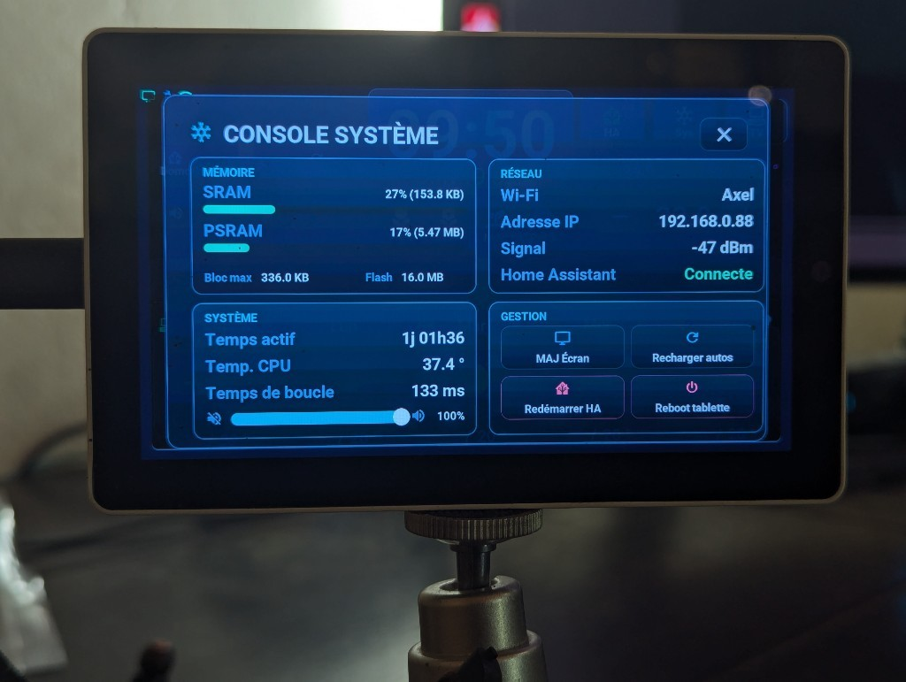

# Debugging this device

## English · [Français](#version-française)

---

This is a short methodology note, not an incident log — see [`docs/troubleshooting.md`](troubleshooting.md) for already-diagnosed symptoms. Read that one first; only reach for the techniques below if the symptom isn't already documented there.

## Where to look

- **Live ESPHome logs** (`esphome logs tab5-ha-hmi.yaml`, or the ESPHome dashboard's log view) — the primary source of truth for boot sequence issues, API connection state, and any `ESP_LOG*` line in the C++ code. Close the session when you're done; a leaked `esphome logs` process holds an API connection open indefinitely (see the "API connections exhausted" entry in `troubleshooting.md`).
- **The on-screen console overlay** (`console_sys.yaml`, opened via the console button `btn_control_console`, top right — not by swipe since the 14/07/2026 rework) — 4 glass cards: MÉMOIRE (SRAM/PSRAM, max free block, flash), RÉSEAU (SSID/IP/signal + HA connection status), SYSTÈME (uptime, CPU temperature, loop time, volume) and GESTION (screen re-push = re-arm the `is_primary_active` flag + push automation, automation reload, HA restart and device reboot — the last two behind a confirm overlay, 16/07/2026 redesign). It is **not** a log viewer — for payload/event logs use `esphome logs`. Useful when you don't have a laptop connected but can see the screen.

  

- **Home Assistant's own logs** for anything upstream of the device — automation trigger/condition evaluation, template rendering errors, service call rejections.

## Marking a spot for later, in code

Use the `[AI-DEBUG]` tag (see [`Tab5/README.md`](../Tab5/README.md)) in a comment when you find a good observation point while investigating something, even if you don't fix the underlying issue in the same session — it saves the next debugging pass (human or AI) from re-finding the same vantage point.

## After a crash or a Wi-Fi outage: the boot and outage journal

Since 2026-09-26 the device keeps its own journal (`Tab5/tab5_journal.cpp`), so a crash or a failure of the Wi-Fi co-processor link (ESP32-C6) can be analysed after the fact, without a USB cable plugged in at the time:

- **What is kept:** every error (ESPHome's and ESP-IDF's, including the ESP-Hosted driver of the C6, tag `esp-idf`), plus the warnings logged while Home Assistant is not connected (boot before HA, Wi-Fi down). A line repeated in a row is counted, not duplicated. ESPHome's own crash report (tag `esp32.crash`: PC, fault address and backtrace of both cores) is written at boot and lands in the journal too.
- **Where:** 32 lines in `.noinit` RAM, which survives software resets, crashes, watchdogs and a reset through USB, but not a power cut. After 2 min without HA, a copy goes to NVS (at most every 15 min, only when something new was logged) and is read back at the next boot if RAM was lost.
- **How it reaches you:** at each HA connection, the `esphome.tab5_journal` event is sent if the journal holds more than a normal boot. Guard (e) of `HomeAssistant_Config/packages/tab5_health.yaml` turns it into a persistent notification (and a phone push when `grave`: crash, error, or a boot that never reached HA). Events stay in the recorder's `events` table.
- **Reset reason of every boot:** the `Tab5 Raison du redémarrage` entity (`Software Reset`, `Exception`, `Task Watchdog`, `Brownout`, `Power On`…), one row per boot in the HA history.
- **Decoding a backtrace:** the addresses belong to the build that crashed. Keep the ELF of every flashed build (`H:/.esphome_data/build/tab5-ha-hmi/build/tab5-ha-hmi.elf`, compare `config_hash`) and run `riscv32-esp-elf-addr2line -pfiaC -e tab5-ha-hmi.elf <addresses>`. If the report says *captured by a different firmware build*, use that build's ELF.
- **Not done on purpose:** an ESP-IDF core dump to flash. It needs a `coredump` partition, the current table (`partitions.csv`: 2 × 7.75 MB apps + 448 KB NVS) fills the 16 MB, and a partition table change is only written by a USB flash, never by OTA. The journal covers the C6 case, which is not a crash of the P4.

## Diagnosing a silent automation failure on the Home Assistant side

If a Home Assistant automation appears to do nothing — no error, no expected result — and you suspect a step is failing validation or a condition is silently false, **insert a debug marker directly into the real automation** rather than trying to reproduce its logic in a separate, isolated test script.

Concretely: add a `input_text.set_value` (or similar low-cost, visible side effect) call as an extra step at the point you want to check, using the real automation, the real trigger, the real entity states — then trigger it for real and read the value back.

This matters because a from-scratch reproduction script can differ from the real automation in a way that's exactly the bug — different Jinja context, different entity availability at trigger time, a condition that only fails on a subset of runs. A reproduction that "works" in isolation tells you nothing about why the real one doesn't; it just wastes a debugging cycle. This is exactly how the `now()`-without-`strftime` calendar bug (see `troubleshooting.md`) was found: the isolated repro would have needed to guess the exact template context, while the marker-in-the-real-automation approach surfaced the failing step immediately.

Remove or comment out the marker once the real fix is confirmed — don't leave debug-only automation steps live in production without a reason.

---

---

## Version Française

---

Note de méthodologie, pas un journal d'incidents — voir [`docs/troubleshooting.md`](troubleshooting.md) pour les symptômes déjà diagnostiqués. À lire en premier ; les techniques ci-dessous ne servent que si le symptôme n'y est pas déjà documenté.

## Où regarder

- **Logs ESPHome en direct** (`esphome logs tab5-ha-hmi.yaml`, ou la vue logs du dashboard ESPHome) — source de vérité principale pour les problèmes de séquence de boot, l'état des connexions API, et toute ligne `ESP_LOG*` du code C++. Fermer la session une fois terminée ; un process `esphome logs` oublié occupe une connexion API indéfiniment (voir "connexions API épuisées" dans `troubleshooting.md`).
- **La Console Système à l'écran** (`console_sys.yaml`, ouverte via le bouton console `btn_control_console`, en haut à droite — plus par swipe depuis la refonte du 14/07/2026) — 4 cartes : MÉMOIRE (SRAM/PSRAM, bloc max, flash), RÉSEAU (SSID/IP/signal + état connexion HA), SYSTÈME (uptime, température CPU, temps de boucle, volume) et GESTION (MAJ écran = re-push du flag `is_primary_active` + automation de push, reload des automations, redémarrage HA et reboot tablette — les deux derniers derrière un overlay de confirmation, refonte du 16/07/2026). Ce n'est **pas** un visualiseur de logs — pour les payloads/événements, utiliser `esphome logs`.

  

- **Les logs Home Assistant** pour tout ce qui est en amont de l'appareil — évaluation trigger/condition d'automation, erreurs de rendu de template, rejets d'appel de service.

## Marquer un point d'observation dans le code

Utiliser le tag `[AI-DEBUG]` (voir [`Tab5/README.md`](../Tab5/README.md)) en commentaire quand on trouve un bon point d'observation en cours d'investigation, même sans corriger le problème sous-jacent dans la même session.

## Après un plantage ou une coupure Wi-Fi : le journal des démarrages

Depuis le 26/09/2026, l'appareil tient son propre journal (`Tab5/tab5_journal.cpp`). Un plantage ou une panne du lien avec le co-processeur Wi-Fi (ESP32-C6) s'analyse donc après coup, sans câble USB branché au moment de l'incident :

- **Ce qui est gardé :** toutes les erreurs (d'ESPHome et d'ESP-IDF, dont le pilote ESP-Hosted du C6, étiquette `esp-idf`), plus les avertissements écrits pendant que Home Assistant n'est pas connecté (démarrage avant HA, Wi-Fi tombé). Une ligne répétée d'affilée est comptée, pas recopiée. Le rapport de plantage d'ESPHome (étiquette `esp32.crash` : PC, adresse fautive et pile d'appels des deux cœurs), écrit au démarrage, y entre aussi.
- **Où :** 32 lignes en RAM `.noinit`, qui survit aux redémarrages logiciels, aux plantages, aux chiens de garde et au reset par l'USB, pas à une coupure de courant. Après 2 min sans HA, une copie part en NVS (au plus toutes les 15 min, seulement s'il y a du nouveau), relue au démarrage suivant si la RAM a été perdue.
- **Comment il arrive :** à chaque connexion de HA, l'événement `esphome.tab5_journal` part si le journal contient plus qu'un démarrage normal. La garde (e) de `HomeAssistant_Config/packages/tab5_health.yaml` en fait une notification persistante (et une notification sur le téléphone si `grave` : plantage, erreur, ou démarrage qui n'a jamais joint HA). Les événements restent dans la table `events` du recorder.
- **Raison de chaque démarrage :** l'entité `Tab5 Raison du redémarrage` (`Software Reset`, `Exception`, `Task Watchdog`, `Brownout`, `Power On`…), une ligne par démarrage dans l'historique HA.
- **Décoder une pile d'appels :** les adresses appartiennent au build qui a planté. Garder l'ELF de chaque build flashé (`H:/.esphome_data/build/tab5-ha-hmi/build/tab5-ha-hmi.elf`, comparer le `config_hash`) et lancer `riscv32-esp-elf-addr2line -pfiaC -e tab5-ha-hmi.elf <adresses>`. Si le rapport dit *captured by a different firmware build*, prendre l'ELF de ce build-là.
- **Écarté volontairement :** le core dump d'ESP-IDF en flash. Il lui faut une partition `coredump` ; la table actuelle (`partitions.csv` : 2 × 7,75 Mo d'application + 448 Ko de NVS) remplit les 16 Mo, et une table de partitions ne s'écrit que par un flash USB, jamais par OTA. Le journal couvre le cas du C6, qui n'est pas un plantage du P4.

## Diagnostiquer un échec silencieux d'automation côté Home Assistant

Si une automation HA ne semble rien faire — pas d'erreur, pas de résultat attendu — et qu'on soupçonne qu'une étape échoue à la validation ou qu'une condition est silencieusement fausse, **insérer un marqueur de debug directement dans la vraie automation** plutôt que d'essayer de reproduire sa logique dans un script de test isolé.

Concrètement : ajouter un appel `input_text.set_value` (ou effet de bord similaire, visible et peu coûteux) comme étape supplémentaire au point à vérifier, en utilisant la vraie automation, le vrai trigger, les vrais états d'entités — puis déclencher pour de vrai et relire la valeur.

Une reproduction isolée peut diverger de la vraie automation exactement sur le point qui cause le bug (contexte Jinja différent, disponibilité d'entité différente au moment du trigger, condition qui échoue seulement sur un sous-ensemble d'exécutions) — une repro qui "marche" en isolation ne dit rien sur le pourquoi de l'échec réel. C'est exactement comme ça qu'a été trouvé le bug `now()` sans `strftime` sur le calendrier (voir `troubleshooting.md`) : une repro isolée aurait dû deviner le contexte de template exact, alors que le marqueur dans la vraie automation a fait apparaître l'étape en échec immédiatement.

Retirer ou commenter le marqueur une fois le vrai correctif confirmé — ne pas laisser d'étapes de debug actives en production sans raison.
