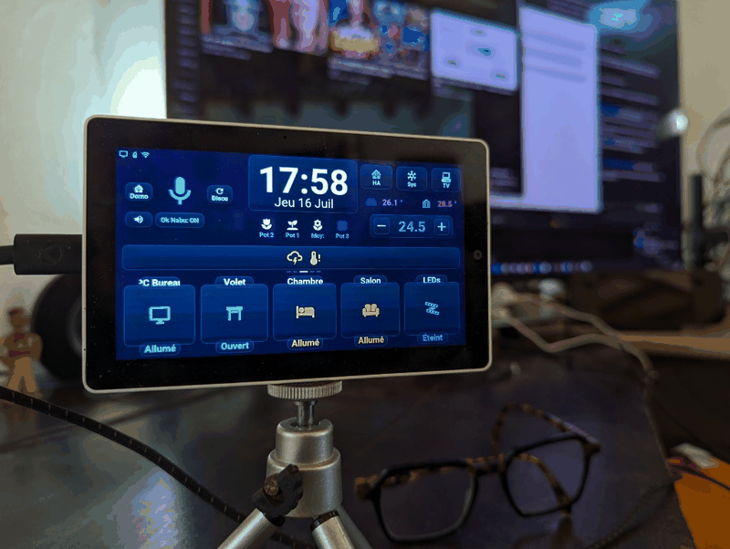
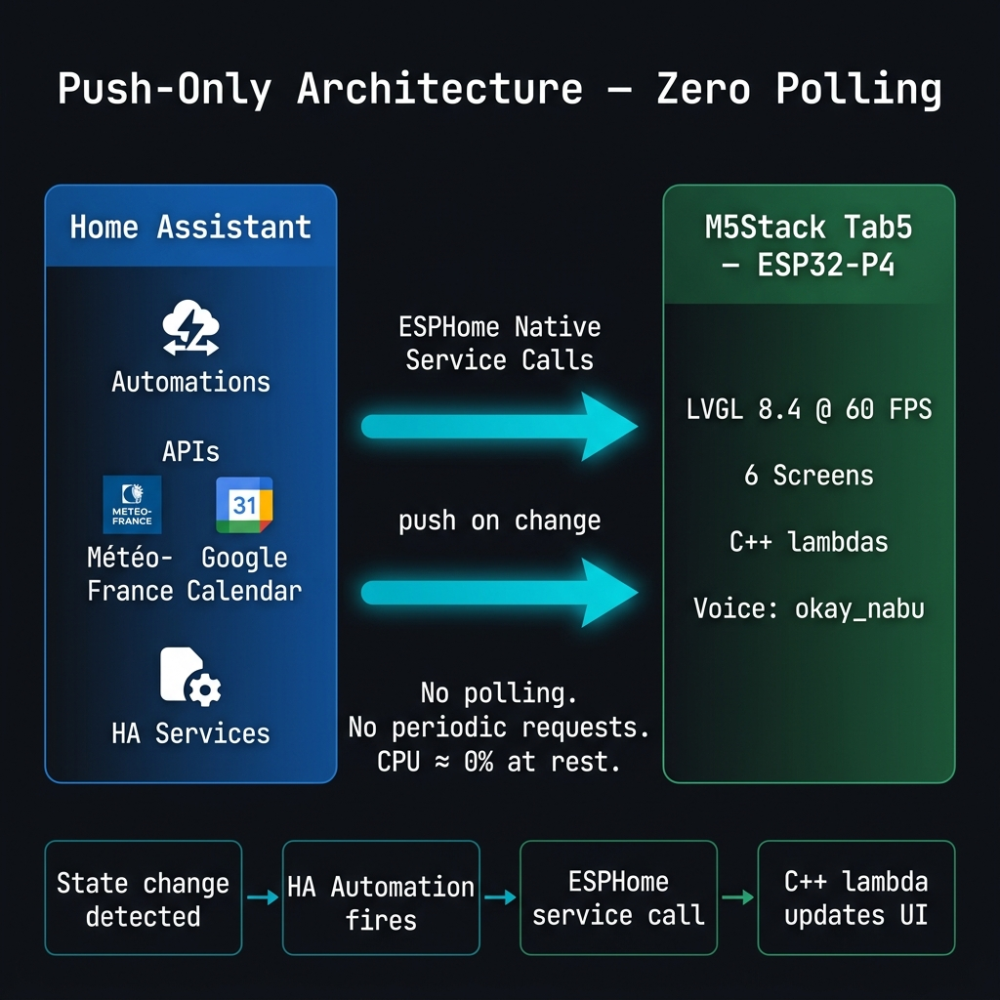

# Hackster.io / M5Stack Global Innovation Contest 2026 — Project Draft

> **How to use this file:** Copy sections into the Hackster.io project editor. Primary language is **English** (jury-facing). French blocks are marked for optional subtitles or a bilingual page.  
> **Repos:** [M5-Tab5-ESPHome-LVGL](https://github.com/Axellum/M5-Tab5-ESPHome-LVGL) · [vromvrom-engine](https://github.com/Axellum/vromvrom-engine)  
> **Firmware release:** [v1.0.5](https://github.com/Axellum/M5-Tab5-ESPHome-LVGL/releases/tag/v1.0.5) (July 2026)  
> **Demo video:** https://www.youtube.com/watch?v=ygNhgtMffu4

---

## Suggested project title

**Tab5 Voice HMI — Push-Only Home Assistant Dashboard on ESP32-P4**

Subtitle (optional): *Native LVGL UI + local voice routing — no browser, no polling, no Alexa cloud.*

---

## Cover media (upload order on Hackster)

1. **YouTube embed** — `https://www.youtube.com/watch?v=ygNhgtMffu4` (primary hero)
2. **GIF** — `docs/images/m5stack_tab5_demo.gif` (animated UI overview)
3. **Photos** (from `docs/images/`):
   - `tab5_photo_console_diag.jpg` — main dashboard
   - `tab5_photo_dashboard_switches.jpg` — quick actions
   - `tab5_photo_climate_popup.jpg` — climate popup
   - `tab5_photo_dashboard_weather.jpg` — diagnostics console
   - `push_only_architecture_diagram.png` — architecture

---

## Story / Introduction (EN — paste as main text)

### Why this project exists

A few months ago I wanted to see for myself what AI-assisted coding could actually deliver on real hardware. My old Nextion weather screen (ESPHome + Météo-France) was showing its age — so I replaced it with something much more ambitious: a **physical Home Assistant dashboard** on an **M5Stack Tab5 V2**, with touch UI, voice control, and a local multi-agent backend.

I am more the **architect than the author**: the firmware, automations, and most of this documentation were produced by AI tools (Antigravity/Gemini, DeepSeek, MiniMax, Z.ai, Claude, Cursor). My job was to set goals, test, reject bad ideas, and steer.

The companion **[vromvrom-engine](https://github.com/Axellum/vromvrom-engine)** is a separate experiment — a Python multi-agent orchestrator for voice routing, RAG, and specialist tasks (web, calendar…). It is work-in-progress and shared mainly for context, not as a finished product.

### What makes it different

This is **not** a kiosk running a web dashboard in a browser. The UI is **compiled LVGL 8.4 C++** embedded in ESPHome firmware on the **ESP32-P4**:

- **Push-only data flow** — the Tab5 never polls Home Assistant. HA automations push updates via native ESPHome service calls. CPU stays near idle when nothing changes.
- **60 FPS native rendering** in 16 MB PSRAM — vector Material Design Icons, no PNG weather sprites in firmware.
- **Voice Assist Satellite** — wake word `okay_nabu` runs on-device; STT/TTS via local Wyoming (Whisper + Piper) in Home Assistant; optional engine for smart routing (fast HA commands vs LLM chat). A **second on-device wake word — "Stop"** — is armed only while the roller shutter moves and halts it instantly, no cloud, no round-trip; tapping the mic interrupts a long reply and re-opens listening.
- **Single 1280×720 page** — weather swipe, rotating info card, full-screen glass popups (climate with optimistic arc thermostat and Daikin "Brise" airflow, light with live-% brightness and 12 color swatches, Samsung TV remote), plant moisture, HA alert banners with tap-to-dismiss.

### Demo video

[](https://www.youtube.com/watch?v=ygNhgtMffu4)

*Provisional demo — voice, touch, TV remote, climate (July 2026).*



---

## Story (FR — optional / subtitles)

Ayant beaucoup entendu parler de l’IA, et notamment en codage, il y a quelques mois de ça j’ai voulu voir par moi-même ce que cela donnait. Mon vieux écran Nextion (météo, ESPHome, Météo-France) datant, j’ai opté pour un renouvellement bien plus ambitieux sur un **M5Stack Tab5 V2** : tableau de bord domotique physique, assistant vocal, routage local.

De fil en aiguille : assistant vocal, puis un **moteur multi-agents** ([vromvrom-engine](https://github.com/Axellum/vromvrom-engine)) pour la domotique vocale en local et les conversations en semi-local/cloud. Projet en cours, partagé surtout à titre informatif.

Je suis plus **l’architecte que le créateur** — issu de mes débuts dans le monde de l’IA (Antigravity, DeepSeek, MiniMax, Z.ai, Claude, Cursor).

---

## How it works

### System overview

```
┌─────────────────┐     push events      ┌──────────────────┐
│  Home Assistant │ ──────────────────►  │  M5Stack Tab5 V2 │
│  (automations)  │ ◄── voice pipeline ── │  ESP32-P4 + LVGL │
└────────┬────────┘                      └──────────────────┘
         │
         │ optional REST (voice / chat)
         ▼
┌─────────────────┐
│ vromvrom-engine │  Steam Deck / LAN host
│ (multi-agent)   │  routing · RAG · specialists
└─────────────────┘
```



### M5Stack Tab5 role (contest focus)

The **Tab5 V2 is the M5Stack controller** in this project:

| Role | Implementation |
|------|----------------|
| Display & touch | MIPI-DSI 1280×720, ST7123 capacitive touch |
| HMI | LVGL 8.4 UI in ESPHome — 8 modular YAML packages + C++ parsers |
| Voice capture | ES7210 ADC → I2S → Home Assistant Assist Satellite |
| Voice output | ES8388 DAC + onboard speaker |
| Wake word | `okay_nabu` on-device (micro_wake_word / TFLite) |
| Connectivity | ESP32-C6 co-processor (Wi-Fi 6 / BLE) |

The Tab5 does **not** run LLM inference. It shows pipeline state (mic icon colors), plays TTS, and renders pushed data instantly.

### Voice + engine pipeline

| Step | Where | What |
|------|--------|------|
| 1. Wake word | Tab5 (on-device) | `okay_nabu` — idle listening stays local |
| 2. STT | Home Assistant | Wyoming Whisper (local) |
| 3. Intent / reply | HA agent → optional **vromvrom-engine** | HA commands: deterministic match. Chat: light LLM path. Specialists: web, calendar… |
| 4. TTS | Home Assistant | Wyoming Piper (local) |
| 5. Playback | Tab5 | ES8388 + amplifier |

Two UI modes: **Domotics** (standard HA agent) and **Discussion** (engine-backed multi-turn chat).

### UI highlights (touch)

- **Weather** — 5 swipe windows (hourly + 15-day forecast)
- **Rotating center card** — planning, rain graph, Météo-France alerts, calendar recap, up to 4 HA info/alert banners
- **Tap to dismiss** — tap a banner to hide it locally until HA pushes a new id
- **Climate popup** — stacked modes, 320 px arc thermostat with optimistic target (debounced), presets, airflow incl. Daikin "Brise" (`windnice`)
- **Light popup** — 3-light selector, live-% brightness arc (debounced), 10/35/65/100 % shortcuts, 3 named whites + 12 color swatches
- **TV remote** — fullscreen Samsung remote via HA `remote.*`
- **Console** — RAM/PSRAM, Wi-Fi, uptime, volume, HA management (screen re-push, reload, restart/reboot behind confirm)
- **Voice "Stop"** — on-device second wake word halts the moving shutter instantly; tap the mic to interrupt a reply

→ Detail: [`screens.md`](screens.md) · [`voice_assistant.md`](voice_assistant.md)

---

## Bill of Materials

### Required (minimum demo)

| Item | Notes |
|------|-------|
| **M5Stack Tab5 V2** | ESP32-P4 + ESP32-C6, 5" MIPI display, ES8388/ES7210 audio — **contest-eligible M5Stack controller** |
| Wi-Fi network | Tab5 joins LAN; HA reachable |
| PC or SBC | ESPHome compile + USB flash (first time) |

### Full home install (as in demo video)

| Item | Role |
|------|------|
| M5Stack Tab5 V2 | HMI + voice satellite |
| Home Assistant | Automations, Assist pipeline, entity state |
| Wyoming Whisper | Local STT |
| Wyoming Piper | Local TTS |
| Zigbee coordinator (e.g. SLZB-06MU) | Lights, sensors, covers |
| BLE plant sensors | Soil moisture cards (up to 5) |
| Daikin / climate entity | Climate popup |
| Samsung TV + HA integration | TV remote popup |
| Steam Deck or LAN server (optional) | Hosts **vromvrom-engine** for Discussion mode |

### Software (all open source)

- [ESPHome](https://esphome.io) ≥ 2025.9.3
- [Home Assistant](https://www.home-assistant.io)
- This repo: [M5-Tab5-ESPHome-LVGL](https://github.com/Axellum/M5-Tab5-ESPHome-LVGL)
- Optional: [vromvrom-engine](https://github.com/Axellum/vromvrom-engine)

---

## Build instructions (summary)

Full steps: [`installation.md`](installation.md) · Try without HA: [`demo_mode.md`](demo_mode.md)

### 1. Clone & configure

```bash
git clone https://github.com/Axellum/M5-Tab5-ESPHome-LVGL.git
cd M5-Tab5-ESPHome-LVGL
cp Tab5/user_entities.example.yaml Tab5/user_entities.yaml
# Create secrets.yaml — Wi-Fi + api_encryption_key (see installation.md)
```

### 2. Map your Home Assistant entities

Edit `Tab5/user_entities.yaml` — lights, climate, covers, plants, TV, etc.

### 3. Import HA automations

Copy packages from `HomeAssistant_Config/` into your HA instance (automations push data to Tab5 services).

### 4. Compile & flash

```bash
esphome run tab5-ha-hmi.yaml
```

OTA updates work after first USB flash.

### 5. Voice (optional)

- Configure HA Assist pipeline (Whisper + Piper)
- Register Tab5 as Assist Satellite
- For Discussion mode: deploy vromvrom-engine and point HA conversation agent to it

### 6. Demo without Home Assistant

```bash
pip install -r tools/demo/requirements.txt
python tools/demo/demo_pusher.py --host <tab5-ip> --key <api_encryption_key>
```

---

## Schematics / diagrams

- GPIO & audio: [`hardware.md`](hardware.md) — includes pinout diagram (`docs/images/gpio_pinout_table.png`)
- Push architecture: `docs/images/push_only_architecture_diagram.png`
- YAML module map: [`architecture.md`](architecture.md)

---

## Code

| Component | Location |
|-----------|----------|
| ESPHome entry | `tab5-ha-hmi.yaml` |
| UI + logic | `Tab5/*.yaml`, `Tab5/tab5_custom.cpp` |
| HA automations | `HomeAssistant_Config/` |
| Demo pusher | `tools/demo/demo_pusher.py` |
| Engine (optional) | [github.com/Axellum/vromvrom-engine](https://github.com/Axellum/vromvrom-engine) |

License: MIT (Tab5 firmware repo)

---

## Gallery captions (for Hackster photo uploads)

| File | Caption (EN) |
|------|----------------|
| `tab5_photo_console_diag.jpg` | Main dashboard — weather forecast, voice mic, climate strip |
| `tab5_photo_dashboard_switches.jpg` | Quick actions — PC, shutters, room lights |
| `tab5_photo_climate_popup.jpg` | Full-screen climate control popup |
| `tab5_photo_dashboard_weather.jpg` | Diagnostics console — RAM, Wi-Fi, uptime, volume |
| `m5stack_tab5_demo.gif` | Animated UI overview |
| `push_only_architecture_diagram.png` | Push-only data flow (no polling) |

---

## Contest alignment (internal checklist)

| Criterion | Angle |
|-----------|--------|
| **Creativity & originality** | Physical push-only HMI + local multi-agent voice routing — not a cloud voice assistant in a box |
| **Functionality & execution** | Live demo: wake word → HA command → discussion → touch popup → TV remote |
| **Documentation & presentation** | Public GitHub + this page + video + GIF + photos |
| **Impact & utility** | Private, local-first smart home — no mandatory Alexa/Google cloud |
| **M5Stack integration** | Tab5 V2 as primary controller: display, touch, audio, wake word, LVGL firmware |

**Submission links:** [M5Stack Global Innovation Contest 2026](https://m5stack.com/global-innovation-contest-2026) · Hackster.io project page · Google form (official)

---

## Version Française — titre & résumé Hackster

**Titre:** Tab5 — Tableau de bord HA push-only + assistant vocal local

**Résumé:** Interface LVGL native sur M5Stack Tab5 V2 (ESP32-P4), pilotée par événements Home Assistant (zéro polling), avec satellite vocal Assist, popups clim/lumières/TV, et moteur multi-agents optionnel pour la conversation.

**Vidéo:** https://www.youtube.com/watch?v=ygNhgtMffu4
