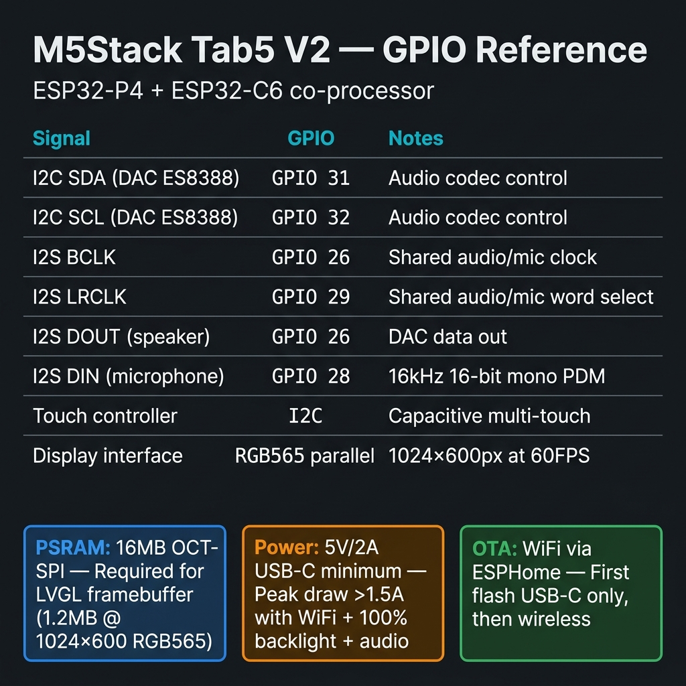

# Hardware Reference

## English · [Français](#version-française)

---

## M5Stack Tab5 V2

The Tab5 is a 5-inch touch-screen panel from M5Stack. The V2 revision uses an **ESP32-P4** as the main application processor, with a separate **ESP32-C6** co-processor handling Wi-Fi and Bluetooth connectivity.

### ESP32-P4 (main processor)

| Spec | Value |
|------|-------|
| Architecture | RISC-V, dual-core, up to 400 MHz |
| Internal SRAM | 768 KB |
| External PSRAM | 16 MB (OCT-SPI) |
| Flash | 16 MB |
| Display interface | MIPI-DSI, 16-bit RGB565 |
| Touch controller | I2C (ST7123) |

The PSRAM is critical for this project. LVGL requires a framebuffer sized to the display resolution — at 1280 × 720 px in RGB565, that's ~1.8 MB just for the framebuffer. The ESP32-P4's internal SRAM alone would not be enough. With 16 MB of PSRAM, the framebuffer stays entirely in external memory, and LVGL can operate at 60 FPS without tearing.

### ESP32-C6 (co-processor)

Handles all radio communication: Wi-Fi 6 (802.11ax) and BLE 5. The main ESP32-P4 communicates with it over an SDIO bus (`esp32_hosted:` component, 20 MHz). From the ESPHome/LVGL code perspective, this is transparent — standard ESPHome Wi-Fi and BLE components work normally.

---

## Display

- **Size:** 5 inches
- **Resolution:** 1280 × 720 px (M5Stack Tab5 V2 batch used in this project)
- **Interface:** MIPI-DSI 16-bit RGB565 (ESP32-P4 LCD peripheral)
- **Touch:** Capacitive multi-touch via custom ST7123 I2C driver (`my_components/st7123`)

GPIO pinout reference (display, touch, audio, expanders):

---

## Audio — ES8388 DAC

The Tab5 integrates an **ES8388** audio codec chip, used here for the DAC path (speaker output) via ESPHome's native `audio_dac: es8388` platform. The microphone input goes through a separate **ES7210** ADC chip (`audio_adc: es7210`, 16 kHz / 16-bit), whose output the ESP32-P4 reads over I2S.

### Connections

| Signal | GPIO |
|--------|------|
| I2C SDA (DAC control) | GPIO 31 |
| I2C SCL (DAC control) | GPIO 32 |
| I2S BCLK (audio clock) | GPIO 26 (shared) |
| I2S LRCLK (word select) | GPIO 29 (shared) |
| I2S DOUT (data to DAC) | GPIO 26 |
| Amplifier enable | GPIO (software-controlled switch) |

### Boot sequence issue

The ES8388 requires a specific initialization sequence over I2C to come out of reset and route audio correctly. If the amplifier enable line fires before the I2S clock is stable, a loud pop occurs through the speaker.

The ESPHome `on_boot` block addresses this by sequencing (`tab5-ha-hmi.yaml`, priority 600):
1. Turn on the backlight, wait 1 s
2. Set the media player volume
3. Only then enable the amplifier switch (`speaker_enable`)
4. Then wait for the HA API connection

This order ensures the I2S clock is stable before the amplifier opens the speaker path. Register-level initialization is handled by ESPHome's `es8388` platform itself — there are no manual `i2c.write_bytes` calls in the configuration anymore.

---

## Microphone — ES7210 ADC over I2S

The onboard microphone is captured by the **ES7210** ADC chip (`audio_adc: es7210`), which streams to the ESP32-P4 over I2S (`adc_type: external`).

| Signal | GPIO |
|--------|------|
| I2S DIN (data from mic) | GPIO 28 |
| I2S BCLK | GPIO 27 |
| I2S LRCLK | GPIO 29 |
| I2S MCLK | GPIO 30 |

Capture parameters: **16 kHz, 16-bit mono**. This matches the input format expected by the `micro_wake_word` component and by Home Assistant's voice pipeline.

---

## Power

The Tab5 is USB-C powered. Peak consumption (Wi-Fi active + 100% backlight + audio playing) can exceed 1.5 A at 5V. A charger rated for at least **5V / 2A** is required to avoid brownout resets.

Backlight brightness is software-controlled via PWM (LEDC output on GPIO 22, `light: monochromatic`) and can be dimmed from Home Assistant to reduce power draw. Touching the screen while the backlight is off turns it back on (`touchscreen: on_release`). There is no ambient light sensor in this configuration.

---

---

## Version Française

---

## M5Stack Tab5 V2

Le Tab5 est un panneau tactile de 5 pouces de M5Stack. La révision V2 utilise un **ESP32-P4** comme processeur applicatif principal, avec un co-processeur **ESP32-C6** séparé gérant la connectivité Wi-Fi et Bluetooth.

### ESP32-P4 (processeur principal)

| Spec | Valeur |
|------|--------|
| Architecture | RISC-V, dual-core, jusqu'à 400 MHz |
| SRAM interne | 768 KB |
| PSRAM externe | 16 MB (OCT-SPI) |
| Flash | 16 MB |
| Interface affichage | MIPI-DSI, RGB565 16 bits |
| Contrôleur tactile | I2C (ST7123) |

La PSRAM est critique pour ce projet. LVGL nécessite un framebuffer dimensionné à la résolution de l'affichage — à 1280 × 720 px en RGB565, ça fait ~1,8 MB rien que pour le framebuffer. La SRAM interne de l'ESP32-P4 seule ne suffirait pas. Avec 16 MB de PSRAM, le framebuffer reste entièrement en mémoire externe, et LVGL peut fonctionner à 60 FPS sans tearing.

### ESP32-C6 (co-processeur)

Gère toute la communication radio : Wi-Fi 6 (802.11ax) et BLE 5. Le ESP32-P4 principal communique avec lui via un bus SDIO (composant `esp32_hosted:`, 20 MHz). Du point de vue du code ESPHome/LVGL, c'est transparent — les composants Wi-Fi et BLE standards d'ESPHome fonctionnent normalement.

---

## Affichage

- **Taille :** 5 pouces
- **Résolution :** 1280 × 720 px (lot M5Stack Tab5 V2 utilisé dans ce projet)
- **Interface :** MIPI-DSI RGB565 16 bits (périphérique LCD de l'ESP32-P4)
- **Tactile :** Capacitif multi-touch via le driver custom ST7123 en I2C (`my_components/st7123`)

---

## Audio — DAC ES8388

Le Tab5 intègre un codec audio **ES8388**, utilisé ici pour le chemin DAC (sortie haut-parleur) via la plateforme native `audio_dac: es8388` d'ESPHome. L'entrée microphone passe par un chip ADC séparé, l'**ES7210** (`audio_adc: es7210`, 16 kHz / 16 bits), dont l'ESP32-P4 lit la sortie en I2S.

### Connexions

| Signal | GPIO |
|--------|------|
| I2C SDA (contrôle DAC) | GPIO 31 |
| I2C SCL (contrôle DAC) | GPIO 32 |
| I2S BCLK (horloge audio) | GPIO 26 (partagé) |
| I2S LRCLK (word select) | GPIO 29 (partagé) |
| I2S DOUT (données vers DAC) | GPIO 26 |
| Activation ampli | GPIO (switch logiciel) |

### Problème de séquence au boot

L'ES8388 nécessite une séquence d'initialisation spécifique sur I2C pour sortir du reset et router correctement l'audio. Si la ligne d'activation de l'amplificateur passe avant que l'horloge I2S soit stable, un fort pop se produit dans le haut-parleur.

Le bloc `on_boot` d'ESPHome règle ça en séquençant (`tab5-ha-hmi.yaml`, priorité 600) :
1. Allumer le rétroéclairage, attendre 1 s
2. Régler le volume du media player
3. Seulement alors activer le switch ampli (`speaker_enable`)
4. Puis attendre la connexion API HA

Cet ordre garantit que l'horloge I2S est stable avant que l'ampli ouvre le chemin vers le haut-parleur. L'initialisation des registres est prise en charge par la plateforme `es8388` d'ESPHome elle-même — il n'y a plus d'appel manuel `i2c.write_bytes` dans la configuration.

---

## Microphone — ADC ES7210 via I2S

Le microphone intégré est capturé par le chip ADC **ES7210** (`audio_adc: es7210`), qui streame vers l'ESP32-P4 en I2S (`adc_type: external`).

| Signal | GPIO |
|--------|------|
| I2S DIN (données du micro) | GPIO 28 |
| I2S BCLK | GPIO 27 |
| I2S LRCLK | GPIO 29 |
| I2S MCLK | GPIO 30 |

Paramètres de capture : **16 kHz, 16-bit mono**. Correspond au format d'entrée attendu par le composant `micro_wake_word` et par le pipeline vocal de Home Assistant.

---

## Alimentation

Le Tab5 est alimenté en USB-C. La consommation en pointe (Wi-Fi actif + rétroéclairage 100% + audio en lecture) peut dépasser 1,5 A à 5V. Un chargeur d'au moins **5V / 2A** est nécessaire pour éviter les resets par sous-tension.

La luminosité du rétroéclairage est contrôlée logiciellement via PWM (sortie LEDC sur GPIO 22, `light: monochromatic`) et peut être réduite depuis Home Assistant. Toucher l'écran quand le rétroéclairage est éteint le rallume (`touchscreen: on_release`). Il n'y a pas de capteur de luminosité ambiante dans cette configuration.
