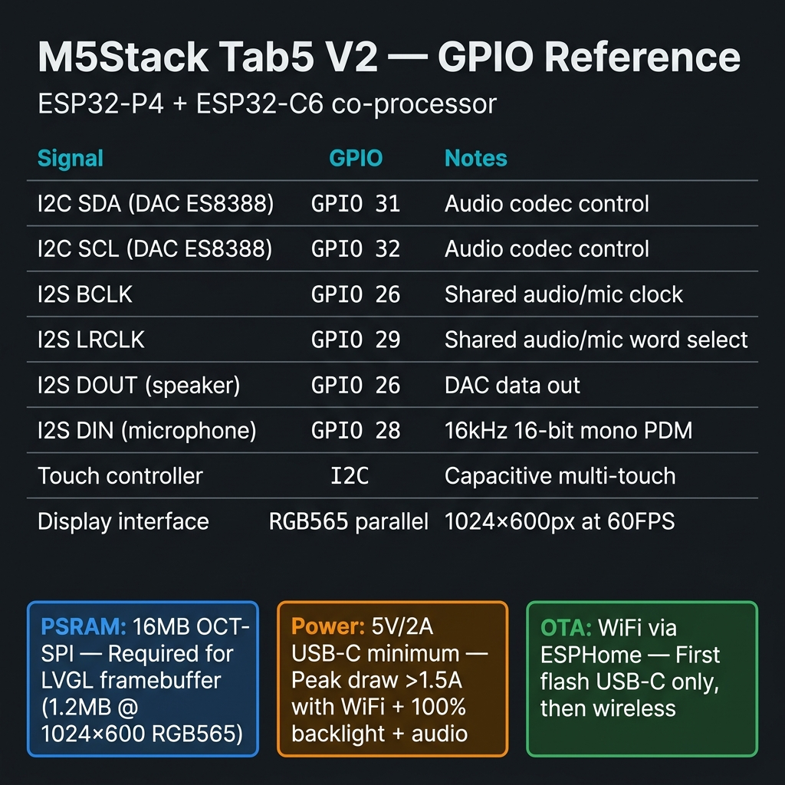

# Hardware Reference

## English · [Français](#version-française)

---

## Hardware revisions

M5Stack has shipped the Tab5 with three different display controllers ([M5Stack change log](https://docs.m5stack.com/en/core/Tab5)). Each one needs its own ESPHome display model, and they are not interchangeable ([ESPHome `mipi_dsi` documentation](https://esphome.io/components/display/mipi_dsi/)):

| Display chip | Units made | ESPHome model | `tab5_ecran:` | Status in this project |
|---|---|---|---|---|
| **ILI9881C** + separate **GT911** touch | 9 May 2025 → 14 October 2025 | `M5STACK-TAB5` | `ili9881c` | 🧪 **Compiles, untested** — built by the CI, never run on a device |
| **ST7123** (display and touch in one chip) | 14 October 2025 → 28 April 2026 | `M5STACK-TAB5-ST7123` (named `M5STACK-TAB5-V2` before ESPHome 2026.7) | `st7123` (default) | ✅ **Supported** — the author's device, in daily use |
| **ST7121** (display and touch in one chip) | from 28 April 2026 | `M5STACK-TAB5-ST7121` | `st7121` | 🧪 **Compiles, untested** — built by the CI, never run on a device; the touch driver is an educated guess (see below) |

**How to tell which one you have:** the display chip is printed on the sticker on the back, just above the Espressif logo. ESPHome warns that a unit labelled "ST7123" may carry either an ST7123 or an ST7121: the only way to know is to try both.

**Choosing your revision:** add one line to `Tab5/user_entities.yaml`, for example `tab5_ecran: st7121`. Without it, the firmware is built for the ST7123. What differs between revisions (display model, touch chip) lives in `Tab5/ecran-<revision>.yaml`; pins, calibration and behaviour are shared in `Tab5/tab5-hardware.yaml`.

**What "untested" means:** the CI compiles both files whenever the display configuration changes, so they cannot silently break, but nobody has run them on a real tablet yet.

- **ILI9881C:** display model and GT911 touch taken from the [ESPHome device page](https://devices.esphome.io/devices/m5stack-tab5/) for the original revision, with the same pins as the ST7123.
- **ST7121:** ESPHome has an official display model, but no ST7121 touch driver. According to comments in ESPHome's model code, M5Stack's factory firmware tells the two chips apart by reading the touch controller's firmware version, so they very likely share the same protocol: this project uses the `st7123` touch platform. If the screen works but touch does not, this is the first suspect.

**Good to know:** most Tab5 examples published so far target the original ILI9881C revision. In September 2026, the [ESPHome device page](https://devices.esphome.io/devices/m5stack-tab5/) still says only that one is supported, and [M5Stack's own Home Assistant HMI example](https://docs.m5stack.com/en/homeassistant/applications/dashboard/tab5_ha_hmi) does not support units made after 14 October 2025. This project runs on the ST7123 and builds for the other two.

Own an ST7121 or ILI9881C unit and willing to try? Say how it went in [Discussions → Hardware compatibility](https://github.com/Axellum/M5-Tab5-ESPHome-LVGL/discussions/categories/hardware-compatibility).

---

## M5Stack Tab5 V2

The Tab5 is a 5-inch touch-screen panel from M5Stack. It uses an **ESP32-P4** as the main application processor, with a separate **ESP32-C6** co-processor handling Wi-Fi and Bluetooth connectivity. This project runs on the **ST7123** revision, which this repository calls "Tab5 V2" (see [Hardware revisions](#hardware-revisions)).

### ESP32-P4 (main processor)

| Spec | Value |
|------|-------|
| Architecture | RISC-V, dual-core, up to 400 MHz |
| Internal SRAM | 768 KB |
| External PSRAM | 32 MB (hex mode, 16 data lines, 200 MHz) — measured on the device on 2026-09-26: `esp_psram_get_size()` = 32 768 KB, 29 567 KB available to the heap |
| Flash | 16 MB |
| Display interface | MIPI-DSI, 16-bit RGB565 |
| Touch controller | I2C (ST7123) |

The PSRAM is critical for this project. LVGL requires a framebuffer sized to the display resolution — at 1280 × 720 px in RGB565, that's ~1.8 MB just for the framebuffer. The ESP32-P4's internal SRAM alone would not be enough. With 32 MB of PSRAM, the framebuffer stays entirely in external memory, and LVGL can operate at 60 FPS without tearing.

### ESP32-C6 (co-processor)

Handles all radio communication: Wi-Fi 6 (802.11ax) and BLE 5. The main ESP32-P4 communicates with it over an SDIO bus (`esp32_hosted:` component, 20 MHz). From the ESPHome/LVGL code perspective, this is transparent — standard ESPHome Wi-Fi and BLE components work normally.

The C6 has its own RAM (512 KB) and runs Espressif's ESP-Hosted firmware, not ours: our firmware, including the TCP/IP stack (lwIP), runs on the P4. ESPHome builds the P4 side of ESP-Hosted (2.12.12 with ESPHome 2026.9) but does not update the C6, which keeps its factory firmware unless someone reflashes it. The diagnostic sensor **Tab5 C6 Version** reports that version once per boot.

### Real-time clock (RX8130CE)

Address 0x32 on the internal I2C bus (`bsp_bus`, GPIO31/32), backed by a 70 000 µF supercapacitor (M5Stack specification). The firmware reads it once at boot, so the clock and the alarm have the time before the network is up, and writes it back after every NTP sync. It stores UTC. The same bus also carries an INA226 power monitor (0x41), not used by the firmware.

---

## Display

- **Size:** 5 inches
- **Resolution:** 1280 × 720 px (M5Stack Tab5 V2 batch used in this project)
- **Interface:** MIPI-DSI 16-bit RGB565 (ESP32-P4 LCD peripheral)
- **Touch:** Capacitive multi-touch via ESPHome's official `st7123` I2C touchscreen platform on the ST7123 revision (since ESPHome 2026.7.0; the former custom `my_components/st7123` was removed on 2026-07-06) — `gt911` on the original ILI9881C revision, see [Hardware revisions](#hardware-revisions)

GPIO pinout reference (display, touch, audio, expanders):

---

## Audio — ES8388 DAC

The Tab5 integrates an **ES8388** audio codec chip, used here for the DAC path (speaker output) via ESPHome's native `audio_dac: es8388` platform. The microphone input goes through a separate **ES7210** ADC chip (`audio_adc: es7210`, 16 kHz / 16-bit), whose output the ESP32-P4 reads over I2S.

### Connections

| Signal | GPIO |
|--------|------|
| I2C SDA (DAC control) | GPIO 31 |
| I2C SCL (DAC control) | GPIO 32 |
| I2S BCLK (audio clock) | GPIO 26 (shared) |
| I2S LRCLK (word select) | GPIO 29 (shared) |
| I2S DOUT (data to DAC) | GPIO 26 |
| Amplifier enable | GPIO (software-controlled switch) |

### Boot sequence issue

The ES8388 requires a specific initialization sequence over I2C to come out of reset and route audio correctly. If the amplifier enable line fires before the I2S clock is stable, a loud pop occurs through the speaker.

The ESPHome `on_boot` block addresses this by sequencing (`tab5-ha-hmi.yaml`, priority 600):
1. Turn on the backlight, wait 1 s
2. Set the media player volume
3. Only then enable the amplifier switch (`speaker_enable`)
4. Then wait for the HA API connection

This order ensures the I2S clock is stable before the amplifier opens the speaker path. Register-level initialization is handled by ESPHome's `es8388` platform itself — there are no manual `i2c.write_bytes` calls in the configuration anymore.

---

## Microphone — ES7210 ADC over I2S

The onboard microphone is captured by the **ES7210** ADC chip (`audio_adc: es7210`), which streams to the ESP32-P4 over I2S (`adc_type: external`).

| Signal | GPIO |
|--------|------|
| I2S DIN (data from mic) | GPIO 28 |
| I2S BCLK | GPIO 27 |
| I2S LRCLK | GPIO 29 |
| I2S MCLK | GPIO 30 |

Capture parameters: **16 kHz, 16-bit mono**. This matches the input format expected by the `micro_wake_word` component and by Home Assistant's voice pipeline.

---

## Power

The Tab5 is USB-C powered. Peak consumption (Wi-Fi active + 100% backlight + audio playing) can exceed 1.5 A at 5V. A charger rated for at least **5V / 2A** is required to avoid brownout resets.

Backlight brightness is software-controlled via PWM (LEDC output on GPIO 22, `light: monochromatic`) and can be dimmed from Home Assistant to reduce power draw. Touching the screen while the backlight is off turns it back on (`touchscreen: on_release`). There is no ambient light sensor in this configuration.

---

---

## Version Française

---

## Révisions matérielles

M5Stack a livré le Tab5 avec trois contrôleurs d'écran différents ([journal des versions M5Stack](https://docs.m5stack.com/en/core/Tab5)). Chacun demande son propre modèle d'affichage ESPHome, et ils ne sont pas interchangeables ([documentation ESPHome `mipi_dsi`](https://esphome.io/components/display/mipi_dsi/)) :

| Puce écran | Appareils fabriqués | Modèle ESPHome | `tab5_ecran:` | Statut dans ce projet |
|---|---|---|---|---|
| **ILI9881C** + tactile **GT911** séparé | du 9 mai 2025 au 14 octobre 2025 | `M5STACK-TAB5` | `ili9881c` | 🧪 **Compile, non testée** — compilée par la CI, jamais lancée sur une tablette |
| **ST7123** (écran et tactile dans une seule puce) | du 14 octobre 2025 au 28 avril 2026 | `M5STACK-TAB5-ST7123` (nommé `M5STACK-TAB5-V2` avant ESPHome 2026.7) | `st7123` (défaut) | ✅ **Prise en charge** — la tablette de l'auteur, utilisée tous les jours |
| **ST7121** (écran et tactile dans une seule puce) | depuis le 28 avril 2026 | `M5STACK-TAB5-ST7121` | `st7121` | 🧪 **Compile, non testée** — compilée par la CI, jamais lancée sur une tablette ; le pilote tactile est une hypothèse raisonnée (voir plus bas) |

**Comment savoir lequel vous avez :** la puce écran est inscrite sur l'autocollant au dos, juste au-dessus du logo Espressif. ESPHome prévient qu'un appareil marqué « ST7123 » peut contenir une ST7123 ou une ST7121 : le seul moyen de savoir est d'essayer les deux.

**Choisir sa révision :** ajoutez une ligne dans `Tab5/user_entities.yaml`, par exemple `tab5_ecran: st7121`. Sans elle, le firmware est compilé pour la ST7123. Ce qui change d'une révision à l'autre (modèle d'écran, puce tactile) est dans `Tab5/ecran-<révision>.yaml` ; les broches, la calibration et le comportement sont communs, dans `Tab5/tab5-hardware.yaml`.

**Ce que « non testée » veut dire :** la CI compile les deux fichiers à chaque changement de la configuration de l'écran, ils ne peuvent donc pas casser en silence, mais personne ne les a encore lancés sur une vraie tablette.

- **ILI9881C :** modèle d'écran et tactile GT911 repris de la [page ESPHome de l'appareil](https://devices.esphome.io/devices/m5stack-tab5/) pour la révision d'origine, avec les mêmes broches que la ST7123.
- **ST7121 :** ESPHome a un modèle d'écran officiel, mais pas de pilote tactile ST7121. D'après les commentaires du code du modèle dans ESPHome, le firmware d'usine de M5Stack distingue les deux puces en lisant la version du contrôleur tactile : elles partagent donc très probablement le même protocole, et ce projet utilise la plateforme tactile `st7123`. Si l'écran marche mais pas le tactile, c'est le premier suspect.

**Bon à savoir :** la plupart des exemples Tab5 publiés jusqu'ici visent la révision d'origine ILI9881C. En septembre 2026, la [page ESPHome de l'appareil](https://devices.esphome.io/devices/m5stack-tab5/) n'indique encore qu'elle comme prise en charge, et [l'exemple d'IHM Home Assistant de M5Stack](https://docs.m5stack.com/en/homeassistant/applications/dashboard/tab5_ha_hmi) ne prend pas en charge les appareils fabriqués après le 14 octobre 2025. Ce projet tourne sur la ST7123 et compile pour les deux autres.

Vous avez un Tab5 ST7121 ou ILI9881C et vous voulez bien essayer ? Racontez ce que ça a donné dans [Discussions → Hardware compatibility](https://github.com/Axellum/M5-Tab5-ESPHome-LVGL/discussions/categories/hardware-compatibility).

---

## M5Stack Tab5 V2

Le Tab5 est un panneau tactile de 5 pouces de M5Stack. Il utilise un **ESP32-P4** comme processeur applicatif principal, avec un co-processeur **ESP32-C6** séparé gérant la connectivité Wi-Fi et Bluetooth. Ce projet tourne sur la révision **ST7123**, que ce dépôt appelle « Tab5 V2 » (voir [Révisions matérielles](#révisions-matérielles)).

### ESP32-P4 (processeur principal)

| Spec | Valeur |
|------|--------|
| Architecture | RISC-V, dual-core, jusqu'à 400 MHz |
| SRAM interne | 768 KB |
| PSRAM externe | 32 Mo (mode hex, 16 lignes de données, 200 MHz) — mesuré sur la tablette le 26/09/2026 : `esp_psram_get_size()` = 32 768 Ko, dont 29 567 Ko pour le tas |
| Flash | 16 MB |
| Interface affichage | MIPI-DSI, RGB565 16 bits |
| Contrôleur tactile | I2C (ST7123) |

La PSRAM est critique pour ce projet. LVGL nécessite un framebuffer dimensionné à la résolution de l'affichage — à 1280 × 720 px en RGB565, ça fait ~1,8 MB rien que pour le framebuffer. La SRAM interne de l'ESP32-P4 seule ne suffirait pas. Avec 32 Mo de PSRAM, le framebuffer reste entièrement en mémoire externe, et LVGL peut fonctionner à 60 FPS sans tearing.

### ESP32-C6 (co-processeur)

Gère toute la communication radio : Wi-Fi 6 (802.11ax) et BLE 5. Le ESP32-P4 principal communique avec lui via un bus SDIO (composant `esp32_hosted:`, 20 MHz). Du point de vue du code ESPHome/LVGL, c'est transparent — les composants Wi-Fi et BLE standards d'ESPHome fonctionnent normalement.

Le C6 a sa propre RAM (512 Ko) et fait tourner le logiciel ESP-Hosted d'Espressif, pas le nôtre : notre firmware, pile TCP/IP (lwIP) comprise, tourne sur le P4. ESPHome compile la partie P4 d'ESP-Hosted (2.12.12 avec ESPHome 2026.9) mais ne met pas le C6 à jour : il garde son logiciel d'usine tant que personne ne le reflashe. Le capteur de diagnostic **Tab5 C6 Version** en donne la version, lue une fois par démarrage.

### Horloge temps réel (RX8130CE)

Adresse 0x32 sur le bus I2C interne (`bsp_bus`, GPIO31/32), sauvegardée par un supercondensateur de 70 000 µF (spécification M5Stack). Le firmware la lit une fois au démarrage, pour que l'horloge et le réveil aient l'heure avant le réseau, et la réécrit après chaque synchro NTP. Elle stocke l'heure UTC. Le même bus porte aussi un moniteur d'alimentation INA226 (0x41), non utilisé par le firmware.

---

## Affichage

- **Taille :** 5 pouces
- **Résolution :** 1280 × 720 px (lot M5Stack Tab5 V2 utilisé dans ce projet)
- **Interface :** MIPI-DSI RGB565 16 bits (périphérique LCD de l'ESP32-P4)
- **Tactile :** Capacitif multi-touch via la plateforme tactile I2C officielle `st7123` d'ESPHome sur la révision ST7123 (depuis ESPHome 2026.7.0 ; l'ancien composant maison `my_components/st7123` a été retiré le 06/07/2026) — `gt911` sur la révision d'origine ILI9881C, voir [Révisions matérielles](#révisions-matérielles)

---

## Audio — DAC ES8388

Le Tab5 intègre un codec audio **ES8388**, utilisé ici pour le chemin DAC (sortie haut-parleur) via la plateforme native `audio_dac: es8388` d'ESPHome. L'entrée microphone passe par un chip ADC séparé, l'**ES7210** (`audio_adc: es7210`, 16 kHz / 16 bits), dont l'ESP32-P4 lit la sortie en I2S.

### Connexions

| Signal | GPIO |
|--------|------|
| I2C SDA (contrôle DAC) | GPIO 31 |
| I2C SCL (contrôle DAC) | GPIO 32 |
| I2S BCLK (horloge audio) | GPIO 26 (partagé) |
| I2S LRCLK (word select) | GPIO 29 (partagé) |
| I2S DOUT (données vers DAC) | GPIO 26 |
| Activation ampli | GPIO (switch logiciel) |

### Problème de séquence au boot

L'ES8388 nécessite une séquence d'initialisation spécifique sur I2C pour sortir du reset et router correctement l'audio. Si la ligne d'activation de l'amplificateur passe avant que l'horloge I2S soit stable, un fort pop se produit dans le haut-parleur.

Le bloc `on_boot` d'ESPHome règle ça en séquençant (`tab5-ha-hmi.yaml`, priorité 600) :
1. Allumer le rétroéclairage, attendre 1 s
2. Régler le volume du media player
3. Seulement alors activer le switch ampli (`speaker_enable`)
4. Puis attendre la connexion API HA

Cet ordre garantit que l'horloge I2S est stable avant que l'ampli ouvre le chemin vers le haut-parleur. L'initialisation des registres est prise en charge par la plateforme `es8388` d'ESPHome elle-même — il n'y a plus d'appel manuel `i2c.write_bytes` dans la configuration.

---

## Microphone — ADC ES7210 via I2S

Le microphone intégré est capturé par le chip ADC **ES7210** (`audio_adc: es7210`), qui streame vers l'ESP32-P4 en I2S (`adc_type: external`).

| Signal | GPIO |
|--------|------|
| I2S DIN (données du micro) | GPIO 28 |
| I2S BCLK | GPIO 27 |
| I2S LRCLK | GPIO 29 |
| I2S MCLK | GPIO 30 |

Paramètres de capture : **16 kHz, 16-bit mono**. Correspond au format d'entrée attendu par le composant `micro_wake_word` et par le pipeline vocal de Home Assistant.

---

## Alimentation

Le Tab5 est alimenté en USB-C. La consommation en pointe (Wi-Fi actif + rétroéclairage 100% + audio en lecture) peut dépasser 1,5 A à 5V. Un chargeur d'au moins **5V / 2A** est nécessaire pour éviter les resets par sous-tension.

La luminosité du rétroéclairage est contrôlée logiciellement via PWM (sortie LEDC sur GPIO 22, `light: monochromatic`) et peut être réduite depuis Home Assistant. Toucher l'écran quand le rétroéclairage est éteint le rallume (`touchscreen: on_release`). Il n'y a pas de capteur de luminosité ambiante dans cette configuration.
