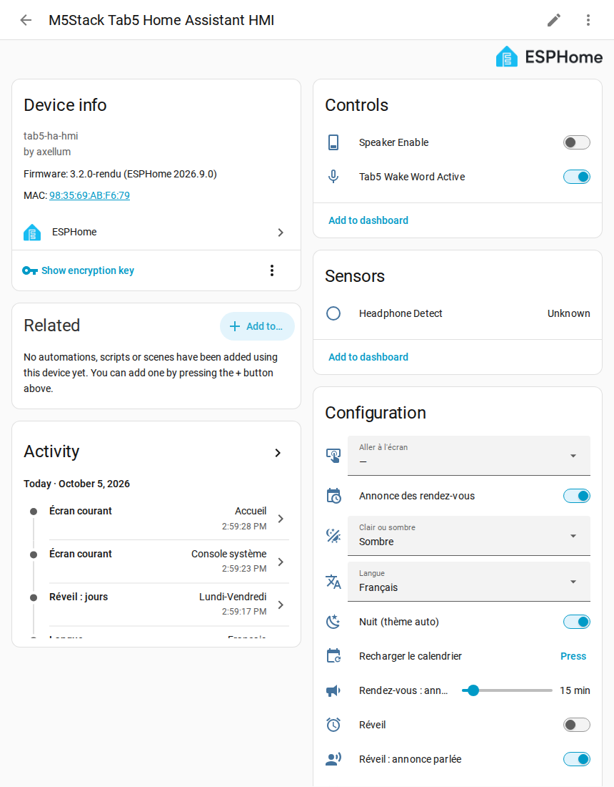
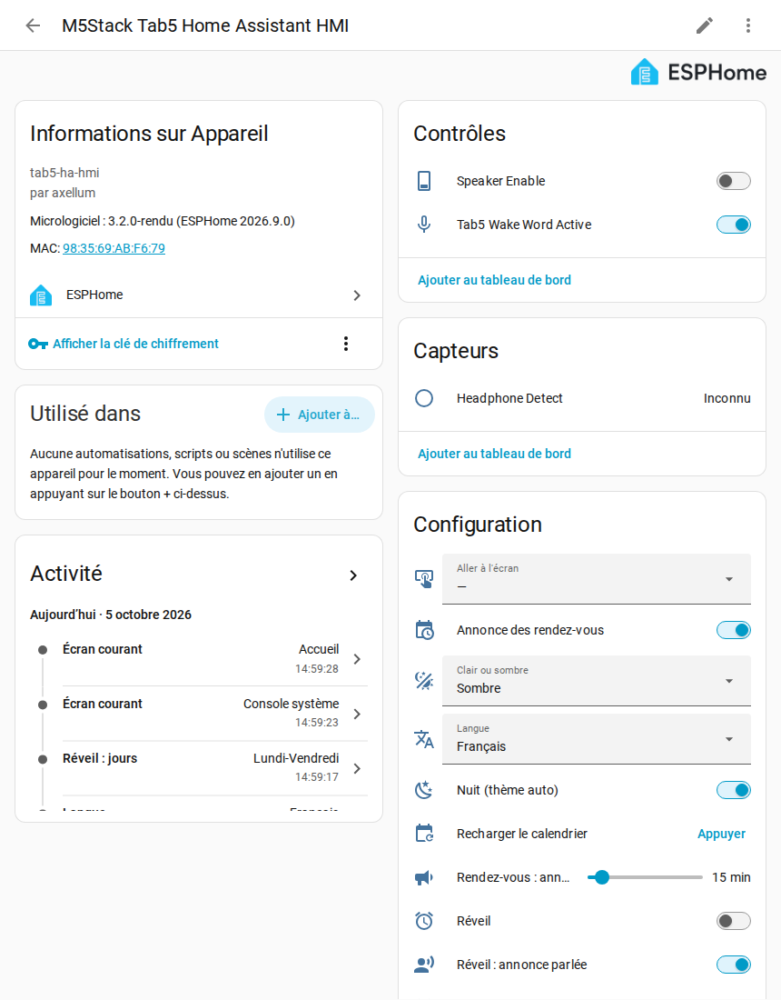

# Step 4 — Add the tablet to Home Assistant

## English · [Français](#version-française)

---

Home Assistant gives the tablet its encryption key, and keeps it: nothing to copy. It can only do so during the tablet's **pairing window, the 30 minutes after it starts**.

## Within 30 minutes of the tablet's start

1. *Settings → Devices & services*: the tablet shows up as discovered, ESPHome integration.
2. *Configure*, then *Submit*.

That is all. Home Assistant creates the key, gives it to the tablet and keeps it. A tablet Home Assistant already knows (after « Erase User Data », for instance) gets a new key by itself, nothing to confirm (checked on 2026-09-28).

**It worked if** the tablet is listed under *Settings → Devices & services → ESPHome*, and its device page shows its controls, sensors and configuration. That page is where every [tablet setting](settings.md) lives.

## If it does not work

| What you see | What to do |
|---|---|
| The 30 minutes are over | restart the tablet (a short press on its reset button, or unplug it): the window opens again for 30 minutes. Once the tablet has its key, it never opens again |
| The tablet is not discovered | *Settings → Devices & services → Add integration → ESPHome*, then type the tablet's IP address ([step 3](wifi.md#good-to-know)) and port 6053. Same result: Home Assistant gives it its key. The fresh-install test of the project adds the tablet this way |

## Nothing else to allow

The tablet never calls a Home Assistant action: it sends events, which `packages/tab5_evenements.yaml` (from step 1) turns into a fixed list of actions, for a Tab5 only ([ADR-0025](../decisions/0025-events-only.md)). The option « Allow the device to perform Home Assistant actions » stays unticked.

Only a firmware 3.1 or older still needs it ticked (*ESPHome → Configure*): voice, calendar and alarm clock use it on those versions. See [upgrading from 3.1](updates.md#upgrading-from-31).

**Next: [step 5, your sources](sources.md).**

---

## Version Française

---

Home Assistant donne sa clé de chiffrement à la tablette, et la garde : rien à recopier. Il ne peut le faire que pendant la **fenêtre d'appairage de la tablette, les 30 minutes qui suivent son démarrage**.

## Dans les 30 minutes qui suivent le démarrage

1. *Paramètres → Appareils et services* : la tablette apparaît comme découverte, intégration ESPHome.
2. *Configurer*, puis *Valider*.

C'est tout. Home Assistant crée la clé, la donne à la tablette et la garde. Une tablette que Home Assistant connaît déjà (après « Erase User Data », par exemple) reçoit une nouvelle clé toute seule, rien à confirmer (vérifié le 28/09/2026).

**C'est bon si** la tablette est listée dans *Paramètres → Appareils et services → ESPHome*, et que la page de son appareil montre ses contrôles, ses capteurs et sa configuration. C'est sur cette page que vivent tous les [réglages de la tablette](settings.md#version-française).

## Si ça ne marche pas

| Ce que vous voyez | Que faire |
|---|---|
| Les 30 minutes sont passées | redémarrez la tablette (un appui court sur son bouton reset, ou débranchez-la) : la fenêtre se rouvre pour 30 minutes. Une fois sa clé reçue, elle ne s'ouvre plus |
| La tablette n'est pas découverte | *Paramètres → Appareils et services → Ajouter une intégration → ESPHome*, puis tapez l'adresse IP de la tablette ([étape 3](wifi.md#bon-à-savoir)) et le port 6053. Même résultat : Home Assistant lui donne sa clé. Le test d'installation à neuf du projet ajoute la tablette de cette façon |

## Rien d'autre à autoriser

La tablette n'appelle jamais d'action de Home Assistant : elle envoie des événements, que `packages/tab5_evenements.yaml` (de l'étape 1) traduit en une liste fixe d'actions, pour un Tab5 seulement ([ADR-0025](../decisions/0025-events-only.md)). L'option « Autoriser l'appareil à effectuer des actions Home Assistant » reste décochée.

Seul un firmware 3.1 ou plus ancien en a encore besoin (*ESPHome → Configurer*) : la voix, le calendrier et le réveil s'en servent sur ces versions. Voir [passer d'une 3.1 à la suite](updates.md#passer-dune-31-à-la-suite).

**Ensuite : [étape 5, vos sources](sources.md#version-française).**
