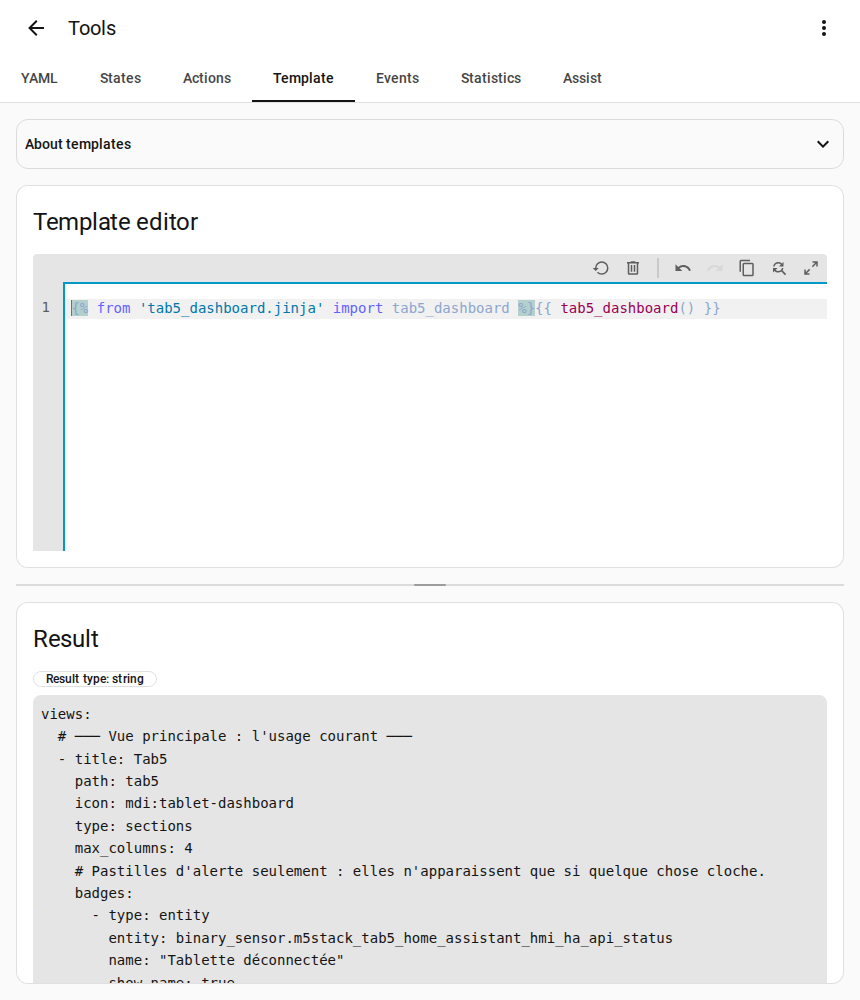
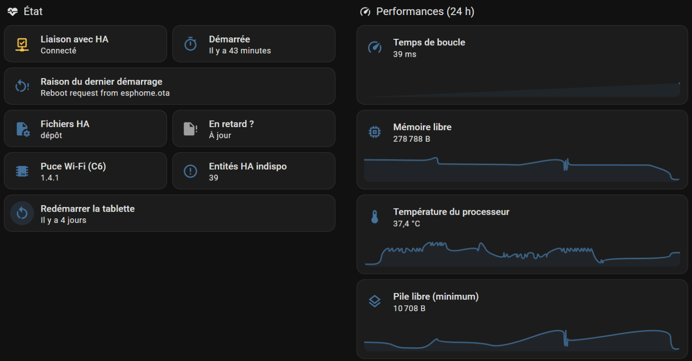
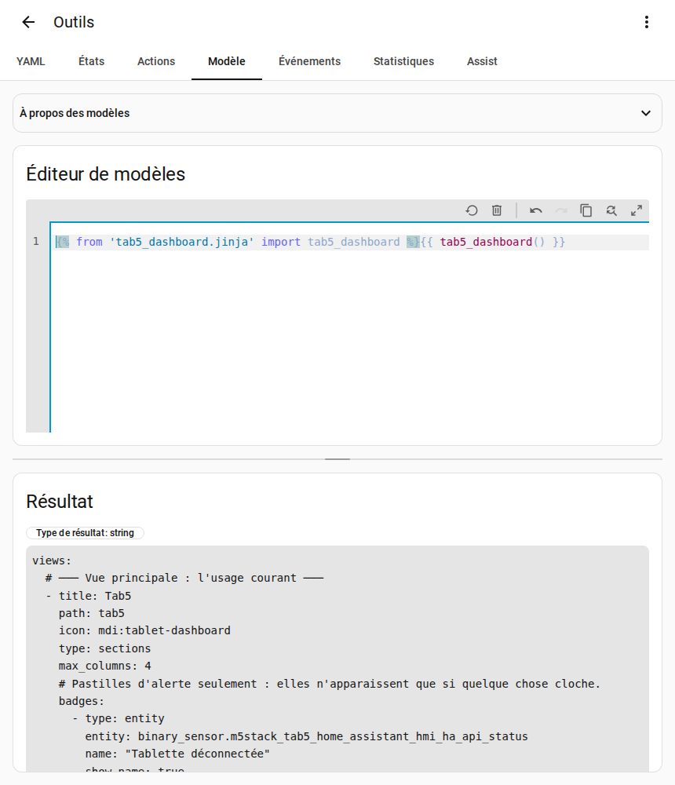

# Step 7 — A dashboard for the tablet (optional)

## English · [Français](#version-française)

---

Every setting of the tablet in one Home Assistant dashboard, written for your home by a macro that step 1 added (`custom_templates/tab5_dashboard.jinja`). The tablet's entity ids differ from one home to another (Home Assistant builds them from the room, the device name and the entity name), so the dashboard is not a fixed file: the macro writes it with your entities.

## What it shows

- A **Tab5** view for daily use: brightness, volume, screen shown, alarm clock, appointments, voice assistant; alert badges only when something is wrong.
- A **Settings** view: how to set up the tablet, with links to its device page, its ESPHome connection, the screen slots automation and this guide; an « At a glance » table of what is chosen; what each section of the screen slots shows and how to set up solar panels; then the screen language, weather, calendars, home, voice and alarm settings, each with a short explanation.
- A **Health** view: what to check when something is wrong, with links to the tablet's device page, Home Assistant's logs and repairs and the troubleshooting page; an « At a glance » table of the connection, pushes, last start, firmware, Home Assistant files and health alerts; then performance graphs, network, pushes and health alerts, each with a short explanation.


## Create it

1. *Settings → Dashboards → Add dashboard → New dashboard from scratch*, title **Tab5** (its address becomes `/dashboard-tab5`).
2. *Developer tools → Template*: replace the editor content with this line, then copy the whole *Result*.
   ```jinja
   {{ tab5_dashboard() }}
   ```
   Another address: `tab5_dashboard('dashboard-xxx')`. The labels and explanations follow the tablet's screen language (French, English, German, Dutch, Spanish, Italian or Turkish; English for any other); `tab5_dashboard(langue='English')` forces a language.

    

3. Open the Tab5 dashboard → pencil → ⋮ → *Raw configuration editor*: replace everything with the result, *Save*.



## Good to know

- A card only appears when its entity exists (TV, shutter, battery…). The battery entities are disabled by default: enable them if a battery is fitted.
- The rooms, tiles, sensors and solar panels are set in the blueprint automation of [step 6](devices.md). No template can read its choices, so the Settings view explains each section rather than showing it; the « Zones masquées » sensor says what is missing.
- Two settings stay on the tablet only: the text size of the assistant popup, and a custom choice of alarm days.
- **After an update that adds entities**, do items 2 and 3 again.
- « TemplateNotFound: tab5_dashboard.jinja »: the macro is loaded when Home Assistant starts. Restart it, or run the action `homeassistant.reload_custom_templates`.

That's it: the tablet is installed. Next: its [settings](settings.md), or [adapt it to your home](adapt-to-your-home.md).

---

## Version Française

---

Tous les réglages de la tablette dans un tableau de bord Home Assistant, écrit pour votre maison par une macro que l'étape 1 a ajoutée (`custom_templates/tab5_dashboard.jinja`). Les entity_id de la tablette changent d'une maison à l'autre (Home Assistant les forme avec la pièce, le nom de l'appareil et celui de l'entité) : le tableau de bord n'est donc pas un fichier figé, la macro l'écrit avec vos entités.

## Ce qu'il montre

- Une vue **Tab5** pour l'usage courant : luminosité, volume, écran affiché, réveil, rendez-vous, assistant vocal ; des pastilles d'alerte seulement quand quelque chose cloche.
- Une vue **Réglages** : comment régler la tablette, avec des liens vers la page de son appareil, sa connexion ESPHome, l'automatisation des emplacements et ce guide ; un tableau « En bref » de ce qui est choisi ; ce que montre chaque section des emplacements et comment régler des panneaux solaires ; puis la langue de l'écran, la météo, les agendas, la maison, la voix et le réveil, chacun avec une courte explication.
- Une vue **Santé** : que vérifier quand quelque chose cloche, avec des liens vers la page de la tablette, le journal et les réparations de Home Assistant et la page de dépannage ; un tableau « En bref » de la liaison, des poussées, du dernier démarrage, du firmware, des fichiers Home Assistant et des alertes de santé ; puis les courbes de performances, le réseau, les poussées et les alertes de santé, chacun avec une courte explication.


## Le créer

1. *Paramètres → Tableaux de bord → Ajouter un tableau de bord → Nouveau tableau de bord à partir de zéro*, titre **Tab5** (son adresse devient `/dashboard-tab5`).
2. *Outils de développement → Modèle* : remplacez le contenu de l'éditeur par cette ligne, puis copiez tout le *Résultat*.
   ```jinja
   {{ tab5_dashboard() }}
   ```
   Autre adresse : `tab5_dashboard('dashboard-xxx')`. Les libellés et les explications suivent la langue de l'écran de la tablette (français, anglais, allemand, néerlandais, espagnol, italien ou turc ; l'anglais pour une autre) ; `tab5_dashboard(langue='English')` force une langue.

    

3. Ouvrez le tableau de bord Tab5 → crayon → ⋮ → *Éditeur de configuration brute* : remplacez tout par le résultat, *Enregistrer*.


## Bon à savoir

- Une carte n'apparaît que si son entité existe (TV, volet, batterie…). Les entités de la batterie sont désactivées par défaut : activez-les si une batterie est montée.
- Les pièces, les tuiles, les capteurs et les panneaux solaires se règlent dans l'automatisation du blueprint de l'[étape 6](devices.md#version-française). Aucun modèle ne peut lire ses choix : la vue Réglages explique donc chaque section au lieu de la montrer ; le capteur « Zones masquées » dit ce qui manque.
- Deux réglages restent sur la tablette seulement : la taille du texte du popup de l'assistant, et un choix personnalisé des jours du réveil.
- **Après une mise à jour qui ajoute des entités**, refaites les points 2 et 3.
- « TemplateNotFound: tab5_dashboard.jinja » : la macro est chargée au démarrage de Home Assistant. Redémarrez-le, ou lancez l'action `homeassistant.reload_custom_templates`.

C'est fini : la tablette est installée. Ensuite : ses [réglages](settings.md#version-française), ou l'[adapter à sa maison](adapt-to-your-home.md#version-française).
