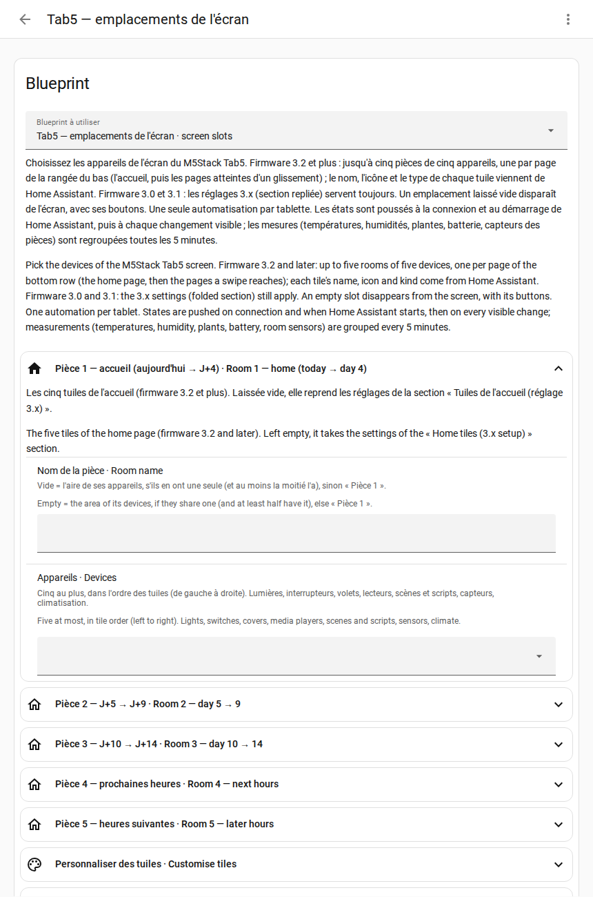

# Step 6 — Your devices

## English · [Français](#version-française)

---

Your devices — lights, shutters, climate, plants, TV, sensors — are picked in **one automation**, made from the blueprint « Tab5 — emplacements de l'écran · screen slots » that step 1 added ([ADR-0019](../decisions/0019-logical-slots-blueprint.md)). The tablet itself names no device: changing one is an edit in Home Assistant, no flash, no restart.

## Create the automation

1. *Settings → Automations & scenes → Blueprints*, « Tab5 — emplacements de l'écran · screen slots ».
   Not in the list? *Import blueprint*, with
   `https://github.com/Axellum/M5-Tab5-ESPHome-LVGL/blob/main/HomeAssistant_Config/blueprints/automation/tab5/tab5_emplacements.yaml`
2. *Create automation*.
3. Fill the sections you need (every field is optional; the labels are in French and English), then *Save*.

**One automation per tablet.** As soon as it is saved, the tablet receives your devices.

**It worked if** the tiles at the bottom of the screen show your devices. The tablet's diagnostic sensor « Zones masquées » lists what is hidden: a slot you left empty, or an entity that does not exist.

## The sections

Every section opens folded except Room 1: click its title to open it. Each field has a help sentence under it.

| Section | What you pick | More |
|---|---|---|
| Pièce 1 — accueil · Room 1 — home | a name and up to five devices: the tiles of the home page, left to right | [rooms](adapt-to-your-home.md#rooms-firmware-32-and-later) |
| Pièce 2 to 5 · Room 2 to 5 | the rooms one or two swipes away | [rooms](adapt-to-your-home.md#rooms-firmware-32-and-later) |
| Personnaliser des tuiles · Customise tiles | another name, icon or behaviour for a tile (on only, confirm, read only) | [tile icons](../tiles_icons.md) |
| TV, téléphone · TV, phone | the TV, its remote, the phone battery | [other zones](adapt-to-your-home.md#other-zones) |
| Températures · Temperatures | room temperature and humidity, a second temperature (greenhouse) and whether it is outdoors | [temperature history](adapt-to-your-home.md#temperature-history) |
| Climatisation · Climate | the climate unit of the home card | [climate, any brand](adapt-to-your-home.md#limits) |
| Tuile − / + · − / + tile | other devices for the − / + buttons of the home page (a volume, a light's brightness, a thermostat, a fan, a shutter, a number…), picked on the tablet with a tap on the room temperature; scrolling fixed (default) or automatic, and the time per device | [user manual, temperatures and climate](../notice/home.md#temperatures-and-climate-9-10) |
| Plantes · Plants | up to five moisture sensors | |
| Sous l'horloge · Under the clock | up to three lines of four sensors under the clock (temperatures, humidity, production, batteries, detectors, switches: shown, not controlled), the place of the plants line, scrolling automatic (default) or fixed, the time per line | [user manual, home screen](../notice/home.md) |
| Panneau Ok Nabu · Ok Nabu panel | up to three lines of four sensors in the « Ok Nabu » button, like the row under the clock, the place of the listening line « Ok Nabu: ON / OFF » (first by default, or hidden), scrolling fixed (default) or automatic, the time per line | [user manual, home screen](../notice/home.md#voice-domo-microphone-discu-ok-nabu-1-to-4) |
| Horloge et boutons du haut · Clock and top buttons | what a tap and a long press do on the hours, the minutes and the date of the clock, and on each of the three buttons at the top right (house, gear, gamepad), twelve gestures: Automatic, Nothing, a screen (the house window included) or an action (device mode, next device of the − / + tile, next line under the clock, next line of the Ok Nabu panel, wake word on / off) | [user manual, home screen](../notice/home.md#the-three-buttons-top-right-6-to-8) |
| Planning de travail · Work schedule | empty: the calendar of the « Tab5 · agenda de travail » list ([step 5](sources.md)) | |
| Météo · Weather | empty: the weather lists of [step 5](sources.md). Filled, it writes its choice into them and wins over them; with several tablets, fill it in one automation only | [weather providers](weather.md) |
| Énergie : solaire · Energy: solar | solar power and solar energy produced (a main sensor, then the other inverters if you have several), the panels' peak power | [solar energy](adapt-to-your-home.md#solar-energy-optional) |
| Énergie : réseau et maison · Energy: grid and home | grid power (bought or sold), home consumption | [solar energy](adapt-to-your-home.md#solar-energy-optional) |
| Énergie : batterie · Energy: battery | level, power and temperature of a home battery | [solar energy](adapt-to-your-home.md#solar-energy-optional) |
| Ancien accueil (si la pièce 1 est vide) · Former home page (if room 1 is empty) | the five fixed places of the first versions (PC or TV, shutter, three lights): shown while room 1 is empty, and by a firmware too old for rooms | [rooms](adapt-to-your-home.md#rooms-firmware-32-and-later) |
| Avancé · Advanced | the tablet's name in ESPHome: change it only if you renamed the device | |

**What you don't have disappears**, with its buttons: leave its slot empty ([other zones](adapt-to-your-home.md#other-zones)).

How to use the tiles on the screen (tap, long press, swipe): [user manual, bottom row](../notice/tiles.md).

**Next (optional): [step 7, a dashboard](dashboard.md).**

---

## Version Française

---

Vos appareils — lumières, volets, clim, plantes, TV, capteurs — se choisissent dans **une automatisation**, créée depuis le blueprint « Tab5 — emplacements de l'écran · screen slots » que l'étape 1 a ajouté ([ADR-0019](../decisions/0019-logical-slots-blueprint.md)). La tablette ne nomme aucun appareil : en changer se fait dans Home Assistant, ni flash ni redémarrage.

## Créer l'automatisation

1. *Paramètres → Automatisations et scènes → Blueprints*, « Tab5 — emplacements de l'écran · screen slots ».
   Absent de la liste ? *Importer un blueprint*, avec
   `https://github.com/Axellum/M5-Tab5-ESPHome-LVGL/blob/main/HomeAssistant_Config/blueprints/automation/tab5/tab5_emplacements.yaml`
2. *Créer une automatisation*.
3. Remplissez les sections utiles (tous les champs sont facultatifs ; les libellés sont en français et en anglais), puis *Enregistrer*.

**Une automatisation par tablette.** Dès qu'elle est enregistrée, la tablette reçoit vos appareils.

**C'est bon si** les tuiles du bas de l'écran montrent vos appareils. Le capteur de diagnostic « Zones masquées » de la tablette liste ce qui est masqué : un emplacement laissé vide, ou une entité qui n'existe pas.

## Les sections

Toutes les sections s'ouvrent repliées, sauf la pièce 1 : cliquez sur un titre pour l'ouvrir. Chaque champ a une phrase d'aide dessous.

| Section | Ce que vous choisissez | Plus |
|---|---|---|
| Pièce 1 — accueil · Room 1 — home | un nom et jusqu'à cinq appareils : les tuiles de l'accueil, de gauche à droite | [pièces](adapt-to-your-home.md#pièces-firmware-32-et-plus) |
| Pièce 2 à 5 · Room 2 to 5 | les pièces à un ou deux glissements | [pièces](adapt-to-your-home.md#pièces-firmware-32-et-plus) |
| Personnaliser des tuiles · Customise tiles | un autre nom, une autre icône ou un comportement pour une tuile (allumer seulement, confirmer, lecture seule) | [icônes des tuiles](../tiles_icons.md#version-française) |
| TV, téléphone · TV, phone | la TV, sa télécommande, la batterie du téléphone | [autres zones](adapt-to-your-home.md#autres-zones) |
| Températures · Temperatures | température et humidité de la pièce, une seconde température (serre) et si elle est dehors | [historique des températures](adapt-to-your-home.md#historique-des-températures) |
| Climatisation · Climate | la clim de la carte de l'accueil | [clim, toutes marques](adapt-to-your-home.md#limites) |
| Tuile − / + · − / + tile | d'autres appareils pour les boutons − / + de l'accueil (un volume, la luminosité d'une lampe, un thermostat, un ventilateur, un volet, un nombre…), choisis sur la tablette d'un tap sur la température de la pièce ; défilement fixe (d'origine) ou automatique, et la durée d'un appareil | [notice, températures et clim](../notice/home.md#températures-et-clim-9-10) |
| Plantes · Plants | jusqu'à cinq capteurs d'humidité | |
| Sous l'horloge · Under the clock | jusqu'à trois lignes de quatre capteurs sous l'horloge (températures, humidités, production, batteries, détecteurs, interrupteurs : montrés, pas commandés), la place de la ligne des plantes, le défilement automatique (d'origine) ou fixe, la durée d'une ligne | [notice, écran d'accueil](../notice/home.md#version-française) |
| Panneau Ok Nabu · Ok Nabu panel | jusqu'à trois lignes de quatre capteurs dans le bouton « Ok Nabu », comme la rangée sous l'horloge, la place de la ligne d'écoute « Ok Nabu : ON / OFF » (première d'origine, ou masquée), le défilement fixe (d'origine) ou automatique, la durée d'une ligne | [notice, écran d'accueil](../notice/home.md#voix--domo-micro-discu-ok-nabu-1-à-4) |
| Horloge et boutons du haut · Clock and top buttons | ce que font un tap et un appui long sur les heures, les minutes et la date de l'horloge, et sur chacun des trois boutons en haut à droite (maison, engrenage, manette), douze gestes : Automatique, Rien, un écran (la fenêtre Maison comprise) ou une action (mode appareils, appareil suivant de la tuile − / +, ligne suivante sous l'horloge, ligne suivante du panneau Ok Nabu, mot de réveil activé / coupé) | [notice, écran d'accueil](../notice/home.md#les-trois-boutons-en-haut-à-droite-6-à-8) |
| Planning de travail · Work schedule | vide : l'agenda de la liste « Tab5 · agenda de travail » ([étape 5](sources.md#version-française)) | |
| Météo · Weather | vide : les listes météo de l'[étape 5](sources.md#version-française). Remplie, elle écrit son choix dans ces listes et prime sur elles ; avec plusieurs tablettes, remplissez-la dans une seule automatisation | [fournisseurs météo](weather.md#version-française) |
| Énergie : solaire · Energy: solar | puissance et énergie solaires produites (un capteur principal, puis les autres onduleurs s'il y en a plusieurs), la puissance crête des panneaux | [énergie solaire](adapt-to-your-home.md#énergie-solaire-facultatif) |
| Énergie : réseau et maison · Energy: grid and home | puissance du réseau (achat ou vente), consommation de la maison | [énergie solaire](adapt-to-your-home.md#énergie-solaire-facultatif) |
| Énergie : batterie · Energy: battery | niveau, puissance et température d'une batterie domestique | [énergie solaire](adapt-to-your-home.md#énergie-solaire-facultatif) |
| Ancien accueil (si la pièce 1 est vide) · Former home page (if room 1 is empty) | les cinq places fixes des premières versions (PC ou TV, volet, trois lumières) : montrées tant que la pièce 1 est vide, et par un firmware trop ancien pour les pièces | [pièces](adapt-to-your-home.md#pièces-firmware-32-et-plus) |
| Avancé · Advanced | le nom de la tablette dans ESPHome : ne le changez que si vous avez renommé l'appareil | |

**Ce que vous n'avez pas disparaît**, avec ses boutons : laissez son emplacement vide ([autres zones](adapt-to-your-home.md#autres-zones)).

Se servir des tuiles à l'écran (appui, appui long, glissement) : [notice, rangée du bas](../notice/tiles.md#version-française).

**Ensuite (facultatif) : [étape 7, un tableau de bord](dashboard.md#version-française).**
