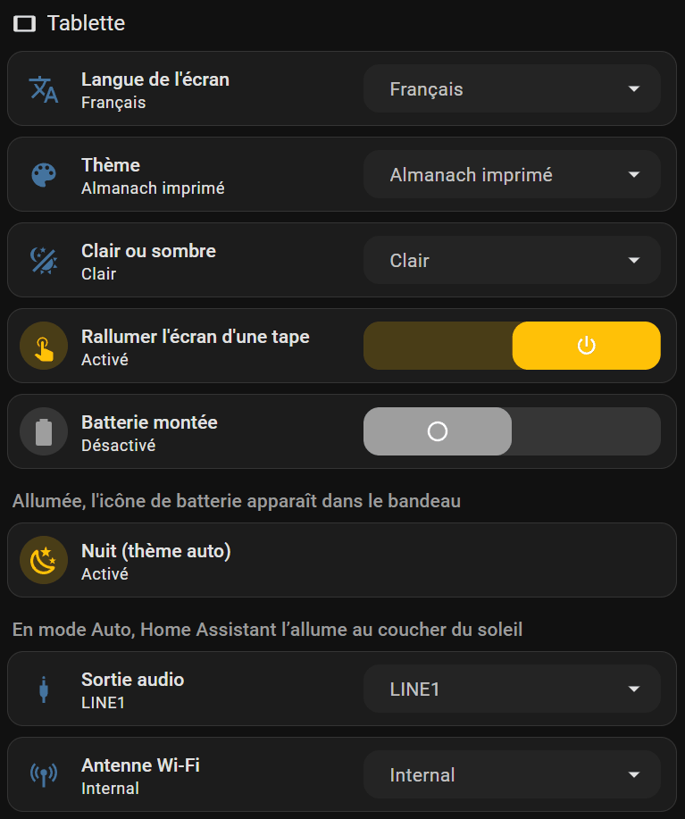
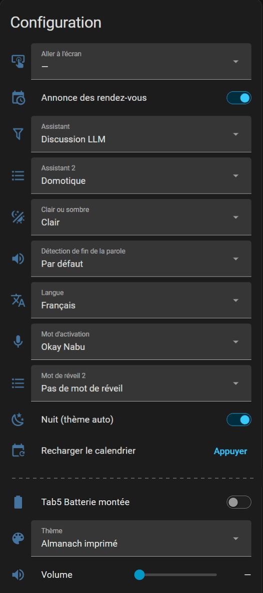
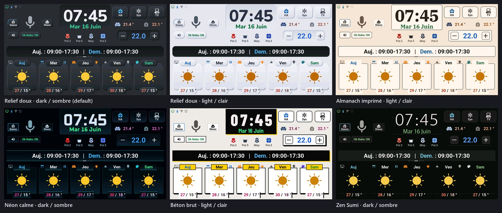

# Tablet settings and options

## English · [Français](#version-française)

---

Every setting of the tablet is an entity of its device in Home Assistant, and the tablet keeps it across restarts. Three places show them, all equivalent:

- the **Settings** view of the [tablet's dashboard](dashboard.md), left below: its « Tablette » column;
- the device page, right below: *Settings → Devices & services → ESPHome →* your tablet, cards **Controls** and **Configuration**;
- for the theme, the tablet itself: the system console (« Sys » button) has a row with the current theme and mode, and a tap moves to the next one.

 

## Theme, light or dark

| Entity | Values | What it does |
|---|---|---|
| Thème | 21 themes, from « Ardoise » to « Ultraviolet »; a new tablet starts in « Relief doux » | colours, shapes (radius, borders, shadows) and the fonts of the clock, the date and the titles. The screen repaints at once, without a restart; the games keep their own dark colours |
| Clair ou sombre | Sombre, Clair, Auto | the mode of the theme. **Auto**: light by day, dark at night, following « Nuit (thème auto) » |
| Nuit (thème auto) | on / off | read only in Auto mode. The automation « Tab5 — thème jour/nuit » (`packages/tab5_push.yaml`) turns it on when the sun sets and off when it rises (`sun.sun`, so the location of Home Assistant). To decide yourself (a light sensor, bedtime…), turn that automation off and switch it from your own. Without Home Assistant, Auto keeps the last state received |

The theme names stay as they are in every language: they are names. Six of them:

## Screen, sound and network

| Entity (name on the dashboard) | Values | What it does |
|---|---|---|
| Langue (Langue de l'écran) | Français, English, Deutsch, Nederlands, Español, Italiano, Türkçe | screen, games, dates and the spoken alarm briefing. **The tablet restarts** to apply it. The names and states Home Assistant sees stay in French |
| Display Backlight (Luminosité) | on / off, brightness | the screen backlight |
| Tab5 Extinction auto de l'écran (Extinction auto de l'écran) | Jamais, 1 min, 2 min, 5 min, 10 min, 30 min; Jamais (never) by default | turns the screen off after that long without a touch, the way Home Assistant turns it off; a touch, a tap (Tap-to-Wake), Home Assistant or the alarm clock turn it back on. Never while the alarm rings, while the voice assistant listens or answers, while a game is open or during an update |
| Tab5 Tap-to-Wake (Rallumer l'écran d'une tape) | on / off, on by default | a tap on the tablet lights the screen up again when it is off |
| Tab5 Rallumer l'écran à Okay Nabu (Rallumer l'écran à Okay Nabu) | on / off, on by default | « Okay Nabu » lights the screen up again when it is off, as the assistant starts listening (not « Stop »). Off, the screen stays dark and the answer is only spoken |
| Volume | 0 to 100 % | speaker volume; also in the console and the assistant popup |
| Speaker Enable (Haut-parleur) | on / off | turns the speaker on or off (a line of the IO expander) |
| Tab5 DAC Output (Sortie audio) | LINE1, LINE2, BOTH | output of the ES8388 audio chip; the author's tablet uses LINE1 |
| WiFi Antenna (Antenne Wi-Fi) | Internal, External | the internal antenna, or one on the external connector |
| Tab5 Batterie montée (Batterie montée) | on / off, off by default | shows the battery icon in the status strip: a plug while « Tab5 Batterie détectée » says no battery (a reading below 6 V in the last 10 minutes; the charger says « charging » even without one), else the battery's level |
| Tab5 Appareils sur la météo (Appareils sur la météo) | on / off, on by default | shows the rooms' devices on the forecast cards (icons and touch actions). Off, the forecast cards show the weather only; the « HA » button still shows the rooms and their devices |
| Aller à l'écran (Afficher) | —, Accueil, Assistant vocal, Calendrier, Réveil, Climatisation, Plantes, Télécommande TV, Console système, Énergie | opens that screen or popup, from the dashboard or an automation, then goes back to « — ». A game in progress is closed first |
| Recharger le calendrier | button | asks Home Assistant again for this month and the next, when a new appointment is not on screen yet |

## Alarm clock, appointments, voice

- **Alarm clock**: « Réveil » (armed or not), « Réveil : mode » (Heure fixe, Jours travaillés, Avant l'ouverture), the fixed time and its days, « jamais avant » / « jamais après », lead before the shift, minimum rest, snooze, maximum duration, ring tone, its own volume, fade-in and the spoken briefing. How the three modes compute the time: [alarm clock](../screens.md#alarm-clock--short-tap-on-the-clock).
- **Appointments**: « Annonce des rendez-vous » and « Rendez-vous : annoncer avant » (minutes): the tablet announces a timed appointment of « Tab5 · agenda des rendez-vous » that long before it; it counts down by itself, so a Home Assistant outage in between misses nothing.
- **Voice**: « Mot d'activation », « Assistant », « Assistant 2 », « Mot de réveil 2 » and « Détection de fin de la parole » are the Assist satellite settings Home Assistant adds to the device. The Domo / Discu modes of the screen: [below](#voice-assistant-the-two-modes).

Two settings stay on the tablet only: the text size of the assistant popup and a custom choice of alarm days. What applies to the whole home (sources, calendars, phone, presence: the « Tab5 · » lists of [step 5](sources.md)) and the rooms and tiles (the blueprint automation) are set in Home Assistant; the Settings view groups them too.

## Voice assistant: the two modes

Two buttons choose who answers when you speak: **Domo** (Home Assistant icon) and **Discu** (robot icon), on the home page and in the assistant popup (long press on the microphone). Each one uses a voice assistant of Home Assistant: speech-to-text, a conversation agent, text-to-speech. In Discu mode, each request opens the assistant popup with the answer; in Domo mode, a short command does not open it.

In Home Assistant:

1. *Settings → Voice assistants*. The assistant set as **preferred** is the one of **Domo**. To control the home, its conversation agent is « Home Assistant ».
2. For **Discu**, add a second assistant whose conversation agent is a language model: an online service, a local Ollama, or any other conversation integration.
3. Pick that assistant in the list « Tab5 · pipeline de discussion » (Settings view of the [dashboard](dashboard.md), or the entity itself). The list shows your assistants once the tablet is added. While it stays on « Aucun », the Domo and Discu buttons are hidden (by the screen slots automation of [step 6](devices.md)) and the tablet stays in Domo.

The « Assistant » list of the tablet's device page follows these buttons: each tap, and each start of the tablet, sets it back to the preferred assistant (Domo) or to the Discu one. Do not set it by hand: change the preferred assistant, or the « Tab5 · pipeline de discussion » list.

**The author's Discu** goes through his own engine, [vromvrom-engine](https://github.com/Axellum/vromvrom-engine), for three reasons:
- a fast home shortcut: short home commands are recognised and run directly, without going through an LLM;
- an LLM with dedicated agents depending on the request (specialists);
- replacing the chosen LLM when it is unavailable, or for a smarter one for instance, local or in the cloud.

This engine is still a rough draft, which the author manages only through AI: it is not a prerequisite, nor something he can recommend. Any Home Assistant conversation agent will do.

**All local:** [Ollama](https://www.home-assistant.io/integrations/ollama/) is an official integration that works as a conversation agent; controlling the home with it is marked experimental. For speech, Home Assistant's [local voice guide](https://www.home-assistant.io/voice_control/voice_remote_local_assistant/) uses Whisper (free sentences, slow on a small machine) or Speech-to-Phrase (fast, home commands only) to understand, and Piper to speak; Home Assistant finds these add-ons through Wyoming. A server that speaks the OpenAI API (LM Studio…): the official OpenAI Conversation integration cannot change its address; the HACS integration [Home LLM](https://github.com/acon96/home-llm) can.

**Wake word:** « Okay Nabu » is recognised by the tablet itself, nothing goes to Home Assistant before it; the « Ok Nabu » button turns it on or off. « Assistant 2 » and « Mot de réveil 2 » are a second wake word and its assistant, added by Home Assistant: the Domo / Discu buttons leave them alone, and the firmware offers Home Assistant only one wake word (« Stop », for the alarm clock and the shutter, stays inside the tablet).

---

## Version Française

---

Chaque réglage de la tablette est une entité de son appareil dans Home Assistant, et la tablette le garde d'un démarrage à l'autre. Trois endroits les montrent, au choix :

- la vue **Réglages** du [tableau de bord de la tablette](dashboard.md#version-française), à gauche ci-dessous : sa colonne « Tablette » ;
- la page de l'appareil, à droite ci-dessous : *Paramètres → Appareils et services → ESPHome →* votre tablette, cartes **Contrôles** et **Configuration** ;
- pour le thème, la tablette elle-même : la console système (bouton « Sys ») a une rangée avec le thème et le mode en cours, un appui passe au suivant.

 

## Thème, clair ou sombre

| Entité | Valeurs | Ce qu'elle fait |
|---|---|---|
| Thème | 21 thèmes, d'« Ardoise » à « Ultraviolet » ; une tablette neuve démarre en « Relief doux » | couleurs, formes (rayons, bordures, ombres) et polices de l'heure, de la date et des titres. L'écran se repeint aussitôt, sans redémarrer ; les jeux gardent leurs couleurs sombres |
| Clair ou sombre | Sombre, Clair, Auto | le mode du thème. **Auto** : clair le jour, sombre la nuit, d'après « Nuit (thème auto) » |
| Nuit (thème auto) | allumé / éteint | lu seulement en mode Auto. L'automatisation « Tab5 — thème jour/nuit » (`packages/tab5_push.yaml`) l'allume au coucher du soleil et l'éteint à son lever (`sun.sun`, donc le lieu de Home Assistant). Pour décider vous-même (capteur de luminosité, heure du coucher…), coupez cette automatisation et pilotez l'interrupteur depuis la vôtre. Sans Home Assistant, Auto garde le dernier état reçu |

Les noms des thèmes restent les mêmes dans toutes les langues : ce sont des noms. Six d'entre eux :

## Écran, son et réseau

| Entité (nom sur le tableau de bord) | Valeurs | Ce qu'elle fait |
|---|---|---|
| Langue (Langue de l'écran) | Français, English, Deutsch, Nederlands, Español, Italiano, Türkçe | écran, jeux, dates et briefing parlé du réveil. **La tablette redémarre** pour l'appliquer. Les noms et états que voit Home Assistant restent en français |
| Display Backlight (Luminosité) | allumé / éteint, luminosité | le rétroéclairage de l'écran |
| Tab5 Extinction auto de l'écran (Extinction auto de l'écran) | Jamais, 1 min, 2 min, 5 min, 10 min, 30 min ; Jamais par défaut | éteint l'écran après ce délai sans toucher, comme quand Home Assistant l'éteint ; un toucher, une tape (Tap-to-Wake), Home Assistant ou le réveil le rallument. Jamais pendant que le réveil sonne, que l'assistant vocal écoute ou répond, qu'un jeu est ouvert ou pendant une mise à jour |
| Tab5 Tap-to-Wake (Rallumer l'écran d'une tape) | allumé / éteint, allumé par défaut | une tape sur la tablette rallume l'écran éteint |
| Tab5 Rallumer l'écran à Okay Nabu (Rallumer l'écran à Okay Nabu) | allumé / éteint, allumé par défaut | « Okay Nabu » rallume l'écran éteint, quand l'assistant se met à écouter (pas « Stop »). Éteint, l'écran reste noir et la réponse est seulement parlée |
| Volume | 0 à 100 % | volume du haut-parleur ; aussi dans la console et le popup de l'assistant |
| Speaker Enable (Haut-parleur) | allumé / éteint | allume ou coupe le haut-parleur (une ligne de l'expandeur d'E/S) |
| Tab5 DAC Output (Sortie audio) | LINE1, LINE2, BOTH | sortie de la puce audio ES8388 ; la tablette de l'auteur est sur LINE1 |
| WiFi Antenna (Antenne Wi-Fi) | Internal, External | l'antenne interne, ou une antenne sur le connecteur externe |
| Tab5 Batterie montée (Batterie montée) | allumé / éteint, éteint par défaut | montre l'icône de batterie dans le bandeau d'état : une prise tant que « Tab5 Batterie détectée » dit qu'il n'y a pas de batterie (une lecture sous 6 V dans les 10 dernières minutes ; le chargeur dit « en charge » même sans batterie), sinon le niveau de la batterie |
| Tab5 Appareils sur la météo (Appareils sur la météo) | allumé / éteint, allumé par défaut | montre les appareils des pièces sur les cartes de prévisions (icônes et appuis). Éteint, les cartes de prévisions montrent la météo seule ; le bouton « HA » montre toujours les pièces et leurs appareils |
| Aller à l'écran (Afficher) | —, Accueil, Assistant vocal, Calendrier, Réveil, Climatisation, Plantes, Télécommande TV, Console système, Énergie | ouvre cet écran ou ce popup, depuis le tableau de bord ou une automatisation, puis revient à « — ». Un jeu en cours est d'abord fermé |
| Recharger le calendrier | bouton | redemande à Home Assistant le mois en cours et le suivant, quand un nouveau rendez-vous n'est pas encore à l'écran |

## Réveil, rendez-vous, voix

- **Réveil** : « Réveil » (armé ou non), « Réveil : mode » (Heure fixe, Jours travaillés, Avant l'ouverture), l'heure fixe et ses jours, « jamais avant » / « jamais après », l'avance sur le poste, le repos minimum, la répétition, la durée maximale, la sonnerie, son volume propre, la montée progressive et le briefing parlé. Comment les trois modes calculent l'heure : [réveil](../screens.md#réveil--tap-court-sur-lhorloge).
- **Rendez-vous** : « Annonce des rendez-vous » et « Rendez-vous : annoncer avant » (minutes) : la tablette annonce un rendez-vous à heure fixe de « Tab5 · agenda des rendez-vous » ce temps avant ; elle décompte elle-même, une coupure de Home Assistant entre-temps ne fait rien manquer.
- **Voix** : « Mot d'activation », « Assistant », « Assistant 2 », « Mot de réveil 2 » et « Détection de fin de la parole » sont les réglages de satellite Assist que Home Assistant ajoute à l'appareil. Les modes Domo / Discu de l'écran : [plus bas](#assistant-vocal--les-deux-modes).

Deux réglages restent sur la tablette seulement : la taille du texte du popup de l'assistant et un choix personnalisé des jours du réveil. Ce qui vaut pour toute la maison (sources, agendas, téléphone, présence : les listes « Tab5 · » de l'[étape 5](sources.md#version-française)) et les pièces et tuiles (l'automatisation du blueprint) se règlent dans Home Assistant ; la vue Réglages les regroupe aussi.

## Assistant vocal : les deux modes

Deux boutons choisissent qui répond quand vous parlez : **Domo** (icône Home Assistant) et **Discu** (icône robot), sur l'accueil et dans le popup assistant (appui long sur le micro). Chacun utilise un assistant vocal de Home Assistant : reconnaissance de la parole, agent de conversation, synthèse vocale. En mode Discu, chaque demande ouvre le popup assistant avec la réponse ; en mode Domo, une commande courte ne l'ouvre pas.

Dans Home Assistant :

1. *Paramètres → Assistants vocaux*. L'assistant marqué **préféré** est celui de **Domo**. Pour commander la maison, son agent de conversation est « Home Assistant ».
2. Pour **Discu**, ajoutez un second assistant dont l'agent de conversation est un modèle de langage : un service en ligne, un Ollama local, ou toute autre intégration de conversation.
3. Choisissez cet assistant dans la liste « Tab5 · pipeline de discussion » (vue Réglages du [tableau de bord](dashboard.md#version-française), ou l'entité elle-même). La liste montre vos assistants une fois la tablette ajoutée. Si elle reste sur « Aucun », les boutons Domo et Discu sont masqués (par l'automatisation des emplacements de l'[étape 6](devices.md#version-française)) et la tablette reste en Domo.

La liste « Assistant » de la page de l'appareil suit ces boutons : chaque appui, et chaque démarrage de la tablette, la remet sur l'assistant préféré (Domo) ou sur celui de Discu. Ne la réglez pas à la main : changez l'assistant préféré, ou la liste « Tab5 · pipeline de discussion ».

**Le Discu de l'auteur** passe par son propre moteur, [vromvrom-engine](https://github.com/Axellum/vromvrom-engine), pour trois raisons :
- un raccourci domotique rapide : les commandes courtes de la maison sont reconnues et exécutées directement, sans passer par un LLM ;
- un LLM avec des agents dédiés selon la demande (spécialistes) ;
- le remplacement du LLM choisi s'il n'est pas disponible, ou par exemple pour une meilleure intelligence, en local ou dans le cloud.

Ce moteur reste un gros brouillon, que l'auteur gère uniquement par l'IA : ce n'est pas un prérequis, ni quelque chose qu'il peut conseiller. N'importe quel agent de conversation de Home Assistant convient.

**Tout en local :** [Ollama](https://www.home-assistant.io/integrations/ollama/) est une intégration officielle qui sert d'agent de conversation ; y commander la maison est marqué expérimental. Pour la voix, le [guide de la voix en local](https://www.home-assistant.io/voice_control/voice_remote_local_assistant/) de Home Assistant utilise Whisper (phrases libres, lent sur une petite machine) ou Speech-to-Phrase (rapide, commandes de la maison seulement) pour comprendre, et Piper pour parler ; Home Assistant trouve ces add-ons par Wyoming. Un serveur qui parle l'API d'OpenAI (LM Studio…) : l'intégration officielle OpenAI Conversation ne permet pas de changer son adresse ; l'intégration HACS [Home LLM](https://github.com/acon96/home-llm) le permet.

**Mot d'activation :** « Okay Nabu » est reconnu par la tablette elle-même, rien ne part vers Home Assistant avant ; le bouton « Ok Nabu » l'allume ou l'éteint. « Assistant 2 » et « Mot de réveil 2 » sont un second mot d'activation et son assistant, ajoutés par Home Assistant : les boutons Domo / Discu n'y touchent pas, et le firmware ne propose à Home Assistant qu'un seul mot (« Stop », pour le réveil et le volet, reste dans la tablette).
