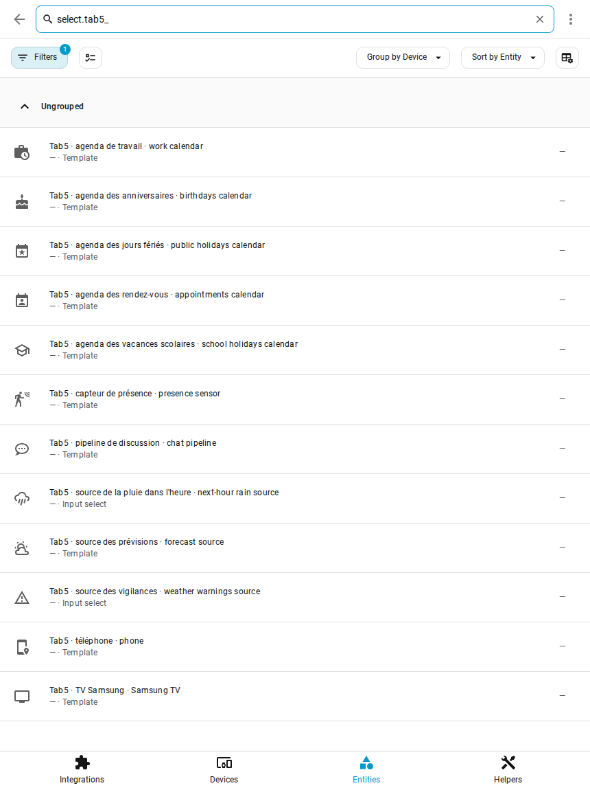
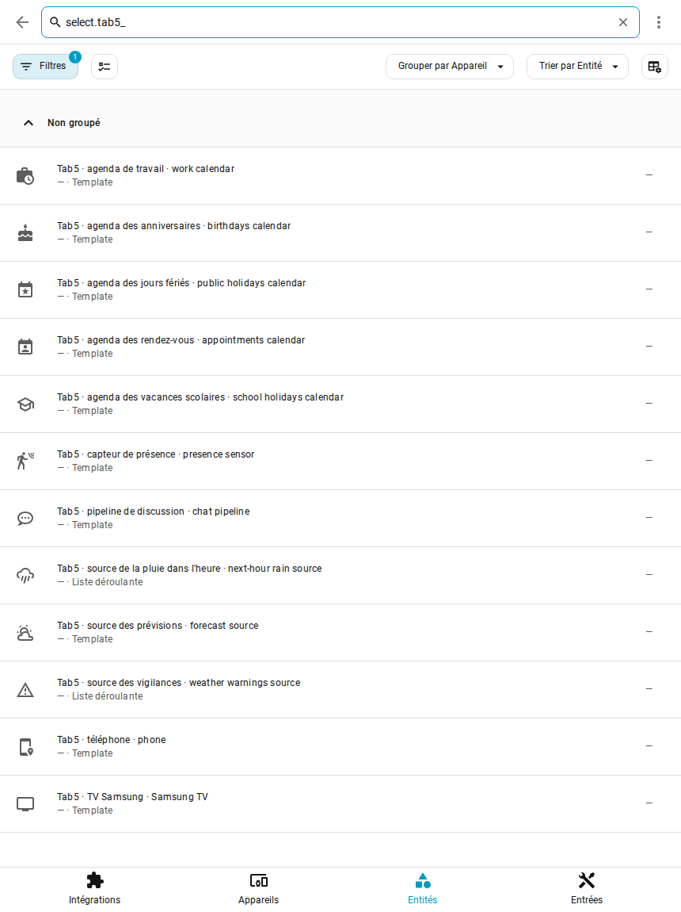

# Step 5 — Your sources

## English · [Français](#version-française)

---

What applies to the whole home — weather, calendars, phone, presence, TV, voice — is picked in Home Assistant, in the « Tab5 · » lists that step 1 added. No YAML: each list offers what your Home Assistant has ([ADR-0024](../decisions/0024-packages-without-placeholders.md)).

## Open the lists

*Settings → Devices & services → Entities*, search **select.tab5_** for the lists alone (**« Tab5 · »** also shows the texts and sensors of the packages), open a list and choose.

Each list has a two-language name, « français · english » (« Tab5 · agenda de travail · work calendar »), and keeps its entity id. **Left on « Aucun » (none), a feature simply stays off**, without errors: set only what you have.

## What each list drives

| List | What it drives | Chosen by default |
|---|---|---|
| Tab5 · source des prévisions | forecasts and current weather (any `weather.*`) | the Météo-France city, otherwise the first weather entity |
| Tab5 · source de la pluie dans l'heure | rain card: Météo-France, OpenWeatherMap, Buienradar, DWD, Met.no, Open-Meteo or Aucune (none) | Météo-France; without the Météo-France integration, Open-Meteo is used |
| Tab5 · source des vigilances | warning icons: Météo-France, MeteoAlarm, DWD, CAP Alerts or Aucune | Météo-France; without the Météo-France integration, no icons (as Aucune) |
| Tab5 · agenda de travail | work events: planning, rest days and the **alarm time** (which events: [see below](#which-events-are-work)) | nothing |
| Tab5 · agenda des rendez-vous | calendar popup, appointment reminders, morning briefing | nothing |
| Tab5 · agenda des anniversaires | birthdays in the calendar popup | the only calendar named « anniversaires » (or birthday…) |
| Tab5 · agenda des jours fériés | public holidays in the calendar popup | the only public-holiday calendar (Holiday integration, or its name says so) |
| Tab5 · agenda des vacances scolaires | school holidays in the calendar popup (every event of this calendar) | the only calendar whose name says so (« calendrier scolaire », « vacances scolaires », school…) |
| Tab5 · téléphone | screen on when you come home, off when you leave | the only phone of the companion app |
| Tab5 · capteur de présence | screen on at presence, off after 15 min without | nothing |
| Tab5 · TV Samsung, Tab5 · adresse de la TV | app buttons of the TV popup (Samsung Tizen) | the only Samsung Smart TV; the address given by a router tracker when it reports one, otherwise type its IP |
| Tab5 · pipeline de discussion | the voice assistant of the screen's « Discu » mode ([the two modes](settings.md#voice-assistant-the-two-modes)) | nothing: the Domo / Discu buttons are then hidden |
| Tab5 · alertes : mises à jour, vigilance à partir de, capteurs « problème », entités indisponibles, étiquette « Tab5 · alerte », piles sous | what shows as an alert on the central card, until you tap it; to follow a door, a leak or a lock, create the « Tab5 · alerte » label in Home Assistant and put it on the entity | everything (updates: all; warnings: from yellow; batteries: below 20 %, phones of the mobile app left out) |

Outside France, or for another rain or warning source: [weather providers](weather.md). The weather sources can also be set in the blueprint of step 6 (its « Météo · Weather » section): filled, it writes its choice into these lists and wins over them.

The weather providers' own entities (Météo-France rain and warning sensors, OpenWeatherMap, MeteoAlarm, DWD, CAP Alerts) and the tablet's entities (screen, alarm, microphone…) are found by themselves: the tablet by its device model, whatever you named it.

## Which events are work

The text « Tab5 · mot des événements de travail · work event keyword » holds the words that make an event of the work calendar a work shift: comma-separated, in any case, looked for in the title. **Empty = every event of the work calendar**, for a calendar that holds only your shifts. The author's work calendar also holds his appointments: he types `Travail`.

## School holidays

Any calendar of yours. In France, the ministry publishes one ICS file per zone: *Settings → Devices & services → Add integration → Remote Calendar*, name « Calendrier scolaire » (the list then picks it by itself), URL `https://fr.ftp.opendatasoft.com/openscol/fr-en-calendrier-scolaire/Zone-A.ics` (`Zone-B.ics`, `Zone-C.ics` for the other zones; checked on 2026-09-29, until summer 2028).

**Next: [step 6, your devices](devices.md).**

---

## Version Française

---

Ce qui vaut pour toute la maison — météo, agendas, téléphone, présence, TV, voix — se choisit dans Home Assistant, dans les listes « Tab5 · » que l'étape 1 a ajoutées. Pas de YAML : chaque liste propose ce que votre Home Assistant possède ([ADR-0024](../decisions/0024-packages-without-placeholders.md)).

## Ouvrir les listes

*Paramètres → Appareils et services → Entités*, cherchez **select.tab5_** pour les listes seules (**« Tab5 · »** montre aussi les textes et les capteurs des packages), ouvrez une liste et choisissez.

Chaque liste porte un nom en deux langues, « français · english » (« Tab5 · agenda de travail · work calendar »), et garde son identifiant d'entité. **Laissée sur « Aucun », une fonction reste simplement éteinte**, sans erreur : réglez seulement ce que vous avez.

## Ce que règle chaque liste

| Liste | Ce qu'elle règle | Choix par défaut |
|---|---|---|
| Tab5 · source des prévisions | prévisions et météo du moment (n'importe quelle entité `weather.*`) | la ville Météo-France, sinon la première entité météo |
| Tab5 · source de la pluie dans l'heure | carte pluie : Météo-France, OpenWeatherMap, Buienradar, DWD, Met.no, Open-Meteo ou Aucune | Météo-France ; sans l'intégration Météo-France, Open-Meteo prend le relais |
| Tab5 · source des vigilances | icônes de vigilance : Météo-France, MeteoAlarm, DWD, CAP Alerts ou Aucune | Météo-France ; sans l'intégration Météo-France, aucune icône (comme Aucune) |
| Tab5 · agenda de travail | événements de travail : planning, jours de repos et **heure du réveil** (lesquels : [voir plus bas](#quels-événements-sont-du-travail)) | rien |
| Tab5 · agenda des rendez-vous | popup calendrier, rappels de rendez-vous, briefing du matin | rien |
| Tab5 · agenda des anniversaires | anniversaires du popup calendrier | le seul agenda nommé « anniversaires » (ou birthday…) |
| Tab5 · agenda des jours fériés | jours fériés du popup calendrier | le seul agenda de jours fériés (intégration Jours fériés, ou son nom le dit) |
| Tab5 · agenda des vacances scolaires | vacances scolaires du popup calendrier (tous les événements de cet agenda) | le seul agenda dont le nom le dit (« calendrier scolaire », « vacances scolaires », school…) |
| Tab5 · téléphone | écran allumé à votre retour, éteint à votre départ | le seul téléphone de l'application mobile |
| Tab5 · capteur de présence | écran allumé à la présence, éteint après 15 min sans | rien |
| Tab5 · TV Samsung, Tab5 · adresse de la TV | boutons d'applications du popup TV (Samsung Tizen) | la seule TV Samsung Smart TV ; l'adresse donnée par un suivi du routeur s'il la connaît, sinon tapez son IP |
| Tab5 · pipeline de discussion | l'assistant vocal du mode « Discu » de l'écran ([les deux modes](settings.md#assistant-vocal--les-deux-modes)) | rien : les boutons Domo / Discu sont alors masqués |
| Tab5 · alertes : mises à jour, vigilance à partir de, capteurs « problème », entités indisponibles, étiquette « Tab5 · alerte », piles sous | ce qui s'affiche en alerte sur la carte centrale, jusqu'au tap ; pour suivre une porte, une fuite ou une serrure, créez l'étiquette « Tab5 · alerte » dans Home Assistant et posez-la sur l'entité | tout (mises à jour : toutes ; vigilance : à partir du jaune ; piles : sous 20 %, sans les téléphones de l'application mobile) |

Hors de France, ou pour une autre source de pluie ou de vigilances : [fournisseurs météo](weather.md#version-française). Les sources météo se règlent aussi dans le blueprint de l'étape 6 (sa section « Météo · Weather ») : remplie, elle écrit son choix dans ces listes et prime sur elles.

Les entités des fournisseurs météo (capteurs de pluie et de vigilance Météo-France, OpenWeatherMap, MeteoAlarm, DWD, CAP Alerts) et celles de la tablette (écran, réveil, micro…) sont trouvées seules : la tablette par le modèle de son appareil, quel que soit le nom que vous lui avez donné.

## Quels événements sont du travail

Le texte « Tab5 · mot des événements de travail · work event keyword » contient les mots qui font d'un événement de l'agenda de travail un poste : séparés par des virgules, sans tenir compte des majuscules, cherchés dans le titre. **Vide = tous les événements de l'agenda de travail**, pour un agenda qui ne contient que vos postes. L'agenda de travail de l'auteur contient aussi ses rendez-vous : il y tape `Travail`.

## Vacances scolaires

N'importe quel agenda. En France, le ministère publie un fichier ICS par zone : *Paramètres → Appareils et services → Ajouter une intégration → Remote Calendar*, nom « Calendrier scolaire » (la liste le prend alors seule), URL `https://fr.ftp.opendatasoft.com/openscol/fr-en-calendrier-scolaire/Zone-A.ics` (`Zone-B.ics`, `Zone-C.ics` pour les autres zones ; vérifié le 29/09/2026, jusqu'à l'été 2028).

**Ensuite : [étape 6, vos appareils](devices.md#version-française).**
