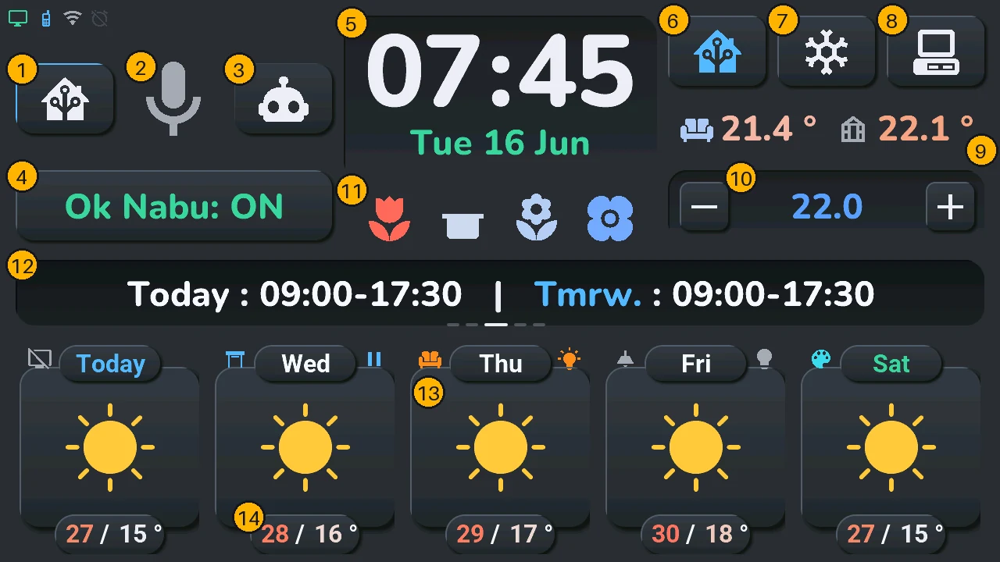
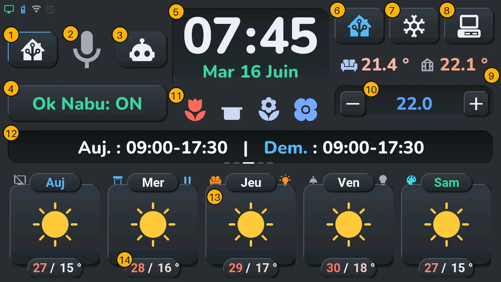

# User manual

## English · [Français](#version-française)

---

What happens when you touch the screen: tap, long press (hold a moment), swipe. One page per part of the screen; this one shows where everything is.

| # | Zone | Tap | Long press |
|---|---|---|---|
| 1 | Domo button (house) | voice mode: Home Assistant commands | — |
| 2 | Microphone | listen now; while it answers: stop it and listen again | voice assistant window |
| 3 | Discu button (robot) | voice mode: conversation | — |
| 4 | **Ok Nabu** | wake word on / off | — |
| 5 | Clock and date | alarm clock | calendar |
| 6 | Home Assistant button | bottom row: weather ↔ your devices | Energy window, with a solar production |
| 7 | Gear button | settings | system console |
| 8 | Gamepad button | Arcade, the games | TV remote, with a TV |
| 9 | Second temperature (greenhouse) | Arcade, the games | — |
| 10 | Climate: target, − and + | target: climate window (another device chosen: its window); − / +: one step | — |
| 11 | Row under the clock: plants and sensors | next line | on the plants: plant details |
| 12 | Central card | next panel, or dismiss a message | — |
| 13 | A card of the bottom row (its large icon) | the command of its device | the window of its device |
| 14 | A day's temperatures | that day's schedule, for 6 s | — |

**Swipe** left or right on the bottom row: the other forecast pages, or the next room in device mode.

Details: [home screen](home.md) (1 to 12), [bottom row and rooms](tiles.md) (13, 14 and swiping).

## Everywhere

- **Screen off**: a touch turns it back on. So does a knock on the case, while the device switch « Tab5 Tap-to-Wake » is on (it is by default), and « Okay Nabu », while « Tab5 Rallumer l'écran à Okay Nabu » is on (it is by default). It goes off by itself only if you pick a delay in « Tab5 Extinction auto de l'écran » (« Jamais », never, by default): after that long without a touch, but never while the alarm rings, the voice assistant is busy or a game is open. These four settings and the brightness are also in the [settings](settings.md) of the tablet.
- **A window** (lights, climate, calendar…) closes with its **×**, top right, or with a tap on the dark area around it. Left alone 45 s without a touch, it closes by itself; a game never does.
- **Another forecast page** comes back to the home page after 25 s without a touch.
- What you don't have is not shown: no TV, no remote on the long press of the gamepad button; no solar production, no Energy window on the long press of the Home Assistant button; no conversation pipeline, no Domo / Discu buttons; no greenhouse sensor, a gamepad icon in its place, still opening the Arcade; no plants and no sensor line, nothing under the clock.

## The windows

| Window | Opens from | Page |
|---|---|---|
| Lights | long press on a light | [Lights](lights.md) |
| Shutter | long press on a shutter | [Shutters](shutters.md) |
| Climate | the climate target, or a climate card | [Climate](climate.md) |
| TV remote | long press on the gamepad button, or on a TV | [TV remote](tv.md) |
| Calendar | long press on the clock | [Calendar](calendar.md) |
| Alarm clock | tap on the clock | [Alarm clock](alarm.md) |
| Voice assistant | long press on the microphone | [Voice](voice.md) |
| Energy | a solar or energy card, or a long press on the Home Assistant button | [Energy](energy.md) |
| Plants | long press on the plants line, under the clock | [Plants](plants.md) |
| Settings | the gear button | [Settings](settings.md) |
| System console | long press on the gear button | [System console](console.md) |
| Arcade | the gamepad button, or the greenhouse temperature | [Arcade](arcade.md) |

Home Assistant can also open a window with the tablet's « Aller à l'écran » list (go to screen).

These pictures are drawn by the project's CI from the firmware itself, with the [demo mode](../demo_mode.md) data; [screens and features](../screens.md) explains how each part works.

---

## Version Française

---

Ce qui se passe quand vous touchez l'écran : tap, appui long (garder le doigt un instant), glissement. Une page par partie de l'écran ; celle-ci montre où tout se trouve.

| N° | Zone | Tap | Appui long |
|---|---|---|---|
| 1 | Bouton Domo (maison) | mode vocal : commandes Home Assistant | — |
| 2 | Micro | écoute tout de suite ; pendant une réponse : la coupe et réécoute | fenêtre de l'assistant vocal |
| 3 | Bouton Discu (robot) | mode vocal : discussion | — |
| 4 | **Ok Nabu** | mot de réveil activé / coupé | — |
| 5 | Horloge et date | réveil | calendrier |
| 6 | Bouton Home Assistant | rangée du bas : météo ↔ vos appareils | fenêtre Énergie, avec une production solaire |
| 7 | Bouton engrenage | réglages | console système |
| 8 | Bouton manette | Arcade, les jeux | télécommande TV, avec une TV |
| 9 | Seconde température (serre) | Arcade, les jeux | — |
| 10 | Clim : consigne, − et + | consigne : fenêtre de la clim (un autre appareil choisi : sa fenêtre) ; − / + : un pas | — |
| 11 | Rangée sous l'horloge : plantes et capteurs | ligne suivante | sur les plantes : détail des plantes |
| 12 | Carte centrale | panneau suivant, ou écarter un message | — |
| 13 | Une carte de la rangée du bas (sa grande icône) | la commande de son appareil | la fenêtre de son appareil |
| 14 | Les températures d'un jour | le planning de ce jour, 6 s | — |

**Glisser** vers la gauche ou la droite sur la rangée du bas : les autres pages de prévisions, ou la pièce suivante en mode appareils.

Le détail : [écran d'accueil](home.md#version-française) (1 à 12), [rangée du bas et pièces](tiles.md#version-française) (13, 14 et le glissement).

## Partout

- **Écran éteint** : un toucher le rallume. Un petit coup sur le boîtier aussi, tant que l'interrupteur « Tab5 Tap-to-Wake » de l'appareil est allumé (il l'est d'origine), et « Okay Nabu », tant que « Tab5 Rallumer l'écran à Okay Nabu » est allumé (il l'est d'origine). Il ne s'éteint seul que si vous choisissez un délai dans « Tab5 Extinction auto de l'écran » (« Jamais » d'origine) : après ce délai sans toucher, mais jamais pendant que le réveil sonne, que l'assistant vocal travaille ou qu'un jeu est ouvert. Ces réglages et la luminosité sont aussi dans les [réglages](settings.md#version-française) de la tablette.
- **Une fenêtre** (lumières, clim, calendrier…) se ferme avec sa **×**, en haut à droite, ou d'un tap sur la zone sombre autour. Laissée 45 s sans toucher, elle se ferme seule ; un jeu, jamais.
- **Une autre page de prévisions** revient à la page d'accueil après 25 s sans toucher.
- Ce que vous n'avez pas n'apparaît pas : sans TV, pas de télécommande à l'appui long du bouton manette ; sans production solaire, pas de fenêtre Énergie à l'appui long du bouton Home Assistant ; sans pipeline de discussion, pas de boutons Domo / Discu ; sans capteur de serre, une manette à sa place, qui ouvre toujours l'Arcade ; sans plantes ni ligne de capteurs, rien sous l'horloge.

## Les fenêtres

| Fenêtre | S'ouvre depuis | Page |
|---|---|---|
| Lumières | appui long sur une lumière | [Lumières](lights.md#version-française) |
| Volet | appui long sur un volet | [Volets](shutters.md#version-française) |
| Clim | la consigne de la clim, ou une carte clim | [Clim](climate.md#version-française) |
| Télécommande TV | appui long sur le bouton manette, ou sur une TV | [Télécommande TV](tv.md#version-française) |
| Calendrier | appui long sur l'horloge | [Calendrier](calendar.md#version-française) |
| Réveil | tap sur l'horloge | [Réveil](alarm.md#version-française) |
| Assistant vocal | appui long sur le micro | [Voix](voice.md#version-française) |
| Énergie | une carte solaire ou énergie, ou un appui long sur le bouton Home Assistant | [Énergie](energy.md#version-française) |
| Plantes | appui long sur la ligne des plantes, sous l'horloge | [Plantes](plants.md#version-française) |
| Réglages | le bouton engrenage | [Réglages](settings.md#version-française) |
| Console système | appui long sur le bouton engrenage | [Console système](console.md#version-française) |
| Arcade | le bouton manette, ou la température de la serre | [Arcade](arcade.md#version-française) |

Home Assistant peut aussi ouvrir une fenêtre par la liste « Aller à l'écran » de la tablette.

Ces images sont dessinées par la CI du projet à partir du firmware lui-même, avec les données du [mode démo](../demo_mode.md#version-française) ; [écrans et fonctions](../screens.md#version-française) explique comment marche chaque partie.
