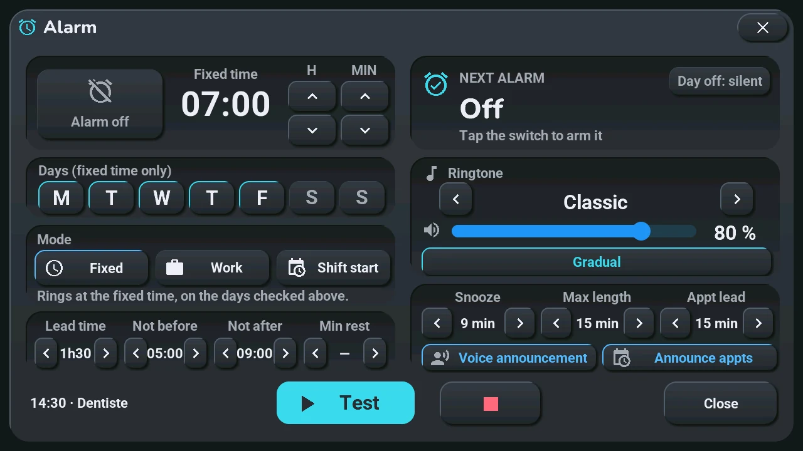
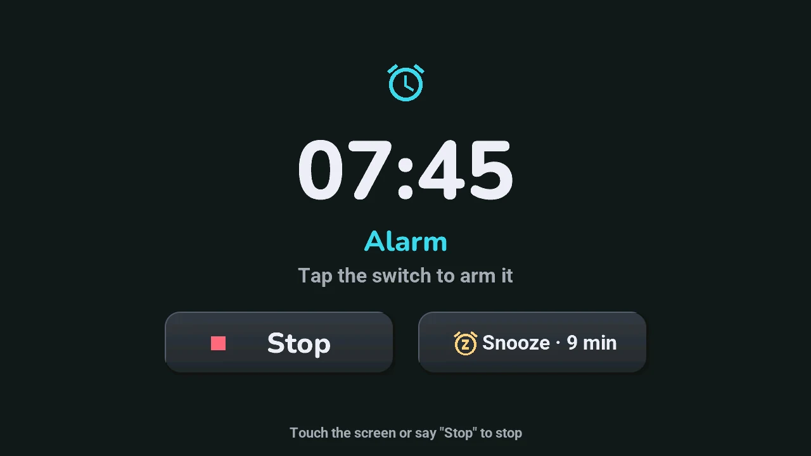
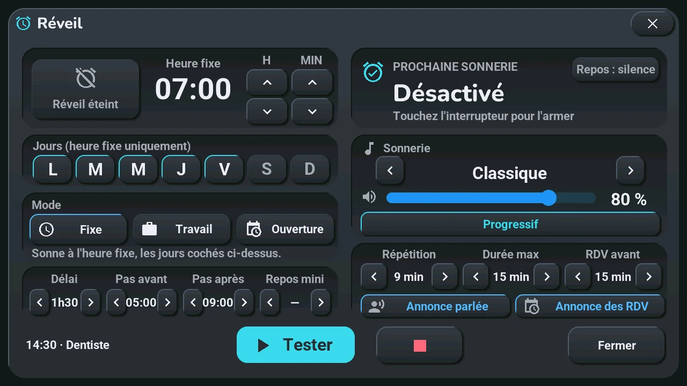
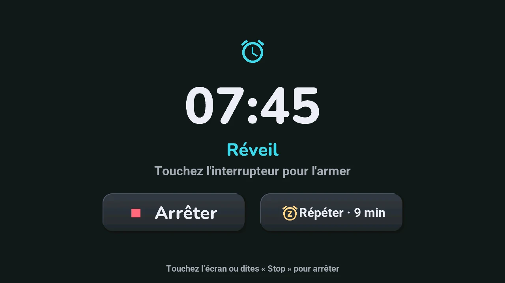

# Alarm clock

## English · [Français](#version-française)

---

**Opens with** a tap on the clock (a long press opens the [calendar](calendar.md)). The alarm rings even without Home Assistant: the time, the next days' work hours and the melody are on the tablet.

**Left: when it rings**

- **Alarm off / on**: the large button arms it or turns it off.
- **Fixed time**: **▲** and **▼** under **H** and **MIN**.
- **Days (fixed time only)**: tap a day to tick or untick it.
- **Mode**, with a reminder line below it:
    - **Fixed**: at the fixed time, on the ticked days;
    - **Work**: at the fixed time, on the days your work calendar has work, whatever the weekday;
    - **Shift start**: before the start of the day's work, by the **Lead time**.
- **Lead time**, **Not before**, **Not after**, **Min rest** (the hours of rest after the previous evening's closing): **‹** and **›**. In Shift start mode, the last three keep the time within your limits; « Not after » wins, so rest never makes you late.

Without calendar data, Work and Shift start ring at the fixed time: a ring too many costs less than a missed start.

**Right: how it rings**

- **Next alarm**: the day and time of the next ring, or why there is none. Its button, **Day off: silent** or **Day off: fixed time**, sets what Work and Shift start do on a day off: nothing, or the fixed time if that day is ticked.
- **Ringtone**: **‹** and **›** choose the melody and play it; the slider sets the alarm's own volume (apart from the tablet's); **Gradual** or **Constant volume**.
- **Snooze**, **Max length**, **Appt lead** (how long before an appointment it is announced): **‹** and **›**.
- **Voice announcement** or **Ring only**: 12 s into the first ring, if it still rings, a spoken briefing (time, today's work, next appointment, temperature); it needs Home Assistant.
- **Announce appts** or **Silent appts**: the reminder of timed appointments.

**Bottom**: the next appointment, **Test** (rings now), **■** (stops the test), **Close**.

**When it rings**

- A touch anywhere stops it, or say « Stop », even with the wake word off.
- **Snooze**: it rings again after the snooze time.

The same settings are entities of the tablet in Home Assistant ([tablet settings](../installation/settings.md#alarm-clock-appointments-voice)); the bell of the status row gives its state ([home screen](home.md#clock-and-date-5)).

---

## Version Française

---

**S'ouvre par** un tap sur l'horloge (un appui long ouvre le [calendrier](calendar.md#version-française)). Le réveil sonne même sans Home Assistant : l'heure, les heures de travail des jours qui viennent et la mélodie sont sur la tablette.

**À gauche : quand il sonne**

- **Réveil éteint / activé** : le grand bouton l'arme ou l'éteint.
- **Heure fixe** : **▲** et **▼** sous **H** et **MIN**.
- **Jours (heure fixe uniquement)** : un tap coche ou décoche un jour.
- **Mode**, avec une ligne de rappel dessous :
    - **Fixe** : à l'heure fixe, les jours cochés ;
    - **Travail** : à l'heure fixe, les jours où votre agenda de travail a du travail, quel que soit le jour de la semaine ;
    - **Ouverture** : avant le début du travail du jour, du **Délai**.
- **Délai**, **Pas avant**, **Pas après**, **Repos mini** (les heures de repos après la fermeture de la veille) : **‹** et **›**. En mode Ouverture, les trois derniers gardent l'heure dans vos limites ; « Pas après » l'emporte, le repos ne vous met donc jamais en retard.

Sans données d'agenda, Travail et Ouverture sonnent à l'heure fixe : une sonnerie de trop coûte moins qu'une embauche ratée.

**À droite : comment il sonne**

- **Prochaine sonnerie** : le jour et l'heure de la prochaine, ou pourquoi il n'y en a pas. Son bouton, **Repos : silence** ou **Repos : heure fixe**, règle ce que font Travail et Ouverture un jour de repos : rien, ou l'heure fixe si ce jour est coché.
- **Sonnerie** : **‹** et **›** choisissent la mélodie et la font entendre ; le curseur règle le volume propre au réveil (à part de celui de la tablette) ; **Progressif** ou **Volume constant**.
- **Répétition**, **Durée max**, **RDV avant** (combien de temps avant un rendez-vous il est annoncé) : **‹** et **›**.
- **Annonce parlée** ou **Sonnerie seule** : 12 s après le début de la première sonnerie, si elle sonne encore, un point du matin parlé (heure, travail du jour, prochain rendez-vous, température) ; il demande Home Assistant.
- **Annonce des RDV** ou **RDV silencieux** : le rappel des rendez-vous à heure fixe.

**En bas** : le prochain rendez-vous, **Tester** (sonne tout de suite), **■** (arrête l'essai), **Fermer**.

**Quand il sonne**

- Un toucher n'importe où l'arrête, ou dites « Stop », même mot de réveil coupé.
- **Répéter** : il resonne après le temps de répétition.

Les mêmes réglages sont des entités de la tablette dans Home Assistant ([réglages de la tablette](../installation/settings.md#réveil-rendez-vous-voix)) ; la cloche de la ligne d'état donne son état ([écran d'accueil](home.md#horloge-et-date-5)).
