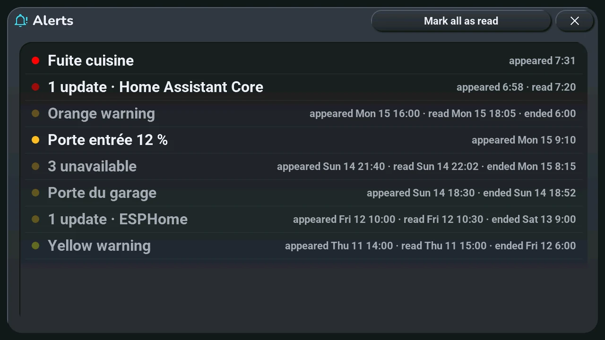
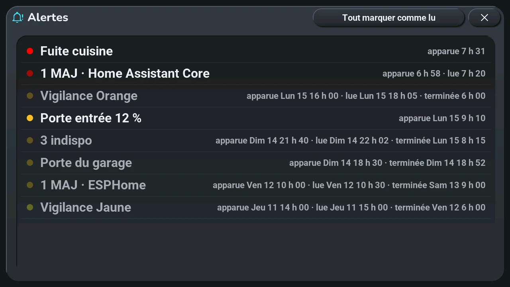

# Alerts

## English · [Français](#version-française)

---

**Opens with** « Alerts », the first button of the navigation wheel: a long press on the central card of the home screen, whatever it shows (the schedule, the rain, a warning, a message or an alert), opens the wheel ([home screen](home.md#central-card-12)).

- **One line per alert**, the newest at the top, the 20 latest: a dot of its colour (red, orange, yellow), its text, then when it **appeared**, was **read** (tapped on the central card) and **ended** (back to normal). A time alone is today; another day shows its name and date first.
- **Bright dot**: still to read. **Faded dot**: read, still going on. **Grey text**: ended.
- **Mark all as read**, top right: every alert still to read is read at once, also those that did not fit on the central card. The button is hidden when nothing is left to read.

Only the alerts you subscribed to show here, as on the central card: the « Tab5 · alertes … » lists of Home Assistant, in the « Alerts » section of the tablet's settings view. Before Home Assistant answers, the window says it is waiting.

---

## Version Française

---

**S'ouvre par** « Alertes », le premier bouton de la roue de navigation : un appui long sur la carte centrale de l'accueil, quoi qu'elle montre (le planning, la pluie, une vigilance, un message ou une alerte), ouvre la roue ([accueil](home.md#carte-centrale-12)).

- **Une ligne par alerte**, la plus récente en haut, les 20 dernières : une pastille de sa couleur (rouge, orange, jaune), son texte, puis l'heure où elle est **apparue**, a été **lue** (touchée sur la carte centrale) et s'est **terminée** (revenue à la normale). Une heure seule, c'est aujourd'hui ; un autre jour montre d'abord son nom et sa date.
- **Pastille vive** : à lire. **Pastille pâle** : lue, toujours en cours. **Texte gris** : terminée.
- **Tout marquer comme lu**, en haut à droite : toutes les alertes à lire sont lues d'un coup, même celles qui ne tenaient pas sur la carte centrale. Le bouton disparaît quand il ne reste rien à lire.

Seules les alertes auxquelles vous êtes abonné s'affichent ici, comme sur la carte centrale : les listes « Tab5 · alertes … » de Home Assistant, dans la section « Alertes » de la vue des réglages de la tablette. Avant que Home Assistant réponde, la fenêtre dit qu'elle attend.
