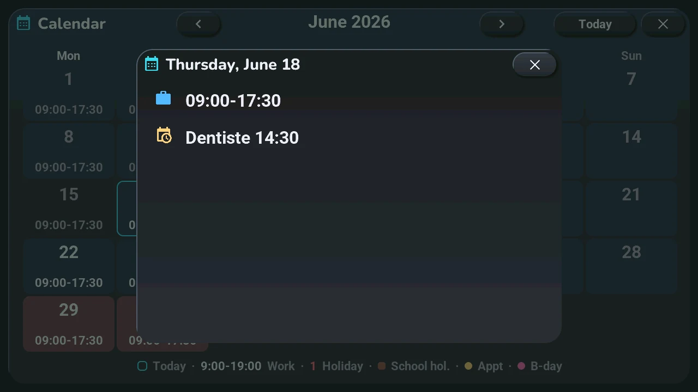
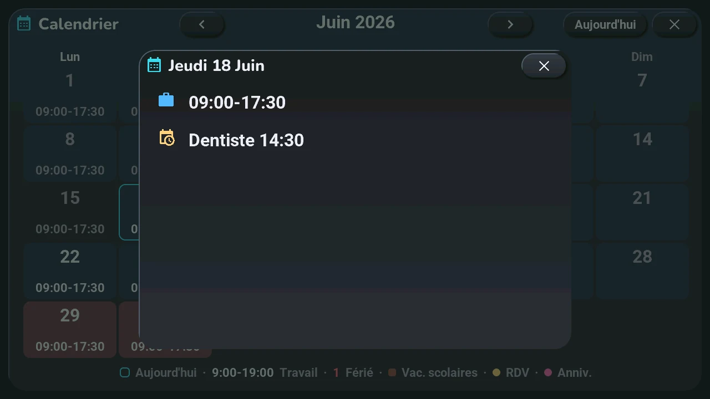

# Calendar

## English · [Français](#version-française)

---

**Opens with** a long press on the date, under the clock (a long press on the time opens the [alarm clock](alarm.md)); another gesture can be chosen in the blueprint ([home screen](home.md#clock-and-date-5)).

- **‹** and **›**: the previous or next month. **Today**: back to the current month.
- Each day shows its work hours (in pink when the day starts before 9:00). The legend at the bottom gives the rest: today framed, a public holiday's number in red, school holidays in a coloured cell, a gold dot for an appointment, a pink dot for a birthday.
- **Tap a day**: its detail.

The detail lists the day's holiday, school holidays, work hours, appointments with their time and birthdays. Its **×**, or a tap around it, brings the month back.

The grid of days works without Home Assistant; the hours and events come from your calendars ([step 5](../installation/sources.md)). An appointment you just added is not there yet? The tablet's « Recharger le calendrier » button, in Home Assistant, asks again.

---

## Version Française

---

**S'ouvre par** un appui long sur la date, sous l'horloge (un appui long sur l'heure ouvre le [réveil](alarm.md#version-française)) ; un autre geste peut se choisir dans le blueprint ([écran d'accueil](home.md#horloge-et-date-5)).

- **‹** et **›** : le mois précédent ou suivant. **Aujourd'hui** : retour au mois en cours.
- Chaque jour montre ses heures de travail (en rose quand la journée commence avant 9:00). La légende du bas donne le reste : aujourd'hui encadré, le numéro d'un jour férié en rouge, les vacances scolaires en case colorée, un point doré pour un rendez-vous, un point rose pour un anniversaire.
- **Tap sur un jour** : son détail.

Le détail liste le férié du jour, les vacances scolaires, les heures de travail, les rendez-vous avec leur heure et les anniversaires. Sa **×**, ou un tap autour, ramène le mois.

La grille des jours marche sans Home Assistant ; les heures et les événements viennent de vos agendas ([étape 5](../installation/sources.md#version-française)). Un rendez-vous que vous venez d'ajouter n'y est pas encore ? Le bouton « Recharger le calendrier » de la tablette, dans Home Assistant, redemande.
