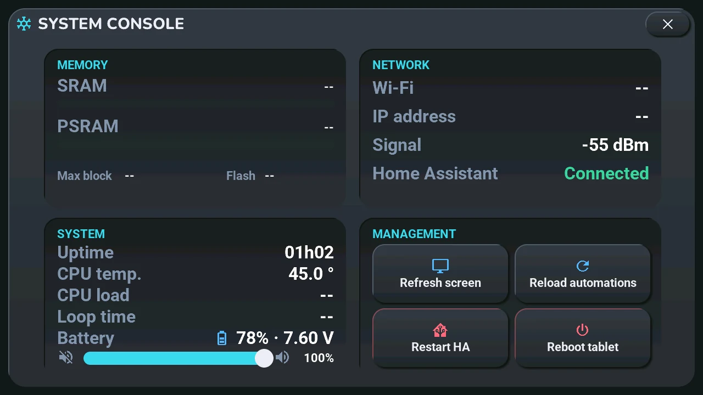
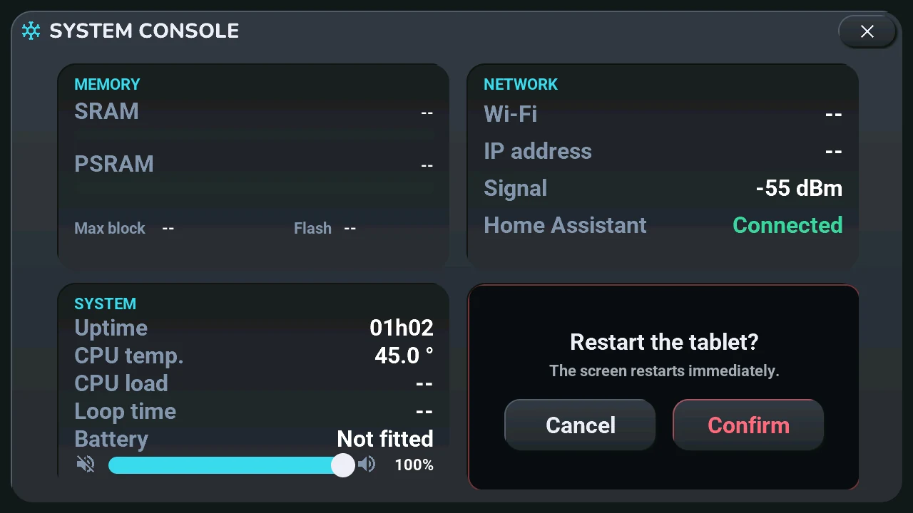
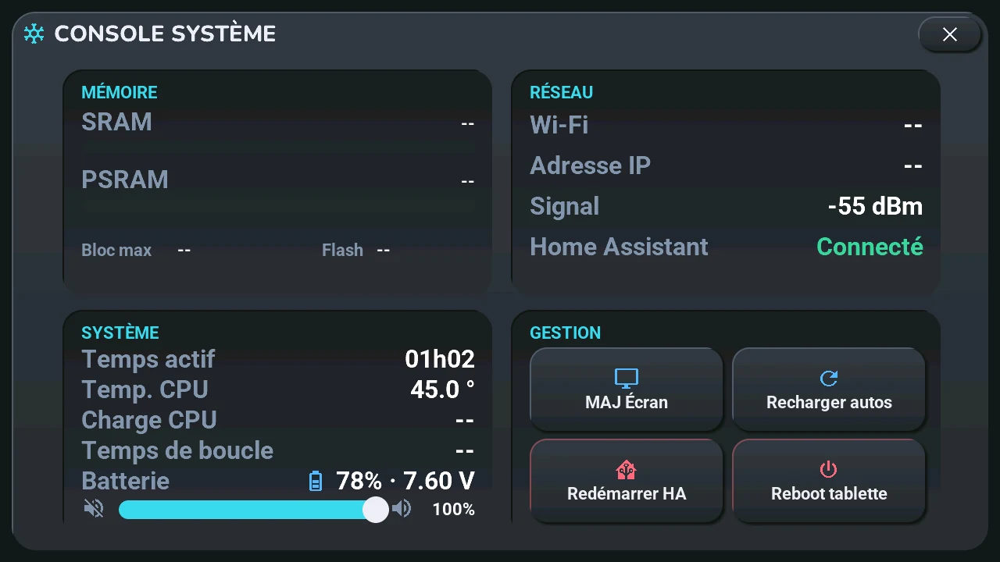
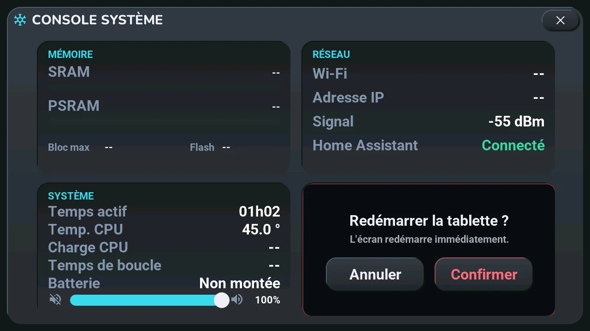

# System console

## English · [Français](#version-française)

---

**Opens with** a long press on the gear button, top right of the home screen (a tap opens the [settings](settings.md)).

**Memory**, **Network** and **System** only show: the tablet's memory, its Wi-Fi, IP address and signal, whether Home Assistant is connected, how long it has been running, the processor's temperature. In **System**, the slider is the tablet's volume (the same as in the [voice assistant window](voice.md)), and two lines added on 2026-10-06 ([discussion #278](https://github.com/Axellum/M5-Tab5-ESPHome-LVGL/discussions/278)):

- **CPU load**: how busy each of the processor's two cores was over the last 2 seconds, core 0 then core 1. Core 1 runs ESPHome's main loop (the screen, the link to Home Assistant): when the screen feels slow, look at it. "--" during the first 2 seconds after opening.
- **Battery**: the level and the voltage of the tablet's own battery, with the icon of the status bar (a bolt while charging; the level, estimated from the voltage, reads high while charging). **On USB** when no battery is detected, **Not fitted** while the **Tab5 Batterie montée** switch is off (the tablet's device page in Home Assistant): never a made-up 0 % or 100 %.

**Management**

- **Refresh screen**: Home Assistant sends everything again. The first thing to try when the screen shows old data.
- **Reload automations**: Home Assistant reloads its automations.
- **Restart HA** and **Reboot tablet** ask first:

**Cancel** or **Confirm**; after Reboot tablet, the tablet restarts at once.

The theme, light or dark and the language are in the [settings](settings.md). To read what the tablet receives, the console is not enough: see [debugging](../debugging.md).

---

## Version Française

---

**S'ouvre par** un appui long sur le bouton engrenage, en haut à droite de l'accueil (un tap ouvre les [réglages](settings.md#version-française)).

**Mémoire**, **Réseau** et **Système** montrent seulement : la mémoire de la tablette, son Wi-Fi, son adresse IP et son signal, si Home Assistant est connecté, depuis combien de temps elle tourne, la température du processeur. Dans **Système**, le curseur est le volume de la tablette (le même que dans la [fenêtre de l'assistant vocal](voice.md#version-française)), et deux lignes ajoutées le 06/10/2026 ([discussion #278](https://github.com/Axellum/M5-Tab5-ESPHome-LVGL/discussions/278)) :

- **Charge CPU** : l'occupation de chacun des deux cœurs du processeur sur les 2 dernières secondes, cœur 0 puis cœur 1. Le cœur 1 fait tourner la boucle d'ESPHome (l'écran, le lien avec Home Assistant) : c'est lui à regarder quand l'écran semble lent. « -- » pendant les 2 premières secondes après l'ouverture.
- **Batterie** : le niveau et la tension de la batterie de la tablette, avec l'icône du bandeau d'état (un éclair pendant la charge ; le niveau, estimé d'après la tension, lit trop haut pendant la charge). **Sur USB** quand aucune batterie n'est détectée, **Non montée** tant que l'interrupteur **Tab5 Batterie montée** est éteint (page de l'appareil de la tablette dans Home Assistant) : jamais un faux 0 % ou 100 %.

**Gestion**

- **MAJ Écran** : Home Assistant renvoie tout. Le premier essai quand l'écran montre des données anciennes.
- **Recharger autos** : Home Assistant recharge ses automatisations.
- **Redémarrer HA** et **Reboot tablette** demandent d'abord :

**Annuler** ou **Confirmer** ; après Reboot tablette, la tablette redémarre tout de suite.

Le thème, clair ou sombre et la langue sont dans les [réglages](settings.md#version-française). Pour lire ce que la tablette reçoit, la console ne suffit pas : voir [diagnostiquer](../debugging.md#version-française).
