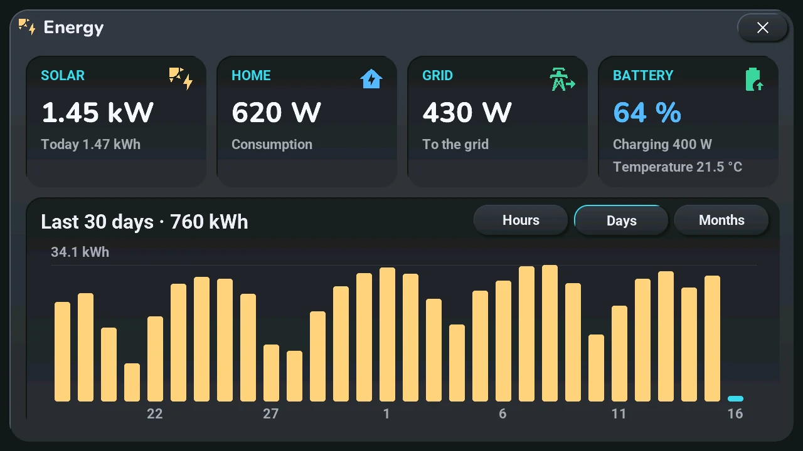
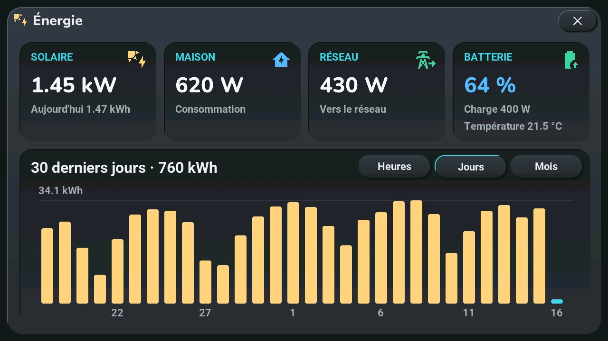

# Energy

## English · [Français](#version-française)

---

Only if sensors are picked in the « Énergie · Energy » section of the blueprint ([solar energy](../installation/adapt-to-your-home.md#solar-energy-optional)). **Opens with** a tap or a long press on one of those sensors' cards ([bottom row](tiles.md)), the solar one with its solar-panel icon. When the solar production shows in the status row, a long press on the Home Assistant button, top right of the home screen, opens it too.

- **Top, live**: **Solar** (power and today's production), **Home** (consumption), **Grid** (from or to the grid), **Battery** (level, charging or discharging, temperature). A card without a sensor is not shown.
- **Bottom**: the production, with the period and its total as title. **Hours** (today, hour by hour), **Days** (the last 30 days), **Months** (the last 12 months). The current hour, day or month is in the accent colour; the line at the top gives the highest bar.

The history needs the produced-energy sensor; without it, the live cards fill the window. Before Home Assistant answers, the window says it is waiting.

---

## Version Française

---

Seulement si des capteurs sont choisis dans la section « Énergie · Energy » du blueprint ([énergie solaire](../installation/adapt-to-your-home.md#énergie-solaire-facultatif)). **S'ouvre par** un tap ou un appui long sur la carte d'un de ces capteurs ([rangée du bas](tiles.md#version-française)), celle du solaire avec son icône de panneau. Quand la production solaire s'affiche dans la ligne d'état, un appui long sur le bouton Home Assistant, en haut à droite de l'accueil, l'ouvre aussi.

- **En haut, en direct** : **Solaire** (puissance et production du jour), **Maison** (consommation), **Réseau** (depuis ou vers le réseau), **Batterie** (niveau, en charge ou en décharge, température). Une carte sans capteur n'apparaît pas.
- **En bas** : la production, avec la période et son total pour titre. **Heures** (aujourd'hui, heure par heure), **Jours** (les 30 derniers jours), **Mois** (les 12 derniers mois). L'heure, le jour ou le mois en cours est dans la couleur d'accent ; la ligne du haut donne la plus haute barre.

L'historique demande le capteur d'énergie produite ; sans lui, les cartes en direct remplissent la fenêtre. Avant que Home Assistant réponde, la fenêtre dit qu'elle attend.
