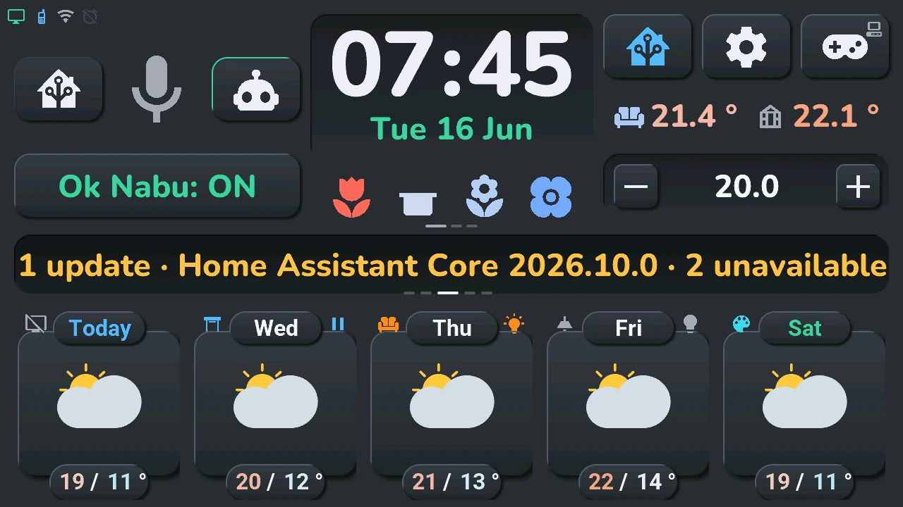
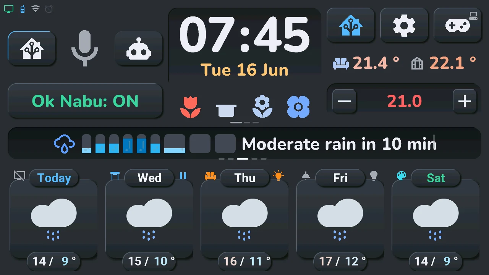
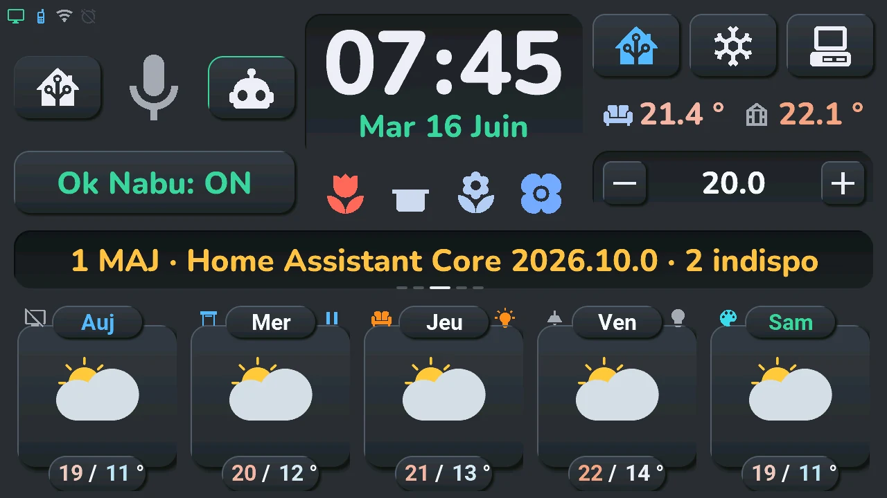
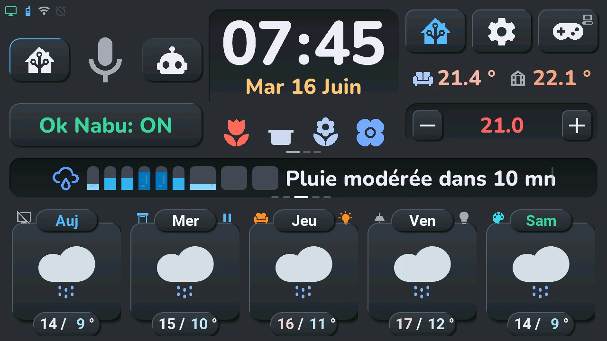

# Home screen

## English · [Français](#version-française)

---

The top of the screen never changes: voice, clock, buttons, temperatures, climate and the row under the clock. The numbers are those of the [overview](README.md).

## Voice: Domo, microphone, Discu, Ok Nabu (1 to 4)

- **Domo** (house) and **Discu** (robot): the two voice modes. A tap picks one; the lit button is the current mode. Domo sends what you say to Home Assistant's assistant, which runs commands (« turn on the living room »). Discu sends it to your conversation assistant, for questions and chat. How to set them up: [the two voice modes](../installation/settings.md#voice-assistant-the-two-modes).
- **Microphone**: a tap listens right away, without the wake word. While the tablet answers, a tap cuts the answer and listens again. A **long press** opens the [voice assistant window](voice.md). Its colour gives the state: grey, waiting; green, listening; orange, thinking; blue, answering; red, error.
- **Ok Nabu: ON / OFF**: a tap turns the wake word on or off. Off, the tablet only listens when you tap the microphone.
- **Lines in the Ok Nabu button**: the « Tab5 — emplacements » blueprint (section « Panneau Ok Nabu · Ok Nabu panel ») can put up to three lines of four sensors there, like the [row under the clock](#row-under-the-clock-11). The listening line « Ok Nabu: ON / OFF » is first by default; it can be second, third or hidden. A tap on the listening line still turns the wake word on or off; on a sensor line it does nothing. A tap on the hours of the clock shows the next line; small dashes under the button show which line is on. The lines stay put unless you choose « Automatique » in the blueprint: they then take turns with the central card.

Without a conversation assistant (« Tab5 · pipeline de discussion » set to « Aucun »), Domo and Discu are not shown and the tablet stays in Domo mode.

## Clock and date (5)

The clock has three touch areas: the **hours** (left half of the digits), the **minutes** (right half) and the **date** (below).

- **Long press on the hours or the minutes**: the [alarm clock](alarm.md).
- **Tap on the minutes**: the next device of the − / + tile, as if you picked it in its list (see [temperatures and climate](#temperatures-and-climate-9-10)).
- **Tap on the date**: the next line of the row under the clock.
- **Long press on the date**: the [calendar](calendar.md).
- **Tap on the hours**: the next line of the Ok Nabu button when it has lines (see [voice](#voice-domo-microphone-discu-ok-nabu-1-to-4)), otherwise nothing.

The date changes colour with the day's weather warnings (yellow, orange, red). In the status row, top left, the bell of the alarm is green when it will ring, amber when it is on but no day qualifies, struck through when it is off.

## The three buttons, top right (6 to 8)

- **Home Assistant** (house): a tap shows your **devices** in the bottom row instead of the weather; tap again for the weather. It is lit while it shows the devices. Not shown when no room has a device. Details: [bottom row and rooms](tiles.md). A **long press** opens the [Energy window](energy.md) when the solar production shows in the status row, top left: a small solar panel then marks the button, in its top-right corner.
- **Gear**: a tap opens the [settings](settings.md) (brightness, screen off, theme, language…); a **long press**, the same settings on their System page, the [system console](console.md).
- **Gamepad**: a tap opens the [Arcade](arcade.md); a **long press**, the [TV remote](tv.md) when a TV is picked in the blueprint: a small screen then marks the button, in its top-right corner. Without a TV, the button stays and its long press does nothing.

**Your own gestures.** What the twelve gestures of the clock and of these three buttons do (a tap and a long press on the hours, the minutes, the date, and on each button) is chosen in the « Tab5 — emplacements » blueprint, section « Horloge et boutons du haut · Clock and top buttons »: Automatic (what is described above), Nothing, a screen — voice assistant, calendar, alarm clock, climate, plants, TV remote, system console, Energy, settings, alerts, Arcade, [house](house.md), lights, shutter, temperature — or an action: device mode (the tap of the Home Assistant button), next device of the − / + tile, next line under the clock, next line of the Ok Nabu button, wake word on / off (the tap of Ok Nabu), the [navigation wheel](#central-card-12). A small icon in the button's top-right corner shows what its long press does (the icon of the window's title); when its tap is changed, the button's own icon shows what the tap does. A screen your home lacks (no climate, no plant, no TV, no solar production for Energy) does not open, and the icon is not shown. If the gear no longer opens the console, the tablet's « Aller à l'écran » entity in Home Assistant still does.

## Temperatures and climate (9, 10)

- The two temperatures: the room (sofa) and a second sensor (greenhouse). A **tap on the second one** opens the [Arcade](arcade.md); without a second sensor, a gamepad stands in its place and does the same.
- A **long press on either temperature** opens its [history](temperature.md): 24 hours, 7 or 30 days, and the weather forecast for the second one.
- A **tap on the first temperature** (the room) opens the [quick actions of a climate](climate.md#quick-actions-from-the-room-temperature) on it: off, mode, target, options, **Climates** to switch to another unit, and **Details** for the [climate window](climate.md) (one page per unit, swipe for the next). It is the unit of the room shown in HA mode (the room's own climate first, when its section of the blueprint has one), otherwise the climate picked in the blueprint. Until Home Assistant has sent that unit's settings, the tap opens the climate window directly.
- **Target temperature**: a tap opens the [climate window](climate.md).
- **−** and **+**: one step down or up. The new target shows at once; quick taps add up and leave as one command when you stop.
- **Another device for − and +**: a long press on the value between − and + unfolds a list — the climate, the devices chosen in the « Tab5 — emplacements » blueprint (section « Tuile − / + · − / + tile »: a TV or soundbar volume, a light's brightness, a thermostat, a water heater, a humidifier, a fan's speed, a shutter's position, a number), then the tablet's volume (« Son de la tablette », Tablet volume: a speaker, crossed out at 0 % or when the sound is muted). Tap one: − and + now adjust it, its icon and value show between them (the climate too), and it stays chosen, even after a restart. A tap elsewhere closes the list. A tap on the minutes of the clock moves to the next one without unfolding the list. With « Automatique » in the blueprint (« Défilement · Scrolling » of the same section), the climate and the blueprint's devices also take turns by themselves, with the central card (every 32 seconds by default); never while the list is open, and the device you pick stays a whole turn. A tap on the value opens the device's window when it has one (a light or a shutter placed in a room, the TV's remote), otherwise nothing.

## Row under the clock (11)

Up to three lines of four sensors, plus the plants line, chosen in the « Tab5 — emplacements » blueprint (section « Sous l'horloge · Under the clock »). With two lines or more they take turns, just before the central card changes (every 32 seconds by default, set in the blueprint), and small dashes under the row show which line is on. « Fixe » in the blueprint (« Défilement · Scrolling ») stops the turns: the line then changes only with a tap.

- **The plants line**: four icons, one per pot, coloured by soil moisture (red: to water, green: fine, blue: too wet). A **long press** opens the [plant details](plants.md).
- **A sensor line**: an icon per device, and the value of each sensor, coloured by what it measures (temperatures on the screen's scale, humidity, battery, gold for power and energy). A switch, a light or a detector shows its state; it is not controlled from here.
- **Tap**, or a tap on the date of the clock: the next line at once.

Without plant sensors and without a sensor line, the area stays empty.

## Central card (12)

It changes every 8 seconds between the day's schedule, the rain in the next hour, the weather warnings, a message and the alerts sent by Home Assistant.

- **Tap** on the schedule, the rain or the warnings: the next panel at once.
- **Tap** on a message or an alert: it is dismissed and does not come back, until Home Assistant sends a new one.
- **Long press**, whatever it shows (the dates of a forecast page and the name of a room too): the **navigation wheel**, centred on the card, to reach every screen of the tablet. Its first ring, each button with its word: **Alerts** (the [alerts window](alerts.md), the 20 latest alerts; the button is lit while a warning or an alert is on the card), **Rooms**, **Devices**, **Agenda**, **Tablet** and **Assistant** (the [voice assistant](voice.md)). A button with a dot unfolds its screens on a second ring above it, and the hub names it:

    - **Rooms**: [House](house.md), then each room that has a device, its number in the button and its name beside it; a tap shows its devices in the bottom row (device mode), the room shown is lit;
    - **Devices**: temperatures (the [history](temperature.md) of the first temperature of the home screen), climate, lights and shutter (the window of the room shown, otherwise of the first room that has one), Energy, plants;
    - **Agenda**: [calendar](calendar.md), [alarm clock](alarm.md);
    - **Tablet**: [Arcade](arcade.md) games, [settings](settings.md), [system console](console.md).

    Only what your home has is offered (no climate, no shutter, no solar production for Energy…): a family with nothing in it disappears. A tap on a screen opens it; a tap elsewhere folds the second ring, then closes the wheel.

It also shows, for a moment, the tablet's spoken answer, a day's schedule (when you tap that day's temperatures, see [bottom row](tiles.md)), the dates of another forecast page, or the name of the room in device mode: a tap on that name opens the [House](house.md) window, every room and its devices at once.

---

## Version Française

---

Le haut de l'écran ne change jamais : voix, horloge, boutons, températures, clim et rangée sous l'horloge. Les numéros sont ceux de la [vue d'ensemble](README.md#version-française).

## Voix : Domo, micro, Discu, Ok Nabu (1 à 4)

- **Domo** (maison) et **Discu** (robot) : les deux modes vocaux. Un tap en choisit un ; le bouton allumé est le mode en cours. Domo envoie ce que vous dites à l'assistant de Home Assistant, qui exécute les commandes (« allume le salon »). Discu l'envoie à votre assistant de discussion, pour les questions et la conversation. Pour les régler : [les deux modes vocaux](../installation/settings.md#assistant-vocal--les-deux-modes).
- **Micro** : un tap écoute tout de suite, sans le mot de réveil. Pendant que la tablette répond, un tap coupe la réponse et réécoute. Un **appui long** ouvre la [fenêtre de l'assistant vocal](voice.md#version-française). Sa couleur donne l'état : gris, en attente ; vert, écoute ; orange, réflexion ; bleu, réponse ; rouge, erreur.
- **Ok Nabu : ON / OFF** : un tap active ou coupe le mot de réveil. Coupé, la tablette n'écoute que si vous touchez le micro.
- **Des lignes dans le bouton Ok Nabu** : le blueprint « Tab5 — emplacements » (section « Panneau Ok Nabu · Ok Nabu panel ») peut y mettre jusqu'à trois lignes de quatre capteurs, comme la [rangée sous l'horloge](#rangée-sous-lhorloge-11). La ligne d'écoute « Ok Nabu : ON / OFF » vient en premier d'origine ; elle peut être deuxième, troisième ou masquée. Un tap sur la ligne d'écoute active ou coupe toujours le mot de réveil ; sur une ligne de capteurs, il ne fait rien. Un tap sur les heures de l'horloge montre la ligne suivante ; de petits tirets sous le bouton montrent la ligne affichée. Les lignes restent en place, sauf si vous choisissez « Automatique » dans le blueprint : elles se relaient alors avec la carte centrale.

Sans assistant de discussion (« Tab5 · pipeline de discussion » sur « Aucun »), Domo et Discu ne s'affichent pas et la tablette reste en mode Domo.

## Horloge et date (5)

L'horloge a trois zones tactiles : les **heures** (moitié gauche des chiffres), les **minutes** (moitié droite) et la **date** (dessous).

- **Appui long sur les heures ou les minutes** : le [réveil](alarm.md#version-française).
- **Tap sur les minutes** : l'appareil suivant de la tuile − / +, comme si vous le choisissiez dans sa liste (voir [températures et clim](#températures-et-clim-9-10)).
- **Tap sur la date** : la ligne suivante de la rangée sous l'horloge.
- **Appui long sur la date** : le [calendrier](calendar.md#version-française).
- **Tap sur les heures** : la ligne suivante du bouton Ok Nabu quand il a des lignes (voir [voix](#voix--domo-micro-discu-ok-nabu-1-à-4)), sinon rien.

La date change de couleur avec les vigilances météo du jour (jaune, orange, rouge). Dans la ligne d'état, en haut à gauche, la cloche du réveil est verte quand il sonnera, ambre quand il est activé mais qu'aucun jour ne convient, barrée quand il est éteint.

## Les trois boutons, en haut à droite (6 à 8)

- **Home Assistant** (maison) : un tap montre vos **appareils** dans la rangée du bas au lieu de la météo ; un nouveau tap revient à la météo. Il est allumé tant qu'il montre les appareils. Absent quand aucune pièce n'a d'appareil. Le détail : [rangée du bas et pièces](tiles.md#version-française). Un **appui long** ouvre la [fenêtre Énergie](energy.md#version-française) quand la production solaire s'affiche dans la ligne d'état, en haut à gauche : un petit panneau solaire marque alors le bouton, dans son coin en haut à droite.
- **Engrenage** : un tap ouvre les [réglages](settings.md#version-française) (luminosité, extinction, thème, langue…) ; un **appui long**, les mêmes réglages sur leur page Système, la [console système](console.md#version-française).
- **Manette** : un tap ouvre l'[Arcade](arcade.md#version-française) ; un **appui long**, la [télécommande TV](tv.md#version-française) quand une TV est choisie dans le blueprint : un petit écran marque alors le bouton, dans son coin en haut à droite. Sans TV, le bouton reste et son appui long ne fait rien.

**Vos propres gestes.** Ce que font les douze gestes de l'horloge et de ces trois boutons (un tap et un appui long sur les heures, les minutes, la date, et sur chaque bouton) se choisit dans le blueprint « Tab5 — emplacements », section « Horloge et boutons du haut · Clock and top buttons » : Automatique (ce qui est décrit ci-dessus), Rien, un écran — assistant vocal, calendrier, réveil, clim, plantes, télécommande TV, console système, Énergie, réglages, alertes, Arcade, [maison](house.md#version-française), lumières, volet, température — ou une action : mode appareils (le tap du bouton Home Assistant), appareil suivant de la tuile − / +, ligne suivante sous l'horloge, ligne suivante du bouton Ok Nabu, mot de réveil activé / coupé (le tap d'Ok Nabu), la [roue de navigation](#carte-centrale-12). Une petite icône dans le coin en haut à droite du bouton montre ce que fait son appui long (celle du titre de la fenêtre) ; quand son tap est changé, l'icône du bouton montre ce que fait le tap. Un écran absent de la maison (pas de clim, pas de plante, pas de TV, pas de production solaire pour Énergie) ne s'ouvre pas, et l'icône ne s'affiche pas. Si l'engrenage n'ouvre plus la console, l'entité « Aller à l'écran » de la tablette dans Home Assistant l'ouvre toujours.

## Températures et clim (9, 10)

- Les deux températures : la pièce (canapé) et une seconde sonde (serre). Un **tap sur la seconde** ouvre l'[Arcade](arcade.md#version-française) ; sans seconde sonde, une manette prend sa place et fait de même.
- Un **appui long sur l'une des deux températures** ouvre son [historique](temperature.md#version-française) : 24 heures, 7 ou 30 jours, et la prévision de la météo pour la seconde.
- Un **tap sur la première température** (la pièce) ouvre sur elle les [actions rapides d'une clim](climate.md#actions-rapides-par-la-température-de-la-pièce) : éteindre, mode, consigne, options, **Clims** pour passer à un autre appareil, et **Détails** pour la [fenêtre de la clim](climate.md#version-française) (une page par clim, un glisser pour la suivante). C'est la clim de la pièce affichée en mode HA (d'abord la clim propre de la pièce, quand sa section du blueprint en a une), sinon celle choisie dans le blueprint. Tant que Home Assistant n'a pas envoyé les réglages de cette clim, le tap ouvre directement la fenêtre de la clim.
- **Consigne** : un tap ouvre la [fenêtre de la clim](climate.md#version-française).
- **−** et **+** : un pas de moins ou de plus. La nouvelle consigne s'affiche tout de suite ; des taps rapides s'additionnent et partent en une seule commande quand vous vous arrêtez.
- **Un autre appareil pour − et +** : un appui long sur la valeur entre − et + déroule une liste — la clim, les appareils choisis dans le blueprint « Tab5 — emplacements » (section « Tuile − / + · − / + tile » : volume d'une TV ou d'une barre de son, luminosité d'une lampe, un thermostat, un chauffe-eau, un humidificateur, la vitesse d'un ventilateur, la position d'un volet, un nombre), puis le volume de la tablette (« Son de la tablette » : un haut-parleur, barré à 0 % ou quand le son est coupé). Un tap en choisit un : − et + le règlent désormais, son icône et sa valeur s'affichent entre les deux (la clim aussi), et il reste choisi, même après un redémarrage. Un tap ailleurs ferme la liste. Un tap sur les minutes de l'horloge passe au suivant sans dérouler la liste. Avec « Automatique » dans le blueprint (« Défilement · Scrolling » de la même section), la clim et les appareils du blueprint se relaient aussi d'eux-mêmes, avec la carte centrale (toutes les 32 secondes d'origine) ; jamais quand la liste est ouverte, et l'appareil que vous choisissez reste un tour entier. Un tap sur la valeur ouvre la fenêtre de l'appareil quand il en a une (une lampe ou un volet placé dans une pièce, la télécommande de la TV), sinon rien.

## Rangée sous l'horloge (11)

Jusqu'à trois lignes de quatre capteurs, plus la ligne des plantes, choisies dans le blueprint « Tab5 — emplacements » (section « Sous l'horloge · Under the clock »). À partir de deux lignes, elles se relaient juste avant que la carte centrale change (toutes les 32 secondes d'origine, réglable dans le blueprint), et de petits tirets sous la rangée montrent la ligne affichée. « Fixe » dans le blueprint (« Défilement · Scrolling ») arrête le relais : la ligne ne change plus que d'un tap.

- **La ligne des plantes** : quatre icônes, une par pot, colorées selon l'humidité de la terre (rouge : à arroser, vert : bien, bleu : trop humide). Un **appui long** ouvre le [détail des plantes](plants.md#version-française).
- **Une ligne de capteurs** : une icône par appareil, et la valeur de chaque capteur, colorée selon ce qu'il mesure (températures sur l'échelle de l'écran, humidité, batterie, or pour la puissance et l'énergie). Un interrupteur, une lampe ou un détecteur montre son état ; il ne se commande pas d'ici.
- **Tap**, ou un tap sur la date de l'horloge : la ligne suivante, tout de suite.

Sans capteurs de plantes ni ligne de capteurs, la zone reste vide.

## Carte centrale (12)

Elle passe toutes les 8 secondes du planning du jour à la pluie de l'heure qui vient, aux vigilances météo, à un message et aux alertes envoyées par Home Assistant.

- **Tap** sur le planning, la pluie ou les vigilances : le panneau suivant, tout de suite.
- **Tap** sur un message ou une alerte : il est écarté et ne revient pas, jusqu'à ce que Home Assistant en envoie un nouveau.
- **Appui long**, quoi qu'elle montre (les dates d'une page de prévisions et le nom d'une pièce aussi) : la **roue de navigation**, centrée sur la carte, pour aller à chaque écran de la tablette. Son premier anneau, chaque bouton avec son mot : **Alertes** (la [fenêtre des alertes](alerts.md#version-française), les 20 dernières alertes ; le bouton est allumé tant qu'une vigilance ou une alerte est sur la carte), **Pièces**, **Appareils**, **Agenda**, **Tablette** et **Assistant** (l'[assistant vocal](voice.md#version-française)). Un bouton marqué d'un point déplie ses écrans sur un second anneau au-dessus de lui, et le moyeu dit lequel :

    - **Pièces** : [Maison](house.md#version-française), puis chaque pièce qui a un appareil, son numéro dans le bouton et son nom à côté ; un tap montre ses appareils dans la rangée du bas (mode appareils), la pièce affichée est allumée ;
    - **Appareils** : températures (l'[historique](temperature.md#version-française) de la première température de l'accueil), clims, lumières et volets (la fenêtre de la pièce affichée, sinon de la première qui en a), Énergie, plantes ;
    - **Agenda** : [calendrier](calendar.md#version-française), [réveil](alarm.md#version-française) ;
    - **Tablette** : les jeux de l'[Arcade](arcade.md#version-française), les [réglages](settings.md#version-française), la [console système](console.md#version-française).

    Seul ce que la maison a est proposé (pas de clim, pas de volet, pas de production solaire pour Énergie…) : une famille vide disparaît. Un tap sur un écran l'ouvre ; un tap ailleurs replie le second anneau, puis ferme la roue.

Elle montre aussi, un moment, la réponse parlée de la tablette, le planning d'un jour (quand vous touchez les températures de ce jour, voir la [rangée du bas](tiles.md#version-française)), les dates d'une autre page de prévisions, ou le nom de la pièce en mode appareils : un tap sur ce nom ouvre la fenêtre [Maison](house.md#version-française), toutes les pièces et leurs appareils d'un coup.
