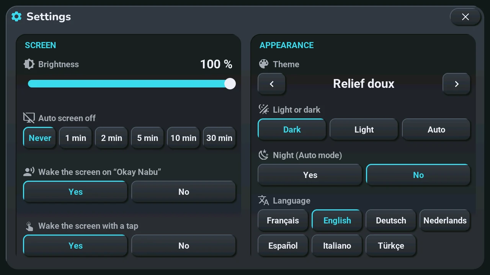
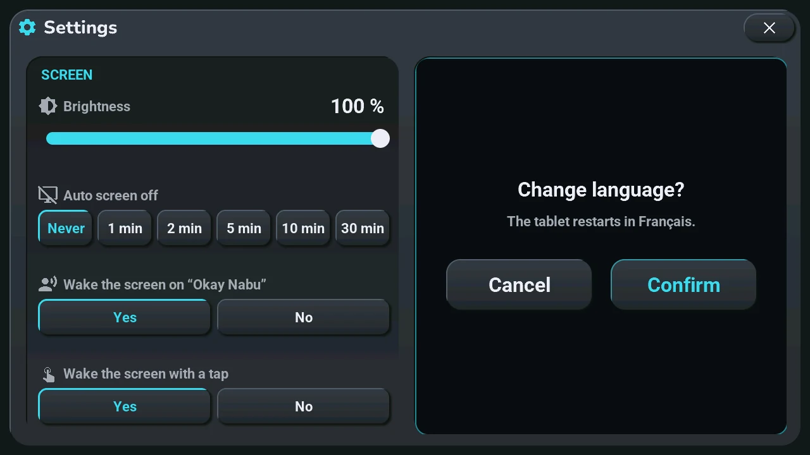
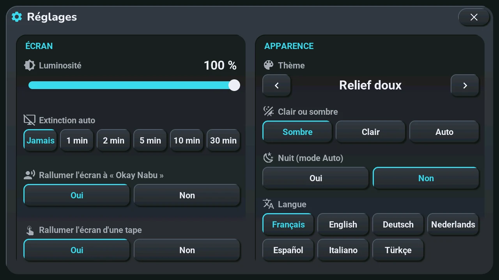
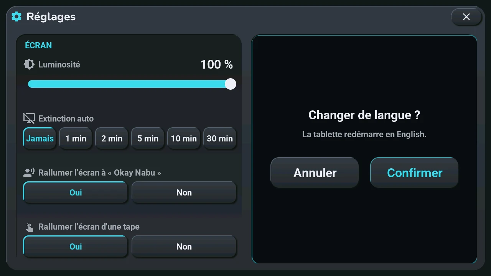

# Settings

## English · [Français](#version-française)

---

The tablet settings you may want to change without opening Home Assistant, on four pages. **Opens with** a tap on the gear button, top right of the home screen, on the **Screen** page; a long press opens the **System** page (the [system console](console.md)).

The page names sit at the top, next to the title: the page shown is lit. Tap a name to show its page, or slide your finger left (next page) or right (previous page) anywhere in the window; after the last page comes the first again. Sliding the brightness or the volume slider moves the slider, never the page, and a slide that starts on a button does not press it.

**Screen**

- **Brightness**: the slider, from 10 to 100 %. On battery the energy saving mode caps it at 50 %, then lowers it to the minimum after 30 s without a touch or below 35 % battery (**Power saving**, on the Battery page).
- **Auto screen off**: **Never**, or 1, 2, 5, 10 or 30 min without a touch. Never while the alarm rings, the voice assistant is busy or a game is open.
- **Wake the screen on « Okay Nabu »**: **Yes** or **No**. With No, the screen stays dark and the answer is only spoken.
- **Wake the screen with a tap**: **Yes** or **No**, a small knock on the case.

**Appearance**

- **Theme**: the two arrows go to the previous or the next theme; the screen repaints at once. The name stays the same in every language.
- **Light or dark**: **Dark**, **Light** or **Auto**: light by day, dark at night.
- **Night (Auto mode)**: what Auto follows. Home Assistant sets it from the sun, at sunset, at sunrise and each time the tablet connects: a change made here lasts until then.
- **Language**: one button per language, written in that language. The tablet asks first, because it restarts in the new language: **Cancel** or **Confirm**.

**Battery**

On the left, three settings:

- **Charge limit**: **100 %** or **80 %**. At 80 %, charging stops at 80 % and starts again at 70 %: for a tablet that stays plugged in.
- **Power saving**: **Never**, **On battery** (the default) or **Always**: what caps the brightness, as above.
- **Battery fitted**: **Yes** shows the battery icon in the status bar (a plug when the voltage says there is no battery).

On the right, what the tablet reads, refreshed every 2 seconds while the page is shown:

- **State**: **Charging**, **On USB**, **On battery**, **No battery detected**, or **Measuring** for the first minute after a restart.
- **Level**, **Voltage** and **Consumption**: "--" when no battery is detected or nothing has been measured yet, never a made-up 0 %.

**System**

The [system console](console.md): memory, network, the processor and the volume, and the management buttons.

The lit button is the current choice. Each setting is also an entity of the tablet in Home Assistant ([tablet settings](../installation/settings.md)): what you change here is what Home Assistant sees, and the reverse.

---

## Version Française

---

Les réglages de la tablette qu'on veut changer sans ouvrir Home Assistant, sur quatre pages. **S'ouvre par** un tap sur le bouton engrenage, en haut à droite de l'accueil, sur la page **Écran** ; un appui long ouvre la page **Système** (la [console système](console.md#version-française)).

Les noms des pages sont en haut, à côté du titre : la page affichée est allumée. Un tap sur un nom montre sa page ; on peut aussi glisser le doigt vers la gauche (page suivante) ou vers la droite (page précédente) n'importe où dans la fenêtre ; après la dernière page revient la première. Glisser le curseur de la luminosité ou du volume bouge le curseur, jamais la page, et un glissement parti d'un bouton ne l'appuie pas.

**Écran**

- **Luminosité** : le curseur, de 10 à 100 %. Sur batterie, le mode économie la plafonne à 50 %, puis la met au plus bas après 30 s sans toucher ou sous 35 % de batterie (**Économie d'énergie**, sur la page Batterie).
- **Extinction auto** : **Jamais**, ou 1, 2, 5, 10 ou 30 min sans toucher. Jamais pendant que le réveil sonne, que l'assistant vocal travaille ou qu'un jeu est ouvert.
- **Rallumer l'écran à « Okay Nabu »** : **Oui** ou **Non**. Sur Non, l'écran reste noir et la réponse est seulement parlée.
- **Rallumer l'écran d'une tape** : **Oui** ou **Non**, un petit coup sur le boîtier.

**Apparence**

- **Thème** : les deux flèches passent au thème précédent ou suivant ; l'écran se repeint aussitôt. Le nom reste le même dans toutes les langues.
- **Clair ou sombre** : **Sombre**, **Clair** ou **Auto** : clair le jour, sombre la nuit.
- **Nuit (mode Auto)** : ce que suit Auto. Home Assistant le règle d'après le soleil, au coucher, au lever et à chaque connexion de la tablette : un changement fait ici dure jusque-là.
- **Langue** : un bouton par langue, écrite dans sa langue. La tablette demande d'abord, parce qu'elle redémarre dans la nouvelle langue : **Annuler** ou **Confirmer**.

**Batterie**

À gauche, trois réglages :

- **Limite de charge** : **100 %** ou **80 %**. À 80 %, la charge s'arrête à 80 % et reprend à 70 % : pour une tablette toujours branchée.
- **Économie d'énergie** : **Jamais**, **Sur batterie** (d'origine) ou **Toujours** : ce qui plafonne la luminosité, comme plus haut.
- **Batterie montée** : **Oui** montre l'icône de la batterie dans le bandeau d'état (une prise quand la tension dit qu'il n'y a pas de batterie).

À droite, ce que la tablette lit, rafraîchi toutes les 2 secondes tant que la page est affichée :

- **État** : **En charge**, **Sur USB**, **Sur batterie**, **Pas de batterie détectée**, ou **Mesure en cours** la première minute après un redémarrage.
- **Niveau**, **Tension** et **Consommation** : « -- » quand aucune batterie n'est détectée ou que rien n'est encore mesuré, jamais un faux 0 %.

**Système**

La [console système](console.md#version-française) : mémoire, réseau, processeur et volume, et les boutons de gestion.

Le bouton allumé est le choix en cours. Chaque réglage est aussi une entité de la tablette dans Home Assistant ([réglages de la tablette](../installation/settings.md#version-française)) : ce que vous changez ici, Home Assistant le voit, et l'inverse.
