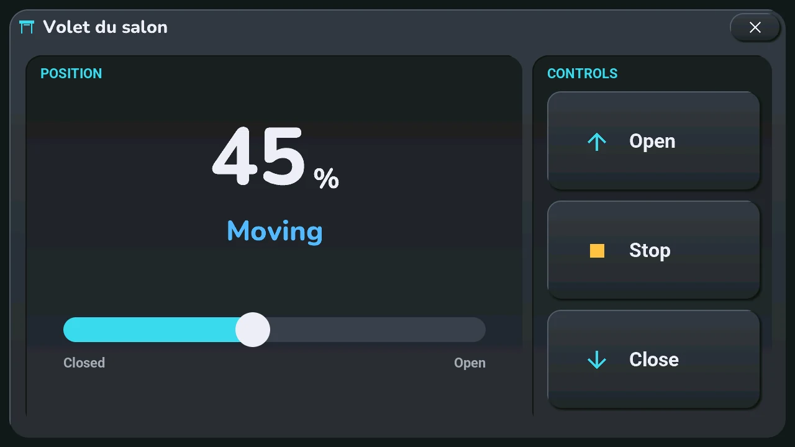
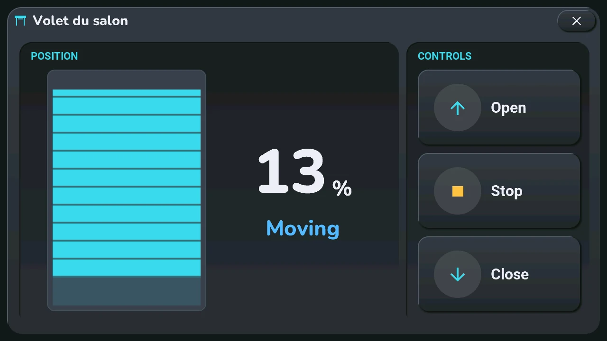
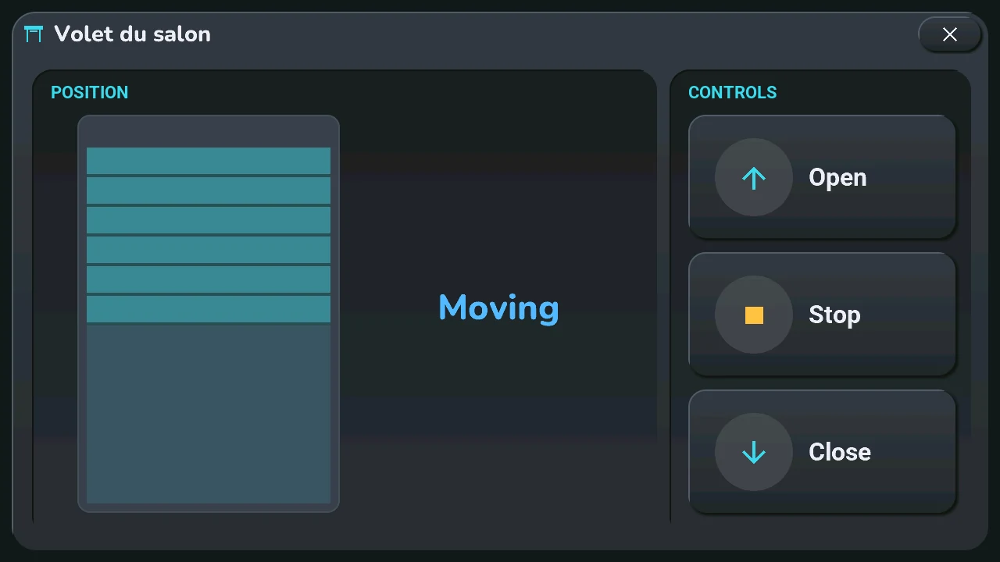
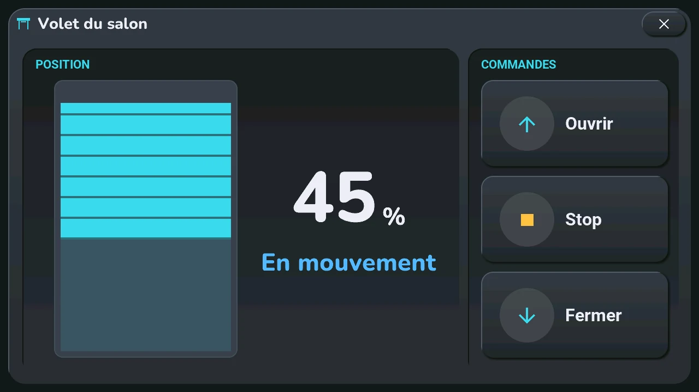
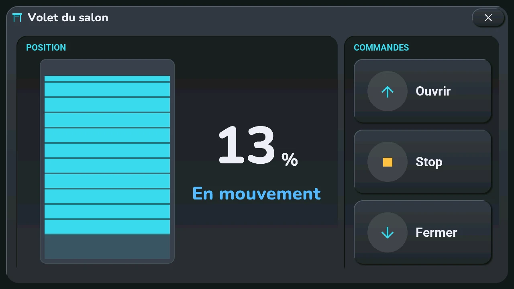
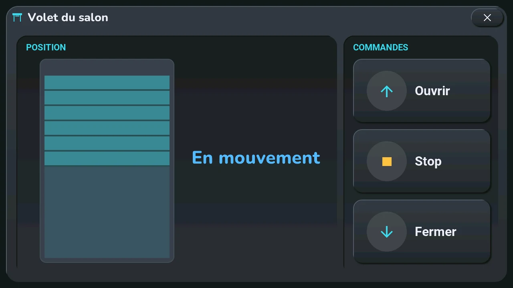

# Shutters

## English · [Français](#version-française)

---

**Opens with** a long press on a shutter or a valve (its card in device mode, or the weather icon of a card that holds it), then **Settings** among its [quick actions](tiles.md#quick-actions). A tap on the same place stops it while it moves, closes it when it is open, opens it otherwise ([bottom row](tiles.md)).

**Position** (left)

- A drawn shutter: its slats come down from the top as the shutter closes.
- **Drag it** up or down with a finger, from anywhere on the window, and **lift your finger**: the shutter goes to that position. The drawing and the number follow your finger; nothing leaves while you drag, and a simple touch sends nothing.
- To its right, the position in large digits and the state in words: « Open », « Closed », « Partly open », « Moving », « Offline ».
- The drawing follows the real shutter while it moves, never under your finger.

**Controls** (right): **Open**, **Stop**, **Close**.

A shutter that does not report its position cannot be dragged: the drawing shows its state (open at the top, closed at the bottom, half-way with faded slats otherwise) and the words, without a number:

A shutter card set to *confirm* in the blueprint does not open this window: its long press sends the other way, open or close, after a second press ([customised cards](tiles.md#tap-and-long-press-by-device)).

---

## Version Française

---

**S'ouvre par** un appui long sur un volet ou une vanne (sa carte en mode appareils, ou l'icône météo d'une carte qui le porte), puis **Réglages** parmi ses [actions rapides](tiles.md#actions-rapides). Un tap au même endroit l'arrête s'il bouge, le ferme s'il est ouvert, l'ouvre sinon ([rangée du bas](tiles.md#version-française)).

**Position** (à gauche)

- Un volet dessiné : ses lames descendent depuis le haut quand le volet se ferme.
- **Faites-le glisser** du doigt vers le haut ou le bas, depuis n'importe où sur la fenêtre, et **levez le doigt** : le volet va à cette position. Le dessin et le nombre suivent le doigt ; rien ne part pendant le glissement, et un simple toucher n'envoie rien.
- À sa droite, la position en grands chiffres et l'état en mots : « Ouvert », « Fermé », « Partiel », « En mouvement », « Hors ligne ».
- Le dessin suit le vrai volet pendant qu'il bouge, jamais sous votre doigt.

**Commandes** (à droite) : **Ouvrir**, **Stop**, **Fermer**.

Un volet qui ne donne pas sa position ne se fait pas glisser : le dessin montre son état (ouvert en haut, fermé en bas, sinon à mi-hauteur en lames estompées) et les mots, sans nombre :

Une carte de volet réglée sur *confirmer* dans le blueprint n'ouvre pas cette fenêtre : son appui long envoie l'autre sens, ouvrir ou fermer, après un second appui ([cartes personnalisées](tiles.md#tap-et-appui-long-par-appareil)).
