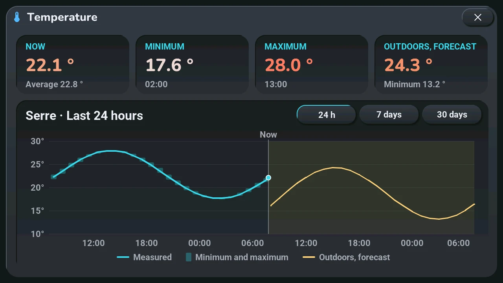
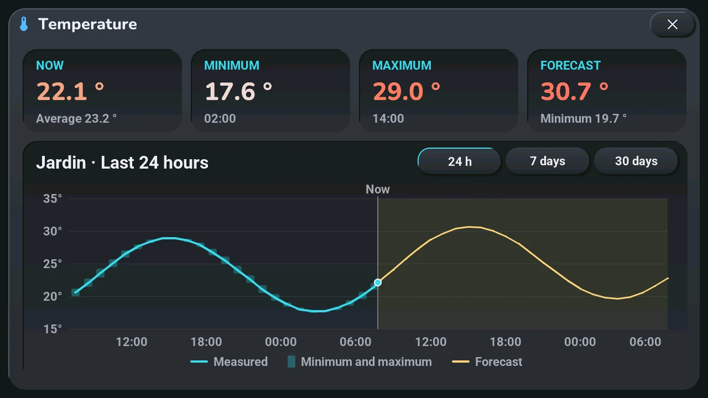
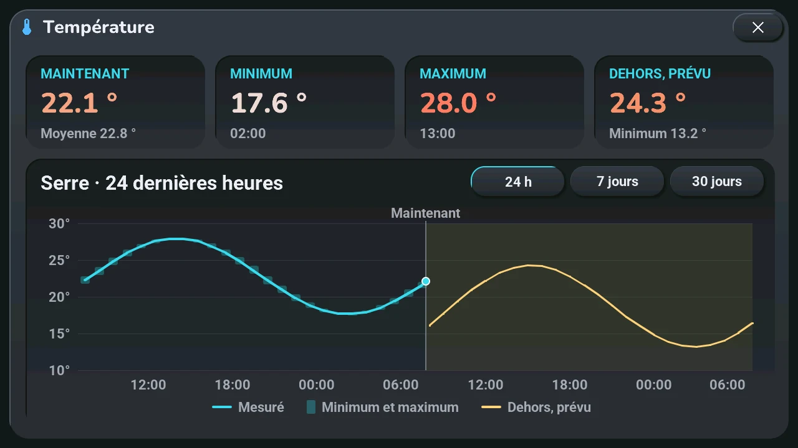
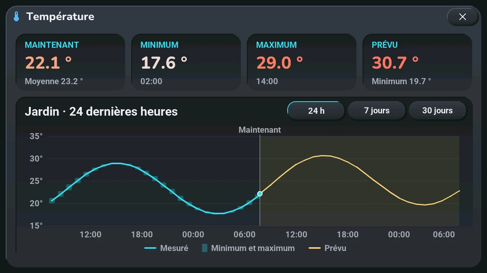

# Temperature

## English · [Français](#version-française)

---

**Opens with** a long press on one of the two temperatures of the [home screen](home.md): the room's, or the second one (greenhouse or outdoors). A tap on the second one still opens the [Arcade](arcade.md).

- **Top**: **Now** (and the average of the period), **Minimum** and **Maximum**, each with when it was reached. For the second temperature, a fourth card: the highest forecast temperature, and the lowest below it.
- **Bottom**: the curve, with the place and the period as title. **24 h** (hour by hour), **7 days** (every three hours), **30 days** (day by day). The line is the average; the pale bar behind it goes from the minimum to the maximum; the dot at the end is the temperature now.
- **Forecast**, for the second temperature only: in gold, on a tinted background after « Now ». A day-by-day forecast also has its minimum-maximum bar. If the blueprint says that temperature is outdoors (« La seconde température est dehors »), the forecast extends the curve and is named « Forecast »; otherwise (a greenhouse, another room) it stays apart, named « Outdoors, forecast ».

**Humidity.** When the place has a humidity sensor (the living room's « Salon — humidité », or a room's « Humidité de la pièce »), its curve is drawn on the same chart in the humidity colour, with its own scale in % on the right (the same grid lines as the degrees); the fourth card shows the humidity now and its range over the period. Without a humidity sensor, the window is exactly as before.

**One page per temperature.** Next to the title, one tab per known temperature: the living room, each room whose section declares a temperature, the second temperature. Tap a tab, or swipe left or right on the window, to show the next one; the view (24 h, 7 days, 30 days) stays the same. With a single temperature, there are no tabs.

**A room in HA mode.** If the room's section of the blueprint declares a temperature sensor (« Température de la pièce »), the home screen shows that room's temperature on the left while you are on it in HA mode, its humidity on the right with a drop when a humidity sensor is declared; a long press on either opens its history, with no forecast. If the section also declares a climate (« Climatisation de la pièce »), the − and + under it adjust that climate, and a tap on its setpoint opens its climate window. In weather mode, or on a room without these fields, the home screen shows the living room and the second temperature as before.

Home Assistant sends the curve only while the window is open, from its long-term statistics: the sensor needs a state class (thermometers have one), and the forecast is the weather entity picked for the tablet. Without statistics, the window says there is no history; before Home Assistant answers, it says it is waiting.

---

## Version Française

---

**S'ouvre par** un appui long sur l'une des deux températures de l'[écran d'accueil](home.md#version-française) : celle de la pièce, ou la seconde (serre ou dehors). Un tap sur la seconde ouvre toujours l'[Arcade](arcade.md#version-française).

- **En haut** : **Maintenant** (et la moyenne de la période), **Minimum** et **Maximum**, chacun avec le moment où il a été atteint. Pour la seconde température, une quatrième carte : la température prévue la plus haute, et la plus basse en dessous.
- **En bas** : la courbe, avec le lieu et la période pour titre. **24 h** (heure par heure), **7 jours** (toutes les trois heures), **30 jours** (jour par jour). La ligne est la moyenne ; la barre pâle derrière elle va du minimum au maximum ; le point au bout est la température du moment.
- **Prévision**, pour la seconde température seulement : en or, sur un fond teinté après « Maintenant ». Une prévision par jour a aussi sa barre du minimum au maximum. Si le blueprint dit que cette température est dehors (« La seconde température est dehors »), la prévision prolonge la courbe et s'appelle « Prévu » ; sinon (une serre, une autre pièce), elle reste à part, sous le nom « Dehors, prévu ».

**Humidité.** Quand l'endroit a une sonde d'humidité (« Salon — humidité » pour le salon, « Humidité de la pièce » pour une pièce), sa courbe est tracée sur le même graphique, dans la couleur de l'humidité, avec sa propre échelle en % à droite (les mêmes lignes de grille que les degrés) ; la quatrième carte montre l'humidité du moment et sa plage sur la période. Sans sonde d'humidité, la fenêtre est exactement celle d'avant.

**Une page par température.** À côté du titre, un onglet par température connue : le salon, chaque pièce dont la section déclare une température, la seconde température. Touchez un onglet, ou glissez vers la gauche ou la droite sur la fenêtre, pour passer à la suivante ; la vue (24 h, 7 jours, 30 jours) reste la même. Avec une seule température, pas d'onglet.

**Une pièce en mode HA.** Si la section de la pièce dans le blueprint déclare une sonde de température (« Température de la pièce »), l'écran d'accueil montre la température de cette pièce à gauche quand vous êtes dessus en mode HA, son humidité à droite avec une goutte quand une sonde d'humidité est déclarée ; un appui long sur l'une ou l'autre ouvre son historique, sans prévision. Si la section déclare aussi une clim (« Climatisation de la pièce »), le − et le + en dessous règlent cette clim, et un toucher sur sa consigne ouvre sa fenêtre de clim. En mode météo, ou sur une pièce sans ces champs, l'écran d'accueil montre le salon et la seconde température comme avant.

Home Assistant n'envoie la courbe que pendant que la fenêtre est ouverte, depuis ses statistiques longue durée : le capteur doit avoir une classe d'état (les thermomètres en ont une), et la prévision est celle de l'entité météo choisie pour la tablette. Sans statistiques, la fenêtre dit qu'il n'y a pas d'historique ; avant que Home Assistant réponde, elle dit qu'elle attend.
