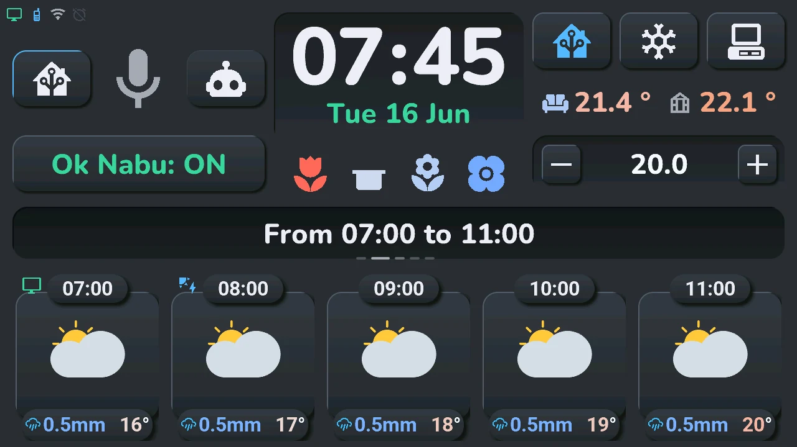
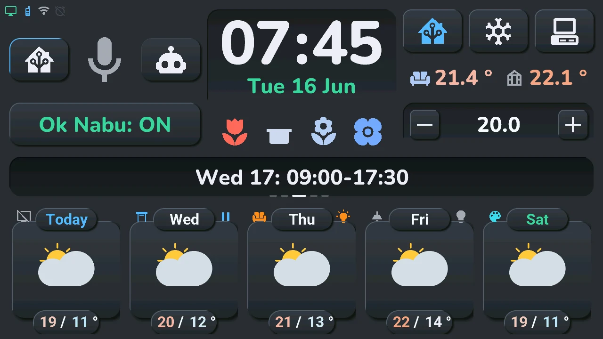
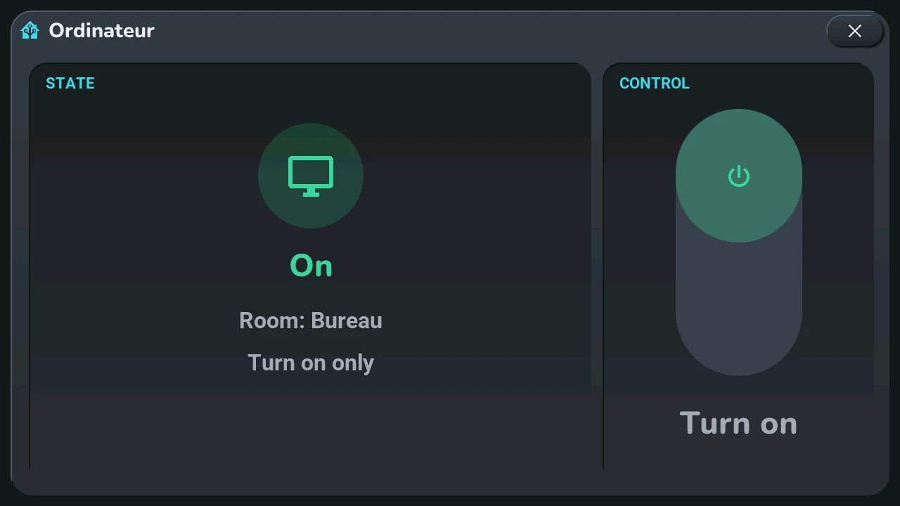
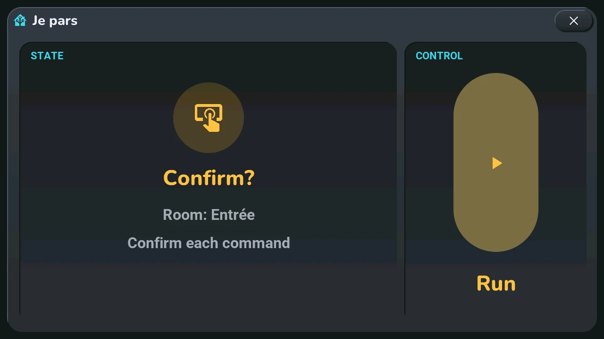
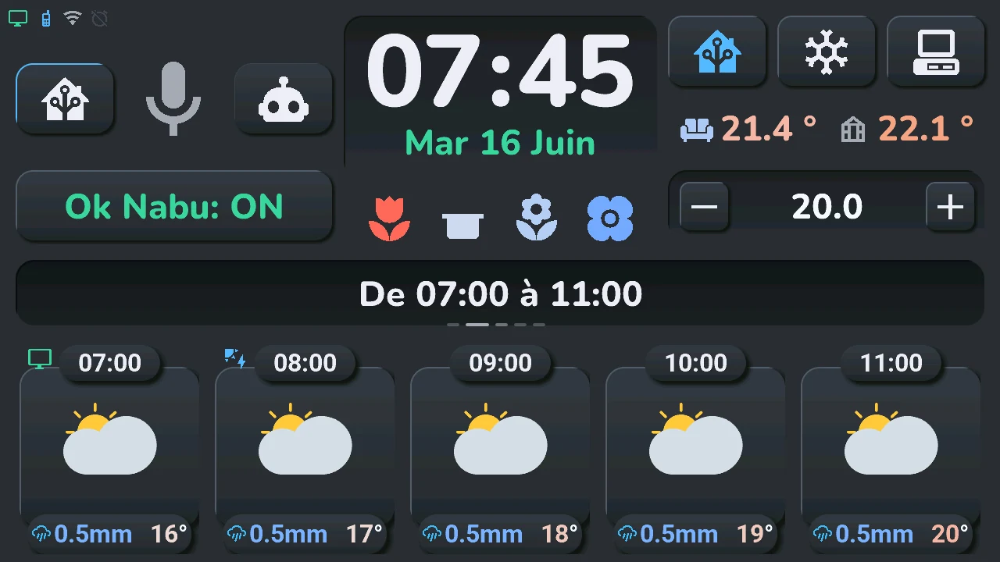
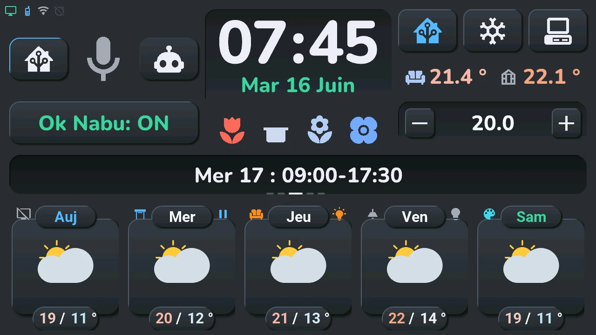
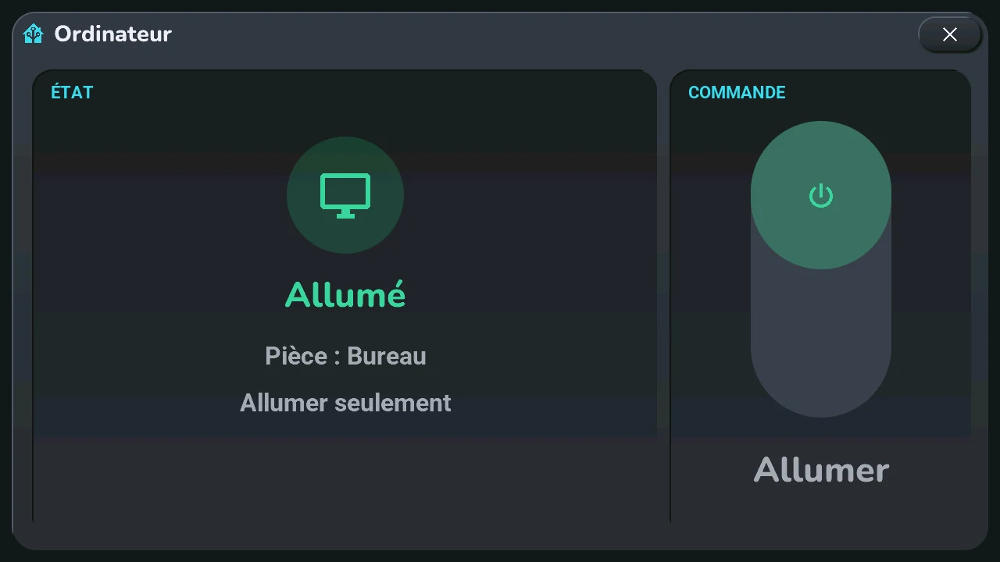
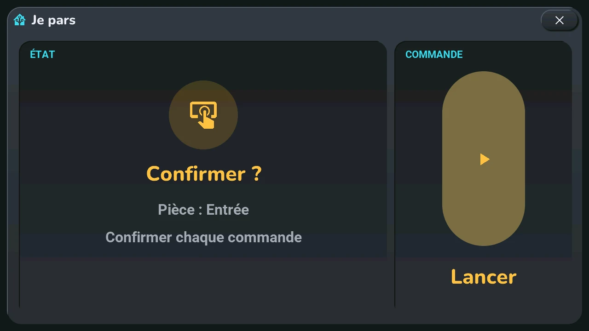

# Bottom row and rooms

## English · [Français](#version-française)

---

The five cards at the bottom show the **weather** (by default) or your **devices**, room by room. The Home Assistant button, top right, switches from one to the other.

## Weather

The home page shows today and the next four days.

- **Swipe** left or right on the bottom row or the central card: swipe left, days 6 to 10, then 11 to 15, then back to the home page; swipe right, the next hours, five per page, over two pages, then back to the home page. The dots under the central card show the page; the central card gives its dates.
- After 25 s without a touch, the home page comes back by itself.
- **Tap a day's temperatures** (the day pages): that day's work schedule, in the central card, for 6 s.
- **« Forecast from 11:42 »**, with a small clock, above the cards on the right: Home Assistant has sent no forecast for more than 30 minutes (it sends them every 10 minutes). The cards still show the last ones received, at that time (« yesterday 21:04 », or « 3 days old »). The line goes away with the next forecast. Usual causes: Home Assistant stopped or restarting, the Wi-Fi, or the « MAJ Ecran Tab5 ESPHome Push » automation turned off ([troubleshooting](../troubleshooting.md)). It does not see a weather service that stopped updating while Home Assistant keeps sending its last forecast.

**Your devices on the weather.** Each page of the weather is also a room. A card that holds a device shows it in its two top corners: on the left, its icon in the colour of its state; on the right, a bulb for a light, or for a shutter the arrow of its next move (pause while it moves). The large weather icon then works as the device's button: tap and long press as in the table below. To keep the weather alone, turn off the device switch « Tab5 Appareils sur la météo ».

## Your devices

A tap on the Home Assistant button: each card shows a device of the room, like a card of a Home Assistant dashboard: its icon in a round badge of its state's colour, its name and, under it, its state (« 71 % », « Off », « Moving », « Offline » when Home Assistant cannot reach it…). The central card gives the room, « Room 1/5 » and its name.

- **Swipe**: the next or previous room that has devices. With a single room, nothing happens.
- **Tap the room's name** in the central card: the [House](house.md) window, every room at once.
- Another tap on the Home Assistant button: back to the weather. Device mode never goes back by itself.

## Tap and long press, by device

On a device card, or on the weather icon of a card that holds a device:

| Device | Tap | Long press |
|---|---|---|
| Light | on / off | [quick actions](#quick-actions); set to *confirm*, the [lights window](lights.md) |
| Switch, plug, fan… | on / off | [device window](#device-window) |
| Shutter, valve | moving: stop; open: close; otherwise: open | [quick actions](#quick-actions) |
| TV, media player | on / off | [TV remote](tv.md), for the TV picked in the blueprint; another player: [device window](#device-window) |
| Scene, script, button | runs it; the state shows « OK » for a second | [device window](#device-window) |
| Climate | [climate window](climate.md), for this unit | [quick actions](#quick-actions); before Home Assistant sent its modes, the [climate window](climate.md) |
| Sensor of an « Énergie » section | [energy window](energy.md) | [energy window](energy.md) |
| Other sensor | — (it only shows its value) | — |

**Customised cards** (blueprint section « Personnaliser des tuiles », [step 6](../installation/devices.md)):

- *on only*: a tap turns the device on, never off;
- *confirm*: the first tap only asks, the state shows « Confirm? » and the icon turns amber; a second tap within 3 s sends. On a light or a shutter, the long press then shows no quick actions; on a shutter it sends the other way (open or close), confirmed the same way, instead of opening the window. In the device window, the large button asks the same way;
- *read only*: the card shows the state and does nothing, and opens no window.

## Quick actions

A long press on a light, a shutter or a climate opens a wheel on the card. In the middle, the device: its icon, its state, a thin gauge (brightness, position or target temperature) and its name. Above, a ring of round buttons:

- **Home**, on the left: the [house window](house.md), with every room (not there when the wheel is opened from that window);
- the device's main commands, and its families of settings, marked with a dot: a tap on a family unfolds its choices on a second ring, above it;
- **Details**, on the right: the device's full window ([lights](lights.md), [shutter](shutters.md), [climate](climate.md)).

| Device | First ring | Families (second ring) |
|---|---|---|
| Light with a dimmer | off when it is on, on when it is off | brightness 10, 25, 50, 75, 100 %; a colour light also has whites (warm, cream, cold) and colours (red, orange, gold, green, blue, purple) |
| Light without a dimmer | on, off | a colour light: whites and colours |
| Shutter, valve | open, stop, close | position 25, 50, 75 %, when it reports its position |
| Climate | off | mode (heat, cool, dry, fan only: those the unit has); target (the current one and two steps on each side); options (Eco, Boost, Quiet, Swing, Breeze: those the unit has) |

The current state glows in the card's colour. A tap on a command or a choice sends it and closes the wheel. A tap elsewhere, or on the device in the middle, folds the second ring, then closes the wheel. It also closes by itself after a while. A light set to *on only* has no « off ».

## Device window

A long press on a switch, a plug, a fan, a scene, a script, a button, or a media player that is not the blueprint's TV opens its window, like the « more info » window of a Home Assistant dashboard. Title: the card's name.

- **On the left**, its icon in a round badge of its state's colour, the state in words (« On », « Off », « Play », « Offline »…; « Ready » for a scene), its room, and the card's customisation (« Turn on only », « Confirm each command »).
- **On the right**, a large switch: filled at the top and coloured when the device is on, at the bottom and grey when it is off, filled for a scene. A tap does exactly what a tap on the card does: on / off (on only for a card set to *on only*), or runs the scene; under it, what a tap will do. A card set to *confirm* asks here too: the first tap only arms (« Confirm? », amber), a second within 3 s sends.

- The window follows the device while it is open. The cross, or a tap outside the card, closes it.

---

## Version Française

---

Les cinq cartes du bas montrent la **météo** (d'origine) ou vos **appareils**, pièce par pièce. Le bouton Home Assistant, en haut à droite, passe de l'une à l'autre.

## Météo

La page d'accueil montre aujourd'hui et les quatre jours suivants.

- **Glisser** vers la gauche ou la droite sur la rangée du bas ou la carte centrale : vers la gauche, les jours 6 à 10, puis 11 à 15, puis retour à la page d'accueil ; vers la droite, les heures qui viennent, cinq par page, sur deux pages, puis retour à la page d'accueil. Les points sous la carte centrale montrent la page ; la carte centrale donne ses dates.
- Après 25 s sans toucher, la page d'accueil revient seule.
- **Tap sur les températures d'un jour** (pages des jours) : le planning de travail de ce jour, dans la carte centrale, pendant 6 s.
- **« Prévisions de 11 h 42 »**, avec une petite horloge, au-dessus des cartes à droite : Home Assistant n'a pas envoyé de prévisions depuis plus de 30 minutes (il les envoie toutes les 10 minutes). Les cartes montrent encore les dernières reçues, à cette heure-là (« d'hier 21 h 04 », ou « vieilles de 3 jours »). La ligne disparaît à l'arrivée des suivantes. Causes habituelles : Home Assistant arrêté ou qui redémarre, le Wi-Fi, ou l'automatisation « MAJ Ecran Tab5 ESPHome Push » désactivée ([dépannage](../troubleshooting.md#version-française)). Elle ne voit pas un service météo qui ne se met plus à jour pendant que Home Assistant continue d'envoyer ses dernières prévisions.

**Vos appareils sur la météo.** Chaque page de la météo est aussi une pièce. Une carte qui porte un appareil le montre dans ses deux coins du haut : à gauche, son icône dans la couleur de son état ; à droite, une ampoule pour une lumière, ou pour un volet la flèche de son prochain mouvement (pause pendant qu'il bouge). La grande icône météo sert alors de bouton à l'appareil : tap et appui long comme dans le tableau plus bas. Pour garder la météo seule, éteignez l'interrupteur « Tab5 Appareils sur la météo » de l'appareil.

## Vos appareils

Un tap sur le bouton Home Assistant : chaque carte montre un appareil de la pièce, comme une carte d'un tableau de bord Home Assistant : son icône dans une pastille ronde de la couleur de son état, son nom et, dessous, son état (« 71 % », « Éteint », « Mouvement », « Hors ligne » quand Home Assistant ne le joint pas…). La carte centrale donne la pièce, « Pièce 1/5 » et son nom.

- **Glisser** : la pièce suivante ou précédente qui a des appareils. Avec une seule pièce, rien ne se passe.
- **Tap sur le nom de la pièce** dans la carte centrale : la fenêtre [Maison](house.md#version-française), toutes les pièces d'un coup.
- Un nouveau tap sur le bouton Home Assistant : retour à la météo. Le mode appareils ne revient jamais seul à la météo.

## Tap et appui long, par appareil

Sur une carte d'appareil, ou sur l'icône météo d'une carte qui porte un appareil :

| Appareil | Tap | Appui long |
|---|---|---|
| Lumière | allumer / éteindre | [actions rapides](#actions-rapides) ; réglée sur *confirmer*, la [fenêtre des lumières](lights.md#version-française) |
| Interrupteur, prise, ventilateur… | allumer / éteindre | [fenêtre de l'appareil](#fenêtre-de-lappareil) |
| Volet, vanne | en mouvement : stop ; ouvert : fermer ; sinon : ouvrir | [actions rapides](#actions-rapides) |
| TV, lecteur multimédia | allumer / éteindre | [télécommande TV](tv.md#version-française), pour la TV choisie dans le blueprint ; un autre lecteur : [fenêtre de l'appareil](#fenêtre-de-lappareil) |
| Scène, script, bouton | le lance ; l'état affiche « OK » une seconde | [fenêtre de l'appareil](#fenêtre-de-lappareil) |
| Clim | [fenêtre de la clim](climate.md#version-française), pour cet appareil | [actions rapides](#actions-rapides) ; avant que Home Assistant ait envoyé ses modes, la [fenêtre de la clim](climate.md#version-française) |
| Capteur d'une section « Énergie » | [fenêtre de l'énergie](energy.md#version-française) | [fenêtre de l'énergie](energy.md#version-française) |
| Autre capteur | — (il montre seulement sa valeur) | — |

**Cartes personnalisées** (section « Personnaliser des tuiles » du blueprint, [étape 6](../installation/devices.md#version-française)) :

- *allumer seulement* : un tap allume l'appareil, jamais ne l'éteint ;
- *confirmer* : le premier tap demande seulement, l'état affiche « Confirmer ? » et l'icône passe en ambre ; un second tap dans les 3 s envoie. Sur une lumière ou un volet, l'appui long ne montre alors pas d'actions rapides ; sur un volet il envoie l'autre sens (ouvrir ou fermer), confirmé de la même façon, au lieu d'ouvrir la fenêtre. Dans la fenêtre de l'appareil, le grand bouton demande de la même façon ;
- *lecture seule* : la carte montre l'état, ne fait rien et n'ouvre aucune fenêtre.

## Actions rapides

Un appui long sur une lumière, un volet ou une clim ouvre une roue sur la carte. Au centre, l'appareil : son icône, son état, une fine jauge (luminosité, position ou consigne) et son nom. Au-dessus, un anneau de boutons ronds :

- **Maison**, à gauche : la [fenêtre Maison](house.md#version-française), avec toutes les pièces (absent quand la roue est ouverte depuis cette fenêtre) ;
- les commandes principales de l'appareil, et ses familles de réglages, marquées d'un point : un tap sur une famille déplie ses choix sur un second anneau, au-dessus d'elle ;
- **Détails**, à droite : la fenêtre complète de l'appareil ([lumières](lights.md#version-française), [volet](shutters.md#version-française), [clim](climate.md#version-française)).

| Appareil | Premier anneau | Familles (second anneau) |
|---|---|---|
| Lumière à variateur | éteindre quand elle est allumée, allumer quand elle est éteinte | luminosité 10, 25, 50, 75, 100 % ; une lumière à couleur a aussi les blancs (chaud, crème, froid) et les couleurs (rouge, orange, or, vert, bleu, violet) |
| Lumière sans variateur | allumer, éteindre | une lumière à couleur : blancs et couleurs |
| Volet, vanne | ouvrir, stop, fermer | position 25, 50, 75 %, s'il donne sa position |
| Clim | arrêt | mode (chaud, froid, sec, ventilation : ceux de l'appareil) ; consigne (l'actuelle et deux pas de chaque côté) ; options (Éco, Boost, Silence, Oscillation, Brise : celles de l'appareil) |

L'état actuel brille de la couleur de la carte. Un tap sur une commande ou un choix l'envoie et ferme la roue. Un tap ailleurs, ou sur l'appareil au centre, replie le second anneau, puis ferme la roue. Elle se ferme aussi toute seule au bout d'un moment. Une lumière réglée sur *allumer seulement* n'a pas « éteindre ».

## Fenêtre de l'appareil

Un appui long sur un interrupteur, une prise, un ventilateur, une scène, un script, un bouton, ou un lecteur multimédia qui n'est pas la TV du blueprint ouvre sa fenêtre, comme la fenêtre « plus d'infos » d'un tableau de bord Home Assistant. Titre : le nom de la carte.

- **À gauche**, son icône dans une pastille ronde de la couleur de son état, l'état en mots (« Allumé », « Éteint », « Lecture », « Hors ligne »… ; « Prêt » pour une scène), sa pièce, et la personnalisation de la carte (« Allumer seulement », « Confirmer chaque commande »).
- **À droite**, un grand interrupteur : rempli en haut et en couleur quand l'appareil est allumé, en bas et gris quand il est éteint, plein pour une scène. Un tap fait exactement ce que fait un tap sur la carte : allumer / éteindre (allumer seulement pour une carte *allumer seulement*), ou lancer la scène ; dessous, ce que fera le tap. Une carte *confirmer* demande ici aussi : le premier tap arme seulement (« Confirmer ? », en ambre), un second dans les 3 s envoie.

- La fenêtre suit l'appareil tant qu'elle est ouverte. La croix, ou un tap hors de la carte, la ferme.
