# Screens & Features

## English · [Français](#version-française)

---

This page describes what the Tab5 actually shows and does — verified against the firmware (`tab5-lvgl.yaml`, `ui_components/*.yaml`, `tab5_*.cpp`) on 2026-07-06, re-checked 2026-07-14 (info panel, console button, swipe zones). The previous version of this page described a 6-tab, multi-screen navigation bar that no longer exists (and may never have shipped) — see [ADR-0002](decisions/0002-single-page-swipe-navigation.md) for why. If anything below stops matching the running firmware, the firmware is right — fix this page.

---

## Layout overview

There is a **single 1280×720 page** (`page_main`), not a tab-navigated set of screens. Three regions:

1. **Home area** — always visible: clock, indoor sensors, quick actions, compact climate card, plant moisture card.
2. **Central card** — a small area that automatically rotates between planning, rain forecast, weather alerts and an info panel (calendar recap / alert text).
3. **Bottom card region** — either the 5-card weather forecast (with the devices of each page's room in the tiles' shoulders), or, in HA mode, the 5 device cards of the current room.

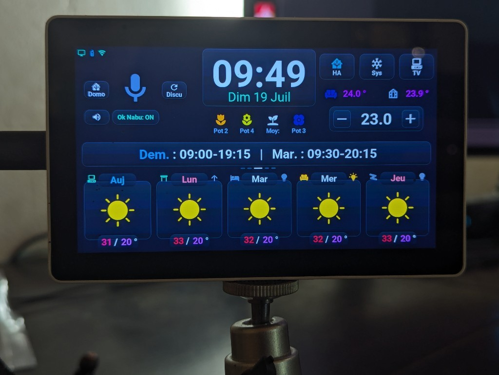

Overlays that open fullscreen on top of this: the **climate popup** (tap the compact climate card), the **light popup** (long-press a light shortcut), the **TV remote popup** (`tv_remote_popup.yaml` — Samsung IR pad via HA `remote.*`), the **assistant popup** (long-press on the mic zone — STT transcription + LLM reply in Markdown), the **calendar popup** (long-press on the clock — monthly grid with work hours), the **plant details popup** (long-press on moisture slots — 5 sensor cards), and the **Arcade selector** (tap on the greenhouse temperature — 4×2 grid of 8 game consoles). A **system console** (memory/network/system diagnostics, volume, plus an HA management card: screen re-push, automation reload, HA restart and device reboot behind confirm overlays) opens via the console button (`btn_control_console`, top right) — not by swipe since the 14/07/2026 gesture rework.

---

## Generated screenshots

These pictures are not photos: the CI draws them without a tablet, from the same interface code, on every pull request that touches the screen ([ADR-0021](decisions/0021-host-render-stubs.md), workflow `rendu-host.yml`). The three scenes are those of [demo mode](demo_mode.md), on a fixed date (16 June, 07:45, Paris time), in French then in English. They are also the references the CI compares new renders with, so they match the current firmware.

| Scene | Français | English |
|---|---|---|
| Sunny day |  |  |
| Rain and orange warning |  |  |
| Day off, plants to watch |  |  |

---

## Home area

Always-visible content at the top of the screen:
- **Status icons**, top left, from left to right: PC (green when on), phone (colour of its battery), Wi-Fi, alarm, **solar production** when the Energy section of the blueprint has a solar power sensor and the panels' peak power (its colour gives the production as a share of the peak, on the battery scale: green above 80 %, blue, amber, red below 20 %; a grey panel at 0 %, at night), and the **tablet's own battery** when the device switch **Tab5 Batterie montée** is on (off by default: without a battery the charger reads "charging, 100 %"). The battery glyph follows the level (full above 80 %, half, low, "!" below 20 %, a bolt while charging, "?" with no reading), in the same colours as the phone. A hidden icon leaves no gap: the others close up.
- Current time and date
- Indoor temperature and humidity
- Microphone icon with pipeline state color (see Voice assistant below), between the two voice-mode buttons (Home Assistant agent vs. conversation/LLM pipeline), and under them the wide **Ok Nabu: ON / OFF** wake-word button (the mute button is in the assistant popup since 2026-10-05)
- **HA**, **Sys** and **TV** buttons, top right. The home buttons show their icon only, all at the same size (125 × 90, icons of 70 px); the three columns of the top area sit 20 px from the screen edges like the central card, with their tops aligned at y 20 and their bottoms at y 308, 25 px above the central card
- **Compact climate card** — current temperature (living room + greenhouse/serre sensors) and the target temperature with +/− buttons; tapping the target opens the climate popup (see Climate below)
- **Plant moisture card** — 4 slots for up to 5 BLE soil moisture sensors (see Plant moisture below)

---

## Central card — planning / rain / alerts / info

A single card rotates automatically every 8 seconds (script `tab5_central_rotator_auto`, `tab5-scripts.yaml`; not while the screen is off or a popup is open) between up to eight panels: planning, rain, weather alerts, info and up to four HA alert slots. The rotation only runs on the default forecast window — swiping to another forecast window replaces the central card with a page-title overlay (`page_title_wrapper`) and pauses the rotation until you swipe back. That overlay is two lines built in `forecast_page_title_parts()` (`tab5_*.cpp`): a dim kicker naming the family and rank of the window (`Prévisions journalières · 2/3`) above the actual span of the 5 visible tiles — `Du mercredi 5 août au dimanche 9 août` for daily windows (day names/dates from SNTP, `1er` for the first of the month), `De 14:00 à 18:00` for hourly ones, always oldest → newest even though the hourly tiles are laid out right-to-left. If the dates aren't available yet (SNTP not synced and no HA payload), the kicker takes the main line on its own. Tapping a forecast card's temperature (see below) can also interrupt the rotation for a few seconds to show a specific day's schedule.

- **Planning** — part of the rotation unless Home Assistant has no work calendar (optional zone, lot 5). Shows the day's schedule.
- **Rain forecast** — only rotated in if `has_rain` is true. A short-term rain graph: one data point every 5 minutes for the first 30 minutes, then every 10 minutes for the following 30 minutes (9 points total, 1-hour window), sourced from Météo-France via the `tab5_maj_pluie_1h_bulk` API service (the 9 bars in one call).
- **Weather alerts** — only rotated in if `g_central_ctx.has_mf_alerts` is true. Shows one icon per active Météo-France vigilance type (wind, flooding, storms, etc.), each icon colored by its own severity: yellow (vigilance jaune), orange, or red (vigilance rouge) — the official Météo-France color codes, not to be changed.

**The date, not "a day", changes color with the current overall alert level:** independently of the rotation above, the date text under the clock in the home area (`lbl_date`, e.g. "Lun 06 Juil") is recolored every time an alert payload is received, based on the *overall* vigilance level for the day (green/default if none, pale yellow/orange/pale red for jaune/orange/rouge) — see `tab5-api-logic.yaml` in the `tab5_maj_alerte_meteo_france` service. This is separate from the per-type icon coloring in the alert panel above, which uses each alert type's own individual level rather than the overall one.

- **Info panel** — only rotated in if `has_info` is true. Shows either a 3-day calendar recap (multi-line, with inline color markup) or a Météo-France alert banner (single line, colored by severity), pushed by HA via the `tab5_maj_info_texte` service (`update_info_text_ui()`, `tab5_*.cpp`). **Tap dismisses it** (`tab5_dismiss_info_tap` → `dismiss_central_info_immediate`): the panel leaves the rotator immediately; the id is stored in `tab5_dismissed_local` so a re-push of the same id stays hidden until HA sends a new one.
- **HA alert / info slots (up to 4)** — pushed by `tab5_maj_alertes_ha_bulk` into `ha_alert_wrapper_0…3`. Each slot is its own rotator panel; **tap dismisses that slot** (`tab5_dismiss_ha_alert`, slot 0-3 → `dismiss_ha_alert_slot_immediate`) with the same local-dismiss behavior.

If neither rain, MF alerts, info nor HA alert slots are active, the rotation just keeps planning on screen (and leaves the card empty without planning).

**Temporary override:** tapping the max/min temperature on any of the 5 bottom forecast cards interrupts the rotation for **6 seconds** to show that specific day's opening-hours text in the central card, then automatically restores the previously active panel (`show_temporary_planning()`, `tab5_*.cpp` — this used to be an ESPHome script in `tab5-scripts.yaml`, moved to C++ in the 12/07 reboot fix).

---

## Bottom card region — rooms

Since 3.2 ([ADR-0023](decisions/0023-rooms-generic-tiles.md)) each of the 5 pages of the bottom row is also a **room** of up to 5 devices, described by Home Assistant (blueprint « Tab5 — emplacements », action `tab5_maj_tuiles`; states through `tab5_maj_emplacements`, keys `tRT`). Room 0 is the home page (days 0-4), rooms 1 and 2 the next daily pages (swipe left), rooms 3 and 4 the hourly pages (swipe right); tile T is the visual position, 0 = left. The definitions are kept in NVS, so the rooms are drawn before HA answers; the states are not (greyed « -- » until the first push). Model and drawing: `tab5_tuiles.cpp`.

The `btn_control_ha` button (top right, Home Assistant icon) toggles the region between the **weather mode** and the **HA mode** (`tuiles_mode_ha()`, flag `g_central_ctx.ha_mode`). It shows an accent border and icon while HA mode is on, and is hidden when no room has a device. « Aller à l'écran → Accueil » (the Home Assistant select) leaves HA mode.

### Weather mode (default)

5 cards, navigated by **left/right swipe**, in 5 windows: 2 hourly + 3 daily (non-wrapping — swiping past the last window does not loop back to the first; see the [false positives note](troubleshooting.md#false-positives-worth-knowing-about-dont-fix-these-again) in `docs/troubleshooting.md`).

**Hourly windows (2):** the next 15 time slots, 5 per window. Each card shows a time label, a two-layer weather condition icon (`IconeMeteo.ttf`), a color-coded temperature, and rainfall in mm (or `-` if dry). There is no separate wind-speed reading — "windy" is one of the possible weather *condition* icons (alongside sun/cloud/rain/snow/fog), not a distinct data field.

**Daily windows (3):** a 15-day forecast, 5 days per window. Each card shows:
- Day name, color-coded (see Color coding below)
- Weather condition icon (same two-layer system)
- Max and min temperature, individually color-coded — **tapping this shows that day's schedule in the central card for 6 seconds** (see above)

**Device shoulders and quick action.** On every page, a tile that holds a device of that page's room shows it in its two « shoulders », left and right of the title tab — left: the device's icon ([palette](tiles_icons.md)) coloured by its state; right: a bulb (light) or the arrow of a shutter's next move (pause while it moves), nothing for the other types — and an invisible button over the weather icon (`btn_jN_action` on the daily pages, `btn_hN_action` on the hourly ones) sends the tile's command; the weather keeps showing. A page without devices looks as before 3.2.

| Type | Tap | Long press |
|------|-----|------------|
| `lum` light | toggle (`allumer` with option `o`) | light popup, on this light |
| `int` switch, fan… | toggle (`allumer` with `o`) | — |
| `vol` cover, valve | moving → stop; open → close; else open | the other of open / close |
| `med` media player | toggle | TV remote (option `t`) |
| `act` scene, script, button | run — the state line shows « OK » for 1 s | — |
| `cap` sensor, `bin` binary sensor | read only | — |
| `cli` climate | climate popup: the blueprint's climate (option `m`), else the tile's own ([ADR-0027](decisions/0027-climate-per-tile.md)) | — |

Option `k` asks for a second tap within 3 s (the state line asks « Confirmer ? », the icon turns amber); option `r` makes the tile read only.

**Legacy mode (3.x blueprint).** Until the first definitions arrive (a firmware updated before its blueprint), room 0 is built from the 3.x slots and looks as in 3.1: card 1 PC/TV (shoulder = TV state, or PC state without a TV; long press = TV remote), card 2 the shutter, cards 3-5 the bedroom, living room and LED lights (long press = light popup), with the 3.x commands. On the shutter card, tapping the **title** flips the direction the next tap will send (the arrow in the top-right corner shows it); tapping the icon sends stop while the shutter moves, else open or close.

### HA mode

The 5 cards (`switches_card.yaml`) show the room of the current page: icon from the palette (70 px), name (title tab, cut with « … »), a state line translated by the tablet — « 60 % », « Allumé » / « Éteint », « Mouvement » / « 45 % » / « Ouvert » / « Fermé », « Lecture » / « Pause », « Lancer », a sensor's value and unit, « Détecté » / « Présent » / « Verrouillé »… by device class, a climate's room temperature; « Hors ligne », greyed, when the entity is unavailable — and a colour by type and state (a light's own colour when it reports one). Empty tiles are hidden and the others centred. The central card shows « Pièce n/N » above the room's name; the rotator pauses. Tap and long press as in the table above.

**Swipe in HA mode** goes to the next / previous room that has a device, in the order of the weather pages (same wrap); the weather layers stay hidden and the pagination dots follow. With one room only, a swipe does nothing. Entering HA mode on a page without devices jumps to the nearest room that has some; leaving it shows the weather of the current page.

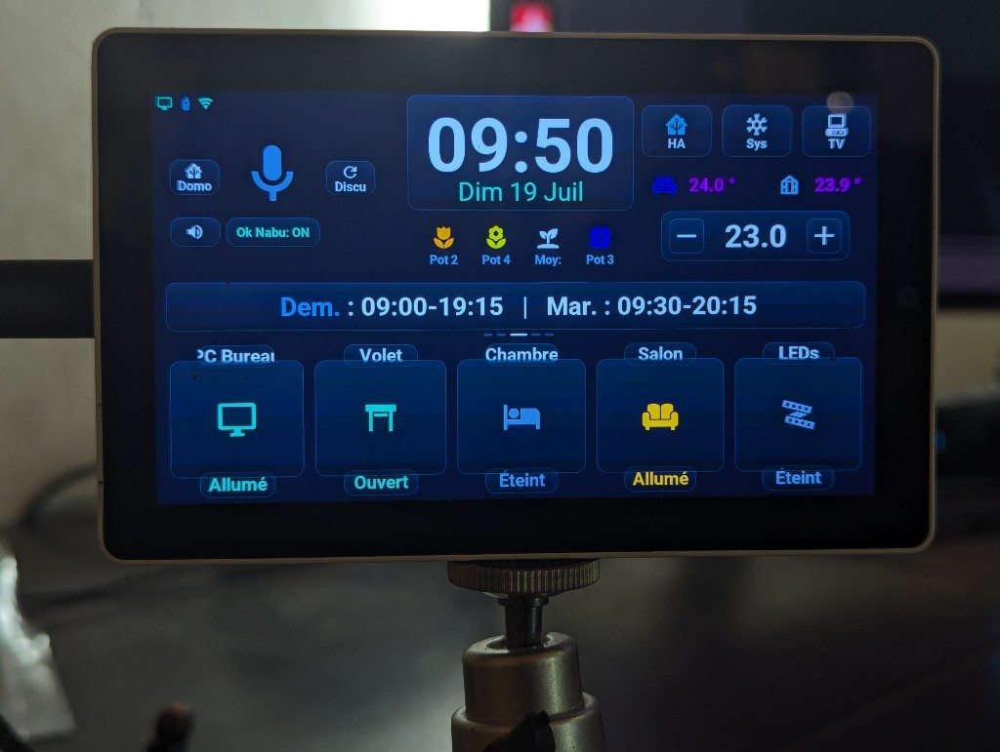

---

## Climate

Two levels of control. The compact card drives the blueprint's `climate` entity (input « Climatisation »); the popup drives the same one, or the climate of the tile that opened it:

- **Compact card** (always visible in the home area) — current temperature and target with +/− buttons. Always the blueprint's climate.
- **Climate popup** (near-fullscreen, 1250×690 card 15 px from the screen edges, opened by tapping the compact card, a climate tile, or « Aller à l'écran → Climatisation ») — three glass cards:
  - **MODE**: Froid / Chaud / Sec / Ventilation / Éteint, stacked full-width (icons colored by the active mode, driven by `tab5_maj_clim`)
  - **TEMPÉRATURE**: a 320 px arc thermostat with the target shown large in the center, − / + buttons, and the actual room temperature at the bottom. Bounds, step and unit are the unit's own (16–30 °C and 0.5 until Home Assistant sends them, see below). The target updates **immediately** (optimistic) and a single `climate.set_temperature` is sent once the gesture ends (250 ms debounce — rapid ± taps are grouped)
  - **OPTIONS**: Éco / Boost presets (toggle), Silence (fan quiet), and airflow **Oscillation** / **Brise** (`windnice`, a Daikin Onecta mode previously unreachable from the screen)
  - **Any brand** ([ADR-0026](decisions/0026-climate-from-device.md)): the blueprint sends the unit's settings (key `climr`: `min_temp`/`max_temp`, `target_temp_step`, °C or °F, the modes it has, its name). The title becomes the unit's name, the arc and the ± buttons follow its bounds and step, and a button the unit cannot do disappears — an OPTIONS section left without a button disappears with its title and the others move up. The buttons still send the Daikin names (Éco = `away`, Silence = `quiet`, `swing` / `stop`), and the blueprint translates them to the unit's own (`eco`, `low`, `off`, `vertical`…), or sends nothing when the unit has no equivalent.
  - **Any climate tile** ([ADR-0027](decisions/0027-climate-per-tile.md)): a `cli` tile of a room opens the popup on its own unit — its settings (key `crRT`, same fields as `climr`) and its state (key `ceRT`) come with the tiles, and its buttons send the same commands with `emplacement: tRT`, translated by the blueprint the same way. Its target and mode reach the popup at once, its fan / swing / preset and room temperature within 5 minutes (with the measurements). A tile with option `m` is the blueprint's climate. Until Home Assistant sent the tile's settings (older blueprint), tapping it does nothing. The compact card keeps showing the blueprint's climate meanwhile, and closing the popup brings it back to that one.
  - Tapping the dark overlay or the × button (a real 96×64 glass button) closes the modal. 6 of the 10 buttons are factorized templates (cool/heat/fan/dry, eco/boost); the remaining 4 (off/swing/windnice/quiet) and the ± buttons are deliberately left as individual YAML — see [ADR-0007](decisions/0007-climate-popup-not-factorized.md).

The controls are dimmed (not hidden) when the AC is off, so the layout stays stable.

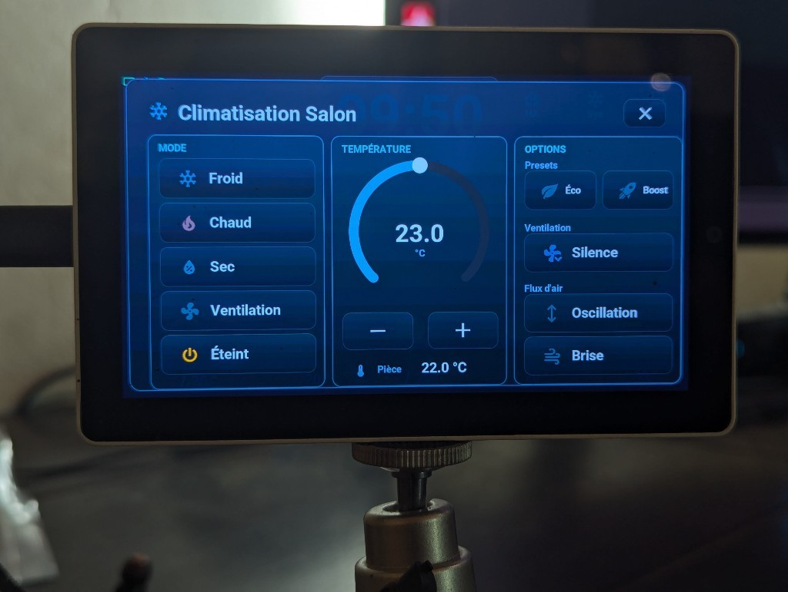

---

## Plant moisture card

Monitors up to 5 BLE soil moisture sensors, but only **4 slots are shown** (`sort_and_update_moisture_slots()`, `tab5_*.cpp`). The sensors are sorted by moisture level (driest to wettest) each update, then mapped to slots as: driest, 2nd-driest, **the median-ranked sensor** (it shows that one sensor's raw reading, it is not a computed arithmetic average of all 5), and wettest. Because the mapping is by rank rather than by fixed sensor identity, *which* physical pot appears in which slot changes over time as moisture levels shift.

Each slot shows the sensor's icon only, in its moisture-level color (see Color coding below), at the size of the home buttons; the pot names and readings are in the plant details popup (long press). The "Pot N" / "Moy:" caption under each icon was removed on 2026-10-05.

### Plant details popup — long press

A **long press anywhere on the moisture card** opens a near-fullscreen modal (1250×690 card, 15 px from the screen edges) with **5 fixed glass cards — one per sensor** (card N = sensor `moisture_N`, same icon as the dashboard, no dynamic sorting here). Each card shows:

- the pot name and its plant icon, colored by moisture level (same scale as the dashboard)
- the soil-moisture % (large) and a watering status: **OK** (green), **Bientôt sec** (≤ 20 %, amber), **À arroser !** (≤ 14 %, red — aligned with the `get_humidity_color()` red zone) or **Hors ligne** (sensor unavailable)
- four metric rows: **Fertility** (EC conductivity, µS/cm), **Light** (lx), **Temperature** (°C, `get_temperature_color()` gradient) and sensor **Battery** (%, `get_battery_color()` scale)

Values are pushed continuously by the `pot*_ec/lux/temp/bat` HA sensors (`update_pot_metric_ui()`, `tab5_*.cpp`) — the popup needs no sync on open. Tapping the dark overlay or the × button (real 96×64 glass button) closes it. Components: `pots_popup.yaml` + `pot_detail_card.yaml` (5 instances).

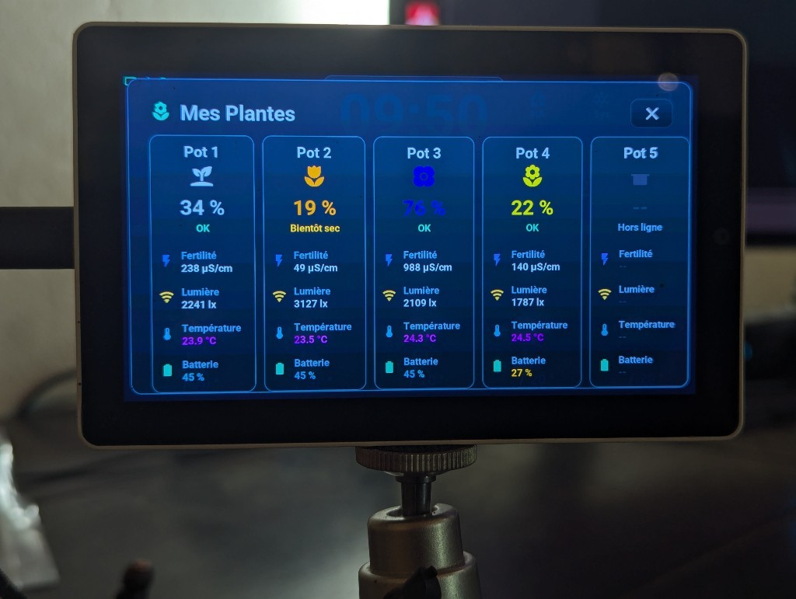

---

## Calendar popup — long press on the clock

A **long press on the clock/date tile** opens a near-fullscreen monthly calendar (1250×690 card, 15 px from the screen edges): a 7×6 Monday-first grid with ◀ / ▶ month navigation and an "Aujourd'hui" (today) button. The grid itself — day numbers, Monday-Sunday alignment, weekend dimming, today highlight (cyan border) and past-day fade — is computed **locally** from the SNTP clock (`cal_render_month()`, Sakamoto's algorithm), so the calendar works even with HA offline.

Home Assistant then enriches each viewed month **on demand** (`script.tab5_calendrier_mois` → `tab5_maj_calendrier_mois`, cached per month, cache cleared on open):

- **work hours printed inside each day cell** ("09:30-20:15", pink when the shift starts before 9 am — same convention as the central planning banner), from the work calendar (the events whose title holds the « Tab5 · mot des événements de travail » keyword, or all of them)
- **public holidays** — day number turns rose (whitelist of real French holidays; civil observances like Mother's Day only appear in the day detail)
- **school holidays** — soft violet cell background, from the calendar chosen in « Tab5 · agenda des vacances scolaires » (in France, the ministry's ICS file of your zone; until 2026-09-29, a static Zone A table)
- **appointments** (gold dot) and **birthdays** (pink dot) from the family/birthday calendars

**Tapping a day** opens a 780×540 detail sub-popup (`script.tab5_calendrier_jour`): "Mardi 21 Juillet" title and up to 6 typed lines with colored MDI icons — holiday name, school-holiday label, work hours, timed appointments, birthdays, civil observances — with "Chargement...", "Rien de prévu ce jour" and "Home Assistant hors ligne" states. Closing follows the v2 popup recipe (real 96×64 glass × buttons, `scrollable: false` everywhere). Components: `calendar_popup.yaml` + `cal_grid_build()` (42 cells built in C++) + HA package `HomeAssistant_Config/packages/tab5_calendar.yaml`.

---

## Alarm clock — short tap on the clock

A **short tap on the clock/date tile** opens the alarm settings (1250×690 modal card); the long press still opens the calendar. A small bell in the top status row shows the state at a glance: **green** = armed with a computed ring time, **amber** = armed but no day qualifies (the classic trap of "work days" mode during a holiday week), **struck through and dim** = off.

**The alarm rings without Home Assistant.** The time comes from SNTP, the next 15 days of work hours are already cached on the device (`cal_jours_data[]`, pushed every 10 min), and the ringtone is an RTTTL melody synthesised on the device — a pure sine, not a file. HA only adds comfort: the spoken briefing, appointment reminders, and an optional custom ringtone URL (with automatic, silent fallback to the local melody when HA doesn't answer).

**Three modes**, because "base it on the calendar" means two different things depending on the day:

| Mode | When it rings |
|---|---|
| **Fixe** (fixed) | At the set time, on the weekdays you ticked |
| **Travail** (work days) | Same time, but only when the calendar says there is work |
| **Ouverture** (before opening) | Time is **derived from the shift**: shift start − a configurable lead, clamped by "never before" / "never after" |

The **closing time is used too**, through the **"repos mini"** (minimum rest) setting: after a 21:00 close, a 9 h rest forbids ringing before 06:00 — clamped by "never after", so rest can never make you late. The **day selector only governs the fixed time**: a calendar-driven day rings whatever the weekday, otherwise unticking Saturday would make you miss a Saturday-morning opening.

**Stopping it: voice or touch.** Touching anywhere on the ring screen stops the alarm; "Répéter" (snooze) stays a separate button. For voice, the microWakeWord **"Stop" model was already on board** (it only served to stop the roller shutter): it is armed while ringing, and any wake word cuts the alarm. The wake-word engine is started even if "Ok Nabu" is off — otherwise the promise wouldn't hold for anyone who mutes the mic at night. Each melody pass is followed by **2.5 s of silence**: that is the window where the mic has a chance to hear you.

Other settings: 4 melodies (tap to audition), a **dedicated alarm volume** (independent of the system volume), fade-in, snooze length, maximum ring duration, and a spoken wake-up briefing (time, today's shift, next appointment, temperature).

**Appointment reminders**, N minutes ahead (0–120, configurable). HA pushes the list of timed appointments every 5 minutes; **the firmware runs the countdown**, so an HA outage between the push and the deadline doesn't miss anything. Components: `alarm_popup.yaml` + `alarm_ring_overlay.yaml` + `Tab5/tab5-alarm.yaml` + `Tab5/alarm_clock.h/.cpp` + HA package `HomeAssistant_Config/packages/tab5_reveil.yaml`.

---

## Voice assistant

The microphone icon on the home screen is the visual interface for the voice assistant. It changes color to reflect the current pipeline state:

| Icon color | State | What's happening |
|-----------|-------|-----------------|
| **Dim grey** | Standby | Wake-word listening is disabled |
| **Grey** | Idle | Listening for "Ok Nabu" in the background |
| **Green** | Listening | Wake word detected — recording your speech |
| **Orange** | Processing | HA pipeline is running STT + intent recognition |
| **Blue** | Speaking | TTS response is playing through the speaker |
| **Red** | Error | Pipeline failed or command not understood |

**Wake-word toggle:** a button on the home screen activates or deactivates "Ok Nabu" wake-word detection. When off, you can still activate the voice assistant by tapping the microphone icon directly (push-to-talk).

**Mode selector:** a small button next to the microphone toggles between two modes:
- **Home Assistant mode** — commands go to the standard HA conversation agent
- **Conversation mode** — commands go to an LLM-backed pipeline for free-form conversation

When the list « Tab5 · pipeline de discussion » is set to « Aucun » (no conversation pipeline), the two mode buttons (home screen and assistant popup) disappear and the tablet stays in Home Assistant mode (zone `discussion`, [installation](installation.md#other-zones)).

The mode is saved across reboots via the HA `select` entity (`select.m5stack_tab5_home_assistant_hmi_assistant`).

**Second on-device wake word — "Stop":** a second microWakeWord model (`Stop`) is armed only while the roller shutter is moving (`volet_en_mouvement` global) and disarmed as soon as it stops. Saying "Stop" then halts the shutter directly from the device (`script.tab5_volet_action`) — no "Okay Nabu", no pipeline round-trip.

**Interrupting a reply:** tapping the microphone icon while the assistant is speaking (blue) stops the current reply (pipeline stop, which Home Assistant follows, + the speaker) and immediately re-opens listening (`tab5_vocal_interrupt_and_listen`) — the reliable way to cut a long Discussion answer short, since the wake word is inactive while the pipeline is in its responding phase.

---

## Console (diagnostics overlay)

Opened via the console button (`btn_control_console`, top right of the home area). A 1180×680 modal card organized in **four glass cards**:
- **MÉMOIRE** — SRAM/PSRAM usage bars, max free block, flash size
- **RÉSEAU** — Wi-Fi SSID, IP, signal strength, and HA connection status (`lbl_sys_ha_val`, green/red)
- **SYSTÈME** — uptime, CPU temperature, loop time, plus the volume slider with a live % readout
- **GESTION** — HA management buttons: « MAJ Écran » (re-arms the push flag and re-triggers the screen-push automation — the direct remedy for the recurring frozen-screen incident), « Recharger autos » (`automation.reload`), « Redémarrer HA » and « Reboot tablette » — the last two behind Annuler/Confirmer overlays (no more invisible double-tap arming); a middle row picks the theme and the mode (Sombre → Clair → Auto, the screen repaints at once, [ADR-0029](decisions/0029-themes-palette.md))

It is **not** a log viewer (use `tools/tab5_logs.py` for payloads and events). See [`docs/debugging.md`](debugging.md) for more on using it to diagnose issues.

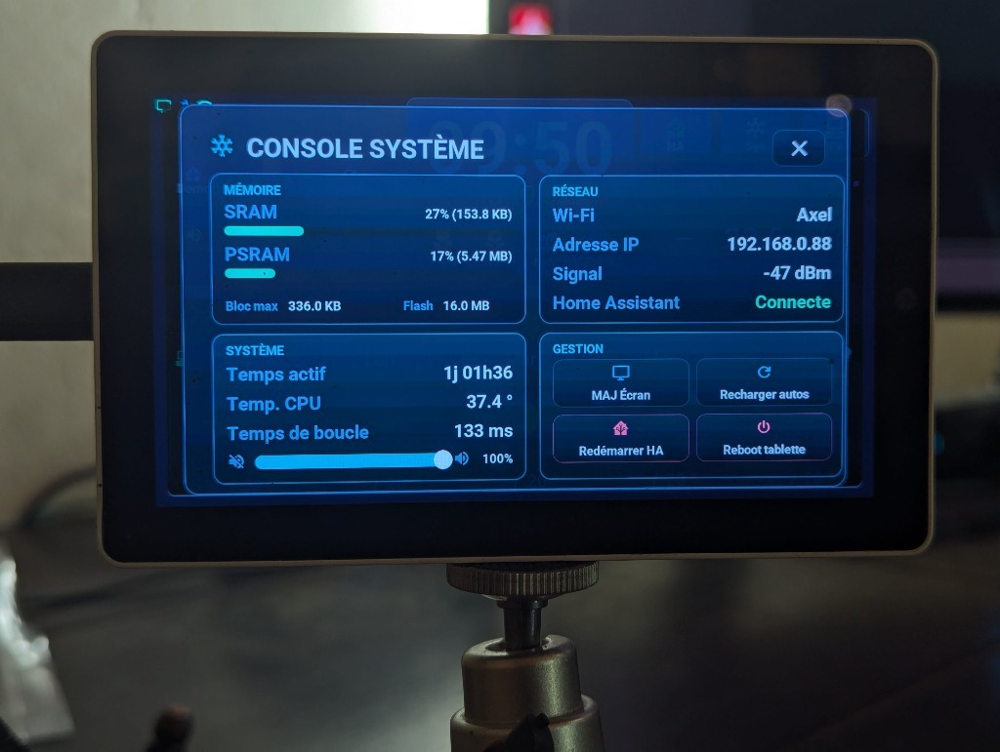

---

## Light popup — long press

Long-pressing a light tile — its weather shoulders or its HA-mode card — (instead of the short tap that just toggles it) opens a near-fullscreen modal (1250×690 card, 15 px from the screen edges), organized in three glass cards:
- **AMPOULE** (left): a selector listing **the lights of the room** (up to 5, in tile order, rows tightened beyond three; icons colored by on/off state, cyan border on the selection, the pressed light selected) to switch lights without closing the popup, a large **On/Off** button and **Tout éteindre** (every light of the room, `pR / eteindre`; in legacy mode the three 3.x lights)
- **LUMINOSITÉ** (center): a **320 px brightness arc** (0–255) with the **% value shown live** in the center — synced from the HA `brightness` attribute at open time and live (never during a drag), debounced 200 ms so one drag sends a single `light.turn_on` — plus 4 shortcuts 10/35/65/100 %
- **COULEURS** (right): 3 named whites (Chaud/Crème/Froid) and a 4×3 grid of **12 round color swatches** (each sends `light.turn_on` with the matching `color_name`, factorized via `light_color_preset_btn.yaml`)
- Tapping the dark overlay or the × button (a real 96×64 glass button) closes the modal

The popup is context-aware: the long press opens it on the pressed light, and the selector goes through `script.tab5_light_popup_show(light_idx)` (`popup_lumiere_choisir()`, `tab5_tuiles.cpp`), which sets the `current_light_slot` global to the tile's key (`tRT`, or `lumiere_N` in legacy mode) and syncs the title, selector, power icon and arc — one popup for every light of every room.

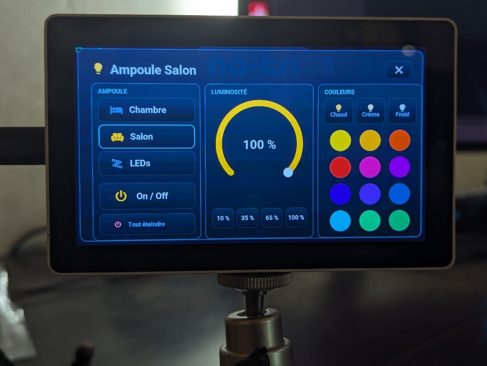

---

## TV remote popup

A near-fullscreen Samsung TV remote (`tv_remote_popup.yaml`, 1250×690 card — the shared modal tokens of ADR-0009, 15 px from the screen edges): power, navigation pad, volume and channel columns, and a bottom row (Play/Pause · Retour · Accueil · Muet). Opened by long-pressing a media tile with the TV option (`t`; the PC card in legacy mode) or via the TV button (`btn_control_tv`); every key sends `remote.send_command` (or `remote.toggle` for power) to the `${entity_tv_remote}` Home Assistant entity — the Tab5 carries no IR hardware, HA's Samsung integration does the work. Tapping the dark overlay closes it.

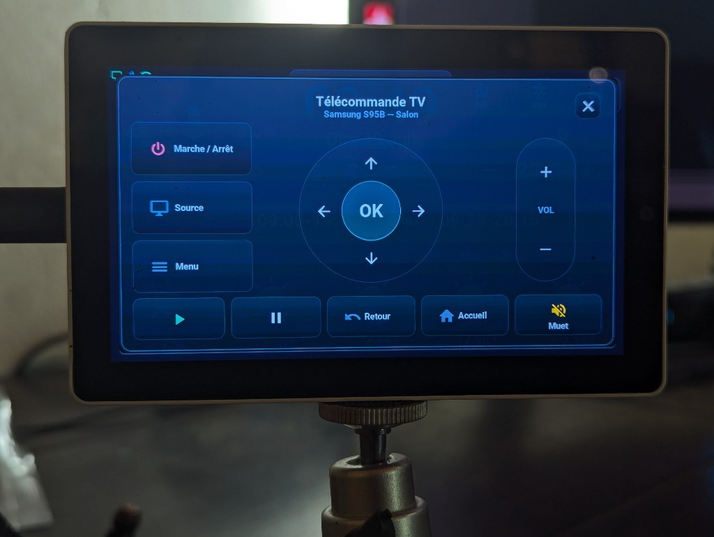

---

## Energy popup — solar installation (optional)

Shown only if sensors are picked in the « Énergie · Energy » section of the blueprint ([ADR-0028](decisions/0028-solar-energy-popup.md)). Opened by tapping a sensor tile of that section (tile option `e`; the solar sensor gets the solar-panel icon) or by « Aller à l'écran → Énergie ». Same modal chrome as the other popups (`energie_popup.yaml`, ADR-0009), drawn by `tab5_energie.cpp`:

- **Top, live**: up to four glass cards — **Solar** (power, « Today » production), **Home** (consumption), **Grid** (power, « From the grid » / « To the grid » / « No exchange »), **Battery** (level with a battery icon that follows it, « Charging » / « Discharging » / « Idle », temperature). A card without a sensor disappears and the others share the width. Units stay short (W, kW, kWh).
- **Bottom, history** (needs the produced-energy sensor): the title gives the period and its total (« Today · 3.20 kWh »), three buttons switch between **Hours** (24 bars, today), **Days** (30 days) and **Months** (12 months). Gold bars, the current slot in the accent colour, a line at the maximum with its value. Without that sensor, the cards fill the popup.
- Before Home Assistant answers: « En attente de Home Assistant »; section empty: « Aucun capteur d'énergie choisi ».

HA pushes only while the popup is open (package `tab5_energie.yaml`); instant transitions, like every popup.

---

## Color coding for readability

Color is used consistently as a primary information channel — to let you read state at a glance without reading labels.

**Temperatures:** mapped to a continuous scale via `get_temperature_color()` — blue (cold) → green (comfortable) → orange (warm) → red (hot). Applied identically to indoor sensors and forecast temperatures.

**Day names on daily forecast** (`refresh_daily_forecast()`, `tab5_*.cpp`):
- Cyan — today
- Green — day off (non-Sunday)
- Amber — Sunday, day off
- Rose/Red — Sunday worked, **or** any day with a shift starting before 09:00 ("early")
- Dim slate — past day (overrides the above once the day has passed)

**Plant moisture (`get_humidity_color()`):**
- Red — ≤ 14% (very dry, needs watering)
- Gradient green → white-ish — 30–80%
- Blue — ≥ 80% (too wet)

**Batteries (`get_battery_color()`)** — phone, tablet and solar production icons of the status bar (solar: grey panel at 0 %), battery line of the plant details popup:
- Green — above 80 %
- Blue — 41–80 %
- Amber — 20–40 %
- Red — below 20 %
- Grey — unknown

**Microphone icon:** see Voice assistant above.

All interface colours live in one palette, `struct Palette` in `tab5_tokens.h` (included by `tab5_custom.h`); `UIColor` is the active one. The YAML takes them through the role styles of `tab5-styles.yaml` (`style_text_dim`…), the games keep their own dark palettes ([ADR-0029](decisions/0029-themes-palette.md)). Twenty-one themes, each with a dark and a light mode, change the colours, the shapes (radius, borders, shadows) and the fonts of the time, the date and the titles; a new tablet starts in « Relief doux ».

The theme, the mode (Sombre, Clair, Auto) and the « Nuit (thème auto) » switch are entities of the tablet: [Tablet settings](installation.md#theme-light-or-dark).

---

## Roller shutter control

Since 3.2 every `vol` tile is a shutter or a valve of its own (tap: stop while it moves, else close if open, open otherwise; long press: the other of open / close; the right shoulder shows the arrow of the next move). In legacy mode, the 3.x shutter (`tab5_maj_volet_etat`) is tile 1 of the home page: its weather card has both the direction flip (tap the title) and the action button (tap the icon) described above, and its HA-mode card shares the same `script.tab5_volet_tap`.

---

## Arcade — 8 game consoles (experimental)

> **Status: early prototypes.** First-pass AI-generated games, built to see what LVGL + C++ can do on an ESP32-P4. Functional but unpolished — proof of concept, not finished product.

Opened by **tapping the greenhouse temperature** (`btn_serre_games` in `climate_card.yaml`) — the single entry point. The selector shows a 4×2 grid of 8 cards (298×252 each) with an MDI icon, the game name and a one-line description.

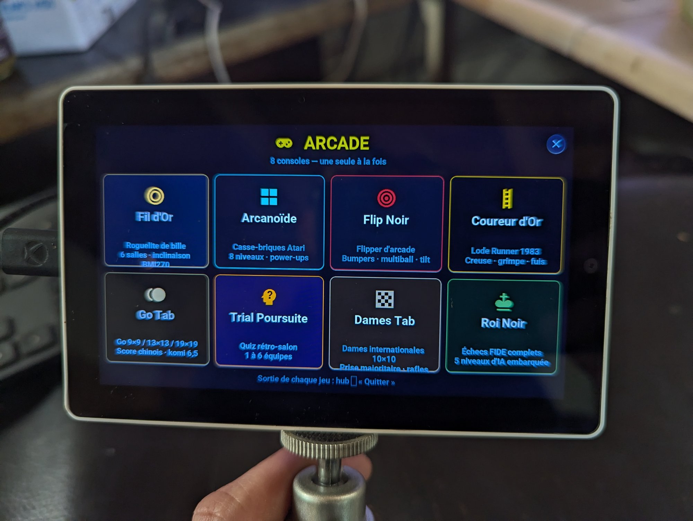

Each console is its **own fullscreen LVGL page** (`page_marble`, `page_chess`… declared `skip: true` in `tab5-lvgl.yaml` so swipe navigation can't reach them), not an overlay stacked on the dashboard. Documented ADR-0009 exception: no modal chrome. Shared architecture: YAML = empty containers, all content in C++, `lv_timer` created on open / destroyed on close, pre-allocated LVGL pool (zero allocation in the tick), NVS persistence, **zero HA or network dependency**.

| # | Console | Description | Controls |
|---|---------|-------------|----------|
| 1 | **Fil d'Or** | Marble roguelite, 6 rooms, Dark Souls-style progression | BMI270 tilt |
| 2 | **Arcanoïde** | Breakout, 8 levels, power-ups, combo | Tilt + touch |
| 3 | **Neon Apron** | Neon 3-ball pinball — **switches the screen to portrait 720×1280** | Touch zones + IMU nudge |
| 4 | **Coureur d'Or** | Lode Runner, 10 levels, dig & climb | Touch D-pad |
| 5 | **Go Tab** | Go 9×9/13×13/19×19, Chinese scoring (komi 6.5), 4 AI levels | Touch |
| 6 | **Trial Poursuite** | Trivia, 1–6 teams, 42-space wheel + 6 spokes | Touch |
| 7 | **Dames Tab** | International draughts 10×10 (8×8 checkers option), 4 AI levels | Touch |
| 8 | **Roi Noir** | FIDE chess, 5 AI levels, perft-validated | Touch |

Exiting any game: hub → "Quitter" (clean return to `page_arcade` then the dashboard: timer stopped, score saved to NVS, and for Neon Apron the landscape rotation is restored).

→ Full technical details per game: [`docs/arcade.md`](arcade.md)

---

## Version Française

---

Cette page décrit ce que le Tab5 affiche et fait réellement — vérifié contre le firmware (`tab5-lvgl.yaml`, `ui_components/*.yaml`, `tab5_*.cpp`) le 06/07/2026, re-vérifié le 14/07/2026 (panneau info, bouton console, zones de swipe), complété le 27/07/2026 (popups assistant/calendrier/plantes, section Arcade, photos appareil réel) et re-vérifié le 30/07/2026 (migration des jeux vers des pages LVGL dédiées, remplacement de « Flip Noir » par « Neon Apron »). L'ancienne version de cette page décrivait une navigation par barre d'onglets à 6 écrans qui n'existe plus (et n'a peut-être jamais été livrée telle quelle) — voir [ADR-0002](decisions/0002-single-page-swipe-navigation.md). Si quelque chose ci-dessous ne correspond plus au firmware réel, c'est le firmware qui a raison — corrigez cette page.

---

## Vue d'ensemble de la mise en page

Il y a une **page unique 1280×720** (`page_main`), pas un jeu d'écrans navigués par onglets. Trois zones :

1. **Zone d'accueil** — toujours visible : horloge, capteurs intérieurs, actions rapides, carte clim compacte, carte humidité plantes.
2. **Carte centrale** — une petite zone qui alterne automatiquement entre planning, prévision de pluie, alertes météo et un panneau info (récap calendrier / texte d'alerte).
3. **Zone de cartes du bas** — soit les 5 cartes prévisions météo (avec, dans leurs épaules, les appareils de la pièce de chaque page), soit, en mode HA, les 5 cartes d'appareil de la pièce courante.

Overlays plein écran par-dessus : le **popup clim** (tap sur la carte clim compacte), le **popup lumière** (appui long sur un raccourci lumière), et la **télécommande TV** (`tv_remote_popup.yaml` — pad IR Samsung via `remote.*` HA, ouverte depuis le contrôle UI qui retire `LV_OBJ_FLAG_HIDDEN` sur `tv_remote_popup`). Une **Console Système** (diagnostics mémoire/réseau/système, volume, plus une carte gestion HA : MAJ écran, reload automations, redémarrage HA et reboot tablette derrière un overlay de confirmation) s'ouvre via le bouton console (`btn_control_console`, en haut à droite) — plus par swipe depuis la refonte gestuelle du 14/07/2026.

---

## Captures générées

Ces images ne sont pas des photos : la CI les dessine sans tablette, avec le même code d'interface, à chaque pull request qui touche l'écran ([ADR-0021](decisions/0021-host-render-stubs.md), workflow `rendu-host.yml`). Les trois scènes sont celles du [mode démo](demo_mode.md#version-française), à date fixe (16 juin, 07:45, heure de Paris), en français puis en anglais. Ce sont aussi les références auxquelles la CI compare chaque nouveau rendu : elles suivent donc le firmware.

| Scène | Français | English |
|---|---|---|
| Journée ensoleillée |  |  |
| Pluie et alerte orange |  |  |
| Jour de repos, plantes à surveiller |  |  |

---

## Zone d'accueil

Contenu toujours visible en haut de l'écran :
- **Icônes d'état**, en haut à gauche, de gauche à droite : PC (vert allumé), téléphone (couleur de sa batterie), Wi-Fi, réveil, la **production solaire** quand la section Énergie du blueprint a un capteur de puissance solaire et la puissance crête des panneaux (sa couleur donne la production en part de la crête, avec le barème des batteries : vert au-dessus de 80 %, bleu, ambre, rouge sous 20 % ; un panneau gris à 0 %, la nuit), et la **batterie de la tablette** quand l'interrupteur de l'appareil **Tab5 Batterie montée** est allumé (éteint par défaut : sans batterie, le chargeur dit « en charge, 100 % »). Le glyphe suit le niveau (pleine au-dessus de 80 %, moitié, basse, « ! » sous 20 %, un éclair pendant la charge, « ? » sans mesure), avec les couleurs du téléphone. Une icône masquée ne laisse pas de trou : les autres se resserrent.
- Heure et date actuelles
- Température et humidité intérieure
- Icône microphone avec couleur d'état du pipeline (voir Assistant vocal ci-dessous), entre les deux boutons de mode vocal (agent Home Assistant vs pipeline conversation/LLM), et dessous le large bouton **Ok Nabu: ON / OFF** du mot de réveil (le bouton muet est dans le popup assistant depuis le 05/10/2026)
- Boutons **HA**, **Sys** et **TV**, en haut à droite. Les boutons de l'accueil n'affichent que leur icône, tous à la même taille (125 × 90, icônes de 70 px) ; les trois colonnes du haut sont à 20 px des bords de l'écran comme la carte centrale, hauts alignés à y 20 et bas à y 308, 25 px au-dessus de la carte centrale
- **Carte clim compacte** — température actuelle (capteurs salon + serre) et température cible avec boutons +/− ; taper sur la cible ouvre le popup clim (voir Climatisation ci-dessous)
- **Carte humidité plantes** — 4 emplacements pour jusqu'à 5 capteurs BLE d'humidité du sol (voir Humidité des plantes ci-dessous)

---

## Carte centrale — planning / pluie / alertes / info

Une seule carte alterne automatiquement toutes les 8 secondes (script `tab5_central_rotator_auto`, `tab5-scripts.yaml` ; pas écran éteint ni sous un popup ouvert) entre jusqu'à huit panneaux : planning, pluie, alertes météo, info et jusqu'à quatre bandeaux d'alertes HA. La rotation ne tourne que sur la fenêtre prévisions par défaut — swiper vers une autre fenêtre remplace la carte centrale par un overlay de titre de page (`page_title_wrapper`) et met la rotation en pause. Cet overlay tient sur deux lignes, construites par `forecast_page_title_parts()` (`tab5_*.cpp`) : un chapeau atténué qui nomme la famille et le rang de la fenêtre (`Prévisions journalières · 2/3`), puis la plage réellement couverte par les 5 tuiles visibles — `Du mercredi 5 août au dimanche 9 août` en journalier (jours et quantièmes via SNTP, `1er` pour le premier du mois), `De 14:00 à 18:00` en horaire, toujours de la plus ancienne à la plus récente même si les tuiles horaires sont rangées de droite à gauche. Si les dates ne sont pas encore disponibles (SNTP non synchronisé et aucun payload HA reçu), le chapeau prend seul la ligne principale. Taper sur la température d'une carte prévision (voir plus bas) peut aussi interrompre la rotation quelques secondes pour montrer le planning d'un jour précis.

- **Planning** — dans la rotation, sauf si Home Assistant n'a pas d'agenda de travail (zone optionnelle, lot 5). Affiche le planning du jour.
- **Prévision de pluie** — intégrée à la rotation seulement si `has_rain` est vrai. Un graphique de pluie à court terme : un point toutes les 5 minutes pour la première demi-heure, puis toutes les 10 minutes pour la demi-heure suivante (9 points au total, fenêtre d'1 heure), fourni par Météo-France via le service API `tab5_maj_pluie_1h_bulk` (les 9 barres en un appel).
- **Alertes météo** — intégrée à la rotation seulement si `g_central_ctx.has_mf_alerts` est vrai. Affiche une icône par type de vigilance Météo-France actif (vent, inondation, orages, etc.), chaque icône colorée selon sa propre sévérité : jaune (vigilance jaune), orange, ou rouge (vigilance rouge) — les codes couleur officiels Météo-France, à ne pas modifier.

**C'est la date, pas "un jour", qui prend la couleur du niveau d'alerte global en cours :** indépendamment de la rotation ci-dessus, le texte de la date sous l'horloge en zone d'accueil (`lbl_date`, ex. "Lun 06 Juil") est recoloré à chaque réception d'un payload d'alerte, selon le niveau de vigilance *global* du jour (vert/défaut si aucune, jaune pâle/orange/rouge pâle pour jaune/orange/rouge) — voir `tab5-api-logic.yaml` dans le service `tab5_maj_alerte_meteo_france`. C'est distinct de la coloration par icône du panneau d'alerte ci-dessus, qui utilise le niveau propre à chaque type d'alerte plutôt que le niveau global.

- **Panneau info** — intégré à la rotation seulement si `has_info` est vrai. Affiche soit un récap calendrier 3 jours (multi-lignes, avec balisage couleur inline), soit une bannière d'alerte Météo-France (une ligne, colorée selon la sévérité), poussé par HA via le service `tab5_maj_info_texte` (`update_info_text_ui()`, `tab5_*.cpp`). **Un tap le masque** (`tab5_dismiss_info_tap` → `dismiss_central_info_immediate`) : le panneau quitte le rotateur tout de suite ; l’id est stocké dans `tab5_dismissed_local` pour qu’un re-push du même id reste caché tant que HA n’envoie pas une nouvelle alerte.
- **Slots infos / alertes HA (jusqu’à 4)** — poussés par `tab5_maj_alertes_ha_bulk` dans `ha_alert_wrapper_0…3`. Chaque slot est son propre panneau du rotateur ; **un tap masque ce slot** (`tab5_dismiss_ha_alert`, slot 0-3 → `dismiss_ha_alert_slot_immediate`), même logique de dismiss local.

Si ni pluie, ni alertes MF, ni info, ni slots HA ne sont actifs, la rotation garde simplement le planning à l'écran (et laisse la carte vide sans planning).

**Bascule temporaire :** taper sur la température max/min de l'une des 5 cartes prévisions du bas interrompt la rotation pendant **6 secondes** pour afficher le texte des horaires de ce jour précis dans la carte centrale, puis restaure automatiquement le panneau qui était actif (`show_temporary_planning()`, `tab5_*.cpp` — anciennement un script ESPHome de `tab5-scripts.yaml`, passé en C++ lors du fix reboot du 12/07).

---

## Zone de cartes du bas — les pièces

Depuis la 3.2 ([ADR-0023](decisions/0023-rooms-generic-tiles.md)), chacune des 5 pages du bas est aussi une **pièce** de 5 appareils au plus, décrite par Home Assistant (blueprint « Tab5 — emplacements », action `tab5_maj_tuiles` ; états par `tab5_maj_emplacements`, clés `tRT`). La pièce 0 est l'accueil (jours 0-4), les pièces 1 et 2 les pages journalières suivantes (swipe vers la gauche), les pièces 3 et 4 les pages horaires (swipe vers la droite) ; la tuile T est la position visuelle, 0 = gauche. Les définitions sont gardées en NVS : les pièces se dessinent avant que HA réponde ; pas les états (« -- » grisé jusqu'à la première poussée). Modèle et dessin : `tab5_tuiles.cpp`.

Le bouton `btn_control_ha` (en haut à droite, icône Home Assistant) bascule la zone entre le **mode météo** et le **mode HA** (`tuiles_mode_ha()`, drapeau `g_central_ctx.ha_mode`). Il prend une bordure et une icône d'accent quand le mode HA est actif, et disparaît quand aucune pièce n'a d'appareil. « Aller à l'écran → Accueil » (le select de Home Assistant) quitte le mode HA.

### Mode météo (par défaut)

5 cartes, navigables par **swipe gauche/droite**, sur 5 fenêtres : 2 horaires + 3 journalières (sans bouclage — swiper au-delà de la dernière fenêtre ne revient pas à la première ; voir la [note faux positifs](troubleshooting.md#false-positives-worth-knowing-about-dont-fix-these-again) dans `docs/troubleshooting.md`).

**Fenêtres horaires (2) :** les 15 prochaines tranches horaires, 5 par fenêtre. Chaque carte affiche une heure, une icône météo double couche (`IconeMeteo.ttf`), une température avec code couleur, et la pluie en mm (ou `-` si sec). Il n'y a pas de donnée de vitesse de vent séparée — "venteux" est l'une des icônes de *condition* météo possibles (à côté de soleil/nuage/pluie/neige/brouillard), pas un champ de donnée distinct.

**Fenêtres journalières (3) :** prévisions sur 15 jours, 5 jours par fenêtre. Chaque carte affiche :
- Nom du jour, avec code couleur (voir Coloration ci-dessous)
- Icône météo (même système double couche)
- Températures max et min, chacune avec code couleur — **taper dessus affiche le planning de ce jour dans la carte centrale pendant 6 secondes** (voir ci-dessus)

**Épaules et action rapide.** Sur chaque page, une tuile qui porte un appareil de la pièce de la page le montre dans ses deux « épaules », de part et d'autre de l'onglet titre — à gauche l'icône de l'appareil ([palette](tiles_icons.md)) colorée par son état ; à droite une ampoule (lumière) ou la flèche du prochain mouvement d'un volet (pause pendant la course), rien pour les autres types — et un bouton invisible sur l'icône météo (`btn_jN_action` sur les pages journalières, `btn_hN_action` sur les horaires) envoie la commande de la tuile ; la météo reste affichée. Une page sans appareil est comme avant la 3.2.

| Type | Appui court | Appui long |
|------|-------------|------------|
| `lum` lumière | bascule (`allumer` avec l'option `o`) | popup lumière, sur cette lumière |
| `int` interrupteur, ventilateur… | bascule (`allumer` avec `o`) | — |
| `vol` volet, vanne | en mouvement → arrêter ; ouvert → fermer ; sinon ouvrir | l'autre de ouvrir / fermer |
| `med` lecteur multimédia | bascule | télécommande TV (option `t`) |
| `act` scène, script, bouton | lancer — la ligne d'état montre « OK » 1 s | — |
| `cap` capteur, `bin` capteur binaire | lecture seule | — |
| `cli` climatisation | popup clim : la clim du blueprint (option `m`), sinon celle de la tuile ([ADR-0027](decisions/0027-climate-per-tile.md)) | — |

L'option `k` demande un second appui dans les 3 s (la ligne d'état demande « Confirmer ? », l'icône passe à l'ambre) ; l'option `r` met la tuile en lecture seule.

**Mode héritage (blueprint 3.x).** Tant qu'aucune définition n'est arrivée (firmware mis à jour avant son blueprint), la pièce 0 est construite depuis les emplacements 3.x et ressemble à la 3.1 : carte 1 PC/TV (épaule = état de la TV, ou du PC sans TV ; appui long = télécommande), carte 2 le volet, cartes 3 à 5 les lumières chambre, salon et LEDs (appui long = popup lumière), avec les commandes 3.x. Sur la carte du volet, taper le **titre** inverse le sens que le prochain appui enverra (la flèche en haut à droite le montre) ; taper l'icône envoie « arrêter » si le volet bouge, sinon ouvrir ou fermer.

### Mode HA

Les 5 cartes (`switches_card.yaml`) montrent la pièce de la page courante : icône de la palette (70 px), nom (onglet titre, coupé avec « … »), ligne d'état traduite par la tablette — « 60 % », « Allumé » / « Éteint », « Mouvement » / « 45 % » / « Ouvert » / « Fermé », « Lecture » / « Pause », « Lancer », la valeur et l'unité d'un capteur, « Détecté » / « Présent » / « Verrouillé »… selon la classe d'appareil, la température de la pièce d'une clim ; « Hors ligne », grisé, quand l'entité est indisponible — et une couleur selon le type et l'état (la couleur propre d'une lumière quand elle en donne une). Les tuiles vides sont masquées et les autres centrées. La carte centrale affiche « Pièce n/N » au-dessus du nom de la pièce ; le rotateur est en pause. Appui court et long comme dans le tableau ci-dessus.

**Swipe en mode HA** : pièce suivante / précédente qui a un appareil, dans l'ordre des pages météo (même bouclage) ; les calques météo restent masqués et les pastilles suivent. Avec une seule pièce, un swipe ne fait rien. Entrer en mode HA sur une page sans appareil saute à la pièce la plus proche qui en a ; en sortir montre la météo de la page courante.

---

## Climatisation

Deux niveaux de contrôle. La carte compacte pilote l'entité `climate` du blueprint (entrée « Climatisation ») ; le popup pilote la même, ou la clim de la tuile qui l'a ouvert :

- **Carte compacte** (toujours visible en zone d'accueil) — température actuelle et cible avec boutons +/−. Toujours la clim du blueprint.
- **Popup clim** (quasi plein écran, carte 1250×690 à 15 px des bords, ouvert en tapant la carte compacte, une tuile de clim, ou « Aller à l'écran → Climatisation ») — trois cartes de verre :
  - **MODE** : Froid / Chaud / Sec / Ventilation / Éteint, empilés pleine largeur (icônes colorées selon le mode actif, pilotées par `tab5_maj_clim`)
  - **TEMPÉRATURE** : arc thermostat 320 px avec la cible affichée en grand au centre, boutons − / +, et la température réelle de la pièce en bas. Bornes, pas et unité sont ceux de l'appareil (16–30 °C et 0,5 tant que Home Assistant ne les a pas envoyés, voir plus bas). La cible s'affiche **immédiatement** (optimiste) et un seul `climate.set_temperature` part une fois le geste terminé (débounce 250 ms — les taps rapides ± sont groupés)
  - **OPTIONS** : presets Éco / Boost (toggle), Silence (fan quiet), et flux d'air **Oscillation** / **Brise** (`windnice`, mode Daikin Onecta auparavant inaccessible depuis l'écran)
  - **Toutes marques** ([ADR-0026](decisions/0026-climate-from-device.md)) : le blueprint envoie les réglages de l'appareil (clé `climr` : `min_temp`/`max_temp`, `target_temp_step`, °C ou °F, les modes qu'il a, son nom). Le titre devient le nom de l'appareil, l'arc et les boutons ± suivent ses bornes et son pas, et un bouton que l'appareil ne sait pas faire disparaît — une section OPTIONS restée sans bouton disparaît avec son titre, les autres remontent. Les boutons envoient toujours les noms de la Daikin (Éco = `away`, Silence = `quiet`, `swing` / `stop`), et le blueprint les traduit vers ceux de l'appareil (`eco`, `low`, `off`, `vertical`…), ou n'envoie rien quand l'appareil n'a pas d'équivalent.
  - **Toute tuile de clim** ([ADR-0027](decisions/0027-climate-per-tile.md)) : une tuile `cli` d'une pièce ouvre le popup sur son propre appareil — ses réglages (clé `crRT`, les champs de `climr`) et son état (clé `ceRT`) arrivent avec les tuiles, et ses boutons envoient les mêmes commandes avec `emplacement: tRT`, que le blueprint traduit de la même façon. Sa consigne et son mode arrivent tout de suite dans le popup, sa ventilation, son oscillation, son préréglage et la température de la pièce en 5 minutes au plus (avec les mesures). Une tuile avec l'option `m` est la clim du blueprint. Tant que Home Assistant n'a pas envoyé les réglages de la tuile (blueprint plus ancien), la toucher ne fait rien. Pendant ce temps la carte compacte montre toujours la clim du blueprint, et fermer le popup y revient.
  - Taper l'overlay sombre ou le bouton × (vrai bouton de verre 96×64) ferme le modal. 6 des 10 boutons sont des templates factorisés (froid/chaud/ventil/sec, éco/boost) ; les 4 restants (éteint/oscill/brise/silence) et les boutons ± sont volontairement laissés en YAML individuel — voir [ADR-0007](decisions/0007-climate-popup-not-factorized.md).

Les contrôles sont estompés (non cachés) quand le clim est éteint, pour garder la mise en page stable.

---

## Carte humidité des plantes

Surveille jusqu'à 5 capteurs BLE d'humidité du sol, mais seuls **4 emplacements sont affichés** (`sort_and_update_moisture_slots()`, `tab5_*.cpp`). Les capteurs sont triés par niveau d'humidité (du plus sec au plus humide) à chaque mise à jour, puis mappés sur les emplacements ainsi : le plus sec, le 2e plus sec, **le capteur de rang médian** (ça affiche la lecture brute de ce capteur précis, ce n'est pas une moyenne arithmétique calculée sur les 5), et le plus humide. Comme le mapping se fait par rang plutôt que par identité fixe du capteur, *quel* pot apparaît dans quel emplacement change dans le temps selon l'évolution de l'humidité.

Chaque emplacement n'affiche que l'icône du capteur, dans sa couleur de niveau d'humidité (voir Coloration ci-dessous), à la taille des boutons de l'accueil ; le nom et la valeur de chaque pot sont dans le popup détails plantes (appui long). Le libellé « Pot N » / « Moy: » sous chaque icône est retiré depuis le 05/10/2026.

### Popup détails plantes — appui long

Un **appui long n'importe où sur la carte des pots** ouvre un modal quasi plein écran (carte 1250×690 à 15 px des bords) avec **5 cartes de verre fixes — une par capteur** (carte N = capteur `moisture_N`, même icône que le dashboard, pas de tri dynamique ici). Chaque carte affiche :

- le nom du pot et son icône de plante, colorée par le niveau d'humidité (même échelle que le dashboard)
- le % d'humidité du sol (en grand) et un statut d'arrosage : **OK** (vert), **Bientôt sec** (≤ 20 %, ambre), **À arroser !** (≤ 14 %, rouge — aligné sur la zone rouge de `get_humidity_color()`) ou **Hors ligne** (capteur indisponible)
- quatre lignes de métriques : **Fertilité** (conductivité EC, µS/cm), **Lumière** (lx), **Température** (°C, gradient `get_temperature_color()`) et **Batterie** du capteur (%, échelle `get_battery_color()`)

Les valeurs sont poussées en continu par les capteurs HA `pot*_ec/lux/temp/bat` (`update_pot_metric_ui()`, `tab5_*.cpp`) — le popup n'a besoin d'aucune synchro à l'ouverture. Taper l'overlay sombre ou le bouton × (vrai bouton de verre 96×64) le ferme. Composants : `pots_popup.yaml` + `pot_detail_card.yaml` (5 instances).

---

## Popup calendrier — appui long sur l'horloge

Un **appui long sur la tuile horloge/date** ouvre un calendrier mensuel quasi plein écran (carte 1250×690 à 15 px des bords) : grille 7×6 lundi-en-tête, navigation ◀ / ▶ entre les mois et bouton « Aujourd'hui ». La grille elle-même — numéros, alignement lundi-dimanche, weekend estompé, aujourd'hui (bordure cyane) et jours passés grisés — est calculée **en local** depuis l'horloge SNTP (`cal_render_month()`, algorithme de Sakamoto) : le calendrier reste utilisable même HA hors ligne.

Home Assistant enrichit ensuite chaque mois consulté **à la demande** (`script.tab5_calendrier_mois` → `tab5_maj_calendrier_mois`, cache par mois vidé à l'ouverture) :

- **heures de travail imprimées dans les cases** (« 09:30-20:15 », en rose si l'embauche est avant 9 h — même convention que le bandeau planning central), depuis l'agenda de travail (les événements dont le titre contient le mot de « Tab5 · mot des événements de travail », ou tous)
- **jours fériés** — numéro en rose (liste blanche des vrais fériés français ; les fêtes civiles type Fête des Mères n'apparaissent que dans le détail du jour)
- **vacances scolaires** — fond de case violet doux, depuis l'agenda choisi dans « Tab5 · agenda des vacances scolaires » (en France, le fichier ICS du ministère pour votre zone ; jusqu'au 29/09/2026, une table fixe de la zone A)
- **RDV** (pastille dorée) et **anniversaires** (pastille rose) depuis les calendriers famille/anniversaires

**Taper un jour** ouvre un sous-popup détail 780×540 (`script.tab5_calendrier_jour`) : titre « Mardi 21 Juillet » et jusqu'à 6 lignes typées avec icônes MDI colorées — nom du férié, libellé des vacances scolaires, horaires de travail, RDV horodatés, anniversaires, fêtes civiles — avec les états « Chargement... », « Rien de prévu ce jour » et « Home Assistant hors ligne ». La fermeture suit la recette popups v2 (croix = vrais boutons de verre 96×64, `scrollable: false` partout). Composants : `calendar_popup.yaml` + `cal_grid_build()` (42 cellules construites en C++) + package HA `HomeAssistant_Config/packages/tab5_calendar.yaml`.

---

## Réveil — tap court sur l'horloge

Un **tap court sur la tuile horloge/date** ouvre les réglages du réveil (carte modale 1250×690) ; l'appui long reste le calendrier. Une petite cloche dans la barre d'état du haut donne l'état d'un coup d'œil : **verte** = armé avec une sonnerie calculée, **ambre** = armé mais aucun jour retenu (le piège classique du mode « jours travaillés » pendant une semaine de congés), **barrée et éteinte** = réveil coupé.

**Le réveil sonne sans Home Assistant.** L'heure vient de SNTP, les horaires de travail des 15 prochains jours sont déjà en cache dans l'appareil (`cal_jours_data[]`, poussés toutes les 10 min), et la sonnerie est une mélodie RTTTL synthétisée sur place — un sinus pur, pas un fichier. HA n'ajoute que du confort : le briefing parlé, les rappels de rendez-vous, et une URL de sonnerie personnalisée en option (avec **repli automatique et silencieux** sur la mélodie locale si HA ne répond pas).

**Trois modes**, parce que « se baser sur le calendrier » veut dire deux choses différentes selon les jours :

| Mode | Quand ça sonne |
|---|---|
| **Fixe** | À l'heure réglée, les jours de la semaine cochés |
| **Travail** | La même heure, mais seulement quand le calendrier annonce du travail |
| **Ouverture** | L'heure est **dérivée de l'embauche** : début du service − un délai réglable, borné par « jamais avant » / « jamais après » |

**L'heure de fermeture sert aussi**, via le réglage **« repos mini »** : après une fermeture à 21:00, un repos de 9 h interdit de sonner avant 06:00 — borné par « jamais après », le repos ne peut donc jamais faire arriver en retard. Le **sélecteur de jours ne gouverne QUE l'heure fixe** : une journée pilotée par le calendrier sonne quel que soit le jour de la semaine, sinon décocher le samedi ferait rater une embauche du samedi matin.

**Arrêt à la voix ou au toucher.** Toucher n'importe où sur l'écran de sonnerie arrête le réveil ; « Répéter » reste un bouton distinct. Côté voix, le modèle microWakeWord **« Stop » était déjà embarqué** (il ne servait qu'à arrêter le volet) : il est armé pendant la sonnerie, et n'importe quel mot de réveil coupe l'alarme. Le moteur de mots de réveil est démarré même si « Ok Nabu » est désactivé — sinon la promesse ne tiendrait pas pour qui coupe le micro la nuit. Chaque passage de mélodie est suivi de **2,5 s de silence** : c'est la fenêtre où le micro a une chance d'entendre quelque chose.

Autres réglages : 4 mélodies (écoutables d'un tap), un **volume dédié au réveil** (indépendant du volume système), volume progressif, durée de répétition, durée maximale de sonnerie, et un briefing parlé au réveil (heure, horaires du jour, prochain rendez-vous, température).

**Annonce des rendez-vous**, N minutes avant (0–120, réglable). HA pousse la liste des rendez-vous horodatés toutes les 5 minutes ; **c'est le firmware qui tient le compte à rebours**, donc une coupure HA entre la poussée et l'échéance ne fait rien rater. Composants : `alarm_popup.yaml` + `alarm_ring_overlay.yaml` + `Tab5/tab5-alarm.yaml` + `Tab5/alarm_clock.h/.cpp` + package HA `HomeAssistant_Config/packages/tab5_reveil.yaml`.

---

## Assistant vocal

L'icône microphone sur l'écran d'accueil est l'interface visuelle de l'assistant vocal. Elle change de couleur pour refléter l'état courant du pipeline :

| Couleur de l'icône | État | Ce qui se passe |
|-------------------|------|----------------|
| **Gris sombre** | En veille | Écoute wake-word désactivée |
| **Gris** | Repos | Écoute "Ok Nabu" en arrière-plan |
| **Vert** | Écoute | Wake word détecté — enregistrement en cours |
| **Orange** | Traitement | Pipeline HA exécute STT + reconnaissance d'intention |
| **Bleu** | Synthèse | Réponse TTS en lecture sur le haut-parleur |
| **Rouge** | Erreur | Pipeline échoué ou commande non comprise |

**Bascule wake-word :** un bouton sur l'écran d'accueil active ou désactive la détection "Ok Nabu". Quand désactivé, on peut toujours activer l'assistant en tapant directement sur l'icône microphone (push-to-talk).

**Sélecteur de mode :** un petit bouton à côté du microphone bascule entre deux modes :
- **Mode Home Assistant** — les commandes vont vers l'agent de conversation standard de HA
- **Mode Conversation** — les commandes vont vers un pipeline basé sur un LLM

Quand la liste « Tab5 · pipeline de discussion » vaut « Aucun » (pas de pipeline de discussion), les deux boutons de mode (accueil et popup assistant) disparaissent et la tablette reste en mode Home Assistant (zone `discussion`, [installation](installation.md#autres-zones)).

Le mode est sauvegardé entre les redémarrages via l'entité HA `select` (`select.m5stack_tab5_home_assistant_hmi_assistant`).

**Second wake word local — « Stop » :** un second modèle microWakeWord (`Stop`) n'est armé que pendant que le volet est en mouvement (globale `volet_en_mouvement`) et désarmé dès l'arrêt. Dire « Stop » arrête alors le volet directement depuis l'appareil (`script.tab5_volet_action`) — sans « Okay Nabu », sans aller-retour pipeline.

**Interrompre une réponse :** taper l'icône micro pendant que l'assistant parle (bleu) coupe la réponse en cours (arrêt du pipeline, que Home Assistant suit, + le haut-parleur) et relance immédiatement l'écoute (`tab5_vocal_interrupt_and_listen`) — le moyen fiable d'écourter une longue réponse Discussion, le wake word étant inactif pendant la phase de réponse du pipeline.

---

## Console (overlay diagnostics)

Ouvert via le bouton console (`btn_control_console`, en haut à droite de la zone d'accueil). Une carte modale 1180×680 organisée en **quatre cartes de verre** :
- **MÉMOIRE** — barres SRAM/PSRAM, bloc max, taille flash
- **RÉSEAU** — SSID Wi-Fi, IP, signal, et état de la connexion HA (`lbl_sys_ha_val`, vert/rouge)
- **SYSTÈME** — uptime, température CPU, temps de boucle, plus le slider volume avec % affiché en direct
- **GESTION** — boutons de gestion HA : « MAJ Écran » (réarme le flag de push et redéclenche l'automation de push écran — le remède direct à l'incident récurrent d'écran figé), « Recharger autos » (`automation.reload`), « Redémarrer HA » et « Reboot tablette » — les deux derniers derrière des overlays Annuler/Confirmer (fini l'armement invisible par double-tap) ; une rangée du milieu choisit le thème et le mode (Sombre → Clair → Auto, l'écran se repeint aussitôt, [ADR-0029](decisions/0029-themes-palette.md))

Ce n'est **pas** un visualiseur de logs (utiliser `tools/tab5_logs.py` pour les payloads et événements). Voir [`docs/debugging.md`](debugging.md) pour plus de détails sur son usage en debug.

---

## Popup lumière — appui long

Un appui long sur une tuile lumière — ses épaules météo ou sa carte du mode HA — (au lieu du tap court qui la bascule) ouvre un modal quasi plein écran (carte 1250×690, 15 px des bords), organisé en trois cartes de verre :
- **AMPOULE** (gauche) : sélecteur des **lumières de la pièce** (5 au plus, dans l'ordre des tuiles, lignes resserrées au-delà de trois ; icônes colorées selon l'état on/off, bordure cyan sur la sélection, la lumière appuyée sélectionnée) pour changer de lumière sans fermer le popup, gros bouton **On/Off** et **Tout éteindre** (toutes les lumières de la pièce, `pR / eteindre` ; en mode héritage, les trois lumières 3.x)
- **LUMINOSITÉ** (centre) : **arc 320 px** (0–255) avec la valeur **% affichée en direct** au centre — synchronisée depuis l'attribut `brightness` HA à l'ouverture et en live (jamais pendant un drag), débouncée 200 ms pour qu'un glissement n'envoie qu'un seul `light.turn_on` — plus 4 raccourcis 10/35/65/100 %
- **COULEURS** (droite) : 3 blancs nommés (Chaud/Crème/Froid) et une grille 4×3 de **12 pastilles rondes** (chaque pastille envoie `light.turn_on` avec le `color_name` correspondant, factorisées via `light_color_preset_btn.yaml`)
- Taper l'overlay sombre ou le bouton × (vrai bouton de verre 96×64) ferme le modal

Le popup est contextuel : l'appui long l'ouvre sur la lumière appuyée, et le sélecteur passe par `script.tab5_light_popup_show(light_idx)` (`popup_lumiere_choisir()`, `tab5_tuiles.cpp`) qui règle la globale `current_light_slot` sur la clé de la tuile (`tRT`, ou `lumiere_N` en mode héritage) et synchronise titre, sélecteur, icône power et arc — un seul popup pour toutes les lumières de toutes les pièces.

---

## Popup télécommande TV

Une télécommande Samsung quasi plein écran (`tv_remote_popup.yaml`, carte 1250×690 — les tokens modaux partagés de l'ADR-0009, 15 px des bords) : power, pad de navigation, colonnes volume et chaînes, et une rangée basse (Play/Pause · Retour · Accueil · Muet). Ouverte par appui long sur une tuile multimédia avec l'option TV (`t` ; la carte PC en mode héritage) ou via le bouton TV (`btn_control_tv`) ; chaque touche envoie `remote.send_command` (ou `remote.toggle` pour le power) à l'entité Home Assistant `${entity_tv_remote}` — le Tab5 n'a aucun matériel IR, c'est l'intégration Samsung de HA qui fait le travail. Taper l'overlay sombre ferme le popup.

---

## Popup Énergie — installation solaire (facultatif)

N'apparaît que si des capteurs sont choisis dans la section « Énergie · Energy » du blueprint ([ADR-0028](decisions/0028-solar-energy-popup.md)). S'ouvre d'un toucher sur une tuile capteur de cette section (option de tuile `e` ; le capteur solaire prend l'icône du panneau solaire) ou par « Aller à l'écran → Énergie ». Même chrome modal que les autres popups (`energie_popup.yaml`, ADR-0009), dessiné par `tab5_energie.cpp` :

- **En haut, en direct** : jusqu'à quatre cartes de verre — **Solaire** (puissance, production « Aujourd'hui »), **Maison** (consommation), **Réseau** (puissance, « Depuis le réseau » / « Vers le réseau » / « Aucun échange »), **Batterie** (niveau avec une icône de batterie qui le suit, « Charge » / « Décharge » / « Au repos », température). Une carte sans capteur disparaît et les autres se partagent la largeur. Unités courtes (W, kW, kWh).
- **En bas, l'historique** (il faut le capteur d'énergie produite) : le titre donne la période et son total (« Aujourd'hui · 3.20 kWh »), trois boutons passent des **Heures** (24 barres, aujourd'hui) aux **Jours** (30 jours) et aux **Mois** (12 mois). Barres dorées, le créneau en cours dans la couleur d'accent, une ligne au maximum avec sa valeur. Sans ce capteur, les cartes remplissent le popup.
- Avant la réponse de Home Assistant : « En attente de Home Assistant » ; section vide : « Aucun capteur d'énergie choisi ».

HA ne pousse que pendant que le popup est ouvert (package `tab5_energie.yaml`) ; transitions instantanées, comme tous les popups.

---

## Coloration sémantique

La couleur est utilisée de façon systématique comme canal d'information primaire — pour lire l'état d'un coup d'œil sans lire les labels.

**Températures :** mappées sur une échelle continue via `get_temperature_color()` — bleu (froid) → vert (confortable) → orange (chaud) → rouge (très chaud). Appliqué identiquement aux capteurs intérieurs et aux températures des prévisions.

**Noms des jours en prévisions journalières** (`refresh_daily_forecast()`, `tab5_*.cpp`) :
- Cyan — aujourd'hui
- Vert — jour de repos (hors dimanche)
- Ambre — dimanche, repos
- Rose/Rouge — dimanche travaillé, **ou** tout jour avec une prise de service avant 09:00 ("service tôt")
- Ardoise estompée — jour passé (prend le dessus sur les couleurs précédentes une fois le jour passé)

**Humidité des plantes (`get_humidity_color()`) :**
- Rouge — ≤ 14% (très sec, besoin d'arrosage)
- Dégradé vert → blanc cassé — 30–80%
- Bleu — ≥ 80% (trop humide)

**Batteries (`get_battery_color()`)** — icônes du téléphone, de la tablette et de la production solaire dans la barre d'état (solaire : panneau gris à 0 %), ligne Batterie du popup détails plantes :
- Vert — au-dessus de 80 %
- Bleu — 41 à 80 %
- Ambre — 20 à 40 %
- Rouge — sous 20 %
- Gris — inconnu

**Icône microphone :** voir Assistant vocal ci-dessus.

Toutes les couleurs de l'interface vivent dans une palette, `struct Palette` de `tab5_tokens.h` (inclus par `tab5_custom.h`) ; `UIColor` est la palette active. Le YAML les prend par les styles de rôle de `tab5-styles.yaml` (`style_text_dim`…), les jeux gardent leurs palettes sombres ([ADR-0029](decisions/0029-themes-palette.md)). Vingt et un thèmes, chacun en sombre et en clair, changent les couleurs, les formes (rayons, bordures, ombres) et les polices de l'heure, de la date et des titres ; une tablette neuve démarre en « Relief doux ».

Le thème, le mode (Sombre, Clair, Auto) et l'interrupteur « Nuit (thème auto) » sont des entités de la tablette : [réglages de la tablette](installation.md#thème-clair-ou-sombre).

---

## Contrôle du volet roulant

Depuis la 3.2, chaque tuile `vol` est un volet ou une vanne à elle seule (appui court : arrêter s'il bouge, sinon fermer s'il est ouvert, ouvrir sinon ; appui long : l'autre de ouvrir / fermer ; l'épaule droite montre la flèche du prochain mouvement). En mode héritage, le volet 3.x (`tab5_maj_volet_etat`) est la tuile 1 de l'accueil : sa carte météo a l'inversion de sens (tap sur le titre) et le bouton d'action (tap sur l'icône) décrits plus haut, et sa carte du mode HA partage le même `script.tab5_volet_tap`.

---

## Popup Assistant vocal

Ouvert par **appui long sur la zone micro** (`btn_assist_trigger`). Carte modale quasi plein écran (1250×690) organisée en deux colonnes :

- **Gauche — Réglages** : sélecteur cerveau/pipeline (Domotique ↔ Discussion), toggle Ok Nabu ON/OFF, bouton Muet, slider Volume, taille de texte A-/A+ (persistée ; roboto_32_b / roboto_45_b)
- **Droite — Conversation** : zone « VOTRE DEMANDE » (transcription STT) + zone « RÉPONSE » défilante avec rendu Markdown (tableaux ré-alignés approximativement — police proportionnelle depuis le 26/09/2026 —, gras, code, puces) + image téléchargée à la demande (`online_image`, PNG→RGB565, 760×360)

En mode Discussion, une demande vocale ouvre automatiquement le popup (`on_stt_end` → `tab5_assist_on_request`). En mode Domotique, le bandeau central 8 s reste le retour rapide. Le moteur peut pousser une réponse riche via le service HA `tab5_assist_reponse` (variables `texte` = Markdown, `image_url` = PNG optionnel).

Boutons bas : « Parler » (push-to-talk), Stop (carré rose), « Fermer ».

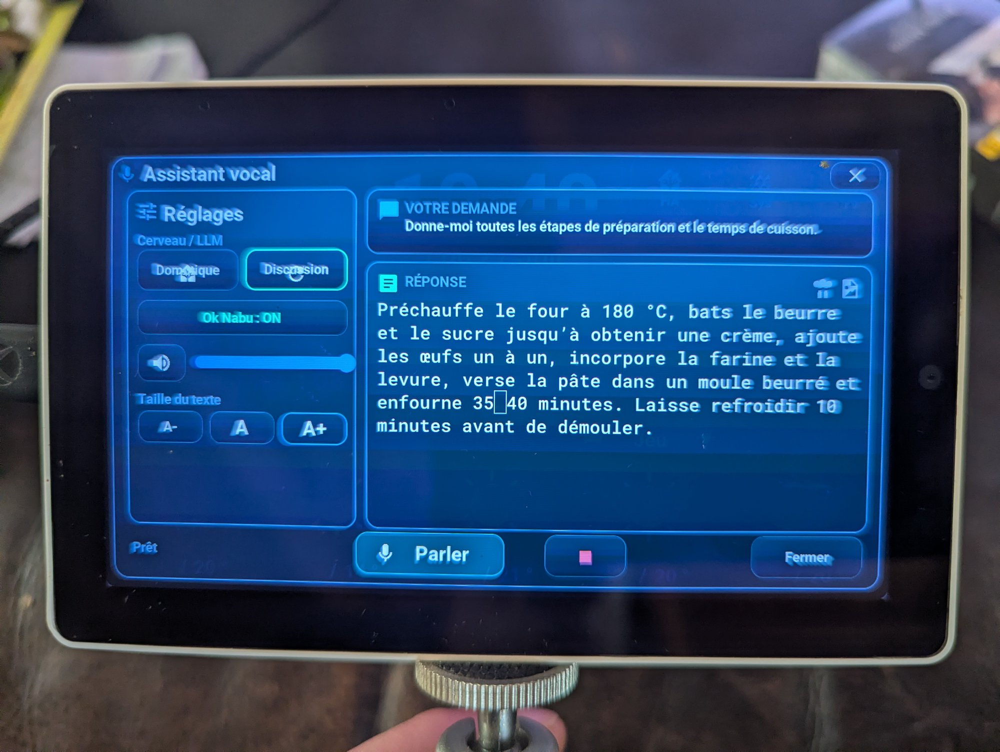

---

## Popup Calendrier

Ouvert par **appui long sur l'horloge/date** (`btn_clock_calendar_zone`, zone tactile invisible sur `clock_tile`). Carte modale 1250×690 :

- **En-tête** : icône calendrier + titre « Calendrier », navigation ◀ mois ▶, bouton « Aujourd'hui », croix de fermeture
- **Grille mensuelle 7×6** (lundi en tête) : 42 cellules construites en C++ (`cal_grid_build()`, à la première ouverture) avec numéro du jour, **heures de travail** affichées dans la case, pastilles colorées (dorée = RDV, rose = anniversaire), fond violet doux = vacances scolaires, numéro rose = férié, bordure cyan = aujourd'hui
- **Légende** en bas : Aujourd'hui / Travail / Férié / Vac. scolaires / RDV / Anniv.
- **Tap sur un jour** → sous-popup détail 780×540 : titre « Mardi 21 Juillet », lignes typées (férié, vacances scolaires, horaires travail, RDV, anniversaire, fête civile) avec icônes MDI colorées

La grille est calculée **localement** depuis SNTP (algorithme de Sakamoto). HA enrichit chaque mois à la demande via `tab5_maj_calendrier_mois` (bitmask 2 hex/jour + 31 champs d'heures) avec cache par mois.

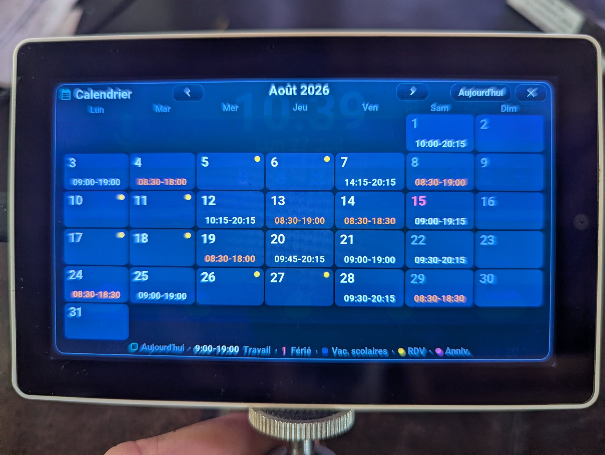

---

## Popup Détails Plantes

Ouvert par **appui long** sur les 4 slots pots du dashboard (`btn_pots_detail_zone`). Carte modale 1250×690 avec 5 cartes de verre **fixes** (carte N = capteur `moisture_N`) :

- Nom du capteur + icône colorée par l'humidité
- % humidité en `roboto_45_b`
- Statut : OK / Bientôt sec / À arroser ! / Hors ligne
- 4 métriques : Fertilité (EC µS/cm), Lumière (lx), Température (°C, gradient), Batterie (échelle couleur)

Valeurs poussées en continu par `update_pots_popup_moisture_ui()` / `update_pot_metric_ui()` — aucune synchro à l'ouverture.

---

## Arcade — 8 consoles de jeu (expérimental)

> **Statut : prototypes précoces.** Premiers jets générés par IA pour tester les capacités de LVGL + C++ sur ESP32-P4. Fonctionnels mais non finalisés — preuve de concept, pas produit fini.

Ouvert par **tap sur la température serre** (`btn_serre_games` dans `climate_card.yaml`). Le sélecteur affiche une grille 4×2 de 8 cartes (298×252 chacune), avec icône MDI, nom du jeu, et description courte.

Chaque console est sa **propre page LVGL** plein écran 1280×720 (`page_marble`, `page_chess`… déclarées `skip: true` dans `tab5-lvgl.yaml`, pour que le swipe ne puisse pas y naviguer) — pas un overlay posé sur le dashboard. Exception documentée ADR-0009 : pas de chrome modal. Architecture commune : YAML = conteneurs vides, tout le contenu en C++, `lv_timer` créé à l'ouverture / détruit à la fermeture, pool LVGL préalloué (zéro allocation dans le tick), persistance NVS, **zéro dépendance HA ou réseau**.

| # | Console | Description | Contrôles |
|---|---------|-------------|----------|
| 1 | **Fil d'Or** | Roguelite de bille, 6 salles, progression Dark Souls | Inclinaison BMI270 |
| 2 | **Arcanoïde** | Casse-briques 8 niveaux, power-ups, combo | Inclinaison + tactile |
| 3 | **Neon Apron** | Flipper néon 3 billes — **bascule l'écran en portrait 720×1280** | Zones tactiles + nudge IMU |
| 4 | **Coureur d'Or** | Lode Runner 10 niveaux, creuser & grimper | D-pad tactile |
| 5 | **Go Tab** | Go 9×9/13×13/19×19, score chinois (komi 6,5), IA 4 niveaux | Tactile |
| 6 | **Trial Poursuite** | Quiz 1–6 équipes, roue 42 cases + 6 rayons | Tactile |
| 7 | **Dames Tab** | Dames 10×10 internationales (option 8×8 anglaises), IA 4 niveaux | Tactile |
| 8 | **Roi Noir** | Échecs FIDE, 5 niveaux IA, perft validé | Tactile |

| Roi Noir (échecs) | Arcanoïde (casse-briques) |
|:-:|:-:|
| 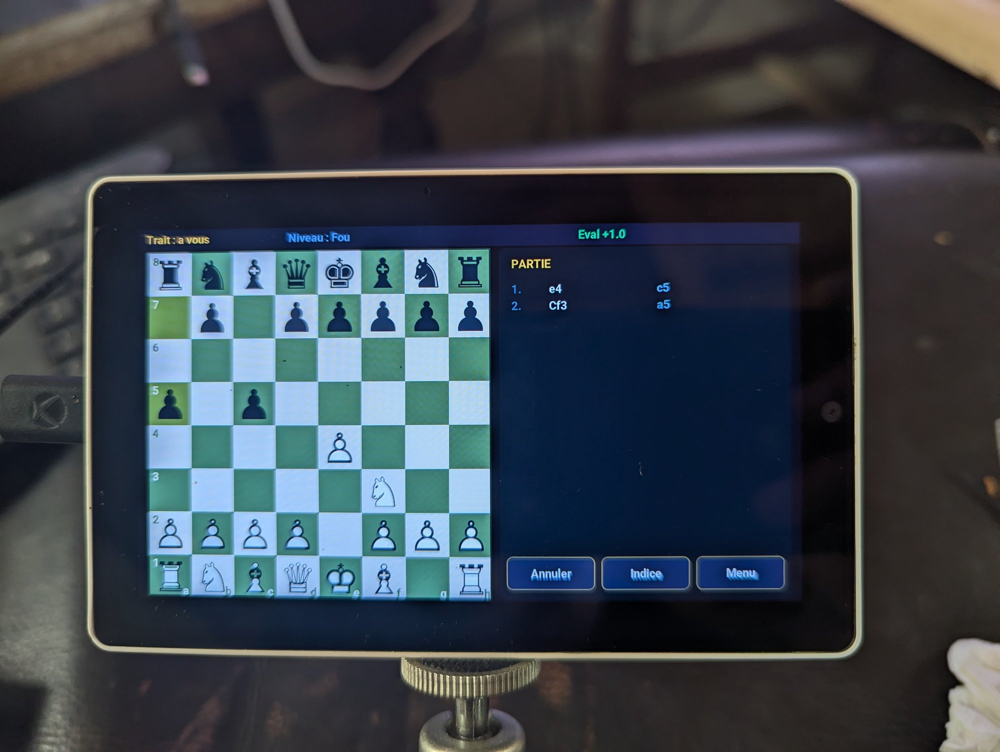 | 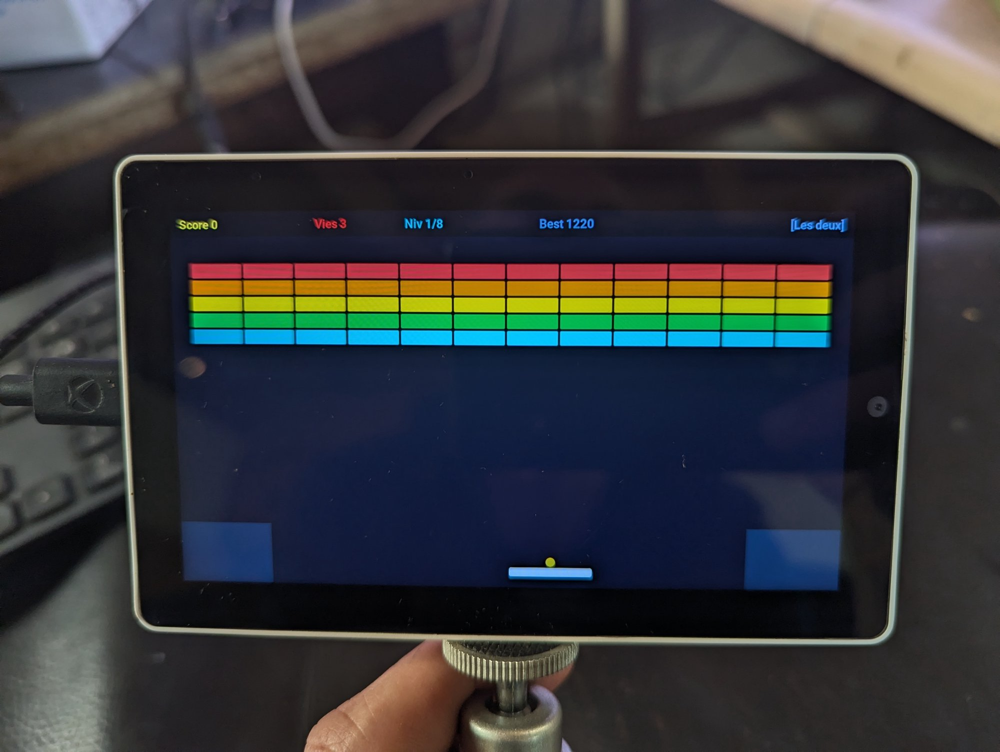 |

| Coureur d'Or (Lode Runner) |
|:-:|
| 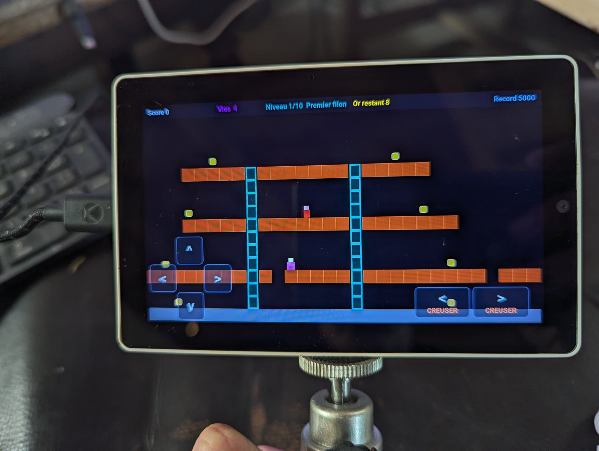 |

Sortie de chaque jeu : hub → « Quitter » (retour propre à `page_arcade` puis au dashboard : timer arrêté, score sauvegardé en NVS, et pour Neon Apron restauration de la rotation paysage).

→ Détails techniques complets par jeu : [`docs/arcade.md`](arcade.md)
