# Screens & Features

## English · [Français](#version-française)

---

This page describes what the Tab5 actually shows and does — verified against the firmware (`tab5-lvgl.yaml`, `ui_components/*.yaml`, `tab5_*.cpp`) on 2026-07-06, re-checked 2026-07-14 (info panel, console button, swipe zones). Since 2026-10-07 the pictures are renders of the current firmware (drawn by the firmware itself on a PC, with demo data, in the default theme), except the photo of the main page. The previous version of this page described a 6-tab, multi-screen navigation bar that no longer exists (and may never have shipped) — see [ADR-0002](decisions/0002-single-page-swipe-navigation.md) for why. If anything below stops matching the running firmware, the firmware is right — fix this page.

---

## Layout overview

There is a **single 1280×720 page** (`page_main`), not a tab-navigated set of screens. Three regions:

1. **Home area** — always visible: clock, indoor sensors, quick actions, compact climate card, and the row under the clock (plants and sensors).
2. **Central card** — a small area that automatically rotates between planning, rain forecast, weather alerts and an info panel (calendar recap / alert text).
3. **Bottom card region** — either the 5-card weather forecast (with the devices of each page's room in the tiles' shoulders), or, in HA mode, the 5 device cards of the current room.

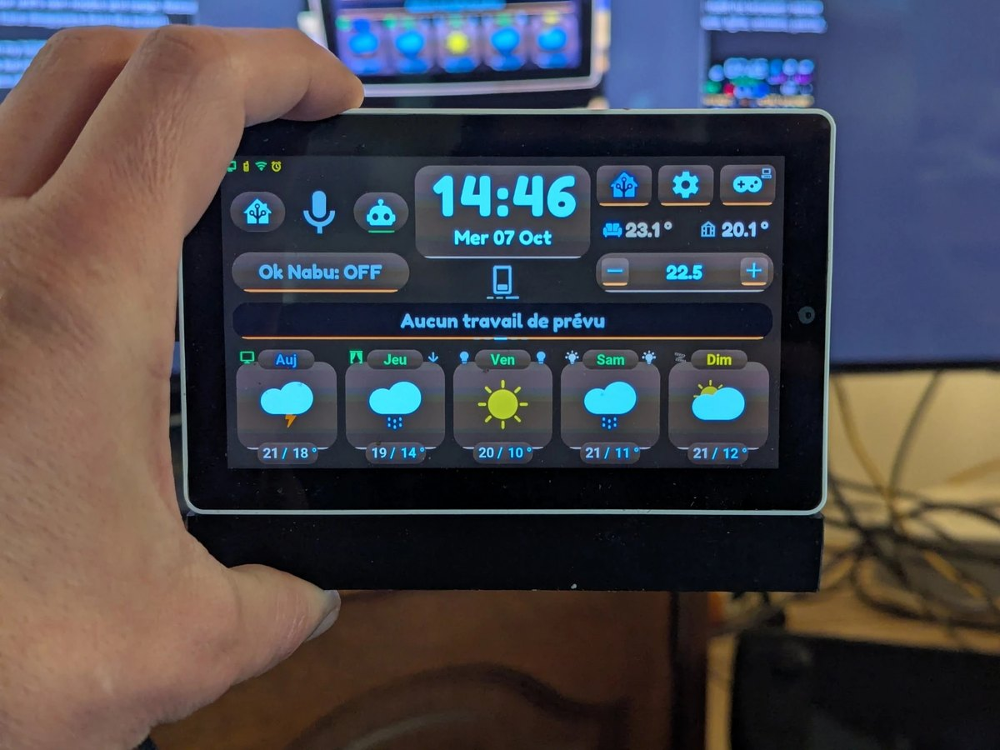

Windows open on top of this page — lights, shutter, climate, TV remote, voice assistant, calendar, alarm clock, plants, energy and settings — whose System page is the former system console — and the Arcade's games on pages of their own. Which touch opens each one and what every button does: the [user manual](notice/README.md); this page explains how each part works. The settings open on their Screen page with a tap on the gear button (`btn_control_console`, top right) and on their System page, the former console, with a long press on it; the console is no longer opened by swipe since the 14/07/2026 gesture rework.

---

## Generated screenshots

These pictures are not photos: the CI draws them without a tablet, from the same interface code, on every pull request that touches the screen ([ADR-0021](decisions/0021-host-render-stubs.md), workflow `rendu-host.yml`). The three scenes are those of [demo mode](demo_mode.md), on a fixed date (16 June, 07:45, Paris time), in French then in English. They are also the references the CI compares new renders with, so they match the current firmware.

| Scene | Français | English |
|---|---|---|
| Sunny day | 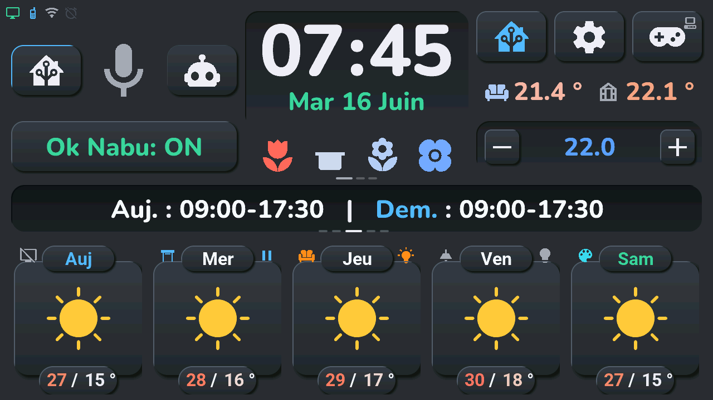 | 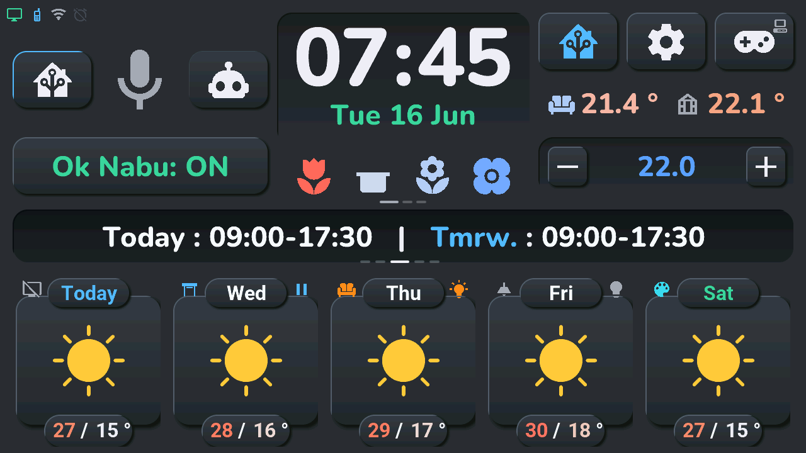 |
| Rain and orange warning | 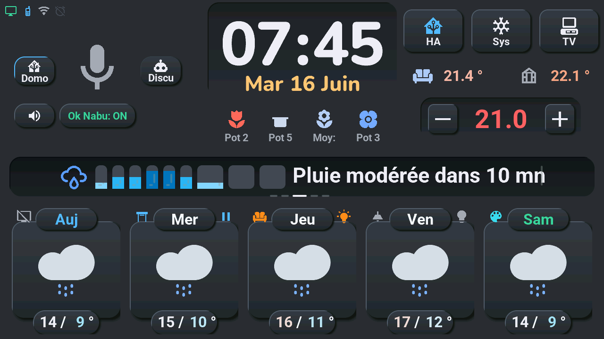 | 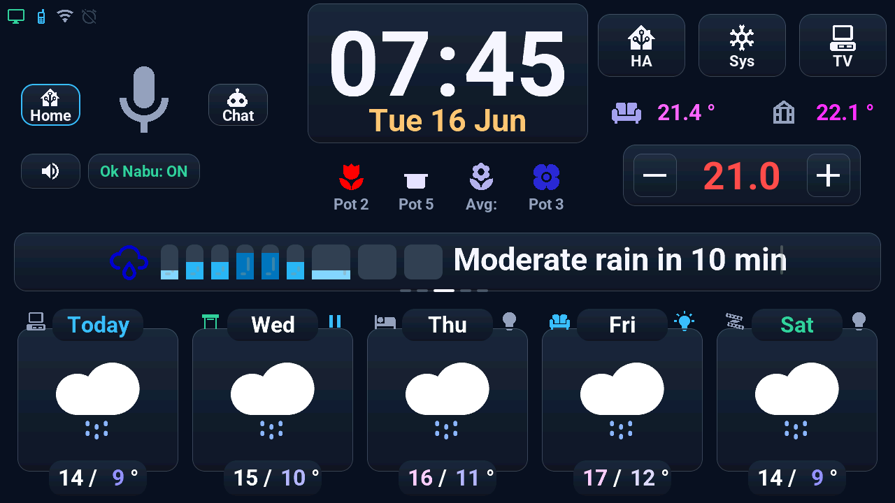 |
| Day off, plants to watch | 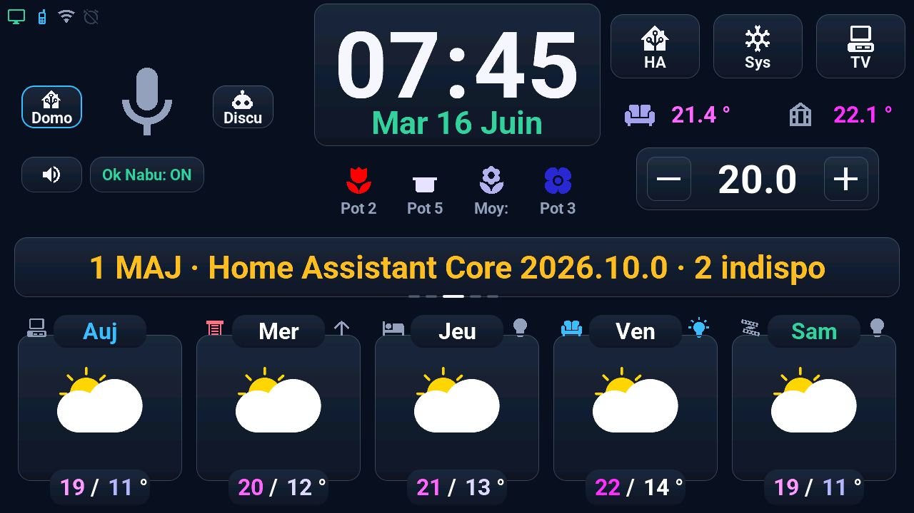 | 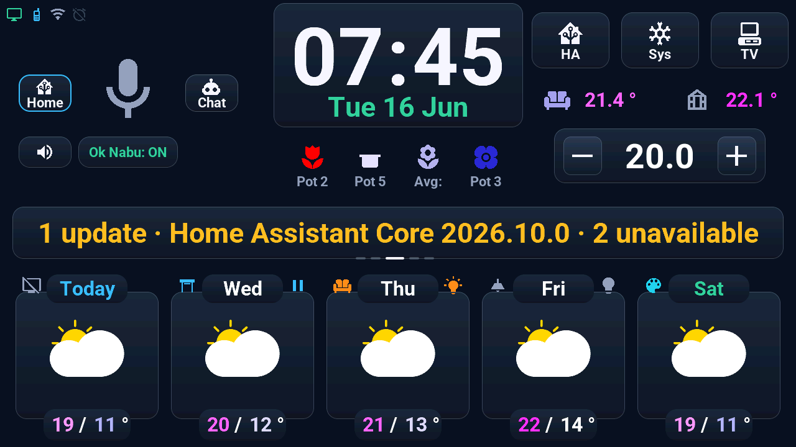 |

---

## Home area

Always-visible content at the top of the screen:
- **Status icons**, top left, from left to right: PC (green when on), phone (colour of its battery), Wi-Fi, alarm, **solar production** when the Energy section of the blueprint has a solar power sensor and the panels' peak power (its colour gives the production as a share of the peak, on the battery scale: green above 80 %, blue, amber, red below 20 %; a grey panel at 0 %, at night), and the **tablet's own battery** when the device switch **Tab5 Batterie montée** is on (off by default). A **plug** when no battery is detected (a voltage below 6 V in the last 10 minutes: the tablet runs on USB), in the theme's text colour; with a battery the glyph follows the level (full above 80 %, half, low, "!" below 20 %, a bolt while charging, "?" with no reading), in the same colours as the phone. A hidden icon leaves no gap: the others close up.
- Current time and date, three touch areas since 2026-10-09 ([ADR-0039](decisions/0039-gestes-accueil.md), `ui_components/horloge_zone.yaml`): hours (left half of the digits, `btn_horloge_heures`), minutes (right half, `btn_horloge_minutes`), date (below, `btn_horloge_date`), cut inside the « : » and between the digits and the date in every theme (`tests/test_gestes.py`). « Auto »: long press on the hours or minutes = alarm clock, long press on the date = calendar, tap on the minutes = next device of the − / + tile (`reglables_suivant()`), tap on the date = next line of the row under the clock (`rangee_toucher()`), tap on the hours = nothing; each is chosen in the blueprint like the top buttons below
- Indoor temperature and humidity
- Microphone icon with pipeline state color (see Voice assistant below), between the two voice-mode buttons (Home Assistant agent vs. conversation/LLM pipeline), and under them the wide **Ok Nabu: ON / OFF** wake-word button (the mute button is in the assistant popup since 2026-10-05)
- **HA**, **Settings** (gear) and **Arcade** (gamepad) buttons, top right, each with a long press since 2026-10-06: the Energy popup when the solar production is received (`solaire_present()`), the System page of the settings, the TV remote when the TV zone is present. A 26 px mini icon in the top-right corner of the HA and gamepad buttons (`icon_mini_ha`, `icon_mini_tv`: the glyphs of the status row and of the remote's header) says when that long press does something; the buttons no longer move without a TV. Since 2026-10-07 each long press can open another screen, and since 2026-10-09 ([ADR-0039](decisions/0039-gestes-accueil.md)) each tap can too, or run an action (device mode, next device of the − / + tile, next line of the row under the clock, wake word on / off), chosen in the blueprint (« Horloge et boutons du haut · Clock and top buttons », `gestes` key of `tab5_maj_emplacements`, the older `appuis` key still read): `geste_cible()` gives it, the `tab5_geste` script runs it and `tab5_ecran_ouvrir` (the routine of the « Aller à l'écran » select) opens a screen; a changed tap changes the button's main icon (`tap_glyphe()`), and the mini icon (`icon_mini_sys` on the gear too) shows the glyph of its window's header, hidden when the screen is missing from the home. The home buttons show their icon only, all at the same size (125 × 90, icons of 70 px); the three columns of the top area sit 20 px from the screen edges like the central card, with their tops aligned at y 20 and their bottoms at y 308, 25 px above the central card
- **Compact climate card** — current temperature (living room + greenhouse/serre sensors) and the target temperature with +/− buttons; tapping the target opens the climate popup (see Climate below). Tapping the living-room temperature unfolds the list of the « − / + tile »: the buttons can adjust another device instead (see Climate below)
- **Row under the clock** — the plants line (4 slots for up to 5 BLE soil moisture sensors, see Plant moisture below) and up to three lines of sensors picked in the blueprint, rotating with the central card (see Row under the clock below)

---

## Central card — planning / rain / alerts / info

A single card rotates automatically every 8 seconds (script `tab5_central_rotator_auto`, `tab5-scripts.yaml`; not while the screen is off or a popup is open) between up to eight panels: planning, rain, weather alerts, info and up to four HA alert slots. The rotation only runs on the default forecast window — swiping to another forecast window replaces the central card with a page-title overlay (`page_title_wrapper`) and pauses the rotation until you swipe back. That overlay is one line built in `forecast_page_title_parts()` (`tab5_central.cpp`), in the theme's date font: the actual span of the 5 visible tiles — `Du mercredi 5 août au dimanche 9 août` for daily windows (day names/dates from SNTP, `1er` for the first of the month), `De 14:00 à 18:00` for hourly ones, always oldest → newest even though the hourly tiles are laid out right-to-left. The pagination dots under the card show which window is open (the « Prévisions journalières · 2/3 » kicker was removed on 2026-10-05). If the dates aren't available yet (SNTP not synced and no HA payload), the card stays empty. Tapping a forecast card's temperature (see below) can also interrupt the rotation for a few seconds to show a specific day's schedule.

- **Planning** — part of the rotation unless Home Assistant has no work calendar (optional zone, lot 5). Shows the day's schedule.
- **Rain forecast** — only rotated in if `has_rain` is true. A short-term rain graph: one data point every 5 minutes for the first 30 minutes, then every 10 minutes for the following 30 minutes (9 points total, 1-hour window), sourced from Météo-France via the `tab5_maj_pluie_1h_bulk` API service (the 9 bars in one call).
- **Weather alerts** — only rotated in if `g_central_ctx.has_mf_alerts` is true. Shows one icon per active Météo-France vigilance type (wind, flooding, storms, etc.), each icon colored by its own severity: yellow (vigilance jaune), orange, or red (vigilance rouge) — the official Météo-France color codes, not to be changed.

**The date, not "a day", changes color with the current overall alert level:** independently of the rotation above, the date text under the clock in the home area (`lbl_date`, e.g. "Lun 06 Juil") is recolored every time an alert payload is received, based on the *overall* vigilance level for the day (green/default if none, pale yellow/orange/pale red for jaune/orange/rouge) — see `tab5-api-logic.yaml` in the `tab5_maj_alerte_meteo_france` service. This is separate from the per-type icon coloring in the alert panel above, which uses each alert type's own individual level rather than the overall one.

- **Info panel** — only rotated in if `has_info` is true. Shows either a 3-day calendar recap (multi-line, with inline color markup) or a Météo-France alert banner (single line, colored by severity), pushed by HA via the `tab5_maj_info_texte` service (`update_info_text_ui()`, `tab5_*.cpp`). **Tap dismisses it** (`tab5_dismiss_info_tap` → `dismiss_central_info_immediate`): the panel leaves the rotator immediately; the id is stored in `tab5_dismissed_local` so a re-push of the same id stays hidden until HA sends a new one.
- **HA alert / info slots (up to 4)** — pushed by `tab5_maj_alertes_ha_bulk` into `ha_alert_wrapper_0…3`. Each slot is its own rotator panel; **tap dismisses that slot** (`tab5_dismiss_ha_alert`, slot 0-3 → `dismiss_ha_alert_slot_immediate`) with the same local-dismiss behavior.

If neither rain, MF alerts, info nor HA alert slots are active, the rotation just keeps planning on screen (and leaves the card empty without planning).

**Temporary override:** tapping the max/min temperature of a daily forecast card (not the hourly ones) interrupts the rotation for **6 seconds** to show that specific day's opening-hours text in the central card, then automatically restores the previously active panel (`show_temporary_planning()`, `tab5_*.cpp` — this used to be an ESPHome script in `tab5-scripts.yaml`, moved to C++ in the 12/07 reboot fix).

---

## Bottom card region — rooms

Since 3.2 ([ADR-0023](decisions/0023-rooms-generic-tiles.md)) each of the 5 pages of the bottom row is also a **room** of up to 5 devices, described by Home Assistant (blueprint « Tab5 — emplacements », action `tab5_maj_tuiles`; states through `tab5_maj_emplacements`, keys `tRT`). Room 0 is the home page (days 0-4), rooms 1 and 2 the next daily pages (swipe left), rooms 3 and 4 the hourly pages (swipe right); tile T is the visual position, 0 = left. The definitions are kept in NVS, so the rooms are drawn before HA answers; the states are not (greyed « -- » until the first push). Model and drawing: `tab5_tuiles.cpp`.

The `btn_control_ha` button (top right, Home Assistant icon) toggles the region between the **weather mode** and the **HA mode** (`tuiles_mode_ha()`, flag `g_central_ctx.ha_mode`). It shows an accent border and icon while HA mode is on, and is hidden when no room has a device. Its long press opens the Energy popup when the solar production is received. « Aller à l'écran → Accueil » (the Home Assistant select) leaves HA mode.

### Weather mode (default)

5 cards, navigated by **left/right swipe** (from y 333: the central card and the bottom row), in 5 windows: 2 hourly + 3 daily. The order is deliberate (`forecast_page_suivante()`, `tab5_central.cpp`): a left swipe moves forward through the three daily windows and loops on them (from the last one back to the home window); a right swipe moves back, through the two hourly windows, and from the last hourly window back to the home window. See the [false positives note](troubleshooting.md#false-positives-worth-knowing-about-dont-fix-these-again) in `docs/troubleshooting.md`; what the user sees: [user manual, bottom row](notice/tiles.md).

**Hourly windows (2):** the next 15 time slots, 5 per window. Each card shows a time label, a two-layer weather condition icon (`IconeMeteo.ttf`), a color-coded temperature, and rainfall in mm (or `-` if dry). There is no separate wind-speed reading — "windy" is one of the possible weather *condition* icons (alongside sun/cloud/rain/snow/fog), not a distinct data field.

**Daily windows (3):** a 15-day forecast, 5 days per window. Each card shows:
- Day name, color-coded (see Color coding below)
- Weather condition icon (same two-layer system)
- Max and min temperature, individually color-coded — **tapping this shows that day's schedule in the central card for 6 seconds** (see above)

**Device shoulders and quick action.** On every page, a tile that holds a device of that page's room shows it in its two « shoulders », left and right of the title tab — left: the device's icon ([palette](tiles_icons.md)) coloured by its state; right: a bulb (light) or the arrow of a shutter's next move (pause while it moves), nothing for the other types — and an invisible button over the weather icon (`btn_jN_action` on the daily pages, `btn_hN_action` on the hourly ones) sends the tile's command; the weather keeps showing. A page without devices looks as before 3.2. With the device switch **Tab5 Appareils sur la météo** off (on by default; discussion #278), every page looks like a page without devices: the forecast cards show the weather only, and the devices stay in HA mode.

Tap and long press for each kind of device, and the blueprint's « on only », « confirm » and « read only » behaviours: [user manual, bottom row](notice/tiles.md#tap-and-long-press-by-device). In the firmware, `tuile_appui()` (`tab5_tuiles.cpp`) applies the table of [ADR-0023](decisions/0023-rooms-generic-tiles.md) to the tile's type (`lum`, `int`, `vol`, `med`, `act`, `cap`, `bin`, `cli`) and options (`o` on only, `k` a second tap within 3 s, `r` read only, `t` TV remote, `m` the blueprint's climate, `e` energy popup).

**Quick-action wheel — long press** (2026-10-07, asked in [discussion #278](https://github.com/Axellum/M5-Tab5-ESPHome-LVGL/discussions/278); two rings the same day, asked by the author; [ADR-0036](decisions/0036-quick-action-wheel.md), `tab5_roue.cpp`, `ui_components/roue_actions.yaml`). A long press on a light, a shutter or a climate whose settings HA sent — its weather tile, the badge of its HA-mode card or its row in the House popup — opens a wheel at once, in front of the popups' veil at 60 %. On the tile, a **hub**: the card's icon in the state colour, its state line, a thin arc gauge (brightness, position, setpoint within the unit's bounds) and the device's name. Above it, a **first ring** of round glass buttons (72 px, 180 px from the tile): **Home** on the left (the House popup; not there when opened from it), the commands, the **families** marked with a dot, then **Details** on the right (the tile's popup: lights, shutter, climate). Touching a family unfolds its choices on a **second ring** (290 px), centred on it: **light** Off or On · Brightness ▸ 10 · 25 · 50 · 75 · 100 % · with `c` Whites ▸ warm · cream · cold and Colours ▸ red · orange · gold · green · blue · purple (swatches); a light without dimmer On · Off; **shutter** Open · Stop · Close · Position ▸ 25 · 50 · 75 % (when it reports its position); **climate** Off · Mode ▸ (the modes it has) · Setpoint ▸ (its own and two steps each side) · Options ▸ (Eco, Boost, Quiet, Swing, Breeze, those it has). Each ring sits on a glass band (a rounded arc), the second tinted with the state colour. The current state is a glass tinted with the state colour, with a full rim and a glow. A command or a choice sends what the tile or its popup already sends (`esphome.tab5_action`, nothing new for HA) and closes the wheel; touching elsewhere or the hub folds the second ring, then closes the wheel; so do the popups' inactivity delay, any popup, the screen turning off and new tile definitions; a theme change or a pushed state repaints it open. Near an edge a ring turns by steps of 5°. No wheel (the popup opens directly): option `k`, a climate whose settings HA has not sent yet.

**Legacy mode (3.x blueprint).** Until the first definitions arrive (a firmware updated before its blueprint), room 0 is built from the 3.x slots and looks as in 3.1: card 1 PC/TV (shoulder = TV state, or PC state without a TV; long press = TV remote), card 2 the shutter, cards 3-5 the bedroom, living room and LED lights (long press = light popup), with the 3.x commands. On the shutter card, tapping the **title** flips the direction the next tap will send (the arrow in the top-right corner shows it); tapping the icon sends stop while the shutter moves, else open or close.

### HA mode

The 5 cards (`switches_card.yaml`) show the room of the current page, each drawn like the « tile » card of a Home Assistant dashboard in its vertical form (since 2026-10-06, discussion #278): the icon from the palette (70 px) in a round badge of its state's colour (the colour at 20 %, the icon at full strength; tap and long press on the badge), the name under it (cut with « … »; a tap on it flips a shutter's direction), and under the name a state line translated by the tablet — « 60 % », « Allumé » / « Éteint », « Mouvement » / « 45 % » / « Ouvert » / « Fermé », « Lecture » / « Pause », « Lancer », a sensor's value and unit, « Détecté » / « Présent » / « Verrouillé »… by device class, a climate's room temperature; « Hors ligne », greyed, when the entity is unavailable — and a colour by type and state (a light's own colour when it reports one). Empty tiles are hidden and the others centred. The central card shows « Pièce n/N » above the room's name; the rotator pauses. Tap and long press: [user manual](notice/tiles.md#tap-and-long-press-by-device).

**Swipe in HA mode** goes to the next / previous room that has a device, in the order of the weather pages (same wrap); the weather layers stay hidden and the pagination dots follow. With one room only, a swipe does nothing. Entering HA mode on a page without devices jumps to the nearest room that has some; leaving it shows the weather of the current page.

**Tap on the room's name** (the central card's title, HA mode only): the [House popup](#house-popup--every-room-at-once).

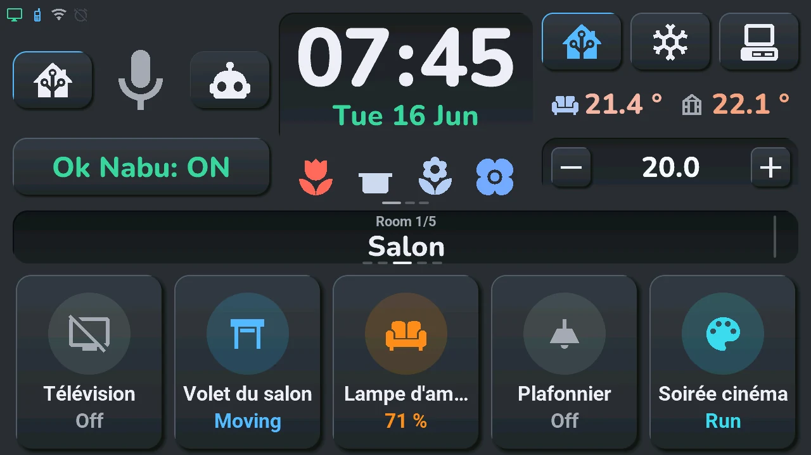

---

## Climate

Two levels of control. The compact card drives the blueprint's `climate` entity (input « Climatisation »); the popup drives the same one, or the climate of the tile that opened it:

- **Compact card** (always visible in the home area) — current temperature and target with +/− buttons. Always the blueprint's climate.
- **− / + tile of your choice** ([ADR-0033](decisions/0033-adjustable-tile.md), `tab5_reglables.cpp`, `ui_components/reglables_liste.yaml`) — tapping the living-room temperature (`btn_reglables_liste`) unfolds a list: the blueprint's climate, up to eight devices of the blueprint's « − / + tile » section (keys `rN`: volume, brightness, setpoint, humidity, fan speed, position, number), then the tablet's volume. The chosen device stays (NVS); a tap on the minutes of the clock (« auto ») moves to the next one without unfolding the list (`reglables_suivant()`). With the climate chosen, nothing above changes, except the climate's icon (`clim_consigne_icone`, `mdi_font_45`) 8 px left of its target since 2026-10-09; the target stays at the exact centre. With another device, its icon and value replace the target, − / + move the value on its step at once and one `esphome.tab5_action` (`rN` / `regler`, or `consigne` for a climate) leaves 250 ms after the last tap; tapping the value opens the popup of the tile carrying the same entity, or the TV remote.
- **Climate popup** (near-fullscreen, 1250×690 card 15 px from the screen edges, opened by tapping the compact card, a climate tile, or « Aller à l'écran → Climatisation ») — three glass cards:
  - **MODE**: Froid / Chaud / Sec / Ventilation / Éteint, stacked full-width (icons colored by the active mode, driven by `tab5_maj_clim`)
  - **TEMPÉRATURE**: a 320 px arc thermostat with the target shown large in the center, − / + buttons, and the actual room temperature at the bottom. Bounds, step and unit are the unit's own (16–30 °C and 0.5 until Home Assistant sends them, see below). The target updates **immediately** (optimistic) and a single `climate.set_temperature` is sent once the gesture ends (250 ms debounce — rapid ± taps are grouped)
  - **OPTIONS**: Éco / Boost presets (toggle), Silence (fan quiet), and airflow **Oscillation** / **Brise** (`windnice`, a Daikin Onecta mode previously unreachable from the screen)
  - **Any brand** ([ADR-0026](decisions/0026-climate-from-device.md)): the blueprint sends the unit's settings (key `climr`: `min_temp`/`max_temp`, `target_temp_step`, °C or °F, the modes it has, its name). The title becomes the unit's name, the arc and the ± buttons follow its bounds and step, and a button the unit cannot do disappears — an OPTIONS section left without a button disappears with its title and the others move up. The buttons still send the Daikin names (Éco = `away`, Silence = `quiet`, `swing` / `stop`), and the blueprint translates them to the unit's own (`eco`, `low`, `off`, `vertical`…), or sends nothing when the unit has no equivalent.
  - **Any climate tile** ([ADR-0027](decisions/0027-climate-per-tile.md)): a `cli` tile of a room opens the popup on its own unit — its settings (key `crRT`, same fields as `climr`) and its state (key `ceRT`) come with the tiles, and its buttons send the same commands with `emplacement: tRT`, translated by the blueprint the same way. Its target and mode reach the popup at once, its fan / swing / preset and room temperature within 5 minutes (with the measurements). A tile with option `m` is the blueprint's climate. Until Home Assistant sent the tile's settings (older blueprint), tapping it does nothing. The compact card keeps showing the blueprint's climate meanwhile, and closing the popup brings it back to that one.
  - Tapping the dark overlay or the × button (the shared 80×44 glass button of `modal_header.yaml`) closes the modal. 6 of the 10 buttons are factorized templates (cool/heat/fan/dry, eco/boost); the remaining 4 (off/swing/windnice/quiet) and the ± buttons are deliberately left as individual YAML — see [ADR-0007](decisions/0007-climate-popup-not-factorized.md).

The controls are dimmed (not hidden) when the AC is off, so the layout stays stable.

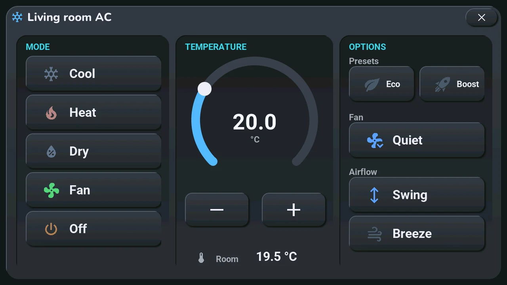

---

## Row under the clock

Under the clock, a 401 × 70 px row ([ADR-0031](decisions/0031-row-under-the-clock.md), `tab5_rangee.cpp`, `ui_components/rangee.yaml`) shows one line at a time: the plants line (below) and up to three lines of four devices picked in the « Sous l'horloge · Under the clock » section of the « Tab5 — emplacements » blueprint, three lines at most in all. The blueprint also sets where the plants line goes (first by default, second, third or hidden) and how long a line stays (8 to 120 s in steps of 8 s, 32 s by default).

- **Timing.** The central card keeps its 8 s. `tab5_central_rotator_auto` waits 7.8 s, turns the row (`rangee_tour()`), waits 0.2 s and moves the central card: when the row changes, it does just before the card, with the same short slide and fade (`transition_widgets()`). It does not turn with the screen off or a window open.
- **Layout.** Icons only (no sensor on the line): 70 px icons, like the pots. With values: the largest size that fits — the date's font of the theme with 45 px icons, then 32 px bold, then 22 px, then the icon above its value; past that the value is cut with « … ».
- **Colours.** An icon is coloured like a tile (on, off, offline). A value follows its measurement: the temperature scale (written « 21.4 ° »; °F brought back to °C for the colour), humidity and moisture the plant scale, batteries the battery scale, gold for power and energy (W / kW, kWh / MWh).
- **Touch.** A tap shows the next line at once and restarts its time; a long press on the plants line opens the plant details. The row commands nothing: a switch or a light only shows its state.
- Small dashes under the row (two or three) show which line is on; one line alone has none.

## Plant moisture card

Monitors up to 5 BLE soil moisture sensors, but only **4 slots are shown** (`sort_and_update_moisture_slots()`, `tab5_*.cpp`). The sensors are sorted by moisture level (driest to wettest) each update, then mapped to slots as: driest, 2nd-driest, **the median-ranked sensor** (it shows that one sensor's raw reading, it is not a computed arithmetic average of all 5), and wettest. Because the mapping is by rank rather than by fixed sensor identity, *which* physical pot appears in which slot changes over time as moisture levels shift.

Each slot shows the sensor's icon only, in its moisture-level color (see Color coding below), at the size of the home buttons; the pot names and readings are in the plant details popup (long press). The "Pot N" / "Moy:" caption under each icon was removed on 2026-10-05.

### Plant details popup — long press

A **long press on the plants line** of the row under the clock opens a near-fullscreen modal (1250×690 card, 15 px from the screen edges) with **5 fixed glass cards — one per sensor** (card N = sensor `moisture_N`, same icon as the dashboard, no dynamic sorting here). Each card shows:

- the pot name and its plant icon, colored by moisture level (same scale as the dashboard)
- the soil-moisture % (large) and a watering status: **OK** (green), **Bientôt sec** (≤ 20 %, amber), **À arroser !** (≤ 14 %, red — aligned with the `get_humidity_color()` red zone) or **Hors ligne** (sensor unavailable)
- four metric rows: **Fertility** (EC conductivity, µS/cm), **Light** (lx), **Temperature** (°C, `get_temperature_color()` gradient) and sensor **Battery** (%, `get_battery_color()` scale)

Values are pushed continuously by the `pot*_ec/lux/temp/bat` HA sensors (`update_pot_metric_ui()`, `tab5_*.cpp`) — the popup needs no sync on open. Tapping the dark overlay or the × button (the shared 80×44 glass button) closes it. Components: `pots_popup.yaml` + `pot_detail_card.yaml` (5 instances).

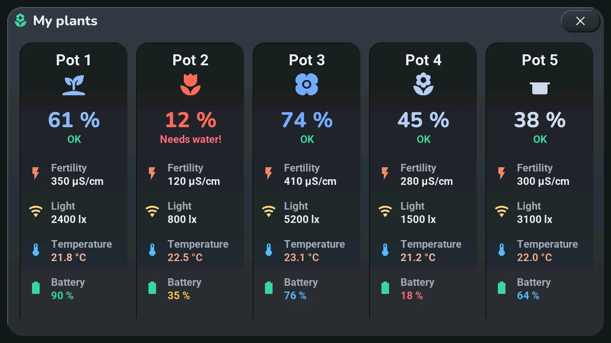

---

## Calendar popup — long press on the date

A **long press on the date**, under the clock (`btn_horloge_date`, « auto »; the gestures of the clock are chosen in the blueprint since 2026-10-09, see the home area above), opens a near-fullscreen monthly calendar (1250×690 card, 15 px from the screen edges): a 7×6 Monday-first grid with ◀ / ▶ month navigation and an "Aujourd'hui" (today) button. The grid itself — day numbers, Monday-Sunday alignment, weekend dimming, today highlight (cyan border) and past-day fade — is computed **locally** from the SNTP clock (`cal_render_month()`, Sakamoto's algorithm), so the calendar works even with HA offline.

Home Assistant then enriches each viewed month **on demand** (`script.tab5_calendrier_mois` → `tab5_maj_calendrier_mois`, cached per month, cache cleared on open):

- **work hours printed inside each day cell** ("09:30-20:15", pink when the shift starts before 9 am — same convention as the central planning banner), from the work calendar (the events whose title holds the « Tab5 · mot des événements de travail » keyword, or all of them)
- **public holidays** — day number turns rose (whitelist of real French holidays; civil observances like Mother's Day only appear in the day detail)
- **school holidays** — soft violet cell background, from the calendar chosen in « Tab5 · agenda des vacances scolaires » (in France, the ministry's ICS file of your zone; until 2026-09-29, a static Zone A table)
- **appointments** (gold dot) and **birthdays** (pink dot) from the family/birthday calendars

**Tapping a day** opens a 780×540 detail sub-popup (`script.tab5_calendrier_jour`): "Mardi 21 Juillet" title and up to 6 typed lines with colored MDI icons — holiday name, school-holiday label, work hours, timed appointments, birthdays, civil observances — with "Chargement...", "Rien de prévu ce jour" and "Home Assistant hors ligne" states. Closing follows the v2 popup recipe (the shared 80×44 glass × buttons, `scrollable: false` everywhere). Components: `calendar_popup.yaml` + `cal_grid_build()` (42 cells built in C++) + HA package `HomeAssistant_Config/packages/tab5_calendar.yaml`.

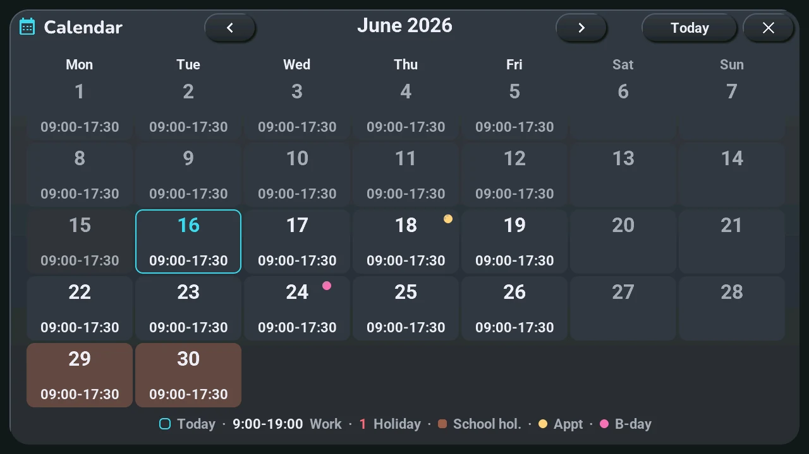

---

## Alarm clock — long press on the time

A **long press on the time**, hours or minutes (`btn_horloge_heures`, `btn_horloge_minutes`, « auto »), opens the alarm settings (1250×690 modal card); the long press on the date opens the calendar. Until 2026-10-09 a short tap on the clock opened it. A small bell in the top status row shows the state at a glance: **green** = armed with a computed ring time, **amber** = armed but no day qualifies (the classic trap of "work days" mode during a holiday week), **struck through and dim** = off.

**The alarm rings without Home Assistant.** The time comes from SNTP, the next 15 days of work hours are already cached on the device (`cal_jours_data[]`, pushed every 10 min), and the ringtone is an RTTTL melody synthesised on the device — a pure sine, not a file. HA only adds comfort: the spoken briefing, appointment reminders, and an optional custom ringtone URL (with automatic, silent fallback to the local melody when HA doesn't answer).

**Three modes**, because "base it on the calendar" means two different things depending on the day:

| Mode | When it rings |
|---|---|
| **Fixe** (fixed) | At the set time, on the weekdays you ticked |
| **Travail** (work days) | Same time, but only when the calendar says there is work |
| **Ouverture** (before opening) | Time is **derived from the shift**: shift start − a configurable lead, clamped by "never before" / "never after" |

The **closing time is used too**, through the **"repos mini"** (minimum rest) setting: after a 21:00 close, a 9 h rest forbids ringing before 06:00 — clamped by "never after", so rest can never make you late. The **day selector only governs the fixed time**: a calendar-driven day rings whatever the weekday, otherwise unticking Saturday would make you miss a Saturday-morning opening.

**Stopping it: voice or touch.** Touching anywhere on the ring screen stops the alarm; "Répéter" (snooze) stays a separate button. For voice, the microWakeWord **"Stop" model was already on board** (it only served to stop the roller shutter): it is armed while ringing, and any wake word cuts the alarm. The wake-word engine is started even if "Ok Nabu" is off — otherwise the promise wouldn't hold for anyone who mutes the mic at night. Each melody pass is followed by **2.5 s of silence**: that is the window where the mic has a chance to hear you.

Other settings: 4 melodies (‹ › picks one and plays it), a **dedicated alarm volume** (independent of the system volume), fade-in, snooze length, maximum ring duration, and a spoken wake-up briefing (time, today's shift, next appointment, temperature).

**Appointment reminders**, N minutes ahead (0–120, configurable). HA pushes the list of timed appointments every 5 minutes; **the firmware runs the countdown**, so an HA outage between the push and the deadline doesn't miss anything. Components: `alarm_popup.yaml` + `alarm_ring_overlay.yaml` + `Tab5/paquets/tab5-alarm.yaml` + `Tab5/socle/alarm_clock.h/.cpp` + HA package `HomeAssistant_Config/packages/tab5_reveil.yaml`.

---

## Voice assistant

The microphone icon on the home screen is the visual interface for the voice assistant; its colour follows the pipeline state (`assist_set_pipeline_state()`): standby (wake word off), idle, listening, processing (STT + intent), speaking (TTS), error. The colours, the wake-word button, the two mode buttons (Home Assistant's conversation agent, or an LLM-backed conversation pipeline) and the microphone's tap and long press: [user manual, voice](notice/voice.md).

When the list « Tab5 · pipeline de discussion » is set to « Aucun » (no conversation pipeline), the two mode buttons (home screen and assistant popup) disappear and the tablet stays in Home Assistant mode (zone `discussion`, [installation](installation/adapt-to-your-home.md#other-zones)).

The mode is saved across reboots via the HA `select` entity (`select.m5stack_tab5_home_assistant_hmi_assistant`).

**Second on-device wake word — "Stop":** a second microWakeWord model (`Stop`) is armed only while the roller shutter is moving (`volet_en_mouvement` global) and disarmed as soon as it stops. Saying "Stop" then halts the shutter directly from the device (`script.tab5_volet_action`) — no "Okay Nabu", no pipeline round-trip.

**Interrupting a reply:** tapping the microphone icon while the assistant is speaking (blue) stops the current reply (pipeline stop, which Home Assistant follows, + the speaker) and immediately re-opens listening (`tab5_vocal_interrupt_and_listen`) — the reliable way to cut a long Discussion answer short, since the wake word is inactive while the pipeline is in its responding phase.

**Assistant popup** (long press on the microphone, `btn_assist_trigger`; its buttons: [user manual](notice/voice.md#the-voice-assistant-window)). In conversation mode a voice request opens it by itself (`on_stt_end` → `tab5_assist_on_request`); in Home Assistant mode the central card's 8 s banner stays the quick feedback. The answer is rendered from Markdown (tables re-aligned approximately — proportional font since 26/09/2026 —, bold, code, bullets), plus an image downloaded on demand (`online_image`, PNG → RGB565, 760×360). The engine can push a rich answer through the `tab5_assist_reponse` service (variables `texte` = Markdown, `image_url` = optional PNG).

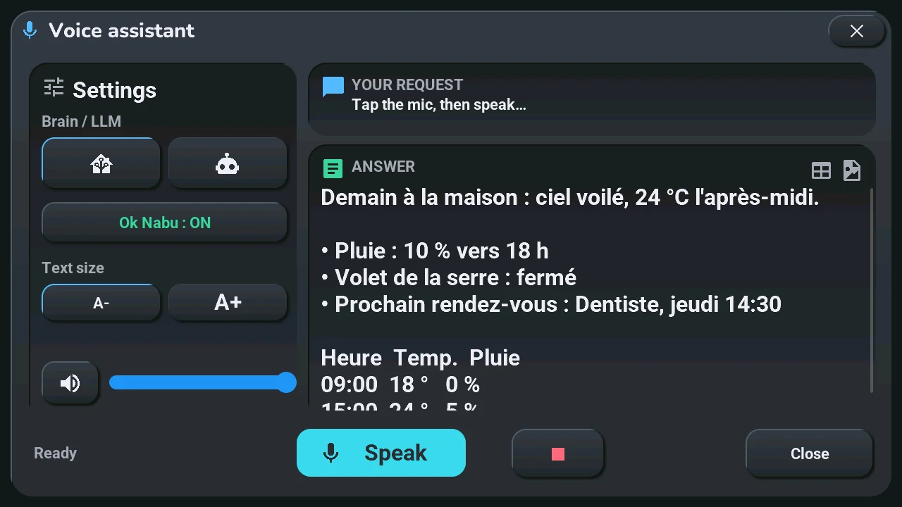

---

## System page of the settings (former console)

The fourth page of the [settings popup](#settings-popup) since 2026-10-08 (`console_sys.yaml`, a popup of its own before). It opens directly with a long press on the gear button (`btn_control_console`, top right of the home area; a tap opens the Screen page) or with « Aller à l'écran → Console système » — the option keeps its name for Home Assistant and the blueprint. Its refreshes only run while the page is shown (`reglages_page_visible(REGLAGES_PAGE_SYSTEME)`). **Four glass cards**:
- **MÉMOIRE** — SRAM/PSRAM usage bars, max free block, flash size
- **RÉSEAU** — Wi-Fi SSID, IP, signal strength, and HA connection status (`lbl_sys_ha_val`, green/red)
- **SYSTÈME** — uptime, CPU temperature, CPU load of each core (core 0 · core 1, measured every 2 s while the page is shown), loop time, the tablet's battery (level and voltage with the status-bar icon, level and power drawn while on battery since the next version, "On USB" when no battery is detected, "Not fitted" while the « Tab5 Batterie montée » switch is off; 2026-10-06, discussion #278), plus the volume slider with a live % readout
- **GESTION** — HA management buttons: « MAJ Écran » (re-arms the push flag and re-triggers the screen-push automation — the direct remedy for the recurring frozen-screen incident), « Recharger autos » (`automation.reload`), « Redémarrer HA » and « Reboot tablette » — the last two behind Annuler/Confirmer overlays (no more invisible double-tap arming) — in a 2 × 2 grid since the theme row moved to the settings popup (2026-10-06)

It is **not** a log viewer (use `tools/tab5_logs.py` for payloads and events). See [`docs/debugging.md`](debugging.md) for more on using it to diagnose issues.

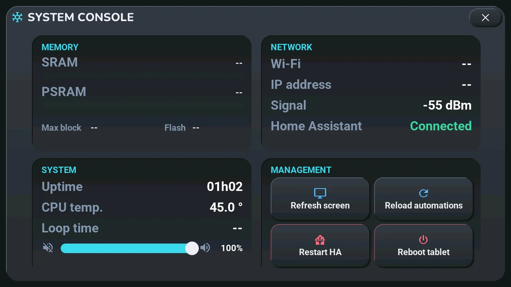

---

## Settings popup

Opened on its Screen page by a tap on the gear button (`btn_control_console`, top right) or by « Aller à l'écran → Réglages », on its System page by a long press on the gear button or « Aller à l'écran → Console système » (`reglages_popup.yaml`, the shared modal chrome of ADR-0009; scripts in `tab5-reglages.yaml`, painting in `tab5_reglages.cpp`). Four pages since 2026-10-08, named at the top next to the title, the page shown lit (`reglages_onglet.yaml`). A tap on a name shows its page; a left / right slide in the popup shows the next / previous one, wrapping around, instantly. The popup catches the gesture (`LV_EVENT_GESTURE`, no bubbling to `page_main`, so the dashboard does not change page behind it); a slide that starts on a slider moves the slider only, and the tap at the end of a slide chooses nothing (`ui_appui_glisse()`). Changing page or closing the popup cancels an open confirmation.
- **ÉCRAN** — a brightness slider (10-100 %, it writes the backlight itself), the auto screen-off delay (Jamais, 1, 2, 5, 10, 30 min), and Oui / Non for waking the screen on « Okay Nabu » and with a tap;
- **APPARENCE** — the theme between two arrows (previous / next, wrapping round), Sombre / Clair / Auto, Oui / Non for the night switch of Auto mode, and the seven languages, each in its own name. A language asks first (Annuler / Confirmer): the tablet restarts to apply it;
- **BATTERIE** — on the left the three battery settings: the charge limit (100 % / 80 %: at 80 % the charge stops at 80 % and resumes at 70 %, for a tablet always plugged in), power saving (Jamais, Sur batterie, Toujours) and Oui / Non for « battery fitted »; on the right, read only, the state (Sur batterie, En charge, Sur USB, Pas de batterie détectée, or Mesure en cours before the first reading), the level, the voltage and the power drawn (« -- » without a battery). These values are repainted only while the page is shown (`reglages_batterie_peindre()`);
- **SYSTÈME** — the former system console, described [above](#system-page-of-the-settings-former-console).

Each button writes the device entity Home Assistant sees (`tab5_reglages_choisir`), and each of those entities repaints the popup when it changes (`tab5_reglages_sync_ui`, run from its `on_value` / `on_state`): a change made from Home Assistant shows at once, and the option in force has an accent border. The brightness slider is read when the popup opens. The same settings in Home Assistant: [Tablet settings](installation/settings.md).

---

## Light popup — long press

Long-pressing a light tile — its weather shoulders or its HA-mode card — (instead of the short tap that just toggles it), then **Details** on the quick-action wheel (see above; a light with option `k` opens it at once), opens a near-fullscreen modal (1250×690 card, 15 px from the screen edges), organized in three glass cards:
- **AMPOULE** (left): a selector listing **the lights of the room** (up to 5, in tile order, rows tightened beyond three; icons colored by on/off state, cyan border on the selection, the pressed light selected) to switch lights without closing the popup, a large **On/Off** button and **Tout éteindre** (every light of the room, `pR / eteindre`; in legacy mode the three 3.x lights)
- **LUMINOSITÉ** (center): a **320 px brightness arc** (0–255) with the **% value shown live** in the center — synced from the HA `brightness` attribute at open time and live (never during a drag), debounced 200 ms so one drag sends a single `light.turn_on` — plus 4 shortcuts 10/35/65/100 %
- **COULEURS** (right): 3 named whites (Chaud/Crème/Froid) and a 4×3 grid of **12 round color swatches** (each sends `light.turn_on` with the matching `color_name`, factorized via `light_color_preset_btn.yaml`)
- Tapping the dark overlay or the × button (the shared 80×44 glass button of `modal_header.yaml`) closes the modal

The popup is context-aware: the long press opens it on the pressed light, and the selector goes through `script.tab5_light_popup_show(light_idx)` (`popup_lumiere_choisir()`, `tab5_tuiles_popups.cpp`), which sets the `current_light_slot` global to the tile's key (`tRT`, or `lumiere_N` in legacy mode) and syncs the title, selector, power icon and arc — one popup for every light of every room.

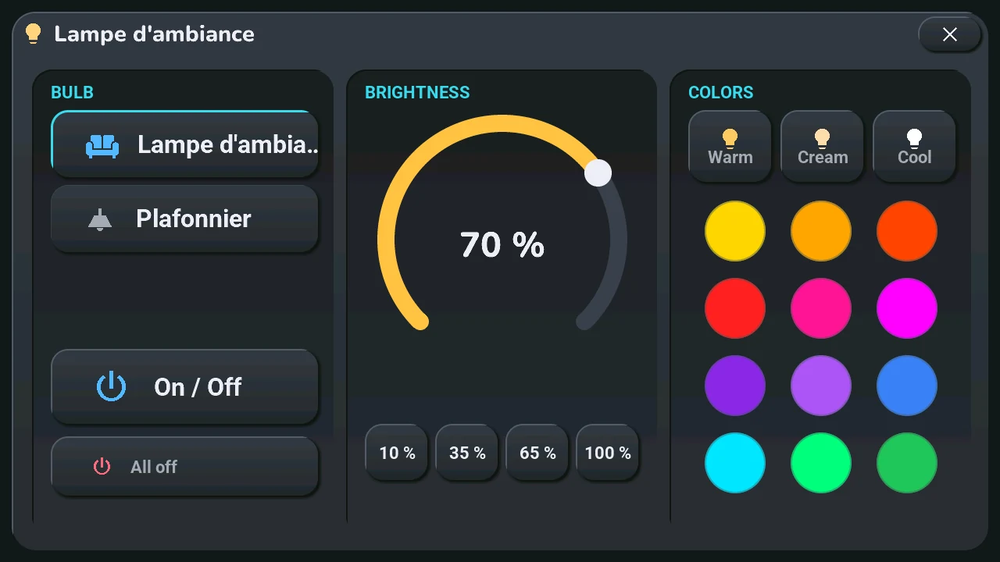

---

## TV remote popup

A near-fullscreen Samsung TV remote (`tv_remote_popup.yaml`, 1250×690 card — the shared modal tokens of ADR-0009, 15 px from the screen edges): power, source and menu keys, a round navigation pad with OK, a volume column with mute, the Play · Pause · Back · Home keys and a row of app buttons (Netflix, Prime, YouTube, CANAL+, PC). Opened by long-pressing a media tile with the TV option (`t`; the PC card in legacy mode) or by a long press on the gamepad button (`btn_control_tv`, when the TV zone is present); every key emits a `tab5_action` event (`emplacement: tv`, [ADR-0025](decisions/0025-events-only.md)) that the blueprint automation sends to the remote picked in « Télécommande de la TV » (`remote.send_command`), the app buttons through `script.tab5_tv_app` (`tab5_tv.yaml`) — the Tab5 carries no IR hardware, HA's Samsung integration does the work. Tapping the dark overlay closes it.

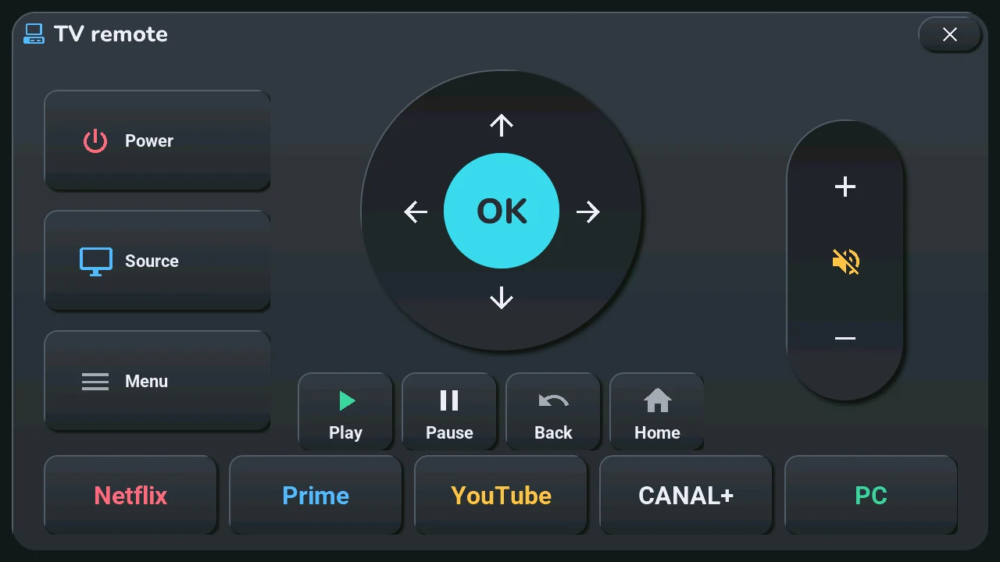

---

## Energy popup — solar installation (optional)

Shown only if sensors are picked in the « Énergie » sections of the blueprint ([ADR-0028](decisions/0028-solar-energy-popup.md)). Opened by tapping a sensor tile of those sections (tile option `e`; the solar sensor gets the solar-panel icon), by a long press on the HA button when the solar production is received, or by « Aller à l'écran → Énergie ». Same modal chrome as the other popups (`energie_popup.yaml`, ADR-0009), drawn by `tab5_energie.cpp`:

- **Top, live**: up to four glass cards — **Solar** (power, « Today » production), **Home** (consumption), **Grid** (power, « From the grid » / « To the grid » / « No exchange »), **Battery** (level with a battery icon that follows it, « Charging » / « Discharging » / « Idle », temperature). A card without a sensor disappears and the others share the width. Units stay short (W, kW, kWh).
- **Bottom, history** (needs the produced-energy sensor): the title gives the period and its total (« Today · 3.20 kWh »), three buttons switch between **Hours** (24 bars, today), **Days** (30 days) and **Months** (12 months). Gold bars, the current slot in the accent colour, a line at the maximum with its value. Without that sensor, the cards fill the popup.
- Before Home Assistant answers: « En attente de Home Assistant »; section empty: « Aucun capteur d'énergie choisi ».

HA pushes only while the popup is open (package `tab5_energie.yaml`); instant transitions, like every popup.

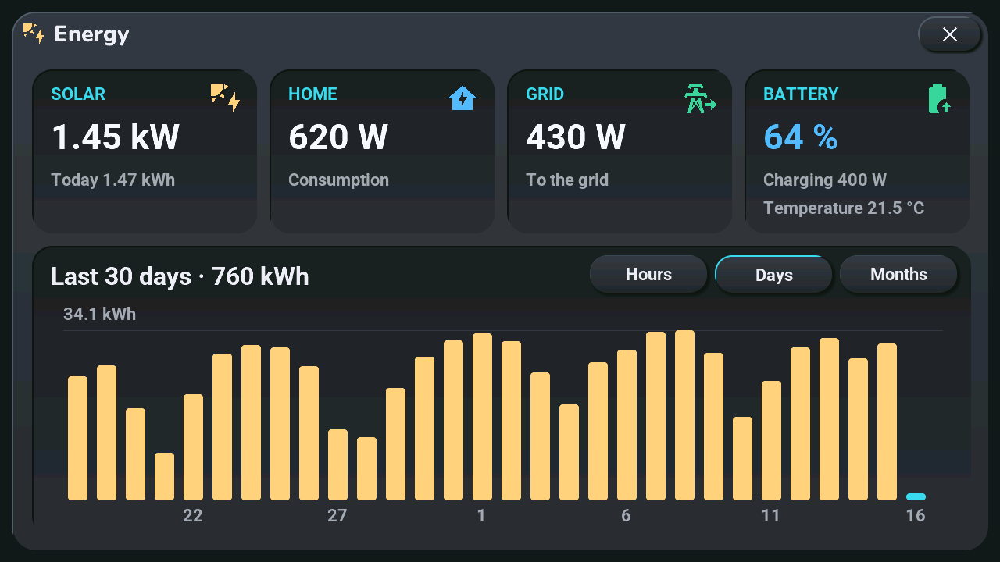

---

## Temperature popup — history and forecast

Opened by a long press on one of the two home-screen temperatures ([ADR-0032](decisions/0032-temperature-history-popup.md)): the room's (`salon` slot) or the second one (`serre` slot, a greenhouse or outdoors). A tap on the second one still opens the Arcade.

- **Top**: **Now** (and the average of the period), **Minimum** and **Maximum** with when they were reached, each in the screen's temperature colour. For the second temperature, a fourth card: the highest forecast temperature, the lowest below.
- **Bottom**: the title gives the place (the sensor's area, pushed by HA) and the period; three buttons switch between **24 h** (hour by hour), **7 days** (every three hours) and **30 days** (day by day). The accent line is the mean of each slot, ending on the current value (a dot); a pale bar behind it goes from the minimum to the maximum. Grid every 1, 2, 5, 10… degrees, time axis every 3 h, 6 h, a day…
- **Forecast** (second temperature only): a gold line on a tinted background after a « Maintenant » mark, with gold min-max bars for a day-by-day forecast. The blueprint box « La seconde température est dehors » makes it extend the curve (« Prévu »); unticked, it is the outdoor forecast next to a greenhouse (« Dehors, prévu »).
- Before Home Assistant answers: « En attente de Home Assistant »; sensor without statistics: « Aucun historique ».

HA pushes once per request, only while the popup is open (package `tab5_historique.yaml`, recorder statistics and `weather.get_forecasts`); the tablet keeps the three views of the temperature shown in PSRAM (~6 KB) and nothing in NVS.

---

## House popup — every room at once

Opened by a tap on the room's name in HA mode, or by « Aller à l'écran → Maison » ([ADR-0037](decisions/0037-house-popup.md), discussion #278). Shared chrome (ADR-0009), card of 1250 × 690, title « Maison ».

- **One column per room** of the blueprint that has devices, room 1 → 5 (the blueprint's order, not the pages'), width (1250 − 24 − 12 (n − 1)) / n: about 235 px with five rooms, 607 px with two. Header: the room's name, or « Pièce n »; « Aucun appareil » without any room.
- **One row per device** (104 px, glass card): the palette icon (32 px) in a 56 px badge of its state's colour, the name and the state line, painted by the same `Vue` as the HA-mode card (`tuile_peindre_ligne()`), cut with « … » at the column's width.
- **Gestures of the tile**: tap, long press and the « ⋯ » button (36 px, only on the types that have a long press: not `cap`, `bin`, nor a tile with the `r` option) go through `tuile_appui_piece()`; the long press and « ⋯ » first open the tile's quick-action wheel (see above, without its Home link) around the row's badge, in front of the House popup, and without a wheel the tile's popup. A popup opened from a row or from the wheel's « Details » comes over the House popup, which stays behind; the inactivity closes both.
- **« Éteindre les lumières »** in the title bar, shown when a room has a `lum` tile: the light popup's « Tout éteindre » (`pR` / `eteindre`) for each of those rooms, no confirmation.

Nothing new with Home Assistant: no event, action or blueprint input. Widgets are YAML templates (`maison_popup.yaml`, 5 headers, 25 rows), laid out and painted at each opening and repainted while shown when a state or the definitions change.

---

## Color coding for readability

Color is used consistently as a primary information channel — to let you read state at a glance without reading labels.

**Temperatures:** mapped to a continuous scale via `get_temperature_color()` — blue (cold) → green (comfortable) → orange (warm) → red (hot). Applied identically to indoor sensors and forecast temperatures.

**Day names on daily forecast** (`refresh_daily_forecast()`, `tab5_*.cpp`):
- Cyan — today
- Green — day off (non-Sunday)
- Amber — Sunday, day off
- Rose/Red — Sunday worked, **or** any day with a shift starting before 09:00 ("early")
- Dim slate — past day (overrides the above once the day has passed)

**Plant moisture (`get_humidity_color()`):**
- Red — ≤ 14% (very dry, needs watering)
- Gradient green → white-ish — 30–80%
- Blue — ≥ 80% (too wet)

**Batteries (`get_battery_color()`)** — phone, tablet and solar production icons of the status bar (solar: grey panel at 0 %), battery line of the plant details popup:
- Green — above 80 %
- Blue — 41–80 %
- Amber — 20–40 %
- Red — below 20 %
- Grey — unknown

**Microphone icon:** see Voice assistant above.

All interface colours live in one palette, `struct Palette` in `tab5_tokens.h` (included by `tab5_custom.h`); `UIColor` is the active one. The YAML takes them through the role styles of `tab5-styles.yaml` (`style_text_dim`…), the games keep their own dark palettes ([ADR-0029](decisions/0029-themes-palette.md)). Twenty-one themes, each with a dark and a light mode, change the colours, the shapes (radius, borders, shadows) and the fonts of the time, the date and the titles; a new tablet starts in « Relief doux ».

The theme, the mode (Sombre, Clair, Auto) and the « Nuit (thème auto) » switch are entities of the tablet, also in the settings popup: [Tablet settings](installation/settings.md#theme-light-or-dark).

---

## Roller shutter control

Since 3.2 every `vol` tile is a shutter or a valve of its own (tap: stop while it moves, else close if open, open otherwise; the right shoulder shows the arrow of the next move).

**Shutter popup — long press** (2026-10-05, asked in [discussion #278](https://github.com/Axellum/M5-Tab5-ESPHome-LVGL/discussions/278); [ADR-0023](decisions/0023-rooms-generic-tiles.md), updates of 2026-10-05 and 2026-10-06). A long press on a `vol` tile — its weather shoulders or its HA-mode card —, then **Details** on the quick-action wheel (2026-10-07, see above), opens a near-fullscreen modal (`volet_popup.yaml`, the shared chrome of ADR-0009) titled with the tile's name, in two glass cards:
- **POSITION** (left): a **drawn shutter** (2026-10-06, « like the HA animation, not a basic slider »): a window whose slatted curtain comes down from the box at the top as the position goes down (12 slats built in C++, `lames_construire()`). Drag it with a finger, up or down, anywhere on the window: the curtain and the number follow the finger, and the position leaves **on release only** (`position`, `cover.set_cover_position` / `valve.set_valve_position` on that tile's entity, when it can set one); a touch that does not move (under 12 px) sends nothing. To its right, the position in large digits (« 45 % ») and the state in words below (« Ouvert », « Fermé », « Partiel », « En mouvement », « Hors ligne »). A shutter that does not report its position (or the simulated shutter of `optionnel/volet_serre_tracking.yaml`) cannot be dragged and shows no number: the drawing shows its state (open = curtain up, closed = down, anything else = half-way with faded slats) and the words.
- **COMMANDES** (right): **Ouvrir**, **Stop** and **Fermer**, the tile's own commands; each icon sits in a round tinted badge, like a Home Assistant tile.
- The popup follows the shutter while it is open (position, state): every pushed position redraws the curtain at once, without an animation of its own (the drawn shutter goes down as the real one does, push after push), never under the finger. With option `k` the long press keeps sending the other of open / close (confirmed by a second press); option `r`: nothing. In legacy mode, the 3.x shutter (`tab5_maj_volet_etat`) is tile 1 of the home page: its weather card has both the direction flip (tap the title) and the action button (tap the icon) described above, and its HA-mode card shares the same `script.tab5_volet_tap`.

## Device popup

**Long press on a switch, a scene or a media player** (2026-10-06, asked in [discussion #278](https://github.com/Axellum/M5-Tab5-ESPHome-LVGL/discussions/278): « buttons can have pop up screen like ha dashboard »; [ADR-0023](decisions/0023-rooms-generic-tiles.md), update of 2026-10-06). A long press on an `int` or `act` tile, or on a `med` tile without option `t` (with `t`, the TV remote) — its weather shoulders or its HA-mode card — opens the « more info » window of a Home Assistant dashboard for that device: a near-fullscreen modal (`appareil_popup.yaml`, the shared chrome of ADR-0009, registered as « Appareil ») titled with the tile's name, in two glass cards:
- **ÉTAT** (left): the tile's icon in a round badge of its state's colour (the colour at 20 %, the icon at full strength), the state in words as on the HA-mode card (« Allumé », « Éteint », « Lecture », « Pause », « Hors ligne »; « Prêt », or « En cours » for a running script, for an `act`), the room, and the tile's options in words (`o`: « Allumer seulement », `k`: « Confirmer chaque commande »).
- **COMMANDE** (right): one large vertical switch (180 × 380 px) — filled at the top in the state's colour when the device is on, at the bottom in grey when it is off, filled for an `act` — and, under it, what a press does (« Éteindre », « Allumer », « Lancer »). The press runs **the tile's own tap** through the same function (`tuile_appui_piece`): same command (`basculer`, `allumer` with `o`, `lancer`), same confirmation with `k` (amber « Confirmer ? »; a second press within 3 s sends), same « OK » after `lancer`. No new command and no change on the Home Assistant side.
- The popup follows its tile while it is open. Option `r` (read only): no popup, as there is no tap. Only what HA already pushes for the tiles is shown: no « last changed », no attributes, no history.

---

## Arcade — 8 game consoles (experimental)

> **Status: early prototypes.** First-pass AI-generated games, built to see what LVGL + C++ can do on an ESP32-P4. Functional but unpolished — proof of concept, not finished product.

Opened by **tapping the gamepad button** (`btn_control_tv`, top right) or **the greenhouse temperature** (`btn_serre_games` in `climate_card.yaml`). The selector shows a 4×2 grid of 8 cards (298×252 each) with an MDI icon, the game name and a one-line description.

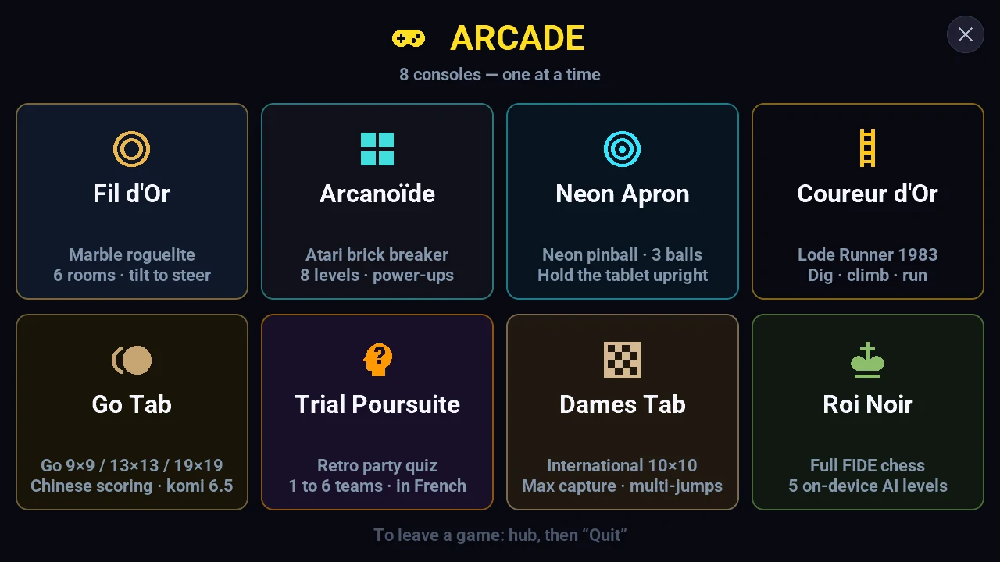

Each console is its **own fullscreen LVGL page** (`page_marble`, `page_chess`… declared `skip: true` in `tab5-lvgl.yaml` so swipe navigation can't reach them), not an overlay stacked on the dashboard. Documented ADR-0009 exception: no modal chrome. Shared architecture: YAML = empty containers, all content in C++, `lv_timer` created on open / destroyed on close, pre-allocated LVGL pool (zero allocation in the tick), NVS persistence, **zero HA or network dependency**.

| # | Console | Description | Controls |
|---|---------|-------------|----------|
| 1 | **Fil d'Or** | Marble roguelite, 6 rooms, Dark Souls-style progression | BMI270 tilt |
| 2 | **Arcanoïde** | Breakout, 8 levels, power-ups, combo | Tilt + touch |
| 3 | **Neon Apron** | Neon 3-ball pinball — **switches the screen to portrait 720×1280** | Touch zones + IMU nudge |
| 4 | **Coureur d'Or** | Lode Runner, 10 levels, dig & climb | Touch D-pad |
| 5 | **Go Tab** | Go 9×9/13×13/19×19, Chinese scoring (komi 6.5), 4 AI levels | Touch |
| 6 | **Trial Poursuite** | Trivia, 1–6 teams, 42-space wheel + 6 spokes | Touch |
| 7 | **Dames Tab** | International draughts 10×10 (8×8 checkers option), 4 AI levels | Touch |
| 8 | **Roi Noir** | FIDE chess, 5 AI levels, perft-validated | Touch |

| Roi Noir (chess) | Arcanoïde (breakout) |
|:-:|:-:|
| 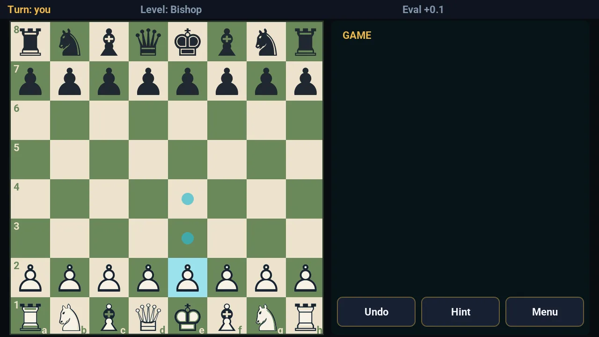 | 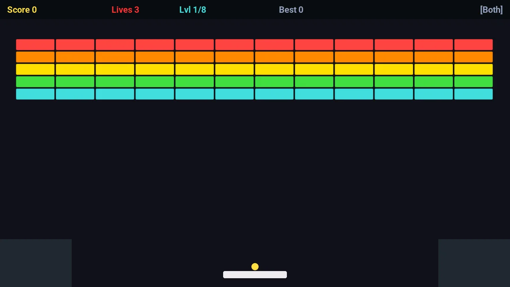 |

| Coureur d'Or (Lode Runner) |
|:-:|
| 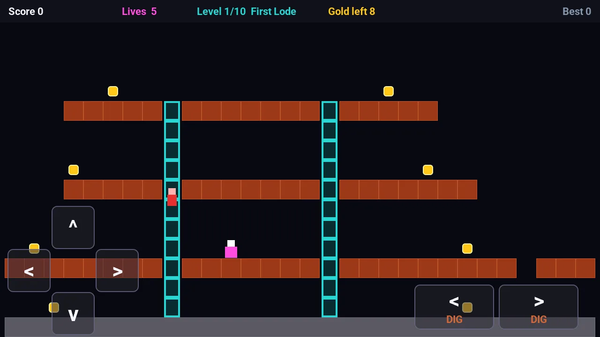 |

Exiting any game: hub → "Quitter" (clean return to `page_arcade` then the dashboard: timer stopped, score saved to NVS, and for Neon Apron the landscape rotation is restored).

→ Full technical details per game: [`docs/arcade.md`](arcade.md)

---

## Version Française

---

Cette page décrit ce que le Tab5 affiche et fait réellement — vérifié contre le firmware (`tab5-lvgl.yaml`, `ui_components/*.yaml`, `tab5_*.cpp`) le 06/07/2026, re-vérifié le 14/07/2026 (panneau info, bouton console, zones de swipe), complété le 27/07/2026 (popups assistant/calendrier/plantes, section Arcade, photos appareil réel ; depuis le 07/10/2026, ces photos sont remplacées par des rendus du firmware actuel, dessinés par le firmware lui-même sur un PC avec des données de démonstration dans le thème par défaut, sauf la photo de la page principale) et re-vérifié le 30/07/2026 (migration des jeux vers des pages LVGL dédiées, remplacement de « Flip Noir » par « Neon Apron »). L'ancienne version de cette page décrivait une navigation par barre d'onglets à 6 écrans qui n'existe plus (et n'a peut-être jamais été livrée telle quelle) — voir [ADR-0002](decisions/0002-single-page-swipe-navigation.md). Si quelque chose ci-dessous ne correspond plus au firmware réel, c'est le firmware qui a raison — corrigez cette page.

---

## Vue d'ensemble de la mise en page

Il y a une **page unique 1280×720** (`page_main`), pas un jeu d'écrans navigués par onglets. Trois zones :

1. **Zone d'accueil** — toujours visible : horloge, capteurs intérieurs, actions rapides, carte clim compacte, et la rangée sous l'horloge (plantes et capteurs).
2. **Carte centrale** — une petite zone qui alterne automatiquement entre planning, prévision de pluie, alertes météo et un panneau info (récap calendrier / texte d'alerte).
3. **Zone de cartes du bas** — soit les 5 cartes prévisions météo (avec, dans leurs épaules, les appareils de la pièce de chaque page), soit, en mode HA, les 5 cartes d'appareil de la pièce courante.

Des fenêtres s'ouvrent par-dessus cette page — lumières, volet, clim, télécommande TV, assistant vocal, calendrier, réveil, plantes, énergie et réglages — dont la page Système est l'ancienne console système — et les jeux de l'Arcade sur des pages à eux. Quel toucher ouvre chacune et ce que fait chaque bouton : la [notice d'utilisation](notice/README.md#version-française) ; cette page explique comment marche chaque partie. Les réglages s'ouvrent sur leur page Écran d'un tap sur le bouton engrenage (`btn_control_console`, en haut à droite) et sur leur page Système, l'ancienne console, d'un appui long ; la console ne s'ouvre plus par swipe depuis la refonte gestuelle du 14/07/2026.

---

## Captures générées

Ces images ne sont pas des photos : la CI les dessine sans tablette, avec le même code d'interface, à chaque pull request qui touche l'écran ([ADR-0021](decisions/0021-host-render-stubs.md), workflow `rendu-host.yml`). Les trois scènes sont celles du [mode démo](demo_mode.md#version-française), à date fixe (16 juin, 07:45, heure de Paris), en français puis en anglais. Ce sont aussi les références auxquelles la CI compare chaque nouveau rendu : elles suivent donc le firmware.

| Scène | Français | English |
|---|---|---|
| Journée ensoleillée |  |  |
| Pluie et alerte orange |  |  |
| Jour de repos, plantes à surveiller |  |  |

---

## Zone d'accueil

Contenu toujours visible en haut de l'écran :
- **Icônes d'état**, en haut à gauche, de gauche à droite : PC (vert allumé), téléphone (couleur de sa batterie), Wi-Fi, réveil, la **production solaire** quand la section Énergie du blueprint a un capteur de puissance solaire et la puissance crête des panneaux (sa couleur donne la production en part de la crête, avec le barème des batteries : vert au-dessus de 80 %, bleu, ambre, rouge sous 20 % ; un panneau gris à 0 %, la nuit), et la **batterie de la tablette** quand l'interrupteur de l'appareil **Tab5 Batterie montée** est allumé (éteint par défaut). Une **prise** quand aucune batterie n'est détectée (une tension sous 6 V dans les 10 dernières minutes : la tablette vit sur l'USB), de la couleur du texte du thème ; avec une batterie, le glyphe suit le niveau (pleine au-dessus de 80 %, moitié, basse, « ! » sous 20 %, un éclair pendant la charge, « ? » sans mesure), avec les couleurs du téléphone. Une icône masquée ne laisse pas de trou : les autres se resserrent.
- Heure et date actuelles, trois zones tactiles depuis le 09/10/2026 ([ADR-0039](decisions/0039-gestes-accueil.md), `ui_components/horloge_zone.yaml`) : heures (moitié gauche des chiffres, `btn_horloge_heures`), minutes (moitié droite, `btn_horloge_minutes`), date (dessous, `btn_horloge_date`), coupées dans le « : » et entre les chiffres et la date dans chaque thème (`tests/test_gestes.py`). « Auto » : appui long sur les heures ou les minutes = réveil, appui long sur la date = calendrier, tap sur les minutes = appareil suivant de la tuile − / + (`reglables_suivant()`), tap sur la date = ligne suivante de la rangée sous l'horloge (`rangee_toucher()`), tap sur les heures = rien ; chacun se choisit dans le blueprint comme les boutons du haut plus bas
- Température et humidité intérieure
- Icône microphone avec couleur d'état du pipeline (voir Assistant vocal ci-dessous), entre les deux boutons de mode vocal (agent Home Assistant vs pipeline conversation/LLM), et dessous le large bouton **Ok Nabu: ON / OFF** du mot de réveil (le bouton muet est dans le popup assistant depuis le 05/10/2026)
- Boutons **HA**, **Réglages** (engrenage) et **Arcade** (manette), en haut à droite, chacun avec un appui long depuis le 06/10/2026 : le popup Énergie quand la production solaire est reçue (`solaire_present()`), la page Système des réglages, la télécommande TV quand la zone TV est présente. Une mini icône de 26 px dans le coin en haut à droite des boutons HA et manette (`icon_mini_ha`, `icon_mini_tv` : les glyphes de la ligne d'état et de l'en-tête de la télécommande) dit quand cet appui long fait quelque chose ; les boutons ne glissent plus sans TV. Depuis le 07/10/2026, chaque appui long peut ouvrir un autre écran, et depuis le 09/10/2026 ([ADR-0039](decisions/0039-gestes-accueil.md)) chaque tap aussi, ou faire une action (mode appareils, appareil suivant de la tuile − / +, ligne suivante de la rangée sous l'horloge, mot de réveil activé / coupé), choisis dans le blueprint (« Horloge et boutons du haut · Clock and top buttons », clé `gestes` de `tab5_maj_emplacements`, l'ancienne clé `appuis` toujours lue) : `geste_cible()` le donne, le script `tab5_geste` le fait et `tab5_ecran_ouvrir` (la routine du select « Aller à l'écran ») ouvre un écran ; un tap changé change l'icône principale du bouton (`tap_glyphe()`), et la mini icône (`icon_mini_sys` sur l'engrenage aussi) montre le glyphe de l'en-tête de sa fenêtre, masquée quand l'écran manque à la maison. Les boutons de l'accueil n'affichent que leur icône, tous à la même taille (125 × 90, icônes de 70 px) ; les trois colonnes du haut sont à 20 px des bords de l'écran comme la carte centrale, hauts alignés à y 20 et bas à y 308, 25 px au-dessus de la carte centrale
- **Carte clim compacte** — température actuelle (capteurs salon + serre) et température cible avec boutons +/− ; taper sur la cible ouvre le popup clim (voir Climatisation ci-dessous). Taper sur la température du salon déroule la liste de la « tuile − / + » : les boutons peuvent régler un autre appareil (voir Climatisation ci-dessous)
- **Rangée sous l'horloge** — la ligne des plantes (4 emplacements pour jusqu'à 5 capteurs BLE d'humidité du sol, voir Humidité des plantes ci-dessous) et jusqu'à trois lignes de capteurs choisies dans le blueprint, qui tournent avec la carte centrale (voir Rangée sous l'horloge ci-dessous)

---

## Carte centrale — planning / pluie / alertes / info

Une seule carte alterne automatiquement toutes les 8 secondes (script `tab5_central_rotator_auto`, `tab5-scripts.yaml` ; pas écran éteint ni sous un popup ouvert) entre jusqu'à huit panneaux : planning, pluie, alertes météo, info et jusqu'à quatre bandeaux d'alertes HA. La rotation ne tourne que sur la fenêtre prévisions par défaut — swiper vers une autre fenêtre remplace la carte centrale par un overlay de titre de page (`page_title_wrapper`) et met la rotation en pause. Cet overlay tient sur une ligne, construite par `forecast_page_title_parts()` (`tab5_central.cpp`), dans la police de la date du thème : la plage réellement couverte par les 5 tuiles visibles — `Du mercredi 5 août au dimanche 9 août` en journalier (jours et quantièmes via SNTP, `1er` pour le premier du mois), `De 14:00 à 18:00` en horaire, toujours de la plus ancienne à la plus récente même si les tuiles horaires sont rangées de droite à gauche. Les points de pagination sous la carte disent quelle fenêtre est ouverte (le chapeau « Prévisions journalières · 2/3 » est retiré depuis le 05/10/2026). Si les dates ne sont pas encore disponibles (SNTP non synchronisé et aucun payload HA reçu), la carte reste vide. Taper sur la température d'une carte prévision (voir plus bas) peut aussi interrompre la rotation quelques secondes pour montrer le planning d'un jour précis.

- **Planning** — dans la rotation, sauf si Home Assistant n'a pas d'agenda de travail (zone optionnelle, lot 5). Affiche le planning du jour.
- **Prévision de pluie** — intégrée à la rotation seulement si `has_rain` est vrai. Un graphique de pluie à court terme : un point toutes les 5 minutes pour la première demi-heure, puis toutes les 10 minutes pour la demi-heure suivante (9 points au total, fenêtre d'1 heure), fourni par Météo-France via le service API `tab5_maj_pluie_1h_bulk` (les 9 barres en un appel).
- **Alertes météo** — intégrée à la rotation seulement si `g_central_ctx.has_mf_alerts` est vrai. Affiche une icône par type de vigilance Météo-France actif (vent, inondation, orages, etc.), chaque icône colorée selon sa propre sévérité : jaune (vigilance jaune), orange, ou rouge (vigilance rouge) — les codes couleur officiels Météo-France, à ne pas modifier.

**C'est la date, pas "un jour", qui prend la couleur du niveau d'alerte global en cours :** indépendamment de la rotation ci-dessus, le texte de la date sous l'horloge en zone d'accueil (`lbl_date`, ex. "Lun 06 Juil") est recoloré à chaque réception d'un payload d'alerte, selon le niveau de vigilance *global* du jour (vert/défaut si aucune, jaune pâle/orange/rouge pâle pour jaune/orange/rouge) — voir `tab5-api-logic.yaml` dans le service `tab5_maj_alerte_meteo_france`. C'est distinct de la coloration par icône du panneau d'alerte ci-dessus, qui utilise le niveau propre à chaque type d'alerte plutôt que le niveau global.

- **Panneau info** — intégré à la rotation seulement si `has_info` est vrai. Affiche soit un récap calendrier 3 jours (multi-lignes, avec balisage couleur inline), soit une bannière d'alerte Météo-France (une ligne, colorée selon la sévérité), poussé par HA via le service `tab5_maj_info_texte` (`update_info_text_ui()`, `tab5_*.cpp`). **Un tap le masque** (`tab5_dismiss_info_tap` → `dismiss_central_info_immediate`) : le panneau quitte le rotateur tout de suite ; l’id est stocké dans `tab5_dismissed_local` pour qu’un re-push du même id reste caché tant que HA n’envoie pas une nouvelle alerte.
- **Slots infos / alertes HA (jusqu’à 4)** — poussés par `tab5_maj_alertes_ha_bulk` dans `ha_alert_wrapper_0…3`. Chaque slot est son propre panneau du rotateur ; **un tap masque ce slot** (`tab5_dismiss_ha_alert`, slot 0-3 → `dismiss_ha_alert_slot_immediate`), même logique de dismiss local.

Si ni pluie, ni alertes MF, ni info, ni slots HA ne sont actifs, la rotation garde simplement le planning à l'écran (et laisse la carte vide sans planning).

**Bascule temporaire :** taper sur la température max/min d'une carte de prévision journalière (pas les horaires) interrompt la rotation pendant **6 secondes** pour afficher le texte des horaires de ce jour précis dans la carte centrale, puis restaure automatiquement le panneau qui était actif (`show_temporary_planning()`, `tab5_*.cpp` — anciennement un script ESPHome de `tab5-scripts.yaml`, passé en C++ lors du fix reboot du 12/07).

---

## Zone de cartes du bas — les pièces

Depuis la 3.2 ([ADR-0023](decisions/0023-rooms-generic-tiles.md)), chacune des 5 pages du bas est aussi une **pièce** de 5 appareils au plus, décrite par Home Assistant (blueprint « Tab5 — emplacements », action `tab5_maj_tuiles` ; états par `tab5_maj_emplacements`, clés `tRT`). La pièce 0 est l'accueil (jours 0-4), les pièces 1 et 2 les pages journalières suivantes (swipe vers la gauche), les pièces 3 et 4 les pages horaires (swipe vers la droite) ; la tuile T est la position visuelle, 0 = gauche. Les définitions sont gardées en NVS : les pièces se dessinent avant que HA réponde ; pas les états (« -- » grisé jusqu'à la première poussée). Modèle et dessin : `tab5_tuiles.cpp`.

Le bouton `btn_control_ha` (en haut à droite, icône Home Assistant) bascule la zone entre le **mode météo** et le **mode HA** (`tuiles_mode_ha()`, drapeau `g_central_ctx.ha_mode`). Il prend une bordure et une icône d'accent quand le mode HA est actif, et disparaît quand aucune pièce n'a d'appareil. Son appui long ouvre le popup Énergie quand la production solaire est reçue. « Aller à l'écran → Accueil » (le select de Home Assistant) quitte le mode HA.

### Mode météo (par défaut)

5 cartes, navigables par **swipe gauche/droite** (à partir de y 333 : la carte centrale et la rangée du bas), sur 5 fenêtres : 2 horaires + 3 journalières. L'ordre est voulu (`forecast_page_suivante()`, `tab5_central.cpp`) : un swipe vers la gauche avance dans les trois fenêtres journalières et boucle sur elles (de la dernière à la fenêtre d'accueil) ; un swipe vers la droite recule, à travers les deux fenêtres horaires, et de la dernière fenêtre horaire revient à la fenêtre d'accueil. Voir la [note faux positifs](troubleshooting.md#false-positives-worth-knowing-about-dont-fix-these-again) dans `docs/troubleshooting.md` ; ce que l'utilisateur voit : [notice, rangée du bas](notice/tiles.md#version-française).

**Fenêtres horaires (2) :** les 15 prochaines tranches horaires, 5 par fenêtre. Chaque carte affiche une heure, une icône météo double couche (`IconeMeteo.ttf`), une température avec code couleur, et la pluie en mm (ou `-` si sec). Il n'y a pas de donnée de vitesse de vent séparée — "venteux" est l'une des icônes de *condition* météo possibles (à côté de soleil/nuage/pluie/neige/brouillard), pas un champ de donnée distinct.

**Fenêtres journalières (3) :** prévisions sur 15 jours, 5 jours par fenêtre. Chaque carte affiche :
- Nom du jour, avec code couleur (voir Coloration ci-dessous)
- Icône météo (même système double couche)
- Températures max et min, chacune avec code couleur — **taper dessus affiche le planning de ce jour dans la carte centrale pendant 6 secondes** (voir ci-dessus)

**Épaules et action rapide.** Sur chaque page, une tuile qui porte un appareil de la pièce de la page le montre dans ses deux « épaules », de part et d'autre de l'onglet titre — à gauche l'icône de l'appareil ([palette](tiles_icons.md)) colorée par son état ; à droite une ampoule (lumière) ou la flèche du prochain mouvement d'un volet (pause pendant la course), rien pour les autres types — et un bouton invisible sur l'icône météo (`btn_jN_action` sur les pages journalières, `btn_hN_action` sur les horaires) envoie la commande de la tuile ; la météo reste affichée. Une page sans appareil est comme avant la 3.2. Avec l'interrupteur de l'appareil **Tab5 Appareils sur la météo** éteint (allumé par défaut ; discussion #278), chaque page ressemble à une page sans appareil : les cartes de prévisions montrent la météo seule, et les appareils restent dans le mode HA.

Appui court et appui long pour chaque sorte d'appareil, et les comportements « allumer seulement », « confirmer » et « lecture seule » du blueprint : [notice, rangée du bas](notice/tiles.md#tap-et-appui-long-par-appareil). Dans le firmware, `tuile_appui()` (`tab5_tuiles.cpp`) applique le tableau de l'[ADR-0023](decisions/0023-rooms-generic-tiles.md) au type de la tuile (`lum`, `int`, `vol`, `med`, `act`, `cap`, `bin`, `cli`) et à ses options (`o` allumer seulement, `k` second appui dans les 3 s, `r` lecture seule, `t` télécommande TV, `m` la clim du blueprint, `e` popup Énergie).

**Roue d'actions rapides — appui long** (07/10/2026, demandée dans la [discussion #278](https://github.com/Axellum/M5-Tab5-ESPHome-LVGL/discussions/278) ; deux anneaux le même jour, à la demande de l'auteur ; [ADR-0036](decisions/0036-quick-action-wheel.md), `tab5_roue.cpp`, `ui_components/roue_actions.yaml`). Un appui long sur une lumière, un volet ou une clim dont HA a envoyé les réglages — sa tuile météo, la pastille de sa carte du mode HA ou sa ligne du popup Maison — ouvre tout de suite une roue, devant le voile des popups à 60 %. Sur la tuile, un **moyeu** : l'icône de la carte dans la couleur d'état, sa ligne d'état, une fine jauge en arc (luminosité, position, consigne dans les bornes de l'appareil) et le nom de l'appareil. Au-dessus, un **premier anneau** de boutons ronds en verre (72 px, à 180 px de la tuile) : **Maison** à gauche (le popup Maison ; absent quand la roue s'ouvre depuis lui), les commandes, les **familles** marquées d'un point, puis **Détails** à droite (le popup de la tuile : lumières, volet, clim). Toucher une famille déplie ses choix sur un **second anneau** (290 px), centré sur elle : **lumière** Éteindre ou Allumer · Luminosité ▸ 10 · 25 · 50 · 75 · 100 % · avec `c` Blancs ▸ chaud · crème · froid et Couleurs ▸ rouge · orange · or · vert · bleu · violet (pastilles) ; une lumière sans variateur Allumer · Éteindre ; **volet** Ouvrir · Stop · Fermer · Position ▸ 25 · 50 · 75 % (s'il donne sa position) ; **clim** Arrêt · Mode ▸ (ses modes) · Consigne ▸ (la sienne et deux pas de chaque côté) · Options ▸ (Éco, Boost, Silence, Oscillation, Brise, celles qu'elle a). Chaque anneau repose sur une bande de verre (un arc à bouts ronds), la seconde teintée de la couleur d'état. L'état courant est un verre teinté de la couleur d'état, liseré plein et halo. Une commande ou un choix envoie ce que la tuile ou son popup envoie déjà (`esphome.tab5_action`, rien de nouveau pour HA) et ferme la roue ; toucher ailleurs ou le moyeu replie le second anneau, puis ferme la roue ; de même le délai d'inactivité des popups, l'ouverture d'un popup, l'extinction de l'écran et de nouvelles définitions des tuiles ; un changement de thème ou un état poussé la repeint ouverte. Près d'un bord, un anneau pivote par pas de 5°. Pas de roue (le popup s'ouvre directement) : option `k`, clim dont HA n'a pas encore envoyé les réglages.

**Mode héritage (blueprint 3.x).** Tant qu'aucune définition n'est arrivée (firmware mis à jour avant son blueprint), la pièce 0 est construite depuis les emplacements 3.x et ressemble à la 3.1 : carte 1 PC/TV (épaule = état de la TV, ou du PC sans TV ; appui long = télécommande), carte 2 le volet, cartes 3 à 5 les lumières chambre, salon et LEDs (appui long = popup lumière), avec les commandes 3.x. Sur la carte du volet, taper le **titre** inverse le sens que le prochain appui enverra (la flèche en haut à droite le montre) ; taper l'icône envoie « arrêter » si le volet bouge, sinon ouvrir ou fermer.

### Mode HA

Les 5 cartes (`switches_card.yaml`) montrent la pièce de la page courante, chacune dessinée comme la carte « tile » d'un tableau de bord Home Assistant dans sa forme verticale (depuis le 06/10/2026, discussion #278) : l'icône de la palette (70 px) dans une pastille ronde de la couleur de son état (la couleur à 20 %, l'icône pleine ; tap et appui long sur la pastille), le nom dessous (coupé avec « … » ; un tap dessus inverse le sens d'un volet), et sous le nom une ligne d'état traduite par la tablette — « 60 % », « Allumé » / « Éteint », « Mouvement » / « 45 % » / « Ouvert » / « Fermé », « Lecture » / « Pause », « Lancer », la valeur et l'unité d'un capteur, « Détecté » / « Présent » / « Verrouillé »… selon la classe d'appareil, la température de la pièce d'une clim ; « Hors ligne », grisé, quand l'entité est indisponible — et une couleur selon le type et l'état (la couleur propre d'une lumière quand elle en donne une). Les tuiles vides sont masquées et les autres centrées. La carte centrale affiche « Pièce n/N » au-dessus du nom de la pièce ; le rotateur est en pause. Appui court et long : [notice](notice/tiles.md#tap-et-appui-long-par-appareil).

**Swipe en mode HA** : pièce suivante / précédente qui a un appareil, dans l'ordre des pages météo (même bouclage) ; les calques météo restent masqués et les pastilles suivent. Avec une seule pièce, un swipe ne fait rien. Entrer en mode HA sur une page sans appareil saute à la pièce la plus proche qui en a ; en sortir montre la météo de la page courante.

**Tap sur le nom de la pièce** (le titre de la carte centrale, en mode HA seulement) : le [popup Maison](#popup-maison--toutes-les-pièces-dun-coup).

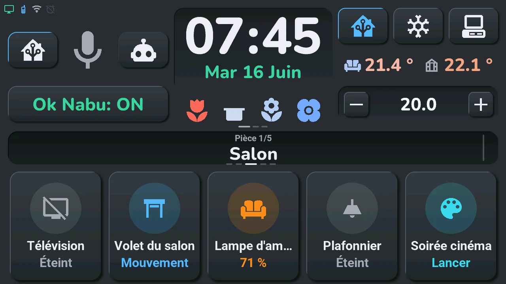

---

## Climatisation

Deux niveaux de contrôle. La carte compacte pilote l'entité `climate` du blueprint (entrée « Climatisation ») ; le popup pilote la même, ou la clim de la tuile qui l'a ouvert :

- **Carte compacte** (toujours visible en zone d'accueil) — température actuelle et cible avec boutons +/−. Toujours la clim du blueprint.
- **Tuile − / + au choix** ([ADR-0033](decisions/0033-adjustable-tile.md), `tab5_reglables.cpp`, `ui_components/reglables_liste.yaml`) — taper la température du salon (`btn_reglables_liste`) déroule une liste : la clim du blueprint, jusqu'à huit appareils de la section « Tuile − / + » du blueprint (clés `rN` : volume, luminosité, consigne, humidité, vitesse, position, nombre), puis le volume de la tablette. L'appareil choisi reste (NVS) ; un tap sur les minutes de l'horloge (« auto ») passe au suivant sans dérouler la liste (`reglables_suivant()`). Clim choisie : rien de ce qui précède ne change, sauf l'icône de la clim (`clim_consigne_icone`, `mdi_font_45`) à 8 px à gauche de sa consigne depuis le 09/10/2026 ; la consigne reste au centre exact. Autre appareil : son icône et sa valeur remplacent la consigne, − / + déplacent la valeur de son pas tout de suite et un seul `esphome.tab5_action` (`rN` / `regler`, ou `consigne` pour une clim) part 250 ms après le dernier tap ; taper la valeur ouvre le popup de la tuile qui porte la même entité, ou la télécommande TV.
- **Popup clim** (quasi plein écran, carte 1250×690 à 15 px des bords, ouvert en tapant la carte compacte, une tuile de clim, ou « Aller à l'écran → Climatisation ») — trois cartes de verre :
  - **MODE** : Froid / Chaud / Sec / Ventilation / Éteint, empilés pleine largeur (icônes colorées selon le mode actif, pilotées par `tab5_maj_clim`)
  - **TEMPÉRATURE** : arc thermostat 320 px avec la cible affichée en grand au centre, boutons − / +, et la température réelle de la pièce en bas. Bornes, pas et unité sont ceux de l'appareil (16–30 °C et 0,5 tant que Home Assistant ne les a pas envoyés, voir plus bas). La cible s'affiche **immédiatement** (optimiste) et un seul `climate.set_temperature` part une fois le geste terminé (débounce 250 ms — les taps rapides ± sont groupés)
  - **OPTIONS** : presets Éco / Boost (toggle), Silence (fan quiet), et flux d'air **Oscillation** / **Brise** (`windnice`, mode Daikin Onecta auparavant inaccessible depuis l'écran)
  - **Toutes marques** ([ADR-0026](decisions/0026-climate-from-device.md)) : le blueprint envoie les réglages de l'appareil (clé `climr` : `min_temp`/`max_temp`, `target_temp_step`, °C ou °F, les modes qu'il a, son nom). Le titre devient le nom de l'appareil, l'arc et les boutons ± suivent ses bornes et son pas, et un bouton que l'appareil ne sait pas faire disparaît — une section OPTIONS restée sans bouton disparaît avec son titre, les autres remontent. Les boutons envoient toujours les noms de la Daikin (Éco = `away`, Silence = `quiet`, `swing` / `stop`), et le blueprint les traduit vers ceux de l'appareil (`eco`, `low`, `off`, `vertical`…), ou n'envoie rien quand l'appareil n'a pas d'équivalent.
  - **Toute tuile de clim** ([ADR-0027](decisions/0027-climate-per-tile.md)) : une tuile `cli` d'une pièce ouvre le popup sur son propre appareil — ses réglages (clé `crRT`, les champs de `climr`) et son état (clé `ceRT`) arrivent avec les tuiles, et ses boutons envoient les mêmes commandes avec `emplacement: tRT`, que le blueprint traduit de la même façon. Sa consigne et son mode arrivent tout de suite dans le popup, sa ventilation, son oscillation, son préréglage et la température de la pièce en 5 minutes au plus (avec les mesures). Une tuile avec l'option `m` est la clim du blueprint. Tant que Home Assistant n'a pas envoyé les réglages de la tuile (blueprint plus ancien), la toucher ne fait rien. Pendant ce temps la carte compacte montre toujours la clim du blueprint, et fermer le popup y revient.
  - Taper l'overlay sombre ou le bouton × (le bouton de verre partagé 80×44 de `modal_header.yaml`) ferme le modal. 6 des 10 boutons sont des templates factorisés (froid/chaud/ventil/sec, éco/boost) ; les 4 restants (éteint/oscill/brise/silence) et les boutons ± sont volontairement laissés en YAML individuel — voir [ADR-0007](decisions/0007-climate-popup-not-factorized.md).

Les contrôles sont estompés (non cachés) quand le clim est éteint, pour garder la mise en page stable.

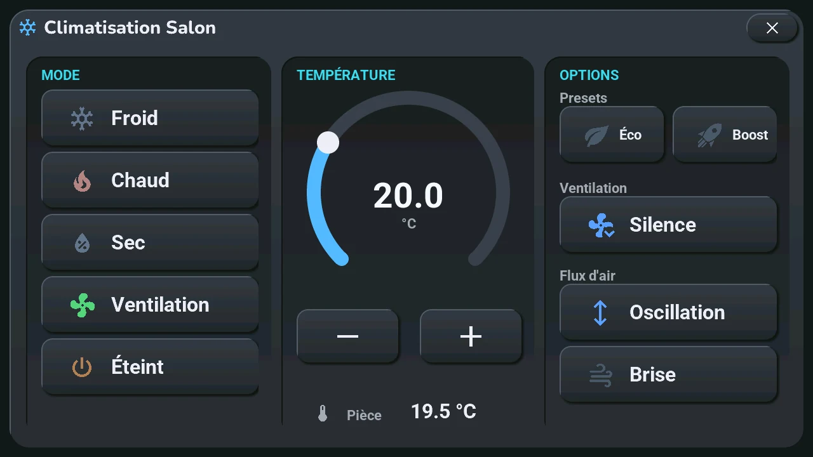

---

## Rangée sous l'horloge

Sous l'horloge, une rangée de 401 × 70 px ([ADR-0031](decisions/0031-row-under-the-clock.md), `tab5_rangee.cpp`, `ui_components/rangee.yaml`) montre une ligne à la fois : la ligne des plantes (plus bas) et jusqu'à trois lignes de quatre appareils choisies dans la section « Sous l'horloge · Under the clock » du blueprint « Tab5 — emplacements », trois lignes au plus en tout. Le blueprint règle aussi la place de la ligne des plantes (en premier d'origine, deuxième, troisième ou masquée) et la durée d'une ligne (8 à 120 s par pas de 8 s, 32 s d'origine).

- **Calage.** La carte centrale garde ses 8 s. `tab5_central_rotator_auto` attend 7,8 s, fait tourner la rangée (`rangee_tour()`), attend 0,2 s et fait avancer la carte : quand la rangée change, c'est juste avant la carte, avec le même court glissement en fondu (`transition_widgets()`). Elle ne tourne pas écran éteint ni fenêtre ouverte.
- **Mise en page.** Icônes seules (aucun capteur sur la ligne) : icônes de 70 px, comme les pots. Avec des valeurs : la plus grande taille qui tient — la police de la date du thème avec des icônes de 45 px, puis 32 px en gras, puis 22 px, puis l'icône au-dessus de sa valeur ; au-delà, la valeur est coupée par « … ».
- **Couleurs.** Une icône est colorée comme une tuile (allumé, éteint, hors ligne). Une valeur suit sa mesure : l'échelle des températures (écrite « 21.4 ° » ; °F ramené en °C pour la couleur), l'humidité celle des plantes, les batteries celle des batteries, l'or pour la puissance et l'énergie (W / kW, kWh / MWh).
- **Toucher.** Un appui montre la ligne suivante tout de suite et repart de zéro pour sa durée ; un appui long sur la ligne des plantes ouvre le détail des plantes. La rangée ne commande rien : un interrupteur ou une lampe montre seulement son état.
- De petits tirets sous la rangée (deux ou trois) montrent la ligne affichée ; une ligne seule n'en a pas.

## Carte humidité des plantes

Surveille jusqu'à 5 capteurs BLE d'humidité du sol, mais seuls **4 emplacements sont affichés** (`sort_and_update_moisture_slots()`, `tab5_*.cpp`). Les capteurs sont triés par niveau d'humidité (du plus sec au plus humide) à chaque mise à jour, puis mappés sur les emplacements ainsi : le plus sec, le 2e plus sec, **le capteur de rang médian** (ça affiche la lecture brute de ce capteur précis, ce n'est pas une moyenne arithmétique calculée sur les 5), et le plus humide. Comme le mapping se fait par rang plutôt que par identité fixe du capteur, *quel* pot apparaît dans quel emplacement change dans le temps selon l'évolution de l'humidité.

Chaque emplacement n'affiche que l'icône du capteur, dans sa couleur de niveau d'humidité (voir Coloration ci-dessous), à la taille des boutons de l'accueil ; le nom et la valeur de chaque pot sont dans le popup détails plantes (appui long). Le libellé « Pot N » / « Moy: » sous chaque icône est retiré depuis le 05/10/2026.

### Popup détails plantes — appui long

Un **appui long sur la ligne des plantes** de la rangée sous l'horloge ouvre un modal quasi plein écran (carte 1250×690 à 15 px des bords) avec **5 cartes de verre fixes — une par capteur** (carte N = capteur `moisture_N`, même icône que le dashboard, pas de tri dynamique ici). Chaque carte affiche :

- le nom du pot et son icône de plante, colorée par le niveau d'humidité (même échelle que le dashboard)
- le % d'humidité du sol (en grand) et un statut d'arrosage : **OK** (vert), **Bientôt sec** (≤ 20 %, ambre), **À arroser !** (≤ 14 %, rouge — aligné sur la zone rouge de `get_humidity_color()`) ou **Hors ligne** (capteur indisponible)
- quatre lignes de métriques : **Fertilité** (conductivité EC, µS/cm), **Lumière** (lx), **Température** (°C, gradient `get_temperature_color()`) et **Batterie** du capteur (%, échelle `get_battery_color()`)

Les valeurs sont poussées en continu par les capteurs HA `pot*_ec/lux/temp/bat` (`update_pot_metric_ui()`, `tab5_*.cpp`) — le popup n'a besoin d'aucune synchro à l'ouverture. Taper l'overlay sombre ou le bouton × (le bouton de verre partagé 80×44 de `modal_header.yaml`) le ferme. Composants : `pots_popup.yaml` + `pot_detail_card.yaml` (5 instances).

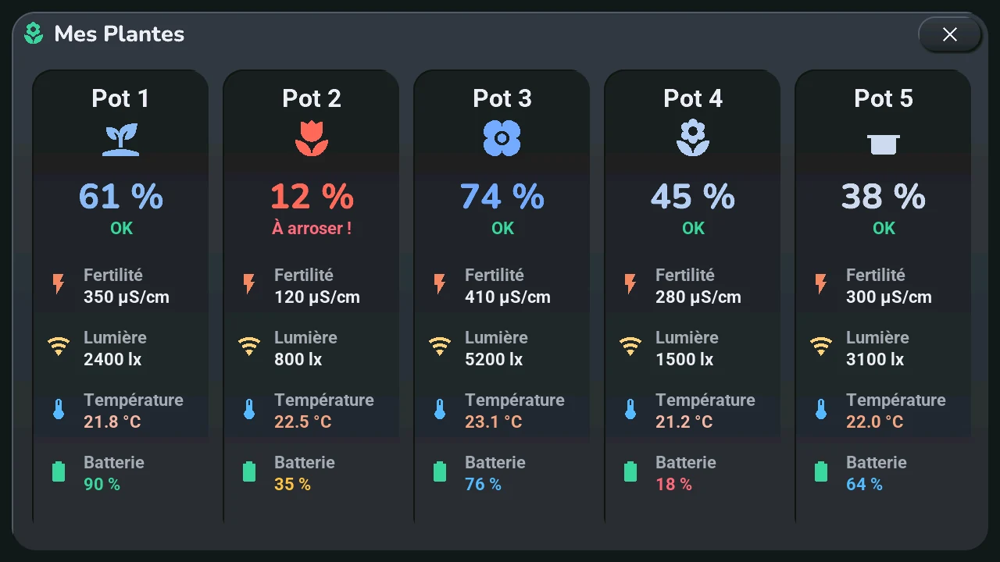

---

## Popup calendrier — appui long sur la date

Un **appui long sur la date**, sous l'horloge (`btn_horloge_date`, « auto » ; les gestes de l'horloge se choisissent dans le blueprint depuis le 09/10/2026, voir la zone d'accueil plus haut), ouvre un calendrier mensuel quasi plein écran (carte 1250×690 à 15 px des bords) : grille 7×6 lundi-en-tête, navigation ◀ / ▶ entre les mois et bouton « Aujourd'hui ». La grille elle-même — numéros, alignement lundi-dimanche, weekend estompé, aujourd'hui (bordure cyane) et jours passés grisés — est calculée **en local** depuis l'horloge SNTP (`cal_render_month()`, algorithme de Sakamoto) : le calendrier reste utilisable même HA hors ligne.

Home Assistant enrichit ensuite chaque mois consulté **à la demande** (`script.tab5_calendrier_mois` → `tab5_maj_calendrier_mois`, cache par mois vidé à l'ouverture) :

- **heures de travail imprimées dans les cases** (« 09:30-20:15 », en rose si l'embauche est avant 9 h — même convention que le bandeau planning central), depuis l'agenda de travail (les événements dont le titre contient le mot de « Tab5 · mot des événements de travail », ou tous)
- **jours fériés** — numéro en rose (liste blanche des vrais fériés français ; les fêtes civiles type Fête des Mères n'apparaissent que dans le détail du jour)
- **vacances scolaires** — fond de case violet doux, depuis l'agenda choisi dans « Tab5 · agenda des vacances scolaires » (en France, le fichier ICS du ministère pour votre zone ; jusqu'au 29/09/2026, une table fixe de la zone A)
- **RDV** (pastille dorée) et **anniversaires** (pastille rose) depuis les calendriers famille/anniversaires

**Taper un jour** ouvre un sous-popup détail 780×540 (`script.tab5_calendrier_jour`) : titre « Mardi 21 Juillet » et jusqu'à 6 lignes typées avec icônes MDI colorées — nom du férié, libellé des vacances scolaires, horaires de travail, RDV horodatés, anniversaires, fêtes civiles — avec les états « Chargement... », « Rien de prévu ce jour » et « Home Assistant hors ligne ». La fermeture suit la recette popups v2 (croix = boutons de verre partagés 80×44, `scrollable: false` partout). Composants : `calendar_popup.yaml` + `cal_grid_build()` (42 cellules construites en C++) + package HA `HomeAssistant_Config/packages/tab5_calendar.yaml`.

---

## Réveil — appui long sur l'heure

Un **appui long sur l'heure**, heures ou minutes (`btn_horloge_heures`, `btn_horloge_minutes`, « auto »), ouvre les réglages du réveil (carte modale 1250×690) ; l'appui long sur la date ouvre le calendrier. Jusqu'au 09/10/2026, un tap court sur l'horloge l'ouvrait. Une petite cloche dans la barre d'état du haut donne l'état d'un coup d'œil : **verte** = armé avec une sonnerie calculée, **ambre** = armé mais aucun jour retenu (le piège classique du mode « jours travaillés » pendant une semaine de congés), **barrée et éteinte** = réveil coupé.

**Le réveil sonne sans Home Assistant.** L'heure vient de SNTP, les horaires de travail des 15 prochains jours sont déjà en cache dans l'appareil (`cal_jours_data[]`, poussés toutes les 10 min), et la sonnerie est une mélodie RTTTL synthétisée sur place — un sinus pur, pas un fichier. HA n'ajoute que du confort : le briefing parlé, les rappels de rendez-vous, et une URL de sonnerie personnalisée en option (avec **repli automatique et silencieux** sur la mélodie locale si HA ne répond pas).

**Trois modes**, parce que « se baser sur le calendrier » veut dire deux choses différentes selon les jours :

| Mode | Quand ça sonne |
|---|---|
| **Fixe** | À l'heure réglée, les jours de la semaine cochés |
| **Travail** | La même heure, mais seulement quand le calendrier annonce du travail |
| **Ouverture** | L'heure est **dérivée de l'embauche** : début du service − un délai réglable, borné par « jamais avant » / « jamais après » |

**L'heure de fermeture sert aussi**, via le réglage **« repos mini »** : après une fermeture à 21:00, un repos de 9 h interdit de sonner avant 06:00 — borné par « jamais après », le repos ne peut donc jamais faire arriver en retard. Le **sélecteur de jours ne gouverne QUE l'heure fixe** : une journée pilotée par le calendrier sonne quel que soit le jour de la semaine, sinon décocher le samedi ferait rater une embauche du samedi matin.

**Arrêt à la voix ou au toucher.** Toucher n'importe où sur l'écran de sonnerie arrête le réveil ; « Répéter » reste un bouton distinct. Côté voix, le modèle microWakeWord **« Stop » était déjà embarqué** (il ne servait qu'à arrêter le volet) : il est armé pendant la sonnerie, et n'importe quel mot de réveil coupe l'alarme. Le moteur de mots de réveil est démarré même si « Ok Nabu » est désactivé — sinon la promesse ne tiendrait pas pour qui coupe le micro la nuit. Chaque passage de mélodie est suivi de **2,5 s de silence** : c'est la fenêtre où le micro a une chance d'entendre quelque chose.

Autres réglages : 4 mélodies (‹ › en choisit une et la joue), un **volume dédié au réveil** (indépendant du volume système), volume progressif, durée de répétition, durée maximale de sonnerie, et un briefing parlé au réveil (heure, horaires du jour, prochain rendez-vous, température).

**Annonce des rendez-vous**, N minutes avant (0–120, réglable). HA pousse la liste des rendez-vous horodatés toutes les 5 minutes ; **c'est le firmware qui tient le compte à rebours**, donc une coupure HA entre la poussée et l'échéance ne fait rien rater. Composants : `alarm_popup.yaml` + `alarm_ring_overlay.yaml` + `Tab5/paquets/tab5-alarm.yaml` + `Tab5/socle/alarm_clock.h/.cpp` + package HA `HomeAssistant_Config/packages/tab5_reveil.yaml`.

---

## Assistant vocal

L'icône microphone sur l'écran d'accueil est l'interface visuelle de l'assistant vocal ; sa couleur suit l'état du pipeline (`assist_set_pipeline_state()`) : veille (mot de réveil coupé), repos, écoute, traitement (STT + intention), synthèse (TTS), erreur. Les couleurs, le bouton du mot de réveil, les deux boutons de mode (agent de conversation de Home Assistant, ou pipeline de discussion basé sur un LLM) et le tap et l'appui long du micro : [notice, voix](notice/voice.md#version-française).

Quand la liste « Tab5 · pipeline de discussion » vaut « Aucun » (pas de pipeline de discussion), les deux boutons de mode (accueil et popup assistant) disparaissent et la tablette reste en mode Home Assistant (zone `discussion`, [installation](installation/adapt-to-your-home.md#autres-zones)).

Le mode est sauvegardé entre les redémarrages via l'entité HA `select` (`select.m5stack_tab5_home_assistant_hmi_assistant`).

**Second wake word local — « Stop » :** un second modèle microWakeWord (`Stop`) n'est armé que pendant que le volet est en mouvement (globale `volet_en_mouvement`) et désarmé dès l'arrêt. Dire « Stop » arrête alors le volet directement depuis l'appareil (`script.tab5_volet_action`) — sans « Okay Nabu », sans aller-retour pipeline.

**Interrompre une réponse :** taper l'icône micro pendant que l'assistant parle (bleu) coupe la réponse en cours (arrêt du pipeline, que Home Assistant suit, + le haut-parleur) et relance immédiatement l'écoute (`tab5_vocal_interrupt_and_listen`) — le moyen fiable d'écourter une longue réponse Discussion, le wake word étant inactif pendant la phase de réponse du pipeline.

**Popup assistant** (appui long sur le micro, `btn_assist_trigger` ; ses boutons : [notice](notice/voice.md#version-française)). En mode Discussion, une demande vocale l'ouvre seule (`on_stt_end` → `tab5_assist_on_request`) ; en mode Domotique, le bandeau de 8 s de la carte centrale reste le retour rapide. La réponse est rendue depuis du Markdown (tableaux ré-alignés approximativement — police proportionnelle depuis le 26/09/2026 —, gras, code, puces), plus une image téléchargée à la demande (`online_image`, PNG → RGB565, 760×360). Le moteur peut pousser une réponse riche par le service `tab5_assist_reponse` (variables `texte` = Markdown, `image_url` = PNG optionnel).

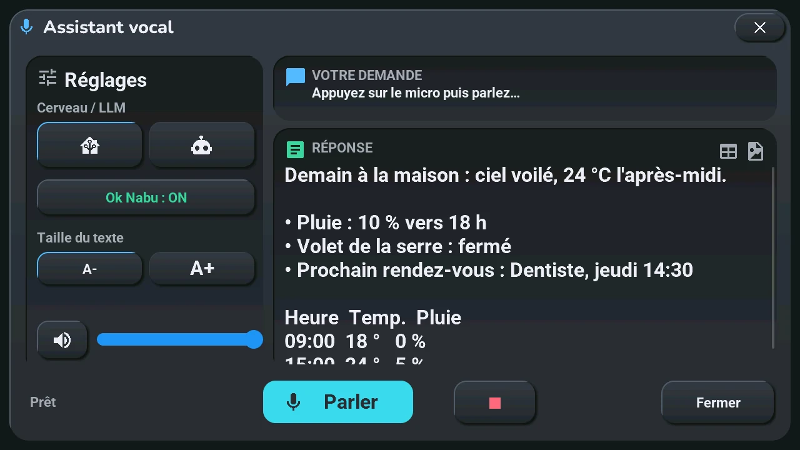

---

## Page Système des réglages (ancienne console)

La quatrième page du [popup Réglages](#popup-réglages) depuis le 08/10/2026 (`console_sys.yaml`, un popup à part avant). Elle s'ouvre directement par un appui long sur le bouton engrenage (`btn_control_console`, en haut à droite de la zone d'accueil ; un tap ouvre la page Écran) ou par « Aller à l'écran → Console système » — l'option garde son nom pour Home Assistant et le blueprint. Ses rafraîchissements ne tournent que pendant que la page est montrée (`reglages_page_visible(REGLAGES_PAGE_SYSTEME)`). **Quatre cartes de verre** :
- **MÉMOIRE** — barres SRAM/PSRAM, bloc max, taille flash
- **RÉSEAU** — SSID Wi-Fi, IP, signal, et état de la connexion HA (`lbl_sys_ha_val`, vert/rouge)
- **SYSTÈME** — uptime, température CPU, charge CPU de chaque cœur (cœur 0 · cœur 1, mesurée toutes les 2 s pendant que la page est montrée), temps de boucle, batterie de la tablette (niveau et tension avec l'icône du bandeau, niveau et puissance consommée sur batterie depuis la prochaine version, « Sur USB » sans batterie détectée, « Non montée » interrupteur « Tab5 Batterie montée » éteint ; 06/10/2026, discussion #278), plus le slider volume avec % affiché en direct
- **GESTION** — boutons de gestion HA : « MAJ Écran » (réarme le flag de push et redéclenche l'automation de push écran — le remède direct à l'incident récurrent d'écran figé), « Recharger autos » (`automation.reload`), « Redémarrer HA » et « Reboot tablette » — les deux derniers derrière des overlays Annuler/Confirmer (fini l'armement invisible par double-tap)  — en grille 2 × 2 depuis que la rangée du thème est passée dans le popup Réglages (06/10/2026)

Ce n'est **pas** un visualiseur de logs (utiliser `tools/tab5_logs.py` pour les payloads et événements). Voir [`docs/debugging.md`](debugging.md) pour plus de détails sur son usage en debug.

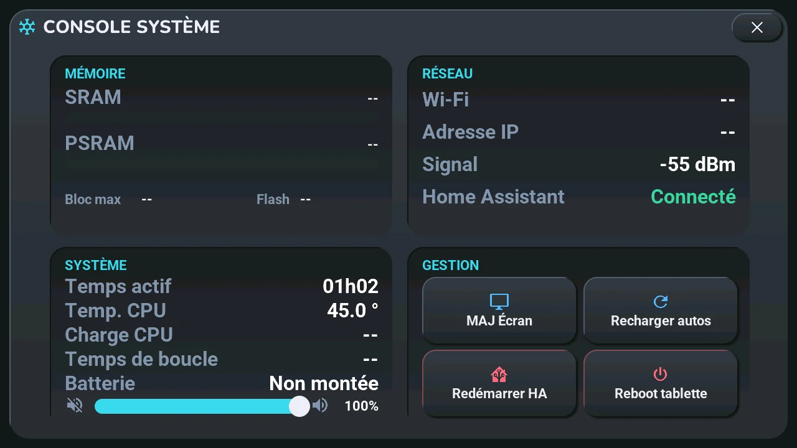

---

## Popup Réglages

Ouvert sur sa page Écran d'un tap sur le bouton engrenage (`btn_control_console`, en haut à droite) ou par « Aller à l'écran → Réglages », sur sa page Système par un appui long sur l'engrenage ou par « Aller à l'écran → Console système » (`reglages_popup.yaml`, le chrome modal partagé de l'ADR-0009 ; scripts dans `tab5-reglages.yaml`, peinture dans `tab5_reglages.cpp`). Quatre pages depuis le 08/10/2026, nommées en haut à côté du titre, la page montrée allumée (`reglages_onglet.yaml`). Une tape sur un nom montre sa page ; glisser à gauche ou à droite dans le popup montre la suivante ou la précédente, en boucle, sans transition. Le popup prend le geste (`LV_EVENT_GESTURE`, sans remontée à `page_main` : l'accueil ne change pas de page derrière) ; un glissement parti d'un curseur ne bouge que le curseur, et la tape au bout d'un glissement ne choisit rien (`ui_appui_glisse()`). Changer de page ou fermer le popup annule une confirmation ouverte.
- **ÉCRAN** — un curseur de luminosité (10-100 %, il écrit lui-même le rétroéclairage), le délai d'extinction auto (Jamais, 1, 2, 5, 10, 30 min), et Oui / Non pour rallumer l'écran à « Okay Nabu » et d'une tape ;
- **APPARENCE** — le thème entre deux flèches (précédent / suivant, en boucle), Sombre / Clair / Auto, Oui / Non pour l'interrupteur de nuit du mode Auto, et les sept langues, chacune écrite dans sa langue. Une langue demande d'abord (Annuler / Confirmer) : la tablette redémarre pour l'appliquer ;
- **BATTERIE** — à gauche les trois réglages de la batterie : la limite de charge (100 % / 80 % : à 80 %, la charge s'arrête à 80 % et reprend à 70 %, pour une tablette toujours branchée), l'économie d'énergie (Jamais, Sur batterie, Toujours) et Oui / Non pour « batterie montée » ; à droite, en lecture seule, l'état (Sur batterie, En charge, Sur USB, Pas de batterie détectée, ou Mesure en cours avant la première lecture), le niveau, la tension et la consommation (« -- » sans batterie). Ces valeurs ne sont repeintes que pendant que la page est montrée (`reglages_batterie_peindre()`) ;
- **SYSTÈME** — l'ancienne console système, décrite [plus haut](#page-système-des-réglages-ancienne-console).

Chaque bouton écrit l'entité de l'appareil que voit Home Assistant (`tab5_reglages_choisir`), et chacune de ces entités repeint le popup quand elle change (`tab5_reglages_sync_ui`, lancé depuis son `on_value` / `on_state`) : un changement fait depuis Home Assistant s'affiche aussitôt, et l'option en vigueur a une bordure d'accent. Le curseur de luminosité est relu à l'ouverture du popup. Les mêmes réglages dans Home Assistant : [réglages de la tablette](installation/settings.md#version-française).

---

## Popup lumière — appui long

Un appui long sur une tuile lumière — ses épaules météo ou sa carte du mode HA — (au lieu du tap court qui la bascule), puis **Détails** sur la roue d'actions rapides (voir plus haut ; une lumière à l'option `k` l'ouvre tout de suite), ouvre un modal quasi plein écran (carte 1250×690, 15 px des bords), organisé en trois cartes de verre :
- **AMPOULE** (gauche) : sélecteur des **lumières de la pièce** (5 au plus, dans l'ordre des tuiles, lignes resserrées au-delà de trois ; icônes colorées selon l'état on/off, bordure cyan sur la sélection, la lumière appuyée sélectionnée) pour changer de lumière sans fermer le popup, gros bouton **On/Off** et **Tout éteindre** (toutes les lumières de la pièce, `pR / eteindre` ; en mode héritage, les trois lumières 3.x)
- **LUMINOSITÉ** (centre) : **arc 320 px** (0–255) avec la valeur **% affichée en direct** au centre — synchronisée depuis l'attribut `brightness` HA à l'ouverture et en live (jamais pendant un drag), débouncée 200 ms pour qu'un glissement n'envoie qu'un seul `light.turn_on` — plus 4 raccourcis 10/35/65/100 %
- **COULEURS** (droite) : 3 blancs nommés (Chaud/Crème/Froid) et une grille 4×3 de **12 pastilles rondes** (chaque pastille envoie `light.turn_on` avec le `color_name` correspondant, factorisées via `light_color_preset_btn.yaml`)
- Taper l'overlay sombre ou le bouton × (le bouton de verre partagé 80×44 de `modal_header.yaml`) ferme le modal

Le popup est contextuel : l'appui long l'ouvre sur la lumière appuyée, et le sélecteur passe par `script.tab5_light_popup_show(light_idx)` (`popup_lumiere_choisir()`, `tab5_tuiles_popups.cpp`) qui règle la globale `current_light_slot` sur la clé de la tuile (`tRT`, ou `lumiere_N` en mode héritage) et synchronise titre, sélecteur, icône power et arc — un seul popup pour toutes les lumières de toutes les pièces.

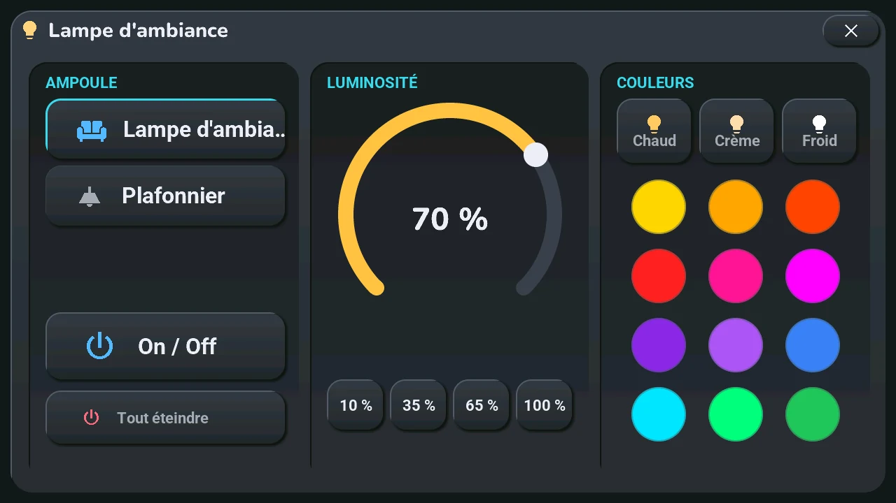

---

## Popup télécommande TV

Une télécommande Samsung quasi plein écran (`tv_remote_popup.yaml`, carte 1250×690 — les tokens modaux partagés de l'ADR-0009, 15 px des bords) : touches marche, source et menu, pad de navigation rond avec OK, colonne du volume avec muet, touches Lecture · Pause · Retour · Accueil et une rangée de boutons d'applications (Netflix, Prime, YouTube, CANAL+, PC). Ouverte par appui long sur une tuile multimédia avec l'option TV (`t` ; la carte PC en mode héritage) ou par un appui long sur le bouton manette (`btn_control_tv`, quand la zone TV est présente) ; chaque touche émet un événement `tab5_action` (`emplacement: tv`, [ADR-0025](decisions/0025-events-only.md)) que l'automatisation du blueprint envoie à la télécommande choisie dans « Télécommande de la TV » (`remote.send_command`), les boutons d'applications par `script.tab5_tv_app` (`tab5_tv.yaml`) — le Tab5 n'a aucun matériel IR, c'est l'intégration Samsung de HA qui fait le travail. Taper l'overlay sombre ferme le popup.

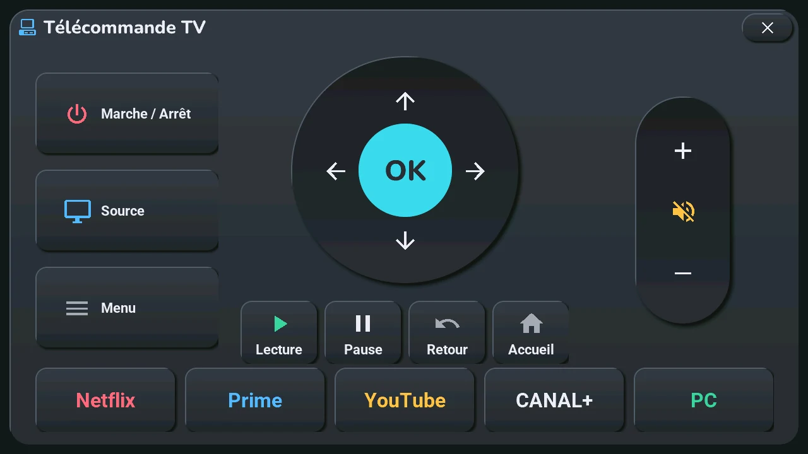

---

## Popup Énergie — installation solaire (facultatif)

N'apparaît que si des capteurs sont choisis dans les sections « Énergie » du blueprint ([ADR-0028](decisions/0028-solar-energy-popup.md)). S'ouvre d'un toucher sur une tuile capteur de ces sections (option de tuile `e` ; le capteur solaire prend l'icône du panneau solaire), d'un appui long sur le bouton HA quand la production solaire est reçue, ou par « Aller à l'écran → Énergie ». Même chrome modal que les autres popups (`energie_popup.yaml`, ADR-0009), dessiné par `tab5_energie.cpp` :

- **En haut, en direct** : jusqu'à quatre cartes de verre — **Solaire** (puissance, production « Aujourd'hui »), **Maison** (consommation), **Réseau** (puissance, « Depuis le réseau » / « Vers le réseau » / « Aucun échange »), **Batterie** (niveau avec une icône de batterie qui le suit, « Charge » / « Décharge » / « Au repos », température). Une carte sans capteur disparaît et les autres se partagent la largeur. Unités courtes (W, kW, kWh).
- **En bas, l'historique** (il faut le capteur d'énergie produite) : le titre donne la période et son total (« Aujourd'hui · 3.20 kWh »), trois boutons passent des **Heures** (24 barres, aujourd'hui) aux **Jours** (30 jours) et aux **Mois** (12 mois). Barres dorées, le créneau en cours dans la couleur d'accent, une ligne au maximum avec sa valeur. Sans ce capteur, les cartes remplissent le popup.
- Avant la réponse de Home Assistant : « En attente de Home Assistant » ; section vide : « Aucun capteur d'énergie choisi ».

HA ne pousse que pendant que le popup est ouvert (package `tab5_energie.yaml`) ; transitions instantanées, comme tous les popups.

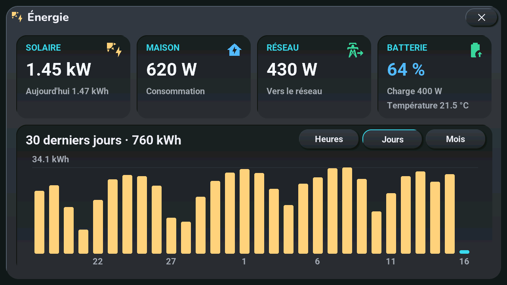

---

## Popup Température — historique et prévision

S'ouvre par un appui long sur l'une des deux températures de l'accueil ([ADR-0032](decisions/0032-temperature-history-popup.md)) : celle de la pièce (emplacement `salon`) ou la seconde (emplacement `serre`, une serre ou dehors). Un tap sur la seconde ouvre toujours l'Arcade.

- **En haut** : **Maintenant** (et la moyenne de la période), **Minimum** et **Maximum** avec leur moment, chacun dans la couleur de température de l'écran. Pour la seconde température, une quatrième carte : la température prévue la plus haute, la plus basse dessous.
- **En bas** : le titre donne le lieu (la pièce du capteur, poussée par HA) et la période ; trois boutons passent de **24 h** (heure par heure) à **7 jours** (toutes les trois heures) et **30 jours** (jour par jour). La ligne d'accent est la moyenne de chaque créneau, finie sur la valeur actuelle (un point) ; une barre pâle derrière elle va du minimum au maximum. Graduations tous les 1, 2, 5, 10… degrés, axe des temps toutes les 3 h, 6 h, un jour…
- **Prévision** (seconde température seulement) : une ligne or sur un fond teinté après le trait « Maintenant », avec les barres mini-maxi or d'une prévision par jour. La case du blueprint « La seconde température est dehors » lui fait prolonger la courbe (« Prévu ») ; décochée, c'est la prévision de dehors à côté d'une serre (« Dehors, prévu »).
- Avant que Home Assistant réponde : « En attente de Home Assistant » ; capteur sans statistiques : « Aucun historique ».

HA pousse une fois par demande, seulement popup ouvert (package `tab5_historique.yaml`, statistiques du recorder et `weather.get_forecasts`) ; la tablette garde les trois vues de la température montrée en PSRAM (~6 Ko), rien en NVS.

---

## Popup Maison — toutes les pièces d'un coup

Ouvert par un tap sur le nom de la pièce en mode HA, ou par « Aller à l'écran → Maison » ([ADR-0037](decisions/0037-house-popup.md), discussion #278). Chrome partagé (ADR-0009), carte de 1250 × 690, titre « Maison ».

- **Une colonne par pièce** du blueprint qui a des appareils, pièce 1 → 5 (l'ordre du blueprint, pas celui des pages), largeur (1250 − 24 − 12 (n − 1)) / n : environ 235 px avec cinq pièces, 607 px avec deux. En-tête : le nom de la pièce, ou « Pièce n » ; « Aucun appareil » sans aucune pièce.
- **Une ligne par appareil** (104 px, carte de verre) : l'icône de la palette (32 px) dans une pastille de 56 px de la couleur de son état, le nom et la ligne d'état, peints par la même `Vue` que la carte du mode HA (`tuile_peindre_ligne()`), coupés avec « … » à la largeur de la colonne.
- **Gestes de la tuile** : le tap, l'appui long et le bouton « ⋯ » (36 px, seulement sur les types qui ont un appui long : ni `cap`, ni `bin`, ni une tuile à l'option `r`) passent par `tuile_appui_piece()` ; l'appui long et « ⋯ » ouvrent d'abord la roue d'actions rapides de la tuile (voir plus haut, sans son lien Maison) autour de la pastille de la ligne, devant le popup Maison, et sans roue le popup de la tuile. Un popup ouvert depuis une ligne ou par le « Détails » de la roue passe devant le popup Maison, qui reste derrière ; l'inactivité ferme les deux.
- **« Éteindre les lumières »** dans la barre de titre, visible quand une pièce a une tuile `lum` : le « Tout éteindre » du popup lumière (`pR` / `eteindre`) pour chacune de ces pièces, sans confirmation.

Rien de nouveau avec Home Assistant : ni événement, ni action, ni entrée de blueprint. Les widgets sont des gabarits YAML (`maison_popup.yaml`, 5 en-têtes, 25 lignes), disposés et peints à chaque ouverture et repeints, tant qu'il est affiché, quand un état ou les définitions changent.

---

## Coloration sémantique

La couleur est utilisée de façon systématique comme canal d'information primaire — pour lire l'état d'un coup d'œil sans lire les labels.

**Températures :** mappées sur une échelle continue via `get_temperature_color()` — bleu (froid) → vert (confortable) → orange (chaud) → rouge (très chaud). Appliqué identiquement aux capteurs intérieurs et aux températures des prévisions.

**Noms des jours en prévisions journalières** (`refresh_daily_forecast()`, `tab5_*.cpp`) :
- Cyan — aujourd'hui
- Vert — jour de repos (hors dimanche)
- Ambre — dimanche, repos
- Rose/Rouge — dimanche travaillé, **ou** tout jour avec une prise de service avant 09:00 ("service tôt")
- Ardoise estompée — jour passé (prend le dessus sur les couleurs précédentes une fois le jour passé)

**Humidité des plantes (`get_humidity_color()`) :**
- Rouge — ≤ 14% (très sec, besoin d'arrosage)
- Dégradé vert → blanc cassé — 30–80%
- Bleu — ≥ 80% (trop humide)

**Batteries (`get_battery_color()`)** — icônes du téléphone, de la tablette et de la production solaire dans la barre d'état (solaire : panneau gris à 0 %), ligne Batterie du popup détails plantes :
- Vert — au-dessus de 80 %
- Bleu — 41 à 80 %
- Ambre — 20 à 40 %
- Rouge — sous 20 %
- Gris — inconnu

**Icône microphone :** voir Assistant vocal ci-dessus.

Toutes les couleurs de l'interface vivent dans une palette, `struct Palette` de `tab5_tokens.h` (inclus par `tab5_custom.h`) ; `UIColor` est la palette active. Le YAML les prend par les styles de rôle de `tab5-styles.yaml` (`style_text_dim`…), les jeux gardent leurs palettes sombres ([ADR-0029](decisions/0029-themes-palette.md)). Vingt et un thèmes, chacun en sombre et en clair, changent les couleurs, les formes (rayons, bordures, ombres) et les polices de l'heure, de la date et des titres ; une tablette neuve démarre en « Relief doux ».

Le thème, le mode (Sombre, Clair, Auto) et l'interrupteur « Nuit (thème auto) » sont des entités de la tablette, aussi dans le popup Réglages : [réglages de la tablette](installation/settings.md#thème-clair-ou-sombre).

---

## Contrôle du volet roulant

Depuis la 3.2, chaque tuile `vol` est un volet ou une vanne à elle seule (appui court : arrêter s'il bouge, sinon fermer s'il est ouvert, ouvrir sinon ; l'épaule droite montre la flèche du prochain mouvement).

**Popup du volet — appui long** (05/10/2026, demandé dans la [discussion #278](https://github.com/Axellum/M5-Tab5-ESPHome-LVGL/discussions/278) ; [ADR-0023](decisions/0023-rooms-generic-tiles.md), mises à jour du 05/10/2026 et du 06/10/2026). Un appui long sur une tuile `vol` — ses épaules météo ou sa carte du mode HA —, puis **Détails** sur la roue d'actions rapides (07/10/2026, voir plus haut), ouvre un modal quasi plein écran (`volet_popup.yaml`, chrome partagé de l'ADR-0009) au nom de la tuile, en deux cartes de verre :
- **POSITION** (gauche) : un **volet dessiné** (06/10/2026, « comme l'animation de HA, pas un simple curseur ») : une fenêtre dont le tablier à lames descend du coffre quand la position baisse (12 lames créées en C++, `lames_construire()`). On le fait glisser du doigt, vers le haut ou le bas, n'importe où sur la fenêtre : le tablier et le nombre suivent le doigt, et la position ne part **qu'au relâcher** (`position`, `cover.set_cover_position` / `valve.set_valve_position` sur l'entité de cette tuile, si elle sait en régler une) ; un toucher qui ne bouge pas (moins de 12 px) n'envoie rien. À sa droite, la position en grand (« 45 % ») et l'état en mots dessous (« Ouvert », « Fermé », « Partiel », « En mouvement », « Hors ligne »). Un volet qui ne donne pas sa position (ou le volet à course simulée de `optionnel/volet_serre_tracking.yaml`) ne se fait pas glisser et n'a pas de nombre : le dessin montre son état (ouvert = tablier en haut, fermé = en bas, le reste = à mi-hauteur, lames estompées) et les mots.
- **COMMANDES** (droite) : **Ouvrir**, **Stop** et **Fermer**, les commandes de la tuile ; chaque icône dans une pastille ronde teintée, comme une tuile de Home Assistant.
- Le popup suit le volet tant qu'il est ouvert (position, état) : chaque position poussée redessine le tablier tout de suite, sans animation à lui (le volet dessiné descend comme le vrai, poussée après poussée), jamais sous le doigt. Avec l'option `k`, l'appui long envoie toujours l'autre de ouvrir / fermer (confirmé par un second appui) ; option `r` : rien. En mode héritage, le volet 3.x (`tab5_maj_volet_etat`) est la tuile 1 de l'accueil : sa carte météo a l'inversion de sens (tap sur le titre) et le bouton d'action (tap sur l'icône) décrits plus haut, et sa carte du mode HA partage le même `script.tab5_volet_tap`.

## Popup d'un appareil

**Appui long sur un interrupteur, une scène ou un lecteur** (06/10/2026, demandé dans la [discussion #278](https://github.com/Axellum/M5-Tab5-ESPHome-LVGL/discussions/278) : « buttons can have pop up screen like ha dashboard » ; [ADR-0023](decisions/0023-rooms-generic-tiles.md), mise à jour du 06/10/2026). Un appui long sur une tuile `int` ou `act`, ou sur une tuile `med` sans l'option `t` (avec `t`, la télécommande TV) — ses épaules météo ou sa carte du mode HA — ouvre la fenêtre « plus d'infos » d'un tableau de bord Home Assistant pour cet appareil : un modal quasi plein écran (`appareil_popup.yaml`, chrome partagé de l'ADR-0009, inscrit « Appareil ») au nom de la tuile, en deux cartes de verre :
- **ÉTAT** (gauche) : l'icône de la tuile dans une pastille ronde de la couleur de son état (la couleur à 20 %, l'icône pleine), l'état en mots comme sur la carte du mode HA (« Allumé », « Éteint », « Lecture », « Pause », « Hors ligne » ; « Prêt », ou « En cours » pour un script en route, pour une `act`), la pièce, et les options de la tuile en mots (`o` : « Allumer seulement », `k` : « Confirmer chaque commande »).
- **COMMANDE** (droite) : un grand interrupteur vertical (180 × 380 px) — rempli en haut dans la couleur de l'état quand l'appareil est allumé, en bas et gris quand il est éteint, plein pour une `act` — et dessous ce que fera l'appui (« Éteindre », « Allumer », « Lancer »). L'appui fait **le toucher de la tuile**, par la même fonction (`tuile_appui_piece`) : même commande (`basculer`, `allumer` avec `o`, `lancer`), même confirmation avec `k` (« Confirmer ? » en ambre ; un second appui dans les 3 s envoie), même « OK » après `lancer`. Aucune commande nouvelle, rien de changé côté Home Assistant.
- Le popup suit sa tuile tant qu'il est ouvert. Option `r` (lecture seule) : pas de popup, comme pas de toucher. Il ne montre que ce que HA pousse déjà pour les tuiles : ni « dernière modification », ni attributs, ni historique.

---

## Arcade — 8 consoles de jeu (expérimental)

> **Statut : prototypes précoces.** Premiers jets générés par IA pour tester les capacités de LVGL + C++ sur ESP32-P4. Fonctionnels mais non finalisés — preuve de concept, pas produit fini.

Ouvert par **tap sur le bouton manette** (`btn_control_tv`, en haut à droite) ou **sur la température serre** (`btn_serre_games` dans `climate_card.yaml`). Le sélecteur affiche une grille 4×2 de 8 cartes (298×252 chacune), avec icône MDI, nom du jeu, et description courte.

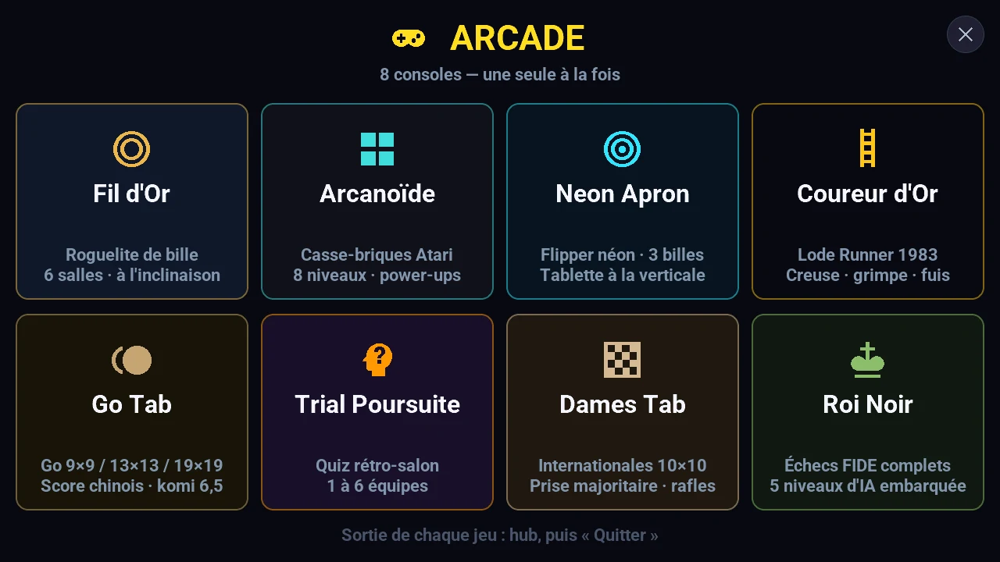

Chaque console est sa **propre page LVGL** plein écran 1280×720 (`page_marble`, `page_chess`… déclarées `skip: true` dans `tab5-lvgl.yaml`, pour que le swipe ne puisse pas y naviguer) — pas un overlay posé sur le dashboard. Exception documentée ADR-0009 : pas de chrome modal. Architecture commune : YAML = conteneurs vides, tout le contenu en C++, `lv_timer` créé à l'ouverture / détruit à la fermeture, pool LVGL préalloué (zéro allocation dans le tick), persistance NVS, **zéro dépendance HA ou réseau**.

| # | Console | Description | Contrôles |
|---|---------|-------------|----------|
| 1 | **Fil d'Or** | Roguelite de bille, 6 salles, progression Dark Souls | Inclinaison BMI270 |
| 2 | **Arcanoïde** | Casse-briques 8 niveaux, power-ups, combo | Inclinaison + tactile |
| 3 | **Neon Apron** | Flipper néon 3 billes — **bascule l'écran en portrait 720×1280** | Zones tactiles + nudge IMU |
| 4 | **Coureur d'Or** | Lode Runner 10 niveaux, creuser & grimper | D-pad tactile |
| 5 | **Go Tab** | Go 9×9/13×13/19×19, score chinois (komi 6,5), IA 4 niveaux | Tactile |
| 6 | **Trial Poursuite** | Quiz 1–6 équipes, roue 42 cases + 6 rayons | Tactile |
| 7 | **Dames Tab** | Dames 10×10 internationales (option 8×8 anglaises), IA 4 niveaux | Tactile |
| 8 | **Roi Noir** | Échecs FIDE, 5 niveaux IA, perft validé | Tactile |

| Roi Noir (échecs) | Arcanoïde (casse-briques) |
|:-:|:-:|
| 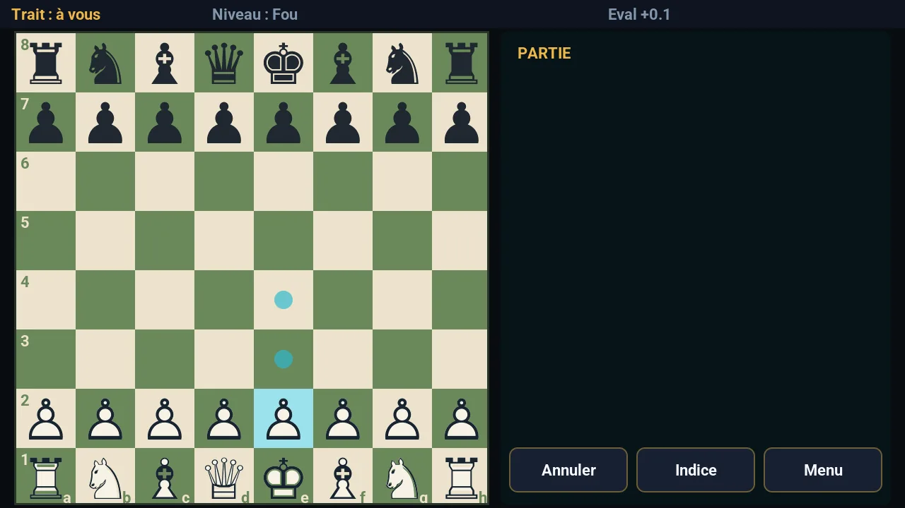 | 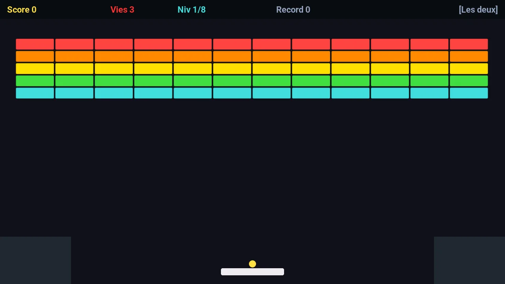 |

| Coureur d'Or (Lode Runner) |
|:-:|
| 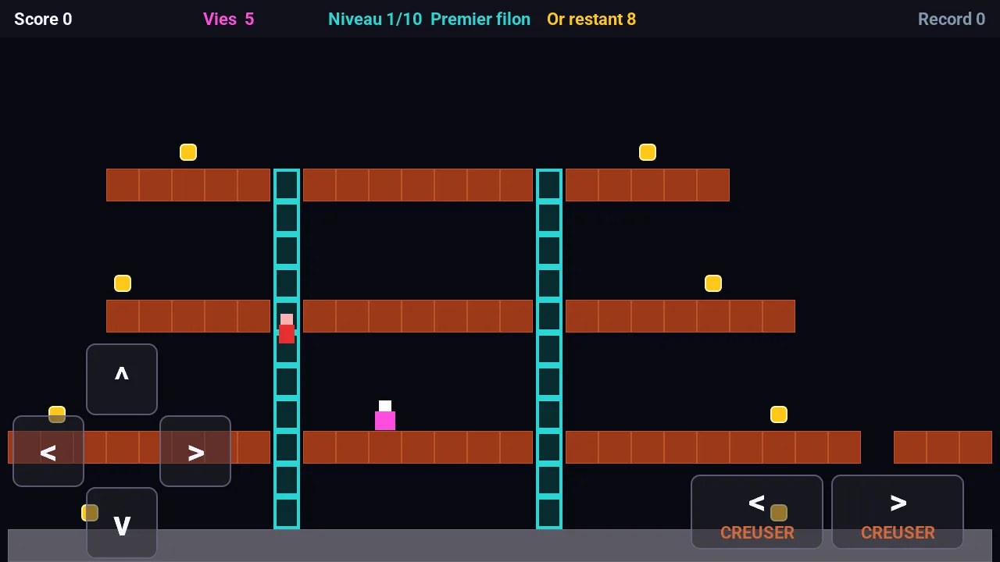 |

Sortie de chaque jeu : hub → « Quitter » (retour propre à `page_arcade` puis au dashboard : timer arrêté, score sauvegardé en NVS, et pour Neon Apron restauration de la rotation paysage).

→ Détails techniques complets par jeu : [`docs/arcade.md`](arcade.md)
